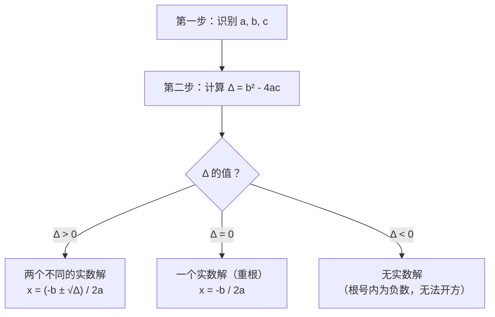

# 一元二次方程

> **所属路径**：`00_高中复习/01_数学基础/01_代数与方程/01_一元二次方程`
> **预计学习时间**：60 分钟
> **难度等级**：⭐

---

## 前置知识

- 基本四则运算与分数运算
- 一元一次方程的求解（如 $2x + 3 = 7$）

> 本节是整个课程体系的第一课，不需要额外的前置课程。如果你能解一元一次方程，就可以开始了。

---

## 学习目标

完成本节后，你将能够：

1. 写出一元二次方程的标准形式，并准确识别系数 $a$、 $b$、 $c$
2. 使用因式分解法、配方法和求根公式三种方法求解一元二次方程
3. 通过判别式判断方程解的个数，并解释其背后的原因
4. 解释一元二次方程与抛物线之间的对应关系

---

## 正文讲解

### 1. 为什么要学一元二次方程？

在正式开始之前，我们先来聊一个问题：为什么一元二次方程值得你花时间学习？

你已经会解一元一次方程了，比如 $2x + 3 = 7$，答案是 $x = 2$。一元一次方程描述的是"等速变化"——一个量和另一个量之间是简单的线性关系。但现实世界中，很多现象并不是线性的。比如物体在空中的运动轨迹是弯曲的，利润和定价之间的关系也不是一条直线。当我们试图用数学描述这些"弯曲"的关系时，就会自然而然地遇到含有 $x^2$ 的方程。

在人工智能领域，这一点尤为突出。机器学习模型训练的核心任务是**最小化损失函数**——而损失函数通常就像一个碗形曲面，其最简单的形式正是二次函数。所以，理解二次方程，是你理解机器学习背后数学原理的第一步。

带着这个动机，让我们从一个具体的生活场景出发。


### 2. 从一个实际问题开始

想象你在设计一个正方形花坛，四周要铺一圈等宽的小路。已知花坛面积是 16 平方米，加上小路后总面积是 36 平方米。问题来了：**小路宽度是多少？**

我们来用数学语言描述这个问题。设小路宽度为 $x$ 米。花坛是正方形，面积 16 平方米，所以花坛边长为 4 米（因为 $4^2 = 16$）。加上两侧的小路后，总边长变成了 $(4 + 2x)$ 米，总面积为：

$$
(4 + 2x)^2 = 36
$$

我们把左边展开看看会得到什么：

$$
4x^2 + 16x + 16 = 36
$$

把右边的 36 移过来：

$$
4x^2 + 16x - 20 = 0
$$

仔细观察这个方程：它包含 $x^2$ 项、 $x$ 项和常数项，未知数 $x$ 的最高次数是 2。这就是我们今天的主角——**一元二次方程（Quadratic Equation in One Variable）**。"一元"指只有一个未知数，"二次"指未知数的最高幂次为 2。


### 3. 标准形式：给方程一个统一的"长相"

不同的问题会产生不同形式的一元二次方程，为了方便研究和求解，数学家们约定了一个统一的写法，叫做**标准形式（Standard Form）**：

$$
ax^2 + bx + c = 0 \quad (a \neq 0)
$$

这里 $a$、 $b$、 $c$ 是已知的数（称为系数）， $x$ 是我们要求的未知数。

> **直觉解读**：你可以把这三个系数想象成控制方程"性格"的三个旋钮：
> - $a$ 控制"弯曲程度"—— $a$ 越大，方程对应的抛物线弯得越厉害
> - $b$ 控制"左右偏移"—— $b$ 的正负影响抛物线向哪边倾斜
> - $c$ 控制"上下位移"—— $c$ 决定了抛物线在纵轴上的起始高度

想一想：**为什么要求 $a \neq 0$？** 如果 $a = 0$，方程就变成了 $bx + c = 0$，那就只是一个一元一次方程了——$x^2$ 项消失了，就不再是"二次"方程了。

回到我们的花坛问题： $4x^2 + 16x - 20 = 0$，对照标准形式可以读出 $a = 4$， $b = 16$， $c = -20$。为了计算方便，我们可以把方程两边同时除以 4（这不会改变方程的解），得到更简洁的形式：

$$
x^2 + 4x - 5 = 0
$$

好了，方程写好了。现在关键的问题来了：**怎么求出 $x$ 的值？** 接下来我们将学习三种求解方法，它们各有所长。


### 4. 方法一：因式分解法——"拆"出答案

第一种方法叫**因式分解（Factoring）**，它的核心思想非常直观：如果我们能把方程左边"拆"成两个简单因式的乘积，问题就迎刃而解了。

以花坛问题 $x^2 + 4x - 5 = 0$ 为例。我们希望把 $x^2 + 4x - 5$ 拆成 $(x + m)(x + n)$ 的形式。展开这个乘积会得到 $x^2 + (m+n)x + mn$，所以我们需要找到两个数 $m$ 和 $n$，使得：

- 它们的**和**等于 $b$ 的系数，即 $m + n = 4$
- 它们的**积**等于 $c$ 的值，即 $m \times n = -5$

想一想：哪两个数相乘等于 $-5$，同时相加等于 $4$？

试试看： $5 \times (-1) = -5$ ✓， $5 + (-1) = 4$ ✓。找到了！所以：

$$
x^2 + 4x - 5 = (x + 5)(x - 1) = 0
$$

这里用到了一个重要的数学事实：**如果两个数的乘积为零，那么至少有一个数必须为零**（这叫做"零乘积性质"）。因此：

$$
x + 5 = 0 \Rightarrow x = -5 \quad \text{或} \quad x - 1 = 0 \Rightarrow x = 1
$$

我们得到了两个解。回到花坛问题的实际意义，小路宽度不可能是负数，所以 $x = 1$ 米就是我们要的答案。

因式分解法简洁而优雅，但它有一个明显的局限性：**并非所有方程都容易找到整数因子**。比如 $x^2 + 3x - 7 = 0$，你很难找到两个整数的积为 $-7$ 且和为 $3$。遇到这种情况怎么办？别担心，我们还有更通用的方法。


### 5. 方法二：配方法——把方程"凑"成完美形状

前面我们学会了因式分解法，但它对方程的系数有要求。现在我们来学一种**对任何一元二次方程都适用**的方法——**配方法（Completing the Square）**。

配方法的核心思路是：既然方程左边不好直接分解，那我们就人为地把它"凑"成一个**完全平方式**（也就是 $(x + p)^2$ 的形式），然后直接开方求解。

让我们用一个新例子 $x^2 + 6x + 5 = 0$ 来演示这个过程，一步一步来：

**第一步——腾出空间**：先把常数项移到等号右边，让左边只留下含 $x$ 的项：

$$
x^2 + 6x = -5
$$

**第二步——"配"出完全平方**：关键操作来了！取一次项系数 $6$ 的一半得到 $3$，再平方得到 $9$，然后把 $9$ 加到等号两边（注意：两边都要加，才能保持等式成立）：

$$
x^2 + 6x + 9 = -5 + 9
$$

为什么要加 $9$ 呢？因为 $x^2 + 6x + 9$ 恰好等于 $(x + 3)^2$——这就是"完全平方式"！你可以展开验证： $(x+3)^2 = x^2 + 2 \times x \times 3 + 3^2 = x^2 + 6x + 9$。✓

**第三步——化简**：现在等式变成了非常优美的形式：

$$
(x + 3)^2 = 4
$$

**第四步——开方求解**：对等号两边取平方根。注意，平方根有正负两个值：

$$
x + 3 = \pm 2
$$

所以：

$$
x = -3 + 2 = -1 \quad \text{或} \quad x = -3 - 2 = -5
$$

> 📌 **为什么叫"配方"？** 就像拼图一样，我们人为地往方程里"配"了一个数（这里是 $9$），让它恰好凑成一个完全平方式。这个技巧看似简单，但它的思想非常深远——后续学习 **[导数初步](../../12_导数初步/)** 和最优化时你会再次遇到它，因为很多优化问题的本质就是"配方后找最值"。

配方法虽然对任何一元二次方程都有效，但每次都要手动配方确实有些繁琐。你可能会想：**有没有一个万能公式，直接代入系数就能算出答案？** 答案是：有！这就是接下来要介绍的求根公式。


### 6. 方法三：求根公式——一劳永逸的万能工具

我们能不能对一般的标准形式 $ax^2 + bx + c = 0$ 直接用配方法推导出一个通用结果呢？当然可以！数学家们已经帮我们做好了这个推导（你也可以自己试试，这是一个很好的配方法练习），最终得到的就是**求根公式（Quadratic Formula）**：

$$
x = \frac{-b \pm \sqrt{b^2 - 4ac}}{2a}
$$

> **直觉解读**：这个公式的强大之处在于，它把"解方程"这个需要思考和尝试的过程，变成了"代入数字做计算"的机械操作。无论方程的系数多复杂，只要知道 $a$、 $b$、 $c$ 的值，代入公式就能得到答案。这种"把问题转化为固定步骤"的思想，也正是后续学习**算法**和**编程**时最核心的理念。

让我们用求根公式回头验证花坛问题 $x^2 + 4x - 5 = 0$（ $a = 1, b = 4, c = -5$）：

$$
x = \frac{-4 \pm \sqrt{4^2 - 4 \times 1 \times (-5)}}{2 \times 1} = \frac{-4 \pm \sqrt{16 + 20}}{2} = \frac{-4 \pm \sqrt{36}}{2} = \frac{-4 \pm 6}{2}
$$

$$
x = \frac{-4 + 6}{2} = 1 \quad \text{或} \quad x = \frac{-4 - 6}{2} = -5
$$

和因式分解法得到的结果完全一致！这验证了求根公式的正确性。

现在我们有了三种方法，什么时候用哪种呢？一般来说：
- 如果一眼就能看出因式分解，那因式分解法最快
- 如果需要理解推导过程或方程结构，配方法最清晰
- 如果什么都不确定，**求根公式永远管用**——它是你的"保底方案"


### 7. 判别式：不解方程就能知道有几个解

在使用求根公式时，你可能注意到了一个关键部分——根号下面的表达式 $b^2 - 4ac$。这个表达式有一个专门的名字，叫做**判别式（Discriminant）**，通常用希腊字母 $\Delta$（读作"Delta"）来表示：

$$
\Delta = b^2 - 4ac
$$

为什么它很重要？因为根号里面的数**决定了方程解的情况**：

- 如果根号里面是正数，可以正常开方，而且有正负两个值，所以方程有**两个不同的实数解**
- 如果根号里面是零， $\sqrt{0} = 0$，正负都一样，所以方程只有**一个实数解**（数学上称为"重根"）
- 如果根号里面是负数——问题来了！负数不能开平方（至少在实数范围内不能），所以方程**没有实数解**

用一张流程图来总结这个判断过程：



> 📌 **图解说明**：判别式就像一个"预判器"——不需要真正解方程，只要算出 $\Delta$ 的值，就能提前知道方程有多少个解。这种"先判断再行动"的思维方式，在编程中也非常常用（比如先检查数据是否合法，再进行计算）。

为了巩固理解，让我们用三个例子来实际操练判别式的使用：

| 方程 | $a$ | $b$ | $c$ | $\Delta = b^2 - 4ac$ | 判断过程 | 解的情况 |
| ---- | --- | --- | --- | --------------------- | -------- | -------- |
| $x^2 - 5x + 6 = 0$ | 1 | -5 | 6 | $(-5)^2 - 4(1)(6) = 25 - 24 = 1$ | $1 > 0$ ✓ | 两个解： $x = 2, x = 3$ |
| $x^2 - 4x + 4 = 0$ | 1 | -4 | 4 | $(-4)^2 - 4(1)(4) = 16 - 16 = 0$ | $0 = 0$ | 一个解： $x = 2$（重根） |
| $x^2 + x + 1 = 0$ | 1 | 1 | 1 | $1^2 - 4(1)(1) = 1 - 4 = -3$ | $-3 < 0$ ✗ | 无实数解 |

看到了吗？仅仅通过计算一个简单的表达式 $b^2 - 4ac$，我们就能对方程的解了如指掌，完全不需要真正去解它。


### 8. 方程与抛物线的关系：从代数到几何

到目前为止，我们一直在用代数方法处理方程。但数学的美妙之处在于，同一个问题往往可以从多个角度来理解。现在让我们换一个视角——**用图形来"看"方程的解**。

如果我们把方程 $ax^2 + bx + c = 0$ 左边的表达式看作一个函数 $y = ax^2 + bx + c$，那么这个函数的图像是一条**抛物线（Parabola）**——就像你把一个球向上抛出后它在空中划过的弧线。

方程 $ax^2 + bx + c = 0$ 的解，就是让 $y = 0$ 的那些 $x$ 值。在图像上， $y = 0$ 就是 $x$ 轴。所以，**方程的解就是抛物线与 $x$ 轴的交点的横坐标**。

下面这张图展示了判别式 $\Delta$ 的三种取值对应的抛物线与 $x$ 轴的位置关系：


> 📌 **图解说明**：左图 $\Delta > 0$ 时抛物线与 $x$ 轴有两个交点（对应两个不同的实数解）；中图 $\Delta = 0$ 时抛物线恰好与 $x$ 轴相切，只有一个接触点（对应一个重根）；右图 $\Delta < 0$ 时抛物线完全不与 $x$ 轴相交（无实数解）。你可以运行 `code/plot_parabola.py` 自行生成这张图。

这种"代数问题用图像理解"的思维方式，将在后续学习 **[函数与图像](../../02_函数与图像/)** 时得到更深入的展开。而在人工智能中，这种几何直觉尤为重要——训练神经网络时，损失函数的图像就像一个高维的"碗形曲面"，而训练过程就是在这个曲面上寻找最低点。

---

## 动手实践

前面我们学习了三种解方程的方法，其中求根公式是最通用的。现在让我们把求根公式"翻译"成 Python 代码，亲手体验一下"用程序解数学题"是什么感觉。这也是我们第一次将数学知识和编程结合——在后续的课程中，这种结合会越来越紧密。

```python
# 文件：code/quadratic_solver.py
# 一元二次方程求解器
# 环境要求：Python 3.10+（无需额外库）

import math

def solve_quadratic(a: float, b: float, c: float) -> str:
    """
    求解一元二次方程 ax² + bx + c = 0
    返回解的情况和结果
    """
    if a == 0:
        raise ValueError("a 不能为 0，否则不是二次方程")

    # 计算判别式
    delta = b**2 - 4 * a * c

    print(f"方程：{a}x² + {b}x + {c} = 0")
    print(f"判别式 Δ = {b}² - 4×{a}×{c} = {delta}")

    if delta > 0:
        x1 = (-b + math.sqrt(delta)) / (2 * a)
        x2 = (-b - math.sqrt(delta)) / (2 * a)
        print(f"Δ > 0，方程有两个不同的实数解：")
        print(f"  x₁ = {x1}")
        print(f"  x₂ = {x2}")
        return f"x₁ = {x1}, x₂ = {x2}"
    elif delta == 0:
        x = -b / (2 * a)
        print(f"Δ = 0，方程有一个实数解（重根）：")
        print(f"  x = {x}")
        return f"x = {x}"
    else:
        print(f"Δ < 0，方程无实数解")
        return "无实数解"


if __name__ == "__main__":
    # 示例 1：花坛问题 x² + 4x - 5 = 0
    print("=" * 40)
    print("示例 1：花坛问题")
    solve_quadratic(1, 4, -5)

    # 示例 2：重根情况 x² - 4x + 4 = 0
    print("\n" + "=" * 40)
    print("示例 2：重根情况")
    solve_quadratic(1, -4, 4)

    # 示例 3：无实数解 x² + x + 1 = 0
    print("\n" + "=" * 40)
    print("示例 3：无实数解")
    solve_quadratic(1, 1, 1)
```

**运行说明**：
- 环境要求：Python 3.10+（仅使用标准库 `math`）
- 运行命令：`python code/quadratic_solver.py`

**预期输出**：
```
========================================
示例 1：花坛问题
方程：1x² + 4x + -5 = 0
判别式 Δ = 4² - 4×1×-5 = 36
Δ > 0，方程有两个不同的实数解：
  x₁ = 1.0
  x₂ = -5.0

========================================
示例 2：重根情况
方程：1x² + -4x + 4 = 0
判别式 Δ = -4² - 4×1×4 = 0
Δ = 0，方程有一个实数解（重根）：
  x = 2.0

========================================
示例 3：无实数解
方程：1x² + 1x + 1 = 0
判别式 Δ = 1² - 4×1×1 = -3
Δ < 0，方程无实数解
```

仔细看这段代码，你会发现它的逻辑和我们前面讲的判别式流程图完全一致：先算 $\Delta$，然后根据 $\Delta$ 的正负走不同的分支。这种"把数学公式翻译成程序逻辑"的能力，是学习人工智能时最基本也最重要的技能之一。

---

## 典型误区

在学习一元二次方程时，初学者容易踩一些"坑"。下面列出最常见的误区，帮助你提前避开：

| 误区 | 正确理解 |
| ---- | -------- |
| 认为一元二次方程一定有两个不同的解 | 方程可能有两个解、一个解（重根）或无实数解，取决于判别式 $\Delta$ 的正负 |
| 配方法中只在等号一边加数 | 配方时，等号两边必须同时加上相同的值，否则等式就不成立了。这是"等式性质"的基本要求 |
| 使用求根公式时 $\pm$ 只取正号 | $\pm$ 代表两种情况——"加"和"减"——必须都算，对应方程可能的两个解 |
| 认为 $\Delta < 0$ 就表示"方程无解" | 更准确的说法是"无实数解"。在复数范围内，方程仍然有解，不过这要等到后续更高阶的数学课程才会学到 |
| 解出来就完了，不检验答案 | 好习惯是把求出的 $x$ 代回原方程验证，尤其在应用题中还要检查答案是否符合实际意义（如长度不能为负） |

---

## 练习题

### 练习 1：识别标准形式（难度：⭐）

将以下方程整理为标准形式 $ax^2 + bx + c = 0$，并写出 $a$、 $b$、 $c$ 的值。整理时，你需要把所有项移到等号左边，展开括号后合并同类项。

1. $3x^2 = 12$
2. $x(x - 3) = 10$
3. $(x + 1)^2 = 2x + 5$

<details>
<summary>💡 提示</summary>

第 1 题：直接把右边的 12 移过来。第 2 题：先展开左边的 $x(x-3)$。第 3 题：先展开 $(x+1)^2 = x^2 + 2x + 1$，再把右边移过来合并同类项。

</details>

<details>
<summary>✅ 参考答案</summary>

1. $3x^2 - 12 = 0$， $a = 3, b = 0, c = -12$
2. 展开得 $x^2 - 3x = 10$，整理为 $x^2 - 3x - 10 = 0$， $a = 1, b = -3, c = -10$
3. 展开得 $x^2 + 2x + 1 = 2x + 5$，两边消去 $2x$ 得 $x^2 + 1 = 5$，即 $x^2 - 4 = 0$， $a = 1, b = 0, c = -4$

</details>

### 练习 2：用求根公式求解（难度：⭐）

用求根公式求解以下方程，写出完整的计算过程：

$$2x^2 - 7x + 3 = 0$$

<details>
<summary>💡 提示</summary>

先识别 $a = 2, b = -7, c = 3$，然后代入求根公式 $x = \frac{-b \pm \sqrt{b^2 - 4ac}}{2a}$。注意 $b = -7$，所以 $-b = 7$。

</details>

<details>
<summary>✅ 参考答案</summary>

第一步，计算判别式： $\Delta = (-7)^2 - 4 \times 2 \times 3 = 49 - 24 = 25$

第二步，代入求根公式： $x = \frac{7 \pm \sqrt{25}}{2 \times 2} = \frac{7 \pm 5}{4}$

第三步，分别计算两个解：

$$x_1 = \frac{7 + 5}{4} = \frac{12}{4} = 3, \quad x_2 = \frac{7 - 5}{4} = \frac{2}{4} = \frac{1}{2}$$

验证： $2(3)^2 - 7(3) + 3 = 18 - 21 + 3 = 0$ ✓； $2(\frac{1}{2})^2 - 7(\frac{1}{2}) + 3 = \frac{1}{2} - \frac{7}{2} + 3 = 0$ ✓

</details>

### 练习 3：判别式应用（难度：⭐⭐）

不解方程，仅通过判别式判断以下方程各有几个实数解，并说明理由：

1. $x^2 - 6x + 9 = 0$
2. $2x^2 + 3x + 5 = 0$
3. $x^2 - 2x - 8 = 0$

<details>
<summary>💡 提示</summary>

只需计算 $\Delta = b^2 - 4ac$，然后判断它是正数、零还是负数。不需要真正去解方程。

</details>

<details>
<summary>✅ 参考答案</summary>

1. $\Delta = (-6)^2 - 4(1)(9) = 36 - 36 = 0$， $\Delta = 0$，所以方程有**一个实数解**（重根）
2. $\Delta = 3^2 - 4(2)(5) = 9 - 40 = -31$， $\Delta < 0$，所以方程**无实数解**
3. $\Delta = (-2)^2 - 4(1)(-8) = 4 + 32 = 36$， $\Delta > 0$，所以方程有**两个不同的实数解**

</details>

### 练习 4：编程实践（难度：⭐⭐）

修改 `code/quadratic_solver.py` 中的 `solve_quadratic` 函数，使其在有两个实数解时，额外输出两个解的和与积，并验证以下关系是否成立：

- 两解之和 $x_1 + x_2 = -\frac{b}{a}$
- 两解之积 $x_1 \cdot x_2 = \frac{c}{a}$

这个关系叫做**韦达定理（Vieta's Formulas）**，它揭示了方程的解与系数之间的直接联系。

<details>
<summary>💡 提示</summary>

在 `delta > 0` 的分支中，计算 `x1 + x2` 和 `x1 * x2`，然后与 `-b/a` 和 `c/a` 进行比较，看是否相等。

</details>

<details>
<summary>✅ 参考答案</summary>

在 `delta > 0` 的分支中，`return` 语句之前添加以下代码：

```python
# 验证韦达定理
print(f"  x₁ + x₂ = {x1 + x2}（理论值 -b/a = {-b/a}）")
print(f"  x₁ × x₂ = {x1 * x2}（理论值 c/a = {c/a}）")
```

运行后你会看到实际计算的和、积与韦达定理的理论值完全一致，这验证了韦达定理的正确性。

</details>

---

## 下一步学习

- 📖 下一个知识点：[不等式与绝对值](../02_不等式与绝对值/) — 学会用不等式描述变量的取值范围，理解绝对值的几何意义
- 🔗 相关知识点：[函数与图像](../../02_函数与图像/) — 深入理解抛物线与二次函数的图像性质，掌握"数形结合"的思想
- 📚 拓展阅读：[导数初步](../../12_导数初步/) — 配方法中"凑完全平方"的思想在求最值时会再次出现

---

## 参考资料

> 以下资源均为公开可访问的免费内容。

1. [维基百科：一元二次方程](https://zh.wikipedia.org/wiki/一元二次方程) — 一元二次方程的定义、求解方法和历史（公共知识库，CC BY-SA 许可）
2. [Khan Academy: Quadratic Equations](https://www.khanacademy.org/math/algebra/x2f8bb11595b61c86:quadratic-functions-equations) — 可汗学院的二次方程互动课程，含视频和练习题（免费公开课程）
3. [Python 官方文档：math 模块](https://docs.python.org/zh-cn/3/library/math.html) — 本节代码中使用的 `math.sqrt` 函数的官方说明（官方文档）
