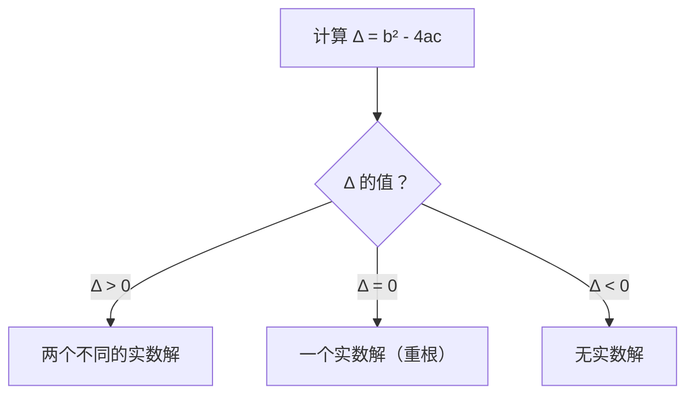
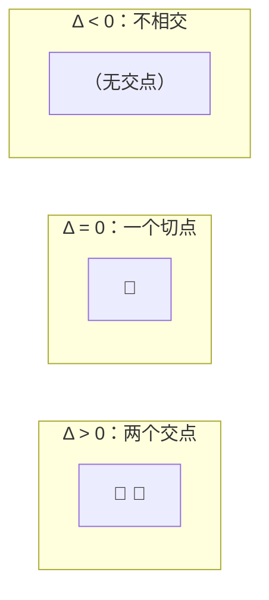

# 一元二次方程

> **所属路径**：`00_高中复习/01_数学基础/01_代数与方程/01_一元二次方程`
> **预计学习时间**：45 分钟
> **难度等级**：⭐

---

## 前置知识

- 基本四则运算与分数运算
- 一元一次方程的求解（如 $2x + 3 = 7$）

> 本节是整个课程体系的第一课，不需要额外的前置课程。如果你能解一元一次方程，就可以开始了。

---

## 学习目标

完成本节后，你将能够：

1. 写出一元二次方程的标准形式，并识别系数 $a$、$b$、$c$
2. 使用因式分解法、配方法和求根公式三种方法求解一元二次方程
3. 通过判别式判断方程解的个数
4. 解释一元二次方程与抛物线的关系

---

## 正文讲解

### 从一个实际问题开始

想象你在设计一个正方形花坛，四周要铺一圈等宽的小路。花坛面积是 16 平方米，加上小路后总面积是 36 平方米。小路宽度是多少？

设小路宽度为 $x$ 米，花坛边长为 4 米（因为 $4^2 = 16$）。加上两侧小路后，总边长为 $(4 + 2x)$ 米，于是：

$$
(4 + 2x)^2 = 36
$$

展开后得到：

$$
4x^2 + 16x + 16 = 36
$$

$$
4x^2 + 16x - 20 = 0
$$

这就是一个典型的**一元二次方程（Quadratic Equation in One Variable）**——含有一个未知数，且未知数的最高次数为 2 的方程。

### 标准形式

任何一元二次方程都可以整理为**标准形式（Standard Form）**：

$$
ax^2 + bx + c = 0 \quad (a \neq 0)
$$

> **直觉解读**：$a$ 控制"弯曲程度"，$b$ 控制"偏移方向"，$c$ 控制"上下位移"。$a \neq 0$ 是因为如果 $a = 0$，方程就退化成一元一次方程了。

回到我们的花坛问题：$4x^2 + 16x - 20 = 0$，这里 $a = 4$，$b = 16$，$c = -20$。两边同除以 4 可以简化为：

$$
x^2 + 4x - 5 = 0
$$

现在问题变成：怎么解这个方程？

### 方法一：因式分解法

**因式分解（Factoring）** 是最快的求解方法——把方程左边拆成两个一次式的乘积。

对于 $x^2 + 4x - 5 = 0$，我们要找两个数，它们的乘积等于 $-5$，和等于 $4$。

想一想：$5 \times (-1) = -5$，$5 + (-1) = 4$。✅ 找到了！

$$
x^2 + 4x - 5 = (x + 5)(x - 1) = 0
$$

如果两个数的乘积为零，那么至少有一个为零，所以：

$$
x + 5 = 0 \Rightarrow x = -5 \quad \text{或} \quad x - 1 = 0 \Rightarrow x = 1
$$

由于小路宽度不能为负数，所以 $x = 1$ 米。花坛问题解决了！

但并非所有方程都容易因式分解。比如 $x^2 + 3x - 7 = 0$，很难找到两个整数满足"乘积为 $-7$、和为 $3$"。这时我们需要更通用的方法。

### 方法二：配方法

**配方法（Completing the Square）** 的核心思路是：把方程凑成 $(x + p)^2 = q$ 的形式，然后开方。

以 $x^2 + 6x + 5 = 0$ 为例：

**第一步**：把常数项移到右边：

$$
x^2 + 6x = -5
$$

**第二步**：取一次项系数的一半，平方后加到两边。一次项系数是 $6$，一半是 $3$，平方后是 $9$：

$$
x^2 + 6x + 9 = -5 + 9
$$

**第三步**：左边恰好是完全平方式：

$$
(x + 3)^2 = 4
$$

**第四步**：两边开方：

$$
x + 3 = \pm 2
$$

$$
x = -3 + 2 = -1 \quad \text{或} \quad x = -3 - 2 = -5
$$

> 📌 **为什么叫"配方"？** 因为我们人为地"配"出了一个完全平方式。这个技巧在后续学习**[导数](../../12_导数初步/)** 和最优化时会反复出现——很多优化问题的本质就是"配方后找最值"。

配方法虽然通用，但步骤较多。有没有一步到位的公式？

### 方法三：求根公式

对标准形式 $ax^2 + bx + c = 0$ 使用配方法推导（你可以自己试试），最终得到**求根公式（Quadratic Formula）**：

$$
x = \frac{-b \pm \sqrt{b^2 - 4ac}}{2a}
$$

> **直觉解读**：这个公式把"找答案"变成了"代入数字算一下"。无论方程多复杂，只要知道 $a$、$b$、$c$，就能直接算出解。

用求根公式解 $x^2 + 4x - 5 = 0$（$a = 1, b = 4, c = -5$）：

$$
x = \frac{-4 \pm \sqrt{16 - 4 \times 1 \times (-5)}}{2 \times 1} = \frac{-4 \pm \sqrt{36}}{2} = \frac{-4 \pm 6}{2}
$$

$$
x = \frac{-4 + 6}{2} = 1 \quad \text{或} \quad x = \frac{-4 - 6}{2} = -5
$$

和因式分解法的结果一致。

### 判别式：方程有几个解？

在求根公式中，根号下的部分 $b^2 - 4ac$ 被称为**判别式（Discriminant）**，通常用希腊字母 $\Delta$（Delta）表示：

$$
\Delta = b^2 - 4ac
$$

判别式的值决定了方程有多少个实数解：



> 📌 **图解说明**：判别式就像一个"开关"，它告诉我们方程的解是两个、一个还是没有。这个判断在后续学习**[概率基础](../../09_概率基础/)** 中分析方程是否有解时非常有用。

来看三个例子：

| 方程 | $a$ | $b$ | $c$ | $\Delta = b^2 - 4ac$ | 解的情况 |
| ---- | --- | --- | --- | --------------------- | -------- |
| $x^2 - 5x + 6 = 0$ | 1 | -5 | 6 | $25 - 24 = 1 > 0$ | 两个解：$x = 2, x = 3$ |
| $x^2 - 4x + 4 = 0$ | 1 | -4 | 4 | $16 - 16 = 0$ | 一个解：$x = 2$（重根） |
| $x^2 + x + 1 = 0$ | 1 | 1 | 1 | $1 - 4 = -3 < 0$ | 无实数解 |

### 方程与抛物线的关系

一元二次方程的解在图像上有非常直观的含义。函数 $y = ax^2 + bx + c$ 的图像是一条**抛物线（Parabola）**，而方程 $ax^2 + bx + c = 0$ 的解就是抛物线与 $x$ 轴的交点。



> 📌 **图解说明**：判别式的三种情况分别对应抛物线与 $x$ 轴的三种位置关系。这个图形化的理解在后续学习**[函数与图像](../../02_函数与图像/)** 时会更加深入。

这种"代数问题用图像理解"的思维方式，在人工智能中非常常见。比如训练神经网络时，损失函数的图像就像一个高维的"抛物面"，而训练过程就是在这个曲面上寻找最低点。

---

## 动手实践

我们来写一段 Python 代码，实现求根公式，并自动判断解的情况。

```python
# 文件：code/quadratic_solver.py
# 一元二次方程求解器
# 环境要求：Python 3.10+（无需额外库）

import math

def solve_quadratic(a: float, b: float, c: float) -> str:
    """
    求解一元二次方程 ax² + bx + c = 0
    返回解的情况和结果
    """
    if a == 0:
        raise ValueError("a 不能为 0，否则不是二次方程")

    # 计算判别式
    delta = b**2 - 4 * a * c

    print(f"方程：{a}x² + {b}x + {c} = 0")
    print(f"判别式 Δ = {b}² - 4×{a}×{c} = {delta}")

    if delta > 0:
        x1 = (-b + math.sqrt(delta)) / (2 * a)
        x2 = (-b - math.sqrt(delta)) / (2 * a)
        print(f"Δ > 0，方程有两个不同的实数解：")
        print(f"  x₁ = {x1}")
        print(f"  x₂ = {x2}")
        return f"x₁ = {x1}, x₂ = {x2}"
    elif delta == 0:
        x = -b / (2 * a)
        print(f"Δ = 0，方程有一个实数解（重根）：")
        print(f"  x = {x}")
        return f"x = {x}"
    else:
        print(f"Δ < 0，方程无实数解")
        return "无实数解"


if __name__ == "__main__":
    # 示例 1：花坛问题 x² + 4x - 5 = 0
    print("=" * 40)
    print("示例 1：花坛问题")
    solve_quadratic(1, 4, -5)

    # 示例 2：重根情况 x² - 4x + 4 = 0
    print("\n" + "=" * 40)
    print("示例 2：重根情况")
    solve_quadratic(1, -4, 4)

    # 示例 3：无实数解 x² + x + 1 = 0
    print("\n" + "=" * 40)
    print("示例 3：无实数解")
    solve_quadratic(1, 1, 1)
```

**运行说明**：
- 环境要求：Python 3.10+（仅使用标准库 `math`）
- 运行命令：`python code/quadratic_solver.py`

**预期输出**：
```
========================================
示例 1：花坛问题
方程：1x² + 4x + -5 = 0
判别式 Δ = 4² - 4×1×-5 = 36
Δ > 0，方程有两个不同的实数解：
  x₁ = 1.0
  x₂ = -5.0

========================================
示例 2：重根情况
方程：1x² + -4x + 4 = 0
判别式 Δ = -4² - 4×1×4 = 0
Δ = 0，方程有一个实数解（重根）：
  x = 2.0

========================================
示例 3：无实数解
方程：1x² + 1x + 1 = 0
判别式 Δ = 1² - 4×1×1 = -3
Δ < 0，方程无实数解
```

从代码中可以看到，求根公式就是一个"输入 $a$、$b$、$c$，输出 $x$"的确定性算法。在后续学习中，你会发现人工智能模型的训练过程也是类似的套路：给定输入，通过公式（或算法）计算输出——只不过公式更复杂、变量更多。

---

## 典型误区

| 误区 | 正确理解 |
| ---- | -------- |
| 认为一元二次方程一定有两个不同的解 | 方程可能有两个解、一个解（重根）或无实数解，取决于判别式 $\Delta$ |
| 配方法中忘记两边同时加相同的数 | 配方时，等号两边必须加上相同的值，才能保持方程成立 |
| 求根公式中 $\pm$ 只取正号 | $\pm$ 表示要分别计算"加"和"减"两种情况，对应两个可能的解 |
| 认为 $\Delta < 0$ 就表示"方程无解" | 更准确地说是"无实数解"。在复数范围内方程仍有解，这在后续的高等数学中会学到 |

---

## 练习题

### 练习 1：识别标准形式（难度：⭐）

将以下方程整理为标准形式 $ax^2 + bx + c = 0$，并写出 $a$、$b$、$c$ 的值：

1. $3x^2 = 12$
2. $x(x - 3) = 10$
3. $(x + 1)^2 = 2x + 5$

<details>
<summary>💡 提示</summary>

把所有项移到等号左边，展开括号后合并同类项。

</details>

<details>
<summary>✅ 参考答案</summary>

1. $3x^2 - 12 = 0$，$a = 3, b = 0, c = -12$
2. $x^2 - 3x - 10 = 0$，$a = 1, b = -3, c = -10$
3. $x^2 + 2x + 1 - 2x - 5 = 0 \Rightarrow x^2 - 4 = 0$，$a = 1, b = 0, c = -4$

</details>

### 练习 2：用求根公式求解（难度：⭐）

用求根公式求解以下方程：

$$2x^2 - 7x + 3 = 0$$

<details>
<summary>💡 提示</summary>

代入 $a = 2, b = -7, c = 3$ 到求根公式 $x = \frac{-b \pm \sqrt{b^2 - 4ac}}{2a}$。

</details>

<details>
<summary>✅ 参考答案</summary>

$$\Delta = (-7)^2 - 4 \times 2 \times 3 = 49 - 24 = 25$$

$$x = \frac{7 \pm \sqrt{25}}{4} = \frac{7 \pm 5}{4}$$

$$x_1 = \frac{7 + 5}{4} = 3, \quad x_2 = \frac{7 - 5}{4} = \frac{1}{2}$$

</details>

### 练习 3：判别式应用（难度：⭐⭐）

不解方程，仅通过判别式判断以下方程各有几个实数解：

1. $x^2 - 6x + 9 = 0$
2. $2x^2 + 3x + 5 = 0$
3. $x^2 - 2x - 8 = 0$

<details>
<summary>💡 提示</summary>

只需计算 $\Delta = b^2 - 4ac$，然后判断正负。

</details>

<details>
<summary>✅ 参考答案</summary>

1. $\Delta = 36 - 36 = 0$，一个实数解（重根）
2. $\Delta = 9 - 40 = -31 < 0$，无实数解
3. $\Delta = 4 + 32 = 36 > 0$，两个不同的实数解

</details>

### 练习 4：编程实践（难度：⭐⭐）

修改 `code/quadratic_solver.py` 中的 `solve_quadratic` 函数，使其在有两个实数解时，额外输出两个解的和与积，并验证：

- 两解之和 $x_1 + x_2 = -\frac{b}{a}$
- 两解之积 $x_1 \cdot x_2 = \frac{c}{a}$

（这就是著名的**韦达定理（Vieta's Formulas）**）

<details>
<summary>💡 提示</summary>

在 `delta > 0` 的分支中，计算 `x1 + x2` 和 `x1 * x2`，然后与 `-b/a` 和 `c/a` 进行比较。

</details>

<details>
<summary>✅ 参考答案</summary>

在 `delta > 0` 的分支中添加以下代码：

```python
# 验证韦达定理
print(f"  x₁ + x₂ = {x1 + x2}（理论值 -b/a = {-b/a}）")
print(f"  x₁ × x₂ = {x1 * x2}（理论值 c/a = {c/a}）")
```

运行后可以看到实际计算的和、积与韦达定理的理论值完全一致。

</details>

---

## 下一步学习

- 📖 下一个知识点：[不等式与绝对值](../02_不等式与绝对值/) — 学习如何用不等式描述变量的取值范围
- 🔗 相关知识点：[函数与图像](../../02_函数与图像/) — 深入理解抛物线与二次函数的图像性质
- 📚 拓展阅读：[导数初步](../../12_导数初步/) — 配方法中"凑完全平方"的思想在求最值时会再次出现

---

## 参考资料

1. [人教版高中数学必修一](https://www.pep.com.cn/) — 一元二次方程的基础讲解
2. [Khan Academy: Quadratic Equations](https://www.khanacademy.org/math/algebra/x2f8bb11595b61c86:quadratic-functions-equations) — 可汗学院的二次方程互动课程（英文）
3. [3Blue1Brown: Essence of Algebra](https://www.youtube.com/playlist?list=PLZHQObOWTQDPD3MizzM2xVFitgF8hE_ab) — 用可视化方式理解代数的本质（英文视频）
