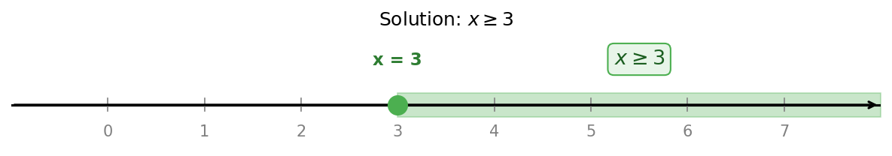
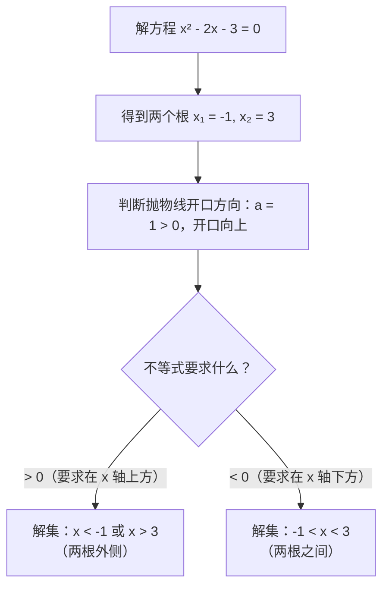
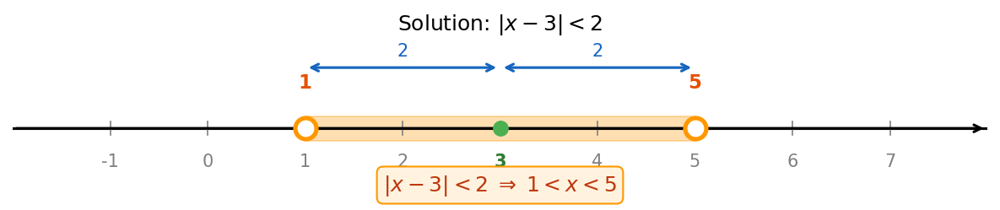

# 不等式与绝对值

> **所属路径**：`00_高中复习/01_数学基础/01_代数与方程/02_不等式与绝对值`
> **预计学习时间**：60 分钟
> **难度等级**：⭐

---

## 前置知识

- [一元二次方程](../01_一元二次方程/01_一元二次方程.md) — 标准形式、求根公式与判别式
- 基本四则运算与数轴概念

> 如果你还没有完成一元二次方程的学习，建议先回去把那节课学完再继续，因为本节会多次用到判别式和因式分解等技巧。

---

## 学习目标

完成本节后，你将能够：

1. 理解不等式的含义，掌握不等式的基本性质
2. 求解一元一次不等式和一元二次不等式，并在数轴上表示解集
3. 理解绝对值的代数定义和几何意义
4. 求解含绝对值的方程和不等式

---

## 正文讲解

### 1. 从"等于"到"不等于"：为什么需要不等式？

在上一节中，我们学习了方程——它描述的是"相等"关系。但在现实世界中，很多问题并不是在问"等于多少"，而是在问"范围是什么"。

比如：你去超市买水果，预算不超过 50 元，苹果每斤 8 元。你最多能买几斤？这里的"不超过 50 元"就不是一个等号关系，而是一个**不等关系**：

$$
8x \leq 50
$$

再比如，在人工智能领域，模型训练时我们经常需要给参数施加**约束（Constraint）**——"权重的绝对值不能太大""学习率必须为正数""损失函数值要小于某个阈值"。这些约束全部都是用不等式来表达的。可以说，如果方程是在寻找"精确的答案"，那么**不等式（Inequality）** 就是在描述"合理的范围"。


### 2. 不等式的基本性质：游戏规则

在求解不等式之前，我们先要搞清楚它的"游戏规则"——也就是**不等式的性质（Properties of Inequalities）**。这些性质告诉我们可以对不等式做哪些变换而不改变它的方向。

和等式一样，不等式也可以两边同时加减同一个数，不等号方向不变：

$$
\text{如果 } a > b，\text{则 } a + c > b + c
$$

但要注意，**乘以或除以一个负数时，不等号方向必须反转**。这是不等式和等式最大的区别！

$$
\text{如果 } a > b \text{ 且 } c < 0，\text{则 } ac < bc
$$

> **直觉解读**：你可以这样想——在数轴上，正数的乘法保持"谁大谁小"的顺序不变，但负数的乘法就像照镜子，左右翻转了。比如 $3 > 2$ ，乘以 $-1$ 后变成 $-3 < -2$ 。

为了帮助记忆，用下面这张表格总结不等式的关键性质：

| 操作 | 对不等号方向的影响 | 示例 |
| ---- | ------------------ | ---- |
| 两边加（减）同一个数 | 方向不变 | $x - 3 > 5 \Rightarrow x > 8$ |
| 两边乘（除）一个**正数** | 方向不变 | $2x < 10 \Rightarrow x < 5$ |
| 两边乘（除）一个**负数** | **方向反转** | $-x > 3 \Rightarrow x < -3$ |

想一想：**为什么乘以负数要反转不等号？** 试试用具体数字验证。比如 $5 > 2$ ，两边乘以 $-2$ ，得到 $-10$ 和 $-4$ ，显然 $-10 < -4$ ，不等号确实反转了。


### 3. 一元一次不等式：最简单的"范围问题"

有了这些性质，我们先从最简单的不等式开始——**一元一次不等式（Linear Inequality in One Variable）**。它的一般形式是：

$$
ax + b > 0 \quad (\text{其中 } a \neq 0)
$$

求解过程和解一元一次方程几乎一样，只是最后一步要注意正负号对不等号方向的影响。

**例题**：求解 $-2x + 6 \leq 0$

第一步：移项，把常数移到右边：

$$
-2x \leq -6
$$

第二步：两边除以 $-2$ 。注意！ $-2$ 是负数，所以不等号要**反转**：

$$
x \geq 3
$$

这个解的意思是：所有大于等于 3 的数都能让原不等式成立。我们用数轴表示就是从 3 开始向右延伸的一条射线（ $3$ 处用实心圆点表示"包含 3"）。



> 📌 **图解说明**：数轴上实心点表示"包含"该端点（对应 $\geq$ 或 $\leq$ ），空心圆表示"不包含"（对应 $>$ 或 $<$ ）。解集 $x \geq 3$ 是从 3 开始向右的所有数。你可以运行 `code/plot_number_lines.py` 自行生成这张图。


### 4. 一元二次不等式：用抛物线"看"答案

接下来，我们将一元一次不等式升级，来看看含有 $x^2$ 的不等式——**一元二次不等式（Quadratic Inequality in One Variable）**。这类不等式的一般形式是：

$$
ax^2 + bx + c > 0 \quad (\text{或 } < 0, \geq 0, \leq 0)
$$

你可能已经猜到了——这和上一节学的一元二次方程 $ax^2 + bx + c = 0$ 密切相关。事实上，**一元二次不等式的解法就是建立在一元二次方程的基础之上的**。

核心思路分三步：

1. **先解对应的方程** $ax^2 + bx + c = 0$ ，找到"临界点"（也就是抛物线和 $x$ 轴的交点）
2. **画出抛物线的大致图形**，判断它是开口向上（ $a > 0$ ）还是开口向下（ $a < 0$ ）
3. **根据图形判断解集**——不等式要求函数值大于零，就找抛物线在 $x$ 轴上方的部分；要求小于零，就找在 $x$ 轴下方的部分

让我们通过一个具体例子来实践这个流程。

**例题**：求解 $x^2 - 2x - 3 > 0$

**第一步——解方程**：先解 $x^2 - 2x - 3 = 0$ 。这个方程可以因式分解：

$$
x^2 - 2x - 3 = (x - 3)(x + 1) = 0
$$

所以两个根是 $x_1 = -1$ ， $x_2 = 3$ 。

**第二步——画抛物线**：因为 $a = 1 > 0$ ，所以抛物线开口向上，形状像一个"碗"。它与 $x$ 轴交于 $x = -1$ 和 $x = 3$ 两个点。

**第三步——判断解集**：不等式要求 $x^2 - 2x - 3 > 0$ ，也就是要求抛物线在 $x$ 轴**上方**。从图形可以看出，开口向上的抛物线在两个根的**外侧**是在 $x$ 轴上方的，也就是 $x < -1$ 或 $x > 3$ 。



> 📌 **图解说明**：对于开口向上（ $a > 0$ ）的抛物线，函数值在两根外侧为正，在两根之间为负。如果开口向下（ $a < 0$ ），情况刚好相反。

所以最终答案是：

$$
x < -1 \quad \text{或} \quad x > 3
$$

你可能会问：如果方程没有实数根（ $\Delta < 0$ ）怎么办？很好的问题！这时候抛物线完全不与 $x$ 轴相交。如果开口向上，整条抛物线都在 $x$ 轴上方，那么 $ax^2 + bx + c > 0$ 对所有实数 $x$ 都成立；反之 $ax^2 + bx + c < 0$ 无解。

让我们把所有情况总结为一张完整的表格（以 $a > 0$ 为例）：

| $\Delta$ 的值 | $ax^2 + bx + c > 0$ 的解集 | $ax^2 + bx + c < 0$ 的解集 |
| -------------- | --------------------------- | --------------------------- |
| $\Delta > 0$ （两个不同的根 $x_1 < x_2$ ） | $x < x_1$ 或 $x > x_2$ | $x_1 < x < x_2$ |
| $\Delta = 0$ （一个重根 $x_0$ ） | $x \neq x_0$ （除一个点外全部） | 无解 |
| $\Delta < 0$ （无实数根） | 全体实数 | 无解 |

> 📌 **提醒**：上表适用于 $a > 0$ 的情况。如果 $a < 0$ ，可以先将不等式两边乘以 $-1$ （记得反转不等号！），把它转化为 $a > 0$ 的标准情况再处理。


### 5. 绝对值：距离的数学语言

讲完不等式，我们来认识另一个在数学和人工智能中都极其重要的概念——**绝对值（Absolute Value）**。

**什么是绝对值？** 直觉上，一个数的绝对值就是"它离零有多远"。比如 $5$ 离零的距离是 $5$ ，而 $-5$ 离零的距离也是 $5$ 。所以 $|5| = 5$ ， $|-5| = 5$ 。

用数学语言来定义：

$$
|x| = \begin{cases}
x, & \text{如果 } x \geq 0 \\
-x, & \text{如果 } x < 0
\end{cases}
$$

> **直觉解读**：绝对值函数做的事情很简单——如果数本身是正数或零，就原样返回；如果是负数，就取反号变成正数。换句话说，绝对值"去掉了正负号，只保留大小"。

想一想：**$|-x|$ 等于什么？** 很多人第一反应是" $x$ "，但这不一定对！如果 $x$ 本身就是负数，比如 $x = -3$ ，那么 $-x = 3$ ，所以 $|-x| = 3 = |x|$ 。事实上，对任意实数 $x$ ，都有 $|-x| = |x|$ ——这就是绝对值的**对称性**。

#### 绝对值的几何意义

绝对值最优美的理解方式是**几何的**。在数轴上：

- $|x|$ 表示点 $x$ 到原点 $0$ 的距离
- $|x - a|$ 表示点 $x$ 到点 $a$ 的距离

这个理解方式极其强大，因为它把抽象的代数表达式变成了直观的距离概念。

举个例子： $|x - 3| < 2$ 是什么意思？

从几何角度看，它在问：**数轴上哪些点到 $3$ 的距离小于 $2$ ？** 答案显然是以 $3$ 为中心、左右各延伸 $2$ 个单位的区间，也就是 $1 < x < 5$ 。

下面这张数轴图直观展示了 $|x - 3| < 2$ 的解集：



> 📌 **图解说明**： $|x - 3| < 2$ 的解集是数轴上距离点 3 不超过 2 个单位的区间 $(1, 5)$ 。空心圆表示不包含端点。你可以运行 `code/plot_number_lines.py` 自行生成这张图。

这种"距离"视角在人工智能中无处不在。比如 **[K 近邻算法](../../../../02_核心原理/02_经典机器学习/04_K近邻/)** 需要计算数据点之间的距离，而绝对值距离（也叫**曼哈顿距离**）是最基本的距离度量之一。又比如训练模型时常用的 **L1 损失函数** 就是用预测值与真实值之差的绝对值来衡量误差大小：

$$
L_1 = |y_{\text{预测}} - y_{\text{真实}}|
$$

#### 绝对值的核心性质

下面列出绝对值的几条关键性质，它们在后续解题中会反复使用：

| 性质 | 数学表达 | 直觉解释 |
| ---- | -------- | -------- |
| 非负性 | $\|x\| \geq 0$ | 距离永远不会是负数 |
| 对称性 | $\|-x\| = \|x\|$ | 到原点的距离不看方向 |
| 三角不等式 | $\|x + y\| \leq \|x\| + \|y\|$ | 走弯路不会比走直线更近 |
| 乘法性 | $\|xy\| = \|x\| \cdot \|y\|$ | 两段距离相乘等于各自绝对值相乘 |

其中**三角不等式（Triangle Inequality）** 尤为重要。它的名字来源于几何：在三角形中，任何一条边的长度都不超过另外两条边长度之和。这个不等式在线性代数和机器学习中是证明许多定理的基础工具。


### 6. 含绝对值的方程与不等式

掌握了绝对值的定义和几何意义后，我们来学习如何求解含绝对值的方程和不等式。核心策略只有一条：**去掉绝对值符号，转化为我们已经会解的普通方程或不等式**。

#### 含绝对值的方程

**例题**：求解 $|2x - 1| = 5$

根据绝对值的定义， $|2x - 1| = 5$ 意味着 $2x - 1$ 到零的距离是 $5$ ，也就是 $2x - 1$ 要么等于 $5$ ，要么等于 $-5$ 。因此我们把一个绝对值方程拆成两个普通方程：

$$
2x - 1 = 5 \quad \Rightarrow \quad x = 3
$$

$$
2x - 1 = -5 \quad \Rightarrow \quad x = -2
$$

验证： $|2(3) - 1| = |5| = 5$ ✓， $|2(-2) - 1| = |-5| = 5$ ✓。

#### 含绝对值的不等式

含绝对值的不等式有两种基本类型，它们的解法截然不同：

**类型一： $|x| < a$ （距离小于 $a$ ）**

几何意义： $x$ 到原点的距离小于 $a$ ，所以 $x$ 在 $-a$ 和 $a$ 之间。

$$
|x| < a \quad \Longleftrightarrow \quad -a < x < a \quad (a > 0)
$$

**类型二： $|x| > a$ （距离大于 $a$ ）**

几何意义： $x$ 到原点的距离大于 $a$ ，所以 $x$ 在 $-a$ 的左边或 $a$ 的右边。

$$
|x| > a \quad \Longleftrightarrow \quad x < -a \quad \text{或} \quad x > a \quad (a > 0)
$$

> 📌 **记忆口诀**：**"小于取中间，大于取两边"**。这句话可以帮你快速记住两种类型的解法方向。

**例题**：求解 $|3x + 2| \leq 7$

根据"小于取中间"的规则：

$$
-7 \leq 3x + 2 \leq 7
$$

三个部分同时减去 $2$ ：

$$
-9 \leq 3x \leq 5
$$

三个部分同时除以 $3$ （正数，不变号）：

$$
-3 \leq x \leq \frac{5}{3}
$$

**例题**：求解 $|x - 4| > 1$

根据"大于取两边"的规则：

$$
x - 4 < -1 \quad \text{或} \quad x - 4 > 1
$$

$$
x < 3 \quad \text{或} \quad x > 5
$$


### 7. 不等式与绝对值的综合应用

到目前为止，我们分别学习了不等式和绝对值。在实际应用中，它们经常结合在一起出现。让我们看一个综合性的例题，把前面学到的所有技巧串联起来。

**例题**：求解 $|x^2 - 4| \leq 5$

第一步，用"小于取中间"的规则去掉绝对值：

$$
-5 \leq x^2 - 4 \leq 5
$$

第二步，三个部分同时加上 $4$ ：

$$
-1 \leq x^2 \leq 9
$$

第三步，拆分成两个不等式分别处理：

- 左半部分 $x^2 \geq -1$ ：由于 $x^2$ 恒大于等于 $0$ ，而 $0 \geq -1$ ，所以这个不等式对所有实数 $x$ 都成立，不提供额外约束。
- 右半部分 $x^2 \leq 9$ ：这是一个一元二次不等式！可以改写为 $x^2 - 9 \leq 0$ ，因式分解得 $(x-3)(x+3) \leq 0$ 。根据前面学的方法， $a = 1 > 0$ ，开口向上，两根之间为负，所以解集是 $-3 \leq x \leq 3$ 。

最终答案： $-3 \leq x \leq 3$ 。

---

## 动手实践

前面我们学习了不等式和绝对值的理论知识，现在让我们用 Python 来直观地验证和可视化这些概念。下面的代码会在数轴上展示不等式和绝对值不等式的解集，帮助你建立更直观的理解。

```python
# 文件：code/inequality_solver.py
# 不等式与绝对值求解器
# 环境要求：Python 3.10+（无需额外库）


def solve_linear_inequality(a: float, b: float, direction: str = ">") -> str:
    """
    求解一元一次不等式 ax + b > 0（或 <, >=, <=）
    """
    if a == 0:
        # 退化为常数不等式，根据方向判断 b 与 0 的关系
        checks = {
            ">": b > 0,
            "<": b < 0,
            ">=": b >= 0,
            "<=": b <= 0,
        }
        if checks[direction]:
            return "解集为全体实数"
        else:
            return "无解"

    # 解方程 ax + b = 0 得到临界点
    critical = -b / a

    # 根据 a 的正负确定解集方向
    if a > 0:
        final_dir = direction
    else:
        # a 为负数，方向反转
        flip = {">": "<", "<": ">", ">=": "<=", "<=": ">="}
        final_dir = flip[direction]

    print(f"不等式：{a}x + {b} {direction} 0")
    print(f"临界点：x = {critical}")
    print(f"解集：x {final_dir} {critical}")
    return f"x {final_dir} {critical}"


def solve_abs_inequality(a: float, b: float, bound: float, direction: str = "<") -> str:
    """
    求解 |ax + b| < bound 或 |ax + b| > bound 形式的绝对值不等式
    """
    print(f"不等式：|{a}x + {b}| {direction} {bound}")

    if bound < 0:
        if direction in ("<", "<="):
            print("绝对值不可能小于负数，无解")
            return "无解"
        else:
            print("绝对值恒大于等于 0，大于负数恒成立")
            return "解集为全体实数"

    if direction in ("<", "<="):
        # 小于取中间：-bound < ax + b < bound
        left = (-bound - b) / a if a > 0 else (bound - b) / a
        right = (bound - b) / a if a > 0 else (-bound - b) / a
        if left > right:
            left, right = right, left
        eq_sign = "=" if "=" in direction else ""
        print(f"去绝对值（小于取中间）：-{bound} {direction} {a}x + {b} {direction} {bound}")
        print(f"解集：{left} <{eq_sign} x <{eq_sign} {right}")
        return f"{left} <{eq_sign} x <{eq_sign} {right}"
    else:
        # 大于取两边：ax + b < -bound 或 ax + b > bound
        val1 = (-bound - b) / a
        val2 = (bound - b) / a
        left = min(val1, val2)
        right = max(val1, val2)
        eq_sign = "=" if "=" in direction else ""
        print(f"去绝对值（大于取两边）：{a}x + {b} <{eq_sign} -{bound} 或 {a}x + {b} >{eq_sign} {bound}")
        print(f"解集：x <{eq_sign} {left} 或 x >{eq_sign} {right}")
        return f"x <{eq_sign} {left} 或 x >{eq_sign} {right}"


def solve_quadratic_inequality(a: float, b: float, c: float, direction: str = ">") -> str:
    """
    求解一元二次不等式 ax² + bx + c > 0（或 <, >=, <=）
    假设 a > 0（开口向上）
    """
    import math

    if a == 0:
        return solve_linear_inequality(b, c, direction)

    # 如果 a < 0，两边乘以 -1，反转方向
    if a < 0:
        a, b, c = -a, -b, -c
        flip = {">": "<", "<": ">", ">=": "<=", "<=": ">="}
        direction = flip[direction]

    delta = b**2 - 4 * a * c
    print(f"二次不等式（标准化后）：{a}x² + {b}x + {c} {direction} 0")
    print(f"判别式 Δ = {delta}")

    if delta < 0:
        # 无实数根
        if direction in (">", ">="):
            print("Δ < 0 且 a > 0，抛物线恒在 x 轴上方")
            print("解集为全体实数")
            return "解集为全体实数"
        else:
            print("Δ < 0 且 a > 0，抛物线恒在 x 轴上方")
            print("无解")
            return "无解"
    elif delta == 0:
        x0 = -b / (2 * a)
        print(f"Δ = 0，重根 x = {x0}")
        if direction in (">",):
            return f"x ≠ {x0}"
        elif direction in (">=",):
            return "解集为全体实数"
        elif direction in ("<",):
            return "无解"
        else:
            return f"x = {x0}"
    else:
        x1 = (-b - math.sqrt(delta)) / (2 * a)
        x2 = (-b + math.sqrt(delta)) / (2 * a)
        print(f"两个根：x₁ = {x1}, x₂ = {x2}")
        if direction in (">", ">="):
            eq = "=" if "=" in direction else ""
            print(f"开口向上，两根外侧为正")
            print(f"解集：x <{eq} {x1} 或 x >{eq} {x2}")
            return f"x <{eq} {x1} 或 x >{eq} {x2}"
        else:
            eq = "=" if "=" in direction else ""
            print(f"开口向上，两根之间为负")
            print(f"解集：{x1} <{eq} x <{eq} {x2}")
            return f"{x1} <{eq} x <{eq} {x2}"


if __name__ == "__main__":
    # 示例 1：一元一次不等式 -2x + 6 ≤ 0
    print("=" * 50)
    print("示例 1：一元一次不等式 -2x + 6 ≤ 0")
    solve_linear_inequality(-2, 6, "<=")

    # 示例 2：一元二次不等式 x² - 2x - 3 > 0
    print("\n" + "=" * 50)
    print("示例 2：一元二次不等式 x² - 2x - 3 > 0")
    solve_quadratic_inequality(1, -2, -3, ">")

    # 示例 3：绝对值不等式 |2x - 1| ≤ 5
    print("\n" + "=" * 50)
    print("示例 3：绝对值不等式 |2x - 1| ≤ 5")
    solve_abs_inequality(2, -1, 5, "<=")

    # 示例 4：绝对值不等式 |x - 4| > 1
    print("\n" + "=" * 50)
    print("示例 4：绝对值不等式 |x - 4| > 1")
    solve_abs_inequality(1, -4, 1, ">")
```

**运行说明**：
- 环境要求：Python 3.10+（仅使用标准库 `math`）
- 运行命令：`python code/inequality_solver.py`

**预期输出**：
```
==================================================
示例 1：一元一次不等式 -2x + 6 ≤ 0
不等式：-2x + 6 <= 0
临界点：x = 3.0
解集：x >= 3.0

==================================================
示例 2：一元二次不等式 x² - 2x - 3 > 0
二次不等式（标准化后）：1x² + -2x + -3 > 0
判别式 Δ = 16
两个根：x₁ = -1.0, x₂ = 3.0
开口向上，两根外侧为正
解集：x < -1.0 或 x > 3.0

==================================================
示例 3：绝对值不等式 |2x - 1| ≤ 5
不等式：|2x + -1| <= 5
去绝对值（小于取中间）：-5 <= 2x + -1 <= 5
解集：-2.0 <= x <= 3.0

==================================================
示例 4：绝对值不等式 |x - 4| > 1
不等式：|1x + -4| > 1
去绝对值（大于取两边）：1x + -4 <= -1 或 1x + -4 >= 1
解集：x <= 3.0 或 x >= 5.0
```

看看代码中处理二次不等式的逻辑——它先计算判别式 $\Delta$ ，然后根据 $\Delta$ 的正负和不等号方向来确定解集。这和我们前面讲的流程完全一致。把数学思路翻译成代码，正是后续学习编程和人工智能时反复练习的核心能力。

---

## 典型误区

| 误区 | 正确理解 |
| ---- | -------- |
| 两边乘以负数时忘记反转不等号 | 这是不等式最容易犯的错误！每次乘以或除以负数时，都要检查不等号方向是否需要反转 |
| 认为 $\|x\| = x$ | 只有当 $x \geq 0$ 时才成立。当 $x < 0$ 时， $\|x\| = -x$ 。例如 $\|-3\| = -(-3) = 3$ |
| 绝对值不等式只取一个方向 | $\|x\| > a$ 会产生两个分支（大于取两边），必须同时考虑正、负两种情况 |
| 一元二次不等式直接用公式不画图 | 忘记考虑抛物线开口方向会导致解集完全写反。建议每次都画个简单的抛物线草图来确认 |
| 认为 $\|a + b\| = \|a\| + \|b\|$ | 错误！正确的关系是三角不等式 $\|a + b\| \leq \|a\| + \|b\|$ ，等号只在 $a$ 和 $b$ 同号时成立 |

---

## 练习题

### 练习 1：一元一次不等式（难度：⭐）

求解以下不等式，并在数轴上表示解集：

1. $3x - 9 > 0$
2. $-4x + 8 \leq 0$

<details>
<summary>💡 提示</summary>

第 1 题：把 $-9$ 移到右边，再除以 $3$ 。第 2 题：除以 $-4$ 时不等号要反转。

</details>

<details>
<summary>✅ 参考答案</summary>

1. $3x > 9 \Rightarrow x > 3$ ，解集是数轴上 $3$ 右边的部分（不包含 $3$ ）
2. $-4x \leq -8 \Rightarrow x \geq 2$ （除以 $-4$ ，不等号反转），解集是数轴上 $2$ 及其右边的部分

</details>

### 练习 2：一元二次不等式（难度：⭐⭐）

求解 $x^2 - 5x + 6 < 0$ ，写出完整的三步流程。

<details>
<summary>💡 提示</summary>

第一步：解方程 $x^2 - 5x + 6 = 0$ （尝试因式分解，寻找两个数的积为 $6$ 、和为 $5$ ）。第二步：判断开口方向。第三步：根据"小于零找两根之间"确定解集。

</details>

<details>
<summary>✅ 参考答案</summary>

**第一步**： $x^2 - 5x + 6 = (x - 2)(x - 3) = 0$ ，两个根为 $x_1 = 2$ ， $x_2 = 3$

**第二步**： $a = 1 > 0$ ，抛物线开口向上

**第三步**：要求 $< 0$ （在 $x$ 轴下方），开口向上的抛物线在两根之间为负

**解集**： $2 < x < 3$

验证：取 $x = 2.5$ ，代入得 $(2.5)^2 - 5(2.5) + 6 = 6.25 - 12.5 + 6 = -0.25 < 0$ ✓

</details>

### 练习 3：绝对值方程与不等式（难度：⭐⭐）

求解以下问题：

1. $|5x - 3| = 7$
2. $|2x + 1| < 9$
3. $|x - 2| \geq 3$

<details>
<summary>💡 提示</summary>

第 1 题：绝对值等于 $7$ ，拆成 $5x - 3 = 7$ 和 $5x - 3 = -7$ 两个方程。第 2 题："小于取中间"。第 3 题："大于取两边"。

</details>

<details>
<summary>✅ 参考答案</summary>

1. $5x - 3 = 7 \Rightarrow x = 2$ ； $5x - 3 = -7 \Rightarrow x = -\dfrac{4}{5}$
2. $-9 < 2x + 1 < 9 \Rightarrow -10 < 2x < 8 \Rightarrow -5 < x < 4$
3. $x - 2 \leq -3$ 或 $x - 2 \geq 3 \Rightarrow x \leq -1$ 或 $x \geq 5$

</details>

### 练习 4：编程实践（难度：⭐⭐）

修改 `code/inequality_solver.py`，添加一个新函数 `check_triangle_inequality(x, y)`，验证三角不等式 $|x + y| \leq |x| + |y|$ 是否对给定的 $x$ 和 $y$ 成立，并输出三角不等式的左边值、右边值以及等号成立的条件。

用以下测试用例验证：
- $x = 3, y = 5$ （同号）
- $x = 3, y = -5$ （异号）
- $x = -3, y = -5$ （同号，均为负）

<details>
<summary>💡 提示</summary>

使用 Python 内置的 `abs()` 函数即可计算绝对值。等号成立条件是 $x$ 和 $y$ 同号（或其中之一为零）。

</details>

<details>
<summary>✅ 参考答案</summary>

```python
def check_triangle_inequality(x: float, y: float):
    left = abs(x + y)
    right = abs(x) + abs(y)
    print(f"x = {x}, y = {y}")
    print(f"|x + y| = |{x + y}| = {left}")
    print(f"|x| + |y| = {abs(x)} + {abs(y)} = {right}")
    print(f"|x + y| ≤ |x| + |y| → {left} ≤ {right} → {'成立 ✓' if left <= right else '不成立 ✗'}")
    if left == right:
        print("等号成立：因为 x 和 y 同号（或其中之一为 0）")
    else:
        print(f"严格小于：因为 x 和 y 异号，差值 = {right - left}")
```

运行后可以看到：同号时等号成立（ $|3+5| = 8 = |3| + |5|$ ），异号时严格小于（ $|3+(-5)| = 2 < 3 + 5 = 8$ ）。

</details>

---

## 下一步学习

- 📖 下一个知识点：[方程组与代数变形](../03_方程组与代数变形/03_方程组与代数变形.md) — 学会联立多个方程求解多个未知数，掌握代数变形的核心技巧
- 🔗 相关知识点：[函数与图像](../../02_函数与图像/) — 不等式的解集可以通过函数图像直观理解，数形结合是强大的数学工具
- 📚 拓展阅读：[概率基础](../../09_概率基础/) — 概率的取值范围 $0 \leq P \leq 1$ 本身就是不等式约束的体现

---

## 参考资料

> 以下资源均为公开可访问的免费内容。

1. [维基百科：不等式](https://zh.wikipedia.org/wiki/不等式) — 不等式的定义、性质和常用类型的全面介绍（公共知识库，CC BY-SA 许可）
2. [维基百科：绝对值](https://zh.wikipedia.org/wiki/绝对值) — 绝对值的定义、性质和几何意义（公共知识库，CC BY-SA 许可）
3. [Khan Academy: Absolute Value Equations and Inequalities](https://www.khanacademy.org/math/algebra/x2f8bb11595b61c86:absolute-value-rigor) — 可汗学院的绝对值方程与不等式互动课程，含视频和练习题（免费公开课程）
4. [Python 官方文档：内置函数 abs()](https://docs.python.org/zh-cn/3/library/functions.html#abs) — 本节代码中使用的 `abs()` 函数的官方说明（官方文档）
