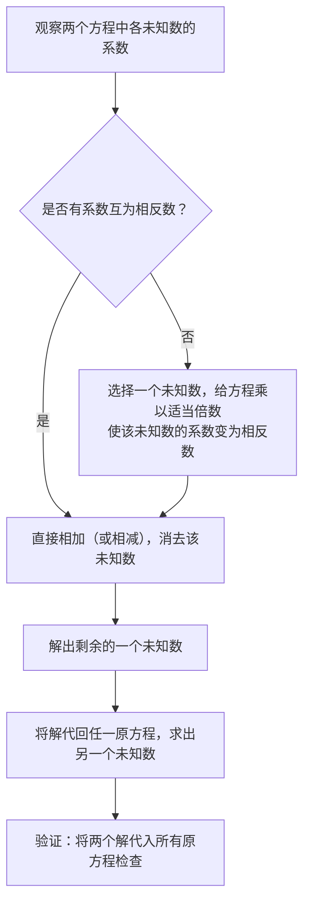
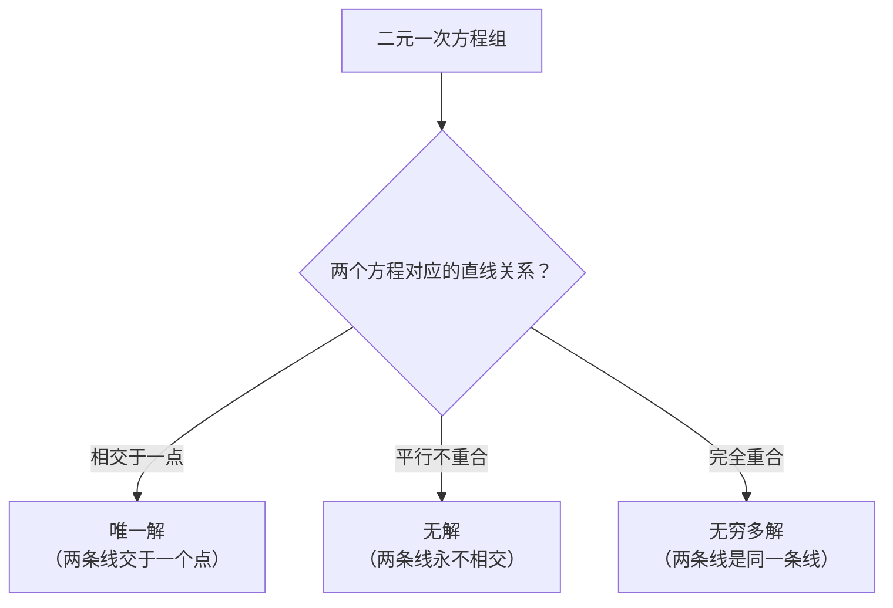

# 方程组与代数变形

> **所属路径**：`00_高中复习/01_数学基础/01_代数与方程/03_方程组与代数变形`
> **预计学习时间**：60 分钟
> **难度等级**：⭐⭐

---

## 前置知识

- [一元二次方程](../01_一元二次方程/01_一元二次方程.md) — 标准形式、因式分解与求根公式
- [不等式与绝对值](../02_不等式与绝对值/02_不等式与绝对值.md) — 不等式的基本性质与代数运算规则

> 如果以上内容还不熟悉，建议先完成对应课程再继续。本节会综合运用前两节学到的代数操作技巧。

---

## 学习目标

完成本节后，你将能够：

1. 理解方程组的含义，识别方程组有唯一解、无解和无穷多解的情况
2. 使用代入法和加减消元法求解二元一次方程组
3. 掌握常用的代数变形技巧（因式分解、配方、换元、整体代入）
4. 理解方程组求解与人工智能中"多参数优化"的直觉联系

---

## 正文讲解

### 1. 为什么一个方程不够用？

在前两节中，我们学习了如何求解只含一个未知数的方程和不等式。但现实世界中的问题往往涉及**多个未知量之间的相互关系**。

来看一个简单的例子：商店里苹果和梨的总价是 20 元，苹果的价格是梨的 2 倍。问：苹果和梨各多少钱？

如果我们设苹果的单价为 $x$ 元，梨的单价为 $y$ 元，那么从题目中可以提取出两条信息：

$$
x + y = 20
$$

$$
x = 2y
$$

只靠第一个方程 $x + y = 20$，你无法确定 $x$ 和 $y$ 各是多少—— $x = 5, y = 15$ 可以， $x = 10, y = 10$ 也可以，满足条件的组合有无穷多种。但是加上第二个条件 $x = 2y$，两个方程"联手"就能锁定唯一的答案。

像这样**把多个方程放在一起，要求它们的解同时成立**的数学结构，就叫做**方程组（System of Equations）**。上面的例子写成方程组的标准形式是：

$$
\begin{cases}
x + y = 20 \\
x = 2y
\end{cases}
$$

在人工智能中，方程组的思想几乎无处不在。一个神经网络可能有数百万个参数，训练过程就是要找到一组参数值，使得所有训练数据上的误差同时满足约束。虽然那是一个远比两个方程复杂的系统，但核心思想完全一致——**多个条件联合约束多个未知数**。


### 2. 代入法：用一个方程"消灭"一个未知数

求解方程组的第一种方法叫做**代入法（Substitution Method）**。它的思路非常直白：从一个方程中把某个未知数"用另一个未知数表示"，然后代入另一个方程，这样就把二元问题降级为一元问题。

让我们用前面苹果和梨的例子来演示。

**第一步——表达**：从第二个方程 $x = 2y$ 中，我们已经知道 $x$ 可以用 $y$ 来表达。

**第二步——代入**：把 $x = 2y$ 代入第一个方程 $x + y = 20$：

$$
2y + y = 20 \quad \Rightarrow \quad 3y = 20 \quad \Rightarrow \quad y = \frac{20}{3} \approx 6.67
$$

**第三步——回代**：把 $y$ 的值代回 $x = 2y$：

$$
x = 2 \times \frac{20}{3} = \frac{40}{3} \approx 13.33
$$

**第四步——验证**：检查答案是否同时满足两个方程：
- $x + y = \frac{40}{3} + \frac{20}{3} = \frac{60}{3} = 20$ ✓
- $x = 2y \Rightarrow \frac{40}{3} = 2 \times \frac{20}{3}$ ✓

> 📌 **关键理解**：代入法的核心是"降维"——把两个未知数的问题变成一个未知数的问题。这种"把复杂问题分解为简单问题"的思维，在编程和人工智能中被称为**分治思想（Divide and Conquer）**，是解决复杂问题的通用策略。

代入法适合在某个方程中，某个未知数的系数为 $1$（或者已经被单独解出来）的情况，这样表达起来最简单。但如果两个方程中未知数的系数都很复杂，代入法就会变得繁琐。这时候，我们需要第二种方法。


### 3. 加减消元法：让未知数"自我消除"

**加减消元法（Elimination Method）** 的策略是：通过对两个方程进行加减运算，让某个未知数的项恰好互相抵消，从而只剩下一个未知数。

**例题**：求解以下方程组：

$$
\begin{cases}
3x + 2y = 16 \\
5x - 2y = 24
\end{cases}
$$

观察这两个方程：第一个方程有 $+2y$，第二个方程有 $-2y$。如果我们把两个方程**相加**， $y$ 就会被消掉！

$$
(3x + 2y) + (5x - 2y) = 16 + 24
$$

$$
8x = 40 \quad \Rightarrow \quad x = 5
$$

把 $x = 5$ 代入第一个方程：

$$
3(5) + 2y = 16 \quad \Rightarrow \quad 2y = 1 \quad \Rightarrow \quad y = 0.5
$$

验证： $3(5) + 2(0.5) = 15 + 1 = 16$ ✓， $5(5) - 2(0.5) = 25 - 1 = 24$ ✓

但在大多数情况下，两个方程中的系数不会这么"巧合"地正好相反。这时候我们需要先给方程"乘一个倍数"来制造这种巧合。

**例题**：求解以下方程组：

$$
\begin{cases}
2x + 3y = 13 \\
4x + 5y = 23
\end{cases}
$$

$y$ 的系数分别是 $3$ 和 $5$，不能直接消去。我们的策略是：把第一个方程乘以 $-2$，使 $x$ 的系数变成 $-4$，然后和第二个方程相加就能消去 $x$：

$$
-2 \times (2x + 3y = 13) \quad \Rightarrow \quad -4x - 6y = -26
$$

两个方程相加：

$$
(-4x - 6y) + (4x + 5y) = -26 + 23
$$

$$
-y = -3 \quad \Rightarrow \quad y = 3
$$

把 $y = 3$ 代入第一个方程： $2x + 3(3) = 13 \Rightarrow 2x = 4 \Rightarrow x = 2$。

用一张流程图来总结加减消元法的标准步骤：



> 📌 **图解说明**：加减消元法的核心是"制造相反数，然后相加消去"。如果系数不现成，就通过乘以倍数来制造。这个流程可以推广到更多方程和更多未知数的情况。


### 4. 方程组解的三种情况

并非所有方程组都有唯一的解。让我们来了解方程组解的三种可能情况。

**情况一：唯一解**——两个方程提供了两条"独立的"信息，恰好锁定一个点。

$$
\begin{cases}
x + y = 5 \\
x - y = 1
\end{cases}
\quad \Rightarrow \quad x = 3, \; y = 2
$$

**情况二：无解**——两个方程相互矛盾，不可能同时成立。

$$
\begin{cases}
x + y = 5 \\
x + y = 8
\end{cases}
$$

$x + y$ 不可能既等于 $5$ 又等于 $8$。从图形角度看，这两个方程对应两条**平行线**，永远不会相交。

**情况三：无穷多解**——两个方程实际上在说同一件事（其中一个是另一个的倍数）。

$$
\begin{cases}
x + y = 5 \\
2x + 2y = 10
\end{cases}
$$

第二个方程就是第一个方程乘以 $2$，没有提供任何新信息。所以满足 $x + y = 5$ 的所有 $(x, y)$ 都是解，有无穷多组。



> 📌 **图解说明**：方程组的每个方程对应平面上的一条直线。解就是所有直线的交点。两条直线的位置关系完全决定了解的情况。

在人工智能中，我们通常处理的是**超定方程组（Overdetermined System）**——方程的数量远多于未知数的数量（比如用几千个数据点去拟合只有几个参数的模型）。这种情况下通常没有精确解，所以我们转而寻找**最接近满足所有方程的解**——这就是 **[回归](../../../../02_核心原理/02_经典机器学习/01_回归/)** 的核心思想。


### 5. 代数变形：解题的"百宝箱"

方程组的求解离不开灵活的代数变形能力。事实上，在前两节课中你已经用到了很多代数变形技巧——只是当时可能没有意识到它们是"技巧"。现在让我们把这些技巧系统性地梳理一遍，让它们成为你解题时的"百宝箱"。

#### 技巧一：展开与因式分解——互为逆操作

**展开（Expansion）** 是把乘积形式变成求和形式，**因式分解（Factoring）** 则是反过来。它们是一对互逆操作：

$$
\text{展开：}(a + b)(c + d) = ac + ad + bc + bd
$$

$$
\text{因式分解：}x^2 - 9 = (x + 3)(x - 3)
$$

几个最常用的公式，值得牢记：

| 名称 | 公式 | 示例 |
| ---- | ---- | ---- |
| 完全平方和 | $(a + b)^2 = a^2 + 2ab + b^2$ | $(x + 3)^2 = x^2 + 6x + 9$ |
| 完全平方差 | $(a - b)^2 = a^2 - 2ab + b^2$ | $(x - 2)^2 = x^2 - 4x + 4$ |
| 平方差 | $a^2 - b^2 = (a + b)(a - b)$ | $x^2 - 16 = (x + 4)(x - 4)$ |

> **直觉解读**：因式分解就像"拆快递"——把一个复杂的表达式拆成几个简单因子的乘积。展开则是"打包"——把因子乘开变成一个完整的多项式。在解方程时，因式分解帮我们利用"零乘积性质"快速找到解；在化简表达式时，适时展开可以合并同类项。

#### 技巧二：通分与交叉相乘——处理分式的利器

当方程中出现分数时，**通分（Finding a Common Denominator）** 可以消除分母，让方程变得更容易处理：

$$
\frac{x}{3} + \frac{x}{4} = 7 \quad \xrightarrow{\text{通分（乘以12）}} \quad 4x + 3x = 84 \quad \Rightarrow \quad 7x = 84 \quad \Rightarrow \quad x = 12
$$

当两个分式相等时，可以使用**交叉相乘（Cross Multiplication）**：

$$
\frac{a}{b} = \frac{c}{d} \quad \Longleftrightarrow \quad ad = bc \quad (b \neq 0, d \neq 0)
$$

#### 技巧三：换元法——降低复杂度

当表达式中反复出现某个复杂的子表达式时，我们可以用一个新变量来替代它，简化问题。这就是**换元法（Substitution Technique）**。

**例题**：求解 $(x^2 + x)^2 - 4(x^2 + x) - 12 = 0$

直接展开会非常复杂。但如果我们设 $t = x^2 + x$，方程就变成了：

$$
t^2 - 4t - 12 = 0
$$

这是一个关于 $t$ 的一元二次方程！用因式分解： $(t - 6)(t + 2) = 0$，得 $t = 6$ 或 $t = -2$。

然后回代：
- $x^2 + x = 6 \Rightarrow x^2 + x - 6 = 0 \Rightarrow (x + 3)(x - 2) = 0 \Rightarrow x = -3$ 或 $x = 2$
- $x^2 + x = -2 \Rightarrow x^2 + x + 2 = 0$，判别式 $\Delta = 1 - 8 = -7 < 0$，无实数解

最终答案： $x = -3$ 或 $x = 2$。

> 📌 **与 AI 的联系**：换元法的本质是"抽象"——用一个简单的符号替代复杂的表达式，从而在更高的层面上思考问题。这种抽象能力在编程中表现为"函数封装"——把复杂的操作包装成一个函数名，在 **[表示学习](../../../../02_核心原理/05_现代人工智能与大模型/01_表示学习/)** 中表现为"学习有效的数据表示"——用低维向量表示高维的原始数据。

#### 技巧四：整体代入——看到"整体"而非"个体"

有时候方程组中某些变量组合反复出现，我们可以把这个组合作为一个整体来处理。

**例题**：已知 $a + b = 5$， $ab = 6$，求 $a^2 + b^2$。

看上去需要先分别求出 $a$ 和 $b$，但其实不用！利用恒等式：

$$
a^2 + b^2 = (a + b)^2 - 2ab = 5^2 - 2 \times 6 = 25 - 12 = 13
$$

不需要知道 $a$ 和 $b$ 各是多少，只需要知道它们的和与积，就能算出平方和。这种"整体代入"的思想，在线性代数中会以**矩阵运算**的形式大量出现——你可以对整个矩阵（而非逐个元素）做运算，这就是 **[线性代数](../../../../01_基础能力/02_数学基础/01_线性代数/)** 的核心优势。

---

## 动手实践

前面我们学习了代入法和加减消元法两种求解方程组的方法。现在让我们用 Python 来实现这两种方法，同时体验方程组"有唯一解""无解""无穷多解"三种情况。

```python
# 文件：code/equation_system_solver.py
# 二元一次方程组求解器
# 环境要求：Python 3.10+（无需额外库）


def solve_system(a1: float, b1: float, c1: float,
                 a2: float, b2: float, c2: float) -> str:
    """
    用加减消元法求解二元一次方程组：
    a1*x + b1*y = c1
    a2*x + b2*y = c2

    返回解的情况和结果
    """
    print(f"方程组：")
    print(f"  {a1}x + {b1}y = {c1}  ... ①")
    print(f"  {a2}x + {b2}y = {c2}  ... ②")

    # 计算行列式（判断解的情况）
    det = a1 * b2 - a2 * b1

    print(f"\n系数行列式 D = {a1}×{b2} - {a2}×{b1} = {det}")

    if det != 0:
        # 唯一解：使用克拉默法则（本质上就是加减消元法的公式化）
        x = (c1 * b2 - c2 * b1) / det
        y = (a1 * c2 - a2 * c1) / det
        print(f"D ≠ 0，方程组有唯一解：")
        print(f"  x = ({c1}×{b2} - {c2}×{b1}) / {det} = {x}")
        print(f"  y = ({a1}×{c2} - {a2}×{c1}) / {det} = {y}")

        # 验证
        check1 = a1 * x + b1 * y
        check2 = a2 * x + b2 * y
        print(f"\n验证：")
        print(f"  ① {a1}×{x} + {b1}×{y} = {check1}（应等于 {c1}）{'✓' if abs(check1 - c1) < 1e-10 else '✗'}")
        print(f"  ② {a2}×{x} + {b2}×{y} = {check2}（应等于 {c2}）{'✓' if abs(check2 - c2) < 1e-10 else '✗'}")
        return f"x = {x}, y = {y}"
    else:
        # det == 0，方程平行或重合
        # 通过比较系数比值来判断是平行（无解）还是重合（无穷多解）
        if a1 != 0:
            ratio = a2 / a1
        elif b1 != 0:
            ratio = b2 / b1
        else:
            # a1 = b1 = 0
            if c1 == 0:
                print("第一个方程是 0 = 0（恒成立），解取决于第二个方程")
                return "需要更多信息"
            else:
                print("第一个方程是 0 = 非零（矛盾），无解")
                return "无解"

        if abs(c2 - ratio * c1) < 1e-10:
            print("D = 0 且方程等价（一个是另一个的倍数）")
            print("方程组有无穷多解")
            return "无穷多解"
        else:
            print("D = 0 但方程矛盾（平行线不重合）")
            print("方程组无解")
            return "无解"


if __name__ == "__main__":
    # 示例 1：唯一解
    print("=" * 50)
    print("示例 1：唯一解")
    print("=" * 50)
    solve_system(2, 3, 13, 4, 5, 23)

    # 示例 2：唯一解（苹果和梨问题）
    print("\n" + "=" * 50)
    print("示例 2：唯一解（苹果和梨问题）")
    print("=" * 50)
    # x + y = 20, x - 2y = 0（即 x = 2y）
    solve_system(1, 1, 20, 1, -2, 0)

    # 示例 3：无解（平行线）
    print("\n" + "=" * 50)
    print("示例 3：无解（平行线）")
    print("=" * 50)
    solve_system(1, 1, 5, 1, 1, 8)

    # 示例 4：无穷多解（重合线）
    print("\n" + "=" * 50)
    print("示例 4：无穷多解（重合线）")
    print("=" * 50)
    solve_system(1, 1, 5, 2, 2, 10)
```

**运行说明**：
- 环境要求：Python 3.10+（仅使用标准库）
- 运行命令：`python code/equation_system_solver.py`

**预期输出**：
```
==================================================
示例 1：唯一解
==================================================
方程组：
  2x + 3y = 13  ... ①
  4x + 5y = 23  ... ②

系数行列式 D = 2×5 - 4×3 = -2
D ≠ 0，方程组有唯一解：
  x = (13×5 - 23×3) / -2 = 2.0
  y = (2×23 - 4×13) / -2 = 3.0

验证：
  ① 2×2.0 + 3×3.0 = 13.0（应等于 13）✓
  ② 4×2.0 + 5×3.0 = 23.0（应等于 23）✓

==================================================
示例 2：唯一解（苹果和梨问题）
==================================================
方程组：
  1x + 1y = 20  ... ①
  1x + -2y = 0  ... ②

系数行列式 D = 1×-2 - 1×1 = -3
D ≠ 0，方程组有唯一解：
  x = (20×-2 - 0×1) / -3 = 13.333333333333334
  y = (1×0 - 1×20) / -3 = 6.666666666666667

验证：
  ① 1×13.333333333333334 + 1×6.666666666666667 = 20.0（应等于 20）✓
  ② 1×13.333333333333334 + -2×6.666666666666667 = 0.0（应等于 0）✓

==================================================
示例 3：无解（平行线）
==================================================
方程组：
  1x + 1y = 5  ... ①
  1x + 1y = 8  ... ②

系数行列式 D = 1×1 - 1×1 = 0
D = 0 但方程矛盾（平行线不重合）
方程组无解

==================================================
示例 4：无穷多解（重合线）
==================================================
方程组：
  1x + 1y = 5  ... ①
  2x + 2y = 10  ... ②

系数行列式 D = 1×2 - 2×1 = 0
D = 0 且方程等价（一个是另一个的倍数）
方程组有无穷多解
```

注意代码中的关键概念——**行列式（Determinant）** $D = a_1 b_2 - a_2 b_1$。它用一个数值就能判断方程组的解的情况： $D \neq 0$ 时有唯一解， $D = 0$ 时需要进一步判断是无解还是无穷多解。行列式的概念会在后续 **[线性代数](../../../../01_基础能力/02_数学基础/01_线性代数/)** 课程中得到更深入的探讨。

---

## 典型误区

| 误区 | 正确理解 |
| ---- | -------- |
| 代入法中把表达式代入了同一个方程 | 必须代入**另一个**方程，否则只是在做恒等变换，得不到新信息 |
| 消元时只给一个方程乘了倍数，忘记相应调整常数项 | 等式两边必须同时乘以相同的倍数，常数项也要一起乘 |
| 认为方程组一定有解 | 方程组可能无解（方程矛盾）或有无穷多解（方程冗余），不要想当然 |
| 展开 $(a + b)^2$ 时写成 $a^2 + b^2$ | 正确结果是 $a^2 + 2ab + b^2$，那个 $2ab$ 的交叉项是最常被遗漏的部分 |
| 换元后忘记回代 | 换元法得到的是中间变量 $t$ 的值，最终答案需要回代 $t$ 的定义求出原始变量 $x$ 的值 |

---

## 练习题

### 练习 1：代入法求解（难度：⭐）

用代入法求解以下方程组：

$$
\begin{cases}
y = 3x - 1 \\
2x + y = 9
\end{cases}
$$

<details>
<summary>💡 提示</summary>

第一个方程已经把 $y$ 表示成了 $x$ 的函数，直接代入第二个方程即可。

</details>

<details>
<summary>✅ 参考答案</summary>

将 $y = 3x - 1$ 代入第二个方程：

$$
2x + (3x - 1) = 9 \Rightarrow 5x - 1 = 9 \Rightarrow 5x = 10 \Rightarrow x = 2
$$

回代： $y = 3(2) - 1 = 5$

验证： $y = 3(2) - 1 = 5$ ✓， $2(2) + 5 = 9$ ✓

答案： $x = 2$， $y = 5$

</details>

### 练习 2：加减消元法求解（难度：⭐）

用加减消元法求解以下方程组：

$$
\begin{cases}
3x - 4y = 2 \\
5x + 4y = 30
\end{cases}
$$

<details>
<summary>💡 提示</summary>

观察 $y$ 的系数：一个是 $-4$，一个是 $+4$。直接相加就能消去 $y$。

</details>

<details>
<summary>✅ 参考答案</summary>

两个方程相加： $(3x - 4y) + (5x + 4y) = 2 + 30$

$8x = 32 \Rightarrow x = 4$

代入第一个方程： $3(4) - 4y = 2 \Rightarrow -4y = -10 \Rightarrow y = 2.5$

验证： $3(4) - 4(2.5) = 12 - 10 = 2$ ✓， $5(4) + 4(2.5) = 20 + 10 = 30$ ✓

答案： $x = 4$， $y = 2.5$

</details>

### 练习 3：代数变形综合（难度：⭐⭐）

已知 $x + y = 7$， $xy = 10$，求以下各式的值：

1. $x^2 + y^2$
2. $(x - y)^2$

<details>
<summary>💡 提示</summary>

第 1 题：利用 $(x + y)^2 = x^2 + 2xy + y^2$，移项得 $x^2 + y^2 = (x + y)^2 - 2xy$。第 2 题：利用 $(x - y)^2 = x^2 - 2xy + y^2 = (x^2 + y^2) - 2xy$，第一问的结果可以直接用。

</details>

<details>
<summary>✅ 参考答案</summary>

1. $x^2 + y^2 = (x + y)^2 - 2xy = 7^2 - 2 \times 10 = 49 - 20 = 29$

2. $(x - y)^2 = x^2 - 2xy + y^2 = (x^2 + y^2) - 2xy = 29 - 2 \times 10 = 9$

（进一步地， $x - y = \pm 3$）

</details>

### 练习 4：编程实践（难度：⭐⭐）

修改 `code/equation_system_solver.py`，添加一个新函数 `solve_by_substitution(a1, b1, c1, a2, b2, c2)`，用代入法（而非加减消元法）求解方程组。具体步骤：

1. 从第一个方程中解出 $x$（表示为 $y$ 的函数）
2. 代入第二个方程得到一个关于 $y$ 的一元方程
3. 解出 $y$ 后回代求 $x$

用和 `solve_system` 相同的测试用例验证两种方法给出相同的答案。

<details>
<summary>💡 提示</summary>

从 $a_1 x + b_1 y = c_1$ 中解出 $x = \frac{c_1 - b_1 y}{a_1}$（需要 $a_1 \neq 0$），然后代入 $a_2 x + b_2 y = c_2$ 并化简。

</details>

<details>
<summary>✅ 参考答案</summary>

```python
def solve_by_substitution(a1, b1, c1, a2, b2, c2):
    """用代入法求解方程组"""
    if a1 == 0:
        print("第一个方程中 x 的系数为 0，无法从中解出 x")
        return None
    # 从方程①解出 x = (c1 - b1*y) / a1
    # 代入方程②：a2 * (c1 - b1*y) / a1 + b2*y = c2
    # 化简：a2*c1/a1 - a2*b1*y/a1 + b2*y = c2
    # (b2 - a2*b1/a1) * y = c2 - a2*c1/a1
    coeff_y = b2 - a2 * b1 / a1
    const = c2 - a2 * c1 / a1
    if coeff_y == 0:
        print("消元后 y 的系数为 0，" + ("无穷多解" if const == 0 else "无解"))
        return None
    y = const / coeff_y
    x = (c1 - b1 * y) / a1
    print(f"代入法求解：x = {x}, y = {y}")
    return x, y
```

</details>

---

## 下一步学习

- 📖 下一个知识主题：[函数与图像](../../02_函数与图像/) — 方程和方程组可以通过函数图像直观理解，图形化思维是数学的强大工具
- 🔗 相关知识点：[线性代数](../../../../01_基础能力/02_数学基础/01_线性代数/) — 方程组的矩阵表示和求解方法将在线性代数中系统展开
- 📚 拓展阅读：[回归](../../../../02_核心原理/02_经典机器学习/01_回归/) — 线性回归本质上就是在求解一个超定方程组的"最优近似解"

---

## 参考资料

> 以下资源均为公开可访问的免费内容。

1. [维基百科：方程组](https://zh.wikipedia.org/wiki/方程组) — 方程组的定义、分类和求解方法的全面介绍（公共知识库，CC BY-SA 许可）
2. [维基百科：克拉默法则](https://zh.wikipedia.org/wiki/克拉默法則) — 用行列式求解方程组的方法及其数学原理（公共知识库，CC BY-SA 许可）
3. [Khan Academy: Systems of Equations](https://www.khanacademy.org/math/algebra/x2f8bb11595b61c86:systems-of-equations) — 可汗学院的方程组互动课程，含视频、图解和练习题（免费公开课程）
4. [Python 官方教程](https://docs.python.org/zh-cn/3/tutorial/) — Python 基础语法参考（官方文档）
