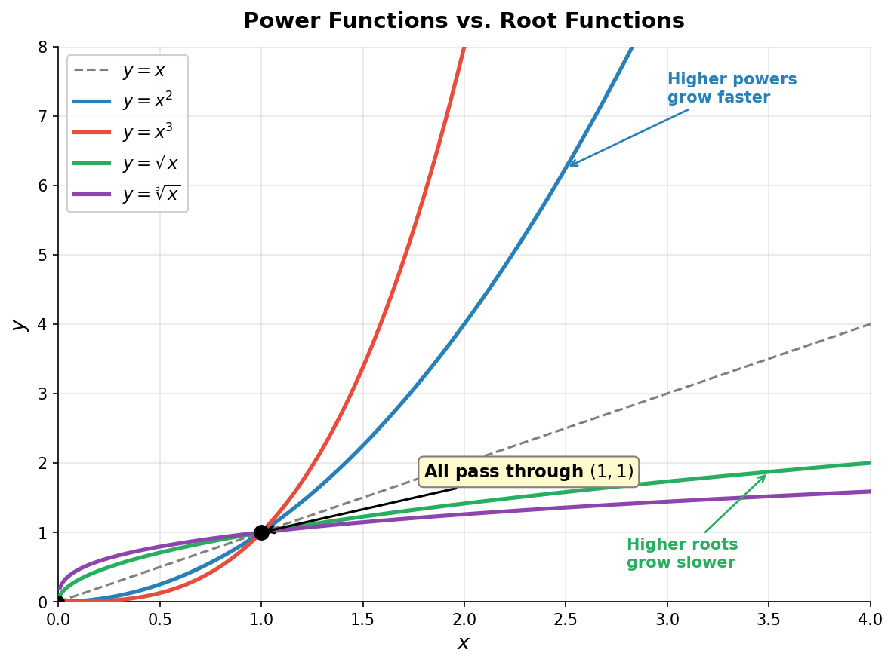

# 幂运算与根式

> **所属路径**：`00_高中复习/01_数学基础/01_代数与方程/04_幂运算与根式`
> **预计学习时间**：50 分钟
> **难度等级**：⭐

---

## 前置知识

- [一元二次方程](../01_一元二次方程/01_一元二次方程.md) — 求解方程时会用到平方与开方的概念
- [方程组与代数变形](../03_方程组与代数变形/03_方程组与代数变形.md) — 代数表达式的等价变形是化简根式的基础

> 如果你还不熟悉基本的代数运算规则和等式变形技巧，建议先完成以上课程再继续。

---

## 学习目标

完成本节后，你将能够：

1. 解释整数指数幂的含义，并熟练运用幂运算的五条基本法则
2. 将有理数指数与根式符号进行相互转换
3. 化简含根式的表达式，并对分母进行有理化
4. 理解幂运算在计算机数值计算中的实际意义

---

## 正文讲解

### 1. 从重复乘法说起——什么是幂

在日常生活中，我们经常遇到"重复乘法"的场景。比如一张纸对折 1 次变成 2 层，对折 2 次变成 4 层，对折 3 次变成 8 层——每多折一次，层数就翻倍。如果用数学来描述，对折 $n$ 次后的层数就是：

$$
\underbrace{2 \times 2 \times \cdots \times 2}_{n \text{ 个 } 2}
$$

每次都把这一长串乘法写出来太麻烦了，于是数学家发明了一种简洁的记号—— **幂运算（Power Operation）** 。我们把上面的式子记作 $2^n$ ，读作"2 的 $n$ 次幂"或"2 的 $n$ 次方"。

在 $a^n$ 这个记号中：

- $a$ 叫做 **底数（Base）** ，表示被重复相乘的那个数
- $n$ 叫做 **指数（Exponent）** ，表示重复相乘的次数
- 整个 $a^n$ 叫做 $a$ 的 $n$ 次 **幂（Power）**

> **直觉解读**：幂运算本质上就是乘法的"快捷方式"，就像乘法是加法的快捷方式一样。 $3 \times 4$ 是把 3 加 4 次，而 $3^4$ 是把 3 乘 4 次。

比如计算纸张对折 10 次后的层数：

$$
2^{10} = 1024
$$

仅仅对折 10 次，一张纸就变成了 1024 层！这就是幂运算的威力——它描述了 **指数级增长（Exponential Growth）** ，增长速度远超我们的日常直觉。

下面这张图直观地展示了幂函数与根式函数的增长速度对比——高次幂增长越来越快，而高次根增长越来越慢，它们都经过关键交汇点 $(1, 1)$ ：



> 📌 **图解说明**：蓝色 $y = x^2$ 和红色 $y = x^3$ 是幂函数，指数越大增长越陡峭；绿色 $y = \sqrt{x}$ 和紫色 $y = \sqrt[3]{x}$ 是根式函数，增长越来越平缓。灰色虚线 $y = x$ 是基准线。所有函数都过 $(1, 1)$ 点——这是理解幂运算的一个重要"锚点"。你可以运行 `code/plot_power_growth.py` 自行生成这张图。

### 2. 整数指数幂的运算法则

掌握了幂的概念之后，我们需要学会如何对幂进行计算。幂运算有五条核心法则，它们都可以从"幂就是重复乘法"这个定义推导出来。

#### 法则一：同底数幂相乘

当两个底数相同的幂相乘时，指数可以直接相加：

$$
a^m \cdot a^n = a^{m+n}
$$

> **直觉解读**：把 $a$ 乘 $m$ 次，再乘 $n$ 次，一共乘了 $m + n$ 次。

例如：

$$
2^3 \cdot 2^4 = \underbrace{2 \times 2 \times 2}_{3 \text{ 个}} \times \underbrace{2 \times 2 \times 2 \times 2}_{4 \text{ 个}} = 2^7 = 128
$$

#### 法则二：幂的幂

一个幂再求幂时，指数相乘：

$$
(a^m)^n = a^{m \cdot n}
$$

> **直觉解读**：把" $a$ 乘 $m$ 次"这件事再重复 $n$ 次，总共乘了 $m \times n$ 次。

例如：

$$
(2^3)^4 = 2^{3 \times 4} = 2^{12} = 4096
$$

#### 法则三：积的幂

一个乘积的幂等于各因子分别求幂再相乘：

$$
(a \cdot b)^n = a^n \cdot b^n
$$

> **直觉解读**：把 $a \times b$ 重复乘 $n$ 次，可以把 $a$ 和 $b$ 分别乘 $n$ 次再合并。

例如：

$$
(2 \times 5)^3 = 10^3 = 1000 = 2^3 \times 5^3 = 8 \times 125 = 1000
$$

#### 法则四：零指数

任何非零数的零次幂等于 1：

$$
a^0 = 1 \quad (a \neq 0)
$$

> **直觉解读**：从法则一来看， $a^n \cdot a^0 = a^{n+0} = a^n$ ，所以 $a^0$ 必须等于 1 才能让等式成立。

⚠️ 注意： $0^0$ 在数学中是一个特殊情况，不同的场景下有不同的约定，这里我们不讨论。

#### 法则五：负整数指数

底数的负指数等于其正指数的倒数：

$$
a^{-n} = \frac{1}{a^n} \quad (a \neq 0)
$$

> **直觉解读**：同样从法则一推导—— $a^n \cdot a^{-n} = a^{n + (-n)} = a^0 = 1$ ，所以 $a^{-n}$ 一定是 $a^n$ 的倒数。

例如：

$$
2^{-3} = \frac{1}{2^3} = \frac{1}{8} = 0.125
$$

将五条法则汇总如下：

| 法则 | 公式 | 条件 |
| ---- | ---- | ---- |
| 同底数幂相乘 | $a^m \cdot a^n = a^{m+n}$ | $a \neq 0$ |
| 幂的幂 | $(a^m)^n = a^{mn}$ | — |
| 积的幂 | $(ab)^n = a^n b^n$ | — |
| 零指数 | $a^0 = 1$ | $a \neq 0$ |
| 负整数指数 | $a^{-n} = \frac{1}{a^n}$ | $a \neq 0$ |

想一想：利用积的幂法则，你能否推出商的幂法则—— $\left(\dfrac{a}{b}\right)^n = \dfrac{a^n}{b^n}$ ？提示：把 $\dfrac{a}{b}$ 看作 $a \cdot b^{-1}$ 。

### 3. 有理数指数与根式

前面我们只讨论了整数指数（正整数、零、负整数），但指数能不能是分数呢？例如 $4^{1/2}$ 应该等于多少？

我们从一个问题出发：什么数的平方等于 4？显然是 2（取正值）。数学上，我们用 **根式（Radical）** 符号记作 $\sqrt{4} = 2$ 。更一般地：

- $\sqrt[n]{a}$ 表示 $a$ 的 $n$ 次方根，即满足 $x^n = a$ 的非负实数 $x$
- 其中 $n$ 叫做 **根指数（Index）** ， $a$ 叫做 **被开方数（Radicand）**

那么 $4^{1/2}$ 和 $\sqrt{4}$ 是什么关系呢？利用幂的幂法则：

$$
\left(4^{1/2}\right)^2 = 4^{(1/2) \times 2} = 4^1 = 4
$$

这说明 $4^{1/2}$ 的平方等于 4，因此 $4^{1/2} = \sqrt{4} = 2$ 。推广到一般情况：

$$
a^{1/n} = \sqrt[n]{a}
$$

更进一步，当指数是一般的分数 $m/n$ 时：

$$
a^{m/n} = \sqrt[n]{a^m} = \left(\sqrt[n]{a}\right)^m \quad (a > 0)
$$

> **直觉解读**：分数指数 $m/n$ 可以拆成两步——先开 $n$ 次方，再做 $m$ 次幂（或反过来，结果一样）。

例如：

$$
8^{2/3} = \left(\sqrt[3]{8}\right)^2 = 2^2 = 4
$$

$$
27^{-1/3} = \frac{1}{27^{1/3}} = \frac{1}{\sqrt[3]{27}} = \frac{1}{3}
$$

有了有理数指数，前面整数指数的所有运算法则都继续适用，只不过指数 $m$ 、 $n$ 可以是分数了。这一体系的完整扩展将在 **[指数运算律](../../03_指数与对数/01_指数运算律/)** 中继续展开。

### 4. 根式化简

在实际计算中，我们经常需要把根式化简为最简形式。化简的核心思路是：将被开方数中的 **完全平方因子** 提取到根号外面。

#### 基本方法

利用积的算术平方根性质 $\sqrt{a \cdot b} = \sqrt{a} \cdot \sqrt{b}$ （其中 $a, b \geq 0$ ），将被开方数分解：

$$
\sqrt{12} = \sqrt{4 \times 3} = \sqrt{4} \cdot \sqrt{3} = 2\sqrt{3}
$$

$$
\sqrt{50} = \sqrt{25 \times 2} = 5\sqrt{2}
$$

$$
\sqrt{72} = \sqrt{36 \times 2} = 6\sqrt{2}
$$

化简步骤总结：

1. 将被开方数做质因数分解
2. 找出其中的完全平方因子
3. 将完全平方因子移到根号外

对于高次根式，方法类似。例如化简 $\sqrt[3]{54}$ ：

$$
\sqrt[3]{54} = \sqrt[3]{27 \times 2} = \sqrt[3]{27} \cdot \sqrt[3]{2} = 3\sqrt[3]{2}
$$

#### 根式的加减

只有 **同类根式** （根指数相同且被开方数相同）才能合并。这类似于"同类项"合并：

$$
3\sqrt{2} + 5\sqrt{2} = 8\sqrt{2}
$$

$$
2\sqrt{3} - 7\sqrt{3} = -5\sqrt{3}
$$

有时需要先化简，才能发现它们是同类根式：

$$
\sqrt{8} + \sqrt{18} = 2\sqrt{2} + 3\sqrt{2} = 5\sqrt{2}
$$

### 5. 分母有理化

在数学中，我们通常要求最终结果的分母不含根式。将分母中的根式消去的过程叫做 **分母有理化（Rationalizing the Denominator）** 。

#### 单项根式分母

分子分母同乘根式即可：

$$
\frac{1}{\sqrt{3}} = \frac{1}{\sqrt{3}} \cdot \frac{\sqrt{3}}{\sqrt{3}} = \frac{\sqrt{3}}{3}
$$

$$
\frac{5}{\sqrt{2}} = \frac{5\sqrt{2}}{2}
$$

#### 含差式的分母

当分母形如 $a + \sqrt{b}$ 时，利用 **共轭表达式** 乘以 $a - \sqrt{b}$ ，使分母变为 $a^2 - b$ ：

$$
\frac{1}{1 + \sqrt{2}} = \frac{1}{1 + \sqrt{2}} \cdot \frac{1 - \sqrt{2}}{1 - \sqrt{2}} = \frac{1 - \sqrt{2}}{1 - 2} = \frac{1 - \sqrt{2}}{-1} = \sqrt{2} - 1
$$

> **直觉解读**：这里用到的技巧就是平方差公式 $(a+b)(a-b) = a^2 - b^2$ 。当 $b$ 是根式时， $b^2$ 就把根号消掉了。

### 6. 幂运算与人工智能的联系

你可能会好奇：学这些"古老"的运算法则，对学人工智能有什么用？其实幂运算在计算机科学和 AI 中无处不在。

**指数级增长与算法复杂度**：在算法分析中，我们用 $O(2^n)$ 表示指数时间复杂度——这意味着问题规模每增加 1，计算量就翻倍。理解 $2^{10} = 1024 \approx 10^3$ 这样的量级关系，是评估算法效率的基础。

**浮点数精度**：计算机用有限位数存储小数，所以 $10^{0.1} \times 10^{0.2}$ 和 $10^{0.3}$ 在计算机中可能不完全相等。AI 模型训练时，数以亿计的浮点运算会累积这种误差。因此在深度学习代码中，我们通常使用 `math.isclose()` 而非 `==` 来比较浮点数。

**大数运算**：Python 支持任意精度整数，这使得 $2^{100}$ 这样的大数运算可以精确完成。这在密码学、哈希函数等 AI 安全基础设施中至关重要。

在后续的 **[指数运算律](../../03_指数与对数/01_指数运算律/)** 课程中，我们将把指数从有理数扩展到实数，并引入指数函数——那是理解 AI 中 Softmax、Sigmoid 等核心函数的前提。

---

## 动手实践

前面我们学习了幂运算的法则和根式化简的方法，现在让我们用 Python 来亲自验证这些规则，同时感受计算机在处理幂运算时的一些有趣细节。

```python
# 文件：code/power_demo.py
# 环境要求：Python 3.10+（仅使用标准库 math）

import math

# 验证同底数幂相乘法则
a, m, n = 3, 4, 5
left = a**m * a**n
right = a**(m + n)
print(f"同底数幂相乘: {a}^{m} * {a}^{n} = {left}, {a}^({m}+{n}) = {right}, 相等: {left == right}")

# 有理数指数与根式转换
x = 27
print(f"{x}^(1/3) = {x**(1/3):.6f}, 即 ∛{x} = {x**(1/3):.6f}")

# 浮点精度问题
val1 = 10**0.1 * 10**0.2
val2 = 10**0.3
print(f"10^0.1 * 10^0.2 = {val1:.15f}")
print(f"10^0.3         = {val2:.15f}")
print(f"直接比较: {val1 == val2}, 用 isclose: {math.isclose(val1, val2)}")
```

**运行说明**：
- 环境要求：Python 3.10+，仅使用标准库 `math`
- 运行命令：`python code/power_demo.py`

**预期输出**：
```
==================================================
1. 整数指数幂的基本运算
==================================================
2^1 = 2
2^2 = 4
2^3 = 8
2^10 = 1024
2^0 = 1
2^(-1) = 0.5
2^(-3) = 0.125

==================================================
2. 验证幂运算律
==================================================
同底数幂相乘: 3^4 * 3^5 = 59049, 3^(4+5) = 59049, 相等: True
幂的幂: (3^4)^5 = 3486784401, 3^(4*5) = 3486784401, 相等: True
积的幂: (3*5)^5 = 759375, 3^5*5^5 = 759375, 相等: True
商的幂: (3/5)^5 = 0.07776, 3^5/5^5 = 0.07776, 相等: True

==================================================
3. 有理数指数与根式
==================================================
27^(1/3) = 3.000000, 即 ∛27 = 3.000000
验证: 3.000000^3 = 27.000000

8^(2/3) = 4.000000
等价于 (∛8)^2 = (2.000000)^2 = 4.000000

math.isqrt(144) = 12  (精确整数平方根)
math.sqrt(144)  = 12.0  (浮点平方根)

==================================================
4. 浮点精度问题（AI 开发中的常见陷阱）
==================================================
0.1 + 0.2 = 0.30000000000000004  (不精确等于 0.3!)
0.1 + 0.2 == 0.3 ? False
math.isclose(0.1 + 0.2, 0.3) ? True

10^0.1 * 10^0.2 = 1.995262314968880
10^0.3         = 1.995262314968880
直接比较相等: False
使用 isclose: True

2^100 = 1267650600228229401496703205376
(Python 支持任意精度整数，这在密码学和 AI 哈希计算中很重要)

==================================================
5. 根式化简验证
==================================================
√12 = 3.464102
2√3 = 3.464102
√12 == 2√3 ? True

√50 = 7.071068
5√2 = 7.071068
√50 == 5√2 ? True

1/√3  = 0.577350
√3/3  = 0.577350
1/√3 == √3/3 ? True
```

从输出中可以清楚看到：幂运算法则在整数范围内精确成立，但涉及浮点数时需要用 `math.isclose()` 来判断相等性。这在编写 AI 训练代码时是一个重要的工程细节。

---

## 典型误区

| 误区 | 正确理解 |
| ---- | -------- |
| 认为 $a^m \cdot b^m = (a+b)^m$ | 积的幂法则是 $(ab)^m = a^m \cdot b^m$ ，不能混淆乘法和加法。例如 $2^2 \cdot 3^2 = 4 \times 9 = 36 = 6^2 = (2 \times 3)^2$ ，但 $2^2 + 3^2 = 13 \neq 5^2$ |
| 认为 $a^m \cdot a^n = a^{mn}$ | 同底数幂相乘时指数应该 **相加** 而非相乘。 $a^m \cdot a^n = a^{m+n}$ 。指数相乘是"幂的幂"法则 $(a^m)^n = a^{mn}$ |
| 认为 $\sqrt{a + b} = \sqrt{a} + \sqrt{b}$ | 根号不满足加法拆分！例如 $\sqrt{9 + 16} = \sqrt{25} = 5$ ，但 $\sqrt{9} + \sqrt{16} = 3 + 4 = 7 \neq 5$ |
| 忽略负数开偶次方根无意义 | 在实数范围内， $\sqrt{-4}$ 没有意义（需要复数）。有理数指数 $a^{m/n}$ 要求 $a > 0$（当 $n$ 为偶数时） |
| 认为 $0^0 = 1$ 是绝对成立的 | $0^0$ 在数学中是不定式。虽然编程语言中通常约定 `0**0 = 1` ，但数学上需要视具体语境而定 |

---

## 练习题

### 练习 1：化简幂表达式（难度：⭐）

化简以下表达式，结果用正整数指数表示：

$$
\frac{a^5 \cdot a^{-2}}{a^2}
$$

<details>
<summary>💡 提示</summary>

先用同底数幂相乘法则处理分子，再用同底数幂相除（指数相减）处理整个分式。

</details>

<details>
<summary>✅ 参考答案</summary>

分子：

$$a^5 \cdot a^{-2} = a^{5 + (-2)} = a^3$$整体：$$\dfrac{a^3}{a^2} = a^{3-2} = a^1 = a$$

</details>

### 练习 2：根式化简（难度：⭐）

化简 $\sqrt{200}$ 和 $\sqrt[3]{128}$ 。

<details>
<summary>💡 提示</summary>

- 对 $\sqrt{200}$ ：先做质因数分解 $200 = 2^3 \times 5^2$ ，找出完全平方因子。
- 对 $\sqrt[3]{128}$ ：分解 $128 = 2^7$ ，找出完全立方因子。

</details>

<details>
<summary>✅ 参考答案</summary>

$$\sqrt{200} = \sqrt{100 \times 2} = 10\sqrt{2}$$$$\sqrt[3]{128} = \sqrt[3]{64 \times 2} = 4\sqrt[3]{2}$$

</details>

### 练习 3：分母有理化（难度：⭐⭐）

对以下表达式进行分母有理化：

$$
\frac{3}{2 + \sqrt{5}}
$$

<details>
<summary>💡 提示</summary>

分子分母同乘共轭表达式 $2 - \sqrt{5}$ ，利用平方差公式消去分母中的根式。

</details>

<details>
<summary>✅ 参考答案</summary>

$$\dfrac{3}{2 + \sqrt{5}} \cdot \dfrac{2 - \sqrt{5}}{2 - \sqrt{5}} = \dfrac{3(2 - \sqrt{5})}{4 - 5} = \dfrac{3(2 - \sqrt{5})}{-1} = -3(2 - \sqrt{5}) = 3\sqrt{5} - 6$$

</details>

### 练习 4：有理数指数计算（难度：⭐⭐）

不使用计算器，求以下各式的值：

(1) $16^{3/4}$

(2) $\left(\dfrac{8}{27}\right)^{-2/3}$

<details>
<summary>💡 提示</summary>

- 将底数分解为质因数幂的形式，再利用幂的幂法则。
- 负指数先取倒数，再处理分数指数。

</details>

<details>
<summary>✅ 参考答案</summary>

**(1)**

$$16^{3/4} = (2^4)^{3/4} = 2^{4 \times 3/4} = 2^3 = 8$$**(2)**$$\left(\dfrac{8}{27}\right)^{-2/3} = \left(\dfrac{27}{8}\right)^{2/3} = \dfrac{27^{2/3}}{8^{2/3}} = \dfrac{(3^3)^{2/3}}{(2^3)^{2/3}} = \dfrac{3^2}{2^2} = \dfrac{9}{4}$$

</details>

---

## 下一步学习

- 📖 下一个知识点：[不等式证明](../05_不等式证明/) — 学习用代数变形和幂运算证明不等式
- 📖 下一个知识主题：[函数与图像](../../02_函数与图像/) — 函数概念是指数函数、对数函数的基础
- 🔗 相关知识点：[指数运算律](../../03_指数与对数/01_指数运算律/) — 将幂运算扩展到实数指数，引入指数函数

---

## 参考资料


1. [Khan Academy — Exponents and Radicals](https://www.khanacademy.org/math/algebra/x2f8bb11595b61c86:rational-exponents-radicals) — 可汗学院免费课程，提供幂运算与根式的交互式练习（公开课程）
2. [OpenStax《Algebra and Trigonometry》— Chapter 1: Prerequisites](https://openstax.org/books/algebra-and-trigonometry-2e/pages/1-introduction-to-prerequisites) — 开源教材，覆盖指数与根式的完整内容（CC BY 许可）
3. [Python 官方文档 — math 模块](https://docs.python.org/3/library/math.html) — 了解 Python 中的数学运算函数（官方文档）
4. [Wikipedia — Exponentiation](https://en.wikipedia.org/wiki/Exponentiation) — 关于幂运算的系统性介绍与历史（公共知识库）
