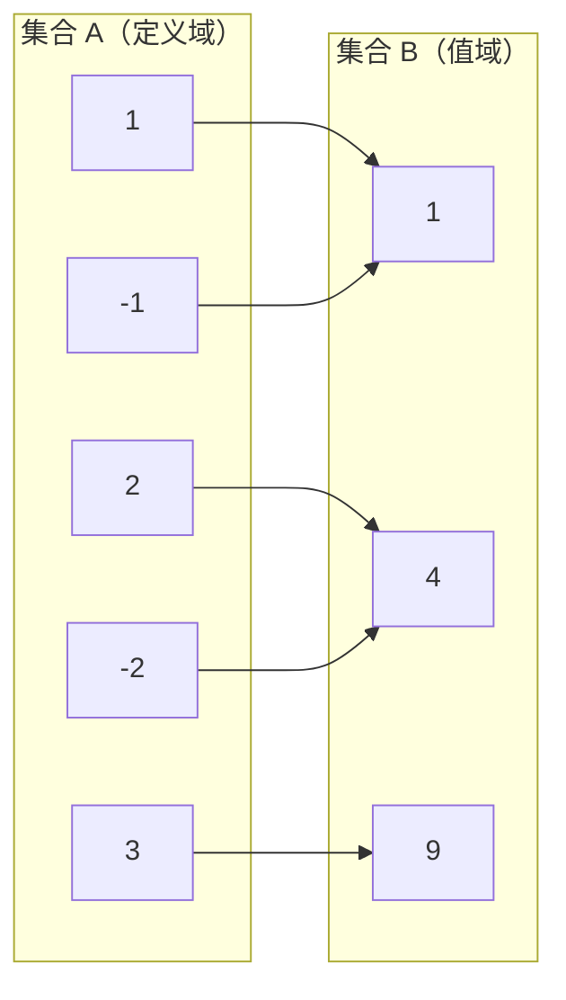
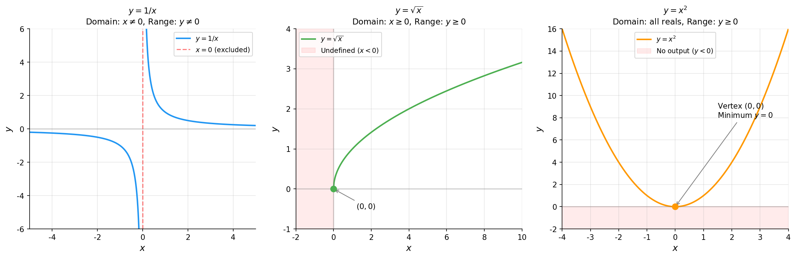
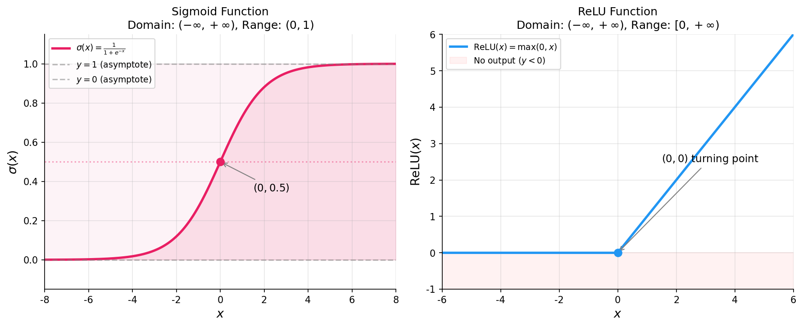

# 定义域与值域

> **所属路径**：`00_高中复习/01_数学基础/02_函数与图像/01_定义域与值域`
> **预计学习时间**：50 分钟
> **难度等级**：⭐

---

## 前置知识

- [一元二次方程](../../01_代数与方程/01_一元二次方程/01_一元二次方程.md) — 标准形式、判别式与配方法
- [不等式与绝对值](../../01_代数与方程/02_不等式与绝对值/02_不等式与绝对值.md) — 不等式的求解与数轴表示

> 如果以上内容还不熟悉，建议先完成对应课程再继续。本节会用到不等式的求解技巧（如分母不为零、根号下非负等条件），也会用到配方法来求值域。

---

## 学习目标

完成本节后，你将能够：

1. 理解函数的概念，能用集合语言描述函数的定义域和值域
2. 掌握求定义域的常见方法（分母 $\neq 0$ 、偶次根号下 $\geq 0$ 、对数真数 $> 0$ 等）
3. 掌握求值域的常见方法（配方法、判别式法、单调性法等）
4. 理解定义域和值域在人工智能中的直觉联系（如激活函数的输出范围）

---

## 正文讲解

### 1. 什么是函数？——从"对应关系"到"映射"

在开始讨论"定义域"和"值域"之前，我们先要搞清楚一个最根本的问题：**什么是函数？**

你一定见过自动售货机：你投入一枚硬币（输入），按下一个按钮（选择），机器吐出一瓶饮料（输出）。每次输入相同金额、按相同按钮，出来的饮料都是确定的——不会今天出可乐明天出橙汁。这种"**给定输入，有且只有一个确定的输出**"的对应关系，就是函数的本质。

用数学语言来说，如果集合 $A$ 中的每一个元素 $x$ ，按照某个确定的规则 $f$ ，都能在集合 $B$ 中找到**唯一确定**的元素 $y$ 与之对应，那么这个对应关系就叫做一个**函数（Function）**，记作：

$$
f: A \to B, \quad y = f(x)
$$

> **直觉解读**：这个符号在说——函数 $f$ 是一台"加工机器"，它从集合 $A$ 中接收原料 $x$ ，加工后输出产品 $y$ 到集合 $B$ 中。其中 $x$ 叫做**自变量（Independent Variable）**， $y$ 叫做**因变量（Dependent Variable）**。

下面这张图直观地展示了函数作为"映射"的含义：



> 📌 **图解说明**：以函数 $f(x) = x^2$ 为例，左侧集合 $A$ 中的每个输入值都对应右侧集合 $B$ 中唯一的输出值。注意 $1$ 和 $-1$ 都映射到 $1$ ，这是允许的——函数只要求"**每个输入对应唯一的输出**"，但不同输入可以有相同的输出。

理解了函数的概念之后，两个自然的问题随之而来：

- 这台"机器"能接受**哪些输入**？——这就是**定义域**。
- 这台"机器"能产出**哪些输出**？——这就是**值域**。

### 2. 定义域：函数的"合法输入"

**定义域（Domain）** 是指函数中自变量 $x$ 所有可以取的值组成的集合。用售货机的类比来说，定义域就是"机器认可的所有合法硬币面值"——投了不合法的硬币，机器会卡住、报错。

数学中的"报错"也是类似的：某些运算对输入有天然的限制。我们来逐一看看最常见的三种限制条件。

#### 限制一：分母不为零

在 **[代数与方程](../../01_代数与方程/)** 中我们就知道，除法运算中除数不能为零。所以，当函数表达式中有分式时，分母不能为零。

**例 1**：求函数 $f(x) = \dfrac{1}{x - 2}$ 的定义域。

要使函数有意义，需要分母 $x - 2 \neq 0$ ，即 $x \neq 2$ 。

所以定义域为 $\{x \in \mathbb{R} \mid x \neq 2\}$ ，即全体实数中去掉 $2$ 这一个点。

#### 限制二：偶次根号下非负

平方根 $\sqrt{x}$ 要求根号下的表达式 $\geq 0$ ——因为在实数范围内，负数没有平方根。这个条件正是在 **[不等式与绝对值](../../01_代数与方程/02_不等式与绝对值/02_不等式与绝对值.md)** 中学过的不等式求解。

**例 2**：求函数 $f(x) = \sqrt{3 - x}$ 的定义域。

需要根号下 $3 - x \geq 0$ ，解这个不等式：

$$
3 - x \geq 0 \implies x \leq 3
$$

所以定义域为 $(-\infty, 3]$ 。

#### 限制三：对数的真数大于零

对数函数 $\log_a(x)$ 要求真数 $x > 0$ ——因为对数是指数的逆运算，而指数函数的值永远为正，所以对数的输入也必须为正。

**例 3**：求函数 $f(x) = \ln(x + 1)$ 的定义域。

需要真数 $x + 1 > 0$ ，即 $x > -1$ 。

所以定义域为 $(-1, +\infty)$ 。

#### 多个限制条件同时存在

实际问题中，一个函数可能同时包含多种限制。这时我们需要把所有条件**取交集**。

**例 4**：求函数 $f(x) = \dfrac{\sqrt{x - 1}}{x - 3}$ 的定义域。

这个函数同时包含根号和分式，需要两个条件同时满足：

$$
\begin{cases}
x - 1 \geq 0 \\
x - 3 \neq 0
\end{cases}
$$

从第一个条件得 $x \geq 1$ ，从第二个条件得 $x \neq 3$ 。两者取交集，定义域为 $[1, 3) \cup (3, +\infty)$ 。

下面这张图直观地展示了三种典型函数的定义域和值域：



> 📌 **图解说明**：左图 $y = 1/x$ 的定义域排除了 $x = 0$ （红色虚线），值域也排除了 $y = 0$ ；中图 $y = \sqrt{x}$ 的定义域只包含 $x \geq 0$ 的部分（红色区域为未定义区域），值域为 $y \geq 0$ ；右图 $y = x^2$ 的定义域是全体实数，但值域仅为 $y \geq 0$ 。你可以运行 `code/plot_domain_range.py` 自行生成这张图。

### 3. 值域：函数的"可能输出"

弄清了"哪些输入合法"，接下来我们关心另一个问题：当自变量遍历整个定义域时，函数值 $y = f(x)$ 能取到**哪些值**？这些所有可能输出值的集合，就叫做**值域（Range）**。

值域的求法比定义域更灵活，需要根据函数的类型选择合适的策略。下面介绍三种最常用的方法。

#### 方法一：配方法

在 **[一元二次方程](../../01_代数与方程/01_一元二次方程/01_一元二次方程.md)** 中我们学过配方法，它在求二次函数值域时同样大显身手。

**例 5**：求函数 $f(x) = x^2 - 4x + 5$ 在 $x \in \mathbb{R}$ 上的值域。

我们把它配方——提取一个完全平方式：

$$
f(x) = x^2 - 4x + 5 = (x - 2)^2 + 1
$$

由于 $(x - 2)^2 \geq 0$ 恒成立，所以 $f(x) = (x-2)^2 + 1 \geq 1$ 。当 $x = 2$ 时取到最小值 $1$ 。

因此值域为 $[1, +\infty)$ 。

> **直觉解读**：配方法的本质是把二次函数"拆"成"平方部分 + 常数"的形式。因为平方部分永远 $\geq 0$ ，我们就能直接读出函数的最小值（或最大值，取决于二次项系数的正负）。

#### 方法二：判别式法

当函数形如 $y = \dfrac{ax^2 + bx + c}{dx + e}$ 这类分式时，可以反过来——把 $y$ 当作已知量、 $x$ 当作未知量，建立关于 $x$ 的方程，然后利用判别式 $\Delta \geq 0$ 来确定 $y$ 的取值范围。

**例 6**：求函数 $y = \dfrac{x^2 + 1}{x^2 + 2}$ 的值域。

将等式变形，把 $x^2$ 解出来：

$$
y(x^2 + 2) = x^2 + 1
$$

$$
yx^2 - x^2 = 1 - 2y
$$

$$
x^2(y - 1) = 1 - 2y
$$

当 $y \neq 1$ 时： $x^2 = \dfrac{1 - 2y}{y - 1}$

因为 $x^2 \geq 0$ ，所以需要 $\dfrac{1 - 2y}{y - 1} \geq 0$ 。

对这个分式不等式进行分析（分子分母同号）：

- 当 $1 - 2y \geq 0$ 且 $y - 1 > 0$ 时，即 $y \leq \frac{1}{2}$ 且 $y > 1$ ——矛盾，无解。
- 当 $1 - 2y \leq 0$ 且 $y - 1 < 0$ 时，即 $y \geq \frac{1}{2}$ 且 $y < 1$ ——成立，得 $\frac{1}{2} \leq y < 1$ 。

再检查 $y = 1$ 时： $x^2(1-1) = 1 - 2 = -1$ ，即 $0 = -1$ ，矛盾，所以 $y \neq 1$ 。

还要检查边界 $y = \frac{1}{2}$ 时： $x^2 = \frac{1 - 1}{1/2 - 1} = 0$ ，即 $x = 0$ ，代入原函数验证： $\frac{0+1}{0+2} = \frac{1}{2}$ ✓。

因此值域为 $\left[\dfrac{1}{2}, 1\right)$ 。

#### 方法三：单调性法

如果你已经知道函数在某个区间上是单调递增或单调递减的，那么值域就可以直接通过计算端点值来确定。

**例 7**：求函数 $f(x) = 2x + 1$ 在 $x \in [0, 3]$ 上的值域。

$f(x) = 2x + 1$ 是一次函数，在整个实数轴上单调递增。所以在 $[0, 3]$ 上：

- 最小值 $f(0) = 1$
- 最大值 $f(3) = 7$

值域为 $[1, 7]$ 。

> 📌 **方法选择小结**：遇到二次函数，优先用**配方法**直接读取最值；遇到分式函数或关系复杂的表达式，考虑用**判别式法**反解；如果函数的单调性一目了然，直接用**单调性法**算端点即可。

### 4. 定义域与值域在人工智能中的意义

你可能会好奇：学定义域和值域跟人工智能有什么关系？其实，关系非常密切！

在人工智能（特别是深度学习）中，神经网络的每一层都会使用一个 **[激活函数（Activation Function）](../../../../02_核心原理/03_深度学习/01_神经网络/)** ，而激活函数的**值域**直接决定了网络中数据的流动范围。

以两个最经典的激活函数为例：

**Sigmoid 函数**：

$$
\sigma(x) = \frac{1}{1 + e^{-x}}
$$

- 定义域：全体实数 $(-\infty, +\infty)$
- 值域： $(0, 1)$

Sigmoid 把任意大小的输入"压缩"到 $0$ 和 $1$ 之间，这使得它的输出可以被理解为**概率**——这就是为什么在分类任务中经常使用 Sigmoid 作为最后一层的激活函数。

**ReLU 函数**：

$$
\text{ReLU}(x) = \max(0, x) =
\begin{cases}
0, & x < 0 \\
x, & x \geq 0
\end{cases}
$$

- 定义域：全体实数 $(-\infty, +\infty)$
- 值域： $[0, +\infty)$

ReLU 把所有负数输入"截断"为零，只保留正数部分。它的值域是 $[0, +\infty)$ ——没有上界，这意味着信号可以自由传递而不会被过度压缩。

下面这张图展示了这两个激活函数的图像：



> 📌 **图解说明**：左图是 Sigmoid 函数，可以看到无论输入多大或多小，输出始终被限制在 $(0, 1)$ 的范围内，两条灰色虚线是 $y = 0$ 和 $y = 1$ 两条渐近线。右图是 ReLU 函数，输入为负时输出恒为零，输入为正时输出等于输入本身。你可以运行 `code/activation_functions.py` 自行生成这张图。

从函数的角度来看，设计激活函数本质上就是在设计一个具有特定**定义域-值域映射**的函数。选择不同的激活函数，就是在选择不同的"输出范围"，从而影响整个神经网络的行为。所以你看，"定义域与值域"这个看似简单的概念，正是理解人工智能模型的基础之一。

---

## 动手实践

前面我们学会了用数学方法求定义域和值域。现在让我们用 Python 代码来"验证"这些结论——通过给函数喂入一系列输入值，观察哪些输入会导致错误（从而确认定义域边界），以及输出值的范围（从而估算值域）。

```python
# 文件：code/check_domain.py
# 用途：通过数值试探来验证函数的定义域和值域
# 环境要求：Python 3.10+, numpy

import numpy as np

def check_domain(func, x_values, func_name="f"):
    """
    对一组输入值逐一测试函数，
    找出哪些输入合法（定义域内）、函数输出的范围（值域估计）。
    """
    valid_x = []
    valid_y = []
    invalid_x = []

    for x in x_values:
        try:
            y = func(x)
            # 检查结果是否为有限的实数
            if np.isfinite(y):
                valid_x.append(x)
                valid_y.append(y)
            else:
                invalid_x.append(x)
        except (ValueError, ZeroDivisionError):
            invalid_x.append(x)

    print(f"=== 函数 {func_name} 的数值检测 ===")
    print(f"测试范围：[{x_values[0]}, {x_values[-1]}]")
    print(f"合法输入数量：{len(valid_x)}")
    print(f"非法输入数量：{len(invalid_x)}")

    if invalid_x:
        print(f"部分非法输入：{invalid_x[:5]}...")

    if valid_y:
        print(f"输出最小值：{min(valid_y):.6f}")
        print(f"输出最大值：{max(valid_y):.6f}")
    print()


# ── 测试用例 ──
x_test = np.linspace(-10, 10, 10001)

# 测试 1：f(x) = 1/(x-2)，定义域应排除 x=2
check_domain(lambda x: 1 / (x - 2), x_test, "1/(x-2)")

# 测试 2：f(x) = sqrt(3-x)，定义域应为 x <= 3
check_domain(lambda x: np.sqrt(3 - x), x_test, "sqrt(3-x)")

# 测试 3：f(x) = ln(x+1)，定义域应为 x > -1
check_domain(lambda x: np.log(x + 1), x_test, "ln(x+1)")

# 测试 4：f(x) = x^2 - 4x + 5，值域应为 [1, +∞)
check_domain(lambda x: x**2 - 4*x + 5, x_test, "x²-4x+5")
```

**运行说明**：
- 环境要求：Python 3.10+, numpy
- 运行命令：`python code/check_domain.py`

**预期输出**：
```
=== 函数 1/(x-2) 的数值检测 ===
测试范围：[-10.0, 10.0]
合法输入数量：10000
非法输入数量：1
部分非法输入：[2.0]...
输出最小值：-5000.000000
输出最大值：5000.000000

=== 函数 sqrt(3-x) 的数值检测 ===
测试范围：[-10.0, 10.0]
合法输入数量：6501
非法输入数量：3500
部分非法输入：[3.002, 3.004, 3.006, 3.008, 3.01]...
输出最小值：0.000000
输出最大值：3.605551

=== 函数 ln(x+1) 的数值检测 ===
测试范围：[-10.0, 10.0]
合法输入数量：5501
非法输入数量：4500
部分非法输入：[-10.0, -9.998, -9.996, -9.994, -9.992]...
输出最小值：-6.214608
输出最大值：2.397895

=== 函数 x²-4x+5 的数值检测 ===
测试范围：[-10.0, 10.0]
合法输入数量：10001
非法输入数量：0
输出最小值：1.000000
输出最大值：145.000000
```

注意最后一个函数 $x^2 - 4x + 5$ 的输出最小值恰好是 $1.000000$ ，验证了我们用配方法得出的结论——值域为 $[1, +\infty)$ 。

---

## 典型误区

| 误区 | 正确理解 |
| ---- | -------- |
| "定义域就是 $x$ 能取的所有实数" | 只有在函数表达式没有任何限制条件时才成立。含分式、根号、对数等运算时，定义域会受到限制 |
| "值域和定义域一样大" | 完全不同的概念。例如 $f(x) = x^2$ 的定义域是 $\mathbb{R}$ ，但值域只有 $[0, +\infty)$ |
| "求值域只要代几个值看看就行" | 代值只能估计值域，不能证明值域。必须用配方法、判别式法等严格方法求解 |
| "分母等于零时函数值为无穷大" | 分母为零时函数**无定义**，不是"等于无穷大"。无穷大不是一个实数 |

---

## 练习题

### 练习 1：求定义域（难度：⭐）

求以下函数的定义域：

1. $f(x) = \dfrac{1}{x + 5}$
2. $f(x) = \sqrt{2x - 6}$
3. $f(x) = \ln(4 - x)$

<details>
<summary>💡 提示</summary>

分别对应三种基本限制：分母 $\neq 0$ 、根号下 $\geq 0$ 、对数真数 $> 0$ 。列出不等式后直接求解即可。

</details>

<details>
<summary>✅ 参考答案</summary>

1. 分母 $x + 5 \neq 0$ ，即 $x \neq -5$ ，定义域为 $\{x \in \mathbb{R} \mid x \neq -5\}$
2. 根号下 $2x - 6 \geq 0$ ，即 $x \geq 3$ ，定义域为 $[3, +\infty)$
3. 真数 $4 - x > 0$ ，即 $x < 4$ ，定义域为 $(-\infty, 4)$

</details>

### 练习 2：复合条件求定义域（难度：⭐⭐）

求函数 $f(x) = \dfrac{\sqrt{x + 2}}{x - 1}$ 的定义域。

<details>
<summary>💡 提示</summary>

需要同时满足两个条件：根号下 $x + 2 \geq 0$ ，分母 $x - 1 \neq 0$ 。两个条件取交集。

</details>

<details>
<summary>✅ 参考答案</summary>

条件一：根号下 $x + 2 \geq 0$ ，即 $x \geq -2$

条件二：分母 $x - 1 \neq 0$ ，即 $x \neq 1$

取交集，定义域为 $[-2, 1) \cup (1, +\infty)$

</details>

### 练习 3：用配方法求值域（难度：⭐⭐）

求函数 $f(x) = -x^2 + 6x - 5$ 在 $x \in \mathbb{R}$ 上的值域。

<details>
<summary>💡 提示</summary>

先提取系数 $-1$ ，然后对括号内的部分配方。注意二次项系数为负数时，函数有最大值而非最小值。

</details>

<details>
<summary>✅ 参考答案</summary>

配方过程：

$$f(x) = -(x^2 - 6x) - 5 = -(x^2 - 6x + 9 - 9) - 5 = -(x - 3)^2 + 9 - 5 = -(x - 3)^2 + 4$$

由于 $(x - 3)^2 \geq 0$ ，所以 $-(x-3)^2 \leq 0$ ，因此 $f(x) \leq 4$ 。

当 $x = 3$ 时取到最大值 $4$ 。

值域为 $(-\infty, 4]$

</details>

### 练习 4：激活函数分析（难度：⭐⭐）

Sigmoid 函数定义为 $\sigma(x) = \dfrac{1}{1 + e^{-x}}$ 。请回答以下问题：

1. 当 $x = 0$ 时， $\sigma(0)$ 等于多少？
2. 当 $x \to +\infty$ 时， $\sigma(x)$ 趋近于多少？为什么？
3. Sigmoid 函数的值域为什么是开区间 $(0, 1)$ 而不是闭区间 $[0, 1]$ ？

<details>
<summary>💡 提示</summary>

第 1 题直接代入。第 2 题想想 $x$ 很大时 $e^{-x}$ 会怎样。第 3 题想想 $\sigma(x)$ 能否真正等于 $0$ 或 $1$ 。

</details>

<details>
<summary>✅ 参考答案</summary>

1. $\sigma(0) = \dfrac{1}{1 + e^0} = \dfrac{1}{1 + 1} = \dfrac{1}{2} = 0.5$

2. 当 $x \to +\infty$ 时， $e^{-x} \to 0$ ，所以 $\sigma(x) \to \dfrac{1}{1 + 0} = 1$ 。即 $\sigma(x)$ 趋近于 $1$ ，因为极大的正数经过负指数运算后趋于零。

3. 分子为 $1$ ，分母为 $1 + e^{-x}$ 。由于 $e^{-x} > 0$ 恒成立（指数函数的值永远为正），所以分母 $> 1$ ，即 $\sigma(x) < 1$ ；同时分母是有限正数，所以 $\sigma(x) > 0$ 。因此 $\sigma(x)$ 永远不能**等于** $0$ 或 $1$ ，只能无限接近，所以值域是开区间 $(0, 1)$ 。

</details>

---

## 下一步学习

- 📖 下一个知识点：[单调性与奇偶性](../02_单调性与奇偶性/) — 掌握函数的递增递减性质和对称性质，为图像分析打下基础
- 🔗 相关知识点：[图像平移与变换](../04_图像平移与变换/) — 学习如何通过平移、拉伸等变换改变函数图像
- 📚 拓展阅读：[指数与对数](../../03_指数与对数/) — 深入理解指数函数和对数函数的定义域与值域

---

## 参考资料

> 以下资源均为公开可访问的免费内容。

1. [维基百科：函数](https://zh.wikipedia.org/wiki/函数) — 函数的定义、历史和基本概念（公共知识库，CC BY-SA 许可）
2. [Khan Academy: Domain and Range](https://www.khanacademy.org/math/algebra/x2f8bb11595b61c86:functions/x2f8bb11595b61c86:determining-the-domain-of-a-function/v/domain-of-a-function) — 可汗学院的定义域与值域互动课程（免费公开课程）
3. [Python 官方文档：math 模块](https://docs.python.org/zh-cn/3/library/math.html) — 本节代码中使用的数学函数说明（官方文档）
4. [3Blue1Brown: Neural Networks](https://www.3blue1brown.com/topics/neural-networks) — 直观理解神经网络中激活函数的作用（公开视频，CC BY 许可）
