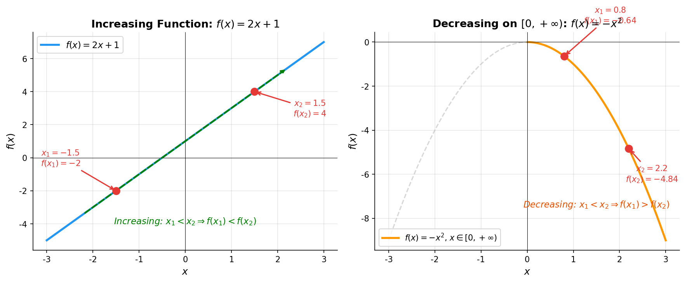
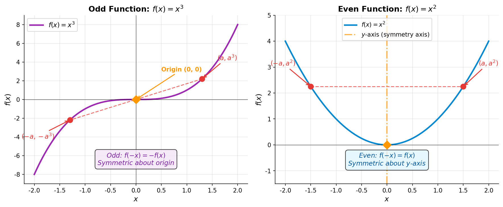

# 单调性与奇偶性

> **所属路径**：`00_高中复习/01_数学基础/02_函数与图像/02_单调性与奇偶性`
> **预计学习时间**：50 分钟
> **难度等级**：⭐

---

## 前置知识

- [定义域与值域](../01_定义域与值域/01_定义域与值域.md) — 函数的概念、定义域与值域的求法
- [不等式与绝对值](../../01_代数与方程/02_不等式与绝对值/02_不等式与绝对值.md) — 不等式的性质与求解

> 如果以上内容还不熟悉，建议先完成对应课程再继续。本节将用到不等式的基本变形（如 $x_1 < x_2$ 时判断 $f(x_1)$ 与 $f(x_2)$ 的大小关系），也会用到定义域关于原点对称的概念来讨论奇偶性。

---

## 学习目标

完成本节后，你将能够：

1. 理解函数单调性的定义，能用定义法判断一个函数在某区间上的单调性
2. 掌握单调性的直觉理解——图像"上升"与"下降"
3. 理解奇函数和偶函数的定义，以及它们的图像对称特征
4. 了解单调性与奇偶性在人工智能中的应用（如激活函数的单调性、损失函数的凸性）

---

## 正文讲解

### 1. 单调性的直觉——温度计的比喻

在正式接触数学定义之前，让我们先从一个日常场景出发。

想象一个夏天的午后，你把一根温度计放在户外。从中午 12 点到下午 3 点，温度从 30°C 持续上升到 38°C。在这个过程中，**时间越往后，温度越高**——如果我们把时间当作输入（自变量 $x$ ），把温度当作输出（因变量 $f(x)$ ），那么在 12 点到 3 点这个时间段内，温度就是一个**递增函数（Increasing Function）**。

反过来，到了傍晚 6 点之后，太阳落山，温度开始下降：时间越往后，温度越低。这时温度就变成了一个**递减函数（Decreasing Function）**。

这就是单调性的核心直觉：

- **递增** = 图像从左往右"上升"，输入变大、输出也变大
- **递减** = 图像从左往右"下降"，输入变大、输出反而变小

有了这个直觉，我们来看数学上如何精确描述它。

### 2. 单调性的严格定义

直觉虽然好理解，但数学需要更严格的表述。为什么？因为"上升"和"下降"这种说法太模糊了——到底是"总是上升"还是"大部分时候上升"？我们需要一个没有歧义的定义。

#### 递增函数的定义

设函数 $f(x)$ 在区间 $D$ 上有定义。如果对于区间 $D$ 内的**任意**两个值 $x_1$ 和 $x_2$ ，只要满足 $x_1 < x_2$ ，就一定有 $f(x_1) < f(x_2)$ ，那么我们说 $f(x)$ 在区间 $D$ 上是**递增的**。

用数学符号表达：

$$
\forall \, x_1, x_2 \in D, \quad x_1 < x_2 \Rightarrow f(x_1) < f(x_2)
$$

> **直觉解读**：这个定义在说——在区间 $D$ 上随便挑两个点 $x_1$ 和 $x_2$ ，只要 $x_1$ 在 $x_2$ 左边，那么 $f(x_1)$ 就一定在 $f(x_2)$ 下面。"总是如此，无一例外"——这就是"任意"二字的力量。

#### 递减函数的定义

类似地，如果 $x_1 < x_2 \Rightarrow f(x_1) > f(x_2)$ ，则 $f(x)$ 在 $D$ 上是**递减的**。

$$
\forall \, x_1, x_2 \in D, \quad x_1 < x_2 \Rightarrow f(x_1) > f(x_2)
$$

我们把"递增"或"递减"统称为**单调性（Monotonicity）**，对应的区间叫做**单调区间**。

想一想：为什么定义中强调"在区间 $D$ 上"？因为同一个函数在不同区间上可能有不同的单调性。比如 $f(x) = x^2$ 在 $(-\infty, 0]$ 上递减，在 $[0, +\infty)$ 上递增。

#### 用定义法证明单调性

掌握定义之后，我们来学习一种非常重要的方法——**定义法证明单调性**。它的步骤如下：

1. **取值**：在给定区间内任取 $x_1, x_2$ ，且 $x_1 < x_2$
2. **作差**：计算 $f(x_1) - f(x_2)$
3. **判号**：判断差值的正负号
4. **结论**：得出单调性

**例 1**：证明 $f(x) = 2x + 1$ 在 $\mathbb{R}$ 上递增。

**证明**：

设 $x_1, x_2 \in \mathbb{R}$ ，且 $x_1 < x_2$ 。

$$
f(x_1) - f(x_2) = (2x_1 + 1) - (2x_2 + 1) = 2(x_1 - x_2)
$$

因为 $x_1 < x_2$ ，所以 $x_1 - x_2 < 0$ ，因此 $2(x_1 - x_2) < 0$ ，即 $f(x_1) < f(x_2)$ 。

根据递增函数的定义， $f(x) = 2x + 1$ 在 $\mathbb{R}$ 上递增。$\square$

**例 2**：证明 $f(x) = -x^2$ 在 $[0, +\infty)$ 上递减。

**证明**：

设 $x_1, x_2 \in [0, +\infty)$ ，且 $x_1 < x_2$ （因此 $0 \leq x_1 < x_2$ ）。

$$
f(x_1) - f(x_2) = (-x_1^2) - (-x_2^2) = x_2^2 - x_1^2 = (x_2 + x_1)(x_2 - x_1)
$$

因为 $x_1 \geq 0$ 且 $x_2 > x_1 \geq 0$ ，所以 $x_2 + x_1 > 0$ ，且 $x_2 - x_1 > 0$ 。

因此 $f(x_1) - f(x_2) = (x_2 + x_1)(x_2 - x_1) > 0$ ，即 $f(x_1) > f(x_2)$ 。

根据递减函数的定义， $f(x) = -x^2$ 在 $[0, +\infty)$ 上递减。$\square$

下面这张图直观地展示了这两个例子：



> 📌 **图解说明**：左图展示了 $f(x) = 2x + 1$ 的递增特征——从左到右，函数值不断增大；右图展示了 $f(x) = -x^2$ 在 $[0, +\infty)$ 上的递减特征——随着 $x$ 增大，函数值反而减小。你可以运行 `code/plot_monotonicity.py` 自行生成这张图。

从图中可以清楚地看到：递增函数的图像从左到右"爬坡上升"，而递减函数的图像从左到右"滑坡下降"。

### 3. 奇偶性——对称之美

学完了单调性，我们再来看函数的另一个重要性质——**奇偶性（Parity）**。如果说单调性描述的是函数的"趋势"（上升还是下降），那么奇偶性描述的就是函数的"对称性"（是否有某种左右对称的结构）。

为什么要研究对称性？因为对称性意味着**可预测性**：如果一个函数是关于 $y$ 轴对称的，那么你只要知道右半边的图像，就能立刻"翻转"出左半边——信息量减半了。这在 AI 中也很有用：了解一个函数的对称性质，可以帮助我们简化计算、选择合适的模型结构。

#### 偶函数的定义

如果函数 $f(x)$ 的 **[定义域](../01_定义域与值域/01_定义域与值域.md)** 关于原点对称，并且对于定义域内的每一个 $x$ 都有：

$$
f(-x) = f(x)
$$

那么我们说 $f(x)$ 是一个**偶函数（Even Function）**。

> **直觉解读**：偶函数的图像关于 **$y$ 轴对称**。就像站在 $y$ 轴前面放了一面镜子——右边的图像通过镜子反射后，和左边完全重合。

最经典的偶函数就是 $f(x) = x^2$ ：

验证： $f(-x) = (-x)^2 = x^2 = f(x)$ ✓

#### 奇函数的定义

如果函数 $f(x)$ 的定义域关于原点对称，并且对于定义域内的每一个 $x$ 都有：

$$
f(-x) = -f(x)
$$

那么我们说 $f(x)$ 是一个**奇函数（Odd Function）**。

> **直觉解读**：奇函数的图像关于**原点对称**。想象把图像绕原点旋转 180°，旋转后的图像和原图完全重合。换句话说，右上方有多高，左下方就有多"深"。

最经典的奇函数就是 $f(x) = x^3$ ：

验证： $f(-x) = (-x)^3 = -x^3 = -f(x)$ ✓

#### 一个重要的前提条件

注意，不管是奇函数还是偶函数，定义中都要求**定义域关于原点对称**。这是一个容易被忽视但至关重要的前提。例如，函数 $f(x) = x^2$ 在定义域为 $[0, +\infty)$ 时，虽然也满足"$f(-x) = f(x)$"这个等式（在 $x \geq 0$ 的范围内），但因为定义域不关于原点对称（没有负数部分），所以它**不是偶函数**。

还有一个有趣的事实：如果 $f(x)$ 是奇函数，且 $x = 0$ 在定义域内，那么 $f(0) = -f(0)$ ，即 $2f(0) = 0$ ，因此 $f(0) = 0$ 。也就是说，**奇函数的图像必过原点**（前提是 $0$ 在定义域内）。

### 4. 用图像直观理解奇偶性

下面我们用两张函数图像来直观感受奇偶性的对称特征。



> 📌 **图解说明**：左图中 $f(x) = x^3$ 是奇函数，图像关于原点对称——对于任意一点 $(a, a^3)$ ，都存在关于原点的对称点 $(-a, -a^3)$ 。右图中 $f(x) = x^2$ 是偶函数，图像关于 $y$ 轴对称——对于任意一点 $(a, a^2)$ ，都存在关于 $y$ 轴的对称点 $(-a, a^2)$ ，它们的 $y$ 坐标相同。你可以运行 `code/plot_parity.py` 自行生成这张图。

从图中可以清楚地看到两种对称的区别：

- **偶函数**（右图）：把图像沿 $y$ 轴"对折"，左右两半完全重合
- **奇函数**（左图）：把图像绕原点"旋转 180°"，旋转后和原图完全重合

### 5. 单调性与奇偶性在 AI 中的意义

你可能会好奇：高中数学讲的单调性和奇偶性，和人工智能有什么关系？事实上，关系非常密切。在 **[深度学习](../../../../02_核心原理/03_深度学习/)** 中，有一类特殊的函数叫做 **[激活函数（Activation Function）](../../../../02_核心原理/03_深度学习/01_神经网络/02_激活函数/)** ，它们的单调性和奇偶性直接影响神经网络的训练效果。

#### 单调性与梯度方向

在训练神经网络时，我们需要通过 **[梯度下降（Gradient Descent）](../../../../01_基础能力/02_数学基础/04_最优化/02_梯度下降/)** 来调整参数。如果激活函数是**单调递增的**，那么它的导数恒正，梯度方向和输入变化方向一致——这让优化过程更加稳定和可预测。

几个常见激活函数的单调性：

| 激活函数 | 表达式 | 单调性 | 特点 |
| -------- | ------ | ------ | ---- |
| Sigmoid | $\sigma(x) = \dfrac{1}{1 + e^{-x}}$ | 全局递增 | 输出在 $(0, 1)$ |
| Tanh | $\tanh(x) = \dfrac{e^x - e^{-x}}{e^x + e^{-x}}$ | 全局递增 | 输出在 $(-1, 1)$ |
| ReLU | $\text{ReLU}(x) = \max(0, x)$ | 非递减 | $x < 0$ 时为 $0$ |

#### 奇偶性与输出分布

**Tanh** 函数是一个**奇函数**：

验证： $\tanh(-x) = \dfrac{e^{-x} - e^{x}}{e^{-x} + e^{x}} = -\dfrac{e^x - e^{-x}}{e^x + e^{-x}} = -\tanh(x)$ ✓

因为是奇函数，tanh 的输出关于原点对称，输出均值为零。这对神经网络训练很有好处——零均值的输出可以让下一层的梯度更加平衡，加速训练收敛。

**Sigmoid** 既不是奇函数也不是偶函数（输出在 $(0, 1)$ ，不关于原点对称），这也是为什么在实践中 tanh 有时比 sigmoid 更受欢迎的原因之一。

**ReLU** 同样既不是奇函数也不是偶函数（ $f(-1) = 0$ ，但 $-f(1) = -1 \neq 0$ ）。

这些看似简单的数学性质，在 AI 工程中却有着深远的影响。后续在 **[神经网络](../../../../02_核心原理/03_深度学习/01_神经网络/)** 的课程中，你会更深入地理解这些联系。

---

## 动手实践

理论讲完了，我们来动手写代码验证一下。下面这段 Python 程序会用数值方法检验一个函数是否具有单调性和奇偶性。

```python
# 文件：code/check_properties.py
# 数值检验函数的单调性与奇偶性
# 环境要求：Python 3.10+, numpy

import numpy as np


def check_monotonicity(f, a, b, n=1000):
    """
    数值检验函数 f 在区间 [a, b] 上的单调性。
    返回 'increasing', 'decreasing' 或 'non-monotonic'。
    """
    x = np.linspace(a, b, n)
    y = f(x)
    diffs = np.diff(y)  # 相邻点的差值

    if np.all(diffs > 0):
        return "strictly increasing（严格递增）"
    elif np.all(diffs < 0):
        return "strictly decreasing（严格递减）"
    elif np.all(diffs >= 0):
        return "non-decreasing（非递减/单调不减）"
    elif np.all(diffs <= 0):
        return "non-increasing（非递增/单调不增）"
    else:
        return "non-monotonic（非单调）"


def check_parity(f, a, b, n=1000, tol=1e-8):
    """
    数值检验函数 f 在关于原点对称的区间 [-b, b] 上的奇偶性。
    返回 'even', 'odd', 'both' 或 'neither'。
    """
    x = np.linspace(0.01, b, n)  # 避免 x=0 的特殊情况
    fx = f(x)
    f_neg_x = f(-x)

    is_even = np.allclose(f_neg_x, fx, atol=tol)
    is_odd = np.allclose(f_neg_x, -fx, atol=tol)

    if is_even and is_odd:
        return "both even and odd（既奇又偶，通常是零函数）"
    elif is_even:
        return "even（偶函数）"
    elif is_odd:
        return "odd（奇函数）"
    else:
        return "neither（非奇非偶）"


# ── 测试函数 ──
print("=" * 50)
print("函数单调性与奇偶性数值检验")
print("=" * 50)

# 函数 1：f(x) = 2x + 1
f1 = lambda x: 2 * x + 1
print(f"\nf(x) = 2x + 1:")
print(f"  在 [-10, 10] 上的单调性：{check_monotonicity(f1, -10, 10)}")
print(f"  奇偶性：{check_parity(f1, -10, 10)}")

# 函数 2：f(x) = -x^2
f2 = lambda x: -x ** 2
print(f"\nf(x) = -x²:")
print(f"  在 [0, 10] 上的单调性：{check_monotonicity(f2, 0, 10)}")
print(f"  奇偶性：{check_parity(f2, -10, 10)}")

# 函数 3：f(x) = x^3
f3 = lambda x: x ** 3
print(f"\nf(x) = x³:")
print(f"  在 [-10, 10] 上的单调性：{check_monotonicity(f3, -10, 10)}")
print(f"  奇偶性：{check_parity(f3, -10, 10)}")

# 函数 4：tanh（AI 中常用的激活函数）
f4 = lambda x: np.tanh(x)
print(f"\nf(x) = tanh(x):")
print(f"  在 [-5, 5] 上的单调性：{check_monotonicity(f4, -5, 5)}")
print(f"  奇偶性：{check_parity(f4, -5, 5)}")

# 函数 5：ReLU
f5 = lambda x: np.maximum(0, x)
print(f"\nf(x) = ReLU(x):")
print(f"  在 [-5, 5] 上的单调性：{check_monotonicity(f5, -5, 5)}")
print(f"  奇偶性：{check_parity(f5, -5, 5)}")
```

**运行命令**：`python code/check_properties.py`

**预期输出**：

```
==================================================
函数单调性与奇偶性数值检验
==================================================

f(x) = 2x + 1:
  在 [-10, 10] 上的单调性：strictly increasing（严格递增）
  奇偶性：neither（非奇非偶）

f(x) = -x²:
  在 [0, 10] 上的单调性：strictly decreasing（严格递减）
  奇偶性：even（偶函数）

f(x) = x³:
  在 [-10, 10] 上的单调性：strictly increasing（严格递增）
  奇偶性：odd（奇函数）

f(x) = tanh(x):
  在 [-5, 5] 上的单调性：strictly increasing（严格递增）
  奇偶性：odd（奇函数）

f(x) = ReLU(x):
  在 [-5, 5] 上的单调性：non-decreasing（非递减/单调不减）
  奇偶性：neither（非奇非偶）
```

代码验证了我们在正文中讲解的所有结论：

- $2x + 1$ 严格递增且非奇非偶（因为有常数项 $+1$ 破坏了对称性）
- $-x^2$ 在 $[0, +\infty)$ 上严格递减，且是偶函数
- $x^3$ 全局严格递增，且是奇函数
- $\tanh$ 全局严格递增，且是奇函数——这正是它作为激活函数的优良性质
- ReLU 在整个实数轴上是非递减的（左半段为零常数，右半段严格递增，但整体单调不减），且非奇非偶

---

## 典型误区

| 误区 | 正确理解 |
| ---- | -------- |
| "函数图像看起来在上升，就是递增的" | 单调性必须在指定的**区间**上判断。 $f(x) = x^2$ 的图像整体看起来像"先降后升"，但它在 $(-\infty, 0]$ 上递减、在 $[0, +\infty)$ 上递增 |
| "满足 $f(-x) = f(x)$ 就是偶函数" | 还需要检查一个前提：**定义域必须关于原点对称**。如果定义域只有 $[0, +\infty)$ ，即使满足公式也不是偶函数 |
| "不是奇函数就是偶函数" | 大多数函数既不是奇函数也不是偶函数（如 $f(x) = 2x + 1$ 、ReLU），奇偶性是特殊性质 |
| "奇函数一定过原点" | 只有当 $x = 0$ 在定义域内时才成立。例如 $f(x) = \dfrac{1}{x}$ 是奇函数，但 $x = 0$ 不在定义域内，图像不过原点 |

---

## 练习题

### 练习 1：用定义法证明单调性（难度：⭐）

用定义法（取值、作差、判号、结论）证明函数 $f(x) = 3x - 2$ 在 $\mathbb{R}$ 上是递增函数。

<details>
<summary>💡 提示</summary>

参照例 1 的方法：设 $x_1 < x_2$ ，计算 $f(x_1) - f(x_2)$ ，利用 $x_1 - x_2 < 0$ 来判断差值的符号。

</details>

<details>
<summary>✅ 参考答案</summary>

设 $x_1, x_2 \in \mathbb{R}$ ，且 $x_1 < x_2$ 。

$$
f(x_1) - f(x_2) = (3x_1 - 2) - (3x_2 - 2) = 3(x_1 - x_2)
$$

因为 $x_1 < x_2$ ，所以 $x_1 - x_2 < 0$ ，因此 $3(x_1 - x_2) < 0$ ，即 $f(x_1) < f(x_2)$ 。

根据递增函数的定义， $f(x) = 3x - 2$ 在 $\mathbb{R}$ 上递增。$\square$

</details>

### 练习 2：判断奇偶性（难度：⭐）

判断以下函数的奇偶性，并说明理由：

1. $f(x) = x^4 + 1$
2. $g(x) = x^3 - x$
3. $h(x) = 2^x$

<details>
<summary>💡 提示</summary>

分别计算 $f(-x)$ 并与 $f(x)$ 和 $-f(x)$ 比较。别忘了先检查定义域是否关于原点对称。

</details>

<details>
<summary>✅ 参考答案</summary>

1. $f(-x) = (-x)^4 + 1 = x^4 + 1 = f(x)$ 。定义域为 $\mathbb{R}$ （关于原点对称），所以 $f(x)$ 是**偶函数**。

2. $g(-x) = (-x)^3 - (-x) = -x^3 + x = -(x^3 - x) = -g(x)$ 。定义域为 $\mathbb{R}$ （关于原点对称），所以 $g(x)$ 是**奇函数**。

3. $h(-x) = 2^{-x} = \dfrac{1}{2^x}$ 。而 $h(x) = 2^x$ ， $-h(x) = -2^x$ 。显然 $h(-x) \neq h(x)$ 且 $h(-x) \neq -h(x)$ ，所以 $h(x)$ **既不是奇函数也不是偶函数**。

</details>

### 练习 3：单调区间与奇偶性综合（难度：⭐⭐）

已知函数 $f(x) = x^2 - 2x$ 。

1. 求 $f(x)$ 的单调递减区间和单调递增区间
2. 判断 $f(x)$ 的奇偶性

<details>
<summary>💡 提示</summary>

1. 先用配方法写成 $f(x) = (x - 1)^2 - 1$ ，顶点在 $(1, -1)$ ，二次函数的顶点左侧递减、右侧递增。
2. 计算 $f(-x)$ 并与 $f(x)$ 比较。

</details>

<details>
<summary>✅ 参考答案</summary>

1. 配方得 $f(x) = (x-1)^2 - 1$ ，顶点为 $(1, -1)$ 。

   - 在 $(-\infty, 1]$ 上，函数递减
   - 在 $[1, +\infty)$ 上，函数递增

2. $f(-x) = (-x)^2 - 2(-x) = x^2 + 2x$ 。而 $f(x) = x^2 - 2x$ 。

   - $f(-x) \neq f(x)$ （因为 $x^2 + 2x \neq x^2 - 2x$ ），所以不是偶函数
   - $-f(x) = -x^2 + 2x$ ， $f(-x) = x^2 + 2x \neq -f(x)$ ，所以不是奇函数
   
   结论： $f(x) = x^2 - 2x$ **既不是奇函数也不是偶函数**。

</details>

### 练习 4：AI 激活函数分析（难度：⭐⭐）

Sigmoid 函数定义为 $\sigma(x) = \dfrac{1}{1 + e^{-x}}$ 。请回答以下问题：

1. 用数值计算验证 Sigmoid 不是奇函数也不是偶函数（提示：计算 $\sigma(1)$ 和 $\sigma(-1)$ ）
2. 已知 $\sigma(-x) = 1 - \sigma(x)$ ，请说明这个性质体现了什么样的对称性

<details>
<summary>💡 提示</summary>

1. 分别算出 $\sigma(1)$ 和 $\sigma(-1)$ 的数值，再检查 $\sigma(-1) = \sigma(1)$（偶函数？）或 $\sigma(-1) = -\sigma(1)$（奇函数？）是否成立。
2. 把 $\sigma(-x) = 1 - \sigma(x)$ 改写为 $\sigma(x) + \sigma(-x) = 1$ ，想想这在图像上意味着什么。

</details>

<details>
<summary>✅ 参考答案</summary>

1. $\sigma(1) = \dfrac{1}{1 + e^{-1}} \approx 0.7311$ ， $\sigma(-1) = \dfrac{1}{1 + e^{1}} \approx 0.2689$ 。

   - 偶函数要求 $\sigma(-1) = \sigma(1)$ ，但 $0.2689 \neq 0.7311$ ❌
   - 奇函数要求 $\sigma(-1) = -\sigma(1) = -0.7311$ ，但 $0.2689 \neq -0.7311$ ❌
   
   结论：Sigmoid **既不是奇函数也不是偶函数**。

2. $\sigma(x) + \sigma(-x) = 1$ 说明 Sigmoid 函数的图像关于点 $(0, 0.5)$ 中心对称。如果把图像向下平移 $0.5$ ，即 $g(x) = \sigma(x) - 0.5$ ，那么 $g(-x) = \sigma(-x) - 0.5 = (1 - \sigma(x)) - 0.5 = 0.5 - \sigma(x) = -g(x)$ ，此时 $g(x)$ 变成了奇函数。这说明 Sigmoid 虽然本身不是奇函数，但它具有**关于点 $(0, 0.5)$ 的中心对称性**。

</details>

---

## 下一步学习

- 📖 下一个知识点： **[周期性与对称性](../03_周期性与对称性/)** — 进一步探讨函数的周期规律和对称结构
- 🔗 相关知识点： **[导数初步](../../12_导数初步/)** — 用导数来判断单调性，比定义法更高效
- 🔗 相关知识点： **[指数与对数](../../03_指数与对数/)** — 指数函数和对数函数的单调性

---

## 参考资料

> 只引用确定开源或公开可访问的资源，注明其开放获取性质。

1. [Khan Academy: Increasing, decreasing, positive or negative intervals](https://www.khanacademy.org/math/algebra/x2f8bb11595b61c86:functions/x2f8bb11595b61c86:intervals-where-a-function-is-positive-negative-increasing-or-decreasing/v/increasing-decreasing-positive-and-negative-intervals) — 单调性可视化讲解（公开课程）
2. [3Blue1Brown: But what is a Neural Network?](https://www.youtube.com/watch?v=aircAruvnKk) — 神经网络与激活函数入门（公开视频，CC BY 许可）
3. [维基百科：单调函数](https://zh.wikipedia.org/wiki/%E5%8D%95%E8%B0%83%E5%87%BD%E6%95%B0) — 单调性的严格数学定义与扩展（公共知识库）
4. [Python matplotlib 官方文档](https://matplotlib.org/stable/tutorials/index.html) — 函数图像绘制教程（官方文档）
