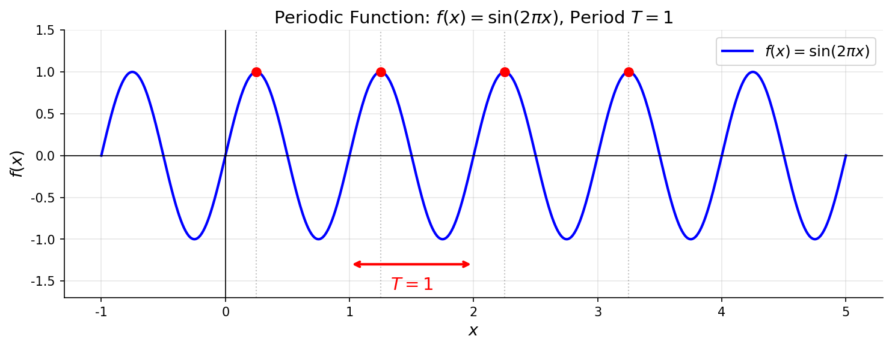
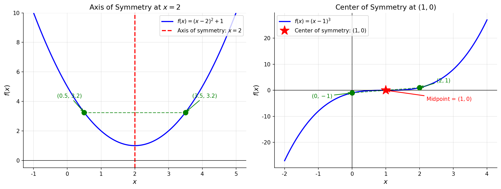

# 周期性与对称性

> **所属路径**：`00_高中复习/01_数学基础/02_函数与图像/03_周期性与对称性`
> **预计学习时间**：55 分钟
> **难度等级**：⭐⭐

---

## 前置知识

- [单调性与奇偶性](../02_单调性与奇偶性/02_单调性与奇偶性.md) — 函数的单调性定义与奇偶性判断（包括关于 $y$ 轴对称与关于原点对称）
- [定义域与值域](../01_定义域与值域/01_定义域与值域.md) — 函数的基本概念与定义域的确定方法

> 如果以上内容还不熟悉，建议先完成对应课程再继续。

---

## 学习目标

完成本节后，你将能够：

1. 解释周期函数的定义，判断一个函数是否为周期函数，并求最小正周期
2. 用代数条件判断函数是否关于任意直线 $x = a$ 对称或关于任意点 $(a, b)$ 对称
3. 理解奇偶性是一般对称性的特例，建立从特殊到一般的思维联系
4. 掌握"两条对称轴推出周期性"这一重要结论
5. 了解周期性与对称性在人工智能（音频处理、位置编码）中的应用背景

---

## 正文讲解

### 1. 从生活中的"重复"说起——周期性

你一定注意过生活中大量"周而复始"的现象：四季更替大约每 365 天循环一次；时钟的指针每 12 小时回到同一位置；心跳以大约 0.8 秒的节奏反复搏动。这些现象有一个共同特征——**某个量在经过固定间隔后，回到完全相同的状态**。数学把这种特征抽象为 **周期性（Periodicity）** 。

#### 周期函数的定义

设函数 $f(x)$ 的定义域为 $D$ 。如果存在一个正常数 $T > 0$ ，使得对定义域中的**每一个** $x$ 都满足：

$$
f(x + T) = f(x)
$$

那么就称 $f(x)$ 为 **周期函数（Periodic Function）** ， $T$ 称为 $f(x)$ 的一个 **周期（Period）** 。

> **直觉解读**：把函数图像沿 $x$ 轴向右平移 $T$ 个单位，如果图像与原来完全重合， $T$ 就是它的一个周期。

想一想：如果 $T$ 是周期，那么 $2T$ 、 $3T$ 、 $nT$（ $n$ 为正整数）是不是也是周期？答案是肯定的，因为 $f(x + 2T) = f((x + T) + T) = f(x + T) = f(x)$ 。所以周期不唯一——一个函数可以有无穷多个周期。

#### 最小正周期

在所有正周期中，**最小的那一个**称为 **最小正周期（Minimum Positive Period）** 。我们通常所说的"这个函数的周期是 $T$ "，指的就是最小正周期。

常见例子：

| 函数 | 最小正周期 |
| --- | --- |
| $\sin x$ | $2\pi$ |
| $\cos x$ | $2\pi$ |
| $\tan x$ | $\pi$ |
| $\sin 2x$ | $\pi$ |

> 💡 **小提醒**：不是所有周期函数都有最小正周期。例如常数函数 $f(x) = c$ 满足 $f(x + T) = c = f(x)$ 对**任意** $T > 0$ 成立，因此它的周期可以是任意正数，没有"最小的"那一个。不过高中阶段遇到的非常数周期函数都拥有最小正周期。

下面这张图展示了 $f(x) = \sin(2\pi x)$ 的图像，最小正周期 $T = 1$ ：



> 📌 **图解说明**：红色双箭头标出了一个完整周期 $T = 1$ 的长度。红色圆点标记了几个"间隔恰好为 $T$ "的点——它们的函数值完全相同，直观地展示了 $f(x+T) = f(x)$ 。你可以运行 `code/plot_periodic_function.py` 自行生成这张图。

### 2. 周期的性质与判断

掌握了定义之后，我们来看周期函数的几个实用性质。

#### 值域只需看一个周期

由于函数值不断重复，周期函数在**一个周期**内取到的所有值，就是它在整个定义域上的值域。这意味着分析周期函数时，我们只需要"盯住"一个周期长度的区间，就能了解函数的全部行为。

#### 周期的代数判断

直接验证 $f(x + T) = f(x)$ 有时并不方便。高考中常见的一类变式条件是：

- 若 $f(x + a) = -f(x)$ 对所有 $x$ 成立，则 $f(x + 2a) = -f(x + a) = -(-f(x)) = f(x)$ ，于是 $2a$ 是周期。
- 若 $f(x + a) = \dfrac{1}{f(x)}$ （且 $f(x) \neq 0$ ），则 $f(x + 2a) = \dfrac{1}{f(x+a)} = f(x)$ ，同样 $2a$ 是周期。

> **技巧**：遇到 $f(x + a) = g(f(x))$ 形式的条件时，试着把 $x$ 换成 $x + a$ ，看看能不能"消掉"中间步骤回到 $f(x)$ 。如果两步就回来了，周期就是 $2a$ ；如果三步回来，周期就是 $3a$ ，以此类推。

### 3. 一般对称性——从特殊到一般

在 **[单调性与奇偶性](../02_单调性与奇偶性/02_单调性与奇偶性.md)** 中，我们学过：

- **偶函数**的图像关于 $y$ 轴对称
- **奇函数**的图像关于原点对称

这两种对称是非常"特殊"的——对称轴恰好是 $y$ 轴（即 $x = 0$ ），对称中心恰好是原点 $(0, 0)$ 。但现实中的对称不会只出现在坐标原点附近。例如抛物线 $y = (x - 2)^2 + 1$ 的对称轴是 $x = 2$ ；立方函数 $y = (x - 1)^3$ 的对称中心是 $(1, 0)$ 。我们需要把对称性推广到**任意位置**。

#### 关于直线 $x = a$ 的轴对称

函数 $f(x)$ 的图像关于直线 $x = a$ 对称，当且仅当：

$$
f(a + t) = f(a - t) \quad \text{对所有 } t \text{ 成立}
$$

等价地，令 $x_1 = a + t$ ， $x_2 = a - t$ ，则 $x_1 + x_2 = 2a$ ，条件变为：

$$
f(x_1) = f(x_2) \quad \text{只要 } x_1 + x_2 = 2a
$$

> **直觉解读**：取对称轴 $x = a$ 两侧等距的两个点 $a + t$ 和 $a - t$ ，它们的函数值相等，就像照镜子一样左右对应。

**特例回顾**：当 $a = 0$ 时，条件退化为 $f(t) = f(-t)$ ——这正是偶函数的定义！所以偶函数的 $y$ 轴对称只是轴对称在 $a = 0$ 处的特殊情况。

#### 关于点 $(a, b)$ 的中心对称

函数 $f(x)$ 的图像关于点 $(a, b)$ 中心对称，当且仅当：

$$
f(a + t) + f(a - t) = 2b \quad \text{对所有 } t \text{ 成立}
$$

> **直觉解读**：取中心 $(a, b)$ 两侧等距的两个点，它们在图像上对应的位置关于中心连线的中点恰好就是 $(a, b)$ 。

**特例回顾**：当 $a = 0$ 且 $b = 0$ 时，条件退化为 $f(t) + f(-t) = 0$ ，即 $f(-t) = -f(t)$ ——这正是奇函数的定义！所以奇函数的原点对称是中心对称在 $(0, 0)$ 处的特殊情况。

下面这张图并排展示了这两种一般对称性：



> 📌 **图解说明**：左图中，抛物线 $f(x) = (x-2)^2 + 1$ 关于红色虚线 $x = 2$ 轴对称——绿色点对 $(0.5, 3.25)$ 和 $(3.5, 3.25)$ 的函数值相等。右图中，立方函数 $f(x) = (x-1)^3$ 关于红色星号标记的点 $(1, 0)$ 中心对称——绿色点对 $(0, -1)$ 和 $(2, 1)$ 的连线中点正好是 $(1, 0)$ 。你可以运行 `code/plot_symmetry.py` 自行生成这张图。

#### 一般对称性的统一视角

现在让我们把特殊与一般整理在一张表里：

| 对称类型 | 一般形式 | 特殊情况（奇偶性） |
| --- | --- | --- |
| 轴对称 | $f(a+t) = f(a-t)$ ，对称轴 $x = a$ | $a = 0$ → 偶函数，关于 $y$ 轴对称 |
| 中心对称 | $f(a+t) + f(a-t) = 2b$ ，对称中心 $(a, b)$ | $a = 0, b = 0$ → 奇函数，关于原点对称 |

建立这种"特殊是一般的子集"的认识，有助于你在面对新问题时举一反三。

### 4. 对称性与周期性的深层联系

你可能觉得"对称"和"周期"是两件不相关的事，但它们之间存在一个漂亮的定理：

> **定理**：若函数 $f(x)$ 同时关于直线 $x = a$ 和直线 $x = b$ 对称（$a \neq b$ ），则 $f(x)$ 是周期函数，且 $2|b - a|$ 是它的一个周期。

**证明思路**：由 $x = a$ 对称知 $f(a + t) = f(a - t)$ ；由 $x = b$ 对称知 $f(b + t) = f(b - t)$ 。将这两个条件组合，可以推出 $f(x + 2(b-a)) = f(x)$ 。

这个结论在高考中经常以隐蔽的形式考查——题目给出两个对称条件，要求你推出函数的周期，再利用周期性求解具体函数值。

类似地，**一轴对称 + 一中心对称**也能推出周期性。

### 5. 周期性与对称性在人工智能中的影子

你现在学的这些"重复"与"对称"的数学描述，在未来学习人工智能时会以新的面貌出现：

- **音频信号处理**：声音本质上是空气压力的周期性振动。麦克风把它转化为电信号后，数字化得到一串数值序列。识别说话内容、判断音乐情感，都需要从这些信号中提取周期特征（如基频、谐波）。这背后的数学工具——**[傅里叶变换](../../../../01_基础能力/02_数学基础/02_微积分/03_积分与面积/)** ——正是把任意信号分解为一组正弦、余弦周期函数的叠加。
- **时间序列预测**：电商销量呈现"一周为周期"的波动，气温呈现"一年为周期"的变化。机器学习模型需要识别这些周期模式才能做出准确预测。
- **Transformer 中的位置编码**：大语言模型（LLM）使用正弦和余弦函数来编码每个词在句子中的位置——这种 **位置编码（Positional Encoding）** 巧妙地利用了三角函数的周期性和对称性来表达"距离"信息。

这些应用将在后续的 **[三角函数图像](../../05_三角函数/02_三角函数图像/)** 、**[深度学习](../../../../02_核心原理/03_深度学习/)** 等模块中详细展开。现在你只需要知道：周期性与对称性的思想远不止是高中数学考题的工具，它们是理解信号、波形、序列的底层语言。

---

## 动手实践

学完了概念，我们来用 Python 动手验证周期性和对称性。

```python
# 文件：code/verify_periodicity.py
# 验证周期性与对称性
import numpy as np

# --- 1. 验证 sin(x) 的周期性 ---
x_values = np.linspace(0, 2 * np.pi, 5)
T = 2 * np.pi  # 周期

print("=== 验证 sin(x) 的周期性 ===")
for x in x_values:
    fx = np.sin(x)
    fx_T = np.sin(x + T)
    print(f"  sin({x:.2f}) = {fx:.6f},  sin({x:.2f} + 2π) = {fx_T:.6f},  相等: {np.isclose(fx, fx_T)}")

# --- 2. 验证 f(x) = (x-2)^2 + 1 关于 x=2 的轴对称 ---
a = 2
f = lambda x: (x - a) ** 2 + 1

print("\n=== 验证 f(x) = (x-2)^2 + 1 关于 x=2 的轴对称 ===")
for t in [0.5, 1, 1.5, 2]:
    left = f(a + t)
    right = f(a - t)
    print(f"  f({a}+{t}) = f({a+t}) = {left:.2f},  f({a}-{t}) = f({a-t}) = {right:.2f},  相等: {np.isclose(left, right)}")

# --- 3. 验证 f(x) = (x-1)^3 关于 (1,0) 的中心对称 ---
a, b = 1, 0
g = lambda x: (x - a) ** 3

print("\n=== 验证 f(x) = (x-1)^3 关于 (1,0) 的中心对称 ===")
for t in [0.5, 1, 1.5, 2]:
    s = g(a + t) + g(a - t)
    print(f"  f({a}+{t}) + f({a}-{t}) = {g(a+t):.2f} + {g(a-t):.2f} = {s:.2f},  等于 2b={2*b}: {np.isclose(s, 2*b)}")
```

**运行说明**：
- 环境要求：Python 3.10+，numpy
- 运行命令：`python code/verify_periodicity.py`

**预期输出**：
```
=== 验证 sin(x) 的周期性 ===
  sin(0.00) = 0.000000,  sin(0.00 + 2π) = 0.000000,  相等: True
  sin(1.57) = 1.000000,  sin(1.57 + 2π) = 1.000000,  相等: True
  sin(3.14) = 0.000000,  sin(3.14 + 2π) = 0.000000,  相等: True
  sin(4.71) = -1.000000,  sin(4.71 + 2π) = -1.000000,  相等: True
  sin(6.28) = -0.000000,  sin(6.28 + 2π) = -0.000000,  相等: True

=== 验证 f(x) = (x-2)^2 + 1 关于 x=2 的轴对称 ===
  f(2+0.5) = f(2.5) = 1.25,  f(2-0.5) = f(1.5) = 1.25,  相等: True
  f(2+1) = f(3) = 2.00,  f(2-1) = f(1) = 2.00,  相等: True
  f(2+1.5) = f(3.5) = 3.25,  f(2-1.5) = f(0.5) = 3.25,  相等: True
  f(2+2) = f(4) = 5.00,  f(2-2) = f(0) = 5.00,  相等: True

=== 验证 f(x) = (x-1)^3 关于 (1,0) 的中心对称 ===
  f(1+0.5) + f(1-0.5) = 0.12 + -0.12 = 0.00,  等于 2b=0: True
  f(1+1) + f(1-1) = 1.00 + -1.00 = 0.00,  等于 2b=0: True
  f(1+1.5) + f(1-1.5) = 3.38 + -3.38 = 0.00,  等于 2b=0: True
  f(1+2) + f(1-2) = 8.00 + -8.00 = 0.00,  等于 2b=0: True
```

从输出可以看到，三种代数条件（ $f(x+T) = f(x)$ 、 $f(a+t) = f(a-t)$ 、 $f(a+t) + f(a-t) = 2b$ ）都被数值验证成功，与理论完全吻合。

---

## 典型误区

| 误区 | 正确理解 |
| --- | --- |
| "周期就是最小正周期" | $T$ 是周期， $2T$ 、 $3T$ …… 也是周期。平时说的"周期"一般默认指最小正周期，但要注意区分 |
| "常数函数没有周期" | 常数函数对任意正数 $T$ 都满足 $f(x+T) = f(x)$ ，所以它是周期函数——只是没有**最小**正周期 |
| "只有偶函数才有对称轴" | 偶函数只是对称轴恰好在 $x = 0$ 的特殊情况。 $f(x) = (x-3)^2$ 关于 $x = 3$ 对称，但它不是偶函数 |
| "对称性和周期性无关" | 若一个函数同时关于两条不同的直线对称，它就一定是周期函数——对称可以"衍生"出周期 |
| "验证对称只需检查一两个点" | 对称性要求**所有** $t$ 都满足条件，仅验证几个点不能证明对称。但数值验证是排除错误的好方法 |

---

## 练习题

### 练习 1：周期的基本计算（难度：⭐）

已知 $f(x)$ 满足 $f(x + 3) = -f(x)$ 对所有 $x$ 成立，求 $f(x)$ 的一个周期。

<details>
<summary>💡 提示</summary>

将 $x$ 替换为 $x + 3$ ，得到 $f(x + 6) = -f(x + 3)$ ，然后利用原条件消去 $f(x + 3)$ 。

</details>

<details>
<summary>✅ 参考答案</summary>

由 $f(x + 3) = -f(x)$ ，将 $x$ 替换为 $x + 3$ 得 $f(x + 6) = -f(x + 3) = -(-f(x)) = f(x)$ 。

所以 $T = 6$ 是 $f(x)$ 的一个周期。

</details>

### 练习 2：判断对称轴（难度：⭐）

验证函数 $f(x) = (x - 5)^2$ 关于直线 $x = 5$ 对称。

<details>
<summary>💡 提示</summary>

计算 $f(5 + t)$ 和 $f(5 - t)$ ，看它们是否相等。

</details>

<details>
<summary>✅ 参考答案</summary>

$f(5 + t) = ((5+t) - 5)^2 = t^2$

$f(5 - t) = ((5-t) - 5)^2 = (-t)^2 = t^2$

$f(5 + t) = f(5 - t)$ 对所有 $t$ 成立，所以 $f(x) = (x-5)^2$ 关于 $x = 5$ 对称。 $\square$

</details>

### 练习 3：判断中心对称（难度：⭐⭐）

证明函数 $f(x) = \dfrac{1}{x - 2} + 3$ 关于点 $(2, 3)$ 中心对称。

<details>
<summary>💡 提示</summary>

计算 $f(2 + t) + f(2 - t)$ ，看它是否等于 $2 \times 3 = 6$ 。

</details>

<details>
<summary>✅ 参考答案</summary>

$$f(2 + t) = \dfrac{1}{(2+t) - 2} + 3 = \dfrac{1}{t} + 3$$$$f(2 - t) = \dfrac{1}{(2-t) - 2} + 3 = \dfrac{1}{-t} + 3 = -\dfrac{1}{t} + 3$$$$f(2 + t) + f(2 - t) = \left(\dfrac{1}{t} + 3\right) + \left(-\dfrac{1}{t} + 3\right) = 6 = 2 \times 3$$

∴ $f(x)$ 关于点 $(2, 3)$ 中心对称。 $\square$

</details>

### 练习 4：对称推周期（难度：⭐⭐⭐）

已知函数 $f(x)$ 同时关于直线 $x = 1$ 和直线 $x = 4$ 对称。求证 $f(x)$ 是周期函数，并求出一个周期。

<details>
<summary>💡 提示</summary>

由关于 $x = 1$ 对称得 $f(1 + t) = f(1 - t)$ ，令 $u = 1 + t$ 则 $f(u) = f(2 - u)$ 。再由关于 $x = 4$ 对称得 $f(v) = f(8 - v)$ 。将两式联立消去中间变量。

</details>

<details>
<summary>✅ 参考答案</summary>

由关于 $x = 1$ 对称：

$$f(u) = f(2 - u) \quad \cdots (1)$$由关于 $x = 4$ 对称：$$f(v) = f(8 - v) \quad \cdots (2)$$

在 $(1)$ 中令 $u = 8 - v$ ，得 $f(8 - v) = f(2 - (8 - v)) = f(v - 6)$ 。

再由 $(2)$ 知 $f(v) = f(8 - v) = f(v - 6)$ ，即 $f(v) = f(v - 6)$ 。

将 $v$ 替换为 $v + 6$ 得 $f(v + 6) = f(v)$ 。所以 $T = 6 = 2|4 - 1|$ 是 $f(x)$ 的一个周期。 $\square$

</details>

---

## 下一步学习

- 📖 下一个知识点：[图像平移与变换](../04_图像平移与变换/04_图像平移与变换.md) — 学习如何通过平移、伸缩、翻转等操作变换函数图像
- 🔗 相关知识点：[三角函数图像](../../05_三角函数/02_三角函数图像/) — 三角函数是最典型的周期函数，本节所有概念都会在三角函数中得到充分应用
- 📚 拓展阅读：[傅里叶级数](../../../../01_基础能力/02_数学基础/02_微积分/03_积分与面积/) — 了解"用周期函数分解任意信号"的数学基础

---

## 参考资料


1. [人教版高中数学必修第一册](https://bp.pep.com.cn/) — 周期函数定义与三角函数周期性（教育部官方教材公开资源）
2. [Khan Academy: Periodic Functions](https://www.khanacademy.org/math/algebra2/x2ec2f6f830c9fb89:trig/x2ec2f6f830c9fb89:period/v/determining-the-period-of-a-sinusoidal-function) — 周期函数的直观讲解（公开课程，CC BY-NC-SA 许可）
3. [3Blue1Brown: But what is a Fourier series?](https://www.youtube.com/watch?v=r6sGWTCMz2k) — 用动画理解周期信号分解（YouTube 公开视频）
4. [Wikipedia: Periodic function](https://en.wikipedia.org/wiki/Periodic_function) — 周期函数的数学定义与性质汇总（公共知识库）
