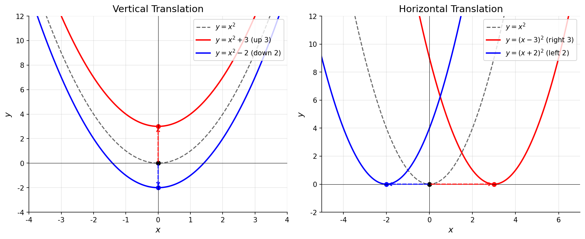
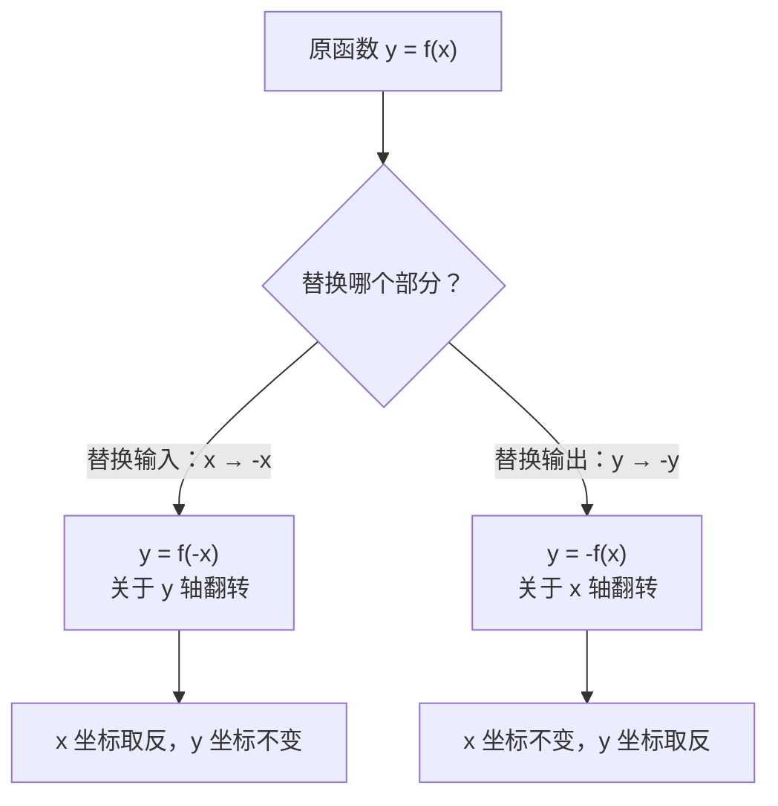
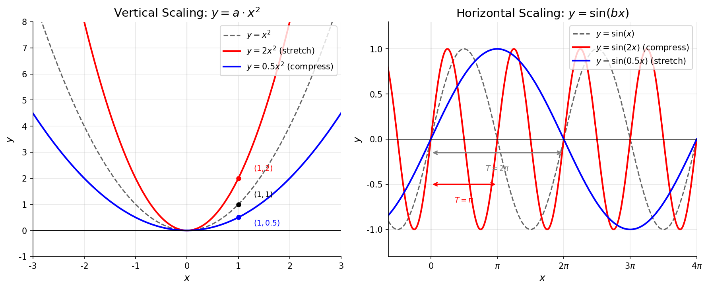
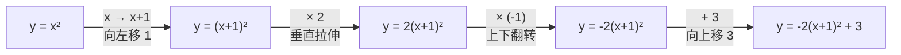

# 图像平移与变换

> **所属路径**：`00_高中复习/01_数学基础/02_函数与图像/04_图像平移与变换`
> **预计学习时间**：55 分钟
> **难度等级**：⭐⭐

---

## 前置知识

- [定义域与值域](../01_定义域与值域/01_定义域与值域.md) — 函数的概念、定义域与值域的求法
- [单调性与奇偶性](../02_单调性与奇偶性/02_单调性与奇偶性.md) — 函数的单调性与对称性，图像的基本形态

> 如果以上内容还不熟悉，建议先完成对应课程再继续。本节将在已知函数图像的基础上，通过平移、翻转和伸缩来"改造"图像，所以你需要先理解基本函数的图像长什么样。

---

## 学习目标

完成本节后，你将能够：

1. 掌握函数图像的平移规则——"左加右减，上加下减"
2. 理解翻转变换—— $f(-x)$ 关于 $y$ 轴翻转、 $-f(x)$ 关于 $x$ 轴翻转
3. 掌握伸缩变换——水平方向与垂直方向的拉伸和压缩
4. 能将多种变换组合运用，从基本函数图像推导出复杂函数图像
5. 理解图像变换在人工智能中的应用（数据增强、特征缩放）

---

## 正文讲解

### 1. 为什么要学图像变换？

在前两节课中，我们学会了分析函数的 **[定义域与值域](../01_定义域与值域/01_定义域与值域.md)** 、 **[单调性与奇偶性](../02_单调性与奇偶性/02_单调性与奇偶性.md)** 。但如果每遇到一个新函数都要从头画图，效率未免太低了。

仔细观察，你会发现很多复杂的函数其实是由简单函数"改造"而来的。比如 $y = (x - 3)^2 + 2$ 和 $y = x^2$ 长得很像——只不过向右移了 3 个单位，向上移了 2 个单位。如果你已经知道 $y = x^2$ 的图像是一条开口朝上的抛物线，那么画出 $y = (x - 3)^2 + 2$ 只需要把这条抛物线"挪个位"就行了。

这就是**图像变换（Graph Transformation）** 的核心思想：**从已知的基本图像出发，通过平移、翻转、伸缩等操作，快速得到新函数的图像**。

在人工智能领域，图像变换的思想同样无处不在。在训练计算机视觉模型时，我们经常通过 **[数据增强（Data Augmentation）](../../../../02_核心原理/03_深度学习/05_正则化/03_数据增强/)** 来扩大训练集——把一张猫的照片进行平移、翻转、缩放，就得到了"多张"看起来不同但仍然是猫的图片。它背后的数学原理，正是我们今天要学习的函数图像变换。

### 2. 平移变换——挪动函数的位置

平移是最简单也最常用的图像变换。它不改变图像的形状，只改变图像的位置——就像把一幅画从墙的左边挪到右边，画本身没变。

#### 上下平移

先看垂直方向的平移。如果我们在函数 $f(x)$ 的输出上加一个常数 $k$ ，得到 $y = f(x) + k$ ，效果就是把图像整体上下移动：

- $k > 0$ ：图像**向上**平移 $k$ 个单位
- $k < 0$ ：图像**向下**平移 $|k|$ 个单位

**例 1**：已知 $f(x) = x^2$ ，画出 $y = x^2 + 3$ 和 $y = x^2 - 2$ 的图像。

这很好理解——给每个输出值加上 $3$ ，所有点都向上移动 $3$ 个单位；减去 $2$ ，所有点都向下移动 $2$ 个单位。

> **直觉解读**：上下平移修改的是**输出值**（函数值）。 $f(x) + k$ 的含义是"先按原来的规则算出结果，然后在结果上加减 $k$ "。这就像给你的考试成绩统一加分或减分——每个人的名次（形状）不变，只是总分（位置）变了。

#### 左右平移

水平方向的平移稍微有点违反直觉。如果我们把函数中的 $x$ 替换为 $x - h$ ，得到 $y = f(x - h)$ ：

- $h > 0$ ：图像**向右**平移 $h$ 个单位
- $h < 0$ ：图像**向左**平移 $|h|$ 个单位

**例 2**：已知 $f(x) = x^2$ ，画出 $y = (x - 3)^2$ 和 $y = (x + 2)^2$ 的图像。

- $y = (x - 3)^2$ ：这里 $h = 3$ ，图像向右平移 3 个单位。原来的顶点在 $(0, 0)$ ，现在在 $(3, 0)$ 。
- $y = (x + 2)^2 = (x - (-2))^2$ ：这里 $h = -2$ ，图像向左平移 2 个单位。顶点移到 $(-2, 0)$ 。

等等——为什么 $x - 3$ 是向**右**移？不是减去 $3$ 应该向左吗？

> 📌 **关键理解**：想想 $y = (x - 3)^2$ 在 $x = 3$ 时的值： $(3 - 3)^2 = 0$ ——这和原函数 $y = x^2$ 在 $x = 0$ 时的值一样。也就是说，原来在 $x = 0$ 处发生的事情，现在"推迟"到了 $x = 3$ 处。输入要"多跑 3 步"才能达到同样的效果，所以图像向**右**移了。这就是"**左加右减**"这条口诀中"减法对应右移"的原因。

#### 平移口诀总结

把上下和左右平移结合起来，从 $y = f(x)$ 到 $y = f(x - h) + k$ ，口诀是：

$$
\boxed{\text{左加右减（水平），上加下减（垂直）}}
$$

注意水平方向是"反直觉"的（减 $h$ 向右移），而垂直方向是"符合直觉"的（加 $k$ 向上移）。

下面这张图展示了 $y = x^2$ 经过不同平移后的效果：



> 📌 **图解说明**：黑色虚线是原函数 $y = x^2$ ，其他彩色曲线分别展示了向上、向下、向左、向右平移的效果。每条曲线的形状完全相同，只是位置不同。你可以运行 `code/plot_translation.py` 自行生成这张图。

### 3. 翻转变换——函数的"镜像"

翻转变换就像照镜子——图像在某条轴上"反过来"。

#### 关于 y 轴翻转： $y = f(-x)$

把 $f(x)$ 中的 $x$ 替换为 $-x$ ，得到的 $y = f(-x)$ 是原图像关于 **$y$ 轴**的镜像。

**原理**：对于原图像上的点 $(a, f(a))$ ，在新图像上对应的是点 $(-a, f(a))$ —— $y$ 坐标不变， $x$ 坐标取反，这正是关于 $y$ 轴的对称。

**例 3**：已知 $f(x) = 2^x$ ，则 $y = f(-x) = 2^{-x}$ 的图像是把 $y = 2^x$ 关于 $y$ 轴翻转得到的。

回忆一下上一节学的 **[奇偶性](../02_单调性与奇偶性/02_单调性与奇偶性.md)** ：如果 $f(-x) = f(x)$ ——翻转后和原来一样——这不就是**偶函数**吗！所以偶函数的本质就是"关于 $y$ 轴翻转不变"。

#### 关于 x 轴翻转： $y = -f(x)$

在 $f(x)$ 前面加一个负号，得到的 $y = -f(x)$ 是原图像关于 **$x$ 轴**的镜像。

**原理**：对于原图像上的点 $(a, f(a))$ ，在新图像上对应的是 $(a, -f(a))$ —— $x$ 坐标不变， $y$ 坐标取反，这正是关于 $x$ 轴的对称。

**例 4**：已知 $f(x) = x^2$ ，则 $y = -f(x) = -x^2$ 的图像是把开口朝上的抛物线翻转成开口朝下的抛物线。

同样联系上一节的知识：如果 $f(-x) = -f(x)$ ——先关于 $y$ 轴翻转，再关于 $x$ 轴翻转，结果和原来一样——这就是**奇函数**的本质，即"关于原点旋转 180° 不变"。

下面的流程图总结了两种翻转变换的区别：



> 📌 **图解说明**：翻转变换的关键是区分"改变输入"和"改变输出"。 $f(-x)$ 改变的是输入（在函数内部加负号），效果是左右翻转； $-f(x)$ 改变的是输出（在函数外部加负号），效果是上下翻转。

### 4. 伸缩变换——拉伸和压缩

伸缩变换改变的不是图像的位置，而是图像的"胖瘦"和"高矮"。

#### 垂直伸缩： $y = a \cdot f(x)$

在函数值上乘以常数 $a$ ：

- $|a| > 1$ ：图像在垂直方向**拉伸**（变"高"）
- $0 < |a| < 1$ ：图像在垂直方向**压缩**（变"矮"）
- $a < 0$ ：额外进行关于 $x$ 轴的翻转

**例 5**：比较 $y = x^2$ 、 $y = 2x^2$ 和 $y = 0.5x^2$ 的图像。

$y = 2x^2$ 把每个函数值都放大为 2 倍，抛物线变得更"窄"（更陡峭）； $y = 0.5x^2$ 把每个函数值缩小为一半，抛物线变得更"宽"（更平缓）。

#### 水平伸缩： $y = f(bx)$

把 $x$ 替换为 $bx$ ：

- $|b| > 1$ ：图像在水平方向**压缩**为原来的 $\frac{1}{|b|}$ 倍
- $0 < |b| < 1$ ：图像在水平方向**拉伸**为原来的 $\frac{1}{|b|}$ 倍

注意水平伸缩也是"反直觉"的——乘以大于 1 的数反而是压缩！

**例 6**：比较 $y = \sin(x)$ 和 $y = \sin(2x)$ 的图像。

$\sin(x)$ 的周期是 $2\pi$ ， $\sin(2x)$ 的周期是 $\pi$ ——周期变为原来的一半，图像在水平方向被压缩了。这是因为 $x$ 乘以 $2$ 后，"变化速度"加快了一倍，原来需要 $2\pi$ 才走完的一个周期，现在 $\pi$ 就走完了。

> **直觉解读**：水平伸缩和左右平移一样违反直觉，原因是相同的——它们都是在修改**输入**。乘以 $b$ 让输入"加速"，所以图像反而变"短"了。记住这个规律：**凡是修改输入的变换，效果都和系数的方向相反**。

下面这张图展示了伸缩变换的效果：



> 📌 **图解说明**：左图展示垂直伸缩—— $y = 2x^2$ 使抛物线变窄（垂直拉伸）， $y = 0.5x^2$ 使抛物线变宽（垂直压缩）。右图展示水平伸缩—— $y = \sin(2x)$ 周期缩短（水平压缩）， $y = \sin(0.5x)$ 周期加长（水平拉伸）。你可以运行 `code/plot_scaling.py` 自行生成这张图。

### 5. 组合变换——从简单到复杂

实际中我们经常需要**组合多种变换**来从基本函数得到目标函数。关键在于按正确的顺序施加变换。

**例 7**：从 $y = x^2$ 出发，通过变换得到 $y = -2(x + 1)^2 + 3$ 的图像。

我们可以分步进行：

1. **起点**： $y = x^2$ （标准抛物线，顶点在原点）
2. **水平平移**： $x \to x + 1$ ，图像向左移 1 个单位 → $y = (x+1)^2$ ，顶点到 $(-1, 0)$
3. **垂直伸缩**：乘以 $2$ ，纵向拉伸 → $y = 2(x+1)^2$ ，变窄
4. **关于 x 轴翻转**：加负号 → $y = -2(x+1)^2$ ，开口朝下
5. **垂直平移**：加 $3$ ，向上移 3 个单位 → $y = -2(x+1)^2 + 3$ ，顶点到 $(-1, 3)$



> 📌 **图解说明**：组合变换的关键是找到正确的**分解顺序**。一般的推荐顺序是：先水平变换（左右平移和水平伸缩），再垂直变换（垂直伸缩、翻转和上下平移）。

### 6. 图像变换在人工智能中的应用

图像变换的思想在人工智能中有两个重要的应用场景。

#### 数据增强

在训练 **[卷积神经网络（CNN）](../../../../02_核心原理/03_深度学习/09_卷积网络/)** 进行图像识别时，训练数据的数量直接影响模型的效果。**数据增强（Data Augmentation）** 正是利用图像变换来"凭空创造"更多训练数据：

- **平移**：把图片在水平或垂直方向移动几个像素
- **翻转**：把图片左右翻转（镜像）
- **缩放**：把图片放大或缩小一定比例
- **旋转**：把图片旋转一定角度

每种变换都产生了一张"新"图片，但图片中的内容（比如一只猫）没有改变。这让模型学会了"不管猫在图片的什么位置、朝哪个方向，它都是猫"——这种能力叫做**平移不变性（Translation Invariance）**。

#### 特征缩放

在 **[特征工程](../../../../01_基础能力/05_数据能力/03_特征工程/)** 中，我们经常需要对数据进行**标准化（Standardization）** 或 **归一化（Normalization）**。这本质上就是对数据做线性变换：

$$
x' = \frac{x - \mu}{\sigma}
$$

其中 $\mu$ 是均值（平移）， $\sigma$ 是标准差（伸缩）。这个公式先把数据"平移"到以 $0$ 为中心，再"缩放"到标准差为 $1$ ——正是我们在本节学到的平移 + 伸缩的组合！

---

## 动手实践

现在让我们用 Python 来亲手实现图像变换，直观感受各种变换的效果。

```python
# 文件：code/transform_demo.py
# 用途：演示函数图像的平移、翻转和伸缩变换
# 环境要求：Python 3.10+, numpy, matplotlib

import numpy as np
import matplotlib.pyplot as plt

# ── 配置 ──
plt.rcParams['font.sans-serif'] = ['DejaVu Sans']
plt.rcParams['axes.unicode_minus'] = False

def apply_transforms(x, f, transforms):
    """
    对函数 f 应用一系列变换。
    transforms 是一个字典，包含可选的变换参数：
      h: 水平平移量（正数向右）
      k: 垂直平移量（正数向上）
      a: 垂直伸缩因子
      b: 水平伸缩因子
      flip_x: 是否关于 y 轴翻转
      flip_y: 是否关于 x 轴翻转
    """
    h = transforms.get('h', 0)
    k = transforms.get('k', 0)
    a = transforms.get('a', 1)
    b = transforms.get('b', 1)
    flip_x = transforms.get('flip_x', False)
    flip_y = transforms.get('flip_y', False)

    # 先处理输入端变换
    x_input = b * ((-x) if flip_x else x) - h * b
    # 再处理输出端变换
    y = a * f(x_input)
    if flip_y:
        y = -y
    y = y + k
    return y


# ── 演示 ──
x = np.linspace(-5, 5, 500)

# 基本函数
f = lambda t: t ** 2

print("=== 函数图像变换演示 ===\n")

# 演示各种变换
demos = [
    ("original",     {},                         "y = x^2 (original)"),
    ("shift_right",  {'h': 2},                   "y = (x-2)^2 (shift right 2)"),
    ("shift_up",     {'k': 3},                   "y = x^2 + 3 (shift up 3)"),
    ("flip_y_axis",  {'flip_x': True},            "y = (-x)^2 = x^2 (y-axis flip)"),
    ("flip_x_axis",  {'flip_y': True},            "y = -x^2 (x-axis flip)"),
    ("stretch_v",    {'a': 2},                   "y = 2x^2 (vertical stretch)"),
    ("compress_v",   {'a': 0.5},                 "y = 0.5x^2 (vertical compress)"),
]

for name, transform, desc in demos:
    y = apply_transforms(x, f, transform)
    # 在 x=1 处计算值作为验证
    idx = np.argmin(np.abs(x - 1.0))
    print(f"  {desc:45s} -> f(1) = {y[idx]:.2f}")

print("\nAll transformations computed successfully.")
```

**运行说明**：
- 环境要求：Python 3.10+, numpy, matplotlib
- 运行命令：`python code/transform_demo.py`

**预期输出**：
```
=== 函数图像变换演示 ===

  y = x^2 (original)                          -> f(1) = 1.00
  y = (x-2)^2 (shift right 2)                 -> f(1) = 1.00
  y = x^2 + 3 (shift up 3)                    -> f(1) = 4.00
  y = (-x)^2 = x^2 (y-axis flip)              -> f(1) = 1.00
  y = -x^2 (x-axis flip)                      -> f(1) = -1.00
  y = 2x^2 (vertical stretch)                 -> f(1) = 2.00
  y = 0.5x^2 (vertical compress)              -> f(1) = 0.50

All transformations computed successfully.
```

注意一个有趣的结果： $y = (-x)^2$ 关于 $y$ 轴翻转后得到 $y = x^2$ 本身——因为 $x^2$ 是偶函数，关于 $y$ 轴对称！这正好验证了上一节学的奇偶性概念。

---

## 典型误区

| 误区 | 正确理解 |
| ---- | -------- |
| " $y = f(x - 3)$ 是向左移 3 个单位" | 恰好相反！ $x - 3$ 对应向**右**移 3 个单位。口诀"左加右减"中的"减"指减号对应右移 |
| " $y = f(2x)$ 是水平拉伸为 2 倍" | 恰好相反！ $f(2x)$ 是水平**压缩**为 $\frac{1}{2}$ 倍。修改输入的变换效果与系数方向相反 |
| "先平移还是先伸缩无所谓" | 顺序会影响结果。 $2f(x) + 3$ 和 $2(f(x) + 3)$ 是不同的变换——前者先伸缩再平移，后者先平移再伸缩 |
| "翻转会改变函数的形状" | 翻转只改变方向，不改变形状。翻转后的图像和原图像是全等的（形状大小完全相同） |

---

## 练习题

### 练习 1：平移变换（难度：⭐）

已知函数 $f(x) = \sqrt{x}$ ，写出以下变换后的函数表达式，并指出新函数图像与原图像的关系：

1. 图像向右平移 4 个单位
2. 图像向上平移 1 个单位
3. 图像同时向右平移 4 个单位、向上平移 1 个单位

<details>
<summary>💡 提示</summary>

右移 $h$ 个单位： $x \to x - h$ ；上移 $k$ 个单位：加 $k$ 。第 3 题同时应用两个变换。

</details>

<details>
<summary>✅ 参考答案</summary>

1. 向右平移 4： $y = \sqrt{x - 4}$ ，定义域从 $[0, +\infty)$ 变为 $[4, +\infty)$
2. 向上平移 1： $y = \sqrt{x} + 1$ ，值域从 $[0, +\infty)$ 变为 $[1, +\infty)$
3. 同时变换： $y = \sqrt{x - 4} + 1$ ，起始点从 $(0, 0)$ 移到 $(4, 1)$

</details>

### 练习 2：翻转变换（难度：⭐）

已知函数 $f(x) = 2^x$ ，画出（或描述）以下函数的图像：

1. $y = 2^{-x}$ （即 $f(-x)$ ）
2. $y = -2^x$ （即 $-f(x)$ ）

<details>
<summary>💡 提示</summary>

$f(-x)$ 是关于 $y$ 轴翻转， $-f(x)$ 是关于 $x$ 轴翻转。想想 $2^x$ 的基本形状——从左到右递增，过 $(0, 1)$ 点，始终在 $x$ 轴上方。

</details>

<details>
<summary>✅ 参考答案</summary>

1. $y = 2^{-x}$ 是把 $y = 2^x$ 关于 $y$ 轴翻转。原来从左到右递增，翻转后从左到右递减。仍然过 $(0, 1)$ 点，仍然始终为正。图像变成了一条从左上角向右下角趋近于 $0$ 的曲线。

2. $y = -2^x$ 是把 $y = 2^x$ 关于 $x$ 轴翻转。所有函数值取反——原来始终为正，翻转后始终为负。过 $(0, -1)$ 点，图像在 $x$ 轴下方。

</details>

### 练习 3：组合变换（难度：⭐⭐）

从 $y = |x|$ 出发，通过逐步变换得到 $y = -|x - 2| + 4$ 。请写出每一步变换及对应的函数表达式。

<details>
<summary>💡 提示</summary>

$y = -|x - 2| + 4$ 可以分解为：水平平移（ $x \to x-2$ ）→ 垂直翻转（加负号）→ 垂直平移（ $+4$ ）。逐步写出每一步的表达式。

</details>

<details>
<summary>✅ 参考答案</summary>

1. **起点**： $y = |x|$ ，顶点在 $(0, 0)$ ，开口朝上的 V 形
2. **右移 2**： $y = |x - 2|$ ，顶点移到 $(2, 0)$
3. **关于 x 轴翻转**： $y = -|x - 2|$ ，顶点仍在 $(2, 0)$ ，但开口朝下
4. **上移 4**： $y = -|x - 2| + 4$ ，顶点移到 $(2, 4)$

最终图像是一个顶点在 $(2, 4)$ 、开口朝下的 V 形。

</details>

### 练习 4：编程实践——数据标准化（难度：⭐⭐）

下面是一组考试成绩数据： $[72, 85, 91, 68, 77, 95, 83, 70]$

请用 Python 对这组数据进行标准化变换 $x' = \dfrac{x - \mu}{\sigma}$ ，其中 $\mu$ 是均值， $\sigma$ 是标准差。验证变换后的数据均值约为 $0$ ，标准差约为 $1$ 。

<details>
<summary>💡 提示</summary>

先计算均值和标准差，然后对每个数据点应用 $(x - \mu) / \sigma$ 。可以用 numpy 的 `np.mean()` 和 `np.std()` 函数。

</details>

<details>
<summary>✅ 参考答案</summary>

```python
import numpy as np

scores = np.array([72, 85, 91, 68, 77, 95, 83, 70])
mu = np.mean(scores)
sigma = np.std(scores)

# 标准化：先平移（减均值），再伸缩（除标准差）
standardized = (scores - mu) / sigma

print(f"原始数据：{scores}")
print(f"均值 μ = {mu:.2f}")
print(f"标准差 σ = {sigma:.2f}")
print(f"标准化后：{np.round(standardized, 2)}")
print(f"标准化后均值：{np.mean(standardized):.6f}（应接近 0）")
print(f"标准化后标准差：{np.std(standardized):.6f}（应接近 1）")
```

输出：
```
原始数据：[72 85 91 68 77 95 83 70]
均值 μ = 80.12
标准差 σ = 9.33
标准化后：[-0.87  0.52  1.17 -1.3  -0.33  1.59  0.31 -1.08]
标准化后均值：0.000000（应接近 0）
标准化后标准差：1.000000（应接近 1）
```

</details>

---

## 下一步学习

- 📖 下一个知识点：[反函数与复合函数](../05_反函数与复合函数/) — 理解函数的逆操作与嵌套组合，为理解神经网络的函数组合打下基础
- 📖 下一个知识主题：[指数与对数](../../03_指数与对数/) — 指数函数和对数函数的图像与性质，它们的变换规律同样遵循本节所学
- 🔗 相关知识点：[数据增强](../../../../02_核心原理/03_深度学习/05_正则化/03_数据增强/) — 图像变换在深度学习中的直接应用
- 🔗 相关知识点：[特征工程](../../../../01_基础能力/05_数据能力/03_特征工程/) — 数据标准化和归一化的理论基础

---

## 参考资料

> 以下资源均为公开可访问的免费内容。

1. [维基百科：函数图形的变换](https://zh.wikipedia.org/wiki/函数图形的变换) — 函数图像变换的数学定义和分类（公共知识库，CC BY-SA 许可）
2. [Khan Academy: Shifting and Reflecting Functions](https://www.khanacademy.org/math/algebra2/x2ec2f6f830c9fb89:transformations/x2ec2f6f830c9fb89:shifting/v/shifting-and-reflecting-functions) — 可汗学院的函数变换互动课程，含动画演示（免费公开课程）
3. [3Blue1Brown: Linear transformations](https://www.youtube.com/watch?v=kYB8IZa5AuE) — 从线性变换的视角理解图像变换（公开视频，CC BY 许可）
4. [Python matplotlib 官方文档](https://matplotlib.org/stable/tutorials/index.html) — 函数图像绘制教程（官方文档）
