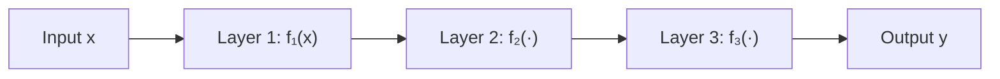

# 反函数与复合函数

> **所属路径**：`00_高中复习/01_数学基础/02_函数与图像/05_反函数与复合函数`
> **预计学习时间**：55 分钟
> **难度等级**：⭐⭐

---

## 前置知识

- [定义域与值域](../01_定义域与值域/01_定义域与值域.md) — 函数的概念、定义域与值域
- [单调性与奇偶性](../02_单调性与奇偶性/02_单调性与奇偶性.md) — 单调性是反函数存在的关键条件
- [图像平移与变换](../04_图像平移与变换/04_图像平移与变换.md) — 图像变换基础（反函数的图像是关于 $y = x$ 的翻转）

> 如果以上内容还不熟悉，建议先完成对应课程再继续。本节会用到函数的基本概念、单调性判断以及图像变换的思路。

---

## 学习目标

完成本节后，你将能够：

1. 解释什么是反函数，并用严格定义判断一个函数是否存在反函数
2. 掌握求反函数的步骤，能对简单函数求出其反函数表达式
3. 理解反函数与原函数的图像关于 $y = x$ 对称的几何关系
4. 解释复合函数的定义，能计算 $(f \circ g)(x) = f(g(x))$ 的表达式
5. 初步理解"神经网络就是多个函数的复合"这一核心思想

---

## 正文讲解

### 1. 从日常生活说起——"可逆操作"无处不在

在日常生活中，我们经常做"可以反过来"的操作。比如：

- **加密与解密**：你把一段文字加密发送给朋友，朋友用密钥解密还原——解密就是加密的"逆操作"。
- **编码与解码**：计算机把汉字编码成二进制存储，显示时再解码还原为汉字。
- **温度转换**：把摄氏度转换成华氏度的公式是 $F = \frac{9}{5}C + 32$ ，反过来从华氏度求摄氏度就是 $C = \frac{5}{9}(F - 32)$ 。

这些例子有一个共同特点：**原操作把 A 变成 B，逆操作把 B 变回 A**。在数学中，如果一个函数 $f$ 把 $x$ 变成 $y$ ，而另一个函数能把 $y$ 变回 $x$ ，这个"逆操作函数"就叫做 $f$ 的 **反函数（Inverse Function）** 。

但并非所有操作都能反过来。比如把一个数平方：

$$
f(x) = x^2
$$

当我们知道 $f(x) = 4$ 时， $x$ 是 $2$ 还是 $-2$ ？无法确定！这说明 $f(x) = x^2$ （在整个实数域上）没有反函数，因为两个不同的输入产生了相同的输出。这种情况叫做 **不是一一对应** 。

想一想：什么样的函数才能保证"每个输出只对应唯一一个输入"呢？答案就是我们之前学过的 **[单调性（Monotonicity）](../02_单调性与奇偶性/02_单调性与奇偶性.md)** ——严格单调的函数一定是一一对应的。

### 2. 反函数的严格定义

有了直觉之后，我们来给出正式定义。

设函数 $y = f(x)$ 的定义域为 $D$ ，值域为 $R$ 。如果对于值域 $R$ 中的每一个 $y$ ，在定义域 $D$ 中都存在**唯一**的 $x$ 使得 $f(x) = y$ ，那么我们就可以定义一个从 $R$ 到 $D$ 的新函数，把 $y$ 映射回 $x$ ，记为：

$$
x = f^{-1}(y)
$$

这个新函数 $f^{-1}$ 就是 $f$ 的反函数。

> **直觉解读**：反函数就是"撤销"原函数的操作。 $f$ 把 $x$ 变成 $y$ ， $f^{-1}$ 再把 $y$ 变回 $x$ 。

反函数最重要的性质可以用两个等式概括：

$$
f^{-1}(f(x)) = x \quad \text{（对所有 } x \in D \text{）}
$$

$$
f(f^{-1}(y)) = y \quad \text{（对所有 } y \in R \text{）}
$$

> ⚠️ **注意**： $f^{-1}$ 中的 $-1$ 不是幂次！ $f^{-1}(x)$ 不是 $\frac{1}{f(x)}$ ，而是 $f$ 的反函数。

#### 反函数存在的条件

**定理**：函数 $f(x)$ 在区间 $I$ 上存在反函数，当且仅当 $f(x)$ 在 $I$ 上是**严格单调**的（严格递增或严格递减）。

为什么？因为严格单调意味着：不同的 $x$ 值一定对应不同的 $y$ 值。换句话说，函数是**一一映射**的。这保证了"知道 $y$ 就能唯一确定 $x$ "。

| 函数 | 是否严格单调 | 是否有反函数 |
| ---- | ------------ | ------------ |
| $f(x) = 2x + 1$ | ✅ 严格递增 | ✅ 有 |
| $f(x) = -3x + 5$ | ✅ 严格递减 | ✅ 有 |
| $f(x) = x^2$ （ $x \in \mathbb{R}$ ） | ❌ 先减后增 | ❌ 没有 |
| $f(x) = x^2$ （ $x \geq 0$ ） | ✅ 严格递增 | ✅ 有 |
| $f(x) = 2^x$ | ✅ 严格递增 | ✅ 有 |

注意 $f(x) = x^2$ 的例子：如果我们把定义域限制在 $x \geq 0$ ，它就变成严格递增的了，此时反函数为 $f^{-1}(x) = \sqrt{x}$ 。

### 3. 如何求反函数？

求反函数有一个简洁的三步法：

**第一步**：把 $y = f(x)$ 中的 $x$ 解出来，表示为 $y$ 的函数，即 $x = g(y)$ 。

**第二步**：将 $x$ 和 $y$ 互换，得到 $y = g(x)$ 。

**第三步**：确定反函数的定义域（原函数的值域）和值域（原函数的定义域）。

> 💡 **为什么要交换 $x$ 和 $y$ ？** 这是一个"书写习惯"——我们通常用 $x$ 表示自变量、 $y$ 表示因变量。反函数本来是"以 $y$ 为输入，以 $x$ 为输出"，交换后就变成了标准的 $y = \ldots$ 形式，方便画图和使用。

来看一个具体的例子。

**例题**：求 $f(x) = 2x + 1$ 的反函数。

**第一步**：从 $y = 2x + 1$ 中解出 $x$ ：

$$
y = 2x + 1 \implies 2x = y - 1 \implies x = \frac{y - 1}{2}
$$

**第二步**：交换 $x$ 和 $y$ ：

$$
y = \frac{x - 1}{2}
$$

**第三步**：原函数的定义域是 $\mathbb{R}$ ，值域也是 $\mathbb{R}$ ，所以反函数的定义域和值域都是 $\mathbb{R}$ 。

$$
f^{-1}(x) = \frac{x - 1}{2}
$$

验证：

$$
f^{-1}(f(x)) = f^{-1}(2x + 1) = \frac{(2x + 1) - 1}{2} = \frac{2x}{2} = x \quad ✓
$$

### 4. 反函数的图像——关于 $y = x$ 对称

反函数还有一个非常优美的几何性质：**原函数和反函数的图像关于直线 $y = x$ 对称**。

为什么？因为原函数上有一个点 $(a, b)$ ，意味着 $f(a) = b$ 。而反函数上对应的点是 $(b, a)$ ，因为 $f^{-1}(b) = a$ 。点 $(a, b)$ 和 $(b, a)$ 关于 $y = x$ 正好是镜像对称的——交换横纵坐标，就是关于 $y = x$ 翻转。

下面这张图展示了两组函数与反函数的对称关系：


> 📌 **图解说明**：左图展示线性函数 $f(x) = 2x + 1$ （蓝色）与其反函数 $f^{-1}(x) = \frac{x-1}{2}$ （红色）关于 $y = x$ （虚线）对称。绿色虚线连接了对称点对。右图展示指数函数 $f(x) = 2^x$ 与对数函数 $f^{-1}(x) = \log_2 x$ 互为反函数的关系。你可以运行 `code/plot_inverse.py` 自行生成这张图。

从右图中可以看到：**[指数函数](../../03_指数与对数/04_指数函数/)** 和 **[对数函数](../../03_指数与对数/05_对数函数/)** 互为反函数——这是我们在下一个知识主题中会深入学习的重要关系。

### 5. 复合函数——"流水线"上的函数

理解了反函数之后，我们来看函数的另一种组合方式：**复合函数（Composite Function）** 。

想象一条工厂的流水线：

1. **第一站**：原材料经过"切割"处理，变成半成品。
2. **第二站**：半成品经过"组装"处理，变成成品。

整个流水线就是先切割、再组装——两个操作串联在一起。数学中的复合函数也是这样：**先把 $x$ 通过一个函数 $g$ 处理，再把结果通过另一个函数 $f$ 处理**。

#### 定义

设有两个函数 $f$ 和 $g$ ，如果 $g$ 的输出落在 $f$ 的定义域内，那么我们可以定义 **复合函数（Composite Function）** ：

$$
(f \circ g)(x) = f(g(x))
$$

读作"f 复合 g"。注意执行顺序：**先 $g$ 后 $f$** ——虽然 $f$ 写在前面，但实际上是 $g$ 先执行。

> **直觉解读**：复合函数就像俄罗斯套娃——里面一层函数的输出变成了外面一层函数的输入。

#### 例题

设 $f(x) = x^2$ ， $g(x) = x + 1$ ，求 $f(g(x))$ 和 $g(f(x))$ 。

**求 $f(g(x))$** ：先算 $g(x) = x + 1$ ，再把结果代入 $f$ ：

$$
f(g(x)) = f(x + 1) = (x + 1)^2
$$

**求 $g(f(x))$** ：先算 $f(x) = x^2$ ，再把结果代入 $g$ ：

$$
g(f(x)) = g(x^2) = x^2 + 1
$$

注意：

$$
(x + 1)^2 \neq x^2 + 1
$$

**复合函数的顺序很重要！** $f \circ g$ 和 $g \circ f$ 通常不相等——这就像"先洗衣服再烘干"和"先烘干再洗衣服"会得到完全不同的结果。

下面的图展示了 $f(g(x)) = (x+1)^2$ 的构造过程：


> 📌 **图解说明**：从左到右依次展示：(1) 内层函数 $g(x) = x + 1$ ，(2) 外层函数 $f(x) = x^2$ ，(3) 复合结果 $(f \circ g)(x) = (x+1)^2$ 。红点标注了 $x = 1$ 时的计算路径：先算 $g(1) = 2$ ，再算 $f(2) = 4$ 。你可以运行 `code/plot_composite.py` 自行生成这张图。

#### 复合函数的定义域

复合函数 $f(g(x))$ 的定义域需要同时满足两个条件：

1. $x$ 在 $g$ 的定义域内
2. $g(x)$ 在 $f$ 的定义域内

例如，设 $f(x) = \sqrt{x}$ （定义域 $x \geq 0$ ）， $g(x) = x - 3$ ，则：

$$
f(g(x)) = \sqrt{x - 3}
$$

要求 $g(x) = x - 3 \geq 0$ ，即 $x \geq 3$ 。所以复合函数 $f(g(x))$ 的定义域是 $[3, +\infty)$ 。

### 6. 复合函数与反函数的关系

复合函数和反函数之间有一个美妙的联系。如果 $f^{-1}$ 是 $f$ 的反函数，那么：

$$
f^{-1} \circ f = \text{id} \quad \text{以及} \quad f \circ f^{-1} = \text{id}
$$

其中 $\text{id}(x) = x$ 是**恒等函数（Identity Function）**——它什么也不做，输入什么就输出什么。

换句话说，反函数就是"在复合意义下的逆元"：一个函数和它的反函数复合，结果是什么都不做。这和乘法中 $a \times \frac{1}{a} = 1$ 的思想是一样的。

### 7. 神经网络——复合函数的"超级版"

为什么人工智能课程要学复合函数？因为 **[神经网络（Neural Network）](../../../../02_核心原理/03_深度学习/01_神经网络/)** 的核心就是大规模的函数复合。

一个简单的神经网络可以看作多个函数的"流水线"：



> 📌 **图解说明**：神经网络将输入 $x$ 依次通过多层函数处理，每一层接收上一层的输出作为输入。

用数学语言表达，一个 $n$ 层的神经网络就是：

$$
y = f_n(f_{n-1}(\cdots f_2(f_1(x)) \cdots))
$$

或者用复合函数的记号写成：

$$
y = (f_n \circ f_{n-1} \circ \cdots \circ f_1)(x)
$$

每一层 $f_i$ 通常包含一个线性变换（乘以权重、加上偏置）和一个非线性激活函数。我们在"动手实践"部分会用代码模拟这个过程。

而训练神经网络的核心——**[反向传播（Backpropagation）](../../../../02_核心原理/03_深度学习/02_反向传播/)** ——需要对复合函数求导数。复合函数的求导法则叫做 **[链式法则（Chain Rule）](../../12_导数初步/03_复合函数求导/)** ，这是我们在"导数初步"中会深入学习的内容。现在只需要知道：

> 💡 如果 $y = f(g(x))$ ，那么 $y$ 对 $x$ 的导数是 $f'(g(x)) \cdot g'(x)$ ——"外层的导数乘以内层的导数"。

这个简单的规则，支撑了整个深度学习的训练过程。

---

## 动手实践

下面的代码演示了反函数验证、温度转换和神经网络函数组合。

```python
# 文件：code/inverse_demo.py
# 环境要求：Python 3.10+

# ── 反函数验证 ──
def f(x):
    """原函数 f(x) = 2x + 1"""
    return 2 * x + 1

def f_inv(x):
    """反函数 f⁻¹(x) = (x - 1) / 2"""
    return (x - 1) / 2

# 验证 f⁻¹(f(x)) = x
for x in [-2, 0, 1, 3.5, 10]:
    print(f"x = {x}  →  f(x) = {f(x)}  →  f⁻¹(f(x)) = {f_inv(f(x))}")

# ── 温度转换：反函数的实际应用 ──
def celsius_to_fahrenheit(c):
    return 9 / 5 * c + 32

def fahrenheit_to_celsius(f_val):
    return 5 / 9 * (f_val - 32)

for c in [0, 20, 37, 100]:
    f_val = celsius_to_fahrenheit(c)
    c_back = fahrenheit_to_celsius(f_val)
    print(f"{c}°C → {f_val:.1f}°F → {c_back:.1f}°C  ✓")

# ── 复合函数：顺序很重要 ──
def g(x):
    return x + 1

def f_square(x):
    return x ** 2

for x in [-2, -1, 0, 1, 2]:
    fg = f_square(g(x))      # f(g(x)) = (x+1)²
    gf = g(f_square(x))      # g(f(x)) = x²+1
    print(f"x={x}: f(g(x))={fg}, g(f(x))={gf}, {'相等' if fg == gf else '不等'}")

# ── 模拟神经网络的多层函数组合 ──
def layer1(x):
    return 2 * x + 1

def relu(x):
    return max(0, x)

def layer2(x):
    return -0.5 * x + 3

for x in [-3, -1, 0, 1, 3, 5]:
    z1 = layer1(x)
    a1 = relu(z1)
    z2 = layer2(a1)
    print(f"x={x} → 第1层={z1:.1f} → ReLU={a1:.1f} → 第2层={z2:.1f}")
```

**运行说明**：
- 环境要求：Python 3.10+
- 运行命令：`python code/inverse_demo.py`

**预期输出**：
```
x = -2  →  f(x) = -3  →  f⁻¹(f(x)) = -2.0
x = 0  →  f(x) = 1  →  f⁻¹(f(x)) = 0.0
x = 1  →  f(x) = 3  →  f⁻¹(f(x)) = 1.0
x = 3.5  →  f(x) = 8.0  →  f⁻¹(f(x)) = 3.5
x = 10  →  f(x) = 21  →  f⁻¹(f(x)) = 10.0
0°C → 32.0°F → 0.0°C  ✓
20°C → 68.0°F → 20.0°C  ✓
37°C → 98.6°F → 37.0°C  ✓
100°C → 212.0°F → 100.0°C  ✓
x=-2: f(g(x))=1, g(f(x))=5, 不等
x=-1: f(g(x))=0, g(f(x))=2, 不等
x= 0: f(g(x))=1, g(f(x))=1, 相等
x= 1: f(g(x))=4, g(f(x))=2, 不等
x= 2: f(g(x))=9, g(f(x))=5, 不等
x=-3 → 第1层=-5.0 → ReLU=0.0 → 第2层=3.0
x=-1 → 第1层=-1.0 → ReLU=0.0 → 第2层=3.0
x= 0 → 第1层=1.0 → ReLU=1.0 → 第2层=2.5
x= 1 → 第1层=3.0 → ReLU=3.0 → 第2层=1.5
x= 3 → 第1层=7.0 → ReLU=7.0 → 第2层=-0.5
x= 5 → 第1层=11.0 → ReLU=11.0 → 第2层=-2.5
```

从神经网络部分的输出可以看到：当输入 $x = -3$ 或 $x = -1$ 时，第一层输出为负数，被 ReLU 激活函数"截断"为 0，后续的输出全部变为 3.0。这就是非线性激活函数在神经网络中的作用——它让复合函数的行为变得更加丰富，不再是简单的线性叠加。

---

## 典型误区

| 误区 | 正确理解 |
| ---- | -------- |
| 认为 $f^{-1}(x)$ 就是 $\frac{1}{f(x)}$ | $f^{-1}$ 是反函数符号，不是 $-1$ 次幂。 $f^{-1}(x)$ 表示"撤销 $f$ 的操作"，而 $\frac{1}{f(x)}$ 是 $f(x)$ 的倒数，两者含义完全不同 |
| 认为所有函数都有反函数 | 只有严格单调函数才有反函数。 $f(x) = x^2$ 在整个实数域上不是单调的，所以没有反函数；但限制到 $x \geq 0$ 时有反函数 $\sqrt{x}$ |
| 认为 $f(g(x)) = g(f(x))$ 总是成立 | 复合函数的顺序很重要！ $f \circ g \neq g \circ f$ 是常态，相等只是巧合。就像"先穿袜子再穿鞋"和"先穿鞋再穿袜子"完全不同 |
| 求反函数时忘记交换定义域和值域 | 反函数的定义域 = 原函数的值域，反函数的值域 = 原函数的定义域。求解后别忘了标注定义域 |

---

## 练习题

### 练习 1：求反函数（难度：⭐）

求函数 $f(x) = 3x - 5$ 的反函数 $f^{-1}(x)$ ，并验证 $f^{-1}(f(2))$ 是否等于 $2$ 。

<details>
<summary>💡 提示</summary>

按三步法：先从 $y = 3x - 5$ 中解出 $x$ ，再交换 $x$ 和 $y$ 。

</details>

<details>
<summary>✅ 参考答案</summary>

**第一步**：从 $y = 3x - 5$ 解出 $x$ ：

$$x = \dfrac{y + 5}{3}$$**第二步**：交换 $x$ 和 $y$ ：$$f^{-1}(x) = \dfrac{x + 5}{3}$$**验证**：$$f(2) = 3 \times 2 - 5 = 1$$$$f^{-1}(1) = \dfrac{1 + 5}{3} = 2 \quad ✓$$

</details>

### 练习 2：判断反函数存在性（难度：⭐）

以下函数哪些在给定定义域上存在反函数？说明理由。
- (a) $f(x) = |x|$ ， $x \in \mathbb{R}$
- (b) $f(x) = x^3$ ， $x \in \mathbb{R}$
- (c) $f(x) = 2^x$ ， $x \in \mathbb{R}$

<details>
<summary>💡 提示</summary>

判断每个函数在给定定义域上是否严格单调。

</details>

<details>
<summary>✅ 参考答案</summary>

- **(a) 没有反函数**。 $f(x) = |x|$ 不是严格单调的（ $f(-1) = f(1) = 1$ ，不同输入对应相同输出）。
- **(b) 有反函数**。 $f(x) = x^3$ 在 $\mathbb{R}$ 上严格递增。反函数为 $f^{-1}(x) = \sqrt[3]{x}$ 。
- **(c) 有反函数**。 $f(x) = 2^x$ 在 $\mathbb{R}$ 上严格递增。反函数为 $f^{-1}(x) = \log_2 x$ 。

</details>

### 练习 3：复合函数计算（难度：⭐⭐）

设 $f(x) = 2x + 3$ ， $g(x) = x^2 - 1$ 。

1. 求 $(f \circ g)(x)$
2. 求 $(g \circ f)(x)$
3. 验证 $f(g(2))$ 和 $g(f(2))$ 是否相等

<details>
<summary>💡 提示</summary>

$f \circ g$ 表示先算 $g$ 再算 $f$ ，即 $f(g(x))$ 。把 $g(x)$ 的表达式代入 $f$ 中 $x$ 的位置即可。

</details>

<details>
<summary>✅ 参考答案</summary>

1. $(f \circ g)(x) = f(g(x)) = f(x^2 - 1) = 2(x^2 - 1) + 3 = 2x^2 + 1$

2. $(g \circ f)(x) = g(f(x)) = g(2x + 3) = (2x + 3)^2 - 1 = 4x^2 + 12x + 8$

3. 验证：
   - $f(g(2)) = f(4 - 1) = f(3) = 9$
   - $g(f(2)) = g(7) = 49 - 1 = 48$
   - $9 \neq 48$ ，**不相等**。再次验证了复合函数的顺序很重要。

</details>

### 练习 4：复合函数的定义域（难度：⭐⭐）

设 $f(x) = \frac{1}{x}$ ， $g(x) = x - 2$ 。求复合函数 $f(g(x))$ 的表达式和定义域。

<details>
<summary>💡 提示</summary>

先写出 $f(g(x))$ 的表达式，然后找出使表达式有意义的 $x$ 值范围。需要保证 $g(x) \neq 0$ 。

</details>

<details>
<summary>✅ 参考答案</summary>

$$f(g(x)) = f(x - 2) = \dfrac{1}{x - 2}$$

定义域需要满足 $x - 2 \neq 0$ ，即 $x \neq 2$ 。

所以 $f(g(x)) = \dfrac{1}{x - 2}$ ，定义域为 $\{x \in \mathbb{R} \mid x \neq 2\}$ 。

</details>

### 练习 5：从神经网络的角度理解（难度：⭐⭐⭐）

一个两层神经网络可以表示为 $y = f_2(f_1(x))$ ，其中 $f_1(x) = \max(0, 2x - 1)$ （线性变换后接 ReLU 激活函数）， $f_2(x) = -x + 4$ 。

1. 计算 $x = 0, 1, 2, 3$ 时的输出 $y$
2. 如果 $f_1$ 存在反函数，求出其反函数（提示：需要分段讨论）

<details>
<summary>💡 提示</summary>

先逐步计算每个 $x$ 的值。对于反函数，注意 $\max(0, \cdot)$ 让 $f_1$ 的输出恒 $\geq 0$ ，需要在输出为 $0$ 和输出为正的两段分别讨论。

</details>

<details>
<summary>✅ 参考答案</summary>

**1. 逐步计算**：

| $x$ | $2x - 1$ | $f_1(x) = \max(0, 2x-1)$ | $y = f_2(f_1(x)) = -f_1(x) + 4$ |
| --- | --------- | -------------------------- | --------------------------------- |
| 0 | -1 | 0 | 4 |
| 1 | 1 | 1 | 3 |
| 2 | 3 | 3 | 1 |
| 3 | 5 | 5 | -1 |

**2. 反函数分析**：

$f_1$ 在整个实数域上**没有**严格反函数，因为当 $x \leq 0.5$ 时 $f_1(x) = 0$ ，不是一一映射。

但如果限制定义域为 $x > 0.5$ ，则 $f_1(x) = 2x - 1$ 严格递增，反函数为：

$$f_1^{-1}(x) = \dfrac{x + 1}{2} \quad (x > 0)$$

</details>

---

## 下一步学习

- 📖 下一个知识主题：[指数与对数](../../03_指数与对数/) — 指数函数与对数函数互为反函数，是反函数最重要的实际应用
- 🔗 相关知识点：[神经网络](../../../../02_核心原理/03_深度学习/01_神经网络/) — 神经网络的每一层就是一个复合函数
- 🔗 相关知识点：[导数初步](../../12_导数初步/) — 复合函数求导（链式法则）是微积分的核心

---

## 参考资料

> 以下资源均为公开可访问的免费内容。

1. [维基百科：反函数](https://zh.wikipedia.org/wiki/反函数) — 反函数的定义、性质和示例（公共知识库，CC BY-SA 许可）
2. [维基百科：复合函数](https://zh.wikipedia.org/wiki/复合函数) — 复合函数的定义和基本性质（公共知识库，CC BY-SA 许可）
3. [Khan Academy: Inverse Functions](https://www.khanacademy.org/math/algebra2/x2ec2f6f830c9fb89:transformations/x2ec2f6f830c9fb89:inverse/v/introduction-to-function-inverses) — 可汗学院反函数互动课程（免费公开课程）
4. [3Blue1Brown: Neural Networks](https://www.youtube.com/watch?v=aircAruvnKk) — 从函数复合的角度理解神经网络（公开视频，CC BY 许可）
