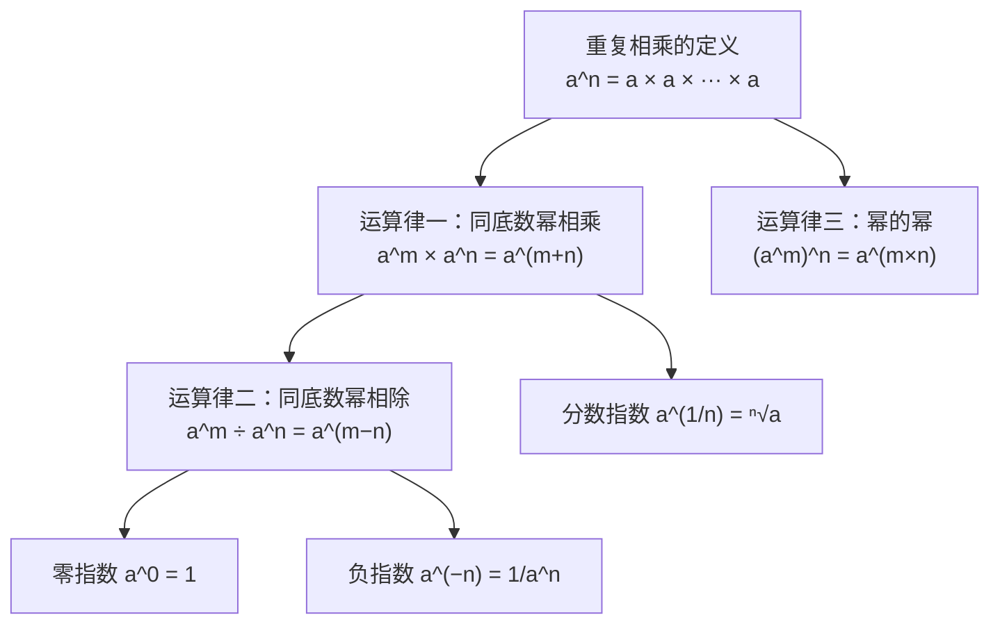

# 指数运算律

> **所属路径**：`00_高中复习/01_数学基础/03_指数与对数/01_指数运算律`
> **预计学习时间**：45 分钟
> **难度等级**：⭐

---

## 前置知识

- [幂运算与根式](../../01_代数与方程/04_幂运算与根式/04_幂运算与根式.md)
- [定义域与值域](../../02_函数与图像/01_定义域与值域/01_定义域与值域.md)

> 如果以上内容还不熟悉，建议先完成对应课程再继续。

---

## 学习目标

完成本节后，你将能够：

1. 准确陈述并运用指数的三条核心运算律（同底数幂相乘、同底数幂相除、幂的幂）
2. 解释零指数和负整数指数的定义，并用它们化简表达式
3. 将有理数指数（分数指数）与根式进行互化，完成相关计算
4. 使用 Python 验证指数运算律的正确性

---

## 正文讲解

### 1. 为什么要学指数运算律

想象一个经典的故事：你在棋盘的第一格放 1 粒米，第二格放 2 粒，第三格放 4 粒……每格都是前一格的 2 倍。到第 64 格时，你需要放 $2^{63}$ 粒米——这个数字大得惊人，超过了全世界几千年的稻米产量总和。这就是 **指数增长（Exponential Growth）** 的威力。

在人工智能领域，指数运算无处不在：

- **计算复杂度**：暴力搜索一个长度为 $n$ 的密码，尝试次数可达 $10^n$ ，这就是指数级增长让问题变得困难的原因。
- **学习率衰减**：训练神经网络时，学习率常按 $\alpha \times 0.9^t$ 的指数规律逐步减小。
- **概率计算**：多个独立事件同时发生的 **[概率](../../09_概率基础/03_独立事件/)** 是各事件概率的乘积，而乘积的化简离不开指数运算。

所以，扎实掌握指数运算律，是后续学习 **[指数函数](../04_指数函数/)** 、 **[对数运算律](../02_对数运算律/)** 乃至整个人工智能数学体系的第一步。

### 2. 从"重复相乘"说起——整数指数的直觉

回顾一下在 **[幂运算与根式](../../01_代数与方程/04_幂运算与根式/04_幂运算与根式.md)** 中学到的内容：当我们写下 $a^n$ 时，它表示 $n$ 个 $a$ 连续相乘：

$$
a^n = \underbrace{a \times a \times \cdots \times a}_{n \text{ 个 } a}
$$

例如， $2^5 = 2 \times 2 \times 2 \times 2 \times 2 = 32$ 。

这个"重复相乘"的直觉，就是接下来所有运算律的出发点。就好比加法中的"重复相加"催生了乘法一样，"重复相乘"催生了指数——它是我们对乘法的再一次抽象。

### 3. 三条核心运算律

现在让我们正式推导指数的三条核心运算律。每一条都可以从"重复相乘"这个直觉出发来理解。

#### 运算律一：同底数幂相乘（Product Rule）

当底数相同时，两个幂相乘，只需把指数相加：

$$
a^m \times a^n = a^{m+n}
$$

> **直觉解读**：左边是 $m$ 个 $a$ 乘在一起，再乘上 $n$ 个 $a$ ——加起来一共是 $m + n$ 个 $a$ 相乘，所以指数直接相加。

举个例子来验证：

$$
2^3 \times 2^4 = (2 \times 2 \times 2) \times (2 \times 2 \times 2 \times 2) = 2^7 = 128
$$

#### 运算律二：同底数幂相除（Quotient Rule）

两个同底数幂相除，指数相减：

$$
\frac{a^m}{a^n} = a^{m-n} \quad (a \neq 0)
$$

> **直觉解读**：分子有 $m$ 个 $a$ ，分母有 $n$ 个 $a$ ，约分掉 $n$ 个后，剩下 $m - n$ 个 $a$ 相乘。

例如：

$$
\frac{5^6}{5^2} = 5^{6-2} = 5^4 = 625
$$

#### 运算律三：幂的幂（Power Rule）

一个幂再取幂，指数相乘：

$$
(a^m)^n = a^{m \times n}
$$

> **直觉解读**：先把 $a^m$ 看成一个整体，把它重复乘 $n$ 次。每次乘的内部都有 $m$ 个 $a$ ，一共 $n$ 组，所以总共有 $m \times n$ 个 $a$ 。

例如：

$$
(3^2)^4 = 3^{2 \times 4} = 3^8 = 6561
$$

下面这张图展示了三条核心运算律之间的逻辑关系：



> 📌 **图解说明**：从"重复相乘"的基本定义出发，可以直接推出运算律一和运算律三；运算律二由运算律一自然推导而来；零指数和负指数是运算律二在 $m = n$ 和 $m < n$ 时的特殊情形；分数指数则是运算律一向有理数的扩展。

除了以上三条，还有两条常用的补充规则：

$$
(ab)^n = a^n \cdot b^n
$$

$$
\left(\frac{a}{b}\right)^n = \frac{a^n}{b^n} \quad (b \neq 0)
$$

> **直觉解读**：乘积的幂等于各因子分别取幂再相乘；商的幂等于分子分母分别取幂再相除。

### 4. 零指数与负整数指数

现在来思考一个有趣的问题：如果 $m = n$ ，运算律二会告诉我们什么？

$$
\frac{a^n}{a^n} = a^{n-n} = a^0
$$

但同时，任何非零数除以自身都等于 1：

$$
\frac{a^n}{a^n} = 1 \quad (a \neq 0)
$$

把这两个结果一对比，我们就得到了：

$$
a^0 = 1 \quad (a \neq 0)
$$

> **直觉解读**：零指数并不是"什么都没乘"，而是"乘了又全除完了"，结果自然是 1。注意 $0^0$ 在数学中有争议，我们这里只讨论 $a \neq 0$ 的情形。

类似地，如果 $m < n$ 呢？比如 $m = 0$ ：

$$
\frac{a^0}{a^n} = a^{0-n} = a^{-n}
$$

又因为 $a^0 = 1$ ，所以：

$$
a^{-n} = \frac{1}{a^n} \quad (a \neq 0)
$$

> **直觉解读**：负指数就是"取倒数"。比如 $2^{-3} = \dfrac{1}{2^3} = \dfrac{1}{8}$ 。

想一想：为什么我们要反复强调 $a \neq 0$ ？因为如果 $a = 0$ ，那么 $0^0$ 和 $0^{-n} = \dfrac{1}{0^n}$ 都会出现除以零的问题，这在数学中是没有意义的。

### 5. 有理数指数——分数指数幂

到目前为止，我们的指数都是整数。但指数可以是分数吗？答案是肯定的，而且这恰恰是连接指数与 **[幂运算与根式](../../01_代数与方程/04_幂运算与根式/04_幂运算与根式.md)** 的桥梁。

我们希望运算律一对分数指数也成立。考虑 $a^{1/n}$ ：

$$
\underbrace{a^{1/n} \times a^{1/n} \times \cdots \times a^{1/n}}_{n \text{ 个}} = a^{1/n + 1/n + \cdots + 1/n} = a^{n \cdot (1/n)} = a^1 = a
$$

也就是说， $a^{1/n}$ 自乘 $n$ 次等于 $a$ ——这正好就是 $a$ 的 $n$ 次方根的定义！因此：

$$
a^{1/n} = \sqrt[n]{a} \quad (a > 0)
$$

更一般地，分数指数幂定义为：

$$
a^{m/n} = \sqrt[n]{a^m} = \left(\sqrt[n]{a}\right)^m \quad (a > 0, \; m, n \in \mathbb{Z}, \; n > 0)
$$

例如：

$$
8^{2/3} = \left(\sqrt[3]{8}\right)^2 = 2^2 = 4
$$

到这里，三条核心运算律已经从正整数指数扩展到了全体有理数指数——它们的形式完全不变，这正是数学的优雅之处。

### 6. 易错点与边界情况

在使用指数运算律时，有几个容易"翻车"的地方值得特别注意：

- **底数不同不能用运算律一**：比如 $2^3 \times 3^2$ ，底数不同，不能写成 $6^5$ ——这是一个非常常见的错误。
- **指数与底数的加法混淆**： $a^m + a^n \neq a^{m+n}$ 。只有乘法才能用运算律一，加法没有对应的化简规则。
- **负底数的分数指数需谨慎**： $(-8)^{1/3} = -2$ 在实数范围内成立，但 $(-4)^{1/2}$ 在实数范围内无意义。一般要求底数 $a > 0$ 。

---

## 动手实践

前面我们用手算验证了几条运算律，接下来用 Python 来批量验证。编写一段简单的代码，让计算机帮我们确认这些规则确实成立。

```python
# 文件：code/verify_exponent_laws.py
# 用途：用 Python 验证指数运算律
# 环境要求：Python 3.10+（无需额外库）

# --- 运算律一：同底数幂相乘 ---
a, m, n = 2, 3, 4
left = a**m * a**n
right = a**(m + n)
print(f"运算律一：{a}^{m} × {a}^{n} = {left}, {a}^({m}+{n}) = {right}, 相等：{left == right}")

# --- 运算律二：同底数幂相除 ---
a, m, n = 5, 6, 2
left = a**m / a**n
right = a**(m - n)
print(f"运算律二：{a}^{m} ÷ {a}^{n} = {left}, {a}^({m}-{n}) = {right}, 相等：{left == right}")

# --- 运算律三：幂的幂 ---
a, m, n = 3, 2, 4
left = (a**m)**n
right = a**(m * n)
print(f"运算律三：({a}^{m})^{n} = {left}, {a}^({m}×{n}) = {right}, 相等：{left == right}")

# --- 零指数 ---
a = 7
print(f"零指数：{a}^0 = {a**0}")

# --- 负指数 ---
a, n = 2, 3
print(f"负指数：{a}^(-{n}) = {a**(-n)}, 1/{a}^{n} = {1/a**n}, 相等：{a**(-n) == 1/a**n}")

# --- 分数指数 ---
a = 8
frac_exp = a**(2/3)
root_then_pow = round(a**(1/3))**2  # 先开三次方再平方
print(f"分数指数：{a}^(2/3) = {frac_exp}, (³√{a})² = {root_then_pow}")

# --- 指数增长示例：棋盘上的米粒 ---
total_rice = sum(2**i for i in range(64))
print(f"\n棋盘米粒总数：{total_rice}")
print(f"即 2^64 - 1 = {2**64 - 1}")
```

**运行说明**：
- 环境要求：Python 3.10+，无需安装任何额外库
- 运行命令：`python code/verify_exponent_laws.py`

**预期输出**：
```
运算律一：2^3 × 2^4 = 128, 2^(3+4) = 128, 相等：True
运算律二：5^6 ÷ 5^2 = 625.0, 5^(6-2) = 625, 相等：True
运算律三：(3^2)^4 = 6561, 3^(2×4) = 6561, 相等：True
零指数：7^0 = 1
负指数：2^(-3) = 0.125, 1/2^3 = 0.125, 相等：True
分数指数：8^(2/3) = 4.0, (³√8)² = 4

棋盘米粒总数：18446744073709551615
即 2^64 - 1 = 18446744073709551615
```

从运行结果可以看到，Python 完美验证了我们手算的每一条运算律。最后一行的棋盘米粒总数是一个 20 位的天文数字——这就是指数增长的惊人威力，也是我们在学习 **[计算复杂度](../../../01_基础能力/03_编程与计算机基础/02_算法/01_复杂度分析/)** 时需要深刻理解的概念。

---

## 典型误区

| 误区 | 正确理解 |
| --- | --- |
| $a^m \times a^n = a^{m \times n}$ | 同底数幂**相乘**时指数**相加**： $a^m \times a^n = a^{m+n}$ |
| $a^m + a^n = a^{m+n}$ | 指数运算律只适用于乘除，加法无法直接化简指数 |
| $2^3 \times 3^2 = 6^5$ | 运算律一要求**底数相同**，底数不同时不能合并指数 |
| $a^0 = 0$ | 任何非零数的零次幂都等于 1，即 $a^0 = 1$ （ $a \neq 0$ ） |
| $(-8)^{1/2}$ 等于某个实数 | 负数的偶数次方根在实数范围内无意义，需要到复数域才有解 |

---

## 练习题

### 练习 1：基础运算（难度：⭐）

化简下列表达式：

(1) $2^5 \times 2^3$

(2) $\dfrac{3^7}{3^4}$

(3) $(5^3)^2$

<details>
<summary>💡 提示</summary>

依次套用运算律一（指数相加）、运算律二（指数相减）、运算律三（指数相乘）。

</details>

<details>
<summary>✅ 参考答案</summary>

(1) $2^5 \times 2^3 = 2^{5+3} = 2^8 = 256$

(2) $\dfrac{3^7}{3^4} = 3^{7-4} = 3^3 = 27$

(3) $(5^3)^2 = 5^{3 \times 2} = 5^6 = 15625$

</details>

### 练习 2：零指数与负指数（难度：⭐⭐）

计算下列各式的值：

(1) $(-3)^0 + 2^{-4}$

(2) $\dfrac{4^{-2}}{4^{-5}}$

<details>
<summary>💡 提示</summary>

先将零指数转为 1，将负指数转为倒数形式，再进行计算。第 (2) 题可以直接用运算律二。

</details>

<details>
<summary>✅ 参考答案</summary>

(1) $(-3)^0 = 1$ ， $2^{-4} = \dfrac{1}{2^4} = \dfrac{1}{16}$ ，所以原式 $= 1 + \dfrac{1}{16} = \dfrac{17}{16}$

(2) $\dfrac{4^{-2}}{4^{-5}} = 4^{-2-(-5)} = 4^3 = 64$

</details>

### 练习 3：分数指数幂（难度：⭐⭐）

化简并求值：

(1) $27^{2/3}$

(2) $16^{-3/4}$

<details>
<summary>💡 提示</summary>

先将底数分解为适当的幂次形式（如 $27 = 3^3$ ， $16 = 2^4$ ），再运用运算律三化简。

</details>

<details>
<summary>✅ 参考答案</summary>

(1) $27^{2/3} = (3^3)^{2/3} = 3^{3 \times 2/3} = 3^2 = 9$

(2) $16^{-3/4} = (2^4)^{-3/4} = 2^{4 \times (-3/4)} = 2^{-3} = \dfrac{1}{8}$

</details>

### 练习 4：综合应用（难度：⭐⭐⭐）

化简表达式（ $a > 0$ ）：

$$
\frac{a^{5/2} \times a^{-1/3}}{a^{7/6}}
$$

<details>
<summary>💡 提示</summary>

分子用运算律一合并指数，再用运算律二处理分子分母的除法。计算分数加减时，先通分。

</details>

<details>
<summary>✅ 参考答案</summary>

分子指数合并： $\dfrac{5}{2} + \left(-\dfrac{1}{3}\right) = \dfrac{15}{6} - \dfrac{2}{6} = \dfrac{13}{6}$

再除以分母： $a^{13/6} \div a^{7/6} = a^{13/6 - 7/6} = a^{6/6} = a^1 = a$

</details>

---

## 下一步学习

- 📖 下一个知识点：[对数运算律](../02_对数运算律/)
- 🔗 相关知识点：[指数对数互化](../03_指数对数互化/)、 [指数函数](../04_指数函数/)
- 📚 拓展阅读：[对数函数](../05_对数函数/) — 指数的逆运算，与指数运算律密切相关

---

## 参考资料

> 只引用确定开源或公开可访问的资源，注明其开放获取性质。

1. [Khan Academy — Exponent Rules](https://www.khanacademy.org/math/algebra/x2f8bb11595b61c86:rational-exponents-radicals) — 可汗学院指数与根式课程，公开免费教育资源
2. [OpenStax College Algebra — Exponents and Scientific Notation](https://openstax.org/books/college-algebra-2e/pages/1-2-exponents-and-scientific-notation) — 开源教材（CC BY 许可），包含详细的指数运算讲解
3. [Python 官方文档 — Numeric Types](https://docs.python.org/3/library/stdtypes.html#numeric-types-int-float-complex) — 官方文档，介绍 Python 中幂运算符 `**` 的使用
