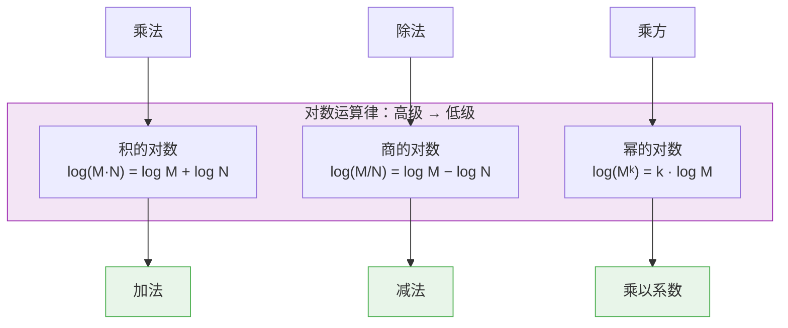

# 对数运算律

> **所属路径**：`00_高中复习/01_数学基础/03_指数与对数/02_对数运算律`
> **预计学习时间**：50 分钟
> **难度等级**：⭐⭐

---

## 前置知识

- [指数运算律](../01_指数运算律/01_指数运算律.md)

> 如果以上内容还不熟悉，建议先完成对应课程再继续。

---

## 学习目标

完成本节后，你将能够：

1. 解释对数的定义，并说明它与指数运算的互逆关系
2. 区分常用对数（lg）与自然对数（ln），理解自然对数在科学与 AI 中的特殊地位
3. 熟练运用对数的三条核心运算律（积的对数、商的对数、幂的对数）化简和计算表达式
4. 使用换底公式在不同底数之间自由转换
5. 用 Python 代码验证对数运算律的正确性

---

## 正文讲解

### 1. 一个"反过来"的问题

在 **[指数运算律](../01_指数运算律/01_指数运算律.md)** 中，我们学会了这样的计算：

> 已知底数 $a = 2$ 和指数 $n = 5$ ，求结果是多少？

答案很直接： $2^5 = 32$ 。

但在现实世界中，我们经常遇到"反过来"的问题：

> 我知道底数是 $2$ ，结果是 $32$ ，那指数应该是多少？

换句话说—— **$2$ 的多少次方等于 $32$ ？** 这就是对数要回答的核心问题。对数不是什么凭空冒出来的新概念，它只不过是把指数运算"倒过来问"而已。

想一想：你一定在生活中遇到过类似的"反向提问"。加法的反向操作是减法，乘法的反向操作是除法，那么"求幂"的反向操作自然就是——**对数（Logarithm）**。

### 2. 对数的正式定义

如果 $a^x = N$ （其中 $a > 0$ ， $a \neq 1$ ， $N > 0$ ），那么我们把 $x$ 叫作"以 $a$ 为底 $N$ 的对数"，记作：

$$
x = \log_a N
$$

> **直觉解读**：符号 $\log_a N$ 回答的就是这个问题——" $a$ 的几次方等于 $N$ ？"

下面这张图可以帮助你看清指数和对数之间的关系——它们就像一枚硬币的正反两面：


> 📌 **图解说明**：指数运算是"已知底数和指数，求结果"；对数运算则是"已知底数和结果，反推指数"。两者互为逆运算。

来看几个具体例子，巩固这个定义：

| 指数形式 | 对数形式 | 口语解读 |
| --- | --- | --- |
| $2^5 = 32$ | $\log_2 32 = 5$ | $2$ 的 $5$ 次方等于 $32$ |
| $10^3 = 1000$ | $\log_{10} 1000 = 3$ | $10$ 的 $3$ 次方等于 $1000$ |
| $3^4 = 81$ | $\log_3 81 = 4$ | $3$ 的 $4$ 次方等于 $81$ |
| $5^0 = 1$ | $\log_5 1 = 0$ | 任何正数的 $0$ 次方都等于 $1$ |

注意最后一行：不管底数是多少（只要满足 $a > 0$ 且 $a \neq 1$ ），都有 $\log_a 1 = 0$ 。这是因为 $a^0 = 1$ 恒成立。同理， $\log_a a = 1$ ，因为 $a^1 = a$ 。这两个特殊值你会经常用到。

> 💡 **想一想**： $\log_2 1$ 等于多少？ $\log_7 7$ 呢？ $\log_3(-9)$ 有意义吗？为什么对数的真数 $N$ 必须大于 $0$ ？

### 3. 常用对数与自然对数

在数学和科学中，有两种底数特别常用，它们有自己的专属简写：

**常用对数（Common Logarithm）**：以 $10$ 为底，记作 $\lg N$ ，即 $\lg N = \log_{10} N$ 。

为什么 $10$ 特殊？因为我们使用十进制计数系统。 $\lg 1000 = 3$ 的意思就是" $1000$ 有 $3+1 = 4$ 位数"——常用对数天然地度量了一个数的"数量级"。地震的里氏震级就是基于常用对数设计的：振幅每增大 $10$ 倍，震级加 $1$ 。所以 $7$ 级地震的振幅是 $5$ 级地震的 $10^{7-5} = 100$ 倍！

**自然对数（Natural Logarithm）**：以数学常数 $e \approx 2.71828$ 为底，记作 $\ln N$ ，即 $\ln N = \log_e N$ 。

为什么 $e$ 特殊？这个"自然底数"之所以叫"自然"，是因为它在描述连续增长时自然地出现。银行的连续复利、放射性衰变、细菌繁殖……这些过程的数学描述中都会出现 $e$ 。在人工智能领域，自然对数更是无处不在：

- **交叉熵损失（Cross-Entropy Loss）**：衡量模型预测与真实标签之间差距的核心公式中使用 $\ln$ 。
- **信息论（Information Theory）** 中的 **[熵](../../../../01_基础能力/02_数学基础/05_信息论/01_熵/)** ，其定义直接使用对数。
- **对数似然（Log-Likelihood）**：概率模型中将连乘变为连加的关键技巧。
- **Softmax 函数**：将原始分数转化为概率分布时，使用 $e$ 的指数形式。

所以，如果你未来在 AI 的论文或代码中看到 $\log$ 而没标底数，它几乎总是指自然对数 $\ln$ 。

### 4. 积的对数——乘法变加法

现在我们进入对数运算律的核心。第一条运算律告诉我们：

$$
\log_a (M \cdot N) = \log_a M + \log_a N
$$

其中 $a > 0$ ， $a \neq 1$ ， $M > 0$ ， $N > 0$ 。

> **直觉解读**：对数把乘法"降级"成了加法——这正是对数被发明的最初动机！在没有计算器的年代，天文学家和航海家用对数表把繁琐的乘法运算变成简单的加法。

**证明思路**：设 $\log_a M = p$ ， $\log_a N = q$ ，则由对数定义得 $a^p = M$ ， $a^q = N$ 。于是：

$$
M \cdot N = a^p \cdot a^q = a^{p+q}
$$

最后一步用到了 **[指数运算律](../01_指数运算律/01_指数运算律.md)** 中的"同底数幂相乘，指数相加"。再对等式两边取对数：

$$
\log_a(M \cdot N) = p + q = \log_a M + \log_a N
$$

证毕。你会发现，每一条对数运算律的证明都回到了指数运算律——这进一步说明了对数与指数的一体关系。

**例题**：计算 $\lg 2 + \lg 5$ 。

$$
\lg 2 + \lg 5 = \lg(2 \times 5) = \lg 10 = 1
$$

这个看似简单的技巧在实际计算中非常有用。

### 5. 商的对数——除法变减法

第二条运算律顺理成章——既然乘法变加法，除法自然变减法：

$$
\log_a \frac{M}{N} = \log_a M - \log_a N
$$

**证明**：仍设 $\log_a M = p$ ， $\log_a N = q$ ，则 $\frac{M}{N} = \frac{a^p}{a^q} = a^{p-q}$ ，所以 $\log_a \frac{M}{N} = p - q = \log_a M - \log_a N$ 。

**例题**：计算 $\log_2 48 - \log_2 3$ 。

$$
\log_2 48 - \log_2 3 = \log_2 \frac{48}{3} = \log_2 16 = 4
$$

∵ $2^4 = 16$ ，∴ $\log_2 16 = 4$ 。

**生活中的应用**：声音的分贝（dB）就是用对数差来定义的。如果一个声音的强度是另一个的 $100$ 倍，分贝差为 $10 \times \lg 100 = 10 \times 2 = 20$ 分贝。化学中的 pH 值同样如此：pH $ = -\lg[\text{H}^+]$ ，氢离子浓度每变化 $10$ 倍，pH 改变 $1$ 。

### 6. 幂的对数——指数"搬"下来

第三条运算律是最常用的一条：

$$
\log_a M^k = k \cdot \log_a M
$$

其中 $k$ 为任意实数。

> **直觉解读**：对数把指数从"头上"搬到了"前面"，变成了系数。这个操作在 AI 中至关重要——概率模型中经常出现连乘（如似然函数），取对数后指数变系数、连乘变连加，计算一下子变得可控。

**证明**：设 $\log_a M = p$ ，则 $M = a^p$ 。于是 $M^k = (a^p)^k = a^{pk}$ ，因此 $\log_a M^k = pk = k \cdot \log_a M$ 。

**例题**：化简 $\lg \sqrt{1000}$ 。

$$
\lg \sqrt{1000} = \lg 1000^{1/2} = \frac{1}{2} \cdot \lg 1000 = \frac{1}{2} \times 3 = 1.5
$$

### 7. 三条运算律的全景图

让我们用一张图把三条运算律放在一起，看看它们共同的"主旋律"——对数把高级运算降级为低级运算：



> 📌 **图解说明**：对数的核心功能就是"降级"——乘法降为加法，除法降为减法，乘方降为乘以系数。这就是为什么在处理极大或极小的数时，取对数能让计算变得友好。

### 8. 换底公式——在不同底数间自由切换

日常用到的对数底数各不相同，但计算器上通常只有 $\lg$ 和 $\ln$ 两个按钮。怎么计算 $\log_3 81$ ？这就需要换底公式：

$$
\log_a N = \frac{\log_b N}{\log_b a}
$$

其中 $b$ 是任意合法底数（ $b > 0$ 且 $b \neq 1$ ）。

**证明**：设 $\log_a N = x$ ，则 $a^x = N$ 。两边取 $\log_b$ ：

$$
\log_b(a^x) = \log_b N
$$

由幂的对数运算律得 $x \cdot \log_b a = \log_b N$ ，解出 $x$ ：

$$
x = \frac{\log_b N}{\log_b a}
$$

**例题**：用自然对数计算 $\log_3 81$ 。

$$
\log_3 81 = \frac{\ln 81}{\ln 3} = \frac{\ln 3^4}{\ln 3} = \frac{4 \ln 3}{\ln 3} = 4
$$

在 Python 中，函数 `math.log(N, a)` 内部就是通过换底公式 `math.log(N) / math.log(a)` 实现的。

### 9. 对数与人工智能的桥梁

你可能会问：花这么多时间学对数，跟人工智能到底有什么关系？答案是——对数是 AI 数学工具箱中使用频率最高的工具之一。这里给你一个预览：

**交叉熵损失**：在分类任务中，模型输出一个概率 $p$ ，真实标签为 $y \in \{0, 1\}$ ，损失函数为：

$$
L = -\big[y \cdot \ln p + (1 - y) \cdot \ln(1 - p)\big]
$$

当模型预测 $p = 0.9$ 而真实标签 $y = 1$ 时， $L = -\ln 0.9 \approx 0.105$ ——损失很小。但如果模型预测 $p = 0.1$ ，则 $L = -\ln 0.1 \approx 2.303$ ——损失急剧增大。正是 $\ln$ 函数在"放大错误预测的惩罚"。

**对数似然**：假设有 $n$ 个独立观测值，它们的联合概率是各自概率的乘积。直接计算连乘在数值上容易导致 **[浮点精度](../../../../01_基础能力/04_数值计算与科学计算/03_数值稳定性/01_浮点精度/)** 问题（极小数相乘趋向于零），但取对数后连乘变成连加，数值稳定性大幅提高。这就是"对数把乘法变加法"在实践中的直接应用。

这些内容会在后续的 **[概率基础](../../09_概率基础/)** 和更高阶的课程中详细展开。现在你只需要记住：对数运算律是理解这些 AI 核心概念的数学基础。

---

## 动手实践

下面我们用 Python 来验证刚才学到的所有对数运算律，同时感受对数在实际应用中的效果。

```python
# 文件：code/verify_log_laws.py
# 环境要求：Python 3.10+, math（标准库）

import math

# --- 对数的定义验证 ---
a, N = 2, 32
x = math.log(N, a)  # log₂(32)
print(f"log_{a}({N}) = {x}")
print(f"验证：{a}^{x} = {a**x}，与 {N} 相等：{math.isclose(a**x, N)}")

# --- 积的对数 ---
a, M, N = 10, 20, 50
left = math.log(M * N, a)
right = math.log(M, a) + math.log(N, a)
print(f"积的对数：log({M}×{N}) = {left:.6f}, log({M})+log({N}) = {right:.6f}, 相等：{math.isclose(left, right)}")

# --- 商的对数 ---
a, M, N = 2, 128, 8
left = math.log(M / N, a)
right = math.log(M, a) - math.log(N, a)
print(f"商的对数：log({M}/{N}) = {left:.6f}, log({M})-log({N}) = {right:.6f}, 相等：{math.isclose(left, right)}")

# --- 幂的对数 ---
a, M, k = 10, 5, 3
left = math.log(M**k, a)
right = k * math.log(M, a)
print(f"幂的对数：log({M}^{k}) = {left:.6f}, {k}×log({M}) = {right:.6f}, 相等：{math.isclose(left, right)}")

# --- 换底公式 ---
a, N = 3, 81
by_formula = math.log(N) / math.log(a)  # 用自然对数换底
by_direct = math.log(N, a)
print(f"换底公式：ln({N})/ln({a}) = {by_formula:.6f}, log_{a}({N}) = {by_direct:.6f}, 相等：{math.isclose(by_formula, by_direct)}")

# --- AI 应用预览：交叉熵损失 ---
print("\n--- 交叉熵损失中的对数 ---")
y_true = 1
for p in [0.1, 0.5, 0.9, 0.99]:
    loss = -(y_true * math.log(p) + (1 - y_true) * math.log(1 - p))
    print(f"  真实标签=1, 预测概率 p={p}  →  损失 L = {loss:.4f}")
```

**运行说明**：
- 环境要求：Python 3.10+（仅使用标准库 `math` ）
- 运行命令：`python code/verify_log_laws.py`

**预期输出**：
```
log_2(32) = 5.0
验证：2^5.0 = 32.0，与 32 相等：True
积的对数：log(20×50) = 3.000000, log(20)+log(50) = 3.000000, 相等：True
商的对数：log(128/8) = 4.000000, log(128)-log(8) = 4.000000, 相等：True
幂的对数：log(5^3) = 2.096910, 3×log(5) = 2.096910, 相等：True
换底公式：ln(81)/ln(3) = 4.000000, log_3(81) = 4.000000, 相等：True

--- 交叉熵损失中的对数 ---
  真实标签=1, 预测概率 p=0.1  →  损失 L = 2.3026
  真实标签=1, 预测概率 p=0.5  →  损失 L = 0.6931
  真实标签=1, 预测概率 p=0.9  →  损失 L = 0.1054
  真实标签=1, 预测概率 p=0.99  →  损失 L = 0.0101
```

从交叉熵的输出可以看到：当预测概率 $p$ 从 $0.1$ 提高到 $0.99$ 时，损失从 $2.30$ 骤降至 $0.01$ 。这就是自然对数在 AI 损失函数中发挥的"放大惩罚"效果。

---

## 典型误区

| 误区 | 正确理解 |
| --- | --- |
| $\log_a(M + N) = \log_a M + \log_a N$ | ❌ 积的对数才能拆成和。加法在对数内部无法拆分 |
| $\log_a(M \cdot N) = \log_a M \cdot \log_a N$ | ❌ 积的对数等于对数的**和**，不是对数的**积** |
| $\frac{\log_a M}{\log_a N} = \log_a \frac{M}{N}$ | ❌ 商的对数是 $\log_a M - \log_a N$ ；对数的商则是换底公式的形式 |
| 认为 $\log_a 0$ 有意义 | ❌ 真数 $N$ 必须大于 $0$ 。因为不存在任何实数 $x$ 使得 $a^x = 0$ |
| 认为 $\ln$ 和 $\log$ 不同 | 在纯数学教材中 $\log$ 通常表示 $\log_{10}$ ；但在 AI、概率论和编程中（如 Python 的 `math.log` ）， $\log$ 默认是自然对数 $\ln$ |

---

## 练习题

### 练习 1：基础计算（难度：⭐）

计算下列对数的值：

（1） $\log_2 64$

（2） $\lg 0.01$

（3） $\ln e^3$

<details>
<summary>💡 提示</summary>

回到对数的定义：问自己"底数的几次方等于真数？"

- $2$ 的几次方等于 $64$ ？
- $10$ 的几次方等于 $0.01$ ？
- $e$ 的几次方等于 $e^3$ ？

</details>

<details>
<summary>✅ 参考答案</summary>

（1）∵ $2^6 = 64$ ，∴ $\log_2 64 = 6$

（2）∵ $0.01 = 10^{-2}$ ，∴ $\lg 0.01 = -2$

（3）由幂的对数运算律， $\ln e^3 = 3 \cdot \ln e = 3 \times 1 = 3$

</details>

### 练习 2：运用运算律化简（难度：⭐⭐）

已知 $\lg 2 \approx 0.301$ ， $\lg 3 \approx 0.477$ ，求 $\lg 12$ 的近似值。

<details>
<summary>💡 提示</summary>

把 $12$ 分解质因数为 $12 = 4 \times 3 = 2^2 \times 3$ ，然后用积的对数和幂的对数运算律。

</details>

<details>
<summary>✅ 参考答案</summary>

$$\lg 12 = \lg(2^2 \times 3) = \lg 2^2 + \lg 3 = 2\lg 2 + \lg 3 \approx 2 \times 0.301 + 0.477 = 1.079$$

</details>

### 练习 3：换底公式应用（难度：⭐⭐）

用换底公式证明： $\log_a b \cdot \log_b a = 1$ 。

<details>
<summary>💡 提示</summary>

对 $\log_a b$ 和 $\log_b a$ 分别使用换底公式，选同一个底（如自然对数 $\ln$ ），然后相乘观察分子分母。

</details>

<details>
<summary>✅ 参考答案</summary>

由换底公式：

$$\log_a b = \dfrac{\ln b}{\ln a}, \quad \log_b a = \dfrac{\ln a}{\ln b}$$

两式相乘：

$$\log_a b \cdot \log_b a = \dfrac{\ln b}{\ln a} \cdot \dfrac{\ln a}{\ln b} = 1$$

</details>

### 练习 4：AI 场景应用（难度：⭐⭐⭐）

> ⚠️ **超纲提示**：本题涉及信息论中"信息量"的概念，属于大学信息论课程的内容。这里只使用对数函数的运算律进行计算，数学工具本身不超纲，但"信息量"的定义和含义是拓展内容。感觉困难可以先跳过。

在信息论中，一个事件发生的概率为 $p$ 时，其 **信息量** 定义为 $I = -\log_2 p$ （单位：比特）。

（1）抛一枚均匀硬币（正面朝上的概率 $p = 0.5$ ），得到"正面"的信息量是多少比特？

（2）一个概率为 $p = 0.125$ 的罕见事件，其信息量是多少比特？

（3）为什么"越罕见的事件，信息量越大"？从对数函数的单调性角度给出解释。

<details>
<summary>💡 提示</summary>

- 代入公式 $I = -\log_2 p$ 计算即可。
- 注意 $0.5 = 2^{-1}$ ， $0.125 = 2^{-3}$ 。
- 回忆对数函数在底数大于 $1$ 时是递增的。

</details>

<details>
<summary>✅ 参考答案</summary>

（1） $I = -\log_2 0.5 = -\log_2 2^{-1} = -(-1) = 1$ 比特

（2） $I = -\log_2 0.125 = -\log_2 2^{-3} = -(-3) = 3$ 比特

（3）因为 $\log_2$ 是递增函数，当 $p$ 减小时 $\log_2 p$ 变得更负，加上前面的负号后 $I = -\log_2 p$ 反而变大。直觉上，越罕见的事件一旦发生，带来的"惊喜度"越高，因此信息量越大。这正是信息论中 **[熵](../../../../01_基础能力/02_数学基础/05_信息论/01_熵/)** 的基石。

</details>

---

## 下一步学习

- 📖 下一个知识点：[指数对数互化](../03_指数对数互化/)
- 🔗 相关知识点：[对数函数](../05_对数函数/)
- 📚 拓展阅读：[信息论基础](../../../../01_基础能力/02_数学基础/05_信息论/)

---

## 参考资料


1. [Khan Academy — Logarithms](https://www.khanacademy.org/math/algebra2/x2ec2f6f830c9fb89:logs) — 可汗学院对数课程，含交互练习（公开课程）
2. [3Blue1Brown — Essence of Logarithms](https://www.youtube.com/watch?v=cEvgcoyZvB4) — 直觉式视觉讲解对数本质（公开视频，CC BY 许可）
3. [Python `math` 模块官方文档](https://docs.python.org/3/library/math.html) — `math.log` 、 `math.log10` 等函数说明（官方文档）
4. [Wikipedia — Logarithm](https://en.wikipedia.org/wiki/Logarithm) — 对数的历史、性质与应用全面综述（公共知识库，CC BY-SA 许可）
