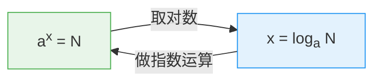

# 指数对数互化

> **所属路径**：`00_高中复习/01_数学基础/03_指数与对数/03_指数对数互化`
> **预计学习时间**：40 分钟
> **难度等级**：⭐⭐

---

## 前置知识

- [指数运算律](../01_指数运算律/01_指数运算律.md) — 指数的定义与三条核心运算律
- [对数运算律](../02_对数运算律/02_对数运算律.md) — 对数的定义与三条核心运算律

> 如果以上内容还不熟悉，建议先完成对应课程再继续。本节的核心是将这两套工具自如地"互相翻译"。

---

## 学习目标

完成本节后，你将能够：

1. 在指数形式 $a^x = N$ 和对数形式 $x = \log_a N$ 之间自如互化
2. 运用互化技巧求解含指数或对数的方程
3. 解释指数函数与对数函数互为反函数的直觉含义
4. 使用 Python 演示指数与对数的互逆验证

---

## 正文讲解

### 1. 为什么需要"互化"

在前两节中，我们分别学习了指数和对数。现在想象一个场景：一笔存款按年利率 $5\%$ 复利增长，本金 $P$ 经过 $t$ 年后变成 $A$ ，满足：

$$
A = P \times 1.05^t
$$

如果问题是"存 10 年后有多少钱"，这是一个**指数运算问题**——直接把 $t = 10$ 代入就好。但如果问题反过来："我想让存款翻倍，需要存多久？"那就是：

$$
2P = P \times 1.05^t
$$

化简得 $1.05^t = 2$ 。这时候你需要求的是指数 $t$ ，于是你必须把等式"翻译"成对数形式：

$$
t = \log_{1.05} 2
$$

这就是**指数对数互化（Conversion between Exponential and Logarithmic Forms）**的核心价值——同一个数量关系，从两个方向来表述和求解。

在人工智能中，这种互化技巧更是家常便饭。比如 **[交叉熵损失](../../../01_基础能力/02_数学基础/05_信息论/02_交叉熵与相对熵/)** 涉及对数计算，而 **[softmax 函数](../../../02_核心原理/03_深度学习/01_神经网络/02_激活函数/)** 涉及指数计算——理解两者之间的互化关系，是读懂这些公式的前提。

### 2. 互化的核心等式

指数和对数之间的桥梁，可以浓缩成一个等价关系：

$$
a^x = N \quad \Longleftrightarrow \quad x = \log_a N
$$

其中 $a > 0$ ， $a \neq 1$ ， $N > 0$ 。

> **直觉解读**：左边的等式在说"底数 $a$ 的 $x$ 次方等于 $N$ "，右边的等式在说"以 $a$ 为底 $N$ 的对数等于 $x$ "。它们说的是**同一件事情**，只是"主语"不同——左边以指数 $x$ 为未知数藏在上标里，右边把 $x$ 解放出来写在等号左边。

用一张图来帮助记忆这个对应关系：



> 📌 **图解说明**：指数形式和对数形式像是同一枚硬币的两面——"取对数"可以从指数形式转到对数形式，"做指数运算"则反过来。

让我们用具体数字来练练手，确保你对这个互化过程完全熟悉：

| 指数形式 | 对数形式 | 说明 |
| -------- | -------- | ---- |
| $2^3 = 8$ | $\log_2 8 = 3$ | 2 的 3 次方是 8 |
| $10^{-1} = 0.1$ | $\log_{10} 0.1 = -1$ | 10 的 $-1$ 次方是 0.1 |
| $e^0 = 1$ | $\ln 1 = 0$ | 任何正数的 0 次方都是 1 |
| $3^x = 81$ | $x = \log_3 81 = 4$ | 3 的 4 次方是 81 |
| $5^{1/2} = \sqrt{5}$ | $\log_5 \sqrt{5} = \dfrac{1}{2}$ | 分数指数与根式的联系 |

### 3. 两个关键的互逆性质

从核心等式出发，可以推导出两个极其常用的性质：

#### 性质一：对数还原指数

$$
\log_a (a^x) = x
$$

> **直觉解读**：先做 $a^x$ （指数运算），再取 $\log_a$ （对数运算），两步操作"抵消"了，回到原来的 $x$ 。就像你先向右走 3 步，再向左走 3 步，回到了原点。

#### 性质二：指数还原对数

$$
a^{\log_a N} = N
$$

> **直觉解读**：先取 $\log_a N$ （对数运算），再做 $a^{(\cdot)}$ （指数运算），两步操作同样"抵消"了，回到原来的 $N$ 。

这两个性质说的其实是同一件事：**指数运算和对数运算互为逆运算**。这和加法与减法、乘法与除法的关系完全一样。

在后续学习 **[反函数与复合函数](../../02_函数与图像/05_反函数与复合函数/05_反函数与复合函数.md)** 时，你会看到这种"互逆"关系有一个更精确的名字——**反函数（Inverse Function）**。指数函数 $f(x) = a^x$ 和对数函数 $g(x) = \log_a x$ 正是一对反函数。

### 4. 用互化技巧解方程

掌握了互化关系，我们就能自如地解一些看起来很复杂的方程。核心策略只有一句话：**哪种形式让未知数更容易求出来，就转化成哪种形式。**

#### 例 1：指数方程 → 取对数

求解 $3^x = 20$ 。

未知数 $x$ 藏在指数位置上，直接计算不方便。我们对等式两边取以 3 为底的对数：

$$
x = \log_3 20
$$

如果需要数值结果，可以用换底公式转换为自然对数：

$$
x = \frac{\ln 20}{\ln 3} \approx \frac{3.00}{1.10} \approx 2.727
$$

#### 例 2：对数方程 → 做指数运算

求解 $\log_2 x = 5$ 。

未知数 $x$ 藏在对数的真数位置。我们把等式转化为指数形式：

$$
x = 2^5 = 32
$$

#### 例 3：稍复杂的混合方程

求解 $2 \cdot 5^{x-1} = 50$ 。

第一步，两边除以 2：

$$
5^{x-1} = 25
$$

第二步，观察到 $25 = 5^2$ ，所以：

$$
5^{x-1} = 5^2
$$

第三步，因为底数相同（都是 5），指数必须相等：

$$
x - 1 = 2 \implies x = 3
$$

> 📌 **解题策略总结**：优先观察能否将两边化为同底数的幂形式——如果能，直接比较指数；如果不能，再使用对数互化。

### 5. 互化在实际场景中的应用

让我们回到开头的存款问题：年利率 $5\%$ ，本金翻倍需要多少年？

$$
1.05^t = 2
$$

两边取自然对数：

$$
t \cdot \ln 1.05 = \ln 2
$$

$$
t = \frac{\ln 2}{\ln 1.05} \approx \frac{0.693}{0.0488} \approx 14.2
$$

大约需要 14.2 年。这里有一个著名的近似规则——**72 法则**：用 72 除以年利率百分数，就能大致估算翻倍时间。 $72 / 5 = 14.4$ ，与精确计算非常接近！

在人工智能中，类似的计算随处可见。例如：一个模型的训练误差每个 epoch 下降 $10\%$ ，那么误差降至原来的 $1\%$ 需要多少个 epoch？设 epoch 数为 $n$ ：

$$
0.9^n = 0.01 \implies n = \frac{\ln 0.01}{\ln 0.9} \approx \frac{-4.605}{-0.105} \approx 43.8
$$

大约需要 44 个 epoch。

---

## 动手实践

让我们用 Python 来验证指数和对数的互逆关系，并求解前面遇到的方程。

```python
# 文件：code/exp_log_conversion.py
# 指数与对数互化验证
# 环境要求：Python 3.10+（仅使用标准库 math）

import math

def demo_inverse_properties():
    """验证指数与对数的互逆性质"""
    print("=" * 50)
    print("性质验证：指数与对数互为逆运算")
    print("=" * 50)

    # 性质一：log_a(a^x) = x
    a, x = 2, 5
    result = math.log(a**x, a)
    print(f"\nlog_{a}({a}^{x}) = log_{a}({a**x}) = {result}")
    print(f"  期望值：{x}  ✓" if abs(result - x) < 1e-10 else f"  期望值：{x}  ✗")

    # 性质二：a^(log_a(N)) = N
    a, N = 3, 81
    result = a ** math.log(N, a)
    print(f"\n{a}^(log_{a}({N})) = {result}")
    print(f"  期望值：{N}  ✓" if abs(result - N) < 1e-10 else f"  期望值：{N}  ✗")


def solve_equations():
    """用互化技巧解方程"""
    print("\n" + "=" * 50)
    print("方程求解演示")
    print("=" * 50)

    # 例1：3^x = 20
    x = math.log(20, 3)
    print(f"\n3^x = 20")
    print(f"  x = log_3(20) = ln(20)/ln(3) = {math.log(20):.4f}/{math.log(3):.4f} = {x:.4f}")
    print(f"  验证：3^{x:.4f} = {3**x:.4f}")

    # 例2：log_2(x) = 5
    x = 2**5
    print(f"\nlog_2(x) = 5")
    print(f"  x = 2^5 = {x}")
    print(f"  验证：log_2({x}) = {math.log2(x):.1f}")

    # 存款翻倍时间
    t = math.log(2) / math.log(1.05)
    print(f"\n存款翻倍时间（年利率 5%）：")
    print(f"  t = ln(2)/ln(1.05) = {t:.2f} 年")
    print(f"  72法则估算：72/5 = {72/5} 年")

    # 训练误差下降
    n = math.log(0.01) / math.log(0.9)
    print(f"\n训练误差降至 1%（每 epoch 下降 10%）：")
    print(f"  n = ln(0.01)/ln(0.9) = {n:.1f} epochs")


if __name__ == "__main__":
    demo_inverse_properties()
    solve_equations()
```

**运行说明**：
- 环境要求：Python 3.10+（仅使用标准库 `math`）
- 运行命令：`python code/exp_log_conversion.py`

**预期输出**：
```
==================================================
性质验证：指数与对数互为逆运算
==================================================

log_2(2^5) = log_2(32) = 5.0
  期望值：5  ✓

3^(log_3(81)) = 81.0
  期望值：81  ✓

==================================================
方程求解演示
==================================================

3^x = 20
  x = log_3(20) = ln(20)/ln(3) = 2.9957/1.0986 = 2.7268
  验证：3^2.7268 = 20.0000

log_2(x) = 5
  x = 2^5 = 32
  验证：log_2(32) = 5.0

存款翻倍时间（年利率 5%）：
  t = ln(2)/ln(1.05) = 14.21 年
  72法则估算：72/5 = 14.4 年

训练误差降至 1%（每 epoch 下降 10%）：
  n = ln(0.01)/ln(0.9) = 43.7 epochs
```

---

## 典型误区

| 误区 | 正确理解 |
| ---- | -------- |
| 把 $\log_a N$ 当成 $a \times N$ 的某种运算 | $\log_a N$ 是一个**整体符号**，表示"以 $a$ 为底 $N$ 的对数"，不能拆开理解 |
| 认为 $\log_a (M + N) = \log_a M + \log_a N$ | 对数的加法法则是 $\log_a(M \times N) = \log_a M + \log_a N$ ，加法在真数位置对应**乘法**，不能直接对加法使用 |
| 互化时忘记条件 $a > 0, a \neq 1, N > 0$ | 底数必须为正且不等于 1，真数必须为正——这些条件在互化时同样适用 |
| 指数方程两边取对数时只取一边 | 取对数（或做指数运算）必须对等式**两边同时进行**，保持等式成立 |

---

## 练习题

### 练习 1：基础互化（难度：⭐）

将以下指数形式改写为对数形式，或将对数形式改写为指数形式：

1. $4^3 = 64$
2. $\log_5 125 = 3$
3. $e^{-1} = \dfrac{1}{e}$
4. $\log_{0.5} 4 = -2$

<details>
<summary>💡 提示</summary>

套用核心等式 $a^x = N \Leftrightarrow x = \log_a N$ ，对应找出底数 $a$ 、指数 $x$ 、结果 $N$ 即可。

</details>

<details>
<summary>✅ 参考答案</summary>

1. $\log_4 64 = 3$
2. $5^3 = 125$
3. $\ln \dfrac{1}{e} = -1$
4. $0.5^{-2} = 4$ （验证： $(0.5)^{-2} = (2^{-1})^{-2} = 2^2 = 4$ ✓）

</details>

### 练习 2：解指数方程（难度：⭐⭐）

求解方程 $5^{2x+1} = 625$ 。

<details>
<summary>💡 提示</summary>

先观察 $625$ 是不是 $5$ 的某次幂。如果能写成 $5^k$ 的形式，就可以直接比较指数。

</details>

<details>
<summary>✅ 参考答案</summary>

∵ $625 = 5^4$

∴ $5^{2x+1} = 5^4$

∴ $2x + 1 = 4$ ，解得 $x = \dfrac{3}{2}$

验证： $5^{2 \times 1.5 + 1} = 5^4 = 625$ ✓

</details>

### 练习 3：解对数方程（难度：⭐⭐）

求解方程 $\log_3 (2x - 1) = 4$ 。

<details>
<summary>💡 提示</summary>

将对数形式转化为指数形式，然后解关于 $x$ 的一次方程。别忘了检查 $2x - 1 > 0$ 这个条件。

</details>

<details>
<summary>✅ 参考答案</summary>

将对数形式转化为指数形式：

$$2x - 1 = 3^4 = 81$$

$$2x = 82 \implies x = 41$$

检验：当 $x = 41$ 时， $2x - 1 = 81 > 0$ ✓，且 $\log_3 81 = 4$ ✓

</details>

### 练习 4：实际应用（难度：⭐⭐⭐）

一个细菌种群每 3 小时数量翻倍。初始有 100 个细菌，问经过多少小时后细菌数量达到 100 万？

<details>
<summary>💡 提示</summary>

设经过 $t$ 小时，每 3 小时翻倍意味着翻倍次数为 $\dfrac{t}{3}$ 。列出指数方程后取对数求解。

</details>

<details>
<summary>✅ 参考答案</summary>

设经过 $t$ 小时，细菌数量为 $100 \times 2^{t/3}$ 。

令 $100 \times 2^{t/3} = 1\,000\,000$

$$2^{t/3} = 10\,000$$

两边取以 2 为底的对数：

$$\dfrac{t}{3} = \log_2 10000 = \dfrac{\ln 10000}{\ln 2} \approx \dfrac{9.21}{0.693} \approx 13.29$$

$$t \approx 13.29 \times 3 \approx 39.86$$

大约需要 **40 小时**。

</details>

---

## 下一步学习

- 📖 下一个知识点：[指数函数](../04_指数函数/) — 将指数运算推广为函数，研究其图像和性质
- 🔗 相关知识点：[对数函数](../05_对数函数/) — 指数函数的反函数，与本节的互化关系密切相关
- 📚 拓展阅读：[反函数与复合函数](../../02_函数与图像/05_反函数与复合函数/) — 从更一般的角度理解"互逆"关系

---

## 参考资料


1. [维基百科：对数](https://zh.wikipedia.org/wiki/对数) — 对数的定义、性质和历史背景（公共知识库，CC BY-SA 许可）
2. [Khan Academy: Relationship between exponentials & logarithms](https://www.khanacademy.org/math/algebra2/x2ec2f6f830c9fb89:logs/x2ec2f6f830c9fb89:log-intro/v/logarithms) — 可汗学院的指数与对数互化讲解（免费公开课程）
3. [Python 官方文档：math.log](https://docs.python.org/zh-cn/3/library/math.html#math.log) — 本节代码中使用的对数函数的官方说明（官方文档）
