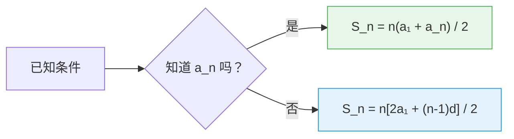

# 等差数列

> **所属路径**：`00_高中复习/01_数学基础/04_数列/01_等差数列`
> **预计学习时间**：50 分钟
> **难度等级**：⭐

---

## 前置知识

- [一元二次方程](../../01_代数与方程/01_一元二次方程/01_一元二次方程.md) — 求根公式和韦达定理
- [方程组与代数变形](../../01_代数与方程/03_方程组与代数变形/03_方程组与代数变形.md) — 联立方程组求解

> 如果以上内容还不熟悉，建议先完成对应课程再继续。

---

## 学习目标

完成本节后，你将能够：

1. 识别一个数列是否为等差数列，并求出公差
2. 使用通项公式计算等差数列的任意一项
3. 使用求和公式计算等差数列前 $n$ 项的和
4. 理解等差数列与线性函数的关系，并用 Python 进行验证

---

## 正文讲解

### 1. 从生活中的"等步长"说起

想象你在爬楼梯，每一步都恰好跨 2 级台阶。从第 1 级开始，你依次经过的台阶编号是：

$$
1, \; 3, \; 5, \; 7, \; 9, \; 11, \; \ldots
$$

每相邻两个数之间的差都是 2——这就是一个 **等差数列（Arithmetic Sequence）** 的典型例子。"等差"的意思就是"差相等"，每一项减去前一项都得到同一个数。

在人工智能中，等差数列同样随处可见：

- **学习率线性衰减**：每个 epoch 将学习率减少固定值 $\Delta\alpha$ ，形成等差数列 $\alpha_0, \; \alpha_0 - \Delta\alpha, \; \alpha_0 - 2\Delta\alpha, \; \ldots$
- **均匀采样**：在区间 $[a, b]$ 上等间距取 $n$ 个点，各点的坐标构成等差数列
- **特征缩放**：线性归一化中，等距的输入值映射后仍然等距

### 2. 等差数列的定义

如果一个数列 $\{a_n\}$ 从第 2 项起，每一项与前一项的差都等于同一个常数 $d$ ，即：

$$
a_{n+1} - a_n = d \quad (n = 1, 2, 3, \ldots)
$$

那么 $\{a_n\}$ 就叫做 **等差数列**，常数 $d$ 叫做 **公差（Common Difference）**。

> **直觉解读**：等差数列就像一条笔直的阶梯——每一步的高度增量完全相同。公差 $d$ 就是这个"步高"：
> - $d > 0$ 时，数列递增（一步步往上走）
> - $d = 0$ 时，数列恒定（原地踏步）
> - $d < 0$ 时，数列递减（一步步往下走）

### 3. 通项公式：知道起点和步长，就能算出任意一项

既然每一步增加 $d$ ，那么从第 1 项 $a_1$ 出发，走 $(n-1)$ 步就到了第 $n$ 项。所以：

$$
a_n = a_1 + (n - 1)d
$$

这就是等差数列的 **通项公式（General Term Formula）**。

> **直觉解读**：把 $a_n$ 想象成一个 **[一次函数](../../02_函数与图像/01_定义域与值域/01_定义域与值域.md)** $f(n) = dn + (a_1 - d)$ ——它关于 $n$ 是线性的！等差数列的每一项其实就是一条直线上的点。这个观察非常重要：**等差数列 ↔ 线性关系**，这是理解很多 AI 模型中线性组件的基础直觉。

下面的动画让你直观感受这种"线性步进"——左图中各项像阶梯一样等间距地排列在一条直线上，右图则展示前 $n$ 项和 $S_n$ 的二次增长：


> 📌 **图解说明**：左图中红色点是等差数列 $a_n = 3 + (n-1) \times 2$ 的各项，灰色虚线 $y = 2n + 1$ 是其对应的线性函数——每一项恰好落在直线上。右图中绿色点是前 $n$ 项和 $S_n$ ，灰色虚线是对应的二次函数——等差数列求和产生二次增长。你可以运行 `code/animate_arithmetic.py` 自行生成这个动画。

让我们用一个具体例子来练练手。已知等差数列的首项 $a_1 = 3$ ，公差 $d = 5$ ：

| $n$ | 1 | 2 | 3 | 4 | 5 | 10 | 100 |
| --- | - | - | - | - | - | -- | --- |
| $a_n = 3 + (n-1) \times 5$ | 3 | 8 | 13 | 18 | 23 | 48 | 498 |

通项公式的威力在于：不管你想知道第几项，都不需要从头一个一个算——直接代入公式即可。

### 4. 等差中项

如果 $a$ 、 $b$ 、 $c$ 三个数构成等差数列，那么中间的 $b$ 叫做 $a$ 和 $c$ 的 **等差中项（Arithmetic Mean）**。根据等差的定义：

$$
b - a = c - b \implies b = \frac{a + c}{2}
$$

> **直觉解读**：等差中项就是两端数值的**算术平均值**。这和在 **[统计基础](../../10_统计基础/)** 中学到的"平均数"是同一个概念——它恰好落在两个端点的正中间。

### 5. 求和公式：前 $n$ 项加起来是多少

等差数列求和有一个漂亮的公式。传说高斯小时候用这个方法在几秒钟内算出了 $1 + 2 + 3 + \cdots + 100$ 的结果。核心思想是"首尾配对"：

$$
S_n = 1 + 2 + 3 + \cdots + 100
$$

$$
S_n = 100 + 99 + 98 + \cdots + 1
$$

把这两行对应位置相加，每一对都是 $101$ ，共 $100$ 对：

$$
2S_n = 100 \times 101 \implies S_n = \frac{100 \times 101}{2} = 5050
$$

推广到一般的等差数列 $\{a_n\}$ ，前 $n$ 项和的公式为：

$$
S_n = \frac{n(a_1 + a_n)}{2} = \frac{n[2a_1 + (n-1)d]}{2}
$$

> **直觉解读**：第一种形式 $\dfrac{n(a_1 + a_n)}{2}$ 的意思是"首尾平均值 × 项数"——把首项和末项求平均，就是数列的"平均水平"，再乘以项数就是总和。第二种形式把 $a_n$ 用通项公式替换掉了，在只知道 $a_1$ 和 $d$ 时更方便使用。



> 📌 **图解说明**：根据已知条件选择合适的求和公式。如果末项 $a_n$ 已知，用第一种形式更简洁；如果只知道首项和公差，用第二种形式。

### 6. 等差数列的性质

等差数列有几个常用的性质，在解题时非常方便：

**性质一**：如果 $m + n = p + q$ ，则 $a_m + a_n = a_p + a_q$ 。

特别地，在奇数项数列中，中间那一项等于所有项的平均值。

**性质二**：前 $n$ 项和 $S_n$ 是关于 $n$ 的**二次函数**（当 $d \neq 0$ 时）：

$$
S_n = \frac{d}{2} n^2 + \left(a_1 - \frac{d}{2}\right) n
$$

这意味着 $S_n$ 的图像是一条抛物线——与 **[一元二次方程](../../01_代数与方程/01_一元二次方程/01_一元二次方程.md)** 中学到的知识遥相呼应。

**性质三**：等差数列的任意等间隔子列仍是等差数列。例如 $a_1, a_3, a_5, \ldots$ 是公差为 $2d$ 的等差数列。

---

## 动手实践

让我们用 Python 实现等差数列的通项计算和求和，并验证高斯的 $1 + 2 + \cdots + 100 = 5050$ 。

```python
# 文件：code/arithmetic_sequence.py
# 等差数列的通项公式与求和
# 环境要求：Python 3.10+（仅使用标准库）

def arithmetic_term(a1: float, d: float, n: int) -> float:
    """等差数列通项公式：a_n = a_1 + (n-1)d"""
    return a1 + (n - 1) * d


def arithmetic_sum(a1: float, d: float, n: int) -> float:
    """等差数列求和公式：S_n = n(2a_1 + (n-1)d) / 2"""
    return n * (2 * a1 + (n - 1) * d) / 2


if __name__ == "__main__":
    # 示例 1：高斯求和 1 + 2 + ... + 100
    print("=" * 50)
    print("示例 1：高斯求和 1 + 2 + ... + 100")
    s = arithmetic_sum(a1=1, d=1, n=100)
    print(f"  公式计算：S_100 = {s}")
    print(f"  逐项累加：S_100 = {sum(range(1, 101))}")
    print(f"  两者一致：{'✓' if s == sum(range(1, 101)) else '✗'}")

    # 示例 2：等差数列 3, 8, 13, 18, ...
    print("\n" + "=" * 50)
    print("示例 2：a_1 = 3, d = 5 的等差数列")
    print("  前 10 项：", [arithmetic_term(3, 5, n) for n in range(1, 11)])
    print(f"  第 100 项：a_100 = {arithmetic_term(3, 5, 100)}")
    print(f"  前 100 项和：S_100 = {arithmetic_sum(3, 5, 100)}")

    # 示例 3：线性关系验证
    print("\n" + "=" * 50)
    print("示例 3：等差数列与线性函数的关系")
    a1, d = 2, 3
    print(f"  a_1 = {a1}, d = {d}")
    print(f"  通项公式：a_n = {d}n + {a1 - d}")
    print(f"  这是一个关于 n 的一次函数（斜率={d}，截距={a1 - d}）")
    for n in [1, 5, 10, 20]:
        an = arithmetic_term(a1, d, n)
        linear = d * n + (a1 - d)
        print(f"  n={n}: a_n = {an}, 线性函数值 = {linear}, 一致：{'✓' if an == linear else '✗'}")
```

**运行说明**：
- 环境要求：Python 3.10+（仅使用标准库）
- 运行命令：`python code/arithmetic_sequence.py`

**预期输出**：
```
==================================================
示例 1：高斯求和 1 + 2 + ... + 100
  公式计算：S_100 = 5050.0
  逐项累加：S_100 = 5050
  两者一致：✓

==================================================
示例 2：a_1 = 3, d = 5 的等差数列
  前 10 项： [3, 8, 13, 18, 23, 28, 33, 38, 43, 48]
  第 100 项：a_100 = 498
  前 100 项和：S_100 = 25050.0

==================================================
示例 3：等差数列与线性函数的关系
  a_1 = 2, d = 3
  通项公式：a_n = 3n + -1
  这是一个关于 n 的一次函数（斜率=3，截距=-1）
  n=1: a_n = 2, 线性函数值 = 2, 一致：✓
  n=5: a_n = 14, 线性函数值 = 14, 一致：✓
  n=10: a_n = 29, 线性函数值 = 29, 一致：✓
  n=20: a_n = 59, 线性函数值 = 59, 一致：✓
```

---

## 典型误区

| 误区 | 正确理解 |
| ---- | -------- |
| 把通项公式中的 $(n-1)$ 写成 $n$ | 通项公式是 $a_n = a_1 + (n-1)d$ ，从第 1 项走到第 $n$ 项需要 $(n-1)$ 步，不是 $n$ 步 |
| 认为公差 $d$ 一定为正数 | 公差可以是正数（递增）、零（恒定）或负数（递减），只要求"差恒定"即可 |
| 混淆"第 $n$ 项"和"前 $n$ 项和" | $a_n$ 是单独一项的值， $S_n$ 是前 $n$ 项的累加总和。当 $n > 1$ 时有 $a_n = S_n - S_{n-1}$ |
| 求和公式代入时忘记 $n$ 是正整数 | 求和公式虽然在形式上是关于 $n$ 的二次表达式，但 $n$ 只能取正整数值（项数不可能是 1.5） |

---

## 练习题

### 练习 1：求通项和公差（难度：⭐）

已知等差数列的前三项为 $7, 11, 15, \ldots$

1. 求公差 $d$
2. 写出通项公式
3. 求第 20 项 $a_{20}$

<details>
<summary>💡 提示</summary>

公差 $d = a_2 - a_1$ 。通项公式 $a_n = a_1 + (n-1)d$ 。

</details>

<details>
<summary>✅ 参考答案</summary>

1. $d = 11 - 7 = 4$

2. $a_n = 7 + (n-1) \times 4 = 4n + 3$

3. $a_{20} = 4 \times 20 + 3 = 83$

</details>

### 练习 2：求和（难度：⭐）

求等差数列 $2, 5, 8, 11, \ldots$ 的前 50 项之和。

<details>
<summary>💡 提示</summary>

先求 $a_1$ 和 $d$ ，然后使用求和公式 $S_n = \dfrac{n[2a_1 + (n-1)d]}{2}$ 。

</details>

<details>
<summary>✅ 参考答案</summary>

$a_1 = 2$ ， $d = 3$ ， $n = 50$

$$S_{50} = \dfrac{50 \times [2 \times 2 + (50-1) \times 3]}{2} = \dfrac{50 \times (4 + 147)}{2} = \dfrac{50 \times 151}{2} = 3775$$

</details>

### 练习 3：逆向问题（难度：⭐⭐）

已知等差数列 $\{a_n\}$ 中 $a_5 = 20$ ， $a_{15} = 50$ 。

1. 求首项 $a_1$ 和公差 $d$
2. 求前 20 项和 $S_{20}$

<details>
<summary>💡 提示</summary>

利用通项公式列两个方程： $a_1 + 4d = 20$ 和 $a_1 + 14d = 50$ ，联立求解。

</details>

<details>
<summary>✅ 参考答案</summary>

由通项公式：

$$a_5 = a_1 + 4d = 20 \quad \cdots (1)$$$$a_{15} = a_1 + 14d = 50 \quad \cdots (2)$$ $(2) - (1)$ ： $10d = 30$ ，得 $d = 3$ 代入 $(1)$ ： $a_1 = 20 - 12 = 8$$$S_{20} = \dfrac{20 \times [2 \times 8 + 19 \times 3]}{2} = \dfrac{20 \times 73}{2} = 730$$

</details>

### 练习 4：编程验证（难度：⭐⭐）

编写 Python 代码，生成公差为 $-2$ 、首项为 $100$ 的等差数列前 50 项，并找出第一个变为负数的项的编号。

<details>
<summary>💡 提示</summary>

使用通项公式逐项计算，或者令 $a_1 + (n-1)d < 0$ 求解 $n$ 的最小正整数值。

</details>

<details>
<summary>✅ 参考答案</summary>

```python
a1, d = 100, -2
for n in range(1, 51):
    an = a1 + (n - 1) * d
    if an < 0:
        print(f"第 {n} 项 a_{n} = {an}，首次为负")
        break
# 输出：第 52 项才为负。在前 50 项中所有项均非负。
# 理论验证：a_n < 0 → 100 + (n-1)(-2) < 0 → n > 51，所以第 52 项才为负
```

前 50 项中所有项均非负。理论验证：令 $100 - 2(n-1) < 0$ ，解得 $n > 51$ ，所以第 52 项才为负数。

</details>

---

## 下一步学习

- 📖 下一个知识点：[等比数列](../02_等比数列/) — 从"等差"到"等比"，理解乘法递推的数列
- 🔗 相关知识点：[指数函数](../../03_指数与对数/04_指数函数/) — 等差数列描述线性增长，等比数列描述指数增长
- 📚 拓展阅读：[递推与求和](../03_递推与求和/) — 更复杂的数列求和技巧

---

## 参考资料


1. [维基百科：等差数列](https://zh.wikipedia.org/wiki/等差数列) — 等差数列的定义、公式和性质（公共知识库，CC BY-SA 许可）
2. [Khan Academy: Arithmetic sequences](https://www.khanacademy.org/math/algebra/x2f8bb11595b61c86:sequences/x2f8bb11595b61c86:introduction-to-arithmetic-sequences/v/arithmetic-sequences) — 可汗学院的等差数列课程（免费公开课程）
3. [Python 官方文档：range 函数](https://docs.python.org/zh-cn/3/library/stdtypes.html#range) — 等差序列的最常用生成工具（官方文档）
