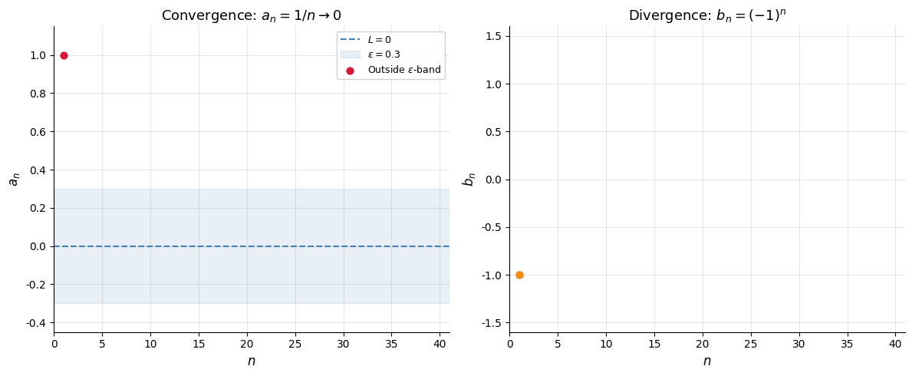
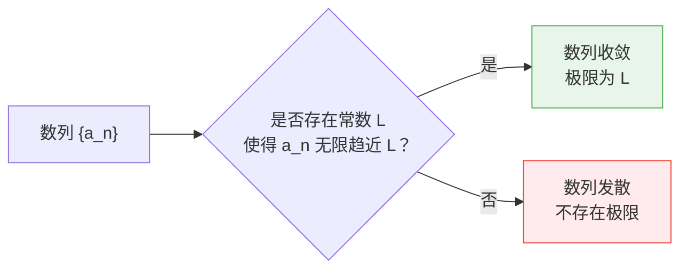

# 数列极限初步

> **所属路径**：`00_高中复习/01_数学基础/04_数列/04_数列极限初步`
> **预计学习时间**：50 分钟
> **难度等级**：⭐⭐⭐

---

## 前置知识

- [等比数列](../02_等比数列/02_等比数列.md) — 等比数列与无穷级数的概念
- [递推与求和](../03_递推与求和/03_递推与求和.md) — 递推关系与数列求和

> 如果以上内容还不熟悉，建议先完成对应课程再继续。

---

## 学习目标

完成本节后，你将能够：

1. 直觉上理解"极限"的概念——一个量无限趋近于某个固定值
2. 判断简单数列是否有极限，并求出极限值
3. 掌握极限的基本运算法则
4. 理解极限概念与人工智能中"收敛"概念的联系

---

## 正文讲解

### 1. 从"无限趋近"说起

在 **[等比数列](../02_等比数列/02_等比数列.md)** 中，我们见过一个有趣的例子：

$$
1, \; \frac{1}{2}, \; \frac{1}{4}, \; \frac{1}{8}, \; \frac{1}{16}, \; \ldots
$$

这个数列的每一项都是正数，而且越来越小。它会"小到 0"吗？严格来说，数列中没有哪一项**等于** 0——因为 $\left(\dfrac{1}{2}\right)^n > 0$ 对任何正整数 $n$ 都成立。但直觉告诉我们，随着 $n$ 越来越大，这些数字确实在**无限趋近于 0**。

这种"无限趋近但可能永远达不到"的概念，就是 **极限（Limit）**。

在人工智能的训练过程中，你也会反复遇到类似的场景：

- **损失函数下降**：每个 epoch 后损失值减小，趋向某个最小值但可能永远不会精确达到
- **梯度消失**：深层网络中梯度逐层衰减，趋近于 0
- **模型参数收敛**：训练过程中参数值逐渐稳定，趋近于最优解

### 2. 数列极限的直觉定义

如果数列 $\{a_n\}$ 随着 $n$ 的增大，各项的值无限趋近于一个固定的常数 $L$ ，那么就说数列 $\{a_n\}$ 的 **极限** 是 $L$ ，记作：

$$
\lim_{n \to \infty} a_n = L
$$

读作"当 $n$ 趋向无穷大时， $a_n$ 的极限是 $L$ "。

> **直觉解读**：想象在数轴上以 $L$ 为圆心画一个非常小的"邻域"（比如 $[L - 0.001, L + 0.001]$ ）。如果从某一项开始，数列的所有项都落在这个邻域内——不管你把邻域画得多小——那么 $L$ 就是这个数列的极限。

下面的动画让你直观感受"收敛"与"发散"的区别——左图中 $a_n = 1/n$ 的各项逐渐落入越来越窄的 $\varepsilon$ 带内（收敛到 0），右图中 $b_n = (-1)^n$ 永远在 $+1$ 和 $-1$ 之间跳动（发散）：



> 📌 **图解说明**：左图中绿色点表示落在 $\varepsilon$ 邻域内的项，红色点表示在邻域外的项。随着 $\varepsilon$ 不断缩小，越来越多的项被"困"在邻域内——这就是收敛的直觉含义。右图中点永远无法被任何邻域全部包含，所以数列发散。你可以运行 `code/animate_convergence.py` 自行生成这个动画。



> 📌 **图解说明**：数列要么收敛（趋近一个固定值），要么发散（没有确定的趋近目标）。判断收敛或发散，是分析数列极限的第一步。

### 3. 常见数列的极限

掌握以下常见数列的极限，可以帮助你快速处理更复杂的情况：

| 数列 | 极限 | 说明 |
| ---- | ---- | ---- |
| $a_n = \dfrac{1}{n}$ | $0$ | 分母越来越大，整体趋向 0 |
| $a_n = \dfrac{1}{n^2}$ | $0$ | 趋向 0 的速度比 $\dfrac{1}{n}$ 更快 |
| $a_n = \left(\dfrac{1}{2}\right)^n$ | $0$ | $\|q\| < 1$ 的等比数列趋向 0 |
| $a_n = \dfrac{n+1}{n} = 1 + \dfrac{1}{n}$ | $1$ | 从上方趋近 1 |
| $a_n = \dfrac{2n}{n+1} = \dfrac{2}{1 + 1/n}$ | $2$ | 从下方趋近 2 |
| $a_n = (-1)^n \cdot \dfrac{1}{n}$ | $0$ | 正负交替但幅度趋向 0 |
| $a_n = (-1)^n$ | 不存在 | 在 $-1$ 和 $1$ 之间永远摆动 |
| $a_n = n$ | 不存在 | 无限增大，发散 |

### 4. 极限的运算法则

如果 $\lim_{n \to \infty} a_n = A$ 且 $\lim_{n \to \infty} b_n = B$ ，那么：

$$
\lim_{n \to \infty} (a_n + b_n) = A + B
$$

$$
\lim_{n \to \infty} (a_n \cdot b_n) = A \cdot B
$$

$$
\lim_{n \to \infty} \frac{a_n}{b_n} = \frac{A}{B} \quad (B \neq 0)
$$

$$
\lim_{n \to \infty} c \cdot a_n = c \cdot A \quad (c \text{ 为常数})
$$

> **直觉解读**：这些法则在说——极限运算和普通的加减乘除一样"规规矩矩"。你可以先分别求出各部分的极限，再合并结果。

### 5. 求极限的实用技巧

#### 技巧一：有理式极限——"抓大头"

对于 $\dfrac{P(n)}{Q(n)}$ 类型（分子分母都是关于 $n$ 的多项式），只需看**最高次项**：

$$
\lim_{n \to \infty} \frac{3n^2 + 5n - 1}{2n^2 - n + 4} = \frac{3}{2}
$$

因为当 $n$ 很大时，低次项相对于最高次项可以忽略不计。

具体做法：分子分母同除以 $n^2$ ：

$$
\lim_{n \to \infty} \frac{3 + 5/n - 1/n^2}{2 - 1/n + 4/n^2} = \frac{3 + 0 - 0}{2 - 0 + 0} = \frac{3}{2}
$$

#### 技巧二：等比数列极限

当 $|q| < 1$ 时：

$$
\lim_{n \to \infty} q^n = 0
$$

当 $|q| > 1$ 时， $q^n$ 发散（无极限）。

#### 技巧三：夹逼准则

如果 $a_n \leq b_n \leq c_n$ ，且 $\lim a_n = \lim c_n = L$ ，那么 $\lim b_n = L$ 。

> 📌 就像三明治——上下两片面包趋向同一个位置，中间的馅也只能跟着到那个位置。这也叫"**三明治定理（Squeeze Theorem）**"。

### 6. 极限与人工智能中的"收敛"

在 AI 中，"收敛"是一个核心概念。训练模型时，我们期望：

- 损失函数值序列 $L_1, L_2, L_3, \ldots$ 趋向最小值——即 $\lim_{t \to \infty} L_t = L^*$
- 模型参数序列 $\theta_1, \theta_2, \theta_3, \ldots$ 趋向最优参数——即 $\lim_{t \to \infty} \theta_t = \theta^*$

如果这些序列确实有极限，我们就说训练"收敛了"。如果没有极限（比如损失值上下跳动不稳定），就说训练"没有收敛"或"发散了"——这通常意味着学习率太大或模型有问题。

数列极限的概念，将在后续学习 **[极限与连续](../../../01_基础能力/02_数学基础/02_微积分/01_极限与连续/)** 时得到更严格的定义和更丰富的应用。

---

## 动手实践

```python
# 文件：code/sequence_limits.py
# 数列极限的数值验证
# 环境要求：Python 3.10+（仅使用标准库）

def show_limit(name: str, sequence_fn, expected_limit, ns=None):
    """展示数列趋近极限的过程"""
    if ns is None:
        ns = [10, 100, 1000, 10000, 100000]
    print(f"\n数列：{name}")
    print(f"  理论极限：{expected_limit}")
    for n in ns:
        val = sequence_fn(n)
        error = abs(val - expected_limit) if expected_limit is not None else None
        if error is not None:
            print(f"  n={n:>6d}: a_n = {val:.10f}, 误差 = {error:.2e}")
        else:
            print(f"  n={n:>6d}: a_n = {val:.10f}")


if __name__ == "__main__":
    print("=" * 55)
    print("数列极限的数值验证")
    print("=" * 55)

    # 1/n → 0
    show_limit("a_n = 1/n", lambda n: 1/n, 0)

    # (1/2)^n → 0
    show_limit("a_n = (1/2)^n", lambda n: 0.5**n, 0)

    # (3n²+5n-1)/(2n²-n+4) → 3/2
    show_limit(
        "a_n = (3n²+5n-1)/(2n²-n+4)",
        lambda n: (3*n**2 + 5*n - 1) / (2*n**2 - n + 4),
        1.5
    )

    # (n+1)/n → 1
    show_limit("a_n = (n+1)/n", lambda n: (n+1)/n, 1)

    # 发散数列：(-1)^n
    print("\n" + "=" * 55)
    print("发散数列示例：a_n = (-1)^n")
    print("  该数列在 -1 和 1 之间永远摆动，不收敛：")
    for n in range(1, 11):
        print(f"  n={n}: a_n = {(-1)**n}")

    # AI 模拟：损失函数收敛
    print("\n" + "=" * 55)
    print("AI 模拟：损失函数的'收敛'过程")
    loss = 10.0
    decay = 0.95
    print(f"  初始损失：{loss}")
    for epoch in range(1, 51):
        loss = loss * decay
        if epoch % 10 == 0:
            print(f"  Epoch {epoch:>3d}: loss = {loss:.6f}")
    print(f"  理论极限：0（因为 0.95^n → 0）")
```

**运行说明**：
- 环境要求：Python 3.10+（仅使用标准库）
- 运行命令：`python code/sequence_limits.py`

---

## 典型误区

| 误区 | 正确理解 |
| ---- | -------- |
| 认为极限值一定是数列某一项的值 | 极限值可以不等于数列中任何一项。如 $a_n = \dfrac{1}{n}$ 的极限是 0，但数列中没有哪一项等于 0 |
| 认为单调递增数列一定趋向正无穷 | 有界的单调数列一定有极限。如 $a_n = 1 - \dfrac{1}{n}$ 单调递增但趋向 1，不趋向正无穷 |
| 混淆"趋近于 0"和"等于 0" | $\lim a_n = 0$ 意味着可以无限接近 0，但不要求某一项精确等于 0 |
| 认为摆动的数列一定发散 | 如果摆动幅度趋于 0（如 $a_n = (-1)^n / n$ ），数列仍然收敛（极限为 0） |

---

## 练习题

### 练习 1：判断收敛与发散（难度：⭐）

判断以下数列是否有极限，若有则求出极限值：

1. $a_n = \dfrac{3n - 1}{n + 2}$
2. $a_n = 2^n$
3. $a_n = \dfrac{(-1)^n}{n}$

<details>
<summary>💡 提示</summary>

第 1 题分子分母同除以 $n$ ；第 2 题考虑 $n$ 增大时 $2^n$ 的趋势；第 3 题虽然正负交替，但幅度在减小。

</details>

<details>
<summary>✅ 参考答案</summary>

1. $\lim_{n \to \infty} \dfrac{3n-1}{n+2} = \lim_{n \to \infty} \dfrac{3 - 1/n}{1 + 2/n} = \dfrac{3}{1} = 3$ ，收敛，极限为 3

2. $\lim_{n \to \infty} 2^n = +\infty$ ，发散，无极限

3. $|a_n| = \dfrac{1}{n} \to 0$ ，所以 $\lim_{n \to \infty} \dfrac{(-1)^n}{n} = 0$ ，收敛，极限为 0

</details>

### 练习 2：求极限（难度：⭐⭐）

求 $\lim_{n \to \infty} \dfrac{2n^3 + 3n}{5n^3 - n^2 + 1}$

<details>
<summary>💡 提示</summary>

分子分母同除以最高次项 $n^3$ ，然后利用 $\dfrac{1}{n} \to 0$ 等结论。

</details>

<details>
<summary>✅ 参考答案</summary>

分子分母同除以 $n^3$ ：

$$\lim_{n \to \infty} \dfrac{2 + 3/n^2}{5 - 1/n + 1/n^3} = \dfrac{2 + 0}{5 - 0 + 0} = \dfrac{2}{5}$$

</details>

### 练习 3：收敛速度比较（难度：⭐⭐⭐）

以下三个数列都趋向 0。用 Python 比较它们"趋向 0 的速度"，哪个最快？

1. $a_n = \dfrac{1}{n}$
2. $b_n = \dfrac{1}{n^2}$
3. $c_n = \left(\dfrac{1}{2}\right)^n$

<details>
<summary>💡 提示</summary>

分别计算 $n = 10, 100, 1000$ 时三个数列的值，比较哪个更早接近 0。

</details>

<details>
<summary>✅ 参考答案</summary>

```python
for n in [10, 100, 1000]:
    print(f"n={n}: 1/n={1/n:.2e}, 1/n²={1/n**2:.2e}, (1/2)^n={0.5**n:.2e}")
```

输出：
```
n=10:  1/n=1.00e-01, 1/n²=1.00e-02, (1/2)^n=9.77e-04
n=100: 1/n=1.00e-02, 1/n²=1.00e-04, (1/2)^n≈0 (极小)
```

收敛速度： $(1/2)^n$ 最快（指数级） > $1/n^2$ 较快（多项式级） > $1/n$ 最慢。在 AI 中，我们通常希望训练误差以"指数级"速度收敛。

</details>

---

## 下一步学习

- 📖 下一个知识主题：[三角函数](../../05_三角函数/) — 另一类具有周期性极限行为的重要函数
- 🔗 相关知识点：[极限与连续](../../../01_基础能力/02_数学基础/02_微积分/01_极限与连续/) — 从数列极限推广到函数极限，建立微积分的基础
- 📚 拓展阅读：[导数初步](../../12_导数初步/) — 极限是定义导数的核心工具

---

## 参考资料


1. [维基百科：数列极限](https://zh.wikipedia.org/wiki/数列极限) — 数列极限的直觉定义与ε-N 定义（公共知识库，CC BY-SA 许可）
2. [Khan Academy: Limits of sequences](https://www.khanacademy.org/math/ap-calculus-bc/bc-series-new/bc-10-1/v/convergent-and-divergent-sequences) — 可汗学院的数列极限课程（免费公开课程）
3. [3Blue1Brown: Essence of Calculus](https://www.youtube.com/playlist?list=PLZHQObOWTQDMsr9K-rj53DwVRMYO3t5Yr) — 可视化理解极限与微积分的直觉（YouTube 公开视频）
