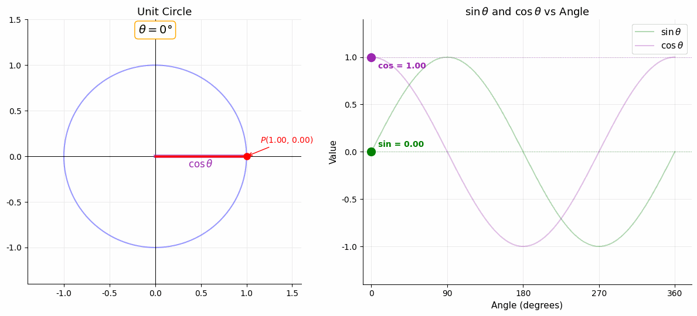

# 弧度与三角比

> **所属路径**：`00_高中复习/01_数学基础/05_三角函数/01_弧度与三角比`
> **预计学习时间**：45 分钟
> **难度等级**：⭐

---

## 前置知识

- [向量表示与运算](../../06_向量/01_向量表示与运算/) — 向量的基本概念
- [代数与方程](../../01_代数与方程/) — 基本的代数运算能力

> 如果以上内容还不熟悉，建议先完成对应课程再继续。

---

## 学习目标

完成本节后，你将能够：

1. 解释弧度制的定义，并在角度与弧度之间自由转换
2. 定义正弦、余弦、正切三个基本三角比，理解其几何含义
3. 记住常用特殊角的三角函数值
4. 理解三角函数在 AI 中的位置编码等应用场景

---

## 正文讲解

### 1. 两种度量角的方式

我们从小就用"度"来度量角：直角是 $90°$ ，平角是 $180°$ ，一圈是 $360°$ 。这个系统直观易用，但在数学和编程中，另一种度量方式更加方便——**弧度（Radian）**。

想象一个半径为 $r$ 的圆，在圆上截取一段与半径等长的弧（弧长 $= r$ ）。这段弧对应的圆心角，就定义为 **1 弧度**。

$$
1 \text{ 弧度} = \frac{\text{弧长}}{\text{半径}} = \frac{r}{r} = 1
$$

由于圆的周长是 $2\pi r$ ，所以一整圈对应的弧度数是：

$$
\frac{2\pi r}{r} = 2\pi \text{ 弧度}
$$

因此：

$$
360° = 2\pi \text{ rad} \implies 180° = \pi \text{ rad} \implies 1° = \frac{\pi}{180} \text{ rad}
$$

> **直觉解读**：弧度制把"角度"直接用"弧长与半径的比值"来表示。这个比值不依赖于圆的大小——无论圆多大多小，同一个角对应的弧度值相同。这种"无量纲"的定义使得数学公式更简洁。

### 2. 角度与弧度的互换

| 角度 | 弧度 | 说明 |
| ---- | ---- | ---- |
| $0°$ | $0$ | |
| $30°$ | $\dfrac{\pi}{6}$ | |
| $45°$ | $\dfrac{\pi}{4}$ | |
| $60°$ | $\dfrac{\pi}{3}$ | |
| $90°$ | $\dfrac{\pi}{2}$ | 直角 |
| $180°$ | $\pi$ | 平角 |
| $270°$ | $\dfrac{3\pi}{2}$ | |
| $360°$ | $2\pi$ | 一周 |

转换公式：

$$
\text{弧度} = \text{角度} \times \frac{\pi}{180}
$$

$$
\text{角度} = \text{弧度} \times \frac{180}{\pi}
$$

> 📌 **为什么 AI 中用弧度？** Python 的 `math.sin()` 、 `math.cos()` 等函数的参数都是弧度值。PyTorch、NumPy 中的三角函数同样如此。如果传入角度值，结果将完全错误。这是初学者常犯的错误。

### 3. 三角比的定义：从直角三角形出发

在一个直角三角形中，设一个锐角为 $\theta$ ，与该角相关的三条边分别是：

- **对边（Opposite）**：角 $\theta$ 对面的边
- **邻边（Adjacent）**：角 $\theta$ 旁边的边（不是斜边）
- **斜边（Hypotenuse）**：最长的边（直角对面）

三个基本 **三角比（Trigonometric Ratios）** 定义为：

$$
\sin \theta = \frac{\text{对边}}{\text{斜边}}, \quad \cos \theta = \frac{\text{邻边}}{\text{斜边}}, \quad \tan \theta = \frac{\text{对边}}{\text{邻边}} = \frac{\sin \theta}{\cos \theta}
$$

下面这张图清晰地展示了直角三角形中三角比的定义：


> 📌 **图解说明**：在直角三角形中，角 $\theta$ 的三个三角比分别由对边、邻边和斜边的比值定义。你可以运行 `code/plot_unit_circle.py` 自行生成这张图。

> **直觉解读**：三角比的本质是"比例"。同一个角度 $\theta$ ，无论三角形多大多小，三边的比值不变。这就是"相似三角形"的核心思想——形状相同的三角形，对应边成比例。

### 4. 单位圆定义：推广到任意角

直角三角形只能处理 $0°$ 到 $90°$ 之间的角。为了将三角函数推广到任意角度，我们使用 **单位圆（Unit Circle）** 的定义：

在平面直角坐标系中，以原点为圆心、半径为 1 画一个圆。从正 $x$ 轴出发，逆时针旋转角 $\theta$ ，与圆的交点坐标为 $(x, y)$ ，则：

$$
\cos \theta = x, \quad \sin \theta = y, \quad \tan \theta = \frac{y}{x}
$$

下面这张图直观地展示了单位圆上点的坐标与三角函数值的对应关系：


> 📌 **图解说明**：单位圆使三角函数的值直接对应坐标——余弦是横坐标（紫色线段），正弦是纵坐标（绿色虚线）。红色线段是半径 $r = 1$ 。不同象限决定了三角函数值的正负号。你可以运行 `code/plot_unit_circle.py` 自行生成这张图。

下面的动画更直观地展示了：当角 $\theta$ 从 $0°$ 连续旋转到 $360°$ 时， $\sin\theta$ 和 $\cos\theta$ 是如何随角度变化的——左侧是单位圆上点的运动轨迹，右侧是对应的函数曲线：



> 📌 **图解说明**：观察动画中绿色点（ $\sin\theta$ ）和紫色点（ $\cos\theta$ ）的运动——当角度在第一象限时二者都为正；进入第二象限后 $\cos\theta$ 变为负；第三象限二者都为负；第四象限 $\cos\theta$ 恢复为正。你可以运行 `code/animate_unit_circle.py` 自行生成这个动画。

### 5. 特殊角的三角函数值

以下特殊角的值需要牢记，它们在计算和证明中频繁出现：

| 角度 | 弧度 | $\sin$ | $\cos$ | $\tan$ |
| ---- | ---- | ------ | ------ | ------ |
| $0°$ | $0$ | $0$ | $1$ | $0$ |
| $30°$ | $\dfrac{\pi}{6}$ | $\dfrac{1}{2}$ | $\dfrac{\sqrt{3}}{2}$ | $\dfrac{\sqrt{3}}{3}$ |
| $45°$ | $\dfrac{\pi}{4}$ | $\dfrac{\sqrt{2}}{2}$ | $\dfrac{\sqrt{2}}{2}$ | $1$ |
| $60°$ | $\dfrac{\pi}{3}$ | $\dfrac{\sqrt{3}}{2}$ | $\dfrac{1}{2}$ | $\sqrt{3}$ |
| $90°$ | $\dfrac{\pi}{2}$ | $1$ | $0$ | 无定义 |

> **记忆技巧**：观察 $\sin$ 那一列从上到下是 $\dfrac{\sqrt{0}}{2}, \dfrac{\sqrt{1}}{2}, \dfrac{\sqrt{2}}{2}, \dfrac{\sqrt{3}}{2}, \dfrac{\sqrt{4}}{2}$ ，即 $0, \dfrac{1}{2}, \dfrac{\sqrt{2}}{2}, \dfrac{\sqrt{3}}{2}, 1$ 。而 $\cos$ 恰好是 $\sin$ 的倒序。

### 6. 基本恒等式

从单位圆的定义可以直接得到最基本的 **勾股恒等式（Pythagorean Identity）**：

$$
\sin^2 \theta + \cos^2 \theta = 1
$$

> **直觉解读**：单位圆上的点 $(\cos\theta, \sin\theta)$ 到原点的距离是 1，而距离公式就是 $\sqrt{x^2 + y^2} = 1$ ，两边平方即得上式。

这个恒等式在后续学习 **[常用恒等变换](../03_常用恒等变换/)** 时会被频繁使用。

### 7. 三角函数在人工智能中的应用

三角函数在 AI 中的一个重要应用是 **位置编码（Positional Encoding）**。在 **Transformer** 架构中，模型需要知道序列中每个元素的"位置"。位置编码使用正弦和余弦函数来为每个位置生成唯一的向量：

$$
PE_{(pos, 2i)} = \sin\left(\frac{pos}{10000^{2i/d}}\right), \quad PE_{(pos, 2i+1)} = \cos\left(\frac{pos}{10000^{2i/d}}\right)
$$

为什么选用三角函数？因为它们具有**周期性**和**平滑性**，能让模型感知相对距离。这将在后续 **[位置编码](../../../02_核心原理/03_深度学习/14_自注意力架构/02_位置编码/)** 中详细讲解。

---

## 动手实践

```python
# 文件：code/radian_trig.py
# 弧度转换与三角函数计算
# 环境要求：Python 3.10+（仅使用标准库 math）

import math


def deg2rad(degrees: float) -> float:
    """角度转弧度"""
    return degrees * math.pi / 180


def rad2deg(radians: float) -> float:
    """弧度转角度"""
    return radians * 180 / math.pi


if __name__ == "__main__":
    # 角度-弧度互转
    print("=" * 50)
    print("角度与弧度互转")
    print("=" * 50)
    for deg in [0, 30, 45, 60, 90, 180, 360]:
        rad = deg2rad(deg)
        print(f"  {deg:>3d}° = {rad:.4f} rad = {rad/math.pi:.4f}π")

    # 特殊角三角函数值
    print("\n" + "=" * 50)
    print("特殊角三角函数值")
    print("=" * 50)
    print(f"{'角度':>6} | {'弧度':>8} | {'sin':>8} | {'cos':>8} | {'tan':>8}")
    print("-" * 50)
    for deg in [0, 30, 45, 60, 90]:
        rad = deg2rad(deg)
        s = math.sin(rad)
        c = math.cos(rad)
        t = math.tan(rad) if deg != 90 else float('inf')
        t_str = f"{t:>8.4f}" if deg != 90 else "     inf"
        print(f"{deg:>5d}° | {rad:>8.4f} | {s:>8.4f} | {c:>8.4f} | {t_str}")

    # 勾股恒等式验证
    print("\n" + "=" * 50)
    print("勾股恒等式验证：sin²θ + cos²θ = 1")
    print("=" * 50)
    for deg in [0, 17, 45, 73, 90, 135, 200, 300]:
        rad = deg2rad(deg)
        result = math.sin(rad)**2 + math.cos(rad)**2
        print(f"  θ = {deg:>3d}°: sin²θ + cos²θ = {result:.10f}")

    # 常见错误演示：传入角度而非弧度
    print("\n" + "=" * 50)
    print("⚠️ 常见错误：把角度直接传入 sin()")
    print("=" * 50)
    print(f"  sin(90) = {math.sin(90):.4f}  ← 错误！90 被当作弧度")
    print(f"  sin(π/2) = {math.sin(math.pi/2):.4f}  ← 正确！")
```

**运行说明**：
- 环境要求：Python 3.10+（仅使用标准库 `math`）
- 运行命令：`python code/radian_trig.py`

---

## 典型误区

| 误区 | 正确理解 |
| ---- | -------- |
| 在 Python 中把角度直接传入 `math.sin()` | Python 的三角函数参数是**弧度**，不是角度。 $\sin(90) \neq 1$ ，正确写法是 `math.sin(math.pi/2)` |
| 认为 $\sin^2\theta$ 表示 $\sin(\sin(\theta))$ | $\sin^2\theta$ 是 $(\sin\theta)^2$ 的简写，表示先求正弦再平方 |
| 认为三角函数只在直角三角形中有意义 | 单位圆定义把三角函数推广到了任意角度，包括负角度和大于 $360°$ 的角度 |
| 混淆弧度和角度的数值 | $1$ 弧度 $\approx 57.3°$ ，远不等于 $1°$ 。混淆两者会导致计算结果完全错误 |

---

## 练习题

### 练习 1：角度弧度转换（难度：⭐）

将以下角度转换为弧度（用 $\pi$ 的倍数表示）：

1. $120°$
2. $150°$
3. $270°$
4. $-45°$

<details>
<summary>💡 提示</summary>

用公式 $\text{弧度} = \text{角度} \times \dfrac{\pi}{180}$ 。

</details>

<details>
<summary>✅ 参考答案</summary>

1. $120° = 120 \times \dfrac{\pi}{180} = \dfrac{2\pi}{3}$
2. $150° = 150 \times \dfrac{\pi}{180} = \dfrac{5\pi}{6}$
3. $270° = 270 \times \dfrac{\pi}{180} = \dfrac{3\pi}{2}$
4. $-45° = -45 \times \dfrac{\pi}{180} = -\dfrac{\pi}{4}$

</details>

### 练习 2：三角函数值计算（难度：⭐⭐）

不使用计算器，求以下三角函数值：

1. $\sin 150°$
2. $\cos 240°$
3. $\tan 315°$

<details>
<summary>💡 提示</summary>

利用单位圆，确定角度所在象限，再利用参考角（与 $x$ 轴所成的锐角）和特殊角值。

</details>

<details>
<summary>✅ 参考答案</summary>

1. $150° = 180° - 30°$ ，在第二象限。 $\sin 150° = \sin 30° = \dfrac{1}{2}$

2. $240° = 180° + 60°$ ，在第三象限。 $\cos 240° = -\cos 60° = -\dfrac{1}{2}$

3. $315° = 360° - 45°$ ，在第四象限。 $\tan 315° = -\tan 45° = -1$

</details>

### 练习 3：编程验证（难度：⭐⭐）

编写 Python 代码验证：对于 $\theta = 0°, 30°, 45°, \ldots, 360°$ （每隔 $15°$ ），勾股恒等式 $\sin^2\theta + \cos^2\theta = 1$ 是否恒成立。

<details>
<summary>💡 提示</summary>

用 `range(0, 361, 15)` 生成角度序列，别忘了先转换为弧度。

</details>

<details>
<summary>✅ 参考答案</summary>

```python
import math
for deg in range(0, 361, 15):
    rad = math.radians(deg)
    result = math.sin(rad)**2 + math.cos(rad)**2
    assert abs(result - 1) < 1e-10, f"失败：{deg}°"
    print(f"{deg:>3d}°: sin²+cos² = {result:.15f} ✓")
print("全部验证通过！")
```

</details>

---

## 下一步学习

- 📖 下一个知识点：[三角函数图像](../02_三角函数图像/) — 画出 sin、cos、tan 的图像，理解周期、振幅和相位
- 🔗 相关知识点：[常用恒等变换](../03_常用恒等变换/) — 基于基本三角比推导更多有用的恒等式
- 📚 拓展阅读：[向量](../../06_向量/) — 三角函数在向量分解和旋转中的核心作用

---

## 参考资料


1. [维基百科：三角函数](https://zh.wikipedia.org/wiki/三角函数) — 三角函数的定义、性质和历史（公共知识库，CC BY-SA 许可）
2. [Khan Academy: Trigonometry](https://www.khanacademy.org/math/trigonometry) — 可汗学院的三角函数课程（免费公开课程）
3. [Python 官方文档：math 模块](https://docs.python.org/zh-cn/3/library/math.html) — 三角函数的 Python 实现（官方文档）
