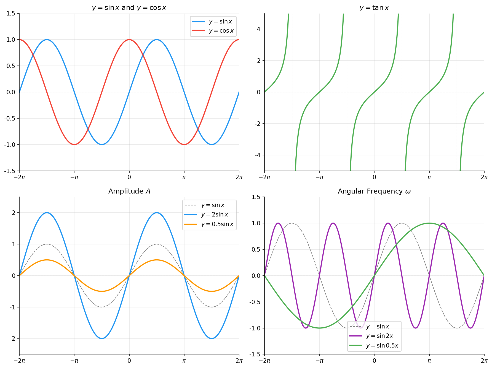

# 三角函数图像

> **所属路径**：`00_高中复习/01_数学基础/05_三角函数/02_三角函数图像`
> **预计学习时间**：50 分钟
> **难度等级**：⭐⭐

---

## 前置知识

- [弧度与三角比](../01_弧度与三角比/01_弧度与三角比.md) — 三角函数的定义与基本性质
- [图像平移与变换](../../02_函数与图像/04_图像平移与变换/04_图像平移与变换.md) — 函数图像的平移、伸缩和翻转
- [周期性与对称性](../../02_函数与图像/03_周期性与对称性/03_周期性与对称性.md) — 周期函数的概念

> 如果以上内容还不熟悉，建议先完成对应课程再继续。

---

## 学习目标

完成本节后，你将能够：

1. 画出 $y = \sin x$ 、 $y = \cos x$ 、 $y = \tan x$ 的标准图像
2. 理解振幅、周期、相位移和垂直偏移对图像的影响
3. 写出一般正弦函数 $y = A\sin(\omega x + \varphi) + k$ 各参数的含义
4. 用 Python 绘制和变换三角函数图像

---

## 正文讲解

### 1. 正弦函数 $y = \sin x$ 的图像

在 **[弧度与三角比](../01_弧度与三角比/01_弧度与三角比.md)** 中，我们用单位圆定义了 $\sin\theta$ 为圆上点的纵坐标。现在，让 $\theta$ （即 $x$ ）从 $-2\pi$ 连续变化到 $2\pi$ ，把每个 $x$ 对应的 $\sin x$ 值画成图，就得到了正弦函数的图像——一条优美的波浪线。



> 📌 **图解说明**：上图展示了 $\sin x$ 、 $\cos x$ 和 $\tan x$ 的标准图像。正弦和余弦是平滑的波浪线，在 $[-1, 1]$ 之间振荡；正切函数有垂直渐近线，值域是 $(-\infty, +\infty)$ 。你可以运行 `code/plot_trig.py` 自行生成这张图。

### 2. 三个基本三角函数的对比

| 性质 | $y = \sin x$ | $y = \cos x$ | $y = \tan x$ |
| ---- | ------------ | ------------ | ------------ |
| 定义域 | $(-\infty, +\infty)$ | $(-\infty, +\infty)$ | $x \neq \dfrac{\pi}{2} + k\pi$ |
| 值域 | $[-1, 1]$ | $[-1, 1]$ | $(-\infty, +\infty)$ |
| 周期 | $2\pi$ | $2\pi$ | $\pi$ |
| 奇偶性 | 奇函数 | 偶函数 | 奇函数 |
| 过原点 | 是 | 否（过 $(0,1)$ ） | 是 |

> **关键观察**：$\cos x = \sin\left(x + \dfrac{\pi}{2}\right)$ ——余弦函数就是正弦函数向左平移 $\dfrac{\pi}{2}$ 的结果。它们的形状完全相同，只是"起步位置"不同。

### 3. 五点法画正弦曲线

画一个周期的 $y = \sin x$ 只需要五个关键点：

| 点 | $x$ | $\sin x$ | 特征 |
| -- | --- | -------- | ---- |
| 起点 | $0$ | $0$ | 从零出发 |
| 最高点 | $\dfrac{\pi}{2}$ | $1$ | 达到最大值 |
| 中点 | $\pi$ | $0$ | 回到零 |
| 最低点 | $\dfrac{3\pi}{2}$ | $-1$ | 达到最小值 |
| 终点 | $2\pi$ | $0$ | 完成一个周期 |

连接这五个点画出光滑曲线，就是一个完整的正弦波。

### 4. 一般正弦函数 $y = A\sin(\omega x + \varphi) + k$

正弦函数的"标准波形"可以通过四个参数来调节：

$$
y = A\sin(\omega x + \varphi) + k
$$

| 参数 | 名称 | 效果 |
| ---- | ---- | ---- |
| $A$ | **振幅（Amplitude）** | 控制波的高度。值域变为 $[k-\|A\|, k+\|A\|]$ |
| $\omega$ | **角频率（Angular Frequency）** | 控制波的"快慢"。周期 $T = \dfrac{2\pi}{\|\omega\|}$ |
| $\varphi$ | **初相（Phase Shift）** | 控制波的左右移动。图像向左移 $\dfrac{\varphi}{\omega}$ 个单位 |
| $k$ | **垂直偏移（Vertical Shift）** | 控制波的上下移动。中线变为 $y = k$ |

> **直觉解读**：
> - $A$ 决定"声音多大"（振幅越大，波越高）
> - $\omega$ 决定"频率多高"（ $\omega$ 越大，波越密，周期越短）
> - $\varphi$ 决定"从哪里开始"（起步位置的偏移）
> - $k$ 决定"基线在哪里"（整体上下移动）

在 AI 中，**位置编码** 正是通过改变 $\omega$ 参数（使用不同频率）来为序列中的每个位置生成唯一编码：频率越低的分量捕捉粗粒度的位置关系，频率越高的分量捕捉细粒度的局部关系。

### 5. 从图像读取参数

给定一段正弦波形，如何反过来确定 $A$ 、 $\omega$ 、 $\varphi$ 和 $k$ ？

1. **振幅 $A$** ：找最大值 $M$ 和最小值 $m$ ，则 $A = \dfrac{M - m}{2}$
2. **垂直偏移 $k$** ： $k = \dfrac{M + m}{2}$
3. **周期 $T$ 和角频率 $\omega$** ：找相邻两个最高点（或最低点）之间的水平距离，即为周期 $T$ ，然后 $\omega = \dfrac{2\pi}{T}$
4. **初相 $\varphi$** ：找离原点最近的"上升过零点" $x_0$ ，则 $\varphi = -\omega x_0$

---

## 动手实践

```python
# 文件：code/plot_trig.py
# 绘制三角函数图像及参数变换效果
# 环境要求：Python 3.10+, matplotlib, numpy

import os
import numpy as np
import matplotlib.pyplot as plt

plt.rcParams['font.sans-serif'] = ['DejaVu Sans']
plt.rcParams['axes.unicode_minus'] = False

fig, axes = plt.subplots(2, 2, figsize=(12, 9))

x = np.linspace(-2 * np.pi, 2 * np.pi, 500)

# 左上：sin, cos
ax = axes[0, 0]
ax.plot(x, np.sin(x), color='#2196f3', linewidth=2, label='$y = \\sin x$')
ax.plot(x, np.cos(x), color='#f44336', linewidth=2, label='$y = \\cos x$')
ax.axhline(y=0, color='gray', linewidth=0.5, linestyle='--')
ax.set_xlim(-2*np.pi, 2*np.pi)
ax.set_ylim(-1.5, 1.5)
ax.set_xticks([-2*np.pi, -np.pi, 0, np.pi, 2*np.pi])
ax.set_xticklabels(['$-2\\pi$', '$-\\pi$', '0', '$\\pi$', '$2\\pi$'])
ax.set_title('$y = \\sin x$ and $y = \\cos x$', fontsize=12)
ax.legend(fontsize=10)
ax.grid(alpha=0.3)
ax.spines['top'].set_visible(False)
ax.spines['right'].set_visible(False)

# 右上：tan
ax = axes[0, 1]
for k in range(-2, 3):
    x_seg = np.linspace(-np.pi/2 + k*np.pi + 0.05, np.pi/2 + k*np.pi - 0.05, 200)
    ax.plot(x_seg, np.tan(x_seg), color='#4caf50', linewidth=2)
    ax.axvline(x=np.pi/2 + k*np.pi, color='gray', linewidth=0.5, linestyle=':')
ax.axhline(y=0, color='gray', linewidth=0.5, linestyle='--')
ax.set_xlim(-2*np.pi, 2*np.pi)
ax.set_ylim(-5, 5)
ax.set_xticks([-2*np.pi, -np.pi, 0, np.pi, 2*np.pi])
ax.set_xticklabels(['$-2\\pi$', '$-\\pi$', '0', '$\\pi$', '$2\\pi$'])
ax.set_title('$y = \\tan x$', fontsize=12)
ax.grid(alpha=0.3)
ax.spines['top'].set_visible(False)
ax.spines['right'].set_visible(False)

# 左下：振幅变换
ax = axes[1, 0]
ax.plot(x, np.sin(x), color='gray', linewidth=1, linestyle='--', label='$y = \\sin x$')
ax.plot(x, 2*np.sin(x), color='#2196f3', linewidth=2, label='$y = 2\\sin x$')
ax.plot(x, 0.5*np.sin(x), color='#ff9800', linewidth=2, label='$y = 0.5\\sin x$')
ax.axhline(y=0, color='gray', linewidth=0.5, linestyle='--')
ax.set_xlim(-2*np.pi, 2*np.pi)
ax.set_ylim(-2.5, 2.5)
ax.set_xticks([-2*np.pi, -np.pi, 0, np.pi, 2*np.pi])
ax.set_xticklabels(['$-2\\pi$', '$-\\pi$', '0', '$\\pi$', '$2\\pi$'])
ax.set_title('Amplitude $A$', fontsize=12)
ax.legend(fontsize=10)
ax.grid(alpha=0.3)
ax.spines['top'].set_visible(False)
ax.spines['right'].set_visible(False)

# 右下：频率变换
ax = axes[1, 1]
ax.plot(x, np.sin(x), color='gray', linewidth=1, linestyle='--', label='$y = \\sin x$')
ax.plot(x, np.sin(2*x), color='#9c27b0', linewidth=2, label='$y = \\sin 2x$')
ax.plot(x, np.sin(0.5*x), color='#4caf50', linewidth=2, label='$y = \\sin 0.5x$')
ax.axhline(y=0, color='gray', linewidth=0.5, linestyle='--')
ax.set_xlim(-2*np.pi, 2*np.pi)
ax.set_ylim(-1.5, 1.5)
ax.set_xticks([-2*np.pi, -np.pi, 0, np.pi, 2*np.pi])
ax.set_xticklabels(['$-2\\pi$', '$-\\pi$', '0', '$\\pi$', '$2\\pi$'])
ax.set_title('Angular Frequency $\\omega$', fontsize=12)
ax.legend(fontsize=10)
ax.grid(alpha=0.3)
ax.spines['top'].set_visible(False)
ax.spines['right'].set_visible(False)

plt.tight_layout()

script_dir = os.path.dirname(os.path.abspath(__file__))
output_path = os.path.join(script_dir, '..', 'assets', 'trig_functions.png')
os.makedirs(os.path.dirname(output_path), exist_ok=True)
plt.savefig(output_path, dpi=150, bbox_inches='tight', facecolor='white')
plt.close()
print(f"图片已保存到 {output_path}")
```

**运行说明**：
- 环境要求：Python 3.10+，matplotlib，numpy
- 运行命令：`python code/plot_trig.py`

---

## 典型误区

| 误区 | 正确理解 |
| ---- | -------- |
| 混淆周期和频率 | 周期 $T$ 是完成一个完整振荡的 $x$ 间隔；频率是单位时间内振荡次数。两者互为倒数 |
| 认为振幅可以为负 | 振幅 $\|A\|$ 是波的高度，恒为非负。 $A$ 为负号代表图像上下翻转 |
| 把 $\omega$ 直接当成周期 | $\omega$ 是角频率，周期 $T = \dfrac{2\pi}{\omega}$ 。 $\omega$ 越大周期越短 |
| 忽略 $\tan x$ 的间断点 | 正切函数在 $x = \dfrac{\pi}{2} + k\pi$ 处无定义，图像有垂直渐近线 |

---

## 练习题

### 练习 1：读图识参数（难度：⭐）

一个正弦函数的最大值是 3，最小值是 -1，周期是 $\pi$ 。求 $A$ 、 $k$ 、 $\omega$ 。

<details>
<summary>💡 提示</summary>

$A = \dfrac{M-m}{2}$ ， $k = \dfrac{M+m}{2}$ ， $\omega = \dfrac{2\pi}{T}$ 。

</details>

<details>
<summary>✅ 参考答案</summary>

$A = \dfrac{3-(-1)}{2} = 2$ ， $k = \dfrac{3+(-1)}{2} = 1$ ， $\omega = \dfrac{2\pi}{\pi} = 2$

函数为 $y = 2\sin(2x + \varphi) + 1$ （ $\varphi$ 需要更多信息才能确定）

</details>

### 练习 2：图像变换（难度：⭐⭐）

从 $y = \sin x$ 出发，写出经过以下变换后的函数表达式：

1. 向左平移 $\dfrac{\pi}{3}$
2. 在第 1 步的基础上，将横坐标压缩为原来的 $\dfrac{1}{2}$
3. 在第 2 步的基础上，纵向拉伸为原来的 3 倍

<details>
<summary>💡 提示</summary>

左移 $h$ ：用 $x + h$ 替换 $x$ ；横坐标压缩 $\dfrac{1}{k}$ ：用 $kx$ 替换 $x$ ；纵向拉伸 $A$ 倍：在前面乘 $A$ 。

</details>

<details>
<summary>✅ 参考答案</summary>

1. $y = \sin\left(x + \dfrac{\pi}{3}\right)$
2. $y = \sin\left(2x + \dfrac{\pi}{3}\right)$
3. $y = 3\sin\left(2x + \dfrac{\pi}{3}\right)$

</details>

### 练习 3：周期与频率（难度：⭐⭐）

在 Transformer 的位置编码中，第 $i$ 个维度的角频率为 $\omega_i = \dfrac{1}{10000^{2i/d}}$ ，其中 $d$ 是总维度数。

1. 当 $d = 512$ 、 $i = 0$ 时，周期 $T_0$ 是多少？
2. 当 $i = 255$ 时，周期 $T_{255}$ 是多少？
3. 为什么使用多种不同频率的正弦/余弦函数？

<details>
<summary>💡 提示</summary>

周期 $T = \dfrac{2\pi}{\omega}$ 。 $i = 0$ 时 $\omega_0 = 1$ ，周期最短。

</details>

<details>
<summary>✅ 参考答案</summary>

1. $\omega_0 = \dfrac{1}{10000^0} = 1$ ， $T_0 = 2\pi \approx 6.28$

2. $\omega_{255} = \dfrac{1}{10000^{510/512}} \approx \dfrac{1}{10000^{0.996}} \approx \dfrac{1}{9908}$ ， $T_{255} = 2\pi \times 9908 \approx 62272$

3. 低频分量（大周期）捕捉粗粒度的位置关系（如"在句子开头还是末尾"），高频分量（小周期）捕捉细粒度的局部位置关系（如"相邻两个词"）。多种频率组合起来，可以唯一标识任何位置

</details>

---

## 下一步学习

- 📖 下一个知识点：[常用恒等变换](../03_常用恒等变换/) — 和差化积、倍角公式等变换技巧
- 🔗 相关知识点：[周期性与对称性](../../02_函数与图像/03_周期性与对称性/) — 三角函数是周期函数的典型代表
- 📚 拓展阅读：[位置编码](../../../02_核心原理/03_深度学习/14_自注意力架构/02_位置编码/) — Transformer 中三角函数的实际应用

---

## 参考资料

> 只引用确定开源或公开可访问的资源，注明其开放获取性质。

1. [维基百科：正弦曲线](https://zh.wikipedia.org/wiki/正弦曲线) — 正弦函数图像的性质和参数（公共知识库，CC BY-SA 许可）
2. [Khan Academy: Graphs of trig functions](https://www.khanacademy.org/math/trigonometry/trig-function-graphs) — 可汗学院的三角函数图像课程（免费公开课程）
3. [Vaswani et al., Attention Is All You Need (2017)](https://arxiv.org/abs/1706.03762) — Transformer 论文中位置编码的原始设计（arXiv 开放获取）
