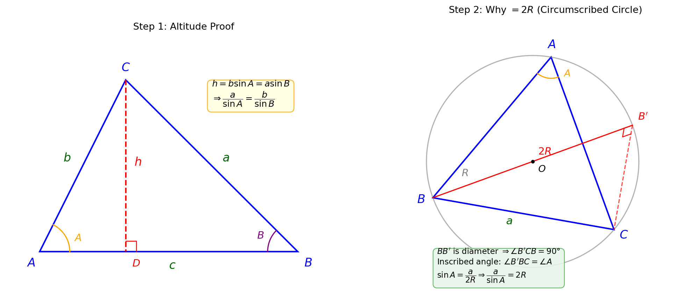
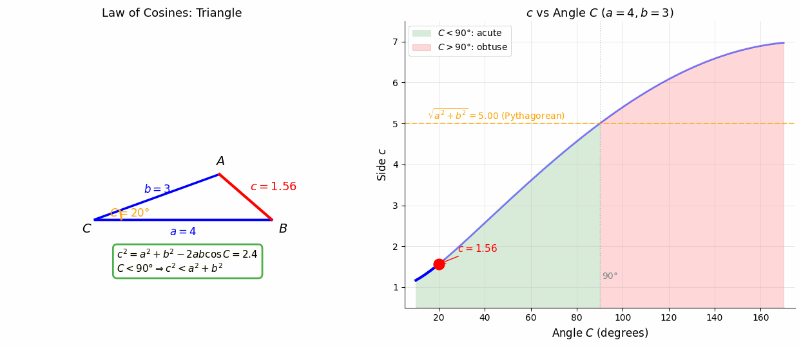
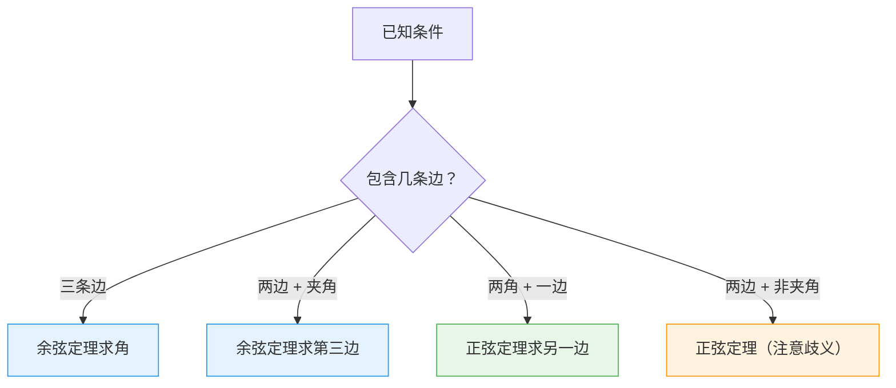

# 正弦定理与余弦定理

> **所属路径**：`00_高中复习/01_数学基础/05_三角函数/04_正弦定理与余弦定理`
> **预计学习时间**：50 分钟
> **难度等级**：⭐⭐

---

## 前置知识

- [弧度与三角比](../01_弧度与三角比/01_弧度与三角比.md) — 正弦、余弦的定义
- [常用恒等变换](../03_常用恒等变换/03_常用恒等变换.md) — 和差角公式和倍角公式

> 如果以上内容还不熟悉，建议先完成对应课程再继续。

---

## 学习目标

完成本节后，你将能够：

1. 陈述正弦定理和余弦定理，并解释它们的几何含义
2. 用正弦定理求三角形的未知边或角
3. 用余弦定理求三角形的未知边或角
4. 判断何时使用正弦定理、何时使用余弦定理

---

## 正文讲解

### 1. 超越直角三角形

在 **[弧度与三角比](../01_弧度与三角比/01_弧度与三角比.md)** 中，我们从直角三角形出发定义了三角比。但现实中的三角形大多不是直角三角形——房屋的屋顶、地面上的测量、卫星定位中的三角定位，都涉及一般三角形。

正弦定理和余弦定理就是把三角函数的力量扩展到**任意三角形**的两个核心工具。

在人工智能中，这两个定理的思想体现在：

- **向量间的角度和距离**：余弦定理是余弦相似度的几何基础
- **三角定位**：机器人和无人机使用三角定理进行定位
- **计算机图形学**：三维渲染中的光照计算依赖三角形的角度和边长关系

### 2. 正弦定理

在任意三角形 $\triangle ABC$ 中，设三条边分别为 $a$ 、 $b$ 、 $c$ ，它们对应的对角分别为 $A$ 、 $B$ 、 $C$ 。 **正弦定理（Law of Sines）** 表述为：

$$
\frac{a}{\sin A} = \frac{b}{\sin B} = \frac{c}{\sin C} = 2R
$$

其中 $R$ 是三角形外接圆的半径。

> **直觉解读**：正弦定理说的是——在一个三角形中，每条边与其对角正弦的比值都相等。**大角对大边，小角对小边**，而且这个"对应关系"通过正弦精确量化。

**推导思路**（以锐角三角形为例）：从顶点 $C$ 向 $AB$ 作高 $h$ ，则：



> 📌 **图解说明**：**左图**——从顶点 $C$ 向边 $AB$ 作高 $CD = h$ ，在直角三角形 $ACD$ 中 $h = b\sin A$ ，在直角三角形 $BCD$ 中 $h = a\sin B$ ，由此得到 $\dfrac{a}{\sin A} = \dfrac{b}{\sin B}$ 。**右图**——将三角形内接于外接圆（半径 $R$ ），从 $B$ 作直径 $BB'$ ，由"直径所对圆周角为直角"得 $\angle B'CB = 90°$ ，由"同弧上的圆周角相等"得 $\angle B'BC = \angle A$ ，因此 $\sin A = \dfrac{a}{2R}$ ，即 $\dfrac{a}{\sin A} = 2R$ 。你可以运行 `code/plot_sine_rule_proof.py` 自行生成这张图。

由左图可知：

$$
h = b\sin A = a\sin B \implies \frac{a}{\sin A} = \frac{b}{\sin B}
$$

类似地，从顶点 $A$ 或 $B$ 作高，可以证明第三组比值也相等。

**为什么等于 $2R$ ？** 右图给出了证明：将 $\triangle ABC$ 内接于外接圆，从 $B$ 作直径 $BB'$ 。由于 $BB'$ 是直径，圆周角 $\angle B'CB = 90°$ ；又由于 $\angle B'BC$ 与 $\angle A$ 是同弧 $BC$ 上的圆周角，故 $\angle B'BC = \angle A$ 。在直角三角形 $B'CB$ 中：

$$
\sin(\angle B'BC) = \sin A = \frac{BC}{BB'} = \frac{a}{2R} \implies \frac{a}{\sin A} = 2R
$$

### 3. 正弦定理的应用场景

正弦定理适合处理以下类型的已知条件：

| 已知 | 未知 | 方法 |
| ---- | ---- | ---- |
| 两角一边（如 $A, B, a$ ） | 另一边 $b$ | $b = a \cdot \dfrac{\sin B}{\sin A}$ |
| 两边一对角（如 $a, b, A$ ） | 另一角 $B$ | $\sin B = \dfrac{b \sin A}{a}$ |

> ⚠️ **注意**：当已知两边一对角时， $\sin B$ 可能有两个解（ $B$ 和 $\pi - B$ ），需要结合三角形的角度和约束来排除不合理的解。这叫做"**正弦定理的歧义情况**"。

### 4. 余弦定理

**余弦定理（Law of Cosines）** 是勾股定理在一般三角形中的推广：

$$
c^2 = a^2 + b^2 - 2ab\cos C
$$

等价形式：

$$
a^2 = b^2 + c^2 - 2bc\cos A
$$

$$
b^2 = a^2 + c^2 - 2ac\cos B
$$

> **直觉解读**：当 $C = 90°$ 时， $\cos 90° = 0$ ，余弦定理退化为 $c^2 = a^2 + b^2$ ——正是 **勾股定理**。多出的 $-2ab\cos C$ 这一项，就是对"不是直角"的修正量：
> - 当 $C < 90°$ 时 $\cos C > 0$ ，修正项为负，所以 $c^2 < a^2 + b^2$ （锐角对边较短）
> - 当 $C > 90°$ 时 $\cos C < 0$ ，修正项为正，所以 $c^2 > a^2 + b^2$ （钝角对边较长）

下面的动画让你直观感受这个"修正"过程——固定两边 $a = 4$ 、 $b = 3$ ，让夹角 $C$ 从 $20°$ 变化到 $160°$ ，观察对边 $c$ 如何变化：



> 📌 **图解说明**：左侧三角形中红色边 $c$ 的长度随夹角 $C$ 变化；右侧曲线显示 $c$ 与 $C$ 的精确函数关系。当 $C = 90°$ 时 $c = 5$ ，恰好是勾股定理（橙色虚线）。你可以运行 `code/animate_cosine_rule.py` 自行生成这个动画。

### 5. 余弦定理的应用场景

余弦定理适合处理以下类型的已知条件：

| 已知 | 未知 | 方法 |
| ---- | ---- | ---- |
| 两边夹角（如 $a, b, C$ ） | 第三边 $c$ | $c = \sqrt{a^2 + b^2 - 2ab\cos C}$ |
| 三边（如 $a, b, c$ ） | 任一角 | $\cos C = \dfrac{a^2 + b^2 - c^2}{2ab}$ |

### 6. 正弦定理 vs 余弦定理：如何选择



> 📌 **图解说明**：根据已知条件选择合适的定理。一般规则是——涉及"边角对应"用正弦定理，涉及"三边关系"用余弦定理。

### 7. 余弦定理与余弦相似度

在 AI 中，**余弦相似度（Cosine Similarity）** 是衡量两个向量方向相似程度的常用指标：

$$
\cos\theta = \frac{\vec{a} \cdot \vec{b}}{|\vec{a}||\vec{b}|}
$$

这实际上就是余弦定理的向量形式！在向量空间中，两个向量 $\vec{a}$ 和 $\vec{b}$ 构成一个三角形，余弦定理告诉我们它们之间的夹角 $\theta$ 与边长（向量长度）的关系。这个概念在 **[向量](../../06_向量/)** 和 **[向量相似度](../../../02_核心原理/05_现代人工智能与大模型/02_嵌入表示/03_向量相似度/)** 中会深入讨论。

---

## 动手实践

```python
# 文件：code/sine_cosine_law.py
# 正弦定理与余弦定理的数值计算
# 环境要求：Python 3.10+（仅使用标准库 math）

import math


def law_of_cosines_side(a: float, b: float, C_deg: float) -> float:
    """余弦定理求第三边：已知两边和夹角"""
    C = math.radians(C_deg)
    return math.sqrt(a**2 + b**2 - 2*a*b*math.cos(C))


def law_of_cosines_angle(a: float, b: float, c: float) -> float:
    """余弦定理求角 C（度数）：已知三边"""
    cos_C = (a**2 + b**2 - c**2) / (2 * a * b)
    return math.degrees(math.acos(cos_C))


def law_of_sines_side(a: float, A_deg: float, B_deg: float) -> float:
    """正弦定理求边 b：已知 a, A, B"""
    A = math.radians(A_deg)
    B = math.radians(B_deg)
    return a * math.sin(B) / math.sin(A)


if __name__ == "__main__":
    # 示例 1：余弦定理 - 两边夹角求第三边
    print("=" * 55)
    print("示例 1：余弦定理求第三边")
    print("  已知：a=5, b=7, C=60°")
    c = law_of_cosines_side(5, 7, 60)
    print(f"  c = {c:.4f}")

    # 示例 2：余弦定理 - 三边求角
    print("\n" + "=" * 55)
    print("示例 2：余弦定理求角")
    print("  已知：a=3, b=4, c=5")
    C = law_of_cosines_angle(3, 4, 5)
    print(f"  C = {C:.1f}°（验证：这是直角三角形！）")

    # 示例 3：正弦定理 - 两角一边求另一边
    print("\n" + "=" * 55)
    print("示例 3：正弦定理求边")
    print("  已知：a=10, A=30°, B=45°")
    b = law_of_sines_side(10, 30, 45)
    print(f"  b = {b:.4f}")

    # 示例 4：余弦相似度
    print("\n" + "=" * 55)
    print("示例 4：余弦相似度（余弦定理的向量版）")
    vec_a = [1, 2, 3]
    vec_b = [4, 5, 6]
    dot_product = sum(x*y for x, y in zip(vec_a, vec_b))
    mag_a = math.sqrt(sum(x**2 for x in vec_a))
    mag_b = math.sqrt(sum(x**2 for x in vec_b))
    cos_sim = dot_product / (mag_a * mag_b)
    angle = math.degrees(math.acos(cos_sim))
    print(f"  向量 a = {vec_a}")
    print(f"  向量 b = {vec_b}")
    print(f"  余弦相似度 = {cos_sim:.4f}")
    print(f"  夹角 = {angle:.1f}°")
```

**运行说明**：
- 环境要求：Python 3.10+（仅使用标准库 `math`）
- 运行命令：`python code/sine_cosine_law.py`

---

## 典型误区

| 误区 | 正确理解 |
| ---- | -------- |
| 余弦定理只能用于求边 | 余弦定理既可以求边（已知两边夹角），也可以求角（已知三边） |
| 正弦定理求角时忘了歧义 | $\sin B = k$ 在 $(0°, 180°)$ 中可能有两个解，需要检查两种情况是否都合理 |
| 认为余弦定理是"新公式" | 余弦定理是勾股定理的推广。当夹角为 $90°$ 时退化为勾股定理 |
| 混淆余弦定理中的边角对应关系 | $c^2 = a^2 + b^2 - 2ab\cos C$ 中 $C$ 是 $c$ 的对角，不是邻角 |

---

## 练习题

### 练习 1：余弦定理求边（难度：⭐）

在 $\triangle ABC$ 中， $a = 6$ ， $b = 8$ ， $C = 60°$ ，求 $c$ 。

<details>
<summary>💡 提示</summary>

直接使用 $c^2 = a^2 + b^2 - 2ab\cos C$ 。

</details>

<details>
<summary>✅ 参考答案</summary>

$$c^2 = 6^2 + 8^2 - 2 \times 6 \times 8 \times \cos 60° = 36 + 64 - 96 \times 0.5 = 52$$$$c = \sqrt{52} = 2\sqrt{13} \approx 7.21$$

</details>

### 练习 2：余弦定理求角（难度：⭐⭐）

已知三角形三边 $a = 7$ ， $b = 8$ ， $c = 13$ 。求最大角。

<details>
<summary>💡 提示</summary>

最长边对最大角。用余弦定理求角 $C$ 。

</details>

<details>
<summary>✅ 参考答案</summary>

最大角是 $c = 13$ 的对角 $C$ ：

$$\cos C = \dfrac{a^2 + b^2 - c^2}{2ab} = \dfrac{49 + 64 - 169}{2 \times 7 \times 8} = \dfrac{-56}{112} = -\dfrac{1}{2}$$

∴ $C = 120°$

</details>

### 练习 3：正弦定理应用（难度：⭐⭐）

在 $\triangle ABC$ 中， $A = 45°$ ， $B = 60°$ ， $a = 10$ 。求 $b$ 和 $c$ 。

<details>
<summary>💡 提示</summary>

先求 $C = 180° - A - B$ ，然后用正弦定理求 $b$ 和 $c$ 。

</details>

<details>
<summary>✅ 参考答案</summary>

$C = 180° - 45° - 60° = 75°$

由正弦定理：

$$b = a \cdot \dfrac{\sin B}{\sin A} = 10 \times \dfrac{\sin 60°}{\sin 45°} = 10 \times \dfrac{\sqrt{3}/2}{\sqrt{2}/2} = 10 \times \dfrac{\sqrt{3}}{\sqrt{2}} = 5\sqrt{6} \approx 12.25$$$$c = a \cdot \dfrac{\sin C}{\sin A} = 10 \times \dfrac{\sin 75°}{\sin 45°} = 10 \times \dfrac{(\sqrt{6}+\sqrt{2})/4}{\sqrt{2}/2} = 10 \times \dfrac{\sqrt{6}+\sqrt{2}}{2\sqrt{2}} \approx 13.66$$

</details>

---

## 下一步学习

- 📖 下一个知识点：[解三角形](../05_解三角形/) — 综合运用正弦定理和余弦定理解决实际问题
- 🔗 相关知识点：[向量](../../06_向量/) — 余弦定理在向量内积中的体现
- 📚 拓展阅读：[向量相似度](../../../02_核心原理/05_现代人工智能与大模型/02_嵌入表示/03_向量相似度/) — 余弦相似度在 AI 中的广泛应用

---

## 参考资料


1. [维基百科：正弦定理](https://zh.wikipedia.org/wiki/正弦定理) — 正弦定理的推导和应用（公共知识库，CC BY-SA 许可）
2. [维基百科：余弦定理](https://zh.wikipedia.org/wiki/余弦定理) — 余弦定理的推导和应用（公共知识库，CC BY-SA 许可）
3. [Khan Academy: Law of cosines](https://www.khanacademy.org/math/precalculus/x9e81a4f98389efdf:trig/x9e81a4f98389efdf:law-of-cosines/v/law-of-cosines-example) — 可汗学院的余弦定理课程（免费公开课程）
