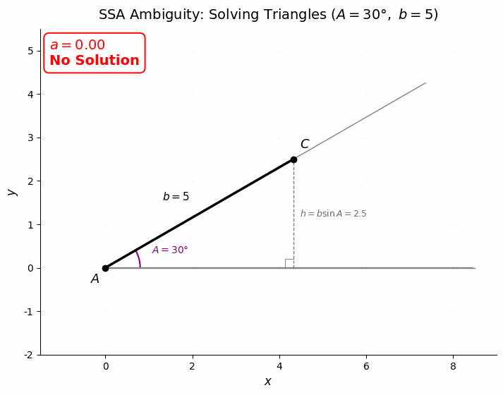

# 解三角形

> **所属路径**：`00_高中复习/01_数学基础/05_三角函数/05_解三角形`
> **预计学习时间**：50 分钟
> **难度等级**：⭐⭐⭐

---

## 前置知识

- [正弦定理与余弦定理](../04_正弦定理与余弦定理/04_正弦定理与余弦定理.md) — 两大定理的公式与用法
- [常用恒等变换](../03_常用恒等变换/03_常用恒等变换.md) — 三角恒等式
- [距离与面积公式](../../07_解析几何/03_距离与面积公式/) — 三角形面积的基本概念

> 如果以上内容还不熟悉，建议先完成对应课程再继续。

---

## 学习目标

完成本节后，你将能够：

1. 根据已知条件判断使用正弦定理还是余弦定理
2. 处理正弦定理的歧义情况（两解、一解或无解）
3. 使用三角形面积公式 $S = \dfrac{1}{2}ab\sin C$ 求面积
4. 综合运用定理解决实际问题，并用 Python 进行验证

---

## 正文讲解

### 1. "解三角形"是什么意思

**解三角形（Solving Triangles）** 是指根据三角形的部分已知元素（边和角），求出所有未知元素的过程。一个三角形有 6 个元素：3 条边 $a, b, c$ 和 3 个角 $A, B, C$ 。通常给出 3 个元素（至少包含一条边），就能确定整个三角形。

在 **[正弦定理与余弦定理](../04_正弦定理与余弦定理/04_正弦定理与余弦定理.md)** 中，我们分别学习了两大定理。现在把它们综合起来，解决完整的"解三角形"问题。

在 AI 领域，"解三角形"的思维方式对应着一种通用的问题解决模式——**已知部分信息，推断完整信息**。无论是从部分特征预测缺失特征、从不完整的传感器数据推断位置，还是从局部观测推断全局状态，核心思路都是"利用约束关系，由已知推未知"。

### 2. 四种基本类型

根据已知条件的不同，解三角形可以分为四种基本类型：

| 类型 | 已知条件 | 首选工具 | 难度 |
| ---- | -------- | -------- | ---- |
| **ASA/AAS** | 两角一边 | 正弦定理 | ⭐ |
| **SAS** | 两边夹角 | 余弦定理 | ⭐ |
| **SSS** | 三条边 | 余弦定理 | ⭐⭐ |
| **SSA** | 两边和非夹角 | 正弦定理（注意歧义） | ⭐⭐⭐ |

### 3. 类型一：两角一边（ASA/AAS）

这是最简单的类型。已知两个角，第三个角就确定了（因为 $A + B + C = 180°$ ），然后用正弦定理求剩余的边。

**例题**：在 $\triangle ABC$ 中， $A = 50°$ ， $B = 70°$ ， $a = 10$ ，求 $b$ 和 $c$ 。

**解**：

$C = 180° - 50° - 70° = 60°$

由正弦定理：

$$
b = a \cdot \frac{\sin B}{\sin A} = 10 \times \frac{\sin 70°}{\sin 50°} \approx 10 \times \frac{0.9397}{0.7660} \approx 12.27
$$

$$
c = a \cdot \frac{\sin C}{\sin A} = 10 \times \frac{\sin 60°}{\sin 50°} \approx 10 \times \frac{0.8660}{0.7660} \approx 11.31
$$

### 4. 类型二：两边夹角（SAS）

已知两边和它们之间的夹角，用余弦定理求第三边，再用正弦定理或余弦定理求剩余角。

**例题**： $a = 8$ ， $b = 6$ ， $C = 75°$ ，求完整三角形。

**解**：

步骤一：余弦定理求 $c$ ：

$$
c^2 = 8^2 + 6^2 - 2 \times 8 \times 6 \times \cos 75° = 64 + 36 - 96 \times 0.2588 \approx 75.16
$$

$$
c \approx 8.67
$$

步骤二：正弦定理求 $A$ ：

$$
\sin A = \frac{a \sin C}{c} = \frac{8 \times \sin 75°}{8.67} \approx \frac{8 \times 0.9659}{8.67} \approx 0.891
$$

$$
A \approx 63.0°
$$

步骤三： $B = 180° - 75° - 63.0° = 42.0°$

### 5. 类型三：三条边（SSS）

已知三条边，用余弦定理逐一求角。

**例题**： $a = 5$ ， $b = 7$ ， $c = 9$ ，求三个角。

**解**：

先求最大角（对最长边）：

$$
\cos C = \frac{a^2 + b^2 - c^2}{2ab} = \frac{25 + 49 - 81}{70} = \frac{-7}{70} = -0.1
$$

$$
C = \arccos(-0.1) \approx 95.7°
$$

再求 $A$ ：

$$
\cos A = \frac{b^2 + c^2 - a^2}{2bc} = \frac{49 + 81 - 25}{126} = \frac{105}{126} \approx 0.833
$$

$$
A \approx 33.6°
$$

$$
B = 180° - 95.7° - 33.6° = 50.7°
$$

### 6. 类型四：两边和非夹角（SSA）——歧义情况

这是最需要小心的类型。已知 $a$ 、 $b$ 和角 $A$ ，用正弦定理求角 $B$ ：

$$
\sin B = \frac{b \sin A}{a}
$$

此时可能出现三种情况：

| $\sin B$ 的值 | 解的个数 | 说明 |
| ------------- | -------- | ---- |
| $\sin B > 1$ | **无解** | 不存在这样的三角形 |
| $\sin B = 1$ | **一解** | $B = 90°$ |
| $0 < \sin B < 1$ | **一解或两解** | $B$ 和 $\pi - B$ 都需要检查 |

> **直觉解读**：想象你有一条固定长度的棍子（边 $b$ ），从一个固定角度 $A$ 的顶点"摆动"它。如果棍子太短，够不到对面——无解。如果刚好够到——一解。如果足够长——可能有两种"搭法"——两解。

下面的动画直观地展示了 SSA 歧义的几何本质——固定角 $A = 30°$ 和边 $b = 5$ ，让边 $a$ 从 0 逐渐增大，观察从 $C$ 作的圆弧如何与底边相交：



> 📌 **图解说明**：蓝色虚线圆弧的半径就是边 $a$ 的长度。当 $a < b\sin A = 2.5$ 时，圆弧够不到底边（无解）；当 $a = 2.5$ 时恰好相切（一解）；当 $2.5 < a < 5$ 时，圆弧与底边有两个交点 $B_1$ 和 $B_2$ （两解）；当 $a \geq 5$ 时只剩一个有效交点（一解）。红色虚线是从 $C$ 向底边的垂线，其长度 $h = b\sin A$ 就是判断解个数的关键阈值。你可以运行 `code/animate_ssa.py` 自行生成这个动画。

### 7. 三角形面积公式

除了求边和角，解三角形还常常需要求面积。最实用的面积公式是：

$$
S = \frac{1}{2}ab\sin C = \frac{1}{2}bc\sin A = \frac{1}{2}ac\sin B
$$

> **直觉解读**：这个公式来自"底 × 高 / 2"。以 $a$ 为底边，高 $h = b\sin C$ ，所以面积 $= \dfrac{1}{2} \times a \times b\sin C$ 。

当三边已知时，还可以使用 **海伦公式（Heron's Formula）**：

> ⚠️ **超纲提示**：海伦公式不属于中国高中课程标准的必修内容，但它非常实用——当你已知三条边长而不知道角度时，可以直接计算面积，无需先求角。公式本身只涉及加减乘除和开方，计算并不复杂。

$$
S = \sqrt{s(s-a)(s-b)(s-c)}, \quad s = \frac{a+b+c}{2}
$$

---

## 动手实践

```python
# 文件：code/solve_triangle.py
# 综合解三角形计算器
# 环境要求：Python 3.10+（仅使用标准库 math）

import math


def solve_AAS(A_deg: float, B_deg: float, a: float) -> dict:
    """两角一边（AAS）：已知 A, B, a"""
    A = math.radians(A_deg)
    B = math.radians(B_deg)
    C_deg = 180 - A_deg - B_deg
    C = math.radians(C_deg)
    b = a * math.sin(B) / math.sin(A)
    c = a * math.sin(C) / math.sin(A)
    area = 0.5 * a * b * math.sin(C)
    return {"A": A_deg, "B": B_deg, "C": C_deg, "a": a, "b": b, "c": c, "area": area}


def solve_SAS(a: float, b: float, C_deg: float) -> dict:
    """两边夹角（SAS）：已知 a, b, C"""
    C = math.radians(C_deg)
    c = math.sqrt(a**2 + b**2 - 2*a*b*math.cos(C))
    cos_A = (b**2 + c**2 - a**2) / (2*b*c)
    A_deg = math.degrees(math.acos(max(-1, min(1, cos_A))))
    B_deg = 180 - A_deg - C_deg
    area = 0.5 * a * b * math.sin(C)
    return {"A": A_deg, "B": B_deg, "C": C_deg, "a": a, "b": b, "c": c, "area": area}


def solve_SSS(a: float, b: float, c: float) -> dict:
    """三边（SSS）：已知 a, b, c"""
    cos_A = (b**2 + c**2 - a**2) / (2*b*c)
    cos_B = (a**2 + c**2 - b**2) / (2*a*c)
    A_deg = math.degrees(math.acos(max(-1, min(1, cos_A))))
    B_deg = math.degrees(math.acos(max(-1, min(1, cos_B))))
    C_deg = 180 - A_deg - B_deg
    # 海伦公式
    s = (a + b + c) / 2
    area = math.sqrt(s * (s-a) * (s-b) * (s-c))
    return {"A": A_deg, "B": B_deg, "C": C_deg, "a": a, "b": b, "c": c, "area": area}


def print_triangle(result: dict, title: str):
    """打印三角形完整信息"""
    print(f"\n{'='*55}")
    print(f"  {title}")
    print(f"{'='*55}")
    print(f"  边：a = {result['a']:.4f}, b = {result['b']:.4f}, c = {result['c']:.4f}")
    print(f"  角：A = {result['A']:.2f}°, B = {result['B']:.2f}°, C = {result['C']:.2f}°")
    print(f"  面积 S = {result['area']:.4f}")
    print(f"  验证：A + B + C = {result['A'] + result['B'] + result['C']:.2f}°")


if __name__ == "__main__":
    # 类型 1：AAS
    r1 = solve_AAS(50, 70, 10)
    print_triangle(r1, "类型 1（AAS）：A=50°, B=70°, a=10")

    # 类型 2：SAS
    r2 = solve_SAS(8, 6, 75)
    print_triangle(r2, "类型 2（SAS）：a=8, b=6, C=75°")

    # 类型 3：SSS
    r3 = solve_SSS(5, 7, 9)
    print_triangle(r3, "类型 3（SSS）：a=5, b=7, c=9")

    # 类型 3：特殊三角形
    r4 = solve_SSS(3, 4, 5)
    print_triangle(r4, "类型 3（SSS）：a=3, b=4, c=5（直角三角形）")
```

**运行说明**：
- 环境要求：Python 3.10+（仅使用标准库 `math`）
- 运行命令：`python code/solve_triangle.py`

---

## 典型误区

| 误区 | 正确理解 |
| ---- | -------- |
| SSA 情况下忽略两解可能 | 当 $\sin B < 1$ 时， $B$ 可能有两个解（$B$ 和 $180° - B$），都需要检查 |
| 面积公式中使用角度而不是正弦值 | $S = \dfrac{1}{2}ab\sin C$ 中的 $C$ 是两边 $a$ 和 $b$ 的**夹角**，不是其他角 |
| 不检查三角形是否合法 | 三角形的三边必须满足三角不等式 $a + b > c$ ；三角必须满足 $A + B + C = 180°$ |
| 求完角后不做验证 | 解完三角形后应验证 $A + B + C = 180°$ 和余弦定理等，排除计算错误 |

---

## 练习题

### 练习 1：综合解题（难度：⭐⭐）

在 $\triangle ABC$ 中， $a = 10$ ， $B = 45°$ ， $C = 75°$ 。

1. 求 $A$
2. 求 $b$ 和 $c$
3. 求三角形面积 $S$

<details>
<summary>💡 提示</summary>

$A = 180° - B - C$ ，然后用正弦定理求边，最后用面积公式 $S = \dfrac{1}{2}bc\sin A$ 。

</details>

<details>
<summary>✅ 参考答案</summary>

1. $A = 180° - 45° - 75° = 60°$

2. 由正弦定理：

$$b = a \cdot \dfrac{\sin B}{\sin A} = 10 \times \dfrac{\sin 45°}{\sin 60°} = 10 \times \dfrac{\sqrt{2}/2}{\sqrt{3}/2} = \dfrac{10\sqrt{2}}{\sqrt{3}} = \dfrac{10\sqrt{6}}{3} \approx 8.16$$$$c = a \cdot \dfrac{\sin C}{\sin A} = 10 \times \dfrac{\sin 75°}{\sin 60°} \approx 10 \times \dfrac{0.9659}{0.8660} \approx 11.15$$

3. $S = \dfrac{1}{2}bc\sin A = \dfrac{1}{2} \times 8.16 \times 11.15 \times \sin 60° \approx 39.4$

</details>

### 练习 2：歧义情况（难度：⭐⭐⭐）

在 $\triangle ABC$ 中， $a = 4$ ， $b = 6$ ， $A = 30°$ 。这种情况有几个解？

<details>
<summary>💡 提示</summary>

用正弦定理计算 $\sin B$ ，检查是否在 $[0, 1]$ 范围内，然后检查两个可能的 $B$ 值是否都能构成合法三角形。

</details>

<details>
<summary>✅ 参考答案</summary>

$$\sin B = \dfrac{b \sin A}{a} = \dfrac{6 \times \sin 30°}{4} = \dfrac{6 \times 0.5}{4} = 0.75$$

$B_1 = \arcsin(0.75) \approx 48.6°$ ，此时 $C_1 = 180° - 30° - 48.6° = 101.4° > 0°$ ✓

$B_2 = 180° - 48.6° = 131.4°$ ，此时 $C_2 = 180° - 30° - 131.4° = 18.6° > 0°$ ✓

两种情况角度之和都不超过 $180°$ ，所以**有两个解**。

</details>

### 练习 3：面积与海伦公式（难度：⭐⭐）

用两种方法计算 $a = 13$ ， $b = 14$ ， $c = 15$ 的三角形面积：

1. 先用余弦定理求一个角，再用 $S = \dfrac{1}{2}ab\sin C$
2. 直接用海伦公式

验证两种方法结果一致。

<details>
<summary>💡 提示</summary>

海伦公式： $s = \dfrac{a+b+c}{2}$ ， $S = \sqrt{s(s-a)(s-b)(s-c)}$ 。

</details>

<details>
<summary>✅ 参考答案</summary>

**方法一**：

$$\cos C = \dfrac{13^2 + 14^2 - 15^2}{2 \times 13 \times 14} = \dfrac{169 + 196 - 225}{364} = \dfrac{140}{364} = \dfrac{5}{13}$$$$\sin C = \sqrt{1 - (5/13)^2} = \sqrt{1 - 25/169} = \sqrt{144/169} = \dfrac{12}{13}$$$$S = \dfrac{1}{2} \times 13 \times 14 \times \dfrac{12}{13} = 84$$**方法二**（海伦公式）：$$s = \dfrac{13 + 14 + 15}{2} = 21$$$$S = \sqrt{21 \times 8 \times 7 \times 6} = \sqrt{7056} = 84$$

两种方法结果一致： $S = 84$ ✓

</details>

---

## 下一步学习

- 📖 下一个知识主题：[向量](../../06_向量/) — 向量运算与三角函数的深层联系
- 🔗 相关知识点：[解析几何](../../07_解析几何/) — 用坐标方法处理几何问题
- 📚 拓展阅读：[范数与距离](../../../01_基础能力/02_数学基础/01_线性代数/03_范数与距离/) — 向量距离与余弦定理的推广

---

## 参考资料


1. [维基百科：三角形](https://zh.wikipedia.org/wiki/三角形) — 三角形的性质、面积公式和解法（公共知识库，CC BY-SA 许可）
2. [维基百科：海伦公式](https://zh.wikipedia.org/wiki/海伦公式) — 海伦公式的推导与应用（公共知识库，CC BY-SA 许可）
3. [Khan Academy: Solving triangles](https://www.khanacademy.org/math/trigonometry/trig-with-general-triangles) — 可汗学院的解三角形课程（免费公开课程）
