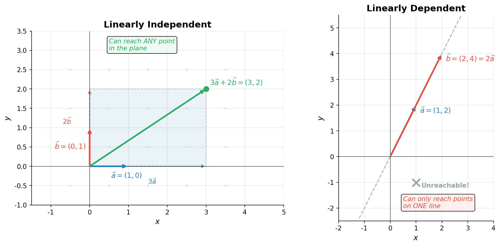

# 线性组合与线性相关初步

> **所属路径**：`00_高中复习/01_数学基础/06_向量/04_线性组合与线性相关初步`
> **预计学习时间**：40 分钟
> **难度等级**：⭐⭐

---

## 前置知识

- [向量表示与运算](../01_向量表示与运算/01_向量表示与运算.md)——需要掌握向量的加法和数乘
- [向量坐标化](../03_向量坐标化/03_向量坐标化.md)——需要掌握向量的坐标表示和基底概念
- [方程组与代数变形](../../../01_数学基础/01_代数与方程/03_方程组与代数变形/)——需要会解二元一次方程组

> 如果以上内容还不熟悉，建议先完成对应课程再继续。

---

## 学习目标

完成本节后，你将能够：

1. 理解线性组合的概念，判断一个向量能否由其他向量线性表示
2. 区分线性相关与线性无关的含义，用几何直觉解释其差异
3. 运用行列式判别法快速判断二维向量组的线性相关性
4. 感受线性组合与线性相关在人工智能中的基础地位

---

## 正文讲解

> ⚠️ **超纲提示**：线性组合与线性相关是大学线性代数的核心概念，中国高中课程标准不作要求。但在高中数学中，你其实已经接触过它们的特殊情况——"向量共线"就是二维线性相关的直观表现。我们在这里以高中知识为基础，用直觉和几何方式引入这些概念，为后续学习人工智能中无处不在的线性代数打下桥梁。

### 1. 一个自然的问题——向量能被"拼出来"吗？

在前面的课程中，我们学会了向量的加法和数乘。现在来思考一个有趣的问题：给你两个向量 $\vec{a}$ 和 $\vec{b}$ ，你能通过对它们进行加法和数乘的组合，"拼"出平面上的任何向量吗？

比如说，给你 $\vec{a} = (1, 0)$ 和 $\vec{b} = (0, 1)$ ，你能拼出 $(3, 5)$ 吗？当然可以：

$$
(3, 5) = 3 \times (1, 0) + 5 \times (0, 1) = 3\vec{a} + 5\vec{b}
$$

事实上，用这两个向量你可以拼出平面上的 **任何** 向量。但如果给你的是 $\vec{a} = (1, 2)$ 和 $\vec{b} = (2, 4)$ 呢？你会发现，无论怎么组合，你只能得到 $(1, 2)$ 方向上的向量——因为 $\vec{b}$ 本身就是 $\vec{a}$ 的 2 倍，提供不了任何"新方向"。

这个问题的核心就是：**线性组合**和**线性相关性**。

### 2. 线性组合——向量的"配方"

**线性组合（Linear Combination）** 是一个简单但极其重要的概念。给定一组向量 $\vec{v}_1, \vec{v}_2, \ldots, \vec{v}_n$ 和一组实数 $c_1, c_2, \ldots, c_n$ ，表达式：

$$
c_1 \vec{v}_1 + c_2 \vec{v}_2 + \cdots + c_n \vec{v}_n
$$

就叫做这组向量的一个线性组合。其中 $c_1, c_2, \ldots, c_n$ 叫做 **系数（Coefficients）** 。

你可以把线性组合想象成一个"配方"：每个向量是一种"原料"，系数是每种原料的"用量"，最终得到的向量是"成品"。

如果一个向量 $\vec{w}$ 可以表示为向量组 $\vec{v}_1, \vec{v}_2, \ldots, \vec{v}_n$ 的线性组合，我们就说 $\vec{w}$ 可以被这组向量 **线性表示（Linearly Represented）** 。

例如在二维平面中，对于 $\vec{a} = (1, 0)$ 和 $\vec{b} = (0, 1)$ ：

$$
(3, -2) = 3\vec{a} + (-2)\vec{b}
$$

所以 $(3, -2)$ 可以被 $\{\vec{a}, \vec{b}\}$ 线性表示。

### 3. 线性相关与线性无关——向量之间的"冗余"关系

现在我们从另一个角度思考：如果一组向量中，某一个可以由其他向量线性表示，那这个向量就是"多余的"——它没有带来新的信息。

**线性相关（Linearly Dependent）** 的定义：一组向量 $\vec{v}_1, \vec{v}_2, \ldots, \vec{v}_n$ 是线性相关的，如果存在一组 **不全为零** 的系数 $c_1, c_2, \ldots, c_n$ ，使得：

$$
c_1 \vec{v}_1 + c_2 \vec{v}_2 + \cdots + c_n \vec{v}_n = \vec{0}
$$

**线性无关（Linearly Independent）** ：如果上式只有在 $c_1 = c_2 = \cdots = c_n = 0$ 时才成立，那么这组向量就是线性无关的。

> **直觉解读**：线性相关意味着"向量之间有冗余"——某个向量可以被其他向量拼出来。线性无关意味着"每个向量都带来了独立的新方向"——谁也不能被其他人代替。

在二维平面中，这变得非常直观：

- **两个向量线性相关** ⟺ 它们共线（平行）
- **两个向量线性无关** ⟺ 它们不共线（指向不同的方向）

想一想：如果两个向量 $\vec{a}$ 和 $\vec{b}$ 不共线，那么通过调整系数 $c_1$ 和 $c_2$ ，线性组合 $c_1\vec{a} + c_2\vec{b}$ 可以到达平面上的任何一个点。这就是为什么二维空间需要且仅需要两个线性无关的向量作为基底。

下面这张图直观地展示了线性无关与线性相关的区别：



> 📌 **图解说明**：左图中 $\vec{a} = (1,0)$ 和 $\vec{b} = (0,1)$ 线性无关，通过线性组合可以到达平面上的任意点（如 $3\vec{a} + 2\vec{b} = (3,2)$ ）；右图中 $\vec{a} = (1,2)$ 和 $\vec{b} = (2,4)$ 线性相关（共线），线性组合只能覆盖一条直线。你可以运行 `code/plot_linear_combination.py` 自行生成这张图。

### 4. 行列式判别法——快速判断线性相关性

> ⚠️ **超纲提示**：行列式是大学线性代数的概念，中国高中课程标准不作要求。这里我们只用到最简单的 2×2 行列式——本质上就是"交叉相乘再相减"，非常容易理解。我们之所以提前介绍它，是因为这个公式在后续的向量面积计算、解析几何以及线性代数中反复出现。

对于二维向量 $\vec{a} = (a_1, a_2)$ 和 $\vec{b} = (b_1, b_2)$ ，有一个非常便捷的判别方法。计算以下值：

$$
D = a_1 b_2 - a_2 b_1
$$

这个值叫做两个向量构成的 **行列式（Determinant）** ，记作：

$$
D = \begin{vmatrix} a_1 & b_1 \\ a_2 & b_2 \end{vmatrix} = a_1 b_2 - a_2 b_1
$$

判定规则非常简单：

- $D \neq 0$ ⟹ $\vec{a}$ 和 $\vec{b}$ **线性无关**（不共线）
- $D = 0$ ⟹ $\vec{a}$ 和 $\vec{b}$ **线性相关**（共线）

> **直觉解读**：行列式的绝对值 $|D|$ 等于以 $\vec{a}$ 和 $\vec{b}$ 为邻边的平行四边形的面积。如果两个向量共线，平行四边形就"退化"为一条线段，面积为零。

来看一个例子。判断 $\vec{a} = (3, 1)$ 和 $\vec{b} = (6, 2)$ 是否线性相关：

$$
D = 3 \times 2 - 1 \times 6 = 6 - 6 = 0
$$

∵ $D = 0$

∴ $\vec{a}$ 和 $\vec{b}$ 线性相关。

确实如此，因为 $\vec{b} = 2\vec{a}$ 。

再看 $\vec{a} = (1, 2)$ 和 $\vec{b} = (3, 1)$ ：

$$
D = 1 \times 1 - 2 \times 3 = 1 - 6 = -5 \neq 0
$$

∵ $D \neq 0$

∴ $\vec{a}$ 和 $\vec{b}$ 线性无关，可以作为平面的一组基底。

### 5. 线性组合与 AI 的深层联系

线性组合可能是整个人工智能数学体系中出现频率最高的概念。以下场景都是线性组合的应用：

- **神经网络的每一层**：输出 = 权重矩阵 × 输入 + 偏置。其中"权重矩阵 × 输入"本质上就是对输入向量各分量做线性组合
- **注意力机制**：在 Transformer 中，每个词的新表示是所有词向量的加权（线性）组合，权重由注意力分数决定
- **嵌入向量**：词嵌入空间中，"king − man + woman ≈ queen"就是一种向量的线性组合

线性无关的概念则直接关系到数据的"信息量"。如果一组特征（向量）线性相关，说明其中有冗余信息，可以通过降维来去除——这正是主成分分析（PCA）的核心思想。

---

## 动手实践

让我们用 Python 来判断线性相关性并求解线性组合的系数：

```python
# 文件：code/linear_combination.py
# 演示线性组合和线性相关性判定
# 环境要求：Python 3.10+, numpy

import numpy as np

# ---- 示例 1：判断线性相关性 ----
a = np.array([3, 1])
b = np.array([6, 2])
det_ab = a[0] * b[1] - a[1] * b[0]
print(f"a = {a}, b = {b}")
print(f"行列式 D = {det_ab}")
print(f"线性相关？{'是' if det_ab == 0 else '否'}\n")

# ---- 示例 2：线性无关的向量 ----
c = np.array([1, 2])
d = np.array([3, 1])
det_cd = c[0] * d[1] - c[1] * d[0]
print(f"c = {c}, d = {d}")
print(f"行列式 D = {det_cd}")
print(f"线性相关？{'是' if det_cd == 0 else '否'}\n")

# ---- 示例 3：求线性组合系数 ----
# 用 c 和 d 表示向量 w = (7, 8)
# 即 x*c + y*d = w，解方程组
w = np.array([7, 8])
# 构建系数矩阵并求解
A = np.column_stack([c, d])  # [[1, 3], [2, 1]]
coefficients = np.linalg.solve(A, w)
print(f"将 w = {w} 表示为 c 和 d 的线性组合:")
print(f"系数: x = {coefficients[0]:.2f}, y = {coefficients[1]:.2f}")
print(f"验证: {coefficients[0]:.2f} * {c} + {coefficients[1]:.2f} * {d} = "
      f"{coefficients[0] * c + coefficients[1] * d}")
```

**运行说明**：
- 环境要求：Python 3.10+, numpy
- 运行命令：`python code/linear_combination.py`

**预期输出**：
```
a = [3 1], b = [6 2]
行列式 D = 0
线性相关？是

c = [1 2], d = [3 1]
行列式 D = -5
线性相关？否

将 w = [7 8] 表示为 c 和 d 的线性组合:
系数: x = -2.60, y = 3.20
验证: -2.60 * [1 2] + 3.20 * [3 1] = [7. 8.]
```

代码展示了行列式为 0 时向量线性相关（如 $\vec{a}$ 和 $\vec{b}$ ），行列式不为 0 时可以用 `np.linalg.solve` 求出线性组合的系数。

---

## 典型误区

| 误区 | 正确理解 |
| --- | --- |
| 线性相关就是两个向量相等 | 线性相关只要求共线（平行），方向可以相反，长度也可以不同 |
| 三个二维向量一定线性相关 | 正确！二维空间最多容纳 2 个线性无关的向量，第三个必然可以被前两个表示 |
| 行列式为负说明向量线性相关 | 行列式为负只说明两个向量的相对朝向是"顺时针"，不影响线性无关性。只有行列式等于零才说明线性相关 |
| 零向量与任何向量线性无关 | 恰好相反，零向量与任何向量都是线性相关的，因为 $1 \cdot \vec{0} + 0 \cdot \vec{a} = \vec{0}$ 已有不全为零的系数 |

---

## 练习题

### 练习 1：判断线性相关性（难度：⭐）

判断以下各组向量是否线性相关，并说明理由：
- (a) $\vec{a} = (4, -2)$ ， $\vec{b} = (-6, 3)$
- (b) $\vec{a} = (1, 3)$ ， $\vec{b} = (2, -1)$

<details>
<summary>💡 提示</summary>

计算行列式 $D = a_1 b_2 - a_2 b_1$ ，判断是否为零。

</details>

<details>
<summary>✅ 参考答案</summary>

(a) $D = 4 \times 3 - (-2) \times (-6) = 12 - 12 = 0$ ，线性相关。

(b) $D = 1 \times (-1) - 3 \times 2 = -1 - 6 = -7 \neq 0$ ，线性无关。

</details>

### 练习 2：求线性组合系数（难度：⭐⭐）

已知 $\vec{e}_1 = (1, 1)$ ， $\vec{e}_2 = (1, -1)$ ，将 $\vec{w} = (5, 1)$ 表示为 $\vec{e}_1$ 和 $\vec{e}_2$ 的线性组合。

<details>
<summary>💡 提示</summary>

设 $\vec{w} = x \vec{e}_1 + y \vec{e}_2$ ，写出方程组并求解。

</details>

<details>
<summary>✅ 参考答案</summary>

设 $(5, 1) = x(1, 1) + y(1, -1) = (x + y,\ x - y)$

列方程组：

$x + y = 5$

$x - y = 1$

两式相加得 $2x = 6$ ，所以 $x = 3$ ， $y = 2$

∴ $\vec{w} = 3\vec{e}_1 + 2\vec{e}_2$

验证： $3(1, 1) + 2(1, -1) = (3, 3) + (2, -2) = (5, 1)$ ✓

</details>

### 练习 3：行列式与面积（难度：⭐⭐）

已知 $\vec{a} = (3, 1)$ ， $\vec{b} = (1, 4)$ 。计算以 $\vec{a}$ 和 $\vec{b}$ 为邻边的平行四边形的面积。

<details>
<summary>💡 提示</summary>

平行四边形面积等于行列式的绝对值 $|a_1 b_2 - a_2 b_1|$ 。

</details>

<details>
<summary>✅ 参考答案</summary>

$$D = 3 \times 4 - 1 \times 1 = 12 - 1 = 11$$

面积 $= |D| = 11$

</details>

---

## 下一步学习

- 📖 下一个知识点：[向量应用与几何](../05_向量应用与几何/05_向量应用与几何.md)——用向量方法解决经典几何问题
- 🔗 相关知识点：[代数与方程](../../../01_数学基础/01_代数与方程/)——方程组求解是线性组合计算的基础
- 📚 拓展阅读：[线性代数](../../../../01_基础能力/02_数学基础/01_线性代数/)——线性相关性是线性代数的核心主题

---

## 参考资料

1. [3Blue1Brown - Linear combinations, span, and basis vectors](https://www.youtube.com/watch?v=k7RM-ot2NWY) — 用动画解释线性组合与张成空间（公开视频）
2. [Khan Academy - Linear independence](https://www.khanacademy.org/math/linear-algebra/vectors-and-spaces/linear-independence/v/linear-algebra-introduction-to-linear-independence) — 线性无关的直观讲解与练习（免费公开课程）
3. [Wikipedia - Linear combination](https://en.wikipedia.org/wiki/Linear_combination) — 线性组合的严格定义与推广（公共知识库）
