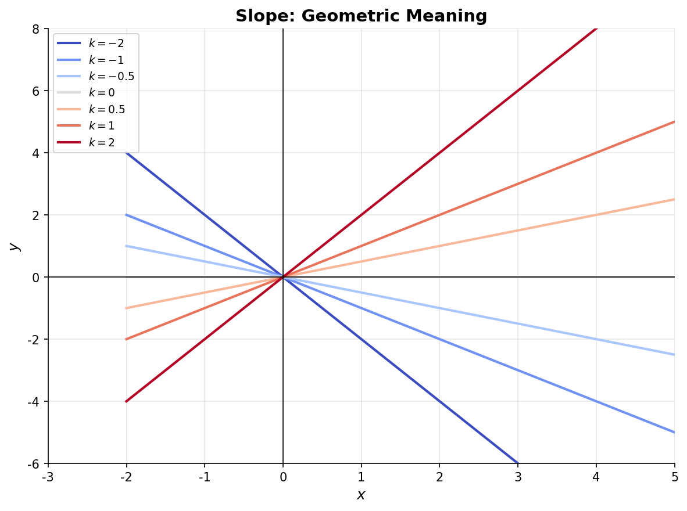
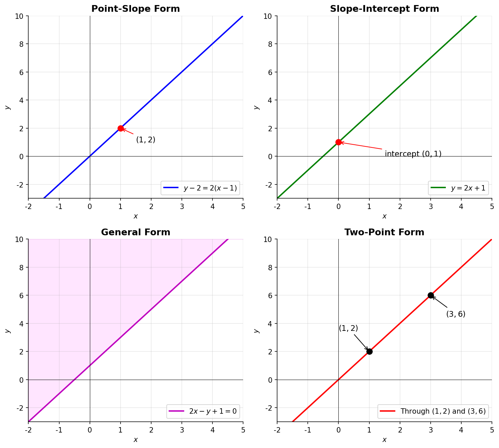
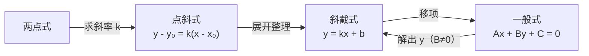

# 直线方程

> **所属路径**：`00_高中复习/01_数学基础/07_解析几何/01_直线方程`
> **预计学习时间**：40 分钟
> **难度等级**：⭐

---

## 前置知识

- [代数与方程](../../01_代数与方程/)
- [函数与图像](../../02_函数与图像/)
- [向量表示与运算](../../06_向量/01_向量表示与运算/)

> 如果以上内容还不熟悉，建议先完成对应课程再继续。

---

## 学习目标

完成本节后，你将能够：

1. 理解斜率的几何含义，并能计算两点间的斜率
2. 熟练运用点斜式、斜截式、两点式和一般式四种直线方程形式
3. 在不同形式之间灵活转换
4. 用 Python 绘制和验证直线方程

---

## 正文讲解

### 1. 从地图导航到直线方程

假设你在一张城市地图上标记了两个地点——学校 $A$ 和图书馆 $B$ 。如果有人问你"从 $A$ 到 $B$ 怎么走"，你可能会说"向东走 3 个街区，再向北走 2 个街区"。这其实就是在用坐标描述位置和方向。

解析几何的核心思想就是这样的：**把几何图形放到坐标系里，用方程来描述它们**。直线是最简单的几何图形，所以我们从它开始。

在人工智能中，直线方程的重要性远超你的想象。当机器学习算法试图把不同类别的数据分开时，最基本的分类器（如感知机、逻辑回归）寻找的就是一条直线（在更高维空间中是"超平面"）。理解直线方程，就是理解 AI 分类的起点。

### 2. 斜率——直线的"性格"

在坐标平面上，一条直线最鲜明的特征就是它的倾斜程度，数学上用 **斜率（Slope）** 来刻画。

给定直线上两个不同的点 $P_1(x_1, y_1)$ 和 $P_2(x_2, y_2)$ ，斜率 $k$ 的定义为：

$$
k = \frac{y_2 - y_1}{x_2 - x_1} \quad (x_1 \neq x_2)
$$

> **直觉解读**：斜率就是"纵向变化量与横向变化量的比"。 $k > 0$ 时直线向右上方倾斜， $k < 0$ 时向右下方倾斜， $k = 0$ 时直线水平。

下面这张图展示了不同斜率对直线倾斜方向的影响：



> 📌 **图解说明**：图中 7 条过原点的直线分别对应斜率 $k = -2, -1, -0.5, 0, 0.5, 1, 2$ 。可以清楚地看到，斜率的绝对值越大，直线越陡；斜率为正时向右上倾斜，为负时向右下倾斜。你可以运行 `code/plot_lines.py` 自行生成这张图。

⚠️ 注意：当直线垂直于 $x$ 轴时（如 $x = 3$ ），斜率不存在，因为分母 $x_2 - x_1 = 0$ 。这类直线需要用一般式来表示。

### 3. 四种直线方程形式

根据已知条件的不同，直线方程有四种常用形式。它们本质上描述的是同一条直线，只是"入口"不同。

#### 点斜式

已知直线过点 $P_0(x_0, y_0)$ ，斜率为 $k$ ，则方程为：

$$
y - y_0 = k(x - x_0)
$$

> **直觉解读**：这个公式在说"直线上任意一点 $(x, y)$ 与已知点 $P_0$ 之间的斜率等于 $k$ "。

**例题**：过点 $(1, 2)$ ，斜率为 $3$ 的直线方程是什么？

代入得 $y - 2 = 3(x - 1)$ ，即 $y = 3x - 1$ 。

#### 斜截式

当已知斜率 $k$ 和 $y$ 轴截距 $b$ （直线与 $y$ 轴的交点纵坐标）时：

$$
y = kx + b
$$

> **直觉解读**：这是最"直白"的形式—— $k$ 决定倾斜方向， $b$ 决定上下位置。在机器学习中，线性模型 $y = wx + b$ 正是这个形式，其中 $w$ 是权重（对应斜率）， $b$ 是偏置。

#### 两点式

已知直线过两点 $P_1(x_1, y_1)$ 和 $P_2(x_2, y_2)$ ：

$$
\frac{y - y_1}{y_2 - y_1} = \frac{x - x_1}{x_2 - x_1}
$$

> **直觉解读**：这个等式说的是"点 $(x, y)$ 到 $P_1$ 的比例关系，在 $x$ 和 $y$ 方向上是一致的"。

#### 一般式

所有直线（包括斜率不存在的垂直线）都可以写成：

$$
Ax + By + C = 0 \quad (A, B \text{ 不同时为零})
$$

> **直觉解读**：一般式是最"万能"的形式。其中 $A, B$ 构成直线的 **[法向量（Normal Vector）](../../06_向量/01_向量表示与运算/)** $(A, B)$ ，它垂直于直线方向。这个概念在 AI 中极其重要——支持向量机（SVM）寻找的最优分类边界，就是通过法向量来定义的。

下面这张图对比了四种直线方程形式的图像效果：



> 📌 **图解说明**：四个子图分别展示了点斜式、斜截式、一般式和两点式表示的直线。虽然表示形式不同，但同一条直线的图像完全一致。你可以运行 `code/plot_lines.py` 自行生成这张图。

### 4. 形式之间的转换

四种形式之间可以自由转换，转换的关键是提取斜率 $k$ 和关键点的信息：



> 📌 **图解说明**：四种形式的转换路径。一般式是"万能终点"，任何形式都可以化为一般式；反过来，一般式也可以提取出斜率和截距。

从一般式 $Ax + By + C = 0$ 提取信息：
- 斜率 $k = -\dfrac{A}{B}$ （ $B \neq 0$ 时）
- $y$ 轴截距 $b = -\dfrac{C}{B}$
- $x$ 轴截距 $= -\dfrac{C}{A}$

### 5. 两直线的位置关系

给定两条直线 $l_1: y = k_1 x + b_1$ 和 $l_2: y = k_2 x + b_2$ ：

| 位置关系 | 条件 |
| -------- | ---- |
| 平行 | $k_1 = k_2$ 且 $b_1 \neq b_2$ |
| 重合 | $k_1 = k_2$ 且 $b_1 = b_2$ |
| 相交 | $k_1 \neq k_2$ |
| 垂直 | $k_1 \cdot k_2 = -1$ |

垂直条件 $k_1 \cdot k_2 = -1$ 在 AI 中经常出现——例如主成分分析（PCA）要求各主成分方向互相垂直，正交基是线性代数中的核心概念。

---

## 动手实践

学了这么多公式，我们来用 Python 验证一下。下面的代码展示了如何计算斜率，并在不同形式之间转换。

```python
# 文件：code/line_demo.py
# 演示直线方程的计算与转换
# 环境：Python 3.10+

def slope(x1, y1, x2, y2):
    """计算两点间的斜率"""
    if x2 == x1:
        return None  # 斜率不存在
    return (y2 - y1) / (x2 - x1)

def point_slope_to_general(x0, y0, k):
    """点斜式 → 一般式 Ax + By + C = 0"""
    # y - y0 = k(x - x0) => kx - y + (y0 - k*x0) = 0
    A = k
    B = -1
    C = y0 - k * x0
    return A, B, C

def general_to_slope_intercept(A, B, C):
    """一般式 → 斜截式 y = kx + b"""
    if B == 0:
        return None, None  # 垂直线，无斜截式
    k = -A / B
    b = -C / B
    return k, b

# 示例：过 (1, 2)，斜率 k=3
k = slope(1, 2, 2, 5)
print(f"两点 (1,2) 和 (2,5) 的斜率: k = {k}")

A, B, C = point_slope_to_general(1, 2, 3)
print(f"点斜式 → 一般式: {A}x + ({B})y + ({C}) = 0")

k_out, b_out = general_to_slope_intercept(A, B, C)
print(f"一般式 → 斜截式: y = {k_out}x + ({b_out})")

# 验证两直线垂直
k1, k2 = 2, -0.5
print(f"\nk1={k1}, k2={k2}, 乘积={k1*k2}, 垂直: {k1*k2 == -1}")
```

**运行说明**：
- 环境要求：Python 3.10+
- 运行命令：`python code/line_demo.py`

**预期输出**：
```
两点 (1,2) 和 (2,5) 的斜率: k = 3.0
点斜式 → 一般式: 3x + (-1)y + (-1) = 0
一般式 → 斜截式: y = 3.0x + (1.0)
k1=2, k2=-0.5, 乘积=-1.0, 垂直: True
```

从输出可以看到，过点 $(1, 2)$ 斜率为 $3$ 的直线的一般式是 $3x - y - 1 = 0$ ，转回斜截式就是 $y = 3x + 1$ ——和手算结果完全一致！同时验证了斜率乘积为 $-1$ 时两直线垂直。

---

## 典型误区

| 误区 | 正确理解 |
| ---- | -------- |
| "斜率为 0 就是没有斜率" | 斜率为 $0$ 表示水平线（如 $y = 3$ ），"没有斜率"指的是垂直线（如 $x = 2$ ） |
| "一般式中 $A$ 必须为正" | $A, B, C$ 没有符号限制，只要求 $A, B$ 不同时为零 |
| "两点式可以表示所有直线" | 两点式要求 $x_1 \neq x_2$ 且 $y_1 \neq y_2$ ，垂直线和水平线需要特殊处理 |
| "平行线斜率相同就是同一条线" | 斜率相同还需截距不同才是平行；截距也相同则是重合 |

---

## 练习题

### 练习 1：求直线方程（难度：⭐）

过点 $(2, -1)$ ，斜率为 $-3$ ，分别写出点斜式、斜截式和一般式。

<details>
<summary>💡 提示</summary>

先代入点斜式公式，再逐步展开为其他形式。

</details>

<details>
<summary>✅ 参考答案</summary>

点斜式： $y - (-1) = -3(x - 2)$ ，即 $y + 1 = -3(x - 2)$

斜截式：展开得 $y = -3x + 6 - 1 = -3x + 5$

一般式：移项得 $3x + y - 5 = 0$

</details>

### 练习 2：判断位置关系（难度：⭐）

判断直线 $l_1: 2x - 3y + 1 = 0$ 和 $l_2: 4x - 6y - 5 = 0$ 的位置关系。

<details>
<summary>💡 提示</summary>

将两条直线都化为斜截式，比较斜率和截距。

</details>

<details>
<summary>✅ 参考答案</summary>

$l_1$ 的斜率 $k_1 = \dfrac{2}{3}$ ，截距 $b_1 = \dfrac{1}{3}$

$l_2$ 的斜率 $k_2 = \dfrac{4}{6} = \dfrac{2}{3}$ ，截距 $b_2 = -\dfrac{5}{6}$

∵ $k_1 = k_2$ 且 $b_1 \neq b_2$

∴ $l_1 \parallel l_2$ （平行）

</details>

### 练习 3：求垂直线方程（难度：⭐⭐）

直线 $l_1: y = 2x + 3$ ，求过点 $(1, 4)$ 且与 $l_1$ 垂直的直线方程。

<details>
<summary>💡 提示</summary>

利用垂直条件 $k_1 \cdot k_2 = -1$ 求出新直线斜率，再用点斜式。

</details>

<details>
<summary>✅ 参考答案</summary>

$l_1$ 的斜率 $k_1 = 2$ ，由垂直条件得 $k_2 = -\dfrac{1}{2}$

代入点斜式： $y - 4 = -\dfrac{1}{2}(x - 1)$

整理得 $y = -\dfrac{1}{2}x + \dfrac{9}{2}$ ，一般式为 $x + 2y - 9 = 0$

</details>

---

## 下一步学习

- 📖 下一个知识点：[圆与二次曲线](../02_圆与二次曲线/02_圆与二次曲线.md)
- 🔗 相关知识点：[距离与面积公式](../03_距离与面积公式/03_距离与面积公式.md)
- 🔗 前置回顾：[向量坐标化](../../06_向量/03_向量坐标化/)

---

## 参考资料

1. [Khan Academy — Linear Equations](https://www.khanacademy.org/math/algebra/x2f8bb11595b61c86:forms-of-linear-equations) — 互动教程，涵盖直线方程各种形式（公开课程）
2. [3Blue1Brown — Essence of Linear Algebra](https://www.3blue1brown.com/topics/linear-algebra) — 可视化理解线性关系的经典系列（公开视频）
3. [人教版高中数学必修二·直线与方程](https://basic.smartedu.cn/) — 国家智慧教育平台免费教材资源（官方教材）
