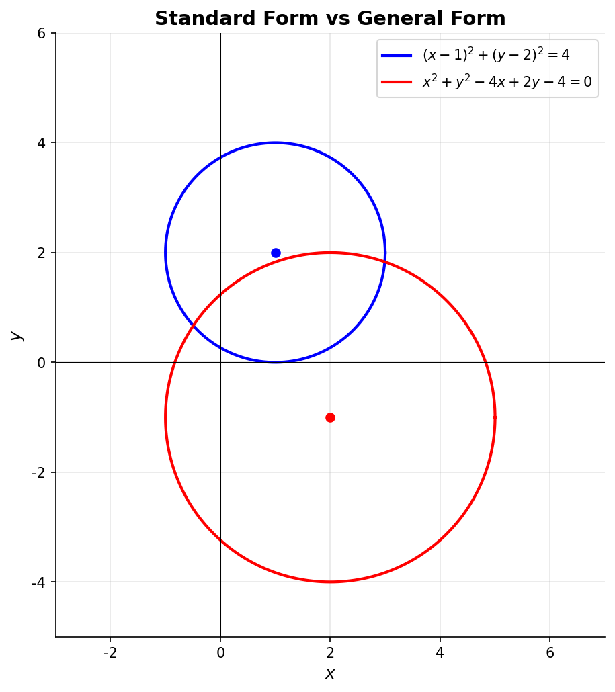
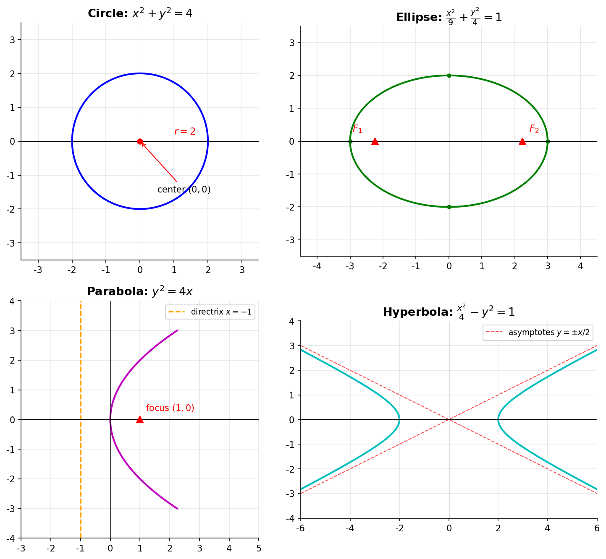

# 圆与二次曲线

> **所属路径**：`00_高中复习/01_数学基础/07_解析几何/02_圆与二次曲线`
> **预计学习时间**：55 分钟
> **难度等级**：⭐⭐

---

## 前置知识

- [直线方程](../01_直线方程/01_直线方程.md)
- [代数与方程](../../01_代数与方程/)
- [函数与图像](../../02_函数与图像/)

> 如果以上内容还不熟悉，建议先完成对应课程再继续。

---

## 学习目标

完成本节后，你将能够：

1. 掌握圆的标准方程和一般方程，并能相互转换
2. 理解椭圆、抛物线、双曲线的标准方程及其几何特征
3. 识别圆锥曲线的焦点、顶点、准线等关键要素
4. 用 Python 绘制各类圆锥曲线并验证其性质

---

## 正文讲解

### 1. 从卫星轨道到圆锥曲线

在日常生活中，圆形无处不在——钟表的表盘、车轮的轮廓、碗口的形状。而当你把目光投向太空，情况变得更加丰富：地球绕太阳运行的轨道是一个接近圆的椭圆，彗星可能走的是抛物线或双曲线轨道。这些看似不同的曲线，其实都有一个共同的来源——**圆锥曲线（Conic Section）**。

想象一个圆锥体被一个平面切割：平面水平切过去得到圆，稍微倾斜得到椭圆，平行于锥面母线时得到抛物线，倾斜角度更大时得到双曲线。这四种曲线统称为圆锥曲线。

在人工智能领域，这些曲线出现在意想不到的地方：支持向量机的核函数可以将数据映射到椭圆形的决策边界；抛物面是误差曲面中凸优化的理想形状；而双曲空间近年来被用于表示具有层次结构的数据（如知识图谱）。

### 2. 圆的方程

#### 标准方程

一个圆由圆心和半径完全确定。设圆心为 $(a, b)$ ，半径为 $r$ ，则圆上任意点 $(x, y)$ 到圆心的距离等于 $r$ ：

$$
(x - a)^2 + (y - b)^2 = r^2
$$

> **直觉解读**：这个方程就是 **[距离公式](../03_距离与面积公式/03_距离与面积公式.md)** 的直接应用——"圆上所有点到圆心的距离都等于 $r$ "。

当圆心在原点时，方程简化为 $x^2 + y^2 = r^2$ 。

#### 一般方程

把标准方程展开整理，可以得到：

$$
x^2 + y^2 + Dx + Ey + F = 0
$$

其中圆心为 $\left(-\dfrac{D}{2}, -\dfrac{E}{2}\right)$ ，半径为 $r = \dfrac{1}{2}\sqrt{D^2 + E^2 - 4F}$ 。

要使方程确实表示一个圆，必须满足 $D^2 + E^2 - 4F > 0$ 。

**例题**：将 $x^2 + y^2 - 4x + 2y - 4 = 0$ 化为标准方程。

配方过程：

$$
(x^2 - 4x + 4) + (y^2 + 2y + 1) = 4 + 4 + 1
$$

$$
(x - 2)^2 + (y + 1)^2 = 9
$$

所以圆心为 $(2, -1)$ ，半径 $r = 3$ 。

下面这张图展示了标准方程和一般方程对应的两个圆：



> 📌 **图解说明**：蓝色圆为标准式 $(x-1)^2 + (y-2)^2 = 4$ ，红色圆为由一般式 $x^2 + y^2 - 4x + 2y - 4 = 0$ 配方所得的 $(x-2)^2 + (y+1)^2 = 9$ 。你可以运行 `code/plot_conics.py` 自行生成这张图。

### 3. 椭圆

椭圆是到两个定点（焦点 $F_1, F_2$ ）距离之和等于常数 $2a$ 的点的轨迹。

焦点在 $x$ 轴上时，标准方程为：

$$
\frac{x^2}{a^2} + \frac{y^2}{b^2} = 1 \quad (a > b > 0)
$$

其中：
- $a$ ：半长轴长度（沿 $x$ 轴方向）
- $b$ ：半短轴长度（沿 $y$ 轴方向）
- $c = \sqrt{a^2 - b^2}$ ：焦距的一半，焦点为 $(\pm c, 0)$
- **离心率** $e = \dfrac{c}{a}$ （ $0 < e < 1$ ）：衡量椭圆的"扁"程度。 $e$ 越接近 $0$ 越像圆， $e$ 越接近 $1$ 越扁

> **直觉解读**：椭圆就是"被压扁的圆"。当 $a = b$ 时椭圆退化为圆。在 AI 中，高斯分布的等概率曲线就是椭圆——协方差矩阵决定了椭圆的形状和朝向。

### 4. 抛物线

抛物线是到一个定点（焦点 $F$ ）和一条定直线（准线 $l$ ）距离相等的点的轨迹。

标准方程（开口向右）为：

$$
y^2 = 2px \quad (p > 0)
$$

其中：
- 焦点 $F = \left(\dfrac{p}{2}, 0\right)$
- 准线 $l: x = -\dfrac{p}{2}$
- 抛物线没有"中心"，只有顶点 $(0, 0)$

> **直觉解读**：抛物线只有一个焦点，图形向一个方向无限延伸。在机器学习中，二次损失函数 $L = (y - \hat{y})^2$ 的图像就是一条抛物线——梯度下降正是沿着这条抛物线"滑"到最低点。

开口方向不同时有四种形式：

| 方程 | 开口方向 | 焦点 |
| ---- | -------- | ---- |
| $y^2 = 2px$ | 向右 | $\left(\dfrac{p}{2}, 0\right)$ |
| $y^2 = -2px$ | 向左 | $\left(-\dfrac{p}{2}, 0\right)$ |
| $x^2 = 2py$ | 向上 | $\left(0, \dfrac{p}{2}\right)$ |
| $x^2 = -2py$ | 向下 | $\left(0, -\dfrac{p}{2}\right)$ |

### 5. 双曲线

双曲线是到两个焦点 $F_1, F_2$ 距离之差的绝对值等于常数 $2a$ 的点的轨迹。

焦点在 $x$ 轴上时，标准方程为：

$$
\frac{x^2}{a^2} - \frac{y^2}{b^2} = 1 \quad (a > 0, b > 0)
$$

其中：
- $c = \sqrt{a^2 + b^2}$ ：注意与椭圆不同，这里是加号
- 渐近线为 $y = \pm \dfrac{b}{a} x$ ：曲线无限延伸时趋近的直线
- 离心率 $e = \dfrac{c}{a} > 1$

> **直觉解读**：双曲线由两支组成，像两面镜子。它的渐近线给出了曲线的"大致方向"。在人工智能中，双曲空间（Hyperbolic Space）被用来高效表示树形或层次化的数据结构。

### 6. 四种曲线的统一视角

下面这张图将圆、椭圆、抛物线、双曲线放在一起对比：



> 📌 **图解说明**：左上为圆，右上为椭圆（标注了焦点），左下为抛物线（标注了焦点和准线），右下为双曲线（标注了渐近线）。你可以运行 `code/plot_conics.py` 自行生成这张图。

用离心率 $e$ 可以统一描述这些曲线：

| 曲线 | 离心率 $e$ | 特征 |
| ---- | ---------- | ---- |
| 圆 | $e = 0$ | 到圆心距离恒定 |
| 椭圆 | $0 < e < 1$ | 到两焦点距离之和恒定 |
| 抛物线 | $e = 1$ | 到焦点和准线距离相等 |
| 双曲线 | $e > 1$ | 到两焦点距离之差的绝对值恒定 |

---

## 动手实践

我们来用 Python 验证椭圆的基本性质——椭圆上任意一点到两焦点的距离之和等于 $2a$ 。

```python
# 文件：code/conic_demo.py
# 验证椭圆的焦点距离性质
# 环境：Python 3.10+, numpy

import numpy as np

# 椭圆参数：x²/9 + y²/4 = 1，即 a=3, b=2
a, b = 3, 2
c = np.sqrt(a**2 - b**2)  # 焦距的一半
print(f"椭圆参数: a={a}, b={b}, c={c:.4f}")
print(f"焦点: F1=({-c:.4f}, 0), F2=({c:.4f}, 0)")
print(f"离心率: e={c/a:.4f}")

# 在椭圆上取若干点，验证 |PF1| + |PF2| = 2a
theta = np.linspace(0, 2 * np.pi, 8, endpoint=False)
for t in theta:
    x = a * np.cos(t)
    y = b * np.sin(t)
    d1 = np.sqrt((x + c)**2 + y**2)  # 到 F1 的距离
    d2 = np.sqrt((x - c)**2 + y**2)  # 到 F2 的距离
    print(f"  点({x:+.2f}, {y:+.2f}): |PF1|+|PF2| = {d1:.4f}+{d2:.4f} = {d1+d2:.4f}")

print(f"\n理论值 2a = {2*a}")
```

**运行说明**：
- 环境要求：Python 3.10+, numpy
- 运行命令：`python code/conic_demo.py`

**预期输出**：
```
椭圆参数: a=3, b=2, c=2.2361
焦点: F1=(-2.2361, 0), F2=(2.2361, 0)
离心率: e=0.7454
  点(+3.00, +0.00): |PF1|+|PF2| = 5.2361+0.7639 = 6.0000
  点(+2.12, +1.41): |PF1|+|PF2| = 4.5000+1.5000 = 6.0000
  点(+0.00, +2.00): |PF1|+|PF2| = 3.0000+3.0000 = 6.0000
  点(-2.12, +1.41): |PF1|+|PF2| = 1.5000+4.5000 = 6.0000
  点(-3.00, +0.00): |PF1|+|PF2| = 0.7639+5.2361 = 6.0000
  点(-2.12, -1.41): |PF1|+|PF2| = 1.5000+4.5000 = 6.0000
  点(-0.00, -2.00): |PF1|+|PF2| = 3.0000+3.0000 = 6.0000
  点(+2.12, -1.41): |PF1|+|PF2| = 4.5000+1.5000 = 6.0000

理论值 2a = 6
```

每一行的距离之和都精确等于 $2a = 6$ ，完美验证了椭圆的定义！

---

## 典型误区

| 误区 | 正确理解 |
| ---- | -------- |
| "椭圆方程中 $a$ 总是在 $x^2$ 下面" | $a$ 是半长轴，对应较大的分母。若 $b > a$ ，则焦点在 $y$ 轴上，方程为 $\dfrac{x^2}{b^2} + \dfrac{y^2}{a^2} = 1$ |
| "双曲线的 $c^2 = a^2 - b^2$ " | 双曲线是 $c^2 = a^2 + b^2$ ，椭圆才是 $c^2 = a^2 - b^2$ |
| "抛物线 $y^2 = 4x$ 的焦点是 $(4, 0)$ " | 这里 $2p = 4$ ，即 $p = 2$ ，焦点是 $\left(\dfrac{p}{2}, 0\right) = (1, 0)$ |
| "一般方程中 $x^2$ 和 $y^2$ 系数不同就一定是椭圆" | 还需要两个系数同号才是椭圆；异号则是双曲线 |

---

## 练习题

### 练习 1：圆的方程转换（难度：⭐）

将圆 $x^2 + y^2 + 6x - 2y - 6 = 0$ 化为标准方程，并求圆心和半径。

<details>
<summary>💡 提示</summary>

分别对 $x$ 和 $y$ 配方。

</details>

<details>
<summary>✅ 参考答案</summary>

$(x^2 + 6x + 9) + (y^2 - 2y + 1) = 6 + 9 + 1$

$$(x + 3)^2 + (y - 1)^2 = 16$$

圆心 $(-3, 1)$ ，半径 $r = 4$

</details>

### 练习 2：求椭圆方程（难度：⭐⭐）

已知椭圆的焦点在 $x$ 轴上，长轴长为 $10$ ，离心率 $e = \dfrac{3}{5}$ ，求标准方程。

<details>
<summary>💡 提示</summary>

由长轴长 $2a = 10$ 得 $a = 5$ ，再由 $e = \dfrac{c}{a}$ 求 $c$ ，最后用 $b^2 = a^2 - c^2$ 求 $b$ 。

</details>

<details>
<summary>✅ 参考答案</summary>

$a = 5$ ， $c = ea = 3$ ， $b^2 = 25 - 9 = 16$

$$\dfrac{x^2}{25} + \dfrac{y^2}{16} = 1$$

</details>

### 练习 3：抛物线焦点（难度：⭐⭐）

抛物线 $x^2 = -8y$ 的焦点坐标和准线方程是什么？

<details>
<summary>💡 提示</summary>

这是开口向下的抛物线（ $x^2 = -2py$ 形式），先求 $p$ 。

</details>

<details>
<summary>✅ 参考答案</summary>

$-2p = -8$ ，得 $p = 4$

焦点 $\left(0, -\dfrac{p}{2}\right) = (0, -2)$

准线 $y = \dfrac{p}{2} = 2$

</details>

---

## 下一步学习

- 📖 下一个知识点：[距离与面积公式](../03_距离与面积公式/03_距离与面积公式.md)
- 🔗 相关知识点：[轨迹问题](../04_轨迹问题/04_轨迹问题.md)
- 📚 拓展阅读：椭圆与高斯分布的关系（在后续概率论课程中详细介绍）

---

## 参考资料

1. [Khan Academy — Conic Sections](https://www.khanacademy.org/math/precalculus/x9e81a4f98389efdf:conics) — 圆锥曲线的互动课程，含大量可视化（公开课程）
2. [GeoGebra — Conic Section Exploration](https://www.geogebra.org/m/BUVhcRSv) — 动态操作圆锥曲线的在线工具（CC BY 许可）
3. [Wikipedia — Conic Section](https://en.wikipedia.org/wiki/Conic_section) — 圆锥曲线的全面百科介绍（公共知识库）
