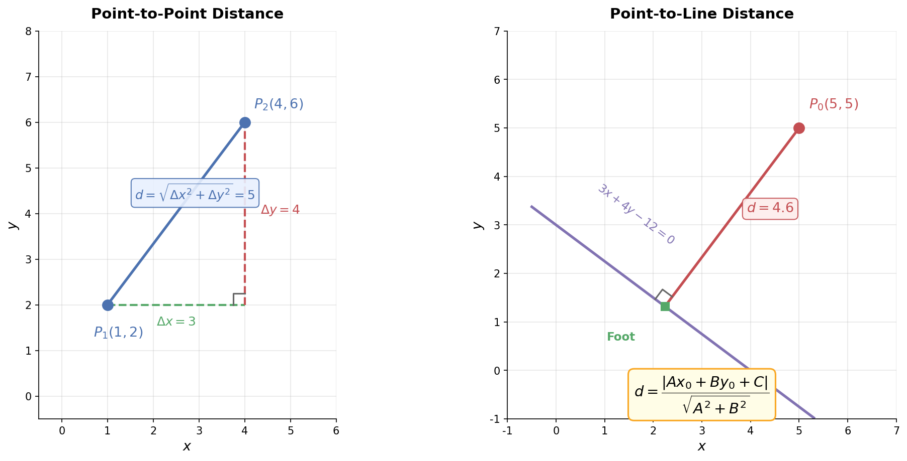
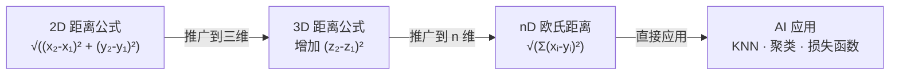

# 距离与面积公式

> **所属路径**：`00_高中复习/01_数学基础/07_解析几何/03_距离与面积公式`
> **预计学习时间**：35 分钟
> **难度等级**：⭐

---

## 前置知识

- [直线方程](../01_直线方程/01_直线方程.md)
- [向量表示与运算](../../06_向量/01_向量表示与运算/)
- [三角函数](../../05_三角函数/)

> 如果以上内容还不熟悉，建议先完成对应课程再继续。

---

## 学习目标

完成本节后，你将能够：

1. 用坐标计算两点间的距离
2. 计算点到直线的距离
3. 用坐标法求三角形的面积
4. 理解这些公式在 AI 中的应用场景

---

## 正文讲解

### 1. 为什么距离如此重要？

在人工智能中，"距离"可能是最核心的概念之一。当机器学习算法需要判断两张图片是否相似、两个用户的行为是否接近、一个数据点是否属于某个类别时，它首先要回答的问题就是："这两个东西有多远？"

K 近邻算法通过计算新数据点到已知数据点的距离来做分类；聚类算法通过距离把相似的样本归为一组；甚至神经网络的损失函数，本质上也在度量预测值与真实值之间的"距离"。所以，掌握距离公式不仅是解析几何的基础，更是理解 AI 的钥匙。

### 2. 两点间的距离

假设平面上有两个点 $P_1(x_1, y_1)$ 和 $P_2(x_2, y_2)$ ，它们之间的距离 $d$ 由勾股定理直接给出：

$$
d = \sqrt{(x_2 - x_1)^2 + (y_2 - y_1)^2}
$$

> **直觉解读**：把两点间的水平距离和垂直距离看成直角三角形的两条直角边，斜边就是两点间的距离。这就是 **[勾股定理](../../01_代数与方程/)** 在坐标系中的应用。

下面这张图直观展示了两种最常用的距离公式——两点间距离和点到直线距离：



> 📌 **图解说明**：左图展示了两点 $P_1(1,2)$ 和 $P_2(4,6)$ 之间的距离，通过构造直角三角形（绿色为 $\Delta x$ ，红色为 $\Delta y$ ），斜边即为两点距离 $d = 5$ 。右图展示了点 $P_0$ 到直线 $3x + 4y - 12 = 0$ 的垂直距离。你可以运行 `code/plot_distance.py` 自行生成这张图。

这个公式的推广非常自然：在三维空间中增加一个 $z$ 坐标即可；在 $n$ 维空间中，距离公式变为：

$$
d = \sqrt{\sum_{i=1}^{n}(x_i - y_i)^2}
$$

这就是机器学习中无处不在的 **欧几里得距离（Euclidean Distance）**。



> 📌 **图解说明**：两点距离公式从 2D 自然推广到 nD，成为 AI 中的欧氏距离。

### 3. 点到直线的距离

已知点 $P_0(x_0, y_0)$ 和直线 $l: Ax + By + C = 0$ ，点到直线的距离为：

$$
d = \frac{|Ax_0 + By_0 + C|}{\sqrt{A^2 + B^2}}
$$

> **直觉解读**：分子 $|Ax_0 + By_0 + C|$ 衡量的是"把点的坐标代入直线方程后偏离零的程度"；分母 $\sqrt{A^2 + B^2}$ 是法向量 $(A, B)$ 的长度，起到归一化的作用。

这个公式的推导可以用 **[向量投影](../../06_向量/02_数量积/)** 来理解：

1. 在直线上任取一点 $Q$ ，构造向量 $\vec{QP_0}$
2. 直线的法向量为 $\vec{n} = (A, B)$
3. 点到直线的距离就是 $\vec{QP_0}$ 在 $\vec{n}$ 方向上的投影长度

$$
d = \frac{|\vec{QP_0} \cdot \vec{n}|}{|\vec{n}|} = \frac{|Ax_0 + By_0 + C|}{\sqrt{A^2 + B^2}}
$$

**例题**：求点 $(3, -1)$ 到直线 $3x - 4y + 5 = 0$ 的距离。

$$
d = \frac{|3 \times 3 + (-4) \times (-1) + 5|}{\sqrt{3^2 + (-4)^2}} = \frac{|9 + 4 + 5|}{\sqrt{9 + 16}} = \frac{18}{5} = 3.6
$$

在 AI 中，点到直线的距离公式用于衡量"数据点到决策边界的距离"。支持向量机（SVM）的核心目标就是最大化离决策边界最近的样本点到边界的距离（即"间隔"）。

### 4. 两条平行线间的距离

给定平行线 $l_1: Ax + By + C_1 = 0$ 和 $l_2: Ax + By + C_2 = 0$ ，它们之间的距离为：

$$
d = \frac{|C_1 - C_2|}{\sqrt{A^2 + B^2}}
$$

> **直觉解读**：在 $l_1$ 上任取一点代入 $l_2$ 的距离公式即可，因为两条线的 $A, B$ 相同，差异只在常数项。

### 5. 三角形面积的坐标公式

已知三角形三个顶点 $A(x_1, y_1)$ ， $B(x_2, y_2)$ ， $C(x_3, y_3)$ ，面积为：

$$
S = \frac{1}{2} |x_1(y_2 - y_3) + x_2(y_3 - y_1) + x_3(y_1 - y_2)|
$$

这个公式也可以用行列式简洁地表示：

$$
S = \frac{1}{2} \left| \det \begin{pmatrix} x_1 - x_3 & x_2 - x_3 \\ y_1 - y_3 & y_2 - y_3 \end{pmatrix} \right|
$$

> **直觉解读**：行列式计算的是两个向量 $\vec{CA}$ 和 $\vec{CB}$ 所围成的平行四边形面积，三角形面积是它的一半。这是 **[向量叉积](../../06_向量/01_向量表示与运算/)** 思想在二维中的体现。

行列式的写法提前预示了线性代数中的核心工具。在后续学习中，你会发现行列式不仅能求面积，还能判断线性相关性、计算体积变换等。

### 6. 面积公式的另一种推导——底乘高

当然，你也可以用传统的"底 × 高 ÷ 2"来计算：以 $AB$ 为底边，用点到直线距离公式求出 $C$ 到 $AB$ 所在直线的距离作为高。这两种方法得到的结果完全一致，选择哪种取决于哪种更方便。

---

## 动手实践

下面的代码实现了所有距离和面积公式，并用一个具体例子做验证。

```python
# 文件：code/distance_demo.py
# 距离与面积公式的 Python 实现
# 环境：Python 3.10+, numpy

import numpy as np

def point_distance(p1, p2):
    """两点间的欧氏距离"""
    return np.sqrt(sum((a - b)**2 for a, b in zip(p1, p2)))

def point_to_line(x0, y0, A, B, C):
    """点到直线 Ax + By + C = 0 的距离"""
    return abs(A * x0 + B * y0 + C) / np.sqrt(A**2 + B**2)

def triangle_area(p1, p2, p3):
    """三角形面积（坐标公式）"""
    x1, y1 = p1
    x2, y2 = p2
    x3, y3 = p3
    return 0.5 * abs(x1*(y2 - y3) + x2*(y3 - y1) + x3*(y1 - y2))

# 示例：三角形 A(0,0), B(4,0), C(1,3)
A_pt, B_pt, C_pt = (0, 0), (4, 0), (1, 3)

print("=== 两点距离 ===")
print(f"|AB| = {point_distance(A_pt, B_pt):.4f}")
print(f"|BC| = {point_distance(B_pt, C_pt):.4f}")
print(f"|CA| = {point_distance(C_pt, A_pt):.4f}")

print("\n=== 点到直线距离 ===")
# 直线 AB: y = 0，即 0x + 1y + 0 = 0
d = point_to_line(C_pt[0], C_pt[1], 0, 1, 0)
print(f"C(1,3) 到直线 AB(y=0) 的距离: {d:.4f}")

print("\n=== 三角形面积 ===")
S = triangle_area(A_pt, B_pt, C_pt)
print(f"三角形面积（坐标公式）: {S:.4f}")
print(f"三角形面积（底×高÷2）: {4 * 3 / 2:.4f}")

# 推广到 n 维距离
print("\n=== n 维欧氏距离 ===")
v1 = (1, 2, 3, 4, 5)
v2 = (5, 4, 3, 2, 1)
print(f"5D 距离: {point_distance(v1, v2):.4f}")
print(f"验证: {np.linalg.norm(np.array(v1) - np.array(v2)):.4f}")
```

**运行说明**：
- 环境要求：Python 3.10+, numpy
- 运行命令：`python code/distance_demo.py`

**预期输出**：
```
=== 两点距离 ===
|AB| = 4.0000
|BC| = 4.2426
|CA| = 3.1623

=== 点到直线距离 ===
C(1,3) 到直线 AB(y=0) 的距离: 3.0000

=== 三角形面积 ===
三角形面积（坐标公式）: 6.0000
三角形面积（底×高÷2）: 6.0000

=== n 维欧氏距离 ===
5D 距离: 6.3246
验证: 6.3246
```

两种面积计算方法结果一致，都得到 $S = 6$ ；高维距离也与 `numpy.linalg.norm` 完全吻合。

---

## 典型误区

| 误区 | 正确理解 |
| ---- | -------- |
| "点到直线距离公式中忘加绝对值" | 距离一定是非负的，分子必须取绝对值 |
| "点到直线距离中直线方程系数任意" | 必须先化为一般式 $Ax + By + C = 0$ 才能代入公式 |
| "三角形面积公式结果可能为负" | 行列式可能为负，所以必须取绝对值后再乘 $\dfrac{1}{2}$ |
| "欧氏距离只能用于二维" | 欧氏距离可以推广到任意 $n$ 维空间 |

---

## 练习题

### 练习 1：两点距离（难度：⭐）

求点 $A(1, -2)$ 和 $B(-3, 1)$ 之间的距离。

<details>
<summary>💡 提示</summary>

直接代入两点距离公式。

</details>

<details>
<summary>✅ 参考答案</summary>

$$d = \sqrt{(-3-1)^2 + (1-(-2))^2} = \sqrt{16 + 9} = \sqrt{25} = 5$$

</details>

### 练习 2：点到直线距离（难度：⭐）

求点 $(1, 2)$ 到直线 $3x + 4y - 5 = 0$ 的距离。

<details>
<summary>💡 提示</summary>

代入公式 $d = \dfrac{|Ax_0 + By_0 + C|}{\sqrt{A^2 + B^2}}$ 。

</details>

<details>
<summary>✅ 参考答案</summary>

$$d = \dfrac{|3 \times 1 + 4 \times 2 + (-5)|}{\sqrt{9 + 16}} = \dfrac{|3 + 8 - 5|}{5} = \dfrac{6}{5} = 1.2$$

</details>

### 练习 3：三角形面积（难度：⭐⭐）

三角形三个顶点为 $A(1, 1)$ ， $B(4, 1)$ ， $C(2, 5)$ ，求面积。

<details>
<summary>💡 提示</summary>

代入坐标面积公式，或者用"底 × 高 ÷ 2"。

</details>

<details>
<summary>✅ 参考答案</summary>

$$S = \dfrac{1}{2}|1 \times (1 - 5) + 4 \times (5 - 1) + 2 \times (1 - 1)| = \dfrac{1}{2}|{-4 + 16 + 0}| = \dfrac{12}{2} = 6$$

</details>

### 练习 4：编程验证（难度：⭐⭐）

用 Python 计算点 $(0, 0)$ 到直线 $5x - 12y + 26 = 0$ 的距离，并与手算结果对比。

<details>
<summary>💡 提示</summary>

调用前面的 `point_to_line` 函数即可。

</details>

<details>
<summary>✅ 参考答案</summary>

手算： $d = \dfrac{|5 \times 0 - 12 \times 0 + 26|}{\sqrt{25 + 144}} = \dfrac{26}{13} = 2$

```python
d = point_to_line(0, 0, 5, -12, 26)
print(d)  # 输出 2.0
```

</details>

---

## 下一步学习

- 📖 下一个知识点：[轨迹问题](../04_轨迹问题/04_轨迹问题.md)
- 🔗 相关知识点：[向量·数量积](../../06_向量/02_数量积/)
- 📚 拓展阅读：了解更多距离度量方式（曼哈顿距离、余弦距离等）将在后续机器学习课程中详细介绍

---

## 参考资料

1. [Khan Academy — Distance Formula](https://www.khanacademy.org/math/geometry/hs-geo-analytic-geometry/hs-geo-distance-and-midpoints/v/distance-formula) — 距离公式的可视化讲解（公开课程）
2. [Wikipedia — Euclidean Distance](https://en.wikipedia.org/wiki/Euclidean_distance) — 欧氏距离的定义与推广（公共知识库）
3. [3Blue1Brown — Essence of Linear Algebra: Dot Products](https://www.3blue1brown.com/lessons/dot-products) — 点积与投影的几何直觉（公开视频）
