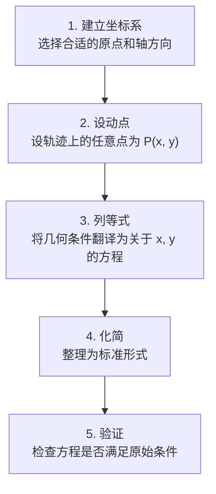

# 轨迹问题

> **所属路径**：`00_高中复习/01_数学基础/07_解析几何/04_轨迹问题`
> **预计学习时间**：45 分钟
> **难度等级**：⭐⭐⭐

---

## 前置知识

- [直线方程](../01_直线方程/01_直线方程.md)
- [圆与二次曲线](../02_圆与二次曲线/02_圆与二次曲线.md)
- [距离与面积公式](../03_距离与面积公式/03_距离与面积公式.md)

> 如果以上内容还不熟悉，建议先完成对应课程再继续。

---

## 学习目标

完成本节后，你将能够：

1. 理解"轨迹"的数学含义：满足特定几何条件的所有点的集合
2. 掌握求轨迹方程的一般方法（直接法、定义法、代入法、参数法）
3. 能将几何条件"翻译"为代数方程
4. 感受轨迹思维与 AI 中"约束建模"的联系

---

## 正文讲解

### 1. 什么是轨迹？

想象你在操场上用一根绳子拴住一只小狗，绳子的另一端固定在一根柱子上。小狗能跑到的所有位置构成了一个圆——这个圆就是小狗在"绳长固定"这个约束条件下的 **轨迹（Locus）**。

在数学中，轨迹就是满足某个给定条件的所有点的集合。而轨迹问题的核心任务是：**把用自然语言或几何语言描述的条件，翻译为坐标系中的方程**。

这种"条件 → 方程"的翻译能力在 AI 中极为重要。当我们设计一个优化问题时，约束条件（如"误差不超过某个阈值""参数在某个范围内"）本质上就是在定义一个轨迹（或区域），而我们要找的最优解就在这个轨迹上或区域内。

### 2. 求轨迹方程的一般步骤

无论使用哪种方法，求轨迹方程通常遵循以下流程：



> 📌 **图解说明**：求轨迹方程的五步流程。关键在于第三步"列等式"——把几何语言翻译为代数语言。

下面这张图展示了四种经典的轨迹曲线，它们分别对应不同的几何距离条件：


> 📌 **图解说明**：左上为椭圆——到两焦点距离之和为定值 $2a$ ；右上为双曲线——到两焦点距离之差的绝对值为定值 $2a$ ；左下为抛物线——到焦点和准线的距离相等；右下为阿波罗尼斯圆——到两定点距离之比为常数 $k$ 。你可以运行 `code/plot_locus_curves.py` 自行生成这张图。

### 3. 方法一：直接法

直接法是最基本的方法：直接根据几何条件，列出动点 $(x, y)$ 满足的方程。

**例题 1**：求到两个定点 $A(-2, 0)$ 和 $B(2, 0)$ 距离之和等于 $6$ 的点的轨迹方程。

**分析**：设动点 $P(x, y)$ ，条件为 $|PA| + |PB| = 6$ 。

你可能已经认出来了——这就是椭圆的定义！两个焦点是 $A$ 和 $B$ ，焦距 $2c = 4$ 即 $c = 2$ ，距离之和 $2a = 6$ 即 $a = 3$ 。

因此 $b^2 = a^2 - c^2 = 9 - 4 = 5$ ，轨迹方程为：

$$
\frac{x^2}{9} + \frac{y^2}{5} = 1
$$

但如果你没有认出椭圆的定义呢？我们可以用直接法硬算：

$$
\sqrt{(x + 2)^2 + y^2} + \sqrt{(x - 2)^2 + y^2} = 6
$$

将一个根号移到右边再两边平方：

$$
(x + 2)^2 + y^2 = \left(6 - \sqrt{(x - 2)^2 + y^2}\right)^2
$$

展开并化简（过程较长，此处省略中间步骤），最终得到同样的结果。可以看到，认出标准定义能大大简化计算。

### 4. 方法二：定义法

定义法的关键是**识别出题目条件本质上描述的是哪种已知曲线**。

| 条件描述 | 对应曲线 | 标准方程 |
| -------- | -------- | -------- |
| 到定点距离等于定值 | 圆 | $(x-a)^2 + (y-b)^2 = r^2$ |
| 到两定点距离之和为定值 | 椭圆 | $\dfrac{x^2}{a^2} + \dfrac{y^2}{b^2} = 1$ |
| 到两定点距离之差的绝对值为定值 | 双曲线 | $\dfrac{x^2}{a^2} - \dfrac{y^2}{b^2} = 1$ |
| 到定点与定直线距离相等 | 抛物线 | $y^2 = 2px$ |

**例题 2**：求到点 $F(0, 1)$ 和直线 $y = -1$ 距离相等的点的轨迹方程。

**分析**：条件"到定点和定直线距离相等"正是抛物线的定义。

焦点 $F(0, 1)$ 在 $y$ 轴上，准线 $y = -1$ ，因此 $\dfrac{p}{2} = 1$ ，即 $p = 2$ 。

轨迹方程为 $x^2 = 2py = 4y$ ，即：

$$
x^2 = 4y
$$

### 5. 方法三：代入法（相关点法）

当动点 $P$ 的坐标不方便直接表示，但 $P$ 与另一个已知轨迹上的点 $Q$ 有确定的关系时，可以用代入法。

**例题 3**：已知点 $Q$ 在圆 $x^2 + y^2 = 4$ 上运动，点 $P$ 是 $OQ$ （ $O$ 为原点）的中点，求 $P$ 的轨迹方程。

**分析**：设 $P(x, y)$ ， $Q(x_0, y_0)$ 。因为 $P$ 是 $OQ$ 的中点：

$$
x = \frac{x_0}{2}, \quad y = \frac{y_0}{2}
$$

所以 $x_0 = 2x$ ， $y_0 = 2y$ 。把 $Q$ 的坐标代入圆的方程：

$$
(2x)^2 + (2y)^2 = 4
$$

$$
x^2 + y^2 = 1
$$

所以 $P$ 的轨迹是以原点为圆心、半径为 $1$ 的圆。这完全符合直觉——把圆上的点到原点的距离都缩短为一半，得到的还是一个圆，只是半径减半。

### 6. 方法四：参数法

当几何条件涉及角度或比例等中间量时，可以先将 $x, y$ 用一个参数表示，再消去参数得到 $x, y$ 的关系。

**例题 4**：从原点出发的射线与单位圆 $x^2 + y^2 = 1$ 交于点 $A$ ，在射线上取点 $P$ 使 $|OP| \cdot |OA| = 4$ ，求 $P$ 的轨迹。

**分析**：设射线与 $x$ 轴的夹角为 $\theta$ ，则 $A = (\cos\theta, \sin\theta)$ ， $|OA| = 1$ 。

由条件 $|OP| = \dfrac{4}{|OA|} = 4$ ，所以 $P = (4\cos\theta, 4\sin\theta)$ 。

设 $P(x, y)$ ，则 $x = 4\cos\theta$ ， $y = 4\sin\theta$ ，消去参数 $\theta$ ：

$$
x^2 + y^2 = 16\cos^2\theta + 16\sin^2\theta = 16
$$

轨迹方程为 $x^2 + y^2 = 16$ ——仍然是圆，但半径变为 $4$ 。

### 7. 轨迹思维与 AI 的联系

轨迹问题训练的核心能力是 **将约束条件形式化为数学表达式**。这种能力在 AI 中无处不在：

- **分类边界**：满足"到两类数据中心距离相等"的点的轨迹，就是分类的决策边界
- **等高线**：损失函数 $L(w_1, w_2) = c$ 定义了参数空间中的一条等值轨迹
- **约束优化**：满足约束 $g(x) = 0$ 的可行解构成一条轨迹，最优解就在这条轨迹上

---

## 动手实践

下面的代码演示了如何用数值方法验证轨迹方程——对大量满足几何条件的点，检查它们是否都在求得的方程上。

```python
# 文件：code/locus_demo.py
# 数值验证轨迹方程
# 环境：Python 3.10+, numpy

import numpy as np

print("=== 例题1验证：椭圆轨迹 ===")
# 条件：|PA| + |PB| = 6，A=(-2,0), B=(2,0)
# 理论轨迹：x²/9 + y²/5 = 1
a, b_val = 3, np.sqrt(5)
theta = np.linspace(0, 2 * np.pi, 12, endpoint=False)
for t in theta:
    x = a * np.cos(t)
    y = b_val * np.sin(t)
    dA = np.sqrt((x + 2)**2 + y**2)
    dB = np.sqrt((x - 2)**2 + y**2)
    eq_val = x**2 / 9 + y**2 / 5
    print(f"  P({x:+.2f},{y:+.2f}): |PA|+|PB|={dA+dB:.4f}, x²/9+y²/5={eq_val:.4f}")

print("\n=== 例题3验证：中点轨迹 ===")
# Q 在 x²+y²=4 上，P 是 OQ 中点，P 的轨迹应为 x²+y²=1
for t in theta[:6]:
    qx, qy = 2 * np.cos(t), 2 * np.sin(t)
    px, py = qx / 2, qy / 2
    print(f"  Q({qx:+.2f},{qy:+.2f}) -> P({px:+.2f},{py:+.2f}): "
          f"x²+y²={px**2+py**2:.4f}")

print("\n=== 分类边界轨迹 ===")
# 两个类别中心 C1=(1,0) 和 C2=(-1,0)
# 到两中心距离相等的轨迹 -> x = 0（垂直平分线）
C1, C2 = np.array([1, 0]), np.array([-1, 0])
ys = np.linspace(-3, 3, 7)
for y_val in ys:
    P = np.array([0, y_val])
    d1 = np.linalg.norm(P - C1)
    d2 = np.linalg.norm(P - C2)
    print(f"  P(0, {y_val:+.1f}): d1={d1:.4f}, d2={d2:.4f}, 差={abs(d1-d2):.6f}")
```

**运行说明**：
- 环境要求：Python 3.10+, numpy
- 运行命令：`python code/locus_demo.py`

**预期输出**（部分）：
```
=== 例题1验证：椭圆轨迹 ===
  P(+3.00,+0.00): |PA|+|PB|=6.0000, x²/9+y²/5=1.0000
  P(+2.60,+1.12): |PA|+|PB|=6.0000, x²/9+y²/5=1.0000
  ...

=== 例题3验证：中点轨迹 ===
  Q(+2.00,+0.00) -> P(+1.00,+0.00): x²+y²=1.0000
  ...

=== 分类边界轨迹 ===
  P(0, -3.0): d1=3.1623, d2=3.1623, 差=0.000000
  ...
```

所有验证结果都完美符合理论——椭圆上每个点到两焦点距离之和为 $6$ ，中点轨迹上每个点都在单位圆上，分类边界上每个点到两类中心距离相等。

---

## 典型误区

| 误区 | 正确理解 |
| ---- | -------- |
| "求出方程就完事了" | 还需要验证：方程上的所有点是否都满足原始条件？是否有遗漏或多余的点？ |
| "所有距离之和为常数的轨迹都是椭圆" | 只有到**两个**定点的距离之和为常数（且常数大于焦距）才是椭圆 |
| "代入法中忘记检查参数范围" | $Q$ 在原曲线上运动时可能有范围限制，变换后 $P$ 的范围也需要相应限制 |
| "消参时引入了额外解" | 平方操作可能引入多余解，需要代回验证 |

---

## 练习题

### 练习 1：直接法（难度：⭐⭐）

求到点 $A(3, 0)$ 的距离是到点 $B(-3, 0)$ 的距离 $2$ 倍的点的轨迹方程。

<details>
<summary>💡 提示</summary>

设动点 $P(x, y)$ ，列出 $|PA| = 2|PB|$ ，两边平方展开化简。

</details>

<details>
<summary>✅ 参考答案</summary>

$(x-3)^2 + y^2 = 4[(x+3)^2 + y^2]$

$x^2 - 6x + 9 + y^2 = 4x^2 + 24x + 36 + 4y^2$

$3x^2 + 3y^2 + 30x + 27 = 0$

$$x^2 + y^2 + 10x + 9 = 0$$

配方得 $(x + 5)^2 + y^2 = 16$ ，这是以 $(-5, 0)$ 为圆心、 $4$ 为半径的圆（阿波罗尼斯圆）。

</details>

### 练习 2：定义法（难度：⭐⭐）

求到点 $(2, 0)$ 和到直线 $x = -2$ 距离相等的点的轨迹方程。

<details>
<summary>💡 提示</summary>

这是哪种圆锥曲线的定义？焦点和准线分别是什么？

</details>

<details>
<summary>✅ 参考答案</summary>

焦点 $F(2, 0)$ ，准线 $x = -2$ ，这是抛物线的定义。

$\dfrac{p}{2} = 2$ ，即 $p = 4$

$$y^2 = 2px = 8x$$

</details>

### 练习 3：代入法（难度：⭐⭐⭐）

已知点 $M$ 在圆 $x^2 + y^2 = 9$ 上运动，过 $M$ 作 $x$ 轴的垂线，垂足为 $N$ ，点 $P$ 在 $MN$ 上且 $|NP| = \dfrac{2}{3}|NM|$ ，求 $P$ 的轨迹方程。

<details>
<summary>💡 提示</summary>

设 $M(x_0, y_0)$ 在圆上，则 $N(x_0, 0)$ 。 $P$ 在 $MN$ 上且 $|NP| = \dfrac{2}{3}|NM|$ ，所以 $P$ 的横坐标与 $M$ 相同，纵坐标是 $M$ 的 $\dfrac{2}{3}$ 。

</details>

<details>
<summary>✅ 参考答案</summary>

设 $M(x_0, y_0)$ ， $P(x, y)$ 。由条件得 $x = x_0$ ， $y = \dfrac{2}{3}y_0$ 。

所以 $x_0 = x$ ， $y_0 = \dfrac{3}{2}y$ 。代入 $x_0^2 + y_0^2 = 9$ ：

$$x^2 + \dfrac{9}{4}y^2 = 9$$

$$\dfrac{x^2}{9} + \dfrac{y^2}{4} = 1$$

这是一个椭圆！将圆上的点纵坐标缩短为 $\dfrac{2}{3}$ ，圆就变成了椭圆。

</details>

---

## 下一步学习

- 📖 下一个知识点：[参数方程初步](../05_参数方程初步/05_参数方程初步.md)
- 🔗 相关知识点：[圆与二次曲线](../02_圆与二次曲线/02_圆与二次曲线.md)
- 📚 拓展阅读：约束优化与拉格朗日乘子法（将在后续最优化课程中详细介绍）

---

## 参考资料

1. [Khan Academy — Focus and Directrix of a Parabola](https://www.khanacademy.org/math/geometry/xff63fac4:hs-geo-conic-sections/xff63fac4:hs-geo-parabola/v/focus-and-directrix-introduction) — 焦点与准线的直观讲解（公开课程）
2. [Wikipedia — Locus (Mathematics)](https://en.wikipedia.org/wiki/Locus_(mathematics)) — 轨迹的数学定义与经典案例（公共知识库）
3. [GeoGebra — Interactive Geometry](https://www.geogebra.org/) — 动态构造轨迹的在线工具（CC BY 许可）
