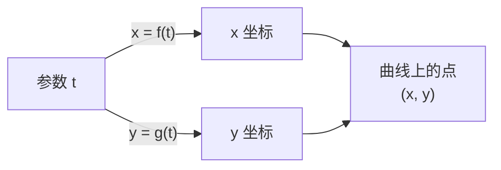

# 参数方程初步

> **所属路径**：`00_高中复习/01_数学基础/07_解析几何/05_参数方程初步`
> **预计学习时间**：40 分钟
> **难度等级**：⭐⭐

---

## 前置知识

- [三角函数](../../05_三角函数/)
- [圆与二次曲线](../02_圆与二次曲线/02_圆与二次曲线.md)
- [轨迹问题](../04_轨迹问题/04_轨迹问题.md)

> 如果以上内容还不熟悉，建议先完成对应课程再继续。

---

## 学习目标

完成本节后，你将能够：

1. 理解参数方程的概念：用一个中间变量（参数）同时表达 $x$ 和 $y$
2. 掌握直线、圆、椭圆的参数方程
3. 能在参数方程与普通方程之间互相转换
4. 理解参数方程在动画、轨迹生成和 AI 中的应用

---

## 正文讲解

### 1. 为什么需要参数方程？

回想一下我们之前学过的方程形式：直线用 $y = kx + b$ ，圆用 $x^2 + y^2 = r^2$ 。这些都是 $x$ 和 $y$ 直接的关系。但有时候，这种"直接关系"并不方便。

想象你在屏幕上画一个圆形动画。你需要告诉计算机"在时间 $t$ ，画笔应该在什么位置"。这时候，与其给一个 $x, y$ 之间的关系，不如直接给出：

$$
x = r\cos t, \quad y = r\sin t
$$

随着 $t$ 从 $0$ 变化到 $2\pi$ ，画笔就自动画出了一个圆。这里的 $t$ 就是 **参数（Parameter）**，而上面的方程对就是圆的 **参数方程（Parametric Equation）**。

参数方程的核心优势是：**它不仅描述了曲线的形状，还描述了点在曲线上运动的方式**（方向、速度）。这在计算机图形学、机器人路径规划和 AI 中生成轨迹时极其有用。

### 2. 参数方程的基本概念

一般地，如果曲线上点的坐标 $(x, y)$ 都可以用一个变量 $t$ （参数）来表示：

$$
\begin{cases} x = f(t) \\ y = g(t) \end{cases} \quad (t \in D)
$$

其中 $D$ 是参数 $t$ 的取值范围，这就叫做曲线的参数方程。

参数 $t$ 的含义可以很灵活：
- 时间（如物理中的运动轨迹）
- 角度（如圆和椭圆）
- 比例（如线段上的点）
- 任意辅助变量



> 📌 **图解说明**：参数 $t$ 同时控制 $x$ 和 $y$ 的取值，决定了曲线上点的位置。

下面这张图展示了四种常见的参数曲线——圆、椭圆、摆线和利萨如图形，箭头标明了参数增大时点的运动方向：


> 📌 **图解说明**：左上为单位圆（ $x = \cos\theta, y = \sin\theta$ ），标注了几个典型 $\theta$ 值；右上为椭圆（ $a=3, b=2$ ）；左下为摆线（轮子沿直线滚动时边缘点的轨迹）；右下为利萨如图形（两个方向不同频率的正弦叠加）。你可以运行 `code/plot_parametric_curves.py` 自行生成这张图。

### 3. 常见曲线的参数方程

#### 直线的参数方程

过点 $(x_0, y_0)$ 、方向向量为 $(a, b)$ 的直线：

$$
\begin{cases} x = x_0 + at \\ y = y_0 + bt \end{cases} \quad (t \in \mathbb{R})
$$

> **直觉解读**：从起点 $(x_0, y_0)$ 出发，沿方向 $(a, b)$ 走 $t$ 步。 $t = 0$ 时在起点， $t > 0$ 往前走， $t < 0$ 往回走。这个形式在线性代数中会写成 $\vec{r} = \vec{r_0} + t\vec{v}$ ，是直线的向量方程。

**消参**：从第一个方程解出 $t = \dfrac{x - x_0}{a}$ ，代入第二个方程：

$$
y - y_0 = \frac{b}{a}(x - x_0)
$$

这正是斜率 $k = \dfrac{b}{a}$ 的点斜式！

#### 圆的参数方程

圆心 $(a, b)$ ，半径 $r$ ：

$$
\begin{cases} x = a + r\cos\theta \\ y = b + r\sin\theta \end{cases} \quad (\theta \in [0, 2\pi))
$$

> **直觉解读**：参数 $\theta$ 就是从圆心出发、从正 $x$ 方向逆时针旋转的角度。这利用了 **[三角函数](../../05_三角函数/)** 的基本性质。

**验证**：将参数方程代入圆的标准方程：

$$
(x - a)^2 + (y - b)^2 = r^2\cos^2\theta + r^2\sin^2\theta = r^2 \checkmark
$$

#### 椭圆的参数方程

对于标准椭圆 $\dfrac{x^2}{a^2} + \dfrac{y^2}{b^2} = 1$ ：

$$
\begin{cases} x = a\cos\theta \\ y = b\sin\theta \end{cases} \quad (\theta \in [0, 2\pi))
$$

> **直觉解读**：这就像把圆的参数方程中 $x$ 和 $y$ 的"尺度"分别改为 $a$ 和 $b$ 。当 $a = b$ 时退化为圆。

⚠️ 注意：这里的参数 $\theta$ **不是**椭圆上点的极角（与 $x$ 轴的实际夹角），它只是一个参数化的角度。

### 4. 参数方程与普通方程的互化

**参数方程 → 普通方程（消参）**：
1. 从一个方程中解出参数
2. 代入另一个方程
3. 利用三角恒等式（如 $\cos^2\theta + \sin^2\theta = 1$ ）

**普通方程 → 参数方程（引参）**：
1. 选择合适的参数（角度、斜率、比例等）
2. 用参数表示 $x$ 和 $y$
3. 确定参数范围

**例题**：将参数方程

$$\begin{cases} x = 1 + 2t \\\\ y = 3 - t \end{cases}$$

化为普通方程。

从第一个式子得 $t = \dfrac{x - 1}{2}$ ，代入第二个：

$$
y = 3 - \frac{x - 1}{2} = \frac{7 - x}{2}
$$

即 $x + 2y - 7 = 0$ ——一条直线。

### 5. 参数方程在 AI 中的应用

参数方程的思想在 AI 领域有着广泛而深刻的应用：

- **贝塞尔曲线**：计算机字体和矢量图形的基础，用参数 $t \in [0, 1]$ 控制曲线形状，这在 AI 辅助设计中被广泛使用
- **神经网络轨迹**：训练过程中参数 $(w_1(t), w_2(t), \ldots)$ 随时间步 $t$ 变化的路径，可以看作高维参数空间中的一条参数化曲线
- **机器人路径规划**：机器人的位置 $(x(t), y(t))$ 随时间变化，规划出的路径就是一条参数曲线
- **生成模型**：变分自编码器（VAE）通过在参数空间中采样来生成新的数据

### 6. 参数方程的独特优势

你可能会问：既然参数方程可以转化为普通方程，为什么还要多此一举？

答案在于参数方程提供了普通方程无法给出的信息：

| 特性 | 普通方程 | 参数方程 |
| ---- | -------- | -------- |
| 形状 | ✅ | ✅ |
| 运动方向 | ❌ | ✅ |
| 运动速度 | ❌ | ✅ |
| 处理多值函数 | 不便（如圆的上下半） | 自然统一 |
| 编程实现 | 需要分段或隐式 | 直接遍历参数 |

特别是在编程中，参数方程天然适合"逐点生成"的方式——只需要一个循环遍历参数 $t$ ，就能生成整条曲线上的所有点。

---

## 动手实践

我们来用参数方程生成几种曲线，并感受参数方程在编程中的便利性。

```python
# 文件：code/parametric_demo.py
# 参数方程的编程应用
# 环境：Python 3.10+, numpy

import numpy as np

# === 直线的参数方程 ===
# 过 (1, 3)，方向 (2, -1)
print("=== 直线上的点 ===")
for t in [0, 1, 2, -1]:
    x = 1 + 2 * t
    y = 3 + (-1) * t
    print(f"  t={t:+d}: ({x}, {y})")

# === 圆的参数方程 ===
# 圆心 (0,0)，半径 3
print("\n=== 圆上的点 ===")
for deg in [0, 90, 180, 270]:
    theta = np.radians(deg)
    x = 3 * np.cos(theta)
    y = 3 * np.sin(theta)
    print(f"  θ={deg:3d}°: ({x:+.2f}, {y:+.2f}), x²+y²={x**2+y**2:.1f}")

# === 椭圆的参数方程 ===
# a=5, b=3
print("\n=== 椭圆上的点 ===")
a, b = 5, 3
for deg in [0, 45, 90, 135, 180]:
    theta = np.radians(deg)
    x = a * np.cos(theta)
    y = b * np.sin(theta)
    val = x**2/a**2 + y**2/b**2
    print(f"  θ={deg:3d}°: ({x:+.2f}, {y:+.2f}), x²/25+y²/9={val:.4f}")

# === 利萨如图形（两个参数方程的组合）===
print("\n=== 利萨如图形采样 ===")
print("  x = sin(3t), y = sin(2t)")
for i in range(6):
    t = i * np.pi / 6
    x = np.sin(3 * t)
    y = np.sin(2 * t)
    print(f"  t={t:.4f}: ({x:+.4f}, {y:+.4f})")
```

**运行说明**：
- 环境要求：Python 3.10+, numpy
- 运行命令：`python code/parametric_demo.py`

**预期输出**：
```
=== 直线上的点 ===
  t=+0: (1, 3)
  t=+1: (3, 2)
  t=+2: (5, 1)
  t=-1: (-1, 4)

=== 圆上的点 ===
  θ=  0°: (+3.00, +0.00), x²+y²=9.0
  θ= 90°: (+0.00, +3.00), x²+y²=9.0
  θ=180°: (-3.00, +0.00), x²+y²=9.0
  θ=270°: (+0.00, -3.00), x²+y²=9.0

=== 椭圆上的点 ===
  θ=  0°: (+5.00, +0.00), x²/25+y²/9=1.0000
  θ= 45°: (+3.54, +2.12), x²/25+y²/9=1.0000
  θ= 90°: (+0.00, +3.00), x²/25+y²/9=1.0000
  θ=135°: (-3.54, +2.12), x²/25+y²/9=1.0000
  θ=180°: (-5.00, +0.00), x²/25+y²/9=1.0000

=== 利萨如图形采样 ===
  x = sin(3t), y = sin(2t)
  t=0.0000: (+0.0000, +0.0000)
  t=0.5236: (+1.0000, +0.8660)
  t=1.0472: (+0.0000, +0.8660)
  t=1.5708: (-1.0000, +0.0000)
  t=2.0944: (+0.0000, -0.8660)
  t=2.6180: (+1.0000, -0.8660)
```

从输出中可以验证：圆上每个点都满足 $x^2 + y^2 = 9$ ，椭圆上每个点都满足 $\dfrac{x^2}{25} + \dfrac{y^2}{9} = 1$ 。参数方程的编程优势非常明显——只需遍历参数即可生成曲线上的任意多个点。

---

## 典型误区

| 误区 | 正确理解 |
| ---- | -------- |
| "参数方程中的 $\theta$ 就是极角" | 椭圆参数方程中的 $\theta$ 是参数化角度，不是点与原点连线的夹角 |
| "消参后方程完全等价于原参数方程" | 消参可能丢失参数范围信息（如 $t \geq 0$ 时只有射线的一半） |
| "参数方程只有一种写法" | 同一条曲线可以有不同的参数方程（如圆可以用角度参数或有理参数） |
| "参数 $t$ 一定代表时间" | $t$ 可以是角度、比例、斜率或任何方便的辅助量 |

---

## 练习题

### 练习 1：消参化简（难度：⭐）

将参数方程

$$\begin{cases} x = 3\cos\theta \\\\ y = 3\sin\theta \end{cases}$$

化为普通方程。

<details>
<summary>💡 提示</summary>

利用 $\cos^2\theta + \sin^2\theta = 1$ 。

</details>

<details>
<summary>✅ 参考答案</summary>

由 $\cos\theta = \dfrac{x}{3}$ ， $\sin\theta = \dfrac{y}{3}$ ，代入恒等式：

$$\dfrac{x^2}{9} + \dfrac{y^2}{9} = 1$$

即 $x^2 + y^2 = 9$ ，这是以原点为圆心、半径为 $3$ 的圆。

</details>

### 练习 2：写出参数方程（难度：⭐⭐）

写出椭圆 $\dfrac{x^2}{16} + \dfrac{y^2}{9} = 1$ 的参数方程。

<details>
<summary>💡 提示</summary>

椭圆 $\dfrac{x^2}{a^2} + \dfrac{y^2}{b^2} = 1$ 的参数方程为 $x = a\cos\theta$ ， $y = b\sin\theta$ 。

</details>

<details>
<summary>✅ 参考答案</summary>

$a = 4$ ， $b = 3$ ，参数方程为：

$$\begin{cases} x = 4\cos\theta \\\\ y = 3\sin\theta \end{cases}$$

其中 $\theta \in [0, 2\pi)$

</details>

### 练习 3：直线参数方程应用（难度：⭐⭐）

过点 $(2, 1)$ 、方向向量为 $(1, \sqrt{3})$ 的直线参数方程是什么？当 $t = 2$ 时对应的点坐标是多少？

<details>
<summary>💡 提示</summary>

代入直线参数方程公式，然后将 $t = 2$ 代入。

</details>

<details>
<summary>✅ 参考答案</summary>

参数方程为：

$$\begin{cases} x = 2 + t \\\\ y = 1 + \sqrt{3}\,t \end{cases}$$

当 $t = 2$ 时： $x = 4$ ， $y = 1 + 2\sqrt{3} \approx 4.46$

点坐标为 $(4, 1 + 2\sqrt{3})$

</details>

---

## 下一步学习

- 📖 后续课程：[线性代数](../../../01_基础能力/02_数学基础/01_线性代数/) — 将向量、矩阵与参数化的思想推广到高维空间
- 🔗 相关知识点：[向量坐标化](../../06_向量/03_向量坐标化/)
- 📚 拓展阅读：贝塞尔曲线与计算机图形学（将在后续课程中涉及）

---

## 参考资料

1. [Khan Academy — Parametric Equations](https://www.khanacademy.org/math/multivariable-calculus/thinking-about-multivariable-function/ways-to-represent-multivariable-functions/a/parametric-curves) — 参数方程的互动讲解（公开课程）
2. [Wikipedia — Parametric Equation](https://en.wikipedia.org/wiki/Parametric_equation) — 参数方程的定义、历史和高级应用（公共知识库）
3. [The Coding Train — Parametric Equations](https://thecodingtrain.com/) — 参数方程的编程可视化教程（公开视频）
