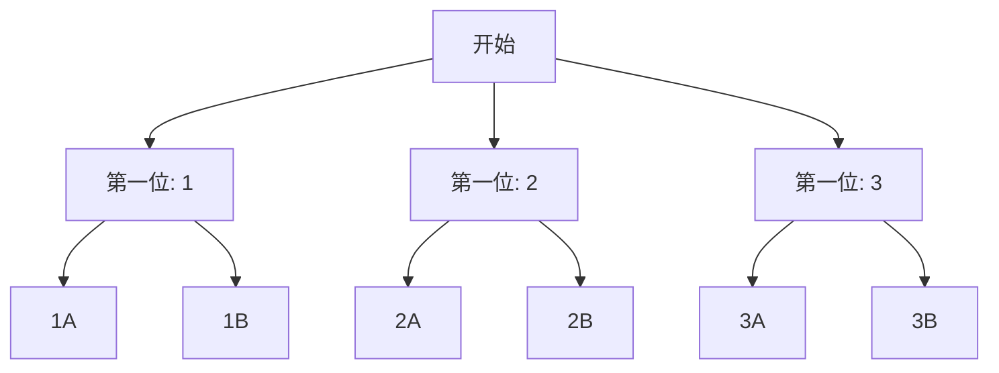

# 加法原理与乘法原理

> **所属路径**：`00_高中复习/01_数学基础/08_排列组合/01_加法乘法原理`
> **预计学习时间**：45 分钟
> **难度等级**：⭐

---

## 前置知识

- [一元二次方程](../../01_代数与方程/01_一元二次方程/01_一元二次方程.md) — 基本的代数运算能力
- [等差数列](../../04_数列/01_等差数列/01_等差数列.md) — 对"有规律地列举"的思维基础

> 如果以上内容还不熟悉，建议先完成对应课程再继续。

---

## 学习目标

完成本节后，你将能够：

1. 区分"分类完成"和"分步完成"两种任务结构
2. 正确应用加法原理和乘法原理进行计数
3. 使用树形图辅助分析复杂的计数问题
4. 理解这两个原理在人工智能中特征组合与参数搜索的意义

---

## 正文讲解

### 1. 从一个日常问题出发

假设你要从家去学校，可以坐公交（有 3 条线路）或者骑自行车（有 2 条路线）。一共有多少种方式到学校？

你的直觉可能会说：$3 + 2 = 5$ 种。没错！因为坐公交和骑自行车是两种**不同类别**的方案，每一类内部的选择互不影响，我们只需要把各类的方案数加起来。

这就是 **[加法原理（Addition Principle）](../01_加法乘法原理/)** 的核心思想。

### 2. 加法原理的正式定义

如果完成一件事有 $n$ 类不同的方式，第 $1$ 类有 $m_1$ 种方案，第 $2$ 类有 $m_2$ 种方案，……，第 $n$ 类有 $m_n$ 种方案，并且**各类方案之间没有重叠**，那么完成这件事的总方案数为：

$$
N = m_1 + m_2 + \cdots + m_n
$$

> **直觉解读**：加法原理用于"分类"——做一件事有多种**独立的途径**，每条途径各算各的，最后把所有途径的方案数加起来。

关键词是**"或"**：坐公交**或**骑车，选方案 A **或**方案 B。只要看到"或"，就想到加法。

### 3. 乘法原理的引入

现在换一个场景：你要设置一个两位数的密码，第一位从 $\{1, 2, 3\}$ 中选，第二位从 $\{A, B\}$ 中选。一共有多少种密码？

我们可以逐一列举：$1A, 1B, 2A, 2B, 3A, 3B$，共 $3 \times 2 = 6$ 种。这里设密码需要**两步**——先选第一位，再选第二位，每一步的选择数相乘就是总数。

这就是 **[乘法原理（Multiplication Principle）](../01_加法乘法原理/)** 。

### 4. 乘法原理的正式定义

如果完成一件事需要分 $n$ 个步骤，第 $1$ 步有 $m_1$ 种选择，第 $2$ 步有 $m_2$ 种选择，……，第 $n$ 步有 $m_n$ 种选择，并且**各步骤的选择相互独立**，那么完成这件事的总方案数为：

$$
N = m_1 \times m_2 \times \cdots \times m_n
$$

> **直觉解读**：乘法原理用于"分步"——做一件事必须**依次完成若干步**，每一步的选择独立，总方案数就是各步选择数的乘积。

关键词是**"且"**：先选第一位**且**再选第二位。只要看到"且"、"然后"、"接着"，就想到乘法。

### 5. 树形图——直观的计数工具

当问题稍微复杂一些时，画一棵 **树形图（Tree Diagram）** 可以帮助你清晰地看到所有可能性。

以上面的密码问题为例：



> 📌 **图解说明**：树形图的每一层对应一个步骤，每个分支对应该步骤的一种选择。叶子节点的总数就是总方案数。这里有 $3 \times 2 = 6$ 个叶子，对应 6 种密码。

树形图的好处在于：它能让你直观地看到是否有遗漏或重复，也能清楚地区分"分类"和"分步"的结构。

### 6. 加法与乘法的混合使用

实际问题中，加法原理和乘法原理往往需要组合使用。

**例题**：从 $A$ 城到 $B$ 城，可以坐火车（2 班）或飞机（1 班）；从 $B$ 城到 $C$ 城，可以坐汽车（3 班）或轮船（2 班）。从 $A$ 经 $B$ 到 $C$ 共有多少种走法？

**分析**：从 $A$ 到 $C$ 需要**两步**（先到 $B$，再到 $C$），这是乘法原理。而每一步内部有**多类**选择（火车或飞机、汽车或轮船），这是加法原理。

- 第一步（$A \to B$）：$2 + 1 = 3$ 种
- 第二步（$B \to C$）：$3 + 2 = 5$ 种
- 总方案数：$3 \times 5 = 15$ 种

### 7. 与人工智能的联系

在机器学习中，**超参数搜索（Hyperparameter Search）** 就是乘法原理的直接应用。假设你要调一个模型，学习率有 5 种选择，隐藏层大小有 4 种选择，批大小有 3 种选择，那么网格搜索（Grid Search）需要尝试的组合总数是：

$$
5 \times 4 \times 3 = 60 \text{ 种}
$$

当超参数很多时，组合数会呈指数级增长——这就是所谓的 **"组合爆炸"** ，也是为什么实际中常用随机搜索或贝叶斯优化来替代穷举的原因。

---

## 动手实践

学会了加法原理和乘法原理，我们来用 Python 验证一下：

```python
# 文件：code/counting_principles.py
# 用树形图思路枚举所有密码组合，验证乘法原理

first_digits = [1, 2, 3]
second_chars = ['A', 'B']

# 方法1：逐一枚举（树形图的叶子节点）
all_passwords = []
for d in first_digits:
    for c in second_chars:
        all_passwords.append(f"{d}{c}")

print("所有密码：", all_passwords)
print(f"总数（枚举）：{len(all_passwords)}")

# 方法2：乘法原理直接计算
total = len(first_digits) * len(second_chars)
print(f"总数（乘法原理）：{total}")

# 验证两种方法一致
assert len(all_passwords) == total, "计数不一致！"
print("✅ 枚举结果与乘法原理一致")
```

**运行说明**：
- 环境要求：Python 3.10+
- 运行命令：`python code/counting_principles.py`

**预期输出**：
```
所有密码：['1A', '1B', '2A', '2B', '3A', '3B']
总数（枚举）：6
总数（乘法原理）：6
✅ 枚举结果与乘法原理一致
```

下面再看一个模拟超参数搜索空间的例子：

```python
# 文件：code/hyperparameter_grid.py
# 模拟机器学习超参数网格搜索的组合数

from itertools import product

learning_rates = [0.001, 0.01, 0.1, 0.5, 1.0]
hidden_sizes = [32, 64, 128, 256]
batch_sizes = [16, 32, 64]

# 乘法原理计算总数
total = len(learning_rates) * len(hidden_sizes) * len(batch_sizes)
print(f"超参数搜索空间大小：{total} 种组合")

# 用 itertools.product 生成所有组合
all_combos = list(product(learning_rates, hidden_sizes, batch_sizes))
print(f"实际枚举数量：{len(all_combos)}")
print(f"前 5 种组合：{all_combos[:5]}")
```

**预期输出**：
```
超参数搜索空间大小：60 种组合
实际枚举数量：60
前 5 种组合：[(0.001, 32, 16), (0.001, 32, 32), (0.001, 32, 64), (0.001, 64, 16), (0.001, 64, 32)]
```

从代码中可以看到，Python 的 `itertools.product` 本质上就是在执行乘法原理的枚举过程。

---

## 典型误区

| 误区 | 正确理解 |
| ---- | -------- |
| 分不清什么时候用加法、什么时候用乘法 | 关键看任务结构：**分类**（"或"）用加法，**分步**（"且"/"然后"）用乘法 |
| 加法原理中各类方案有重叠却直接相加 | 加法原理的前提是各类**互不重叠**，若有重叠需用容斥原理修正 |
| 乘法原理中各步选择不独立却直接相乘 | 如果后一步的选择数依赖于前一步的结果，需要分情况讨论，不能直接相乘 |
| 把"至少/至多"问题直接计数 | "至少"问题通常用"总数 - 一个都没有"的补集法更方便 |

---

## 练习题

### 练习 1：交通方式（难度：⭐）

从甲地到乙地有 4 班火车、2 班飞机；从乙地到丙地有 3 班汽车。从甲地经乙地到丙地共有多少种走法？

<details>
<summary>💡 提示</summary>

先用加法原理算甲→乙的方案数，再用乘法原理算甲→乙→丙的总数。

</details>

<details>
<summary>✅ 参考答案</summary>

甲→乙：$4 + 2 = 6$ 种（加法原理，火车或飞机）

甲→乙→丙：$6 \times 3 = 18$ 种（乘法原理，先到乙再到丙）

</details>

### 练习 2：三位数密码（难度：⭐）

用数字 $0\text{-}9$ 设置一个三位数密码（每位可重复），共有多少种不同的密码？

<details>
<summary>💡 提示</summary>

设密码分三步：选第一位、选第二位、选第三位，每步有 10 种选择。

</details>

<details>
<summary>✅ 参考答案</summary>

$$10 \times 10 \times 10 = 1000 \text{ 种}$$

</details>

### 练习 3：着装搭配（难度：⭐⭐）

小明有 3 件上衣、4 条裤子和 2 双鞋。如果每天必须穿一套完整的衣服（上衣 + 裤子 + 鞋），共有多少种不同的搭配？如果他再买了 2 件外套，每天可以选择"穿外套"或"不穿外套"，搭配数变成多少？

<details>
<summary>💡 提示</summary>

第一问用乘法原理。第二问注意"穿外套"有 2 种选择，"不穿外套"是 1 种选择，合在一起是 $2 + 1 = 3$ 种，再与其他搭配相乘。

</details>

<details>
<summary>✅ 参考答案</summary>

第一问：$3 \times 4 \times 2 = 24$ 种

第二问：外套有 3 种状态（穿第 1 件、穿第 2 件、不穿），所以总搭配数为 $3 \times 4 \times 2 \times 3 = 72$ 种

</details>

---

## 下一步学习

- 📖 下一个知识点：[排列组合公式](../02_排列组合公式/02_排列组合公式.md) — 将加法乘法原理升级为公式化工具
- 🔗 相关知识点：[古典概率](../../09_概率基础/01_古典概率/) — 加法乘法原理是计算古典概率的核心工具
- 🔗 相关知识点：[等差数列](../../04_数列/01_等差数列/01_等差数列.md) — 数列中的求和与计数思维相通

---

## 参考资料

1. [Khan Academy - Counting principle](https://www.khanacademy.org/math/cc-seventh-grade-math/cc-7th-probability-statistics/cc-7th-counting-principle/v/counting-outcomes-using-a-tree-diagram) — 可汗学院的计数原理视频讲解（公开课程）
2. [Mathematics LibreTexts - The Multiplication and Addition Principles](https://math.libretexts.org/Bookshelves/Combinatorics_and_Discrete_Mathematics/Applied_Combinatorics_(Keller_and_Trotter)/02%3A_Strings_Sets_and_Binomial_Coefficients/2.01%3A_Strings) — 开源教材中的计数原理章节（CC BY 许可）
3. [Wikipedia - Rule of product](https://en.wikipedia.org/wiki/Rule_of_product) — 维基百科关于乘法原理的条目（公共知识库）
