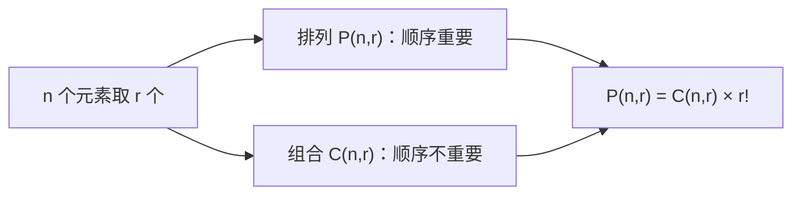

# 排列组合公式

> **所属路径**：`00_高中复习/01_数学基础/08_排列组合/02_排列组合公式`
> **预计学习时间**：50 分钟
> **难度等级**：⭐⭐

---

## 前置知识

- [加法乘法原理](../01_加法乘法原理/01_加法乘法原理.md) — 排列组合公式的推导基础
- [幂运算与根式](../../01_代数与方程/04_幂运算与根式/04_幂运算与根式.md) — 阶乘涉及连乘运算

> 如果以上内容还不熟悉，建议先完成对应课程再继续。

---

## 学习目标

完成本节后，你将能够：

1. 解释阶乘的定义与意义
2. 推导并应用排列数公式 $P(n, r)$
3. 推导并应用组合数公式 $C(n, r)$
4. 区分排列问题和组合问题的关键判据——"顺序是否重要"
5. 理解排列组合在 AI 特征选择中的意义

---

## 正文讲解

### 1. 从"选人站队"到"选人组队"

想象学校要从 5 名同学中选 3 人参加接力赛。接力赛中跑第一棒、第二棒、第三棒的顺序不同，比赛结果就不同——所以这是一个**顺序重要**的问题。

但如果是选 3 人组成学习小组呢？小组里不分先后，只关心"选了谁"——这就是**顺序不重要**的问题。

前者就是 **[排列（Permutation）](../02_排列组合公式/)** ，后者就是 **[组合（Combination）](../02_排列组合公式/)** 。这两个概念是本节的核心。

### 2. 阶乘——排列的基石

在引入公式之前，我们需要先认识一个重要的数学工具：**阶乘（Factorial）** 。

$n$ 的阶乘记作 $n!$ ，定义为从 $1$ 乘到 $n$ 的连乘积：

$$
n! = n \times (n-1) \times (n-2) \times \cdots \times 2 \times 1
$$

例如：$5! = 5 \times 4 \times 3 \times 2 \times 1 = 120$ 。

特别规定 $0! = 1$ 。这看起来有点奇怪，但它的好处是让很多公式在边界情况下仍然成立。

> **直觉解读**：$n!$ 的含义是"把 $n$ 个不同的东西排成一排，共有多少种排法"。第 1 个位置有 $n$ 种选择，第 2 个位置有 $n-1$ 种选择……用乘法原理，总数就是 $n!$ 。

### 3. 排列数公式

回到"从 5 人中选 3 人跑接力"的问题。用乘法原理逐步分析：

- 选第一棒：5 人中选 1 人，$5$ 种
- 选第二棒：剩 4 人中选 1 人，$4$ 种
- 选第三棒：剩 3 人中选 1 人，$3$ 种

总排列数 $= 5 \times 4 \times 3 = 60$ 。

一般地，从 $n$ 个不同元素中取出 $r$ 个，按**一定顺序**排列，方案数称为 **排列数** ，记作 $P(n, r)$（也常写作 $A_n^r$）：

$$
P(n, r) = n \times (n-1) \times (n-2) \times \cdots \times (n-r+1) = \frac{n!}{(n-r)!}
$$

> **直觉解读**：公式就是从 $n$ 开始连乘 $r$ 个递减的整数。分母 $(n-r)!$ 的作用是把多余的部分"截断"。

特别地，当 $r = n$ 时，$P(n, n) = n!$ ，即 $n$ 个元素的全排列。

### 4. 组合数公式

现在来解决"从 5 人中选 3 人组成小组"的问题。

我们已经知道排列数 $P(5, 3) = 60$ ，但这里面每个小组被重复计算了——因为同样的 3 个人（比如 A、B、C）在排列中产生了 $3! = 6$ 种不同的排列（ABC、ACB、BAC、BCA、CAB、CBA），但在组合中它们算同一个小组。

所以，**组合数** $= $ 排列数 $\div$ 内部排列数：

$$
C(n, r) = \frac{P(n, r)}{r!} = \frac{n!}{r!(n-r)!}
$$

> **直觉解读**：组合就是"不计顺序的排列"。先按排列数算出所有可能，再除以内部重复的排列数 $r!$ 。

代入数值：$C(5, 3) = \dfrac{60}{6} = 10$ 种。

组合数也常写作 $\binom{n}{r}$ ，读作"$n$ 选 $r$"。

### 5. 排列与组合的关系

我们可以用一张图清晰地展示它们的关系：



> 📌 **图解说明**：排列 = 组合 × 内部排列数。判断一个问题是排列还是组合，关键就看"调换被选对象的顺序，是否算不同方案"。

### 6. 组合数的重要性质

组合数有两个非常有用的性质：

**对称性**：

$$
C(n, r) = C(n, n-r)
$$

> 选 $r$ 个拿走，等于选 $n-r$ 个留下。

**递推关系（杨辉三角性质）**：

$$
C(n, r) = C(n-1, r-1) + C(n-1, r)
$$

> 对于某个特定元素，要么选它（从剩余 $n-1$ 中再选 $r-1$ 个），要么不选它（从剩余 $n-1$ 中选 $r$ 个）。

这个递推关系正是 **杨辉三角（Pascal's Triangle）** 的构造规则，我们将在下一节详细讨论。

### 7. 与人工智能的联系

在机器学习的 **特征选择（Feature Selection）** 中，如果你有 $n$ 个候选特征，想选出最佳的 $k$ 个特征子集，那么需要考虑的方案数就是 $C(n, k)$ 。例如，从 20 个特征中选 5 个，方案数为：

$$
C(20, 5) = \frac{20!}{5! \times 15!} = 15504
$$

这说明即使只有 20 个特征，穷举搜索也已经需要评估上万个子集。当特征数达到数百甚至数千时，$C(n, k)$ 会大到天文数字——这也是为什么 AI 中常用贪心算法、L1 正则化等方法来近似特征选择，而非暴力枚举。

---

## 动手实践

让我们用 Python 来计算排列数和组合数，并验证公式：

```python
# 文件：code/permutation_combination.py
# 计算排列数和组合数，验证公式

import math

def permutation(n, r):
    """排列数 P(n, r) = n! / (n-r)!"""
    return math.factorial(n) // math.factorial(n - r)

def combination(n, r):
    """组合数 C(n, r) = n! / (r! * (n-r)!)"""
    return math.factorial(n) // (math.factorial(r) * math.factorial(n - r))

# 示例：从 5 人中选 3 人
n, r = 5, 3
print(f"P({n},{r}) = {permutation(n, r)}")   # 排列：60
print(f"C({n},{r}) = {combination(n, r)}")   # 组合：10

# 验证关系：P(n,r) = C(n,r) * r!
assert permutation(n, r) == combination(n, r) * math.factorial(r)
print(f"✅ P({n},{r}) = C({n},{r}) × {r}! 验证通过")

# 验证对称性：C(n,r) = C(n, n-r)
assert combination(n, r) == combination(n, n - r)
print(f"✅ C({n},{r}) = C({n},{n-r}) 对称性验证通过")

# AI 场景：从 20 个特征中选 5 个的方案数
features, select = 20, 5
print(f"\n从 {features} 个特征中选 {select} 个子集数：{combination(features, select)}")
```

**运行说明**：
- 环境要求：Python 3.10+（仅使用标准库 `math`）
- 运行命令：`python code/permutation_combination.py`

**预期输出**：
```
P(5,3) = 60
C(5,3) = 10
✅ P(5,3) = C(5,3) × 3! 验证通过
✅ C(5,3) = C(5,2) 对称性验证通过

从 20 个特征中选 5 个子集数：15504
```

代码验证了我们推导的所有公式关系。Python 的 `math.factorial` 函数直接提供了阶乘计算，`math.comb(n, r)` 也可以直接计算组合数。

---

## 典型误区

| 误区 | 正确理解 |
| ---- | -------- |
| 分不清排列和组合 | 问自己一个问题：**"调换顺序算不算不同方案？"** 算→排列，不算→组合 |
| 认为 $0! = 0$ | $0! = 1$ ，这是规定，也是为了让公式在边界情况成立 |
| 组合数计算时遗忘分母的 $r!$ | $C(n,r)$ 的分母是 $r!$ **乘以** $(n-r)!$ ，不是 $r!$ **加** $(n-r)!$ |
| 把可重复选择与不重复选择混淆 | 标准排列组合公式假设**不放回**（即每个元素最多选一次），有放回的情况需要另行处理 |

---

## 练习题

### 练习 1：排列计算（难度：⭐）

从 8 名运动员中选 4 人参加 $4 \times 100$ 米接力赛（需分配棒次），共有多少种选法？

<details>
<summary>💡 提示</summary>

棒次不同意味着顺序重要，这是排列问题。

</details>

<details>
<summary>✅ 参考答案</summary>

$$P(8, 4) = 8 \times 7 \times 6 \times 5 = 1680 \text{ 种}$$

</details>

### 练习 2：组合计算（难度：⭐）

从 10 首歌中选 3 首做成歌单（歌单不分顺序），共有多少种选法？

<details>
<summary>💡 提示</summary>

歌单不分顺序，这是组合问题，用 $C(10, 3)$ 。

</details>

<details>
<summary>✅ 参考答案</summary>

$$C(10, 3) = \dfrac{10!}{3! \times 7!} = \dfrac{10 \times 9 \times 8}{3 \times 2 \times 1} = 120 \text{ 种}$$

</details>

### 练习 3：排列与组合的区分（难度：⭐⭐）

判断以下问题是排列还是组合，并计算结果：
- (a) 从 6 本不同的书中选 2 本送给两位朋友（每人一本）
- (b) 从 6 本不同的书中选 2 本放入书包

<details>
<summary>💡 提示</summary>

(a) 中两位朋友是不同的人，"谁拿哪本"有区别；(b) 中只关心选了哪 2 本。

</details>

<details>
<summary>✅ 参考答案</summary>

(a) 排列问题：$P(6, 2) = 6 \times 5 = 30$ 种

(b) 组合问题：$C(6, 2) = \dfrac{6 \times 5}{2 \times 1} = 15$ 种

注意 (a) 恰好是 (b) 的 $2! = 2$ 倍，这正是 $P(n,r) = C(n,r) \times r!$ 的体现。

</details>

### 练习 4：特征选择（难度：⭐⭐）

一个机器学习数据集有 15 个特征，你想选出最佳的 4 个特征子集。需要评估多少个不同的子集？如果评估每个子集需要 0.1 秒，总共需要多长时间？

<details>
<summary>💡 提示</summary>

特征子集不分顺序，用组合数。然后用总子集数乘以单次评估时间。

</details>

<details>
<summary>✅ 参考答案</summary>

$$C(15, 4) = \dfrac{15!}{4! \times 11!} = \dfrac{15 \times 14 \times 13 \times 12}{4 \times 3 \times 2 \times 1} = 1365 \text{ 个子集}$$

总时间：$1365 \times 0.1 = 136.5$ 秒 $\approx 2.3$ 分钟。

</details>

---

## 下一步学习

- 📖 下一个知识点：[二项式定理初步](../03_二项式定理初步/03_二项式定理初步.md) — 组合数在代数展开中的精彩应用
- 🔗 相关知识点：[古典概率](../../09_概率基础/01_古典概率/) — 概率计算需要用排列组合来数"有利结果数"和"总结果数"
- 🔗 相关知识点：[等比数列](../../04_数列/02_等比数列/02_等比数列.md) — 阶乘的增长速度远超等比数列

---

## 参考资料

1. [Khan Academy - Permutations and Combinations](https://www.khanacademy.org/math/statistics-probability/counting-permutations-and-combinations) — 可汗学院排列组合专题（公开课程）
2. [Mathematics LibreTexts - Combinations and Permutations](https://math.libretexts.org/Bookshelves/Combinatorics_and_Discrete_Mathematics/Applied_Combinatorics_(Keller_and_Trotter)/02%3A_Strings_Sets_and_Binomial_Coefficients/2.02%3A_Permutations) — 开源组合数学教材（CC BY 许可）
3. [Wikipedia - Permutation](https://en.wikipedia.org/wiki/Permutation) — 维基百科排列条目（公共知识库）
