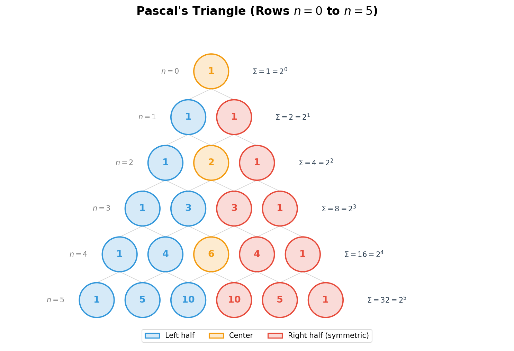

# 二项式定理初步

> **所属路径**：`00_高中复习/01_数学基础/08_排列组合/03_二项式定理初步`
> **预计学习时间**：50 分钟
> **难度等级**：⭐⭐

---

## 前置知识

- [排列组合公式](../02_排列组合公式/02_排列组合公式.md) — 组合数 $C(n, r)$ 的定义与计算
- [幂运算与根式](../../01_代数与方程/04_幂运算与根式/04_幂运算与根式.md) — 幂的运算法则

> 如果以上内容还不熟悉，建议先完成对应课程再继续。

---

## 学习目标

完成本节后，你将能够：

1. 写出 $(a+b)^n$ 的二项式展开式
2. 理解二项式系数与组合数的关系
3. 利用杨辉三角快速获取二项式系数
4. 求展开式中的特定项（如常数项、含 $x^k$ 的项）
5. 理解二项式定理与概率中二项分布的联系

---

## 正文讲解

### 1. 从简单展开中发现规律

我们先回顾几个熟悉的展开：

$$
(a+b)^1 = a + b
$$

$$
(a+b)^2 = a^2 + 2ab + b^2
$$

$$
(a+b)^3 = a^3 + 3a^2b + 3ab^2 + b^3
$$

仔细观察这些系数：$1$ ；$1, 2, 1$ ；$1, 3, 3, 1$ ——它们似乎有某种规律。事实上，这些系数正是组合数！比如 $(a+b)^3$ 的系数依次是 $C(3,0) = 1$ ，$C(3,1) = 3$ ，$C(3,2) = 3$ ，$C(3,3) = 1$ 。

为什么会这样呢？想象把 $(a+b)^3 = (a+b)(a+b)(a+b)$ 完全展开：每个括号中你要么选 $a$ ，要么选 $b$ ，三个括号一共有 $2^3 = 8$ 种选法。其中，选了 $k$ 个 $b$ （另外 $3-k$ 个选 $a$ ）的方法数恰好是 $C(3, k)$ ——因为你要从 3 个括号中"挑选" $k$ 个来贡献 $b$ 。

### 2. 二项式定理的正式表述

基于上面的直觉，我们可以写出 **[二项式定理（Binomial Theorem）](../03_二项式定理初步/)** 的一般形式：

$$
(a+b)^n = \sum_{r=0}^{n} C(n, r) \, a^{n-r} \, b^r
$$

也就是：

$$
(a+b)^n = C(n,0)a^n + C(n,1)a^{n-1}b + C(n,2)a^{n-2}b^2 + \cdots + C(n,n)b^n
$$

> **直觉解读**：展开式一共有 $n+1$ 项。第 $r+1$ 项的系数是 $C(n,r)$ ，$a$ 的幂次从 $n$ 递减到 $0$ ，$b$ 的幂次从 $0$ 递增到 $n$ ，每一项中 $a$ 和 $b$ 的幂次之和始终等于 $n$ 。

我们把 $C(n, r)$ 称为 **二项式系数（Binomial Coefficient）** 。

### 3. 杨辉三角

**[杨辉三角（Pascal's Triangle）](../03_二项式定理初步/)** 是一种用三角形排列数字的方式，其中每个数等于它上方两个数之和：

```
         1                    n=0
        1 1                   n=1
       1 2 1                  n=2
      1 3 3 1                 n=3
     1 4 6 4 1                n=4
    1 5 10 10 5 1             n=5
```

> 📌 **图解说明**：杨辉三角的第 $n$ 行（从第 $0$ 行开始）正是 $(a+b)^n$ 的二项式系数。例如第 $4$ 行 $1, 4, 6, 4, 1$ 对应 $(a+b)^4 = a^4 + 4a^3b + 6a^2b^2 + 4ab^3 + b^4$ 。

下面这张图展示了杨辉三角的对称性和每行系数之和的规律：



> 📌 **图解说明**：杨辉三角前 6 行（ $n=0$ 到 $n=5$ ）的可视化。蓝色为左半部分，红色为右半部分，橙色为中心元素，体现了 $C(n, k) = C(n, n-k)$ 的对称性。右侧标注了每行之和 $= 2^n$ 。你可以运行 `code/plot_pascal_triangle.py` 自行生成这张图。

杨辉三角的构造规则正是上一节学到的组合数递推关系：

$$
C(n, r) = C(n-1, r-1) + C(n-1, r)
$$

### 4. 通项公式与特定项

展开式的第 $r+1$ 项（称为 **通项** ）为：

$$
T_{r+1} = C(n, r) \, a^{n-r} \, b^r \quad (r = 0, 1, 2, \ldots, n)
$$

利用通项公式，我们可以直接找到展开式中的某一项，而不需要把整个式子都展开。

**例题**：求 $(2x + 1)^5$ 展开式中 $x^3$ 的系数。

**分析**：这里 $a = 2x$ ，$b = 1$ ，$n = 5$ 。通项为：

$$
T_{r+1} = C(5, r) \cdot (2x)^{5-r} \cdot 1^r = C(5, r) \cdot 2^{5-r} \cdot x^{5-r}
$$

要求 $x^3$ 的项，令 $5 - r = 3$ ，得 $r = 2$ 。

$$
T_3 = C(5, 2) \cdot 2^3 \cdot x^3 = 10 \times 8 \times x^3 = 80x^3
$$

所以 $x^3$ 的系数是 $80$ 。

### 5. 二项式定理的几个重要推论

在通用公式中取特殊值，可以得到有用的结论：

**令 $a = b = 1$**：

$$
2^n = \sum_{r=0}^{n} C(n, r) = C(n,0) + C(n,1) + \cdots + C(n,n)
$$

> 含义：$n$ 个元素的全部子集数目是 $2^n$ 。

**令 $a = 1, b = -1$**：

$$
0 = \sum_{r=0}^{n} (-1)^r C(n, r)
$$

> 含义：二项式系数中，奇数位的系数之和等于偶数位的系数之和，都等于 $2^{n-1}$ 。

### 6. 与人工智能的联系

二项式定理在 AI 中有多处应用：

- **二项分布（Binomial Distribution）**：一个事件做 $n$ 次独立试验，每次成功概率为 $p$ ，恰好成功 $k$ 次的概率是 $C(n,k) p^k (1-p)^{n-k}$ 。这正是二项式 $(p + (1-p))^n$ 展开的第 $k$ 项。
- **模型集成（Ensemble）**：如果有 $n$ 个基分类器，要选 $k$ 个进行投票，子集数 $C(n,k)$ 就是二项式系数。
- **子集总数**：一个有 $n$ 个特征的数据集，其所有特征子集的数目为 $2^n = \sum C(n,r)$ ，这正是二项式系数之和。

---

## 动手实践

让我们用 Python 生成杨辉三角并验证二项式展开：

```python
# 文件：code/binomial_theorem.py
# 生成杨辉三角并验证二项式定理

import math

def pascal_triangle(n_rows):
    """生成杨辉三角的前 n_rows 行"""
    triangle = []
    for n in range(n_rows):
        row = [math.comb(n, r) for r in range(n + 1)]
        triangle.append(row)
    return triangle

# 打印杨辉三角的前 7 行
print("杨辉三角（前 7 行）：")
triangle = pascal_triangle(7)
for i, row in enumerate(triangle):
    padding = "  " * (6 - i)
    numbers = "  ".join(f"{x:>2}" for x in row)
    print(f"{padding}{numbers}")

# 验证：每行之和 = 2^n
print("\n验证每行之和 = 2^n：")
for n, row in enumerate(triangle):
    row_sum = sum(row)
    print(f"  第 {n} 行之和 = {row_sum} = 2^{n} ✅" if row_sum == 2**n else f"  第 {n} 行 ❌")

# 求 (2x+1)^5 中 x^3 的系数
n = 5
r = 2  # 5 - r = 3 => r = 2
coeff = math.comb(n, r) * (2 ** (n - r))
print(f"\n(2x+1)^5 中 x^3 的系数 = C(5,2) × 2^3 = {coeff}")
```

**运行说明**：
- 环境要求：Python 3.10+（仅使用标准库 `math`）
- 运行命令：`python code/binomial_theorem.py`

**预期输出**：
```
杨辉三角（前 7 行）：
             1
           1   1
         1   2   1
       1   3   3   1
     1   4   6   4   1
   1   5  10  10   5   1
 1   6  15  20  15   6   1

验证每行之和 = 2^n：
  第 0 行之和 = 1 = 2^0 ✅
  第 1 行之和 = 2 = 2^1 ✅
  第 2 行之和 = 4 = 2^2 ✅
  第 3 行之和 = 9 = 2^3 ✅
  第 4 行之和 = 16 = 2^4 ✅
  第 5 行之和 = 32 = 2^5 ✅
  第 6 行之和 = 64 = 2^6 ✅

(2x+1)^5 中 x^3 的系数 = C(5,2) × 2^3 = 80
```

---

## 典型误区

| 误区 | 正确理解 |
| ---- | -------- |
| 展开式有 $n$ 项 | 展开式有 $n+1$ 项（$r$ 从 $0$ 取到 $n$） |
| 通项中 $r$ 的起始值搞错 | $T_{r+1}$ 对应的 $r$ 从 $0$ 开始，第 1 项对应 $r=0$ |
| 求特定项时忘记将 $a$ 的幂也代入 | 例如 $(2x+1)^5$ 中 $a = 2x$ ，$a^{n-r}$ 包含系数 $2^{n-r}$ 和变量 $x^{n-r}$ |
| 以为杨辉三角只是"好看的数字排列" | 杨辉三角蕴含丰富的数学性质：对称性、各行之和为 $2^n$ 、对角线上是组合数等 |

---

## 练习题

### 练习 1：直接展开（难度：⭐）

写出 $(x + 2)^4$ 的展开式。

<details>
<summary>💡 提示</summary>

利用二项式定理，令 $a = x$ ，$b = 2$ ，$n = 4$ ，逐项写出。

</details>

<details>
<summary>✅ 参考答案</summary>

$$(x+2)^4 = C(4,0)x^4 + C(4,1)x^3 \cdot 2 + C(4,2)x^2 \cdot 4 + C(4,3)x \cdot 8 + C(4,4) \cdot 16$$$$= x^4 + 8x^3 + 24x^2 + 32x + 16$$

</details>

### 练习 2：求特定项系数（难度：⭐⭐）

求 $(3x - 1)^6$ 展开式中 $x^4$ 的系数。

<details>
<summary>💡 提示</summary>

令 $a = 3x$ ，$b = -1$ ，$n = 6$ 。通项 $T_{r+1} = C(6,r)(3x)^{6-r}(-1)^r$ 。令 $6-r=4$ 得 $r=2$ 。

</details>

<details>
<summary>✅ 参考答案</summary>

$$T_3 = C(6,2) \cdot (3x)^4 \cdot (-1)^2 = 15 \times 81x^4 \times 1 = 1215x^4$$

$x^4$ 的系数为 $1215$ 。

</details>

### 练习 3：利用推论（难度：⭐⭐）

利用二项式定理证明：$C(n,0) + C(n,1) + C(n,2) + \cdots + C(n,n) = 2^n$ 。

<details>
<summary>💡 提示</summary>

在 $(a+b)^n$ 的展开式中令 $a = 1$ ，$b = 1$ 。

</details>

<details>
<summary>✅ 参考答案</summary>

将 $a = 1$ ，$b = 1$ 代入二项式定理：

$$(1+1)^n = \sum_{r=0}^{n} C(n,r) \cdot 1^{n-r} \cdot 1^r = \sum_{r=0}^{n} C(n,r)$$

∴ $C(n,0) + C(n,1) + \cdots + C(n,n) = 2^n$ 。 $\square$

</details>

---

## 下一步学习

- 📖 下一个知识点：[常见计数模型](../04_常见计数模型/04_常见计数模型.md) — 将排列组合应用于更复杂的实际问题
- 🔗 相关知识点：[古典概率](../../09_概率基础/01_古典概率/) — 二项式系数直接用于计算二项分布概率
- 🔗 相关知识点：[等差数列](../../04_数列/01_等差数列/01_等差数列.md) — 杨辉三角中蕴含的数列规律

---

## 参考资料

1. [Khan Academy - Binomial theorem](https://www.khanacademy.org/math/precalculus/x9e81a4f98389efdf:polynomials/x9e81a4f98389efdf:binomial/v/binomial-theorem) — 可汗学院二项式定理视频讲解（公开课程）
2. [Wikipedia - Binomial theorem](https://en.wikipedia.org/wiki/Binomial_theorem) — 维基百科二项式定理条目（公共知识库）
3. [Wikipedia - Pascal's triangle](https://en.wikipedia.org/wiki/Pascal%27s_triangle) — 维基百科杨辉三角条目（公共知识库）
