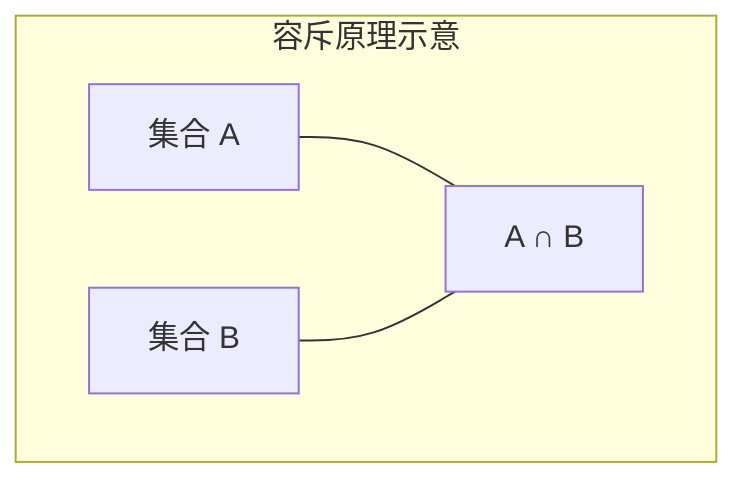

# 常见计数模型

> **所属路径**：`00_高中复习/01_数学基础/08_排列组合/04_常见计数模型`
> **预计学习时间**：50 分钟
> **难度等级**：⭐⭐

---

## 前置知识

- [加法乘法原理](../01_加法乘法原理/01_加法乘法原理.md) — 分类与分步思想
- [排列组合公式](../02_排列组合公式/02_排列组合公式.md) — 排列数与组合数的计算
- [二项式定理初步](../03_二项式定理初步/03_二项式定理初步.md) — 组合数的性质与推论

> 如果以上内容还不熟悉，建议先完成对应课程再继续。

---

## 学习目标

完成本节后，你将能够：

1. 运用分配模型解决"物品分给人"的计数问题
2. 使用容斥原理处理集合重叠问题
3. 理解并应用鸽巢原理证明存在性结论
4. 将这些模型与 AI 中的数据划分、去重、集合运算联系起来

---

## 正文讲解

### 1. 分配模型——物品怎么分？

前面我们学习的排列和组合都是"从一堆东西中选"的问题。但实际中还有一大类问题是"把东西**分配**给若干对象"。分配问题的分析方法取决于两个关键因素：**物品是否相同**、**接收者是否有区别**。

**情况一：不同物品分给不同人**

把 $n$ 件不同的礼物分给 $k$ 个人，每人恰好一件（$n = k$），方案数就是全排列 $n!$ 。

如果每人可以拿任意多件（$n$ 件礼物各自独立选择归属），每件礼物有 $k$ 种选择，由乘法原理得总方案数：

$$
k^n
$$

> **直觉解读**：每件物品独立选择一个"主人"，$n$ 件物品共做 $n$ 次独立选择。

这在 AI 中很常见——比如将 $n$ 个样本分成 $k$ 个类别，如果不加任何约束，就有 $k^n$ 种分法。

**情况二：相同物品分给不同人**

把 $n$ 个相同的球分给 $k$ 个不同的盒子，每个盒子至少 0 个球。这就是经典的 **隔板法（Stars and Bars）** 问题：

$$
C(n + k - 1, k - 1)
$$

> **直觉解读**：想象 $n$ 个球排成一排，中间有 $n-1$ 个间隙加上两端共 $n+1$ 个位置，我们要插入 $k-1$ 块隔板把球分成 $k$ 组。等价地，从 $n+k-1$ 个位置中选 $k-1$ 个放隔板。

### 2. 容斥原理——如何避免重复计数

在计数过程中，经常会遇到"满足条件 A 或条件 B"的问题。如果 A 和 B 有重叠，直接相加会重复计数。

**[容斥原理（Inclusion-Exclusion Principle）](../04_常见计数模型/)** 给出了修正方法：

对于两个集合：

$$
|A \cup B| = |A| + |B| - |A \cap B|
$$

> **直觉解读**：先加上 A 的，再加上 B 的，但 A 和 B 的交集被加了两次，所以要减去一次。

对于三个集合：

$$
|A \cup B \cup C| = |A| + |B| + |C| - |A \cap B| - |A \cap C| - |B \cap C| + |A \cap B \cap C|
$$



> 📌 **图解说明**：两个集合的并集等于各自大小之和减去交集大小。

**例题**：某班 40 人中，参加数学兴趣小组的有 25 人，参加编程兴趣小组的有 20 人，两个都参加的有 10 人。至少参加一个小组的有多少人？

$$
|数学 \cup 编程| = 25 + 20 - 10 = 35 \text{ 人}
$$

### 3. 鸽巢原理——简洁而强大的存在性工具

**[鸽巢原理（Pigeonhole Principle）](../04_常见计数模型/)** ，也叫抽屉原理，说的是：

> 如果将 $n+1$ 个物品放入 $n$ 个抽屉，那么至少有一个抽屉里有**两个或以上**的物品。

更一般地：将 $m$ 个物品放入 $n$ 个抽屉（$m > n$），则至少有一个抽屉中有 $\lceil m/n \rceil$ 个物品。

这个原理看似简单，却能证明许多不平凡的结论。

**例题**：在 13 个人中，至少有 2 人的生日在同一个月。

**证明**：一年有 12 个月（12 个"抽屉"），13 个人（13 个"物品"），$13 > 12$ ，由鸽巢原理，至少有两人在同一个月过生日。$\square$

### 4. 补集法——反向思维的计数技巧

有时候直接数"满足条件的"很困难，但数"不满足条件的"却很简单。这时候可以用 **补集法** ：

$$
\text{满足条件的方案数} = \text{总方案数} - \text{不满足条件的方案数}
$$

**例题**：从 $\{1, 2, 3, 4, 5\}$ 中选 3 个数，要求至少有一个偶数，有多少种选法？

- 总方案数：$C(5, 3) = 10$
- 全是奇数（不满足条件）：奇数有 $\{1, 3, 5\}$ 共 3 个，$C(3, 3) = 1$
- 至少有一个偶数：$10 - 1 = 9$ 种

### 5. 与人工智能的联系

这些计数模型在 AI 中有广泛的应用：

- **数据划分**：将 $n$ 条数据分成训练集、验证集、测试集，本质上就是分配模型。
- **容斥原理与去重**：在信息检索和推荐系统中，计算多个条件的并集查询结果需要用容斥原理避免重复。
- **鸽巢原理与哈希冲突**：如果有 $n$ 个数据映射到 $m$ 个哈希桶（$n > m$），鸽巢原理保证至少有一个桶产生冲突。这就是为什么哈希表需要冲突处理机制。
- **补集法与概率计算**：在概率论中，"至少发生一次"的概率通常用 $1 - P(\text{一次都不发生})$ 来计算，这正是补集法的思想。

---

## 动手实践

我们用 Python 来演示容斥原理和鸽巢原理：

```python
# 文件：code/counting_models.py
# 演示容斥原理与鸽巢原理

import random

# --- 容斥原理 ---
print("=== 容斥原理演示 ===")

# 100 以内能被 3 或 5 整除的数有多少个？
A = set(range(3, 101, 3))   # 能被 3 整除
B = set(range(5, 101, 5))   # 能被 5 整除

# 直接集合运算
union_direct = len(A | B)
# 容斥原理计算
union_formula = len(A) + len(B) - len(A & B)

print(f"|A| = {len(A)}（能被3整除）")
print(f"|B| = {len(B)}（能被5整除）")
print(f"|A ∩ B| = {len(A & B)}（能被15整除）")
print(f"|A ∪ B| = {len(A)} + {len(B)} - {len(A & B)} = {union_formula}")
print(f"直接计算验证：{union_direct}")
assert union_direct == union_formula
print("✅ 容斥原理验证通过\n")

# --- 鸽巢原理 ---
print("=== 鸽巢原理演示 ===")

# 模拟：13 个人的生日月份，至少有两人同月
random.seed(42)
n_people = 13
n_months = 12
birthdays = [random.randint(1, n_months) for _ in range(n_people)]
print(f"{n_people} 人的生日月份：{birthdays}")

# 检查是否有重复月份
from collections import Counter
month_counts = Counter(birthdays)
duplicates = {m: c for m, c in month_counts.items() if c >= 2}
print(f"出现重复的月份：{duplicates}")
print(f"鸽巢原理预测至少有1个月有≥2人，实际有 {len(duplicates)} 个月重复 ✅")
```

**运行说明**：
- 环境要求：Python 3.10+（仅使用标准库）
- 运行命令：`python code/counting_models.py`

**预期输出**：
```
=== 容斥原理演示 ===
|A| = 33（能被3整除）
|B| = 20（能被5整除）
|A ∩ B| = 6（能被15整除）
|A ∪ B| = 33 + 20 - 6 = 47
直接计算验证：47
✅ 容斥原理验证通过

=== 鸽巢原理演示 ===
13 人的生日月份：[11, 1, 8, 5, 11, 2, 9, 1, 8, 4, 11, 8, 4]
出现重复的月份：{11: 3, 1: 2, 8: 3, 4: 2}
鸽巢原理预测至少有1个月有≥2人，实际有 4 个月重复 ✅
```

代码清晰地验证了容斥原理的计算结果，也展示了鸽巢原理在随机数据中的必然性。

---

## 典型误区

| 误区 | 正确理解 |
| ---- | -------- |
| 容斥原理只能用于两个集合 | 容斥原理可推广到任意多个集合，交替加减所有交集 |
| 用鸽巢原理得出"一定恰好有 2 个" | 鸽巢原理只保证"至少有 2 个"，实际可能更多 |
| 隔板法中忘记"允许空盒"和"不允许空盒"的区别 | 允许空盒用 $C(n+k-1, k-1)$ ；不允许空盒需先给每个盒放 1 个，再用 $C(n-1, k-1)$ |
| 补集法忽略了"条件的反面" | 使用补集法时要确认"总数"和"反面"都算对了 |

---

## 练习题

### 练习 1：容斥原理（难度：⭐）

一个班 50 人，喜欢篮球的有 30 人，喜欢足球的有 25 人，两样都喜欢的有 15 人。两样都不喜欢的有多少人？

<details>
<summary>💡 提示</summary>

先用容斥原理算"至少喜欢一样"的人数，再用总数减去。

</details>

<details>
<summary>✅ 参考答案</summary>

至少喜欢一样：$30 + 25 - 15 = 40$ 人

两样都不喜欢：$50 - 40 = 10$ 人

</details>

### 练习 2：鸽巢原理（难度：⭐）

一个袋子里有红、黄、蓝三种颜色的球（每种至少 4 个）。至少要摸出多少个球，才能保证有 4 个球是同一颜色的？

<details>
<summary>💡 提示</summary>

考虑最坏情况：每种颜色各摸 3 个，仍然没有 4 个同色。再多摸一个就一定有了。

</details>

<details>
<summary>✅ 参考答案</summary>

最坏情况：每种颜色各 3 个，共 $3 \times 3 = 9$ 个。再摸 1 个，不管是什么颜色，必有一种颜色达到 4 个。

答案：至少 $9 + 1 = 10$ 个。

</details>

### 练习 3：补集法（难度：⭐⭐）

掷 3 枚骰子，点数之和不小于 4 的情况有多少种？（提示：用补集法更简便。）

<details>
<summary>💡 提示</summary>

总方案数 $= 6^3 = 216$ 。不满足条件的是"点数之和 $\leq 3$"，而每枚骰子至少为 1，三枚之和最小为 3。

</details>

<details>
<summary>✅ 参考答案</summary>

总方案数：$6^3 = 216$ 种

点数之和 $\leq 3$ ：三枚骰子各至少 1 点，最小和为 $1+1+1=3$ ，恰好等于 3 的只有一种（全是 1）。所以不满足的方案数为 $1$ 。

点数之和不小于 4：$216 - 1 = 215$ 种。

</details>

### 练习 4：隔板法（难度：⭐⭐）

将 10 个相同的苹果分给 3 个小朋友，每人至少 1 个，有多少种分法？

<details>
<summary>💡 提示</summary>

每人至少 1 个，先给每人分 1 个（消耗 3 个），剩余 7 个在 3 个人之间自由分配（允许为 0）。

</details>

<details>
<summary>✅ 参考答案</summary>

先给每人 1 个苹果，剩余 $10 - 3 = 7$ 个，分给 3 人（允许空）。

$$C(7 + 3 - 1, 3 - 1) = C(9, 2) = \dfrac{9 \times 8}{2 \times 1} = 36 \text{ 种}$$

</details>

---

## 下一步学习

- 📖 后续主题：[古典概率](../../09_概率基础/01_古典概率/) — 用排列组合计算各种事件的概率
- 📖 后续主题：[条件概率](../../09_概率基础/02_条件概率/) — 条件约束下的计数与概率
- 🔗 相关知识点：[集合运算](../../11_集合与逻辑/01_集合运算/) — 容斥原理的集合论基础

---

## 参考资料

1. [Mathematics LibreTexts - Inclusion-Exclusion](https://math.libretexts.org/Bookshelves/Combinatorics_and_Discrete_Mathematics/Applied_Combinatorics_(Keller_and_Trotter)/07%3A_Inclusion-Exclusion) — 开源教材容斥原理章节（CC BY 许可）
2. [Wikipedia - Pigeonhole principle](https://en.wikipedia.org/wiki/Pigeonhole_principle) — 维基百科鸽巢原理条目（公共知识库）
3. [Brilliant.org - Stars and Bars](https://brilliant.org/wiki/balls-into-bins-intro/) — Brilliant 平台隔板法讲解（公开资源）
4. [Wikipedia - Inclusion-exclusion principle](https://en.wikipedia.org/wiki/Inclusion%E2%80%93exclusion_principle) — 维基百科容斥原理条目（公共知识库）
