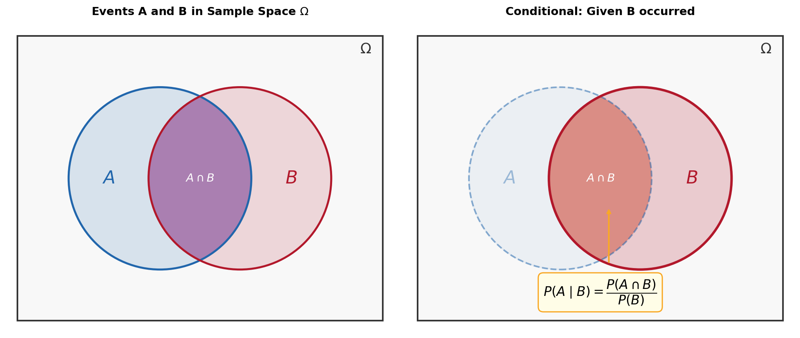

# 条件概率

> **所属路径**：`00_高中复习/01_数学基础/09_概率基础/02_条件概率`
> **预计学习时间**：40 分钟
> **难度等级**：⭐

---

## 前置知识

- [古典概率](../01_古典概率/01_古典概率.md) — 样本空间、事件、古典概型公式 $P(A) = |A|/|\Omega|$

> 如果以上内容还不熟悉，建议先完成对应课程再继续。

---

## 学习目标

完成本节后，你将能够：

1. 解释条件概率的含义，并用公式 $P(A|B) = \dfrac{P(AB)}{P(B)}$ 进行计算
2. 运用乘法公式 $P(AB) = P(B) \cdot P(A|B)$ 计算两个事件同时发生的概率
3. 理解条件概率在人工智能分类任务中的基础作用

---

## 正文讲解

### 1. 新信息如何改变判断

在上一节中，我们学会了在"一无所知"的情况下计算概率。但生活中，我们常常会获得一些额外信息，从而改变对某件事的判断。

举个例子：你的朋友从一副标准扑克牌（52 张）中随机抽了一张牌。你猜这张牌是红心 A 的概率是多少？答案很简单： $\dfrac{1}{52}$ 。

但是，如果朋友告诉你"这张牌是红色的"，你的判断就变了——红色牌有 26 张（13 张红心 + 13 张方块），红心 A 只有 1 张，所以概率变成了 $\dfrac{1}{26}$ 。

注意发生了什么：额外的信息把样本空间从 52 张"缩小"到了 26 张。这种"在已知某些信息的前提下重新计算概率"的方法，就是 **条件概率（Conditional Probability）** 的核心思想。

### 2. 条件概率的定义

让我们把刚才的直觉形式化。设 $A$ 和 $B$ 是样本空间 $\Omega$ 中的两个事件，且 $P(B) > 0$ 。在已知事件 $B$ 发生的条件下，事件 $A$ 发生的条件概率定义为：

$$
P(A|B) = \frac{P(AB)}{P(B)}
$$

> **直觉解读**：竖线 " $|$ " 读作"在……的条件下"。这个公式在说：要算 $A$ 在 $B$ 已经发生的条件下的概率，就看 $A$ 和 $B$ 同时发生的概率占 $B$ 发生概率的多大比例。

回到扑克牌的例子：设 $A$ = "红心 A"， $B$ = "红色牌"。

$$
P(A|B) = \frac{P(AB)}{P(B)} = \frac{1/52}{26/52} = \frac{1}{26}
$$

这与我们之前的直觉推理完全一致。

下面这张图可以帮助你建立更清晰的几何直觉——左图展示了事件 $A$ 和 $B$ 在样本空间中的韦恩图关系，右图展示了"已知 $B$ 发生"之后条件概率的含义：



> 📌 **图解说明**：左图中紫色区域为 $A \cap B$ ；右图中，一旦已知 $B$ 发生，样本空间被"缩小"为 $B$ （红色圆圈突出显示），此时 $A$ 发生的概率就是深色的 $A \cap B$ 在 $B$ 中所占的比例，即 $P(A|B) = P(A \cap B) / P(B)$ 。你可以运行 `code/plot_conditional_prob.py` 自行生成这张图。

### 3. 乘法公式

将条件概率的定义公式两边同乘 $P(B)$ ，就得到了 **乘法公式（Multiplication Rule）**：

$$
P(AB) = P(B) \cdot P(A|B)
$$

同理也有：

$$
P(AB) = P(A) \cdot P(B|A)
$$

乘法公式的用途是计算两个事件同时发生的概率。它把一个"同时"的问题分解为"先 $B$ 后 $A$ "两步。

**例题**：一个袋子里有 4 个白球和 6 个红球。先后不放回地摸两个球，求两个球都是红球的概率。

设 $A$ = "第二个球是红球"， $B$ = "第一个球是红球"。

- $P(B) = \dfrac{6}{10} = \dfrac{3}{5}$
- 在第一个球是红球的条件下，袋中还剩 5 个红球和 4 个白球，所以 $P(A|B) = \dfrac{5}{9}$

$$
P(AB) = P(B) \cdot P(A|B) = \frac{3}{5} \times \frac{5}{9} = \frac{1}{3}
$$

这个"先后两步"的思路可以推广到更多步——这就是乘法公式的链式扩展：

$$
P(A_1 A_2 \cdots A_n) = P(A_1) \cdot P(A_2|A_1) \cdot P(A_3|A_1 A_2) \cdots P(A_n|A_1 A_2 \cdots A_{n-1})
$$

### 4. 条件概率的性质

条件概率 $P(\cdot|B)$ 本身也满足概率的三条公理：

1. **非负性**： $P(A|B) \geq 0$
2. **规范性**： $P(\Omega|B) = 1$ ，也就是 $P(B|B) = 1$
3. **可加性**：若 $A_1 \cap A_2 = \varnothing$ ，则 $P(A_1 \cup A_2|B) = P(A_1|B) + P(A_2|B)$

这意味着你在古典概率中学到的所有公式（对立事件公式、加法公式等），在条件概率中同样成立——只要把所有的 $P(\cdot)$ 都换成 $P(\cdot|B)$ 就行了。

### 5. 条件概率与人工智能

条件概率是人工智能中最核心的数学概念之一。

在 **分类任务** 中，模型需要回答的核心问题就是：给定输入特征 $X$ ，某个类别 $Y$ 的概率是多少？这正是条件概率 $P(Y|X)$ 。例如：
- 垃圾邮件过滤：给定邮件内容 $X$ ，它是垃圾邮件的概率 $P(\text{spam}|X)$ 是多少？
- 图像识别：给定一张图片 $X$ ，它是猫的概率 $P(\text{cat}|X)$ 是多少？

后续学习的 **[全概率公式与贝叶斯公式](../04_全概率公式与贝叶斯公式/04_全概率公式与贝叶斯公式.md)** 就是在条件概率基础上建立的强大推理工具，它直接催生了贝叶斯分类器这一经典的机器学习模型。

---

## 动手实践

我们用 Python 来验证条件概率的计算，以掷两枚骰子为场景。

```python
# 文件：code/conditional_probability.py
# 用途：通过枚举和模拟验证条件概率
# 环境：Python 3.10+（无需额外库）

import random

# === 理论计算 ===
# 掷两枚骰子，已知点数之和 >= 9，求至少一枚为 6 的概率
omega = [(i, j) for i in range(1, 7) for j in range(1, 7)]
event_b = [(i, j) for (i, j) in omega if i + j >= 9]      # 条件事件 B
event_ab = [(i, j) for (i, j) in event_b if 6 in (i, j)]  # A 且 B

p_theory = len(event_ab) / len(event_b)
print(f"事件 B（和 >= 9）的样本点: {len(event_b)} 个")
print(f"事件 A∩B（和 >= 9 且含 6）: {len(event_ab)} 个")
print(f"P(A|B) 理论值: {p_theory:.4f}")

# === 模拟验证 ===
n_trials = 200_000
count_b = 0
count_ab = 0

for _ in range(n_trials):
    d1, d2 = random.randint(1, 6), random.randint(1, 6)
    if d1 + d2 >= 9:
        count_b += 1
        if d1 == 6 or d2 == 6:
            count_ab += 1

p_sim = count_ab / count_b if count_b > 0 else 0
print(f"\n模拟 {n_trials} 次:")
print(f"P(A|B) 模拟值: {p_sim:.4f}")
print(f"误差: {abs(p_theory - p_sim):.4f}")
```

**运行说明**：
- 环境要求：Python 3.10+，仅使用标准库
- 运行命令：`python code/conditional_probability.py`

**预期输出**：
```
事件 B（和 >= 9）的样本点: 10 个
事件 A∩B（和 >= 9 且含 6）: 7 个
P(A|B) 理论值: 0.7000

模拟 200000 次:
P(A|B) 模拟值: 0.6998
误差: 0.0002
```

代码的逻辑与公式完全对应：先筛选出满足条件 $B$ 的样本（和 $\geq 9$ ），再在其中数满足 $A$ 的样本（含 6），两者的比值就是 $P(A|B)$ 。模拟值与理论值高度一致，印证了条件概率公式的正确性。

---

## 典型误区

| 误区 | 正确理解 |
| --- | --- |
| $P(A \mid B) = P(B \mid A)$ | 两者通常不相等。"下雨的条件下路滑"与"路滑的条件下下雨"概率完全不同 |
| 条件概率只是"缩小分母" | 在古典概型下可以这样理解，但一般概率空间中条件概率是通过公式 $P(AB)/P(B)$ 严格定义的 |
| $P(A \mid B)$ 一定小于 $P(A)$ | 不一定。如果 $B$ 的发生使 $A$ 更可能，则 $P(A \mid B) > P(A)$ |

---

## 练习题

### 练习 1：直接计算（难度：⭐）

掷一枚骰子，已知点数大于 3，求点数为偶数的概率。

<details>
<summary>💡 提示</summary>

条件 $B = \{4, 5, 6\}$ ，事件 $A = \{2, 4, 6\}$ ，求 $P(A|B) = P(AB)/P(B)$ 。注意 $A \cap B = \{4, 6\}$ 。

</details>

<details>
<summary>✅ 参考答案</summary>

$B = \{4, 5, 6\}$ ， $A \cap B = \{4, 6\}$ 。

$$P(A|B) = \dfrac{P(A \cap B)}{P(B)} = \dfrac{2/6}{3/6} = \dfrac{2}{3}$$

</details>

### 练习 2：乘法公式应用（难度：⭐）

一个盒子里有 3 个红球、2 个蓝球。先后不放回地摸 2 个球，求第一个是红球且第二个是蓝球的概率。

<details>
<summary>💡 提示</summary>

设 $A$ = "第一个红球"， $B$ = "第二个蓝球"，用乘法公式 $P(AB) = P(A) \cdot P(B|A)$ 。

</details>

<details>
<summary>✅ 参考答案</summary>

$$P(AB) = P(A) \cdot P(B|A) = \dfrac{3}{5} \times \dfrac{2}{4} = \dfrac{6}{20} = \dfrac{3}{10}$$

</details>

### 练习 3：区分条件概率方向（难度：⭐⭐）

某班 40% 的学生喜欢数学，30% 的学生喜欢编程，20% 的学生两者都喜欢。在喜欢数学的学生中，喜欢编程的比例是多少？在喜欢编程的学生中，喜欢数学的比例是多少？

<details>
<summary>💡 提示</summary>

设 $M$ = "喜欢数学"， $C$ = "喜欢编程"。分别求 $P(C|M)$ 和 $P(M|C)$ 。

</details>

<details>
<summary>✅ 参考答案</summary>

$$P(C|M) = \dfrac{P(MC)}{P(M)} = \dfrac{0.20}{0.40} = 0.50$$

$$P(M|C) = \dfrac{P(MC)}{P(C)} = \dfrac{0.20}{0.30} \approx 0.667$$

喜欢数学的学生中一半喜欢编程，但喜欢编程的学生中约三分之二喜欢数学——两个方向的条件概率并不相同。

</details>

---

## 下一步学习

- 📖 下一个知识点：[独立事件](../03_独立事件/03_独立事件.md) — 什么时候"知道 $B$ "对 $A$ 的概率没有影响？
- 📖 后续关键知识点：[全概率公式与贝叶斯公式](../04_全概率公式与贝叶斯公式/04_全概率公式与贝叶斯公式.md) — 条件概率的最强大应用
- 🔗 相关知识点：[古典概率](../01_古典概率/01_古典概率.md) — 条件概率的前置基础

---

## 参考资料

1. [Khan Academy — Conditional Probability](https://www.khanacademy.org/math/statistics-probability/probability-library/conditional-probability-independence/a/conditional-probability) — 条件概率的图解教程，免费公开教育资源
2. [Seeing Theory — Compound Probability](https://seeing-theory.brown.edu/compound-probability/index.html) — Brown 大学可视化概率教程，CC BY-NC 4.0 许可
3. [Wikipedia — Conditional probability](https://en.wikipedia.org/wiki/Conditional_probability) — 条件概率的定义与性质，公共知识库
