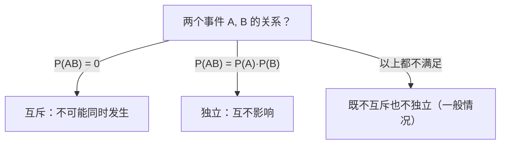

# 独立事件

> **所属路径**：`00_高中复习/01_数学基础/09_概率基础/03_独立事件`
> **预计学习时间**：35 分钟
> **难度等级**：⭐

---

## 前置知识

- [条件概率](../02_条件概率/02_条件概率.md) — 条件概率公式 $P(A|B) = P(AB)/P(B)$ 和乘法公式

> 如果以上内容还不熟悉，建议先完成对应课程再继续。

---

## 学习目标

完成本节后，你将能够：

1. 用数学语言定义事件独立性，并判断给定事件是否独立
2. 运用独立性简化概率计算，掌握 $n$ 次独立重复试验（伯努利试验）的概率公式
3. 理解独立性假设在朴素贝叶斯等人工智能模型中的核心作用

---

## 正文讲解

### 1. 一个有趣的问题

上一节我们学了 **[条件概率（Conditional Probability）](../02_条件概率/02_条件概率.md)** ，核心思想是"新信息会改变概率"。但有没有这样的情况——即使获得了新信息，你的判断也完全不变？

想想这两个场景：
- 你掷一枚骰子得到了 5 点，同时窗外下起了雨。"下雨"这个信息会改变你掷出 5 点的概率吗？显然不会。
- 你连续抛两次硬币，第一次的结果会影响第二次正面朝上的概率吗？也不会。

这种"知不知道 $B$ 发生，都不影响 $A$ 的概率"的关系，就是事件的 **独立性（Independence）**。

### 2. 独立事件的定义

如果事件 $A$ 和事件 $B$ 满足：

$$
P(AB) = P(A) \cdot P(B)
$$

则称 $A$ 与 $B$ **相互独立（Independent）**。

> **直觉解读**：独立性意味着" $A$ 和 $B$ 同时发生的概率"恰好等于"各自发生概率的乘积"。当两件事互不影响时，"同时"的概率自然是各自概率的"叠加"（相乘）。

这个定义与条件概率有什么关系？如果 $P(B) > 0$ ，将定义式两边除以 $P(B)$ ：

$$
\frac{P(AB)}{P(B)} = P(A) \quad \Longrightarrow \quad P(A|B) = P(A)
$$

也就是说，"知道 $B$ 发生"不改变 $A$ 的概率——这正是我们直觉中"互不影响"的精确表达。

### 3. 独立与互斥的区别

这是一个非常容易混淆的概念对，我们必须在这里澄清：

| 概念 | 含义 | 数学表达 |
| --- | --- | --- |
| 互斥 | $A$ 和 $B$ 不能同时发生 | $P(AB) = 0$ |
| 独立 | $A$ 的发生不影响 $B$ 的概率 | $P(AB) = P(A) \cdot P(B)$ |

如果 $P(A) > 0$ 且 $P(B) > 0$ ，那么互斥意味着 $P(AB) = 0$ ，而独立要求 $P(AB) = P(A) \cdot P(B) > 0$ 。所以 **概率不为零的两个事件不可能既互斥又独立**。



> 📌 **图解说明**：判断两个事件的关系需要计算 $P(AB)$ ，然后与 $0$ 和 $P(A) \cdot P(B)$ 分别比较。

### 4. 伯努利试验与二项分布

独立性最重要的应用之一是 **伯努利试验（Bernoulli Trial）**——一次只有两种结果（"成功"或"失败"）的试验。当我们把同一个伯努利试验在相同条件下独立重复 $n$ 次时，就称为 **$n$ 次独立重复试验**（或伯努利概型）。

设每次试验"成功"的概率为 $p$ ，"失败"的概率为 $q = 1 - p$ 。在 $n$ 次独立试验中恰好成功 $k$ 次的概率为：

$$
P(X = k) = \binom{n}{k} p^k (1-p)^{n-k}, \quad k = 0, 1, 2, \ldots, n
$$

> **直觉解读**：
> - $p^k$ ： $k$ 次成功各自独立，概率相乘
> - $(1-p)^{n-k}$ ： $n-k$ 次失败也各自独立
> - $\binom{n}{k}$ ： $k$ 次成功可以出现在 $n$ 次中的任意位置

这就是 **[排列组合](../../../08_排列组合/)** 知识在概率中的直接应用。

**例题**：一枚不均匀硬币，正面概率 $p = 0.6$ 。抛 5 次，恰好 3 次正面朝上的概率是多少？

$$
P(X = 3) = \binom{5}{3} (0.6)^3 (0.4)^2 = 10 \times 0.216 \times 0.16 = 0.3456
$$

下面这张图展示了 $n = 10$ 次独立伯努利试验中，成功概率 $p$ 分别取 $0.2$ 、 $0.5$ 和 $0.8$ 时，恰好成功 $k$ 次的概率分布：


> 📌 **图解说明**：三组柱形图分别对应不同的 $p$ 值。当 $p = 0.2$ 时分布偏左（成功次数少的概率高），当 $p = 0.5$ 时近似对称，当 $p = 0.8$ 时分布偏右。每组中概率最大的柱子用黑色边框高亮标出，其峰值大约出现在 $k = np$ 附近。你可以运行 `code/plot_binomial.py` 自行生成这张图。

### 5. 多事件独立性

当涉及三个或更多事件时，独立性的要求更强。事件 $A_1, A_2, \ldots, A_n$ **相互独立** 要求对任意子集 $\{i_1, i_2, \ldots, i_k\}$ 都有：

$$
P(A_{i_1} A_{i_2} \cdots A_{i_k}) = P(A_{i_1}) \cdot P(A_{i_2}) \cdots P(A_{i_k})
$$

仅仅两两独立是不够的。这个区分在高中阶段了解即可，更深入的讨论会在大学概率论中展开。

### 6. 独立性假设与人工智能

在人工智能中，独立性假设是简化复杂模型的利器。最经典的例子是 **朴素贝叶斯分类器（Naive Bayes Classifier）**。

假设你要判断一封邮件是否是垃圾邮件。邮件由很多词构成，如果要精确计算所有词联合出现的概率，计算量会指数级爆炸。朴素贝叶斯的"朴素"之处在于：假设每个词的出现相互独立。

$$
P(w_1, w_2, \ldots, w_n | \text{spam}) \approx P(w_1|\text{spam}) \cdot P(w_2|\text{spam}) \cdots P(w_n|\text{spam})
$$

这个假设在现实中当然不完全成立（"免费"和"中奖"这两个词往往一起出现），但它大幅降低了计算复杂度，而且在实践中效果出奇地好。这告诉我们：合理的简化假设有时比完美的模型更实用。

---

## 动手实践

下面我们用 Python 来验证伯努利试验的概率公式，并将理论值与模拟值对比。

```python
# 文件：code/independent_events.py
# 用途：验证二项分布概率公式
# 环境：Python 3.10+（无需额外库）

import random
from math import comb

def binomial_prob(n, k, p):
    """理论计算：二项分布 P(X=k)"""
    return comb(n, k) * (p ** k) * ((1 - p) ** (n - k))

def simulate_binomial(n, k, p, trials=200_000):
    """模拟：重复 trials 次实验，统计恰好 k 次成功的频率"""
    count = 0
    for _ in range(trials):
        successes = sum(1 for _ in range(n) if random.random() < p)
        if successes == k:
            count += 1
    return count / trials

# 抛硬币 5 次（p=0.6），计算恰好 k 次正面的概率
n, p = 5, 0.6
print(f"抛硬币 {n} 次，正面概率 p = {p}")
print(f"{'k':>2}  {'理论值':>8}  {'模拟值':>8}")
print("-" * 28)

for k in range(n + 1):
    p_theory = binomial_prob(n, k, p)
    p_sim = simulate_binomial(n, k, p)
    print(f"{k:>2}  {p_theory:>8.4f}  {p_sim:>8.4f}")
```

**运行说明**：
- 环境要求：Python 3.10+，仅使用标准库
- 运行命令：`python code/independent_events.py`

**预期输出**：
```
抛硬币 5 次，正面概率 p = 0.6
 k    理论值    模拟值
----------------------------
 0    0.0102    0.0103
 1    0.0768    0.0770
 2    0.2304    0.2298
 3    0.3456    0.3460
 4    0.2592    0.2588
 5    0.0778    0.0781
```

可以看到模拟值与理论值非常吻合。 $k = 3$ 时概率最大，这是因为 $p = 0.6$ ，期望的成功次数是 $np = 3$ 。

---

## 典型误区

| 误区 | 正确理解 |
| --- | --- |
| "互斥就是独立" | 两者完全不同。互斥表示不能同时发生（ $P(AB) = 0$ ），独立表示互不影响（ $P(AB) = P(A)P(B)$ ） |
| "独立是直觉判断" | 严格判断独立性需要验证 $P(AB) = P(A)P(B)$ ，直觉可能出错 |
| "多次试验一定独立" | 只有在相同条件下重复且互不影响时才满足独立性。不放回抽样就不是独立试验 |

---

## 练习题

### 练习 1：独立性判断（难度：⭐）

掷两枚骰子，设 $A$ = "第一枚为偶数"， $B$ = "第二枚为 3"。验证 $A$ 与 $B$ 是否独立。

<details>
<summary>💡 提示</summary>

计算 $P(A)$ 、 $P(B)$ 和 $P(AB)$ ，检查 $P(AB)$ 是否等于 $P(A) \cdot P(B)$ 。

</details>

<details>
<summary>✅ 参考答案</summary>

$P(A) = \dfrac{3}{6} = \dfrac{1}{2}$ ， $P(B) = \dfrac{1}{6}$ ， $P(AB) = \dfrac{3}{36} = \dfrac{1}{12}$ 。

∵ $P(A) \cdot P(B) = \dfrac{1}{2} \times \dfrac{1}{6} = \dfrac{1}{12} = P(AB)$

∴ $A$ 与 $B$ 相互独立。

</details>

### 练习 2：二项分布计算（难度：⭐）

某次考试中，每道选择题有 4 个选项。一名学生完全靠猜测回答 10 道题，求恰好猜对 3 题的概率（保留四位小数）。

<details>
<summary>💡 提示</summary>

这是 $n = 10$ ， $p = 0.25$ ， $k = 3$ 的二项分布。

</details>

<details>
<summary>✅ 参考答案</summary>

$$P(X = 3) = \binom{10}{3} (0.25)^3 (0.75)^7 = 120 \times 0.015625 \times 0.133484 \approx 0.2503$$

</details>

### 练习 3：对立事件与独立性综合（难度：⭐⭐）

一个系统由两个独立工作的元件组成，只要有一个正常工作系统就能运行。两个元件的可靠性（正常工作的概率）分别为 0.9 和 0.8。求系统正常运行的概率。

<details>
<summary>💡 提示</summary>

"至少一个正常"的对立事件是"两个都失效"。利用独立性计算两个都失效的概率，再用 $1$ 去减。

</details>

<details>
<summary>✅ 参考答案</summary>

设 $A$ = "元件 1 正常"， $B$ = "元件 2 正常"。 $A$ 、 $B$ 独立。

两个都失效的概率：

$$P(\bar{A}\bar{B}) = P(\bar{A}) \cdot P(\bar{B}) = 0.1 \times 0.2 = 0.02$$

∴ 系统正常运行的概率：

$$P = 1 - P(\bar{A}\bar{B}) = 1 - 0.02 = 0.98$$

</details>

---

## 下一步学习

- 📖 下一个知识点：[全概率公式与贝叶斯公式](../04_全概率公式与贝叶斯公式/04_全概率公式与贝叶斯公式.md) — 从"原因→结果"反推"结果→原因"
- 📖 后续知识点：[随机变量初步](../05_随机变量初步/05_随机变量初步.md) — 用数字刻画随机现象的规律
- 🔗 相关知识点：[排列组合公式](../../../08_排列组合/02_排列组合公式/) — 二项分布计算中需要的组合数

---

## 参考资料

1. [Khan Academy — Independent Events](https://www.khanacademy.org/math/statistics-probability/probability-library/conditional-probability-independence/v/independent-events-1) — 独立事件的直观讲解，免费公开教育资源
2. [Seeing Theory — Compound Probability](https://seeing-theory.brown.edu/compound-probability/index.html) — 独立性与条件概率的交互可视化，CC BY-NC 4.0 许可
3. [Wikipedia — Independence (probability theory)](https://en.wikipedia.org/wiki/Independence_(probability_theory)) — 独立性的形式化定义与性质，公共知识库
