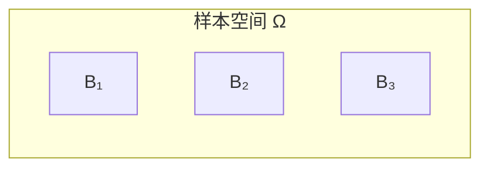
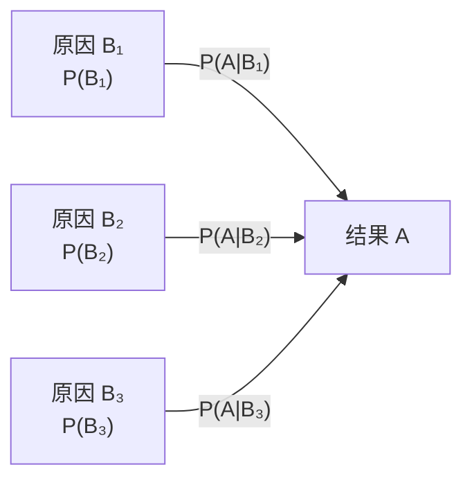
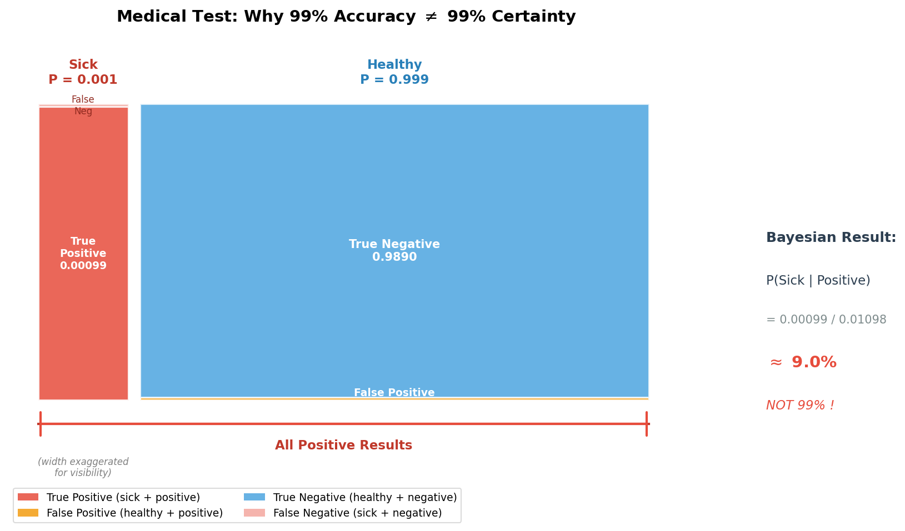

# 全概率公式与贝叶斯公式

> **所属路径**：`00_高中复习/01_数学基础/09_概率基础/04_全概率公式与贝叶斯公式`
> **预计学习时间**：50 分钟
> **难度等级**：⭐⭐

---

## 前置知识

- [条件概率](../02_条件概率/02_条件概率.md) — 条件概率公式 $P(A|B) = P(AB)/P(B)$ 和乘法公式

> 如果以上内容还不熟悉，建议先完成对应课程再继续。

---

## 学习目标

完成本节后，你将能够：

1. 理解样本空间划分的概念，运用全概率公式从"原因到结果"计算事件概率
2. 运用贝叶斯公式从"结果到原因"进行逆向推理，理解先验概率与后验概率的含义
3. 认识贝叶斯公式在人工智能中的核心地位，包括垃圾邮件过滤、医学诊断等经典应用

---

## 正文讲解

> ⚠️ **超纲提示**：全概率公式与贝叶斯公式在部分版本的中国高中数学教材（如人教A版选择性必修第三册）中有涉及，但不属于所有版本的必修内容。我们在这里学习它们，是因为贝叶斯公式是人工智能中最核心的数学工具之一——从垃圾邮件过滤到医学诊断再到大语言模型，无处不在。公式本身只用到乘法和除法，理解起来并不困难。

### 1. 从一个医学诊断问题说起

假设有一种罕见疾病，人群中的患病率是 0.1%（即 $P(\text{病}) = 0.001$ ）。现在有一种检测方法，它的准确率很高：
- 患者被正确检测为阳性的概率（灵敏度）： $P(\text{阳}|\text{病}) = 0.99$
- 健康人被正确检测为阴性的概率（特异度）： $P(\text{阴}|\text{健}) = 0.99$

问题来了：如果你的检测结果是阳性，你真正患病的概率有多大？

大多数人的直觉是"99%"——毕竟检测准确率是 99% 嘛。但真实答案会让你大吃一惊。要解开这个谜，我们需要两个强大的工具：全概率公式和贝叶斯公式。

### 2. 样本空间的划分

在推导公式之前，我们先引入一个关键概念。如果事件 $B_1, B_2, \ldots, B_n$ 满足：
1. **两两互斥**：对任意 $i \neq j$ ， $B_i \cap B_j = \varnothing$
2. **穷尽全部**： $B_1 \cup B_2 \cup \cdots \cup B_n = \Omega$

则称 $\{B_1, B_2, \ldots, B_n\}$ 是样本空间 $\Omega$ 的一个 **划分（Partition）**。

划分的直觉是：把样本空间像切蛋糕一样分成互不重叠的几块，每个样本点恰好属于其中一块。



> 📌 **图解说明**： $B_1, B_2, B_3$ 将样本空间分成三个不重叠的区域，它们的并集就是整个 $\Omega$ 。

在医学诊断问题中，最自然的划分就是 $\{$病, 健$\}$ ——每个人要么患病要么健康，二者互斥且穷尽。

### 3. 全概率公式

有了划分的概念，我们可以推导全概率公式了。设 $\{B_1, B_2, \ldots, B_n\}$ 是 $\Omega$ 的一个划分，对任意事件 $A$ ：

$$
P(A) = \sum_{i=1}^{n} P(B_i) \cdot P(A|B_i)
$$

> **直觉解读**：要计算事件 $A$ 的总概率，可以把所有可能的"原因" $B_i$ 逐一考虑——在每种原因下 $A$ 发生的概率是 $P(A|B_i)$ ，加权平均后就得到了总概率。权重就是每种原因本身出现的概率 $P(B_i)$ 。

这就像计算"一个班级的平均身高"：可以先算男生平均身高和女生平均身高，再按男女人数比加权平均。

**推导过程**：因为 $B_1, B_2, \ldots, B_n$ 是划分，事件 $A$ 可以分解为：

$$
A = (A \cap B_1) \cup (A \cap B_2) \cup \cdots \cup (A \cap B_n)
$$

各部分两两互斥，由概率的可加性和乘法公式：

$$
P(A) = \sum_{i=1}^{n} P(A \cap B_i) = \sum_{i=1}^{n} P(B_i) \cdot P(A|B_i)
$$

下面这张流程图展示了全概率公式"从原因到结果"的推理方向：



> 📌 **图解说明**：每种"原因" $B_i$ 都有可能导致"结果" $A$ ，全概率公式把所有路径的概率加起来。

### 4. 贝叶斯公式

全概率公式解决的是"从原因到结果"的正向推理。但在实际生活中，我们更常遇到的是反向问题——已经观察到了结果，想推断原因。

这就是 **贝叶斯公式（Bayes' Theorem）** 的用武之地：

$$
P(B_i|A) = \frac{P(B_i) \cdot P(A|B_i)}{\sum_{j=1}^{n} P(B_j) \cdot P(A|B_j)}
$$

> **直觉解读**：分子是"第 $i$ 种原因导致结果 $A$ 的概率"，分母是"所有原因导致结果 $A$ 的总概率"（即全概率公式）。整个公式在说：在所有能导致 $A$ 的原因中， $B_i$ 贡献了多大比例？

在贝叶斯公式中，有几个重要的术语：
- **先验概率（Prior）**： $P(B_i)$ ——在观察到结果之前，对原因的初始判断
- **似然（Likelihood）**： $P(A|B_i)$ ——如果原因是 $B_i$ ，观察到结果 $A$ 的可能性
- **后验概率（Posterior）**： $P(B_i|A)$ ——观察到结果后，对原因的更新判断

$$
\text{后验} = \frac{\text{先验} \times \text{似然}}{\text{证据}}
$$

这个"先验 → 证据更新 → 后验"的思维模式，是整个贝叶斯学派的思想根基。

### 5. 揭晓医学诊断的答案

现在让我们回到开头的问题。设 $D$ = "患病"， $\bar{D}$ = "健康"， $T$ = "检测阳性"。

已知： $P(D) = 0.001$ ， $P(\bar{D}) = 0.999$ ， $P(T|D) = 0.99$ ， $P(T|\bar{D}) = 0.01$ 。

**第一步**，用全概率公式算出阳性的总概率：

$$
P(T) = P(D) \cdot P(T|D) + P(\bar{D}) \cdot P(T|\bar{D}) = 0.001 \times 0.99 + 0.999 \times 0.01 = 0.01089
$$

**第二步**，用贝叶斯公式算出阳性条件下真正患病的概率：

$$
P(D|T) = \frac{P(D) \cdot P(T|D)}{P(T)} = \frac{0.001 \times 0.99}{0.01089} \approx 0.0909
$$

答案是约 **9.1%** ——远低于直觉中的 99%！

为什么？因为患病率太低了（0.1%），导致 999 个健康人中也会有约 10 个人（1%）被误诊为阳性。这些"假阳性"远多于真正的患者，所以阳性结果中大部分其实是健康人。

这个反直觉的结果揭示了一个深刻的道理：**先验概率（基础比率）非常重要**，忽略它会导致严重的判断偏差。

下面这张概率面积图直观地展示了为什么 99% 的检测准确率并不等于 99% 的确诊概率：



> 📌 **图解说明**：左列（红色）代表患病人群，右列（蓝色）代表健康人群。底部窄条表示"检测阳性"的区域：真阳性（红色）数量极少，而假阳性（橙色）因为健康人群基数庞大反而远多于真阳性。因此阳性结果中真正患病者仅约 9.1%。左列宽度已放大便于观察。你可以运行 `code/plot_bayes.py` 自行生成这张图。

### 6. 贝叶斯公式与人工智能

贝叶斯公式是人工智能领域最核心的数学工具之一：

- **贝叶斯分类器**：朴素贝叶斯垃圾邮件过滤器直接使用贝叶斯公式，根据邮件中的词语计算 $P(\text{spam}|\text{words})$
- **贝叶斯推断**：在深度学习之前，贝叶斯方法是处理不确定性的主流范式
- **医学 AI**：AI 辅助诊断系统本质上就在做我们刚才的计算——将检测结果和基础患病率结合，给出更准确的判断

即使在现代深度学习中，贝叶斯思想也随处可见：正则化可以被解释为引入先验，后验概率优化等概念都建立在贝叶斯公式之上。

---

## 动手实践

下面用 Python 实现医学诊断问题的贝叶斯计算，并模拟一个简化的垃圾邮件过滤器。

```python
# 文件：code/bayes_theorem.py
# 用途：贝叶斯公式应用 —— 医学诊断与垃圾邮件分类
# 环境：Python 3.10+（无需额外库）

# ====== 示例 1：医学诊断 ======
print("=" * 50)
print("示例 1：医学诊断（贝叶斯公式）")
print("=" * 50)

p_disease = 0.001           # 先验：患病率
p_healthy = 1 - p_disease   # 先验：健康率
p_pos_given_disease = 0.99  # 似然：灵敏度
p_pos_given_healthy = 0.01  # 误报率（1 - 特异度）

# 全概率公式：P(阳性)
p_positive = p_disease * p_pos_given_disease + p_healthy * p_pos_given_healthy

# 贝叶斯公式：P(患病|阳性)
p_disease_given_pos = (p_disease * p_pos_given_disease) / p_positive

print(f"先验概率 P(病) = {p_disease}")
print(f"P(阳性) = {p_positive:.5f}")
print(f"后验概率 P(病|阳性) = {p_disease_given_pos:.4f} ({p_disease_given_pos:.1%})")

# ====== 示例 2：简化垃圾邮件过滤 ======
print(f"\n{'=' * 50}")
print("示例 2：垃圾邮件过滤（朴素贝叶斯思想）")
print("=" * 50)

# 假设：已知垃圾邮件占 30%
p_spam = 0.3
p_normal = 0.7

# "免费"一词在垃圾邮件中出现概率 80%，正常邮件中 5%
p_free_given_spam = 0.80
p_free_given_normal = 0.05

# 看到"免费"后，判断是垃圾邮件的概率
p_free = p_spam * p_free_given_spam + p_normal * p_free_given_normal
p_spam_given_free = (p_spam * p_free_given_spam) / p_free

print(f"先验 P(spam) = {p_spam}")
print(f"P('免费') = {p_free:.4f}")
print(f"后验 P(spam|'免费') = {p_spam_given_free:.4f} ({p_spam_given_free:.1%})")
print(f"\n看到'免费'后，垃圾邮件概率从 {p_spam:.0%} 上升到 {p_spam_given_free:.1%}")
```

**运行说明**：
- 环境要求：Python 3.10+，仅使用标准库
- 运行命令：`python code/bayes_theorem.py`

**预期输出**：
```
==================================================
示例 1：医学诊断（贝叶斯公式）
==================================================
先验概率 P(病) = 0.001
P(阳性) = 0.01089
后验概率 P(病|阳性) = 0.0909 (9.1%)

==================================================
示例 2：垃圾邮件过滤（朴素贝叶斯思想）
==================================================
先验 P(spam) = 0.3
P('免费') = 0.2750
后验 P(spam|'免费') = 0.8727 (87.3%)

看到'免费'后，垃圾邮件概率从 30% 上升到 87.3%
```

从输出可以看到：一个词"免费"的出现就将垃圾邮件的概率从 30% 猛增到 87.3%——这就是贝叶斯更新的威力。实际的朴素贝叶斯分类器会考虑更多的词，每个词都在不断更新后验概率。

---

## 典型误区

| 误区 | 正确理解 |
| --- | --- |
| "检测准确率 99%，阳性就有 99% 概率是患者" | 必须结合先验概率（患病率）用贝叶斯公式计算，基础比率很低时后验远低于直觉 |
| "先验概率不重要" | 先验概率至关重要。同样的检测结果，在高发区和低发区意味着完全不同的后验概率 |
| "全概率公式和贝叶斯公式是两个独立工具" | 贝叶斯公式的分母就是全概率公式。全概率是正向推理（原因→结果），贝叶斯是反向推理（结果→原因），二者是一对互补工具 |

---

## 练习题

### 练习 1：全概率公式（难度：⭐）

工厂有 A、B 两条生产线。A 线生产量占总产量的 60%，次品率 2%；B 线生产量占 40%，次品率 5%。随机取一件产品，求它是次品的概率。

<details>
<summary>💡 提示</summary>

用全概率公式，划分为"来自 A 线"和"来自 B 线"。

</details>

<details>
<summary>✅ 参考答案</summary>

$$P(\text{次品}) = P(A) \cdot P(\text{次}|A) + P(B) \cdot P(\text{次}|B) = 0.6 \times 0.02 + 0.4 \times 0.05 = 0.012 + 0.02 = 0.032$$

次品率为 3.2%。

</details>

### 练习 2：贝叶斯公式（难度：⭐⭐）

接上题，如果取到了一件次品，求它来自 B 线的概率。

<details>
<summary>💡 提示</summary>

用贝叶斯公式 $P(B|\text{次}) = \dfrac{P(B) \cdot P(\text{次}|B)}{P(\text{次})}$ ，分母已经在练习 1 中算出。

</details>

<details>
<summary>✅ 参考答案</summary>

$$P(B|\text{次}) = \dfrac{P(B) \cdot P(\text{次}|B)}{P(\text{次})} = \dfrac{0.4 \times 0.05}{0.032} = \dfrac{0.02}{0.032} = 0.625$$

虽然 B 线只占 40% 的产量，但 62.5% 的次品来自 B 线——因为 B 线的次品率更高。

</details>

### 练习 3：先验对后验的影响（难度：⭐⭐）

某地区某疾病的患病率为 5%。一种检测方法的灵敏度（ $P(\text{阳}|\text{病})$ ）为 0.95，特异度（ $P(\text{阴}|\text{健})$ ）为 0.90。求检测阳性条件下真正患病的概率。

<details>
<summary>💡 提示</summary>

先用全概率公式算 $P(\text{阳})$ ，再用贝叶斯公式算 $P(\text{病}|\text{阳})$ 。注意 $P(\text{阳}|\text{健}) = 1 - 0.90 = 0.10$ 。

</details>

<details>
<summary>✅ 参考答案</summary>

$$P(\text{阳}) = 0.05 \times 0.95 + 0.95 \times 0.10 = 0.0475 + 0.095 = 0.1425$$$$P(\text{病}|\text{阳}) = \dfrac{0.05 \times 0.95}{0.1425} = \dfrac{0.0475}{0.1425} \approx 0.333$$

阳性条件下真正患病的概率约为 33.3%。对比开头的例子（患病率 0.1% 时只有 9.1%），可以看到先验概率的提高（从 0.1% 到 5%）显著提升了后验概率。

</details>

---

## 下一步学习

- 📖 下一个知识点：[随机变量初步](../05_随机变量初步/05_随机变量初步.md) — 用数字和分布表描述随机现象
- 🔗 相关知识点：[独立事件](../03_独立事件/03_独立事件.md) — 朴素贝叶斯分类器的独立性假设
- 📚 拓展方向：[贝叶斯定理与推断](../../../../01_基础能力/02_数学基础/03_概率论与统计/09_贝叶斯定理与推断/) — 大学阶段的贝叶斯统计推断

---

## 参考资料

1. [3Blue1Brown — Bayes theorem, the geometry of changing beliefs](https://www.youtube.com/watch?v=HZGCoVF3YvM) — 贝叶斯公式的可视化讲解，YouTube 公开视频
2. [Khan Academy — Bayes' theorem](https://www.khanacademy.org/math/statistics-probability/probability-library/bayes-theorem/v/bayes-theorem-visualized) — 贝叶斯定理的图解教程，免费公开教育资源
3. [Wikipedia — Bayes' theorem](https://en.wikipedia.org/wiki/Bayes%27_theorem) — 贝叶斯公式的历史、推导与应用，公共知识库
4. [Arbital — Bayes' Rule](https://arbital.com/p/bayes_rule/) — 面向初学者的贝叶斯入门，CC BY 许可
