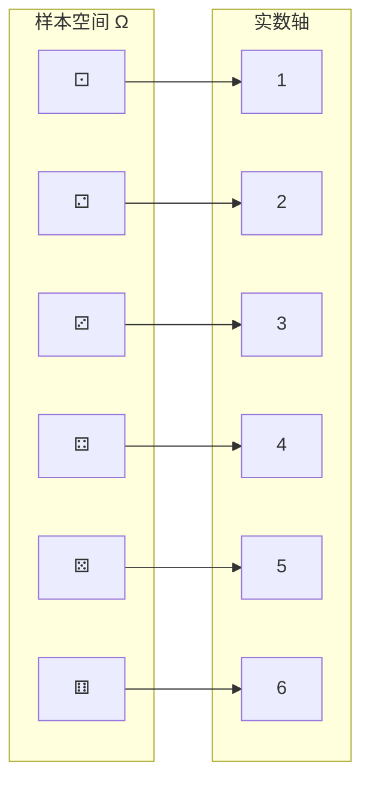

# 随机变量初步

> **所属路径**：`00_高中复习/01_数学基础/09_概率基础/05_随机变量初步`
> **预计学习时间**：45 分钟
> **难度等级**：⭐⭐

---

## 前置知识

- [独立事件](../03_独立事件/03_独立事件.md) — 独立性定义、伯努利试验、二项分布
- [古典概率](../01_古典概率/01_古典概率.md) — 样本空间与事件的基本概念

> 如果以上内容还不熟悉，建议先完成对应课程再继续。

---

## 学习目标

完成本节后，你将能够：

1. 理解随机变量的概念，能将随机试验的结果映射为数值
2. 写出离散随机变量的分布表，并验证概率之和为 1
3. 计算随机变量的期望 $E(X)$ 和方差 $D(X)$ ，并理解它们的实际含义
4. 认识期望和方差在人工智能损失函数评估、风险度量中的基础作用

---

## 正文讲解

### 1. 为什么需要随机变量

在前面几节中，我们一直在用集合的语言描述事件——"掷骰子得到偶数"、"抽到红球"等。这种描述虽然直观，但有一个不便之处：集合语言不方便做数学运算。

想想看：如果你运营一个抽奖活动，你关心的不只是"中奖"或"没中奖"，而是"平均每个人能拿到多少奖金"、"奖金的波动有多大"。这些问题需要对随机结果进行加减乘除，而集合没法直接做这些运算。

解决方法是把随机试验的每个结果映射成一个数字。这个"从随机结果到数字"的桥梁，就是 **随机变量（Random Variable）**。

### 2. 随机变量的定义

**随机变量（Random Variable）** 是定义在样本空间 $\Omega$ 上的一个函数，它把每个样本点映射为一个实数。通常用大写字母 $X, Y, Z$ 表示。

举几个例子：
- 掷一枚骰子： $X$ = 出现的点数。 $X$ 可以取 $1, 2, 3, 4, 5, 6$
- 掷两枚骰子： $Y$ = 两枚点数之和。 $Y$ 可以取 $2, 3, \ldots, 12$
- 抛 10 次硬币： $Z$ = 正面朝上的次数。 $Z$ 可以取 $0, 1, 2, \ldots, 10$



> 📌 **图解说明**：随机变量 $X$ 是一个函数，把样本空间中的每个样本点（骰子的面）映射到一个实数（点数）。

当随机变量的取值是有限个或可列无限个时，称为 **离散随机变量（Discrete Random Variable）**。高中阶段我们主要讨论离散情形。

### 3. 概率分布表

离散随机变量的全部信息可以用一张 **概率分布表（Probability Distribution Table）** 来展示：

| $X$ | $x_1$ | $x_2$ | $\cdots$ | $x_n$ |
| --- | --- | --- | --- | --- |
| $P$ | $p_1$ | $p_2$ | $\cdots$ | $p_n$ |

其中 $p_i = P(X = x_i)$ ，且满足两个基本要求：
1. **非负性**： $p_i \geq 0$
2. **归一性**： $p_1 + p_2 + \cdots + p_n = 1$

**例子**：掷两枚骰子， $X$ = 点数之和。我们来写出 $X$ 的分布表。

两枚骰子共有 $6 \times 6 = 36$ 种等可能结果。点数之和为 $k$ 的组合数可以逐一数出来：

| $X$ | 2 | 3 | 4 | 5 | 6 | 7 | 8 | 9 | 10 | 11 | 12 |
| --- | --- | --- | --- | --- | --- | --- | --- | --- | --- | --- | --- |
| 组合数 | 1 | 2 | 3 | 4 | 5 | 6 | 5 | 4 | 3 | 2 | 1 |
| $P$ | $\frac{1}{36}$ | $\frac{2}{36}$ | $\frac{3}{36}$ | $\frac{4}{36}$ | $\frac{5}{36}$ | $\frac{6}{36}$ | $\frac{5}{36}$ | $\frac{4}{36}$ | $\frac{3}{36}$ | $\frac{2}{36}$ | $\frac{1}{36}$ |

可以验证所有概率之和为 $\dfrac{36}{36} = 1$ ，符合归一性。

下面这张图直观展示了两种离散概率分布的形状：


> 📌 **图解说明**：上图为掷两颗骰子点数之和 $X$ 的分布，呈三角形对称分布， $X = 7$ 概率最大（绿色高亮）；下图为二项分布 $B(10, 0.3)$ ，呈现右偏的钟形，红色虚线标出期望 $E(X) = 3$ 。你可以运行 `code/plot_probability_distribution.py` 自行生成这张图。

### 4. 数学期望

有了分布表，我们就可以回答"平均值是多少"这个问题了。离散随机变量 $X$ 的 **数学期望（Expectation）**，也叫均值，定义为：

$$
E(X) = \sum_{i=1}^{n} x_i \cdot p_i
$$

> **直觉解读**：期望就是"加权平均"——每个取值按照它出现的概率为权重求平均。如果你把随机试验重复很多很多次，结果的平均值会趋近于 $E(X)$ 。

**例子**：掷一枚均匀骰子， $X$ 为点数：

$$
E(X) = 1 \times \frac{1}{6} + 2 \times \frac{1}{6} + 3 \times \frac{1}{6} + 4 \times \frac{1}{6} + 5 \times \frac{1}{6} + 6 \times \frac{1}{6} = \frac{21}{6} = 3.5
$$

注意 $E(X) = 3.5$ 并不是骰子的一个可能结果——期望是一个"平均位置"的概念，不要求落在可能取值上。

期望有几条实用的运算性质：

1. **常数的期望**： $E(c) = c$
2. **线性性**： $E(aX + b) = aE(X) + b$
3. **可加性**： $E(X + Y) = E(X) + E(Y)$ （无论是否独立都成立）

### 5. 方差与标准差

期望描述了"平均在哪里"，但没有告诉我们"结果有多分散"。 **方差（Variance）** 正是衡量"分散程度"的量：

$$
D(X) = E\left[(X - E(X))^2\right] = \sum_{i=1}^{n} (x_i - E(X))^2 \cdot p_i
$$

在实际计算中，展开这个公式可以得到一个更方便的等价形式：

$$
D(X) = E(X^2) - [E(X)]^2
$$

> **直觉解读**：方差度量的是"每次结果与平均值的偏离"的平均程度。方差越大，结果越不稳定；方差为 0，意味着结果完全确定。

由于方差的单位是原始数据单位的平方，为了恢复原始单位，我们定义 **标准差（Standard Deviation）**：

$$
\sigma(X) = \sqrt{D(X)}
$$

**例子**：掷一枚骰子， $E(X) = 3.5$ ，求 $D(X)$ 。

先算 $E(X^2)$ ：

$$
E(X^2) = 1^2 \times \frac{1}{6} + 2^2 \times \frac{1}{6} + \cdots + 6^2 \times \frac{1}{6} = \frac{1 + 4 + 9 + 16 + 25 + 36}{6} = \frac{91}{6}
$$

$$
D(X) = E(X^2) - [E(X)]^2 = \frac{91}{6} - \left(\frac{7}{2}\right)^2 = \frac{91}{6} - \frac{49}{4} = \frac{182 - 147}{12} = \frac{35}{12} \approx 2.917
$$

方差的运算性质：

1. **常数方差为零**： $D(c) = 0$
2. **线性变换**： $D(aX + b) = a^2 D(X)$ （注意：加常数不影响方差，乘常数会使方差扩大 $a^2$ 倍）
3. **独立可加性**：若 $X$ 和 $Y$ 独立，则 $D(X + Y) = D(X) + D(Y)$

### 6. 常见离散分布

在前面的学习中，我们已经接触了两种重要的离散分布。下面做一个简洁的总结：

**二项分布**： $X \sim B(n, p)$ ，表示 $n$ 次独立伯努利试验中成功的次数。

$$
P(X = k) = \binom{n}{k} p^k (1-p)^{n-k}
$$

$$
E(X) = np, \quad D(X) = np(1-p)
$$

**两点分布（伯努利分布）**： $X \sim B(1, p)$ ，即 $n = 1$ 的二项分布。 $X$ 只取 0 和 1 。

$$
E(X) = p, \quad D(X) = p(1-p)
$$

### 7. 随机变量与人工智能

期望和方差是人工智能中最基础的统计量：

- **损失函数的期望**：训练机器学习模型时，我们希望最小化损失函数在所有训练样本上的平均值——这就是对损失的期望 $E[L(X)]$ 。
- **风险评估**：方差衡量模型预测的不稳定性。一个模型如果方差很大，说明它对不同的数据敏感度过高，可能存在 **过拟合（Overfitting）** 问题。
- **特征描述**：对数据集进行探索性数据分析时，首先要计算的就是每个特征的均值和标准差。

可以说，没有期望和方差的概念，就无法理解机器学习中的任何模型评估方法。

---

## 动手实践

下面用 Python 验证掷骰子的期望和方差，并与模拟结果对比。

```python
# 文件：code/random_variable.py
# 用途：验证离散随机变量的期望与方差
# 环境：Python 3.10+（无需额外库）

import random

# ====== 理论计算 ======
values = list(range(1, 7))
prob = [1/6] * 6

# 期望 E(X)
ex = sum(x * p for x, p in zip(values, prob))

# E(X^2)
ex2 = sum(x**2 * p for x, p in zip(values, prob))

# 方差 D(X) = E(X^2) - [E(X)]^2
dx = ex2 - ex**2

print("=== 掷一枚骰子 ===")
print(f"E(X) 理论值 = {ex:.4f}")
print(f"D(X) 理论值 = {dx:.4f}")
print(f"σ(X) 理论值 = {dx**0.5:.4f}")

# ====== 模拟验证 ======
n_trials = 500_000
results = [random.randint(1, 6) for _ in range(n_trials)]

mean_sim = sum(results) / n_trials
var_sim = sum((x - mean_sim)**2 for x in results) / n_trials

print(f"\n模拟 {n_trials} 次:")
print(f"E(X) 模拟值 = {mean_sim:.4f}")
print(f"D(X) 模拟值 = {var_sim:.4f}")

# ====== 二项分布验证 ======
print("\n=== 二项分布 B(10, 0.3) ===")
n, p = 10, 0.3
print(f"E(X) 理论值 = {n * p:.4f}")
print(f"D(X) 理论值 = {n * p * (1 - p):.4f}")

binom_results = [sum(1 for _ in range(n) if random.random() < p)
                 for _ in range(n_trials)]
binom_mean = sum(binom_results) / n_trials
binom_var = sum((x - binom_mean)**2 for x in binom_results) / n_trials
print(f"E(X) 模拟值 = {binom_mean:.4f}")
print(f"D(X) 模拟值 = {binom_var:.4f}")
```

**运行说明**：
- 环境要求：Python 3.10+，仅使用标准库
- 运行命令：`python code/random_variable.py`

**预期输出**：
```
=== 掷一枚骰子 ===
E(X) 理论值 = 3.5000
D(X) 理论值 = 2.9167
σ(X) 理论值 = 1.7078

模拟 500000 次:
E(X) 模拟值 = 3.4998
D(X) 模拟值 = 2.9170

=== 二项分布 B(10, 0.3) ===
E(X) 理论值 = 3.0000
D(X) 理论值 = 2.1000
E(X) 模拟值 = 2.9993
D(X) 模拟值 = 2.1006
```

模拟值与理论值高度吻合，验证了期望和方差公式的正确性。注意：50 万次模拟已经让误差控制在了小数点后第三位以内。

---

## 典型误区

| 误区 | 正确理解 |
| --- | --- |
| "期望是最可能出现的值" | 期望是加权平均，它可能不是任何一个可能取值。例如掷骰子期望 3.5，但永远不会真正出现 3.5 |
| "方差大一定不好" | 方差大只是说明结果分散，有时候我们恰恰需要探索多样性（如强化学习中的探索） |
| $D(X+Y) = D(X) + D(Y)$ 总成立 | 只有 $X$ 和 $Y$ 独立时才成立。不独立时还要加协方差项 |
| "随机变量和事件是一回事" | 事件是样本空间的子集，随机变量是从样本空间到实数的函数。事件对应"是与否"，随机变量对应"数值" |

---

## 练习题

### 练习 1：分布表与期望（难度：⭐）

一个袋子里有 1 个白球和 2 个红球。随机取出一个球记下颜色后放回，连续取两次。设 $X$ 为取到红球的次数。写出 $X$ 的分布表并求 $E(X)$ 。

<details>
<summary>💡 提示</summary>

每次取到红球的概率为 $\dfrac{2}{3}$ ，这是 $n = 2$ ， $p = \dfrac{2}{3}$ 的二项分布。

</details>

<details>
<summary>✅ 参考答案</summary>

$X \sim B(2, \dfrac{2}{3})$ ，分布表：

| $X$ | 0 | 1 | 2 |
| --- | --- | --- | --- |
| $P$ | $\dfrac{1}{9}$ | $\dfrac{4}{9}$ | $\dfrac{4}{9}$ |

$$E(X) = 0 \times \dfrac{1}{9} + 1 \times \dfrac{4}{9} + 2 \times \dfrac{4}{9} = \dfrac{12}{9} = \dfrac{4}{3} \approx 1.333$$

也可以用公式直接算： $E(X) = np = 2 \times \dfrac{2}{3} = \dfrac{4}{3}$ 。

</details>

### 练习 2：方差计算（难度：⭐）

承接练习 1，求 $D(X)$ 。

<details>
<summary>💡 提示</summary>

用公式 $D(X) = np(1-p)$ 或展开定义式计算。

</details>

<details>
<summary>✅ 参考答案</summary>

$$D(X) = np(1-p) = 2 \times \dfrac{2}{3} \times \dfrac{1}{3} = \dfrac{4}{9} \approx 0.444$$

</details>

### 练习 3：期望的线性性质（难度：⭐⭐）

某游戏规则：掷一枚骰子，点数为 $X$ ，获得奖金 $Y = 3X + 5$ 元。求平均每次游戏的奖金 $E(Y)$ 和奖金的波动 $D(Y)$ 。

<details>
<summary>💡 提示</summary>

利用 $E(aX + b) = aE(X) + b$ 和 $D(aX + b) = a^2 D(X)$ 。

</details>

<details>
<summary>✅ 参考答案</summary>

$E(X) = 3.5$ ， $D(X) = \dfrac{35}{12}$ 。

$$E(Y) = 3 \times E(X) + 5 = 3 \times 3.5 + 5 = 15.5 \text{ 元}$$

$$D(Y) = 3^2 \times D(X) = 9 \times \dfrac{35}{12} = \dfrac{315}{12} = 26.25$$

标准差 $\sigma(Y) = \sqrt{26.25} \approx 5.12$ 元。

</details>

### 练习 4：综合应用（难度：⭐⭐）

小明参加 5 道判断题考试，每题随机猜测正确概率为 0.5。设答对 $k$ 题得 $20k$ 分。求小明分数的期望和标准差。

<details>
<summary>💡 提示</summary>

先求答对题数 $X$ 的期望和方差（ $X \sim B(5, 0.5)$ ），分数 $S = 20X$ 。

</details>

<details>
<summary>✅ 参考答案</summary>

$X \sim B(5, 0.5)$ ，所以 $E(X) = 5 \times 0.5 = 2.5$ ， $D(X) = 5 \times 0.5 \times 0.5 = 1.25$ 。

分数 $S = 20X$ ：

$$E(S) = 20 \times E(X) = 20 \times 2.5 = 50 \text{ 分}$$

$$D(S) = 20^2 \times D(X) = 400 \times 1.25 = 500$$

$$\sigma(S) = \sqrt{500} \approx 22.36 \text{ 分}$$

</details>

---

## 下一步学习

- 📖 后续主题：[统计基础](../../10_统计基础/) — 从概率到数据分析，学习如何用数据估计参数
- 📚 拓展方向：[概率分布](../../../../01_基础能力/02_数学基础/03_概率论与统计/01_概率分布/) — 大学阶段深入学习连续随机变量和更多分布
- 🔗 相关知识点：[独立事件](../03_独立事件/03_独立事件.md) — 二项分布基于独立性假设

---

## 参考资料

1. [Khan Academy — Random Variables](https://www.khanacademy.org/math/statistics-probability/random-variables-stats-library) — 随机变量、期望和方差的完整课程，免费公开教育资源
2. [Seeing Theory — Basic Probability](https://seeing-theory.brown.edu/basic-probability/index.html) — 概率分布的交互可视化，CC BY-NC 4.0 许可
3. [Wikipedia — Random variable](https://en.wikipedia.org/wiki/Random_variable) — 随机变量的形式化定义与性质，公共知识库
4. [Mathematics for Machine Learning (Deisenroth et al.)](https://mml-book.github.io/) — 机器学习数学基础教材，第 6 章概率分布，开源教材（CC BY-NC-ND 4.0）
