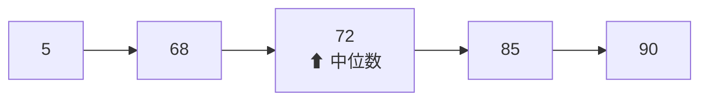
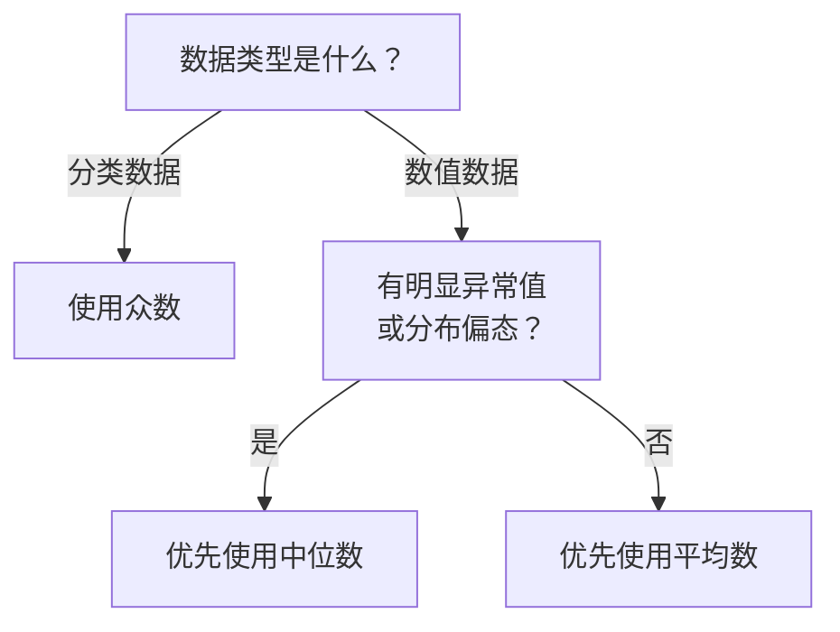
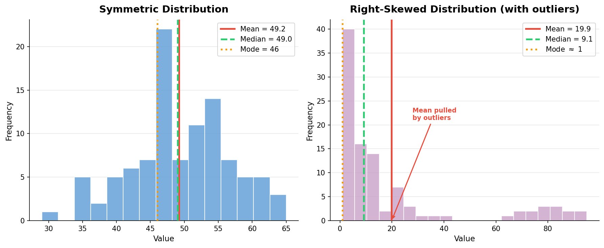

# 平均数中位数众数

> **所属路径**：`00_高中复习/01_数学基础/10_统计基础/01_平均数中位数众数`
> **预计学习时间**：35 分钟
> **难度等级**：⭐

---

## 前置知识

- [概率基础](../../../09_概率基础/) — 随机变量与期望值的概念是理解平均数统计意义的基础

> 如果以上内容还不熟悉，建议先完成对应课程再继续。

---

## 学习目标

完成本节后，你将能够：

1. 计算一组数据的算术平均数、中位数和众数
2. 解释三种集中趋势指标各自的适用场景和局限性
3. 判断在含有异常值的数据中应优先选用哪种指标
4. 理解平均数在人工智能中的基础作用（如均方误差损失函数）

---

## 正文讲解

### 1. 为什么需要"代表值"

假设你是一位班主任，刚收到全班 30 名同学的期末考试成绩。校长问你："这个班考得怎么样？"你不可能把 30 个分数一个个念出来，而是会说"平均分是 78 分"或者"大部分同学考了 80 分左右"。这个用来概括整体水平的数字，就叫做数据的 **集中趋势（Central Tendency）** 指标——它试图用一个值来代表一组数据的"中心位置"。

在人工智能中，这种思想同样重要。当模型对同一张图片做了 100 次预测，我们需要一个数字来衡量"总体预测效果如何"——这就是 **[损失函数（Loss Function）](../../../../01_基础能力/02_数学基础/04_最优化/01_损失函数/)** 的核心思路，而最常用的均方误差损失函数正是建立在"平均数"这一概念之上的。

最常见的集中趋势指标有三个：平均数、中位数和众数。接下来我们逐一认识它们。

### 2. 算术平均数

**算术平均数（Arithmetic Mean）**，简称平均数，是最直观也最常用的指标。它的计算方法很简单：把所有数据加起来，再除以数据的个数。

设有 $n$ 个数据 $x_1, x_2, \ldots, x_n$ ，它们的算术平均数为：

$$
\bar{x} = \frac{1}{n} \sum_{i=1}^{n} x_i = \frac{x_1 + x_2 + \cdots + x_n}{n}
$$

> **直觉解读**：平均数就是把所有数据"匀一匀"后每个位置分到的值。如果把数据想象成一排高低不等的积木块，平均数就是把它们全部推平后的高度。

来看一个具体例子。某次测验 5 位同学的成绩是：72, 85, 90, 68, 95。那么平均分为：

$$
\bar{x} = \frac{72 + 85 + 90 + 68 + 95}{5} = \frac{410}{5} = 82
$$

平均数有一个非常重要的性质：**所有数据到平均数的偏差之和为零**。即：

$$
\sum_{i=1}^{n} (x_i - \bar{x}) = 0
$$

这意味着平均数是数据的"重心"——有的数据比它大，有的比它小，但正负偏差恰好抵消。这个性质在后面学习 **[方差与标准差](../02_方差与标准差/02_方差与标准差.md)** 时会再次出现。

#### 平均数的局限性

平均数虽然好用，但它有一个明显的弱点：**对异常值（Outlier）非常敏感**。

假设上面那 5 位同学中，成绩 95 分的同学因为抄错答题卡，分数被记为 5 分。新数据变成：72, 85, 90, 68, 5。此时：

$$
\bar{x} = \frac{72 + 85 + 90 + 68 + 5}{5} = \frac{320}{5} = 64
$$

仅仅一个异常值就让平均分从 82 降到了 64！这显然不能准确反映大多数同学的水平。在收入统计中也有类似的问题——少数超高收入者会大幅拉高平均工资，让大部分人觉得"被平均了"。

那么，有没有对异常值更"稳健"的指标呢？这就要请出中位数了。

### 3. 中位数

**中位数（Median）** 是将数据从小到大排列后，位于正中间位置的那个值。

具体规则是：
- 如果数据个数 $n$ 为奇数，中位数是第 $\dfrac{n+1}{2}$ 个数据
- 如果数据个数 $n$ 为偶数，中位数是第 $\dfrac{n}{2}$ 个与第 $\dfrac{n}{2}+1$ 个数据的平均值

还是用刚才的例子。原始数据排序后为：68, 72, 85, 90, 95。 $n = 5$ 为奇数，中位数是第 3 个数据：

$$
\text{中位数} = 85
$$

现在换成含异常值的数据：5, 68, 72, 85, 90。中位数仍然是第 3 个数据：

$$
\text{中位数} = 72
$$

虽然中位数也有所下降（从 85 到 72），但远没有平均数变化那么剧烈（从 82 到 64）。这就是中位数的优势——它对异常值更加 **鲁棒（Robust）**，因为它只关心"位置"而不关心具体数值的大小。



> 📌 **图解说明**：将含异常值的数据从小到大排列后，中位数恰好落在正中间位置（第 3 个），不受极端值 5 的影响。

在人工智能中，当损失函数需要对异常值鲁棒时，可以使用 **中位绝对误差（Median Absolute Error）** 代替均方误差。

### 4. 众数

**众数（Mode）** 是数据中出现次数最多的值。

例如数据集 {3, 5, 5, 7, 5, 8, 9} 中，5 出现了 3 次，其余值各出现 1 次，因此众数为 5。

众数的特点是：
- 一组数据可以没有众数（所有值出现次数都相同）
- 一组数据可以有多个众数（多个值出现次数并列最多）
- 众数是唯一一个可以用于 **分类数据**（非数值型）的集中趋势指标

比如调查"最喜欢的编程语言"，结果是：Python, Python, Java, C++, Python, Java。这里众数是 Python——你无法计算编程语言的"平均数"，但可以找出最受欢迎的那个。

在人工智能的分类任务中，**投票法（Majority Voting）** 实际上就是取众数的思想：多个模型分别给出预测结果，出现次数最多的类别就是最终预测。

### 5. 三种指标的对比与选择

下面这张表格总结了三种指标的核心差异：

| 特征 | 平均数 | 中位数 | 众数 |
| ---- | ------ | ------ | ---- |
| 计算方式 | 所有数据求和再除以个数 | 排序后取中间值 | 取出现次数最多的值 |
| 对异常值敏感度 | 高 | 低 | 无 |
| 适用数据类型 | 数值型 | 数值型、有序型 | 数值型、分类型 |
| 信息利用 | 利用每个数据值 | 只利用位置信息 | 只利用频率信息 |
| 唯一性 | 一定唯一 | 一定唯一 | 可能不唯一 |

选择指标的经验法则：
- **数据对称、无异常值** → 优先用平均数（信息利用最充分）
- **数据偏态或有异常值** → 优先用中位数（更稳健）
- **分类数据或关注"最常见"** → 用众数



> 📌 **图解说明**：选择集中趋势指标的决策流程。分类数据只能用众数；数值数据在无异常值时用平均数最充分，有异常值时中位数更稳健。

下面这张图展示了对称分布与右偏分布中三种指标的位置差异——在对称分布中三者几乎重合，而一旦出现异常值，平均数就会被"拉偏"，中位数则几乎不受影响：



> 📌 **图解说明**：左图是近似对称的正态分布，平均数、中位数、众数三条线几乎重叠在一起；右图加入了一组较大的异常值后，平均数（红色实线）被明显拉向右侧，而中位数（绿色虚线）基本保持稳定。这直观地说明了"有异常值时，中位数比平均数更稳健"。你可以运行 `code/plot_central_tendency.py` 自行生成这张图。

### 6. 在人工智能中的联系

平均数是机器学习中最基础的数学工具之一：

- **均方误差（Mean Squared Error, MSE）** ：模型预测的核心损失函数，计算方式就是"误差平方的平均数"
- **批归一化（Batch Normalization）** ：训练神经网络时，需要计算每一批数据的平均值来做标准化
- **评估指标** ：准确率、精确率、召回率等本质上都是特殊的平均数

当数据分布严重偏斜时，使用中位数往往更合理。例如在推荐系统中，用户评分通常呈偏态分布，用中位数来描述"典型用户评分"比平均数更有代表性。

---

## 动手实践

理解了三种指标的定义和区别之后，让我们用 Python 来亲手计算一遍，感受它们在真实数据上的表现。

```python
# 文件：code/central_tendency.py
# 计算平均数、中位数、众数，并观察异常值的影响
# 环境要求：Python 3.10+（仅使用标准库）

from statistics import mean, median, mode

# 原始数据：某班 10 位同学的考试成绩
scores = [72, 85, 90, 68, 95, 78, 82, 88, 76, 91]

print("=== 原始数据 ===")
print(f"数据: {scores}")
print(f"平均数: {mean(scores):.1f}")
print(f"中位数: {median(scores):.1f}")
print(f"众数:   {mode(scores)}")

# 引入一个异常值：将最高分改为 200（录入错误）
scores_with_outlier = [72, 85, 90, 68, 200, 78, 82, 88, 76, 91]

print("\n=== 含异常值的数据 ===")
print(f"数据: {scores_with_outlier}")
print(f"平均数: {mean(scores_with_outlier):.1f}")
print(f"中位数: {median(scores_with_outlier):.1f}")

# 对比变化幅度
mean_change = mean(scores_with_outlier) - mean(scores)
median_change = median(scores_with_outlier) - median(scores)
print(f"\n平均数变化: +{mean_change:.1f}")
print(f"中位数变化: +{median_change:.1f}")
print("→ 中位数对异常值更稳健！")
```

**运行说明**：
- 环境要求：Python 3.10+（仅使用标准库 `statistics`）
- 运行命令：`python code/central_tendency.py`

**预期输出**：
```
=== 原始数据 ===
数据: [72, 85, 90, 68, 95, 78, 82, 88, 76, 91]
平均数: 82.5
中位数: 83.5
众数:   72

=== 含异常值的数据 ===
数据: [72, 85, 90, 68, 200, 78, 82, 88, 76, 91]
平均数: 93.0
中位数: 85.0

平均数变化: +10.5
中位数变化: +1.5
→ 中位数对异常值更稳健！
```

从输出可以清楚看到：一个异常值让平均数上升了 10.5 分，但中位数只变化了 1.5 分。这验证了我们前面讨论的结论——在数据包含异常值时，中位数是更可靠的代表值。

---

## 典型误区

| 误区 | 正确理解 |
| ---- | -------- |
| "平均数是最好的指标，任何时候都该用" | 平均数对异常值敏感，偏态数据或含异常值时应优先考虑中位数 |
| "中位数和平均数差不多" | 在对称分布中两者确实接近，但在偏态分布中可能差距很大（如收入数据） |
| "众数可以用来求平均" | 众数是频率最高的值，不是数值意义上的"中心"，不能替代平均数做计算 |
| "一组数据一定有众数" | 如果所有数据出现次数都相同，则没有众数 |

---

## 练习题

### 练习 1：基础计算（难度：⭐）

某小组 7 名同学的身高（cm）为：158, 162, 170, 165, 162, 175, 168。

请分别计算这组数据的平均数、中位数和众数。

<details>
<summary>💡 提示</summary>

先将数据从小到大排列：158, 162, 162, 165, 168, 170, 175。 $n = 7$ 为奇数，中位数是第 4 个值。

</details>

<details>
<summary>✅ 参考答案</summary>

平均数：

$$\bar{x} = \dfrac{158 + 162 + 170 + 165 + 162 + 175 + 168}{7} = \dfrac{1160}{7} \approx 165.7$$

排序后：158, 162, 162, 165, 168, 170, 175

中位数：第 4 个值 = **165**

众数：162 出现 2 次，其余各出现 1 次，众数为 **162**

</details>

### 练习 2：异常值分析（难度：⭐⭐）

某公司 6 名员工的月薪（万元）为：0.8, 0.9, 1.0, 1.1, 1.2, 15.0。

（1）分别计算平均数和中位数。
（2）哪个指标更能代表该公司"普通员工"的薪资水平？为什么？

<details>
<summary>💡 提示</summary>

注意 15.0 万元远高于其他数据，是一个典型的异常值（可能是高管薪资）。

</details>

<details>
<summary>✅ 参考答案</summary>

（1）平均数：

$$\bar{x} = \dfrac{0.8 + 0.9 + 1.0 + 1.1 + 1.2 + 15.0}{6} = \dfrac{20.0}{6} \approx 3.33 \text{ 万元}$$

中位数： $n = 6$ 为偶数，中位数 $= \dfrac{1.0 + 1.1}{2} = 1.05$ 万元

（2）**中位数 1.05 万元**更能代表普通员工的薪资水平。因为 15.0 万元是一个极端值，将平均数拉高到 3.33 万元，远超 5 名普通员工的实际收入。中位数不受这个极端值的影响，更准确地反映了"大多数人"的薪资水平。

</details>

### 练习 3：编程实践（难度：⭐⭐）

编写一个 Python 函数 `describe_center(data)`，接收一个数字列表，返回一个字典包含平均数、中位数和众数。要求不使用 `statistics` 模块，手动实现计算逻辑。

<details>
<summary>💡 提示</summary>

平均数用 `sum(data) / len(data)`；中位数需要先排序再按奇偶分情况；众数用字典统计每个值的出现次数。

</details>

<details>
<summary>✅ 参考答案</summary>

```python
def describe_center(data):
    n = len(data)
    # 平均数
    avg = sum(data) / n
    # 中位数
    sorted_data = sorted(data)
    if n % 2 == 1:
        med = sorted_data[n // 2]
    else:
        med = (sorted_data[n // 2 - 1] + sorted_data[n // 2]) / 2
    # 众数
    freq = {}
    for x in data:
        freq[x] = freq.get(x, 0) + 1
    max_count = max(freq.values())
    modes = [k for k, v in freq.items() if v == max_count]
    return {"平均数": avg, "中位数": med, "众数": modes}

# 测试
print(describe_center([72, 85, 90, 68, 95, 78, 82, 88, 76, 91]))
```

预期输出：`{'平均数': 82.5, '中位数': 83.5, '众数': [72, 85, 90, 68, 95, 78, 82, 88, 76, 91]}`（所有值各出现 1 次，全部为众数）

</details>

---

## 下一步学习

- 📖 下一个知识点：[方差与标准差](../02_方差与标准差/02_方差与标准差.md) — 学完"中心位置"后，接下来学习如何衡量数据的"分散程度"
- 🔗 相关知识点：[概率基础 · 随机变量初步](../../../09_概率基础/05_随机变量初步/05_随机变量初步.md) — 平均数与期望值的关系
- 📚 拓展阅读：了解 [加权平均数](../../../09_概率基础/) 在概率中的应用

---

## 参考资料

1. [Khan Academy — Mean, Median, and Mode](https://www.khanacademy.org/math/statistics-probability/summarizing-quantitative-data) — 交互式统计入门课程（公开课程）
2. [Python statistics 模块官方文档](https://docs.python.org/3/library/statistics.html) — Python 内置统计函数参考（官方文档）
3. [维基百科 — Central Tendency](https://en.wikipedia.org/wiki/Central_tendency) — 集中趋势指标的系统介绍（公共知识库）
