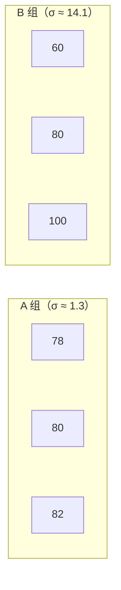

# 方差与标准差

> **所属路径**：`00_高中复习/01_数学基础/10_统计基础/02_方差与标准差`
> **预计学习时间**：40 分钟
> **难度等级**：⭐

---

## 前置知识

- [平均数中位数众数](../01_平均数中位数众数/01_平均数中位数众数.md) — 方差的计算建立在平均数的基础上
- [概率基础](../../../09_概率基础/) — 随机变量的方差是本节内容的概率论延伸

> 如果以上内容还不熟悉，建议先完成对应课程再继续。

---

## 学习目标

完成本节后，你将能够：

1. 解释方差和标准差的定义，并理解它们衡量的是"数据离中心有多远"
2. 手动计算一组数据的方差和标准差
3. 区分总体方差与样本方差，理解为什么样本方差的分母是 $n - 1$
4. 运用变异系数比较不同量纲数据的离散程度
5. 理解方差在人工智能中的应用（特征缩放、归一化）

---

## 正文讲解

### 1. 光看"中心"还不够

在上一节中，我们学会了用平均数、中位数和众数来描述数据的"中心位置"。但仅知道中心是不够的。考虑以下两组数据：

- A 组成绩：78, 80, 82, 80, 80
- B 组成绩：60, 70, 80, 90, 100

两组数据的平均数都是 80，但直觉告诉我们它们非常不同——A 组成绩集中在 80 附近，B 组成绩则天南海北。我们需要一个数字来量化这种"分散程度"，这就是 **离散程度（Dispersion）** 指标要回答的问题。

在人工智能中，理解数据的离散程度至关重要。如果一个特征的值域跨越 0 到 10000，而另一个特征只在 0 到 1 之间变化，直接把它们喂给模型会出问题——值域大的特征会"压制"值域小的特征。解决这个问题的方法就是 **[特征缩放（Feature Scaling）](../../../../01_基础能力/05_数据能力/03_特征工程/02_特征缩放/)**，而特征缩放的核心工具正是标准差。

下面这张图直观展示了"同均值、不同离散程度"的数据差异：


> 📌 **图解说明**：上图用散点带状图比较两组数据——Group A（蓝色）紧密聚集在均值附近，标准差小；Group B（红色）分散范围大，标准差大。下图用三条正态分布曲线展示相同均值 $\mu = 80$ 下不同 $\sigma$ 对分布形状的影响—— $\sigma$ 越小曲线越高越窄，越大则越矮越宽。你可以运行 `code/plot_dispersion.py` 自行生成这张图。

### 2. 从偏差到方差

衡量"数据离中心有多远"最直接的想法是：计算每个数据与平均数的偏差，然后求平均。设数据为 $x_1, x_2, \ldots, x_n$ ，平均数为 $\bar{x}$ ，第 $i$ 个数据的偏差为：

$$
d_i = x_i - \bar{x}
$$

但如果直接对偏差求平均，结果永远是零（上一节提到过的性质）：

$$
\frac{1}{n} \sum_{i=1}^{n} (x_i - \bar{x}) = 0
$$

正偏差和负偏差互相抵消了！怎么办？一个自然的解决方案是：先把偏差 **平方**（消除正负号），再求平均。这就是 **方差（Variance）** 的定义。

**总体方差（Population Variance）** 的公式为：

$$
\sigma^2 = \frac{1}{N} \sum_{i=1}^{N} (x_i - \mu)^2
$$

其中 $\mu$ 是总体平均数， $N$ 是总体数据个数。

> **直觉解读**：方差就是"每个数据到平均数的距离的平方"的平均值。方差越大，数据越分散；方差越小，数据越集中。

想一想：为什么选择平方而不是取绝对值来消除正负号？原因有几个——平方函数在数学上可导（方便后续优化计算），而且它对大偏差的"惩罚"更重，能更灵敏地反映极端值。这种"平方惩罚"的思想在机器学习的 **均方误差（Mean Squared Error, MSE）** 损失函数中同样体现得淋漓尽致。

### 3. 手动计算方差

让我们用 A 组和 B 组的数据来实际计算。

**A 组**：78, 80, 82, 80, 80，平均数 $\bar{x} = 80$

| $x_i$ | $x_i - \bar{x}$ | $(x_i - \bar{x})^2$ |
| ------ | ---------------- | -------------------- |
| 78 | -2 | 4 |
| 80 | 0 | 0 |
| 82 | 2 | 4 |
| 80 | 0 | 0 |
| 80 | 0 | 0 |

$$
\sigma_A^2 = \frac{4 + 0 + 4 + 0 + 0}{5} = \frac{8}{5} = 1.6
$$

**B 组**：60, 70, 80, 90, 100，平均数 $\bar{x} = 80$

| $x_i$ | $x_i - \bar{x}$ | $(x_i - \bar{x})^2$ |
| ------ | ---------------- | -------------------- |
| 60 | -20 | 400 |
| 70 | -10 | 100 |
| 80 | 0 | 0 |
| 90 | 10 | 100 |
| 100 | 20 | 400 |

$$
\sigma_B^2 = \frac{400 + 100 + 0 + 100 + 400}{5} = \frac{1000}{5} = 200
$$

B 组的方差是 A 组的 125 倍，精确地反映出 B 组数据远比 A 组分散。

### 4. 标准差——回到原始单位

方差有一个不太方便的地方：它的单位是原始数据单位的 **平方**。比如成绩的方差单位是"分²"，这不太好解释。于是我们对方差取平方根，得到 **标准差（Standard Deviation）**：

$$
\sigma = \sqrt{\sigma^2} = \sqrt{\frac{1}{N} \sum_{i=1}^{N} (x_i - \mu)^2}
$$

上面的例子中：
- A 组标准差： $\sigma_A = \sqrt{1.6} \approx 1.26$ 分
- B 组标准差： $\sigma_B = \sqrt{200} \approx 14.14$ 分

标准差的含义非常直观：它大致表示"数据平均偏离中心多少"。A 组同学的成绩平均只偏离 80 分约 1.3 分，而 B 组平均偏离约 14.1 分。



> 📌 **图解说明**：A 组数据紧密聚集在平均数 80 附近，标准差小；B 组数据分布范围广，标准差大。标准差直观反映了数据的"散开程度"。

### 5. 总体方差与样本方差

在实际应用中，我们很少能获得总体的全部数据，通常只有一个样本。此时使用 **样本方差（Sample Variance）**，它的公式稍有不同——分母变成了 $n - 1$ 而不是 $n$ ：

$$
s^2 = \frac{1}{n - 1} \sum_{i=1}^{n} (x_i - \bar{x})^2
$$

> **直觉解读**：为什么分母是 $n - 1$ ？这叫做 **贝塞尔校正（Bessel's Correction）**。用样本平均数 $\bar{x}$ 代替真实总体平均数 $\mu$ 时，我们倾向于"低估"真实的离散程度（因为 $\bar{x}$ 本身就是从样本算出来的，天然更"靠近"样本数据）。分母减 1 可以修正这种低估。

> ⚠️ **超纲提示**：样本方差使用 $n - 1$ 作为分母（贝塞尔校正）属于大学概率统计的内容。在高中阶段，方差公式的分母统一使用 $n$ 。这里提前介绍 $n - 1$ 的做法，是因为在后续的机器学习和数据分析实践中（如 Python 的 `numpy.var(ddof=1)`），默认就是使用这种校正。如果当前感觉难以理解，可以先跳过这一小节，只记住高中公式中的分母是 $n$ 即可。

在高中阶段和数据量较大时，两者差异很小，但在严谨的统计分析和机器学习的代码实现中，需要注意这一区别。

### 6. 变异系数——跨量纲比较

> ⚠️ **超纲提示**：变异系数不属于高中课标的必学内容，而是大学统计学中的概念。这里提前介绍，是因为在数据分析和机器学习中经常需要比较不同量纲特征的离散程度。如果当前感觉难以理解，可以先跳过本小节。

假设我们想比较"身高的离散程度"和"体重的离散程度"，直接比较标准差不公平——身高的数值本身就比体重大得多。为此，我们引入 **变异系数（Coefficient of Variation, CV）**：

$$
\text{CV} = \frac{\sigma}{\mu} \times 100\%
$$

变异系数是标准差与平均数的比值，它是一个无量纲的相对指标，可以用来比较不同单位、不同量级数据的离散程度。

### 7. 在人工智能中的应用

方差和标准差在人工智能中无处不在：

- **标准化（Standardization）** ：将特征变换为 $z = \dfrac{x - \mu}{\sigma}$ ，使其均值为 0、标准差为 1，是训练模型前最常见的数据预处理步骤
- **批归一化（Batch Normalization）** ：深度学习中按每一批数据计算均值和方差来稳定训练过程
- **偏差-方差权衡（Bias-Variance Tradeoff）** ：模型选择的核心框架——方差描述模型对不同训练集的敏感程度

---

## 动手实践

让我们用 Python 计算方差和标准差，并验证总体方差与样本方差的区别。

```python
# 文件：code/variance_std.py
# 手动计算方差与标准差，并与 Python 内置函数对比
# 环境要求：Python 3.10+（仅使用标准库）

from statistics import variance, stdev, pvariance, pstdev

# 两组数据
group_a = [78, 80, 82, 80, 80]
group_b = [60, 70, 80, 90, 100]

def manual_stats(data):
    """手动计算总体方差/标准差和样本方差/标准差"""
    n = len(data)
    mean_val = sum(data) / n
    # 总体方差
    pop_var = sum((x - mean_val) ** 2 for x in data) / n
    # 样本方差（贝塞尔校正）
    sam_var = sum((x - mean_val) ** 2 for x in data) / (n - 1)
    return {
        "平均数": mean_val,
        "总体方差": pop_var,
        "总体标准差": pop_var ** 0.5,
        "样本方差": sam_var,
        "样本标准差": sam_var ** 0.5,
    }

for name, data in [("A 组", group_a), ("B 组", group_b)]:
    stats = manual_stats(data)
    print(f"=== {name}: {data} ===")
    print(f"  平均数:     {stats['平均数']:.2f}")
    print(f"  总体方差:   {stats['总体方差']:.2f}  (内置: {pvariance(data):.2f})")
    print(f"  总体标准差: {stats['总体标准差']:.2f}  (内置: {pstdev(data):.2f})")
    print(f"  样本方差:   {stats['样本方差']:.2f}  (内置: {variance(data):.2f})")
    print(f"  样本标准差: {stats['样本标准差']:.2f}  (内置: {stdev(data):.2f})")
    print()
```

**运行说明**：
- 环境要求：Python 3.10+（仅使用标准库 `statistics`）
- 运行命令：`python code/variance_std.py`

**预期输出**：
```
=== A 组: [78, 80, 82, 80, 80] ===
  平均数:     80.00
  总体方差:   1.60  (内置: 1.60)
  总体标准差: 1.26  (内置: 1.26)
  样本方差:   2.00  (内置: 2.00)
  样本标准差: 1.41  (内置: 1.41)

=== B 组: [60, 70, 80, 90, 100] ===
  平均数:     80.00
  总体方差:   200.00  (内置: 200.00)
  总体标准差: 14.14  (内置: 14.14)
  样本方差:   250.00  (内置: 250.00)
  样本标准差: 15.81  (内置: 15.81)
```

注意观察：样本方差（分母 $n-1$ ）总是比总体方差（分母 $n$ ）略大，这正是贝塞尔校正的效果。

---

## 典型误区

| 误区 | 正确理解 |
| ---- | -------- |
| "方差和标准差是一回事" | 标准差是方差的平方根，它们的单位不同；标准差的单位与原数据一致，更容易解释 |
| "方差越大数据越不好" | 方差只是描述离散程度，大小本身没有好坏之分；不同场景有不同需求 |
| "样本方差分母用 $n$ 就行" | 用 $n$ 会系统性地低估总体方差，应使用 $n - 1$ （贝塞尔校正） |
| "标准差可以直接跨量纲比较" | 不同量纲的数据应使用变异系数（CV）来比较离散程度 |

---

## 练习题

### 练习 1：手动计算（难度：⭐）

数据集 {4, 8, 6, 5, 7} 的平均数为 6。请计算总体方差和总体标准差。

<details>
<summary>💡 提示</summary>

列表计算每个 $(x_i - \bar{x})^2$ ，然后求和再除以 $n = 5$ 。

</details>

<details>
<summary>✅ 参考答案</summary>

$$\sigma^2 = \dfrac{(4-6)^2 + (8-6)^2 + (6-6)^2 + (5-6)^2 + (7-6)^2}{5} = \dfrac{4 + 4 + 0 + 1 + 1}{5} = \dfrac{10}{5} = 2$$

$$\sigma = \sqrt{2} \approx 1.41$$

</details>

### 练习 2：总体与样本方差（难度：⭐⭐）

从某工厂抽取了 4 个零件，其重量（克）为：10.2, 9.8, 10.1, 9.9。

（1）计算样本方差 $s^2$ 和样本标准差 $s$ 。
（2）如果用总体方差公式，结果会怎样？与样本方差有何区别？

<details>
<summary>💡 提示</summary>

平均数 $\bar{x} = 10.0$ 。样本方差分母为 $n - 1 = 3$ ，总体方差分母为 $n = 4$ 。

</details>

<details>
<summary>✅ 参考答案</summary>

平均数 $\bar{x} = \dfrac{10.2 + 9.8 + 10.1 + 9.9}{4} = 10.0$

偏差平方和 $= (0.2)^2 + (-0.2)^2 + (0.1)^2 + (-0.1)^2 = 0.04 + 0.04 + 0.01 + 0.01 = 0.10$

（1）样本方差 $s^2 = \dfrac{0.10}{3} \approx 0.0333$ ，样本标准差 $s \approx 0.183$ 克

（2）总体方差 $\sigma^2 = \dfrac{0.10}{4} = 0.025$ ，比样本方差小。样本方差通过除以 $n-1$ 来校正低估，是对总体方差的无偏估计。

</details>

### 练习 3：变异系数应用（难度：⭐⭐）

某班学生的身高平均值为 170 cm，标准差为 5 cm；体重平均值为 60 kg，标准差为 8 kg。哪个指标的离散程度更大？

<details>
<summary>💡 提示</summary>

不能直接比较 5 cm 和 8 kg（单位不同），需要用变异系数 $\text{CV} = \dfrac{\sigma}{\mu}$ 来做无量纲比较。

</details>

<details>
<summary>✅ 参考答案</summary>

身高的变异系数 $= \dfrac{5}{170} \approx 2.94\%$

体重的变异系数 $= \dfrac{8}{60} \approx 13.33\%$

体重的变异系数更大，说明体重的相对离散程度远大于身高。

</details>

---

## 下一步学习

- 📖 下一个知识点：[统计图表](../03_统计图表/03_统计图表.md) — 学会用图形直观展示数据的分布和离散情况
- 🔗 相关知识点：[平均数中位数众数](../01_平均数中位数众数/01_平均数中位数众数.md) — 回顾集中趋势指标
- 📚 拓展阅读：了解 [偏差与方差](../../../../02_核心原理/02_经典机器学习/10_偏差与方差/) 在机器学习模型选择中的核心作用

---

## 参考资料

1. [Khan Academy — Variance and Standard Deviation](https://www.khanacademy.org/math/statistics-probability/summarizing-quantitative-data/variance-standard-deviation-population/a/calculating-standard-deviation-step-by-step) — 方差与标准差的交互式教程（公开课程）
2. [Python statistics 模块官方文档](https://docs.python.org/3/library/statistics.html) — `variance`、`stdev` 等函数的参考（官方文档）
3. [维基百科 — Variance](https://en.wikipedia.org/wiki/Variance) — 方差的数学性质与应用总览（公共知识库）
