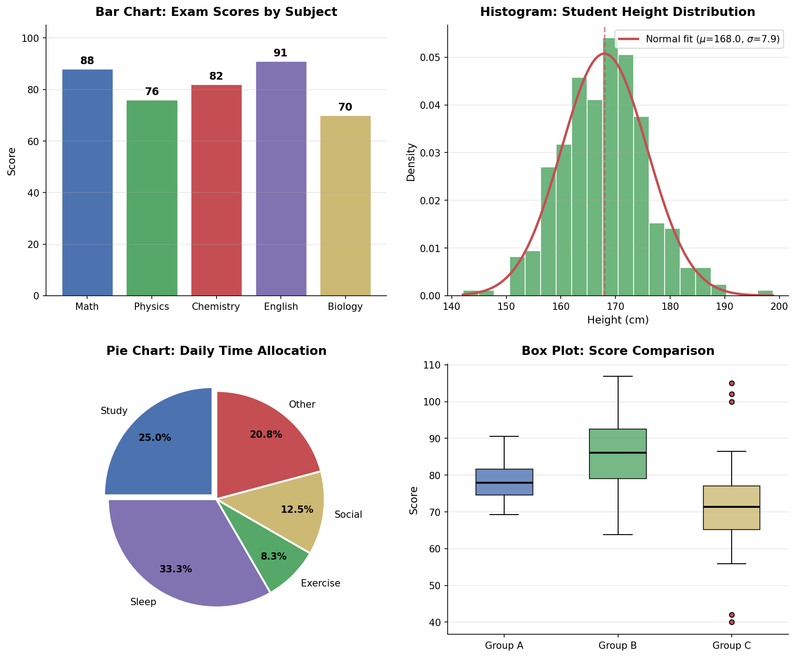
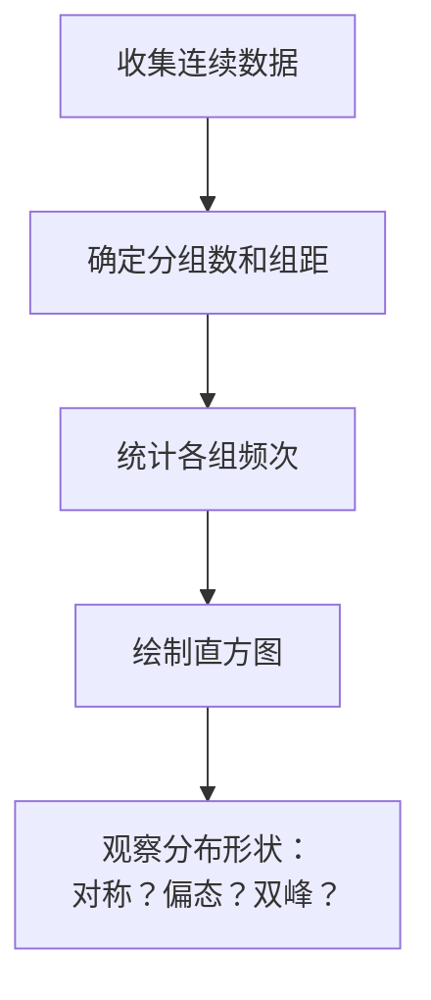

# 统计图表

> **所属路径**：`00_高中复习/01_数学基础/10_统计基础/03_统计图表`
> **预计学习时间**：35 分钟
> **难度等级**：⭐

---

## 前置知识

- [平均数中位数众数](../01_平均数中位数众数/01_平均数中位数众数.md) — 图表中常需标注平均数、中位数等统计量
- [方差与标准差](../02_方差与标准差/02_方差与标准差.md) — 箱线图中的"箱体"直接反映数据的离散程度

> 如果以上内容还不熟悉，建议先完成对应课程再继续。

---

## 学习目标

完成本节后，你将能够：

1. 区分直方图、条形图、饼图、箱线图和散点图的用途
2. 根据数据类型和分析目的选择合适的图表
3. 使用 Python 的 matplotlib 库绘制基本统计图表
4. 理解统计图表在人工智能探索性数据分析中的作用

---

## 正文讲解

### 1. 为什么要画图

数字是精确的，但也是抽象的。一张好的图表可以让你在几秒钟内看到数据中的模式、趋势和异常——而这些信息可能隐藏在几千行数据表中，用眼睛根本看不出来。

统计学家 John Tukey 曾说："一张图的最大价值在于它迫使我们注意到那些我们从未预料到的东西。" 在人工智能项目中，建模之前几乎一定会做 **[探索性数据分析（Exploratory Data Analysis, EDA）](../../../../01_基础能力/05_数据能力/08_探索性数据分析/)**，而 EDA 的核心工具就是各种统计图表。

接下来我们认识五种最常用的统计图表，并学习什么场景下该选哪种图。

下面这张图展示了四种最常见的统计图表——条形图、直方图、饼图和箱线图：



> 📌 **图解说明**：左上为条形图（比较各科成绩），右上为直方图（展示身高分布并叠加正态拟合曲线），左下为饼图（展示时间分配比例），右下为箱线图（对比三组数据的分布和异常值）。你可以运行 `code/plot_chart_types.py` 自行生成这张图。

### 2. 直方图——看连续数据的分布

**直方图（Histogram）** 用来展示连续数据的分布形状。它将数据的取值范围分成若干等宽的"组"（也叫"箱"），然后统计每组中有多少数据落入。

直方图的横轴是数值区间，纵轴是频率或频次，每个"柱子"的面积代表该区间的数据比例。与条形图不同的是，直方图的柱子之间 **没有间隔**，因为它表示的是连续变量。



> 📌 **图解说明**：绘制直方图的基本步骤——先确定分组方案，统计每组频次，最后通过图形观察分布的形状特征。

从直方图中，你可以快速判断：
- 数据是否 **对称分布**（像一座山丘，两边差不多高）
- 是否存在 **偏态**（山丘偏向一边）
- 是否有 **多个峰**（可能混合了不同群体的数据）
- 是否有 **异常值**（远离主体的孤立柱子）

在人工智能中，用直方图查看特征的分布是数据预处理的第一步——如果分布严重偏态，可能需要做对数变换；如果有多个峰，可能暗示数据中混合了不同类别。

### 3. 条形图——比较类别数据

**条形图（Bar Chart）** 用来比较不同类别的数量或频率。它的每根柱子代表一个类别，柱子的高度表示该类别的数值。

条形图和直方图最大的区别在于：
- 条形图用于 **分类数据**（如编程语言、国家、颜色），柱子之间有间隔
- 直方图用于 **连续数据**（如身高、体重、温度），柱子之间紧密相连

条形图非常适合回答"哪个类别最多/最少"的问题。例如在自然语言处理中，用条形图统计语料库中各个词汇的出现频率，可以快速找出高频词和低频词。

### 4. 饼图——展示占比

**饼图（Pie Chart）** 将一个圆形按比例切割，每一块代表一个类别占总量的百分比。

饼图最适合展示 **部分与整体的关系**，但有两个常见的使用限制：
- 类别不宜超过 5–6 个，否则切片太多难以区分
- 如果各类别占比相近，饼图的区分能力不如条形图

在人工智能项目中，饼图常用于展示数据集的类别分布。例如一个情感分类数据集中正面、负面、中性评论各占多少比例——如果某个类别严重不足，可能需要考虑 **数据不平衡** 问题。

### 5. 箱线图——一图看五数

**箱线图（Box Plot）** 是一种用 5 个关键数值概括数据分布的图表，也叫"箱须图"。这 5 个值被称为 **五数概括（Five-Number Summary）**：

| 名称 | 含义 |
| ---- | ---- |
| 最小值 | 数据的下界（排除异常值） |
| 第一四分位数 $Q_1$ | 25% 的数据小于此值 |
| 中位数 $Q_2$ | 50% 的数据小于此值 |
| 第三四分位数 $Q_3$ | 75% 的数据小于此值 |
| 最大值 | 数据的上界（排除异常值） |

箱体的长度 $\text{IQR} = Q_3 - Q_1$ 称为 **四分位距（Interquartile Range）**，反映了数据中间 50% 的分散程度。超出 $Q_1 - 1.5 \times \text{IQR}$ 或 $Q_3 + 1.5 \times \text{IQR}$ 范围的数据点被视为 **异常值**，在图中用单独的点标记。


> 📌 **图解说明**：箱线图的五数概括结构。箱体从 $Q_1$ 到 $Q_3$ ，中间线为中位数，两端的须线延伸到最小值和最大值（排除异常值后）。

箱线图特别适合 **比较多组数据的分布**。在机器学习中，用箱线图对比不同模型在多次实验中的得分分布，可以一目了然地看出哪个模型既准确又稳定。

### 6. 散点图——看变量关系

**散点图（Scatter Plot）** 用来展示两个变量之间的关系。每个数据点在图中对应一个坐标 $(x, y)$ 。

通过散点图，你可以直观判断：
- 两个变量是否存在 **正相关**（点大致沿左下到右上排列）
- 是否存在 **负相关**（点大致沿左上到右下排列）
- 是否 **没有相关性**（点随机散布）
- 关系是 **线性的** 还是 **非线性的**

散点图是 **[回归分析](../05_回归分析初步/05_回归分析初步.md)** 的起点——在拟合回归线之前，一定要先画散点图来确认变量之间确实存在某种趋势。在人工智能的特征选择中，散点图也用于初步判断某个特征与目标变量之间是否有可利用的关系。

### 7. 图表选择指南

面对不同类型的数据和分析目的，如何选择合适的图表？下面这张决策表可以帮到你：

| 分析目的 | 数据类型 | 推荐图表 |
| -------- | -------- | -------- |
| 查看单变量分布 | 连续 | 直方图、箱线图 |
| 比较类别数量 | 分类 | 条形图 |
| 展示部分与整体 | 分类 | 饼图 |
| 发现异常值 | 连续 | 箱线图 |
| 探索两变量关系 | 连续 | 散点图 |
| 对比多组分布 | 连续 | 并排箱线图 |

---

## 动手实践

下面我们用 Python 的 matplotlib 库来绘制这些图表，感受它们各自展示数据的方式。

```python
# 文件：code/stat_charts.py
# 用 matplotlib 绘制五种常见统计图表
# 环境要求：Python 3.10+, matplotlib==3.7+, numpy==1.24+

import matplotlib.pyplot as plt
import numpy as np

plt.rcParams['font.sans-serif'] = ['DejaVu Sans']
plt.rcParams['axes.unicode_minus'] = False

# 生成模拟数据
np.random.seed(42)
scores = np.random.normal(75, 10, 200)  # 200 名学生的成绩

fig, axes = plt.subplots(2, 2, figsize=(12, 10))

# 1. 直方图
axes[0, 0].hist(scores, bins=15, color='steelblue', edgecolor='white', alpha=0.8)
axes[0, 0].axvline(np.mean(scores), color='red', linestyle='--', label=f'Mean={np.mean(scores):.1f}')
axes[0, 0].axvline(np.median(scores), color='orange', linestyle='--', label=f'Median={np.median(scores):.1f}')
axes[0, 0].set_title('Histogram of Scores')
axes[0, 0].set_xlabel('Score')
axes[0, 0].set_ylabel('Frequency')
axes[0, 0].legend()

# 2. 条形图
languages = ['Python', 'Java', 'C++', 'JavaScript', 'Go']
popularity = [35, 25, 15, 18, 7]
axes[0, 1].bar(languages, popularity, color=['#4ecdc4', '#ff6b6b', '#45b7d1', '#f9ca24', '#6c5ce7'])
axes[0, 1].set_title('Programming Language Popularity')
axes[0, 1].set_ylabel('Percentage (%)')

# 3. 箱线图（对比三组数据）
group_a = np.random.normal(80, 5, 50)
group_b = np.random.normal(75, 15, 50)
group_c = np.append(np.random.normal(70, 8, 45), [20, 25, 98, 99, 100])  # 含异常值
bp = axes[1, 0].boxplot([group_a, group_b, group_c], labels=['Group A', 'Group B', 'Group C'],
                         patch_artist=True)
colors = ['#4ecdc4', '#ff6b6b', '#f9ca24']
for patch, color in zip(bp['boxes'], colors):
    patch.set_facecolor(color)
axes[1, 0].set_title('Box Plot Comparison')
axes[1, 0].set_ylabel('Score')

# 4. 散点图
x = np.linspace(0, 10, 50) + np.random.normal(0, 0.5, 50)
y = 2 * x + 3 + np.random.normal(0, 2, 50)
axes[1, 1].scatter(x, y, color='steelblue', alpha=0.7, edgecolors='white')
axes[1, 1].set_title('Scatter Plot: Study Hours vs Score')
axes[1, 1].set_xlabel('Study Hours')
axes[1, 1].set_ylabel('Score')

plt.tight_layout()
plt.savefig('stat_charts.png', dpi=150, bbox_inches='tight', facecolor='white')
plt.close()
print("Charts saved to stat_charts.png")
```

**运行说明**：
- 环境要求：Python 3.10+，matplotlib >= 3.7，numpy >= 1.24
- 运行命令：`python code/stat_charts.py`
- 运行后会在当前目录生成 `stat_charts.png` 文件

**预期输出**：
```
Charts saved to stat_charts.png
```

生成的图片包含 4 种图表：直方图显示成绩的分布形状并标注均值和中位数；条形图对比编程语言的流行度；箱线图对比三组数据的分布和异常值；散点图展示学习时长与成绩之间的正相关趋势。

---

## 典型误区

| 误区 | 正确理解 |
| ---- | -------- |
| "直方图和条形图是一样的" | 直方图用于连续数据（柱子无间隔），条形图用于分类数据（柱子有间隔） |
| "饼图适合所有比例展示" | 类别超过 6 个或占比相近时，条形图比饼图更清晰 |
| "箱线图只能看中位数" | 箱线图同时展示了数据的中心、离散度、偏态和异常值，信息非常丰富 |
| "散点图中的趋势一定代表因果关系" | 散点图只能揭示相关性，不能直接证明因果关系 |

---

## 练习题

### 练习 1：图表选择（难度：⭐）

以下场景各应使用什么类型的图表？

（a）展示某班 50 名学生身高的分布情况
（b）比较 4 种水果的销量
（c）查看广告投入与销售额之间是否有关系
（d）比较三个班级考试成绩的分布并识别异常值

<details>
<summary>💡 提示</summary>

根据数据类型（连续 vs 分类）和分析目的（分布 vs 比较 vs 关系）来选择。

</details>

<details>
<summary>✅ 参考答案</summary>

（a）**直方图** — 身高是连续数据，需要查看分布形状

（b）**条形图** — 水果种类是分类数据，需要比较数量

（c）**散点图** — 两个连续变量，需要探索关系

（d）**箱线图** — 需要对比多组数据的分布并识别异常值

</details>

### 练习 2：读图分析（难度：⭐⭐）

某箱线图显示： $Q_1 = 60$ ， $Q_2 = 75$ ， $Q_3 = 85$ ，最小值 40，最大值 95，且有两个异常值分别为 15 和 100。

（1）计算四分位距 IQR。
（2）验证 15 和 100 是否确实是异常值。
（3）该数据的分布是对称的还是偏态的？如何判断？

<details>
<summary>💡 提示</summary>

IQR $= Q_3 - Q_1$ 。异常值的判定标准是超出 $Q_1 - 1.5 \times \text{IQR}$ 或 $Q_3 + 1.5 \times \text{IQR}$ 。偏态可以通过中位数在箱体中的位置来判断。

</details>

<details>
<summary>✅ 参考答案</summary>

（1） $\text{IQR} = Q_3 - Q_1 = 85 - 60 = 25$

（2）下界 $= Q_1 - 1.5 \times \text{IQR} = 60 - 37.5 = 22.5$ ，上界 $= Q_3 + 1.5 \times \text{IQR} = 85 + 37.5 = 122.5$

15 < 22.5，确实是异常值 ✓；100 < 122.5，**不是异常值** ✗（100 在正常范围内）

（3）中位数 $Q_2 = 75$ 更靠近 $Q_3 = 85$ 而远离 $Q_1 = 60$ ，说明箱体下半部分更宽，数据 **左偏（负偏态）**——即低分端的数据更分散。

</details>

### 练习 3：编程实践（难度：⭐⭐）

使用 matplotlib 为以下数据绘制直方图和箱线图，并标注平均数和中位数。

```python
data = [45, 52, 58, 61, 63, 65, 67, 68, 70, 72,
        74, 75, 76, 78, 80, 82, 85, 88, 92, 150]
```

观察：最后一个值 150 是否为异常值？平均数和中位数哪个更能代表数据的中心？

<details>
<summary>💡 提示</summary>

用 `plt.hist()` 绘制直方图，用 `plt.boxplot()` 绘制箱线图。用 `plt.axvline()` 标注均值和中位数。

</details>

<details>
<summary>✅ 参考答案</summary>

```python
import matplotlib.pyplot as plt
import numpy as np

data = [45, 52, 58, 61, 63, 65, 67, 68, 70, 72,
        74, 75, 76, 78, 80, 82, 85, 88, 92, 150]

fig, (ax1, ax2) = plt.subplots(1, 2, figsize=(12, 5))

ax1.hist(data, bins=10, color='steelblue', edgecolor='white')
ax1.axvline(np.mean(data), color='red', linestyle='--', label=f'Mean={np.mean(data):.1f}')
ax1.axvline(np.median(data), color='orange', linestyle='--', label=f'Median={np.median(data):.1f}')
ax1.legend()
ax1.set_title('Histogram')

ax2.boxplot(data, vert=True)
ax2.set_title('Box Plot')

plt.tight_layout()
plt.savefig('outlier_analysis.png', dpi=150, bbox_inches='tight', facecolor='white')
plt.close()
```

从箱线图中可以看到 150 被标记为异常值。平均数约 75.5，中位数为 73.0。由于 150 拉高了平均数，**中位数 73.0 更能代表数据的中心**。

</details>

---

## 下一步学习

- 📖 下一个知识点：[抽样方法](../04_抽样方法/04_抽样方法.md) — 学会用科学的方法从总体中获取有代表性的样本
- 🔗 相关知识点：[方差与标准差](../02_方差与标准差/02_方差与标准差.md) — 箱线图中的 IQR 与数据离散程度密切相关
- 📚 拓展阅读：探索性数据分析的完整流程见 [EDA](../../../../01_基础能力/05_数据能力/08_探索性数据分析/)

---

## 参考资料

1. [Khan Academy — Displaying and Describing Data](https://www.khanacademy.org/math/statistics-probability/displaying-describing-data) — 统计图表的交互式教程（公开课程）
2. [matplotlib 官方教程](https://matplotlib.org/stable/tutorials/index.html) — Python 可视化库的权威指南（官方文档）
3. [维基百科 — Box Plot](https://en.wikipedia.org/wiki/Box_plot) — 箱线图的历史与变体介绍（公共知识库）
