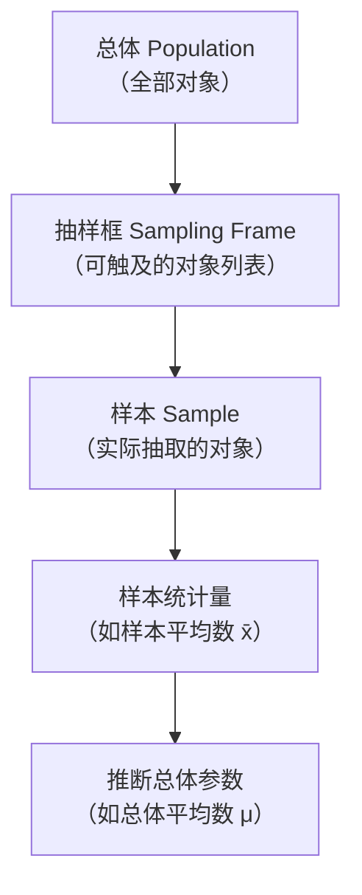
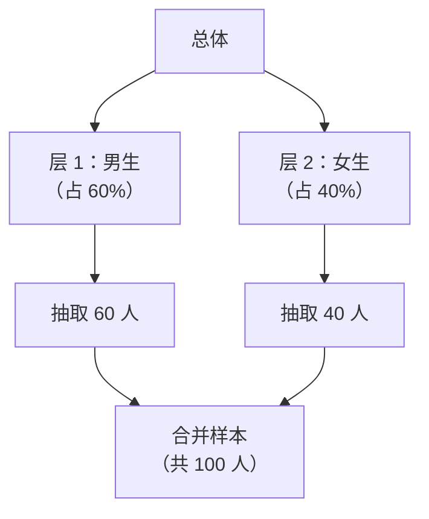
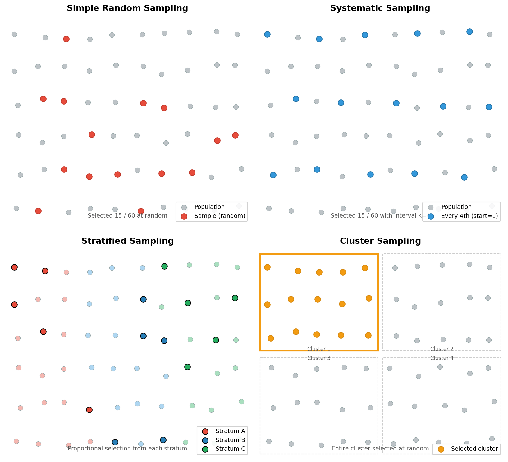

# 抽样方法

> **所属路径**：`00_高中复习/01_数学基础/10_统计基础/04_抽样方法`
> **预计学习时间**：40 分钟
> **难度等级**：⭐⭐

---

## 前置知识

- [平均数中位数众数](../01_平均数中位数众数/01_平均数中位数众数.md) — 抽样的目标之一是准确估计总体的集中趋势指标
- [方差与标准差](../02_方差与标准差/02_方差与标准差.md) — 抽样误差本质上就是样本统计量的变异性
- [统计图表](../03_统计图表/03_统计图表.md) — 抽样后常通过图表检查样本的代表性

> 如果以上内容还不熟悉，建议先完成对应课程再继续。

---

## 学习目标

完成本节后，你将能够：

1. 解释总体与样本的关系，理解抽样的必要性
2. 区分四种基本抽样方法：简单随机抽样、系统抽样、分层抽样和整群抽样
3. 识别常见的抽样偏差来源并理解如何避免
4. 将抽样方法与人工智能中的数据划分、交叉验证联系起来

---

## 正文讲解

### 1. 为什么不能"全部调查"

假设你想知道全国高中生的平均身高。最理想的方法当然是测量每一个高中生——但全国有上千万高中生，逐一测量既不现实也不经济。于是你只能从中选出一部分人来测量，再用他们的数据来推测全国的情况。这就是 **抽样（Sampling）** 的核心思想：用部分推断整体。

在人工智能中，抽样无处不在。你不可能标注互联网上所有的图片，只能抽取一部分来训练模型；你不可能对所有用户做问卷调查，只能采样一批用户来分析行为。更关键的是，模型训练中的 **训练集/验证集/测试集划分（Train/Validation/Test Split）** 本质上也是一种抽样过程——如何划分直接影响模型评估的可靠性。

但抽样并不是"随便抓一些"——科学的抽样方法才能让样本真正"代表"总体。让我们先明确几个核心概念。

### 2. 总体、样本与抽样框

**总体（Population）** 是你想研究的全部对象的集合。例如"全国所有高中生"就是总体。

**样本（Sample）** 是从总体中实际抽取的一部分对象。例如"从全国抽取的 2000 名高中生"就是样本。

**抽样框（Sampling Frame）** 是总体中所有可能被抽到的个体的名单或编号。理想情况下抽样框应覆盖全部总体，但实际中常有遗漏——比如只用某个省的学籍系统作为抽样框，就会漏掉其他省的学生。



> 📌 **图解说明**：抽样的逻辑链条——从总体出发，通过抽样框选取样本，计算样本统计量，再用统计量推断总体参数。每一步都可能引入误差。

好的抽样需要满足两个核心要求：
- **代表性**：样本的特征分布应尽量接近总体
- **随机性**：每个个体被抽中的概率应当是可知的（最好是相等的）

### 3. 简单随机抽样

**简单随机抽样（Simple Random Sampling, SRS）** 是最基本的抽样方法：总体中每个个体被抽中的概率都相等，且个体之间的抽取相互独立。

操作方式：给总体中每个个体编号，然后用随机数表、抽签或计算机随机数生成器来选取样本。

**优点**：实现简单，理论性质好，不需要总体的额外信息。

**缺点**：当总体规模很大或结构复杂时，纯随机抽样可能"运气不好"——比如抽出的样本恰好全是男生，没有女生。

在 Python 中实现简单随机抽样非常容易：

```python
import random

population = list(range(1, 1001))  # 编号 1 到 1000
sample = random.sample(population, k=50)  # 随机抽取 50 个
```

在人工智能中，`sklearn.model_selection.train_test_split` 默认就是简单随机抽样——随机将数据划分为训练集和测试集。

### 4. 系统抽样

**系统抽样（Systematic Sampling）** 也叫等距抽样：先确定一个间隔 $k$ ，随机选一个起点，然后每隔 $k$ 个抽取一个。

设总体有 $N$ 个个体，需要抽取 $n$ 个，则间隔为：

$$
k = \left\lfloor \frac{N}{n} \right\rfloor
$$

例如从 1000 人中抽 50 人， $k = 20$ 。随机选择起点（比如第 7 个），然后抽取第 7, 27, 47, 67, …… 个个体。

**优点**：操作比简单随机抽样更方便，样本在总体中分布均匀。

**缺点**：如果总体本身有周期性规律（比如每隔 20 个是同一个班级），系统抽样可能恰好踩中这个周期，导致样本严重偏倚。

### 5. 分层抽样

**分层抽样（Stratified Sampling）** 是当总体内部存在明显差异时，最能保证代表性的方法。操作步骤：

1. 先按某个特征（如性别、年级、地区）将总体分成若干 **层（Stratum）**
2. 在每一层内独立进行简单随机抽样
3. 各层的样本合并成最终样本

常见的按比例分配原则：各层的抽样比例与该层在总体中的占比相同。例如总体中男女比例 6:4，则样本中也按 6:4 的比例抽取。



> 📌 **图解说明**：分层抽样将总体按特征分层后，在每层内独立抽样，确保各层在样本中的比例与总体一致。

**优点**：确保重要的子群体在样本中有足够的代表，抽样误差通常比简单随机抽样更小。

**缺点**：需要事先知道总体的分层信息（如每层的大小和特征）。

在人工智能中，分层抽样对应的是 **分层划分（Stratified Split）**。例如在分类任务中，用 `train_test_split(X, y, stratify=y)` 确保训练集和测试集中各类别的比例与原数据一致——这在类别不平衡的数据中尤为重要。

### 6. 整群抽样

**整群抽样（Cluster Sampling）** 的思路与分层抽样相反——它先把总体分成若干"群"（如学校、社区、工厂），然后随机抽取若干个群，对被抽中的群进行全面调查。

例如要调查某市小学生的视力情况，可以先把所有小学看作若干个"群"，随机抽取 10 所小学，然后测量这 10 所小学所有学生的视力。

**优点**：实施成本低（不需要全面的个体名单），适合地理分散的总体。

**缺点**：如果群与群之间差异很大，代表性可能不足。

### 7. 抽样偏差

即使使用了科学的抽样方法，如果操作不当仍然会引入 **抽样偏差（Sampling Bias）**。常见的偏差来源包括：

| 偏差类型 | 说明 | 示例 |
| -------- | ---- | ---- |
| 选择偏差 | 某些个体被抽中的概率更高 | 只在网上发问卷，遗漏了不上网的人群 |
| 无响应偏差 | 被抽中的人拒绝参与 | 忙碌的人不填问卷，空闲的人填了 |
| 幸存者偏差 | 只观察到"存活下来的"个体 | 只分析成功的创业公司，忽略了失败的 |

在人工智能中，**[数据泄漏（Data Leakage）](../../../../01_基础能力/05_数据能力/07_数据泄漏/)** 也可以看作一种"抽样偏差"——如果测试集中混入了训练集的信息，模型的表现会虚高，无法代表真实场景。

### 8. 四种方法的对比

| 方法 | 核心操作 | 适用场景 | 代表性 | 实施难度 |
| ---- | -------- | -------- | ------ | -------- |
| 简单随机 | 完全随机抽取 | 总体均匀，个体差异不大 | 中 | 低 |
| 系统 | 等间隔抽取 | 总体无周期性，需要均匀分布 | 中 | 低 |
| 分层 | 按特征分层后各层随机 | 总体有明显子群差异 | 高 | 中 |
| 整群 | 随机抽取若干群 | 地理分散，调查成本高 | 低 | 低 |

下面这张图将四种抽样方法的效果可视化——每个小圆点代表总体中的一个个体，被选中的个体用醒目的颜色标出：



> 📌 **图解说明**：左上角是简单随机抽样（红色点随机散布）；右上角是系统抽样（蓝色点等间隔分布）；左下角是分层抽样（三种颜色代表三个层，每层各抽几个）；右下角是整群抽样（整个"群 3"被选中，其余群不选）。你可以运行 `code/plot_sampling_methods.py` 自行生成这张图。

---

## 动手实践

下面用 Python 模拟四种抽样方法，并比较它们的抽样效果。

```python
# 文件：code/sampling_methods.py
# 模拟四种抽样方法，比较样本平均数与总体平均数的差异
# 环境要求：Python 3.10+（仅使用标准库）

import random

random.seed(42)

# 构造总体：1000 名学生，分为两个群体
# 群体 A（600 人）：成绩均值 70
# 群体 B（400 人）：成绩均值 85
group_a = [random.gauss(70, 10) for _ in range(600)]
group_b = [random.gauss(85, 8) for _ in range(400)]
population = group_a + group_b
pop_mean = sum(population) / len(population)

print(f"总体大小: {len(population)}")
print(f"总体平均数: {pop_mean:.2f}")
print()

# 1. 简单随机抽样
srs_sample = random.sample(population, k=100)
srs_mean = sum(srs_sample) / len(srs_sample)
print(f"[简单随机抽样] 样本平均数: {srs_mean:.2f}, 偏差: {abs(srs_mean - pop_mean):.2f}")

# 2. 系统抽样
k = len(population) // 100  # 间隔
start = random.randint(0, k - 1)
sys_sample = [population[start + i * k] for i in range(100)]
sys_mean = sum(sys_sample) / len(sys_sample)
print(f"[系统抽样]     样本平均数: {sys_mean:.2f}, 偏差: {abs(sys_mean - pop_mean):.2f}")

# 3. 分层抽样（按群体比例抽样）
strat_a = random.sample(group_a, k=60)   # 60% 来自 A
strat_b = random.sample(group_b, k=40)   # 40% 来自 B
strat_sample = strat_a + strat_b
strat_mean = sum(strat_sample) / len(strat_sample)
print(f"[分层抽样]     样本平均数: {strat_mean:.2f}, 偏差: {abs(strat_mean - pop_mean):.2f}")

# 4. 整群抽样（将 1000 人分为 10 个群，随机选 1 个群）
clusters = [population[i*100:(i+1)*100] for i in range(10)]
chosen_cluster = random.choice(clusters)
cluster_mean = sum(chosen_cluster) / len(chosen_cluster)
print(f"[整群抽样]     样本平均数: {cluster_mean:.2f}, 偏差: {abs(cluster_mean - pop_mean):.2f}")

print(f"\n→ 分层抽样的偏差通常最小，因为它确保了各子群体的比例代表性。")
```

**运行说明**：
- 环境要求：Python 3.10+（仅使用标准库）
- 运行命令：`python code/sampling_methods.py`

**预期输出**（由于随机种子固定，输出值确定）：
```
总体大小: 1000
总体平均数: 76.08

[简单随机抽样] 样本平均数: 76.79, 偏差: 0.71
[系统抽样]     样本平均数: 76.20, 偏差: 0.12
[分层抽样]     样本平均数: 75.77, 偏差: 0.31
[整群抽样]     样本平均数: 72.33, 偏差: 3.75

→ 分层抽样的偏差通常最小，因为它确保了各子群体的比例代表性。
```

从结果可以看到：整群抽样的偏差最大（因为只选了一个群，恰好是成绩偏低的群体），而分层抽样和系统抽样的偏差都较小。多次运行会发现分层抽样的表现最稳定。

---

## 典型误区

| 误区 | 正确理解 |
| ---- | -------- |
| "样本越大越好" | 样本量增大能降低随机误差，但如果抽样方法有偏，大样本也无法纠正系统偏差 |
| "随机 = 随意" | 随机抽样有严格的数学定义（每个个体有已知的被抽中概率），"随便抓一些"不是随机抽样 |
| "分层抽样一定最好" | 分层抽样在层间差异大时效果好，但需要事先知道分层信息，成本更高 |
| "训练集越大模型越好" | 如果训练集的抽样有偏（如只包含某些特定群体），增加数据量反而会强化偏差 |

---

## 练习题

### 练习 1：方法选择（难度：⭐）

以下场景分别适合使用什么抽样方法？

（a）从一所学校的 3000 名学生中抽取 300 人调查视力
（b）调查全国各省市居民的收入水平（各省经济差异大）
（c）从流水线上每隔 10 个产品取一个做质检

<details>
<summary>💡 提示</summary>

考虑总体特征：（a）学生之间差异不大；（b）各省之间差异大；（c）产品按顺序排列。

</details>

<details>
<summary>✅ 参考答案</summary>

（a）**简单随机抽样** — 学校内学生差异不太大，编号后随机抽取即可

（b）**分层抽样** — 各省经济差异大，应按省分层后在各层内随机抽样，确保每个省都有代表

（c）**系统抽样** — 产品按生产顺序排列，等间隔抽取简单高效

</details>

### 练习 2：偏差分析（难度：⭐⭐）

某网站在其首页放置了一个问卷，调查用户对新功能的满意度。结果显示 90% 的用户非常满意。请分析这个调查结果可能存在什么抽样偏差？

<details>
<summary>💡 提示</summary>

思考"谁会看到这个问卷"和"谁会填写这个问卷"。

</details>

<details>
<summary>✅ 参考答案</summary>

存在至少两种偏差：

1. **选择偏差**：只有访问首页的用户才能看到问卷，那些因为不满意而已经流失、不再访问网站的用户完全被排除在外。

2. **无响应偏差（自选择偏差）**：即使看到问卷，满意的用户更愿意花时间填写，不满意的用户可能直接忽略。

因此 90% 满意度很可能高估了真实情况。更好的做法是通过邮件随机抽样一批注册用户（包括活跃和不活跃的）进行调查。

</details>

### 练习 3：编程模拟（难度：⭐⭐）

编写 Python 代码，模拟以下实验：从一个包含 10000 个数的总体中，分别用简单随机抽样抽取 50、100、500、1000 个样本，各重复 200 次，计算每种样本量下"样本平均数与总体平均数之差"的标准差。观察样本量增大时抽样误差如何变化。

<details>
<summary>💡 提示</summary>

抽样误差的理论值为 $\dfrac{\sigma}{\sqrt{n}}$ ，其中 $\sigma$ 是总体标准差， $n$ 是样本量。

</details>

<details>
<summary>✅ 参考答案</summary>

```python
import random

random.seed(42)
population = [random.gauss(100, 15) for _ in range(10000)]
pop_mean = sum(population) / len(population)

for n in [50, 100, 500, 1000]:
    diffs = []
    for _ in range(200):
        sample = random.sample(population, k=n)
        sample_mean = sum(sample) / len(sample)
        diffs.append(sample_mean - pop_mean)
    std_of_diffs = (sum(d**2 for d in diffs) / len(diffs)) ** 0.5
    print(f"样本量 n={n:>4d}: 抽样误差标准差 = {std_of_diffs:.3f}")
```

预期结果：随着样本量增大，抽样误差标准差减小，大致符合 $\dfrac{\sigma}{\sqrt{n}}$ 的关系。

</details>

---

## 下一步学习

- 📖 下一个知识点：[回归分析初步](../05_回归分析初步/05_回归分析初步.md) — 在获取了样本数据之后，学习如何发现变量之间的关系
- 🔗 相关知识点：[方差与标准差](../02_方差与标准差/02_方差与标准差.md) — 抽样误差的大小由标准差决定
- 📚 拓展阅读：了解 [采样](../../../../01_基础能力/05_数据能力/06_采样/) 在机器学习数据处理中的进阶应用

---

## 参考资料

1. [Khan Academy — Study Design](https://www.khanacademy.org/math/statistics-probability/designing-studies) — 抽样方法与实验设计入门（公开课程）
2. [维基百科 — Sampling (statistics)](https://en.wikipedia.org/wiki/Sampling_(statistics)) — 抽样方法的全面分类与介绍（公共知识库）
3. [scikit-learn StratifiedShuffleSplit 文档](https://scikit-learn.org/stable/modules/generated/sklearn.model_selection.StratifiedShuffleSplit.html) — 分层抽样在机器学习中的实现（官方文档）
