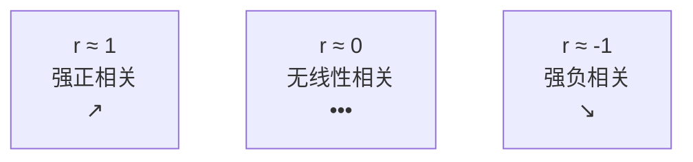
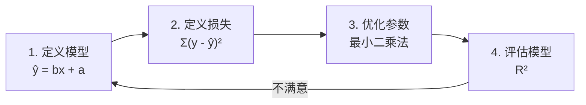

# 回归分析初步

> **所属路径**：`00_高中复习/01_数学基础/10_统计基础/05_回归分析初步`
> **预计学习时间**：50 分钟
> **难度等级**：⭐⭐

---

## 前置知识

- [平均数中位数众数](../01_平均数中位数众数/01_平均数中位数众数.md) — 回归系数的计算需要用到平均数
- [方差与标准差](../02_方差与标准差/02_方差与标准差.md) — 方差是理解回归分析中"拟合优度"的基础
- [统计图表](../03_统计图表/03_统计图表.md) — 散点图是回归分析的起点
- [抽样方法](../04_抽样方法/04_抽样方法.md) — 回归分析的可靠性依赖于样本的代表性

> 如果以上内容还不熟悉，建议先完成对应课程再继续。

---

## 学习目标

完成本节后，你将能够：

1. 通过散点图判断两个变量之间是否存在线性趋势
2. 理解相关系数 $r$ 的含义，并会手动计算
3. 运用最小二乘法求出回归直线方程 $\hat{y} = bx + a$
4. 解释决定系数 $R^2$ 的含义，评价回归效果
5. 认识线性回归作为机器学习最基础模型的地位

---

## 正文讲解

### 1. 从"两个变量"说起

前面几节我们一直在研究单个变量的特征：一组成绩的平均数是多少、方差有多大、分布是什么形状。但在现实中，我们常常关心的是两个变量之间的关系。

例如：
- 学习时间越长，考试成绩会越高吗？
- 广告投入越多，销售额会增加吗？
- 房屋面积越大，价格会越贵吗？

这些问题都涉及到两个变量——一个是 **自变量（Independent Variable）** $x$ ，一个是 **因变量（Dependent Variable）** $y$ 。我们想知道它们之间是否存在某种规律性的关系，如果有，能否用一个数学公式来描述。

这就是 **回归分析（Regression Analysis）** 要解决的问题。而在人工智能和机器学习中，**[线性回归（Linear Regression）](../../../../02_核心原理/02_经典机器学习/01_回归/)** 正是最简单也最经典的预测模型——理解它是理解所有更复杂模型的起点。

### 2. 散点图：先看再算

在做任何数学计算之前，第一步永远是 **画散点图**。

假设我们收集了 8 名学生的学习时长（小时/周）和考试成绩（分）的数据：

| 学习时长 $x$ | 2 | 4 | 5 | 6 | 7 | 8 | 10 | 12 |
| ------------ | - | - | - | - | - | - | -- | -- |
| 考试成绩 $y$ | 50 | 58 | 63 | 70 | 72 | 78 | 85 | 92 |

把每对 $(x, y)$ 画在坐标系中，就得到了一张 **[散点图（Scatter Plot）](../03_统计图表/03_统计图表.md)**。如果这些点大致沿着一个方向排列（从左下到右上），说明两个变量之间可能存在 **正线性关系**。

从上面的数据可以直觉看出：学习时间越长，成绩确实越高，而且点的分布大致呈直线趋势。接下来我们用数学工具来精确量化这种关系。

### 3. 相关系数——量化线性关系的强度

**皮尔逊相关系数（Pearson Correlation Coefficient）** $r$ 是衡量两个变量线性相关程度的指标，取值范围为 $[-1, 1]$ ：

$$
r = \frac{\sum_{i=1}^{n} (x_i - \bar{x})(y_i - \bar{y})}{\sqrt{\sum_{i=1}^{n} (x_i - \bar{x})^2 \cdot \sum_{i=1}^{n} (y_i - \bar{y})^2}}
$$

> **直觉解读**：分子衡量的是 $x$ 和 $y$ 是否"同涨同跌"——当 $x$ 大于平均值时 $y$ 也大于平均值，乘积为正；如果它们总是同方向变化，分子就会很大。分母是标准化因子，确保 $r$ 不会超过 1。

$r$ 的取值含义：

| $r$ 的范围 | 含义 |
| ---------- | ---- |
| $r$ 接近 1 | 强正线性相关（ $x$ 增大时 $y$ 也增大） |
| $r$ 接近 -1 | 强负线性相关（ $x$ 增大时 $y$ 减小） |
| $r$ 接近 0 | 几乎没有线性相关（但可能有非线性关系！） |
| $\|r\| > 0.8$ | 通常认为是强相关 |



> 📌 **图解说明**：相关系数 $r$ 从 -1 到 1 的连续谱。正值表示正相关，负值表示负相关，接近 0 表示没有线性关系。

⚠️ **重要提醒**：相关系数只能衡量 **线性** 关系。如果两个变量之间是抛物线关系（如 $y = x^2$ ），即使关系很强， $r$ 也可能接近 0。因此，一定要先画散点图再做判断。

### 4. 最小二乘法——找到最佳直线

确认了线性趋势后，下一步是找到一条"最佳"的直线来拟合数据。这条直线叫做 **回归直线（Regression Line）**，方程为：

$$
\hat{y} = bx + a
$$

其中 $b$ 是 **斜率（Slope）**，表示 $x$ 每增加 1 个单位时 $\hat{y}$ 的变化量； $a$ 是 **截距（Intercept）**。

怎么确定 $a$ 和 $b$ 的值？我们使用 **最小二乘法（Least Squares Method）**：找到使所有数据点到直线的 **垂直距离的平方和最小** 的 $a$ 和 $b$ 。

数学上，我们要最小化：

$$
S = \sum_{i=1}^{n} (y_i - \hat{y}_i)^2 = \sum_{i=1}^{n} (y_i - bx_i - a)^2
$$

通过对 $a$ 和 $b$ 分别求偏导并令其为零，可以推导出：

$$
b = \frac{\sum_{i=1}^{n} (x_i - \bar{x})(y_i - \bar{y})}{\sum_{i=1}^{n} (x_i - \bar{x})^2}
$$

$$
a = \bar{y} - b\bar{x}
$$

> **直觉解读**：斜率 $b$ 的分子就是 $x$ 和 $y$ 的"共同变化量"，分母是 $x$ 自身的变化量。它衡量的是"当 $x$ 变化时 $y$ 跟随变化了多少"。截距 $a$ 保证回归直线一定经过点 $(\bar{x}, \bar{y})$ 。

注意到斜率 $b$ 的分子和相关系数 $r$ 的分子完全一样——这不是巧合，实际上 $b = r \cdot \dfrac{s_y}{s_x}$ ，其中 $s_x$ 和 $s_y$ 分别是 $x$ 和 $y$ 的标准差。

### 5. 手动计算回归直线

让我们用前面 8 名学生的数据来计算。先求平均值：

$$
\bar{x} = \frac{2+4+5+6+7+8+10+12}{8} = \frac{54}{8} = 6.75
$$

$$
\bar{y} = \frac{50+58+63+70+72+78+85+92}{8} = \frac{568}{8} = 71
$$

然后计算各项偏差积之和和偏差平方和：

| $x_i$ | $y_i$ | $x_i - \bar{x}$ | $y_i - \bar{y}$ | $(x_i-\bar{x})(y_i-\bar{y})$ | $(x_i-\bar{x})^2$ |
| ------ | ------ | ---------------- | ---------------- | ----------------------------- | ------------------ |
| 2 | 50 | -4.75 | -21 | 99.75 | 22.5625 |
| 4 | 58 | -2.75 | -13 | 35.75 | 7.5625 |
| 5 | 63 | -1.75 | -8 | 14.00 | 3.0625 |
| 6 | 70 | -0.75 | -1 | 0.75 | 0.5625 |
| 7 | 72 | 0.25 | 1 | 0.25 | 0.0625 |
| 8 | 78 | 1.25 | 7 | 8.75 | 1.5625 |
| 10 | 85 | 3.25 | 14 | 45.50 | 10.5625 |
| 12 | 92 | 5.25 | 21 | 110.25 | 27.5625 |
| **合计** | | | | **315.00** | **73.50** |

$$
b = \frac{315.00}{73.50} \approx 4.29
$$

$$
a = 71 - 4.29 \times 6.75 \approx 71 - 28.96 = 42.04
$$

因此回归直线方程为：

$$
\hat{y} = 4.29x + 42.04
$$

这意味着学习时间每增加 1 小时/周，考试成绩平均增加约 4.29 分。

下面这张图将散点数据、回归直线和各数据点的残差（预测值与实际值之差）画在一起，帮助你直观理解最小二乘法的拟合效果：


> 📌 **图解说明**：蓝色圆点为实际观测数据，红色直线为最小二乘回归线，橙色虚线为部分数据点的残差。绿色菱形标记了数据的均值点 $(\bar{x}, \bar{y})$ ——回归线一定经过这个点。 $R^2 = 0.992$ 说明拟合效果非常好。你可以运行 `code/plot_regression.py` 自行生成这张图。

### 6. 决定系数 $R^2$ ——回归效果好不好

有了回归直线，我们需要评价它拟合数据的效果好不好。 **决定系数（Coefficient of Determination）** $R^2$ 就是这个评价工具：

$$
R^2 = 1 - \frac{SS_{\text{res}}}{SS_{\text{tot}}}
$$

其中：
- $SS_{\text{tot}} = \sum (y_i - \bar{y})^2$ 是 **总变异**——数据本身的总离散程度
- $SS_{\text{res}} = \sum (y_i - \hat{y}_i)^2$ 是 **残差变异**——回归直线未能解释的离散程度

> **直觉解读**： $R^2$ 表示"回归直线能解释数据总变异的百分比"。 $R^2 = 0.95$ 意味着 95% 的数据变异可以被回归直线解释，只有 5% 是"噪声"。

$R^2$ 的取值范围是 $[0, 1]$ ：
- $R^2$ 接近 1：拟合效果非常好
- $R^2$ 接近 0：直线几乎没有解释能力

在简单线性回归中， $R^2 = r^2$ （相关系数的平方），这也是它叫"R-squared"的原因。

### 7. 回归分析与机器学习的桥梁

恭喜你！如果你理解了最小二乘法和 $R^2$ ，你实际上已经掌握了机器学习最核心的思想框架：

1. **定义模型**：选择一个函数形式（如 $\hat{y} = bx + a$ ）
2. **定义损失函数**：衡量预测值与真实值的差距（如平方误差之和 $S$ ）
3. **优化参数**：找到使损失函数最小的参数值（如用最小二乘法求 $a$ 和 $b$ ）
4. **评估模型**：用指标衡量模型的效果（如 $R^2$ ）



> 📌 **图解说明**：回归分析的四步框架——定义模型、定义损失、优化参数、评估效果。这正是机器学习的通用范式，从线性回归到深度学习都遵循这个框架。

从简单的一元线性回归到多元回归、多项式回归、逻辑回归、神经网络……核心思路完全相同，只是模型形式和优化方法越来越复杂。你在这里学到的基础，会在整个机器学习的旅程中反复出现。

---

## 动手实践

下面用 Python 来完整实现一次回归分析，包括绘制散点图、计算回归系数和评估拟合效果。

```python
# 文件：code/regression_intro.py
# 一元线性回归：手动实现最小二乘法
# 环境要求：Python 3.10+（仅使用标准库）

# 数据：学习时长 vs 考试成绩
x = [2, 4, 5, 6, 7, 8, 10, 12]
y = [50, 58, 63, 70, 72, 78, 85, 92]
n = len(x)

# 1. 计算平均值
x_mean = sum(x) / n
y_mean = sum(y) / n

# 2. 计算回归系数
numerator = sum((x[i] - x_mean) * (y[i] - y_mean) for i in range(n))
denominator = sum((x[i] - x_mean) ** 2 for i in range(n))
b = numerator / denominator
a = y_mean - b * x_mean

print(f"平均值: x̄ = {x_mean}, ȳ = {y_mean}")
print(f"回归方程: ŷ = {b:.2f}x + {a:.2f}")

# 3. 计算相关系数 r
sy_sq = sum((y[i] - y_mean) ** 2 for i in range(n))
r = numerator / (denominator * sy_sq) ** 0.5
print(f"相关系数: r = {r:.4f}")

# 4. 计算 R²
y_pred = [b * x[i] + a for i in range(n)]
ss_res = sum((y[i] - y_pred[i]) ** 2 for i in range(n))
ss_tot = sy_sq
r_squared = 1 - ss_res / ss_tot
print(f"决定系数: R² = {r_squared:.4f}")

# 5. 预测：学习 9 小时的成绩
x_new = 9
y_new = b * x_new + a
print(f"\n预测: 学习 {x_new} 小时 → 预计成绩 {y_new:.1f} 分")

# 6. 显示拟合结果
print("\n拟合详情:")
print(f"{'x':>4s} {'y 实际':>8s} {'ŷ 预测':>8s} {'残差':>8s}")
for i in range(n):
    residual = y[i] - y_pred[i]
    print(f"{x[i]:>4d} {y[i]:>8.1f} {y_pred[i]:>8.1f} {residual:>8.2f}")
```

**运行说明**：
- 环境要求：Python 3.10+（仅使用标准库）
- 运行命令：`python code/regression_intro.py`

**预期输出**：
```
平均值: x̄ = 6.75, ȳ = 71.0
回归方程: ŷ = 4.29x + 42.04
相关系数: r = 0.9960
决定系数: R² = 0.9920

预测: 学习 9 小时 → 预计成绩 80.6 分

拟合详情:
   x   y 实际   ŷ 预测      残差
   2     50.0     50.6    -0.62
   4     58.0     59.2    -1.20
   5     63.0     63.5    -0.49
   6     70.0     67.8     2.22
   7     72.0     72.1    -0.07
   8     78.0     76.4     1.64
  10     85.0     84.9     0.05
  12     92.0     93.5    -1.53
```

$R^2 = 0.992$ 说明回归直线解释了 99.2% 的数据变异，拟合效果非常好。残差都很小，说明线性模型对这组数据非常合适。

接下来，我们用 matplotlib 将回归结果可视化：

```python
# 文件：code/regression_plot.py
# 绘制回归分析散点图与拟合线
# 环境要求：Python 3.10+, matplotlib==3.7+

import matplotlib.pyplot as plt

x = [2, 4, 5, 6, 7, 8, 10, 12]
y = [50, 58, 63, 70, 72, 78, 85, 92]

# 回归参数（上一个脚本计算得到）
b, a = 4.29, 42.04

plt.rcParams['font.sans-serif'] = ['DejaVu Sans']
plt.rcParams['axes.unicode_minus'] = False

fig, ax = plt.subplots(figsize=(8, 6))

# 散点图
ax.scatter(x, y, color='steelblue', s=80, zorder=5, label='Data points')

# 回归线
x_line = [0, 14]
y_line = [b * xi + a for xi in x_line]
ax.plot(x_line, y_line, color='red', linewidth=2, label=f'$\\hat{{y}} = {b:.2f}x + {a:.2f}$')

# 残差线
y_pred = [b * xi + a for xi in x]
for i in range(len(x)):
    ax.plot([x[i], x[i]], [y[i], y_pred[i]], color='gray', linestyle='--', alpha=0.5)

ax.set_xlabel('Study Hours per Week ($x$)', fontsize=12)
ax.set_ylabel('Exam Score ($y$)', fontsize=12)
ax.set_title('Linear Regression: Study Hours vs Exam Score ($R^2 = 0.992$)', fontsize=13)
ax.legend(fontsize=11)
ax.grid(True, alpha=0.3)
ax.spines['top'].set_visible(False)
ax.spines['right'].set_visible(False)

plt.tight_layout()
plt.savefig('regression_plot.png', dpi=150, bbox_inches='tight', facecolor='white')
plt.close()
print("Plot saved to regression_plot.png")
```

**运行说明**：
- 环境要求：Python 3.10+，matplotlib >= 3.7
- 运行命令：`python code/regression_plot.py`

**预期输出**：
```
Plot saved to regression_plot.png
```

---

## 典型误区

| 误区 | 正确理解 |
| ---- | -------- |
| "相关就是因果" | 相关系数只能说明两个变量同时变化，不能证明一个导致另一个。冰淇淋销量和溺水事件正相关，但原因是它们都与高温相关 |
| " $R^2$ 高就说明模型好" | $R^2$ 高只说明拟合当前数据好，不代表预测新数据也好（可能过拟合） |
| "回归线可以无限外推" | 回归线只在数据覆盖的范围内可靠，超出范围的预测（外推）风险很大 |
| "所有数据都适合线性回归" | 如果散点图显示非线性关系，强行用直线拟合会得到误导性结果 |

---

## 练习题

### 练习 1：计算相关系数（难度：⭐）

给定以下数据：

| $x$ | 1 | 3 | 5 | 7 | 9 |
| --- | - | - | - | - | - |
| $y$ | 2 | 5 | 7 | 10 | 13 |

计算相关系数 $r$ 。

<details>
<summary>💡 提示</summary>

先计算 $\bar{x} = 5$ ， $\bar{y} = 7.4$ ，然后按公式计算分子和分母。

</details>

<details>
<summary>✅ 参考答案</summary>

$\bar{x} = 5$ ， $\bar{y} = 7.4$

分子 $= (-4)(-5.4) + (-2)(-2.4) + (0)(-0.4) + (2)(2.6) + (4)(5.6) = 21.6 + 4.8 + 0 + 5.2 + 22.4 = 54.0$

$\sum(x_i - \bar{x})^2 = 16 + 4 + 0 + 4 + 16 = 40$

$\sum(y_i - \bar{y})^2 = 29.16 + 5.76 + 0.16 + 6.76 + 31.36 = 73.2$

$$r = \dfrac{54.0}{\sqrt{40 \times 73.2}} = \dfrac{54.0}{\sqrt{2928}} = \dfrac{54.0}{54.11} \approx 0.998$$

$r \approx 0.998$ ，接近 1，说明 $x$ 和 $y$ 之间存在很强的正线性关系。

</details>

### 练习 2：求回归方程（难度：⭐⭐）

用练习 1 的数据，求回归直线方程 $\hat{y} = bx + a$ ，并预测 $x = 6$ 时 $y$ 的值。

<details>
<summary>💡 提示</summary>

$b = \dfrac{\sum(x_i-\bar{x})(y_i-\bar{y})}{\sum(x_i-\bar{x})^2}$ ， $a = \bar{y} - b\bar{x}$ 。

</details>

<details>
<summary>✅ 参考答案</summary>

$$b = \dfrac{54.0}{40} = 1.35$$

$$a = 7.4 - 1.35 \times 5 = 7.4 - 6.75 = 0.65$$

回归方程： $\hat{y} = 1.35x + 0.65$

当 $x = 6$ 时： $\hat{y} = 1.35 \times 6 + 0.65 = 8.75$

</details>

### 练习 3：编程实践（难度：⭐⭐）

下面的数据记录了某城市 10 天的最高气温（°C）和冰淇淋日销量（份）：

```python
temp = [22, 25, 27, 29, 30, 32, 34, 35, 36, 38]
sales = [105, 120, 135, 148, 160, 170, 182, 190, 195, 210]
```

（1）编写 Python 代码计算相关系数 $r$ 和回归方程。
（2）计算 $R^2$ 。
（3）如果明天气温预报 33°C，预测冰淇淋销量。

<details>
<summary>💡 提示</summary>

可以复用正文"动手实践"中的代码框架，替换数据即可。

</details>

<details>
<summary>✅ 参考答案</summary>

```python
temp = [22, 25, 27, 29, 30, 32, 34, 35, 36, 38]
sales = [105, 120, 135, 148, 160, 170, 182, 190, 195, 210]
n = len(temp)

x_mean = sum(temp) / n
y_mean = sum(sales) / n

num = sum((temp[i] - x_mean) * (sales[i] - y_mean) for i in range(n))
den_x = sum((temp[i] - x_mean) ** 2 for i in range(n))
den_y = sum((sales[i] - y_mean) ** 2 for i in range(n))

r = num / (den_x * den_y) ** 0.5
b = num / den_x
a = y_mean - b * x_mean

y_pred = [b * temp[i] + a for i in range(n)]
ss_res = sum((sales[i] - y_pred[i]) ** 2 for i in range(n))
r_sq = 1 - ss_res / den_y

print(f"r = {r:.4f}")
print(f"ŷ = {b:.2f}x + {a:.2f}")
print(f"R² = {r_sq:.4f}")
print(f"33°C 时预测销量: {b * 33 + a:.0f} 份")
```

预期输出约为： $r \approx 0.998$ ，回归方程 $\hat{y} \approx 6.40x - 37.18$ ， $R^2 \approx 0.996$ ，33°C 时预测销量约 174 份。

</details>

---

## 下一步学习

- 📖 后续主题：[集合与逻辑](../../11_集合与逻辑/) — 继续高中数学的其他基础主题
- 🔗 进阶知识：[数据能力](../../../../01_基础能力/05_数据能力/) — 将统计基础扩展为系统的数据处理能力
- 📚 直接进阶：[经典机器学习 · 回归](../../../../02_核心原理/02_经典机器学习/01_回归/) — 从一元线性回归扩展到多元回归、正则化回归等更强大的模型

---

## 参考资料

1. [Khan Academy — Regression](https://www.khanacademy.org/math/statistics-probability/describing-relationships-quantitative-data) — 回归分析的交互式教程，含最小二乘法动画演示（公开课程）
2. [维基百科 — Simple Linear Regression](https://en.wikipedia.org/wiki/Simple_linear_regression) — 简单线性回归的数学推导和性质（公共知识库）
3. [维基百科 — Coefficient of Determination](https://en.wikipedia.org/wiki/Coefficient_of_determination) — 决定系数 $R^2$ 的定义与解释（公共知识库）
4. [scikit-learn LinearRegression 文档](https://scikit-learn.org/stable/modules/generated/sklearn.linear_model.LinearRegression.html) — Python 机器学习库中线性回归的实现（官方文档）
