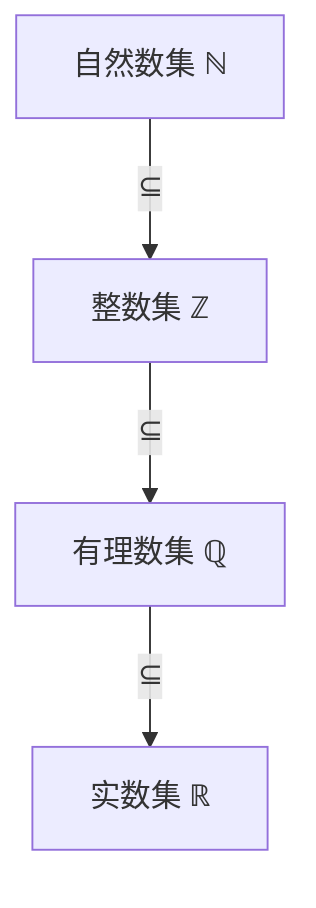
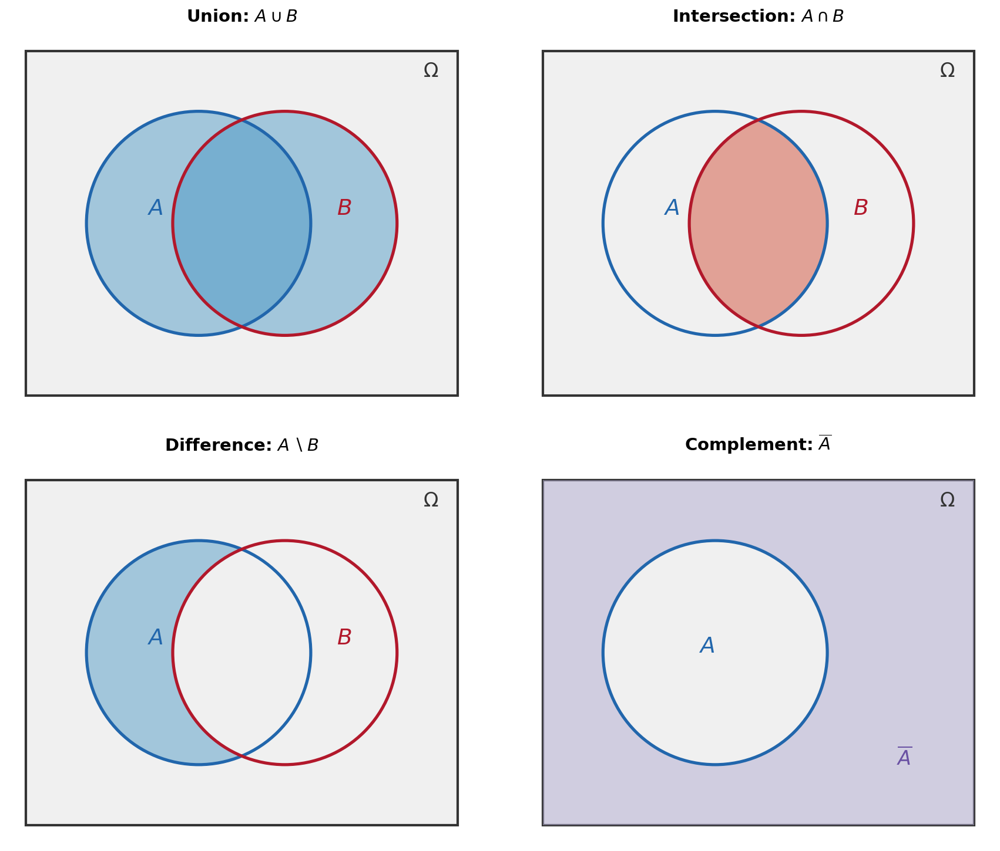

# 集合运算

> **所属路径**：`00_高中复习/01_数学基础/11_集合与逻辑/01_集合运算`
> **预计学习时间**：40 分钟
> **难度等级**：⭐

---

## 前置知识

- [代数与方程](../../../01_数学基础/01_代数与方程/) — 需要熟悉方程和不等式的基本概念

> 如果以上内容还不熟悉，建议先完成对应课程再继续。

---

## 学习目标

完成本节后，你将能够：

1. 使用列举法和描述法正确表示一个集合
2. 判断元素与集合的从属关系（属于、不属于）以及集合之间的包含关系（子集、真子集）
3. 对两个集合执行并集、交集、补集运算，并用韦恩图直观验证结果
4. 用 Python 的 `set` 类型实现基本的集合运算

---

## 正文讲解

### 1. 从日常分类到数学集合

我们每天都在不知不觉中使用"集合"的思想。比如，你把手机里的 App 分成"学习类"和"娱乐类"，这就是在把对象按照某种标准归入不同的组。再比如，老师说"请所有选修数学的同学到教室集合"——这里的"所有选修数学的同学"就构成了一个群体。

数学把这种"将满足某个条件的对象汇集在一起"的想法精确化了，这就是 **[集合（Set）](../01_集合运算/)** 的概念。一个集合就是由一些确定的、互不相同的对象组成的整体。这些对象叫做集合的 **元素（Element）**。

为什么要精确化？因为在人工智能中，数据处理的第一步往往就是"筛选符合条件的样本"。训练集、验证集、测试集——这些概念本质上就是样本的集合。理解集合运算，能帮助你清晰地思考数据如何划分、如何合并、如何排除。

### 2. 如何表示一个集合

表示集合主要有两种方法：

**列举法**：直接把所有元素列出来，用花括号括起来。

$$
A = \{1, 2, 3, 4, 5\}
$$

**描述法**：用一个条件来描述元素的共同特征。

$$
B = \{x \mid x \text{ 是小于 6 的正整数}\}
$$

上面两个集合其实是同一个集合，因为它们包含完全相同的元素。这也是集合的一个重要性质——集合由它的元素唯一确定，与元素的排列顺序无关，也不允许有重复元素。

我们用大写字母 $A$、 $B$、 $C$ 等表示集合，小写字母 $a$、 $b$、 $x$ 等表示元素。此外，数学中有几个常用的特殊集合：

- $\mathbb{N}$：自然数集 $\{0, 1, 2, 3, \ldots\}$
- $\mathbb{Z}$：整数集 $\{\ldots, -2, -1, 0, 1, 2, \ldots\}$
- $\mathbb{Q}$：有理数集
- $\mathbb{R}$：实数集
- $\varnothing$：空集，不含任何元素的集合

### 3. 元素与集合的关系

元素和集合之间的关系只有两种：

- **属于**：如果 $a$ 是集合 $A$ 的元素，记作 $a \in A$
- **不属于**：如果 $a$ 不是集合 $A$ 的元素，记作 $a \notin A$

例如，设 $A = \{2, 4, 6, 8\}$，那么 $4 \in A$，而 $5 \notin A$。

### 4. 集合之间的关系：子集与真子集

集合和集合之间也有"大小"关系，但这里的"大小"不是指元素的数值，而是指包含关系。

如果集合 $A$ 的每一个元素都是集合 $B$ 的元素，我们就说 $A$ 是 $B$ 的 **子集（Subset）**，记作 $A \subseteq B$。用逻辑语言来说：

$$
A \subseteq B \iff \forall x (x \in A \Rightarrow x \in B)
$$

> **直觉解读**：这个公式在说——如果从 $A$ 里随便拿出一个元素，它一定也在 $B$ 里，那么 $A$ 就是 $B$ 的子集。

如果 $A \subseteq B$ 而且 $A \neq B$（也就是说 $B$ 中还有 $A$ 没有的元素），则称 $A$ 是 $B$ 的 **真子集（Proper Subset）**，记作 $A \subsetneq B$。

几个重要性质：
- 任何集合都是自身的子集： $A \subseteq A$
- 空集是任何集合的子集： $\varnothing \subseteq A$



> 📌 **图解说明**：常见数集之间的包含关系链。自然数集是整数集的子集，整数集是有理数集的子集，有理数集是实数集的子集。

### 5. 集合的三大运算

接下来是本节的核心——三种集合运算。我们用具体的例子来引入，然后给出一般定义。

设 $A = \{1, 2, 3, 4\}$， $B = \{3, 4, 5, 6\}$，全集 $U = \{1, 2, 3, 4, 5, 6, 7\}$。

**并集（Union）**：把两个集合的元素"合并"在一起（去掉重复的），记作 $A \cup B$。

$$
A \cup B = \{x \mid x \in A \text{ 或 } x \in B\} = \{1, 2, 3, 4, 5, 6\}
$$

**交集（Intersection）**：取两个集合"共有"的元素，记作 $A \cap B$。

$$
A \cap B = \{x \mid x \in A \text{ 且 } x \in B\} = \{3, 4\}
$$

**补集（Complement）**：在全集 $U$ 中，不属于 $A$ 的元素组成的集合，记作 $\complement_U A$（也常写作 $A^c$ 或 $\overline{A}$）。

$$
\complement_U A = \{x \mid x \in U \text{ 且 } x \notin A\} = \{5, 6, 7\}
$$

下面用韦恩图（Venn Diagram）来直观展示这些运算。韦恩图用圆圈表示集合，圆圈的重叠区域表示交集：



> 📌 **图解说明**：四幅韦恩图分别展示了并集 $A \cup B$ （两圆全部着色）、交集 $A \cap B$ （仅重叠区域着色）、差集 $A \setminus B$ （ $A$ 中去掉与 $B$ 重叠的部分）和补集 $\overline{A}$ （全集矩形中圆 $A$ 之外的区域着色）。你可以运行 `code/plot_set_operations.py` 自行生成这张图。

### 6. 运算律：集合运算的规律

集合运算和数的加法、乘法一样，也有一些漂亮的运算律：

| 运算律 | 公式 |
| ------ | ---- |
| 交换律 | $A \cup B = B \cup A$， $A \cap B = B \cap A$ |
| 结合律 | $(A \cup B) \cup C = A \cup (B \cup C)$ |
| 分配律 | $A \cap (B \cup C) = (A \cap B) \cup (A \cap C)$ |
| 德摩根律 | $\complement_U(A \cup B) = \complement_U A \cap \complement_U B$ |
| 德摩根律 | $\complement_U(A \cap B) = \complement_U A \cup \complement_U B$ |

其中 **德摩根律（De Morgan's Laws）** 尤其重要——它告诉我们"并集的补等于补集的交，交集的补等于补集的并"。这个规律在布尔逻辑和数据库查询中经常出现。

### 7. 集合运算与人工智能

在实际的数据处理和机器学习中，集合运算无处不在：

- **数据筛选**：从数据库中选出"年龄大于 18 且收入大于 5000"的用户，就是对两个条件集合求交集
- **特征集合**：模型 A 使用的特征集合与模型 B 使用的特征集合的并集，就是所有可能需要准备的特征
- **训练集与测试集**：它们应该是互补的——测试集是全体数据中除去训练集的部分，即训练集的补集
- **去重**：集合天然不含重复元素，这正是数据去重的数学基础

---

## 动手实践

下面我们用 Python 来实现刚才学到的集合运算，亲自验证那些数学公式。Python 内置的 `set` 类型完美地对应了数学中的集合。

```python
# 文件：code/set_operations.py
# Python 集合运算示例
# 环境要求：Python 3.10+

# 定义两个集合
A = {1, 2, 3, 4}
B = {3, 4, 5, 6}
U = {1, 2, 3, 4, 5, 6, 7}  # 全集

# 基本运算
print("A =", A)
print("B =", B)
print("A ∪ B =", A | B)          # 并集
print("A ∩ B =", A & B)          # 交集
print("A 的补集 =", U - A)       # 补集（全集减去 A）
print("A - B =", A - B)          # 差集（A 中有而 B 中没有的元素）

# 验证德摩根律
complement_union = U - (A | B)         # (A ∪ B) 的补集
intersection_complements = (U - A) & (U - B)  # A 的补集 ∩ B 的补集
print("\n验证德摩根律：")
print("∁(A ∪ B)     =", complement_union)
print("∁A ∩ ∁B      =", intersection_complements)
print("两者相等？", complement_union == intersection_complements)

# 子集判断
C = {1, 2}
print("\nC =", C)
print("C ⊆ A ?", C.issubset(A))
print("A ⊆ C ?", A.issubset(C))
```

**运行说明**：
- 环境要求：Python 3.10+
- 运行命令：`python code/set_operations.py`

**预期输出**：
```
A = {1, 2, 3, 4}
B = {3, 4, 5, 6}
A ∪ B = {1, 2, 3, 4, 5, 6}
A ∩ B = {3, 4}
A 的补集 = {5, 6, 7}
A - B = {1, 2}

验证德摩根律：
∁(A ∪ B)     = {7}
∁A ∩ ∁B      = {7}
两者相等？ True

C = {1, 2}
C ⊆ A ? True
A ⊆ C ? False
```

从运行结果可以看到，Python 的集合运算与数学定义完全一致。特别是德摩根律——"并集的补"确实等于"补集的交"，代码帮我们做了验证。

---

## 典型误区

| 误区 | 正确理解 |
| ---- | -------- |
| 认为 $\{1, 2, 3\}$ 和 $\{3, 2, 1\}$ 是不同的集合 | 集合与元素的排列顺序无关，它们是同一个集合 |
| 写出 $\{1, 1, 2, 3\}$ 这样有重复元素的集合 | 集合中的元素必须互不相同，应写为 $\{1, 2, 3\}$ |
| 混淆 $\in$ 和 $\subseteq$ | $\in$ 描述元素与集合的关系（如 $1 \in A$）； $\subseteq$ 描述集合与集合的关系（如 $\{1\} \subseteq A$） |
| 忘记空集是任何集合的子集 | $\varnothing \subseteq A$ 对任意集合 $A$ 成立，这是由子集定义中的"对所有"逻辑保证的 |

---

## 练习题

### 练习 1：集合的表示（难度：⭐）

设 $A = \{x \mid x^2 - 5x + 6 = 0\}$，请用列举法写出集合 $A$。

<details>
<summary>💡 提示</summary>

把方程 $x^2 - 5x + 6 = 0$ 因式分解为 $(x-2)(x-3) = 0$。

</details>

<details>
<summary>✅ 参考答案</summary>

$x^2 - 5x + 6 = 0$ 因式分解得 $(x-2)(x-3) = 0$，所以 $x = 2$ 或 $x = 3$。

$$A = \{2, 3\}$$

</details>

### 练习 2：集合运算（难度：⭐）

设 $A = \{1, 3, 5, 7\}$， $B = \{2, 3, 5, 8\}$，求 $A \cup B$、 $A \cap B$ 和 $A - B$（差集：属于 $A$ 但不属于 $B$ 的元素）。

<details>
<summary>💡 提示</summary>

逐一检查每个元素属于哪个集合即可。

</details>

<details>
<summary>✅ 参考答案</summary>

$A \cup B = \{1, 2, 3, 5, 7, 8\}$

$A \cap B = \{3, 5\}$

$A - B = \{1, 7\}$

</details>

### 练习 3：德摩根律验证（难度：⭐⭐）

设全集 $U = \{1, 2, 3, 4, 5, 6, 7, 8\}$， $A = \{1, 3, 5, 7\}$， $B = \{1, 2, 3, 4\}$。请验证德摩根律 $\complement_U(A \cap B) = \complement_U A \cup \complement_U B$。

<details>
<summary>💡 提示</summary>

先求出 $A \cap B$，再求其补集；然后分别求 $\complement_U A$ 和 $\complement_U B$，再求它们的并集。

</details>

<details>
<summary>✅ 参考答案</summary>

$A \cap B = \{1, 3\}$，所以 $\complement_U(A \cap B) = \{2, 4, 5, 6, 7, 8\}$。

$\complement_U A = \{2, 4, 6, 8\}$， $\complement_U B = \{5, 6, 7, 8\}$。

$\complement_U A \cup \complement_U B = \{2, 4, 5, 6, 7, 8\}$。

两者相等，德摩根律成立。 $\square$

</details>

---

## 下一步学习

- 📖 下一个知识点：[命题与逻辑连接词](../02_命题与逻辑连接词/02_命题与逻辑连接词.md)
- 🔗 相关知识点：[概率基础](../../09_概率基础/) — 概率论建立在集合（事件空间）之上
- 🔗 相关知识点：[排列组合](../../08_排列组合/) — 组合计数经常需要利用集合的容斥原理

---

## 参考资料

1. [Mathematics for Machine Learning — Chapter 6: Probability and Distributions](https://mml-book.github.io/) — 开源教材，集合论是概率论的基础语言（CC BY-NC-SA 4.0）
2. [Python 官方文档 — set 类型](https://docs.python.org/3/library/stdtypes.html#set) — 官方文档，详细描述 Python 集合操作
3. [维基百科 — 集合 (数学)](https://zh.wikipedia.org/wiki/%E9%9B%86%E5%90%88_(%E6%95%B0%E5%AD%A6)) — 公共知识库，集合论的全面介绍
