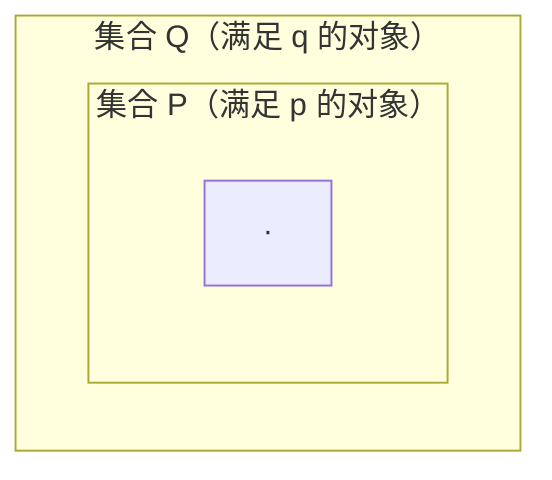
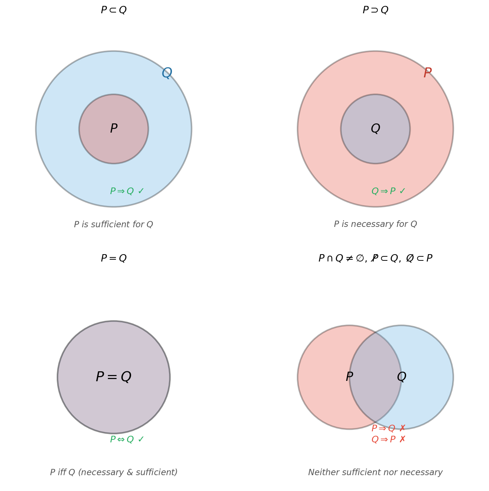
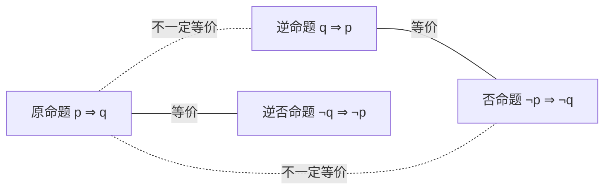

# 充分条件与必要条件

> **所属路径**：`00_高中复习/01_数学基础/11_集合与逻辑/03_充分条件与必要条件`
> **预计学习时间**：40 分钟
> **难度等级**：⭐⭐

---

## 前置知识

- [命题与逻辑连接词](../02_命题与逻辑连接词/02_命题与逻辑连接词.md) — 需要理解蕴含 $\Rightarrow$ 和双条件 $\Leftrightarrow$ 的含义
- [集合运算](../01_集合运算/01_集合运算.md) — 子集关系是理解充分必要条件的直觉工具

> 如果以上内容还不熟悉，建议先完成对应课程再继续。

---

## 学习目标

完成本节后，你将能够：

1. 准确区分充分条件、必要条件和充要条件
2. 利用集合包含关系直觉地判断条件的方向性
3. 写出一个蕴含命题的逆命题、否命题和逆否命题，并判断它们的真假关系
4. 解释充分条件与必要条件在模型假设和特征分析中的体现

---

## 正文讲解

### 1. 从生活中的"如果…则…"说起

在日常生活中，我们经常使用"如果…则…"的句式。比如：

- "如果下雨，则地面是湿的"
- "如果一个数能被 4 整除，则它能被 2 整除"

这些语句背后隐藏着一个重要的问题：前半句（条件）和后半句（结论）之间，到底是什么样的关系？条件"够不够用"？条件"必不必要"？这正是本节要回答的核心问题。

在人工智能中，类似的问题随处可见。比如，"某个特征出现"是不是"模型做出正确预测"的充分条件？"数据量足够大"是不是"模型泛化良好"的必要条件？理清这些条件关系，能帮助你更严谨地思考模型的假设和局限。

### 2. 充分条件：条件"足够推出"结论

回顾蕴含 $p \Rightarrow q$ 的含义："如果 $p$ ，则 $q$ "。在这个关系中：

$p$ 是 $q$ 的 **充分条件（Sufficient Condition）**。

"充分"的意思是"足够"——只要 $p$ 成立，就能保证 $q$ 一定成立。但反过来不一定： $q$ 成立时， $p$ 不一定成立。

例如："如果是正方形，则是矩形"。

"是正方形"是"是矩形"的充分条件——正方形一定是矩形。但反过来，矩形不一定是正方形（比如长和宽不等的矩形）。

### 3. 必要条件：结论"离不开"的条件

在同样的蕴含 $p \Rightarrow q$ 中：

$q$ 是 $p$ 的 **必要条件（Necessary Condition）**。

或者等价地说， $p$ 成立则 $q$ **必须**成立——如果 $q$ 不成立， $p$ 就一定不成立。"必要"的意思是"不可缺少"。

还是刚才的例子："如果是正方形，则是矩形"。

"是矩形"是"是正方形"的必要条件——一个图形如果不是矩形，它一定不是正方形。

一个方便记忆的口诀：**"前件是后件的充分条件，后件是前件的必要条件"**。

### 4. 用集合的视角理解

充分条件与必要条件的方向性最容易让人混淆。好消息是，集合的包含关系提供了一个绝佳的直觉工具。

如果 $p \Rightarrow q$ ，那么满足 $p$ 的对象组成的集合是满足 $q$ 的对象组成的集合的子集：

$$
p \Rightarrow q \iff P \subseteq Q
$$

其中 $P = \{x \mid p(x) \text{ 为真}\}$ ， $Q = \{x \mid q(x) \text{ 为真}\}$ 。



> 📌 **图解说明**：充分条件对应"小圈包含在大圈里"。 $P$ 是小圈（ $p$ 的范围更窄）， $Q$ 是大圈（ $q$ 的范围更宽）。小圈里的每一个元素都在大圈里，所以 $p$ 足以推出 $q$ 。但大圈里的元素不一定在小圈里，所以 $q$ 不一定能推出 $p$ 。

从图中可以清楚地看到：
- $p$ 是 $q$ 的充分条件：小圈里的东西全都在大圈里 ✓
- $q$ 是 $p$ 的必要条件：不在大圈里的东西一定不在小圈里 ✓
- 小圈 = 大圈 时，就是充要条件

下面这张图用集合包含关系完整展示了四种条件类型——充分条件、必要条件、充要条件和既非充分也非必要条件：



> 📌 **图解说明**：左上角 $P \subset Q$ 表示充分条件（小圈在大圈内）；右上角 $P \supset Q$ 表示必要条件（大圈包含小圈）；左下角 $P = Q$ 表示充要条件（两圈完全重合）；右下角两圈部分交叉，表示既非充分也非必要条件。你可以运行 `code/plot_conditions.py` 自行生成这张图。

### 5. 充要条件：完美对等

如果 $p \Rightarrow q$ 且 $q \Rightarrow p$ 同时成立，即 $p \Leftrightarrow q$ ，那么 $p$ 和 $q$ 互为 **充分必要条件（Necessary and Sufficient Condition）**，简称 **充要条件**。此时两个集合完全重合： $P = Q$ 。

例如：" $x^2 = 4$ " 与 " $x = 2$ 或 $x = -2$ " 互为充要条件——它们描述的是完全相同的一组 $x$ 值。

### 6. 四种命题的关系

对于一个蕴含命题 $p \Rightarrow q$ ，我们可以构造另外三个相关命题：

| 名称 | 形式 | 与原命题的关系 |
| ---- | ---- | ------------- |
| 原命题 | $p \Rightarrow q$ | — |
| 逆命题 | $q \Rightarrow p$ | 不一定同真假 |
| 否命题 | $\lnot p \Rightarrow \lnot q$ | 不一定同真假 |
| 逆否命题 | $\lnot q \Rightarrow \lnot p$ | **与原命题同真假** |

最重要的结论是：**原命题与逆否命题等价**。这在数学证明中极其实用——有时直接证"如果 $p$ 则 $q$ "很困难，但证"如果非 $q$ 则非 $p$ "却很简单。

而且，逆命题和否命题之间也互为逆否命题，它们也是等价的。但原命题和逆命题之间没有必然的真假联系。



> 📌 **图解说明**：四种命题之间的关系。实线连接的两个命题互为逆否关系，一定同真同假；虚线连接的命题之间没有必然的真假联系。

### 7. 充分条件与必要条件在人工智能中的应用

在人工智能和机器学习的学习过程中，理清条件关系能帮助你避免很多思维陷阱：

- **特征与预测**："用户浏览了商品页面"是"用户购买该商品"的必要条件（不浏览就不可能购买），但不是充分条件（浏览了不一定购买）。
- **模型假设**：线性回归假设"特征与目标之间是线性关系"——这是模型表现好的必要条件。如果数据本身不是线性的，线性回归就不太可能表现好。
- **逆否推理**：在调试模型时，如果"训练损失下降"是"模型正确实现"的必要条件，那么逆否命题"如果模型实现有误，则训练损失不会正常下降"就给了你一个有用的排错思路。

---

## 动手实践

我们用 Python 来判断充分条件和必要条件的关系，并验证原命题与逆否命题的等价性。

```python
# 文件：code/conditions.py
# 充分条件与必要条件的判断
# 环境要求：Python 3.10+

def is_sufficient(p_set, q_set):
    """判断 p 是否是 q 的充分条件（P ⊆ Q）"""
    return p_set.issubset(q_set)

def is_necessary(p_set, q_set):
    """判断 q 是否是 p 的必要条件（P ⊆ Q，即不满足 q 则不满足 p）"""
    return p_set.issubset(q_set)

# 示例：正方形 vs 矩形
# 全集：所有四边形类型
squares = {"正方形"}
rectangles = {"正方形", "长方形"}

print("=== 正方形与矩形 ===")
print(f"正方形集合: {squares}")
print(f"矩形集合:   {rectangles}")
print(f"'是正方形' 是 '是矩形' 的充分条件? {is_sufficient(squares, rectangles)}")
print(f"'是矩形' 是 '是正方形' 的必要条件? {is_necessary(squares, rectangles)}")
print(f"'是矩形' 是 '是正方形' 的充分条件? {is_sufficient(rectangles, squares)}")

# 验证原命题与逆否命题等价
print("\n=== 验证原命题与逆否命题等价 ===")
# 命题：如果 n 能被 4 整除，则 n 能被 2 整除
test_range = range(-20, 21)
P = {n for n in test_range if n % 4 == 0}  # 能被 4 整除
Q = {n for n in test_range if n % 2 == 0}  # 能被 2 整除
U = set(test_range)                         # 全集

# 原命题：P ⊆ Q
original = P.issubset(Q)

# 逆否命题：∁Q ⊆ ∁P（不能被 2 整除 → 不能被 4 整除）
not_Q = U - Q  # 奇数
not_P = U - P  # 不能被 4 整除的数
contrapositive = not_Q.issubset(not_P)

print(f"P（能被4整除）= {sorted(P)}")
print(f"Q（能被2整除）= {sorted(Q)}")
print(f"原命题 P ⊆ Q:          {original}")
print(f"逆否命题 ∁Q ⊆ ∁P:     {contrapositive}")
print(f"两者等价?               {original == contrapositive}")
```

**运行说明**：
- 环境要求：Python 3.10+
- 运行命令：`python code/conditions.py`

**预期输出**：
```
=== 正方形与矩形 ===
正方形集合: {'正方形'}
矩形集合:   {'正方形', '长方形'}
'是正方形' 是 '是矩形' 的充分条件? True
'是矩形' 是 '是正方形' 的必要条件? True
'是矩形' 是 '是正方形' 的充分条件? False

=== 验证原命题与逆否命题等价 ===
P（能被4整除）= [-20, -16, -12, -8, -4, 0, 4, 8, 12, 16, 20]
Q（能被2整除）= [-20, -18, -16, -14, -12, -10, -8, -6, -4, -2, 0, 2, 4, 6, 8, 10, 12, 14, 16, 18, 20]
原命题 P ⊆ Q:          True
逆否命题 ∁Q ⊆ ∁P:     True
两者等价?               True
```

代码清楚地展示了：能被 4 整除的数一定能被 2 整除（充分条件），而能被 2 整除不一定能被 4 整除（不是充分条件）。同时，原命题和逆否命题的判断结果完全一致，验证了它们的等价性。

---

## 典型误区

| 误区 | 正确理解 |
| ---- | -------- |
| 混淆充分条件与必要条件的方向 | 记住"小推大是充分，大推小不一定"—— $p \Rightarrow q$ 中 $p$ 是充分条件（ $P$ 是更小的集合） |
| 认为原命题为真则逆命题也为真 | 原命题和逆命题没有必然联系；"如果下雨则地湿"为真，但"如果地湿则下雨"不一定为真 |
| 忘记逆否命题与原命题等价 | $p \Rightarrow q$ 与 $\lnot q \Rightarrow \lnot p$ 始终同真同假，这是证明中常用的技巧 |
| 把充要条件误判为单方向条件 | 充要条件要求双向都成立（ $p \Leftrightarrow q$ ），漏掉任何一个方向都不算充要 |

---

## 练习题

### 练习 1：判断条件类型（难度：⭐）

对于命题"如果 $x > 5$ ，则 $x > 3$ "，判断：
1. " $x > 5$ " 是 " $x > 3$ " 的什么条件？
2. " $x > 3$ " 是 " $x > 5$ " 的什么条件？

<details>
<summary>💡 提示</summary>

在数轴上画出 $x > 5$ 和 $x > 3$ 的范围，观察哪个包含哪个。

</details>

<details>
<summary>✅ 参考答案</summary>

1. " $x > 5$ " 是 " $x > 3$ " 的**充分不必要条件**。因为 $x > 5$ 一定有 $x > 3$ ，但 $x > 3$ （如 $x = 4$ ）不一定有 $x > 5$ 。

2. " $x > 3$ " 是 " $x > 5$ " 的**必要不充分条件**。因为 $x > 5$ 必须先满足 $x > 3$ ，但仅有 $x > 3$ 不够。

从集合角度看： $\{x \mid x > 5\} \subsetneq \{x \mid x > 3\}$ ，小集合是大集合的充分条件。

</details>

### 练习 2：四种命题（难度：⭐⭐）

写出命题"如果一个整数的末位是 0，则它能被 5 整除"的逆命题、否命题和逆否命题，并判断它们各自的真假。

<details>
<summary>💡 提示</summary>

逆命题交换前后件，否命题对前后件取否定，逆否命题同时交换并取否定。末位是 5 的整数也能被 5 整除。

</details>

<details>
<summary>✅ 参考答案</summary>

设 $p$ ："末位是 0"， $q$ ："能被 5 整除"。

- **原命题** $p \Rightarrow q$ ："如果末位是 0，则能被 5 整除"——**真**
- **逆命题** $q \Rightarrow p$ ："如果能被 5 整除，则末位是 0"——**假**（反例：15 能被 5 整除但末位是 5）
- **否命题** $\lnot p \Rightarrow \lnot q$ ："如果末位不是 0，则不能被 5 整除"——**假**（与逆命题等价）
- **逆否命题** $\lnot q \Rightarrow \lnot p$ ："如果不能被 5 整除，则末位不是 0"——**真**（与原命题等价）

</details>

### 练习 3：充要条件证明（难度：⭐⭐）

证明：" $x^2 = 1$ " 是 " $x = 1$ " 的必要不充分条件。

<details>
<summary>💡 提示</summary>

需要证明两件事：(1) $x = 1 \Rightarrow x^2 = 1$ （必要性）；(2) $x^2 = 1 \not\Rightarrow x = 1$ （不充分，给出反例）。

</details>

<details>
<summary>✅ 参考答案</summary>

**证明必要性**（ $x = 1 \Rightarrow x^2 = 1$ ）：

若 $x = 1$ ，则 $x^2 = 1^2 = 1$ 。 ∴ $x = 1$ 能推出 $x^2 = 1$ ，即 $x^2 = 1$ 是 $x = 1$ 的必要条件。

**证明不充分**（ $x^2 = 1 \not\Rightarrow x = 1$ ）：

反例：取 $x = -1$ ，则 $x^2 = (-1)^2 = 1$ ，但 $x \neq 1$ 。

∴ $x^2 = 1$ 是 $x = 1$ 的必要不充分条件。 $\square$

</details>

---

## 下一步学习

- 📖 下一个知识点：[量词与反证法](../04_量词与反证法/04_量词与反证法.md)
- 🔗 相关知识点：[命题与逻辑连接词](../02_命题与逻辑连接词/02_命题与逻辑连接词.md) — 蕴含与双条件是充分必要条件的形式化基础
- 🔗 相关知识点：[导数初步](../../12_导数初步/) — 导数的充要条件（可导与连续的关系）将在后续课程中出现

---

## 参考资料

1. [Mathematics for Machine Learning — Chapter 6](https://mml-book.github.io/) — 开源教材，数学基础与机器学习的结合（CC BY-NC-SA 4.0）
2. [Open Logic Project — Propositional Logic](https://openlogicproject.org/) — 开源逻辑学教材（CC BY 4.0）
3. [维基百科 — 充分必要条件](https://zh.wikipedia.org/wiki/%E5%85%85%E5%88%86%E5%BF%85%E8%A6%81%E6%9D%A1%E4%BB%B6) — 公共知识库，充分必要条件的全面介绍
