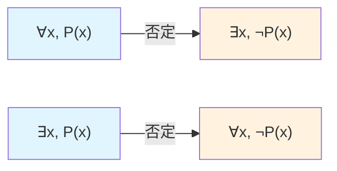
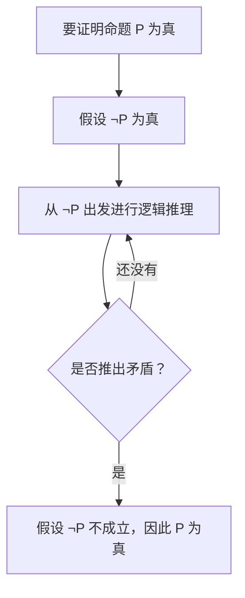

# 量词与反证法

> **所属路径**：`00_高中复习/01_数学基础/11_集合与逻辑/04_量词与反证法`
> **预计学习时间**：45 分钟
> **难度等级**：⭐⭐

---

## 前置知识

- [命题与逻辑连接词](../02_命题与逻辑连接词/02_命题与逻辑连接词.md) — 需要理解否定和蕴含的概念
- [充分条件与必要条件](../03_充分条件与必要条件/03_充分条件与必要条件.md) — 逆否命题是反证法的理论基础

> 如果以上内容还不熟悉，建议先完成对应课程再继续。

---

## 学习目标

完成本节后，你将能够：

1. 使用全称量词 $\forall$ 和存在量词 $\exists$ 准确表达数学命题
2. 正确地对含量词的命题进行否定
3. 运用反证法证明简单的数学命题
4. 理解量词与反证法在人工智能形式化推理中的作用

---

## 正文讲解

### 1. 从"所有"和"存在"说起

在前面的学习中，我们讨论的命题大多是关于具体对象的——比如"3 是奇数""正方形是矩形"。但在数学和科学中，我们经常需要表达关于**一类对象**的性质。比如：

- "所有偶数都能被 2 整除"
- "存在一个质数是偶数"

这两句话有一个共同点：它们不是在说某一个具体的数，而是在说"一整类数"或者"这类数中的某一个"。为了精确地表达这种"范围"，数学引入了 **量词（Quantifier）**。

在人工智能中，量词是 **谓词逻辑（Predicate Logic）** 的核心组成部分。知识表示、自动推理和定理证明系统都需要用量词来描述规则的适用范围。比如，"所有猫都是动物"在谓词逻辑中写成 $\forall x (\text{Cat}(x) \Rightarrow \text{Animal}(x))$——这正是人工智能中 **[知识表示（Knowledge Representation）](../../../../02_核心原理/01_经典人工智能/03_知识表示/)** 的基本语言。

### 2. 全称量词：对所有对象成立

**全称量词（Universal Quantifier）** 用符号 $\forall$ 表示，读作"对所有的"或"对任意的"。

命题 $\forall x \in S, P(x)$ 的含义是：对于集合 $S$ 中的每一个元素 $x$，性质 $P(x)$ 都成立。

例如：

$$
\forall n \in \mathbb{N}, \, n + 0 = n
$$

> **直觉解读**：这个公式在说——对于任意一个自然数 $n$，加上 0 之后还是它自己。

全称命题的一个重要特点是：要证明它为真，需要对**所有**对象验证；要证明它为假，只需要找到**一个反例**。

### 3. 存在量词：至少有一个对象满足

**存在量词（Existential Quantifier）** 用符号 $\exists$ 表示，读作"存在"或"至少有一个"。

命题 $\exists x \in S, P(x)$ 的含义是：在集合 $S$ 中，至少有一个元素 $x$ 使得性质 $P(x)$ 成立。

例如：

$$
\exists n \in \mathbb{Z}, \, n^2 = 4
$$

> **直觉解读**：这个公式在说——在整数中，至少存在一个数的平方等于 4（比如 $n = 2$ 或 $n = -2$）。

存在命题与全称命题恰好相反：要证明它为真，只需要找到**一个**满足条件的对象；要证明它为假，需要对**所有**对象验证。

### 4. 量词的否定：最容易出错的地方

对含量词的命题取否定，是学习量词时最关键的技能，也是最容易出错的地方。规则其实很简洁：

$$
\lnot (\forall x, P(x)) \equiv \exists x, \lnot P(x)
$$

$$
\lnot (\exists x, P(x)) \equiv \forall x, \lnot P(x)
$$

第一条说："并非所有的 $x$ 都满足 $P$" 等价于 "存在某个 $x$ 不满足 $P$"。

第二条说："不存在满足 $P$ 的 $x$" 等价于 "所有的 $x$ 都不满足 $P$"。

简而言之，否定量词时 **$\forall$ 变 $\exists$， $\exists$ 变 $\forall$，同时对内部性质取否定**。

来看一个具体的例子。

原命题："所有质数都是奇数"，写作 $\forall p \in \text{质数集}, \, p \text{ 是奇数}$。

否定："存在一个质数不是奇数"，写作 $\exists p \in \text{质数集}, \, p \text{ 不是奇数}$。

这个否定命题是真的吗？是的！因为 $2$ 就是一个偶数质数。所以原命题为假。



> 📌 **图解说明**：量词否定的转换规则。否定一个全称命题得到存在命题，否定一个存在命题得到全称命题，同时内部的性质也要取否定。

### 5. 反证法：从矛盾中发现真理

**反证法（Proof by Contradiction）** 是一种强大的间接证明方法。它的思路是：

1. 假设要证的结论不成立（即假设结论的否定为真）
2. 从这个假设出发进行推理
3. 推出一个矛盾（与已知条件、公理或常识矛盾）
4. 由于推理过程没有问题，唯一的可能就是假设错了
5. 因此原结论成立

为什么反证法是合理的？因为在逻辑中，一个命题要么为真，要么为假（排中律）。如果假设它为假会导出矛盾，那它就只能为真。

来看一个经典的例子——证明 $\sqrt{2}$ 是无理数。

**命题**： $\sqrt{2}$ 是无理数。

**证明**（反证法）：

假设 $\sqrt{2}$ 是有理数，则可以写成最简分数形式 $\sqrt{2} = \dfrac{a}{b}$，其中 $a$、 $b$ 是正整数且互质（即最大公约数为 1）。

两边平方得：

$$
2 = \frac{a^2}{b^2}
$$

即 $a^2 = 2b^2$。

∵ $a^2 = 2b^2$ 是偶数，∴ $a$ 是偶数（因为奇数的平方是奇数）。

设 $a = 2k$，代入得 $(2k)^2 = 2b^2$，即 $4k^2 = 2b^2$，化简得 $b^2 = 2k^2$。

∵ $b^2 = 2k^2$ 是偶数，∴ $b$ 也是偶数。

但这意味着 $a$ 和 $b$ 都是偶数，与" $a$、 $b$ 互质"矛盾！

∴ 假设不成立。 $\sqrt{2}$ 是无理数。 $\square$

这个证明之所以美妙，是因为直接证明一个数"不能表示为分数"几乎无从下手，但反证法让我们从"假设可以表示"出发，自然地推出了矛盾。

### 6. 反证法的一般步骤

将反证法的过程总结为一个清晰的框架：



> 📌 **图解说明**：反证法的核心流程。关键步骤是"从否定出发，推出矛盾"。矛盾可以是与已知条件矛盾、与公理矛盾、或者与自身假设矛盾。

### 7. 量词与反证法在人工智能中的应用

量词和反证法在人工智能中有深层应用：

- **知识库与推理**：人工智能专家系统中的规则常用全称量词表达，如"所有哺乳动物都是恒温动物"。推理引擎通过对规则的实例化和链式推理来回答查询。
- **反例搜索**：要否定一个全称假设（如"所有用户都偏好推荐 A"），只需找到一个反例。这在 A/B 测试和假设检验中非常常见。
- **形式化验证**：在软件和 AI 安全中，反证法是自动定理证明（Automated Theorem Proving）的核心技术之一——系统假设目标命题为假，如果在有限步内推出矛盾，就证明了命题为真。
- **归结推理（Resolution）**：这是自动推理中的经典方法，其本质就是反证法——将目标命题的否定加入知识库，然后通过逐步"消除"矛盾来完成证明。

---

## 动手实践

下面我们用 Python 来演示量词命题的验证和量词否定的自动化。

```python
# 文件：code/quantifiers.py
# 量词命题验证与否定
# 环境要求：Python 3.10+

def for_all(domain, predicate):
    """全称量词：检查 domain 中的所有元素是否都满足 predicate"""
    return all(predicate(x) for x in domain)

def exists(domain, predicate):
    """存在量词：检查 domain 中是否至少有一个元素满足 predicate"""
    return any(predicate(x) for x in domain)

# 定义一些集合和性质
natural_10 = range(1, 11)  # {1, 2, ..., 10}
primes_under_20 = [2, 3, 5, 7, 11, 13, 17, 19]

is_positive = lambda x: x > 0
is_even = lambda x: x % 2 == 0
is_odd = lambda x: x % 2 != 0
is_perfect_square = lambda x: int(x**0.5)**2 == x

# 1. 全称命题
print("=== 全称命题 ===")
print(f"∀n ∈ {{1..10}}, n > 0?           {for_all(natural_10, is_positive)}")
print(f"∀p ∈ 质数, p 是奇数?             {for_all(primes_under_20, is_odd)}")

# 2. 存在命题
print("\n=== 存在命题 ===")
print(f"∃n ∈ {{1..10}}, n 是完全平方数?  {exists(natural_10, is_perfect_square)}")
print(f"∃p ∈ 质数, p 是偶数?             {exists(primes_under_20, is_even)}")

# 3. 量词否定验证
# ¬(∀p ∈ 质数, p 是奇数) ≡ ∃p ∈ 质数, p 不是奇数
print("\n=== 量词否定验证 ===")
original = for_all(primes_under_20, is_odd)
negation = exists(primes_under_20, lambda x: not is_odd(x))
print(f"∀p ∈ 质数, p 是奇数:             {original}")
print(f"∃p ∈ 质数, p 不是奇数（否定）:   {negation}")
print(f"否定结果与原命题相反?             {original != negation}")

# 找到反例
counterexample = [x for x in primes_under_20 if is_even(x)]
print(f"反例: {counterexample}")
```

**运行说明**：
- 环境要求：Python 3.10+
- 运行命令：`python code/quantifiers.py`

**预期输出**：
```
=== 全称命题 ===
∀n ∈ {1..10}, n > 0?           True
∀p ∈ 质数, p 是奇数?             False

=== 存在命题 ===
∃n ∈ {1..10}, n 是完全平方数?  True
∃p ∈ 质数, p 是偶数?             True

=== 量词否定验证 ===
∀p ∈ 质数, p 是奇数:             False
∃p ∈ 质数, p 不是奇数（否定）:   True
否定结果与原命题相反?             True
反例: [2]
```

从运行结果可以看到：Python 的 `all()` 函数天然对应全称量词 $\forall$，`any()` 函数对应存在量词 $\exists$。"所有质数都是奇数"被判定为假，因为 2 是一个偶数质数——程序自动为我们找到了反例。

---

## 典型误区

| 误区 | 正确理解 |
| ---- | -------- |
| 否定 $\forall$ 时仍然用 $\forall$ | $\lnot(\forall x, P(x))$ 应该变成 $\exists x, \lnot P(x)$，量词要反转 |
| 否定时只反转量词而忘记否定内部性质 | 必须同时反转量词**并且**否定内部的性质 $P(x)$ |
| 认为反证法只是"猜测" | 反证法是严格的逻辑推理方法，基于排中律，其结论和直接证明同样可靠 |
| 混淆"不存在"和"存在但不满足" | $\lnot(\exists x, P(x))$ 的意思是 $\forall x, \lnot P(x)$（所有 $x$ 都不满足），而不是"存在某个 $x$ 不满足" |

---

## 练习题

### 练习 1：量词命题的翻译（难度：⭐）

将以下自然语言翻译为使用量词的符号表达式：
1. "所有正整数的平方都是正数"
2. "存在一个实数，其平方等于自身"

<details>
<summary>💡 提示</summary>

用 $\mathbb{Z}^+$ 表示正整数集， $\mathbb{R}$ 表示实数集。

</details>

<details>
<summary>✅ 参考答案</summary>

1. $\forall n \in \mathbb{Z}^+, \, n^2 > 0$

2. $\exists x \in \mathbb{R}, \, x^2 = x$（例如 $x = 0$ 或 $x = 1$）

</details>

### 练习 2：量词否定（难度：⭐⭐）

写出以下命题的否定形式，并判断否定后的命题是真还是假：

命题："对所有实数 $x$，都有 $x^2 \geq 0$"

<details>
<summary>💡 提示</summary>

量词 $\forall$ 否定后变成 $\exists$，同时将 $x^2 \geq 0$ 否定为 $x^2 < 0$。

</details>

<details>
<summary>✅ 参考答案</summary>

否定形式："存在实数 $x$，使得 $x^2 < 0$"

符号： $\exists x \in \mathbb{R}, \, x^2 < 0$

这个否定命题是**假**的，因为任何实数的平方都不小于 0。

因此原命题"对所有实数 $x$，都有 $x^2 \geq 0$" 是**真**的。

</details>

### 练习 3：反证法证明（难度：⭐⭐）

用反证法证明：不存在最大的正整数。

<details>
<summary>💡 提示</summary>

假设存在最大的正整数 $N$，然后考虑 $N + 1$。

</details>

<details>
<summary>✅ 参考答案</summary>

**命题**：不存在最大的正整数。

**证明**（反证法）：

假设存在最大的正整数，设为 $N$。

∵ $N$ 是正整数，∴ $N \geq 1$。

考虑 $N + 1$：

∵ $N$ 是正整数，∴ $N + 1$ 也是正整数，且 $N + 1 > N$。

∴ $N + 1$ 是比 $N$ 更大的正整数，这与" $N$ 是最大的正整数"矛盾。

∴ 假设不成立，不存在最大的正整数。 $\square$

</details>

### 练习 4：综合应用（难度：⭐⭐）

用反证法证明：如果 $n^2$ 是偶数，则 $n$ 是偶数（其中 $n$ 是整数）。

<details>
<summary>💡 提示</summary>

假设 $n$ 是奇数，令 $n = 2k + 1$，计算 $n^2$ 看是否还是偶数。

</details>

<details>
<summary>✅ 参考答案</summary>

**证明**（反证法）：

假设 $n^2$ 是偶数但 $n$ 不是偶数，即 $n$ 是奇数。

∵ $n$ 是奇数，∴ 可设 $n = 2k + 1$（$k$ 为整数）。

$$n^2 = (2k+1)^2 = 4k^2 + 4k + 1 = 2(2k^2 + 2k) + 1$$

∵ $2(2k^2 + 2k) + 1$ 是奇数，∴ $n^2$ 是奇数。

这与"$n^2$ 是偶数"矛盾。

∴ 假设不成立， $n$ 必须是偶数。 $\square$

</details>

---

## 下一步学习

- 📖 后续主题：[导数初步](../../12_导数初步/) — 导数中的极限定义大量使用 $\forall$-$\exists$ 结构
- 🔗 相关知识点：[经典人工智能](../../../../02_核心原理/01_经典人工智能/) — 谓词逻辑和归结推理是本节内容在 AI 中的直接延伸
- 📚 拓展阅读：学完集合与逻辑的全部内容后，你已经为理解人工智能的形式化推理打下了坚实的基础

---

## 参考资料

1. [Open Logic Project — First-Order Logic](https://openlogicproject.org/) — 开源逻辑学教材，系统讲解量词与谓词逻辑（CC BY 4.0）
2. [维基百科 — 反证法](https://zh.wikipedia.org/wiki/%E5%8F%8D%E8%AF%81%E6%B3%95) — 公共知识库，反证法的历史与方法论
3. [How to Prove It — Daniel Velleman](https://users.metu.edu.tr/home204/serMDER/wwwhome/courses/111-2011/textbook-math111.pdf) — 经典证明方法教材的公开版本
4. [Python 官方文档 — Built-in Functions: all(), any()](https://docs.python.org/3/library/functions.html#all) — 官方文档，Python 中全称/存在量词的编程实现
