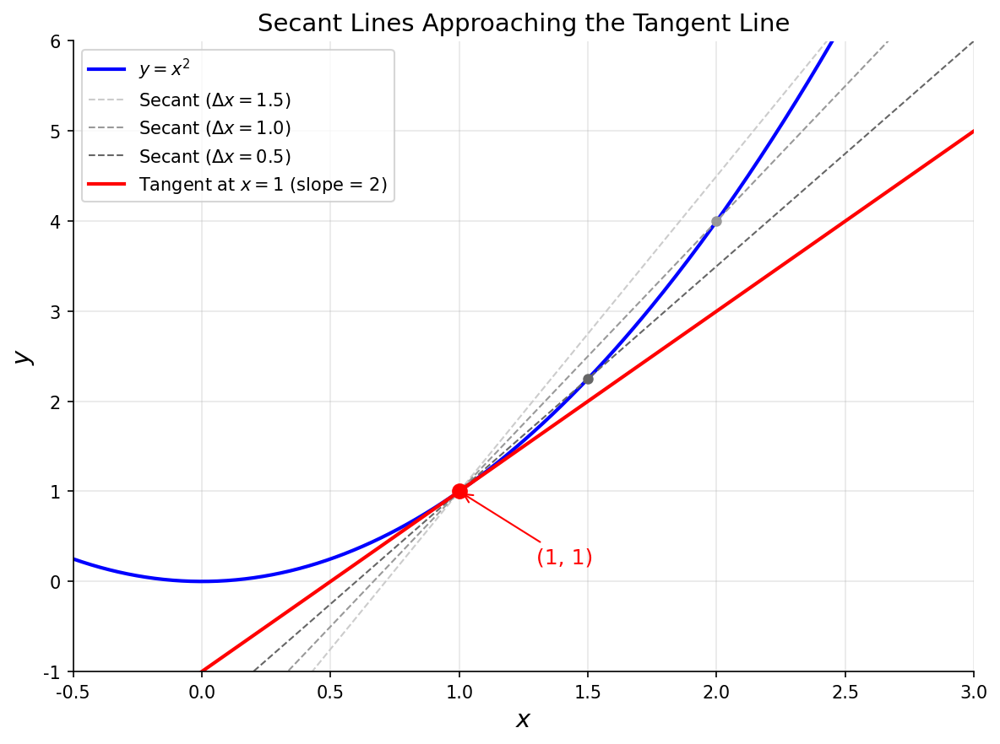

# 导数概念

> **所属路径**：`00_高中复习/01_数学基础/12_导数初步/01_导数概念`
> **预计学习时间**：50 分钟
> **难度等级**：⭐⭐

---

## 前置知识

- [函数与图像](../../../02_函数与图像/)——需要理解函数图像、斜率等基本概念
- [指数与对数](../../../03_指数与对数/)——后续求导法则中会用到指数和对数函数

> 如果以上内容还不熟悉，建议先完成对应课程再继续。

---

## 学习目标

完成本节后，你将能够：

1. 用自己的话解释导数的直觉含义——瞬时变化率
2. 写出导数的极限定义，并用它计算简单函数的导数
3. 区分割线斜率与切线斜率，理解导数的几何意义
4. 说明导数与人工智能中"梯度"概念之间的关系

---

## 正文讲解

### 1. 从"变化"说起

想象你正在开车，仪表盘上显示的速度是 80 km/h。这个"80"意味着什么？它不是说你在过去一小时内行驶了 80 公里——也许你 10 分钟前才刚从红灯起步。它描述的是你 **此刻** 的速度，是一种"瞬间的变化率"。

这个"瞬时速度"的概念，就是导数最直观的含义。数学家用导数来精确描述一个量在某个瞬间的变化快慢。

在学习 **[函数与图像](../../../02_函数与图像/)** 时，我们知道函数 $y = f(x)$ 描述了 $x$ 与 $y$ 之间的对应关系。当 $x$ 发生微小变化时， $y$ 会如何变化？变化有多快？这就是导数要回答的核心问题。

### 2. 从平均变化率到瞬时变化率

让我们从一个具体例子开始。考虑函数 $f(x) = x^2$ ，它的图像是一条开口向上的抛物线。

假设我们想知道 $f(x)$ 在 $x = 1$ 处"变化有多快"。最朴素的做法是取 $x = 1$ 和 $x = 2$ 两个点，计算两点之间的 **平均变化率（Average Rate of Change）**：

$$
\text{平均变化率} = \frac{f(2) - f(1)}{2 - 1} = \frac{4 - 1}{1} = 3
$$

但这只是 $x$ 从 1 到 2 这段区间的"整体速度"。如果我们把区间缩短呢？

| $\Delta x$ | $x_2 = 1 + \Delta x$ | $f(x_2)$ | 平均变化率 |
| ----------- | --------------------- | --------- | ---------- |
| 1.0 | 2.0 | 4.000 | 3.0 |
| 0.5 | 1.5 | 2.250 | 2.5 |
| 0.1 | 1.1 | 1.210 | 2.1 |
| 0.01 | 1.01 | 1.0201 | 2.01 |
| 0.001 | 1.001 | 1.002001 | 2.001 |

你发现了吗？当 $\Delta x$ 越来越小，平均变化率越来越接近 **2**。这个"不断逼近"的极限值，就是 $f(x) = x^2$ 在 $x = 1$ 处的 **瞬时变化率（Instantaneous Rate of Change）**——也就是 **导数（Derivative）**。

### 3. 导数的严格定义

有了上面的直觉，我们可以给出导数的正式定义。函数 $f(x)$ 在点 $x = a$ 处的导数记作 $f'(a)$ ，定义为：

$$
f'(a) = \lim_{\Delta x \to 0} \frac{f(a + \Delta x) - f(a)}{\Delta x}
$$

> **直觉解读**：这个公式在说——把 $x$ 的变化量 $\Delta x$ 无限缩小，看平均变化率趋向的极限值。

等价地，也可以写成：

$$
f'(a) = \lim_{h \to 0} \frac{f(a + h) - f(a)}{h}
$$

其中 $h$ 只是 $\Delta x$ 的另一种写法。

**动手验证**：让我们用定义来计算 $f(x) = x^2$ 在 $x = a$ 处的导数：

$$
f'(a) = \lim_{h \to 0} \frac{(a+h)^2 - a^2}{h} = \lim_{h \to 0} \frac{a^2 + 2ah + h^2 - a^2}{h} = \lim_{h \to 0} \frac{2ah + h^2}{h} = \lim_{h \to 0} (2a + h) = 2a
$$

所以 $f'(x) = 2x$ 。在 $x = 1$ 处， $f'(1) = 2$ ，与我们用数值逼近得到的结果完全一致！

### 4. 导数的几何意义——切线斜率

前面我们用数值表格感受了"平均变化率逼近瞬时变化率"的过程。在图形上，这个过程有一个非常美妙的几何解释。

在曲线 $y = f(x)$ 上取两个点 $A(a, f(a))$ 和 $B(a + \Delta x, f(a + \Delta x))$ ，连接 $A$ 和 $B$ 的直线叫做 **割线（Secant Line）**，它的斜率就是平均变化率。当 $B$ 沿着曲线不断向 $A$ 靠近（即 $\Delta x \to 0$ ），割线会转变为一条 **切线（Tangent Line）**。切线的斜率就是导数 $f'(a)$ 。

下面这张图直观地展示了割线逐渐逼近切线的过程：



> 📌 **图解说明**：蓝色曲线是 $y = x^2$ ，灰色虚线是从切点 $(1, 1)$ 出发、 $\Delta x$ 逐渐减小的割线，红色实线是切线（斜率 $= 2$ ）。可以运行 `code/plot_tangent.py` 自行生成这张图。

从图中可以看到，割线越来越接近切线，斜率也越来越接近 2——这就是导数的几何本质。

### 5. 常用记号

导数有多种等价记号，在不同教材和应用场景中都会出现：

| 记号 | 读法 | 常见场景 |
| ---- | ---- | -------- |
| $f'(x)$ | "f 撇 x" | 高中和大学数学 |
| $\dfrac{dy}{dx}$ | "dy dx" | 物理学、微积分 |
| $\dfrac{df}{dx}$ | "df dx" | 强调函数名时 |
| $\dot{y}$ | "y 点" | 物理学（对时间求导） |

这些记号含义完全相同，只是风格不同。在人工智能领域，最常见的是 $f'(x)$ 和 $\dfrac{\partial f}{\partial x}$（偏导数，后续课程会学到）。

### 6. 导数与人工智能的关系

你可能会问：学导数和人工智能有什么关系？关系非常紧密！

在训练神经网络时，我们有一个 **损失函数（Loss Function）** $L$ ，它衡量模型预测值和真实值之间的差距。训练的目标就是调整模型参数 $w$ ，使 $L$ 尽可能小。

怎么调整 $w$ 呢？答案就是：计算 $L$ 对 $w$ 的导数 $\dfrac{dL}{dw}$ 。如果导数为正，说明 $w$ 增大会让 $L$ 增大（变差），我们就让 $w$ 减小；反之亦然。这就是 **梯度下降（Gradient Descent）** 的核心思想。

而当模型有成百上千层嵌套的函数时，我们需要用 **链式法则（Chain Rule）** 逐层求导——这就是大名鼎鼎的 **反向传播（Backpropagation）** 算法。这一切的起点，就是你现在学的导数。

---

## 动手实践

理解了导数的定义，让我们用 Python 来验证数值逼近的过程。

```python
# 文件：code/numerical_derivative.py
# 数值验证：用定义式逼近 f(x)=x^2 在 x=1 处的导数

def f(x):
    return x ** 2

a = 1.0
print(f"{'delta_x':<15} {'approx_derivative':<20}")
print("-" * 35)

for delta_x in [1.0, 0.5, 0.1, 0.01, 0.001, 0.0001]:
    approx = (f(a + delta_x) - f(a)) / delta_x
    print(f"{delta_x:<15.4f} {approx:<20.6f}")

print(f"\nExact derivative f'(1) = 2*1 = 2.0")
```

**运行说明**：
- 环境要求：Python 3.10+（无需额外安装库）
- 运行命令：`python code/numerical_derivative.py`

**预期输出**：
```
delta_x         approx_derivative   
-----------------------------------
1.0000          3.000000            
0.5000          2.500000            
0.1000          2.100000            
0.0100          2.010000            
0.0010          2.001000            
0.0001          2.000100            

Exact derivative f'(1) = 2*1 = 2.0
```

从输出中可以清楚地看到：随着 $\Delta x$ 不断缩小，数值逼近值越来越接近精确导数值 2.0，完美验证了导数的极限定义。

---

## 典型误区

| 误区 | 正确理解 |
| ---- | -------- |
| 导数就是"变化量"本身 | 导数是变化的 **速率**（比值的极限），不是变化量 $\Delta y$ 本身 |
| $\Delta x$ 可以"等于"零 | $\Delta x$ 趋向零但永远不等于零，否则分母为零无意义 |
| 切线就是"只碰曲线一次的直线" | 切线的正确定义是割线的极限位置，它可以在其他地方再次与曲线相交 |
| 导数存在等于函数连续 | 函数连续不一定可导（如 $f(x) = |x|$ 在 $x = 0$ 处连续但不可导） |

---

## 练习题

### 练习 1：用定义求导数（难度：⭐）

用导数的极限定义，求函数 $f(x) = 3x + 5$ 在任意点 $x = a$ 处的导数。

<details>
<summary>💡 提示</summary>

将 $f(a+h) = 3(a+h) + 5$ 和 $f(a) = 3a + 5$ 代入定义式，化简后取极限。

</details>

<details>
<summary>✅ 参考答案</summary>

$$f'(a) = \lim_{h \to 0} \dfrac{[3(a+h)+5] - [3a+5]}{h} = \lim_{h \to 0} \dfrac{3h}{h} = 3$$

直线函数的导数就是斜率本身，处处为常数 3。

</details>

### 练习 2：用定义求导数（难度：⭐⭐）

用导数的极限定义，求函数 $f(x) = x^3$ 在 $x = 2$ 处的导数。

<details>
<summary>💡 提示</summary>

利用立方差公式展开 $(2+h)^3 = 8 + 12h + 6h^2 + h^3$ 。

</details>

<details>
<summary>✅ 参考答案</summary>

$$f'(2) = \lim_{h \to 0} \dfrac{(2+h)^3 - 8}{h} = \lim_{h \to 0} \dfrac{12h + 6h^2 + h^3}{h} = \lim_{h \to 0} (12 + 6h + h^2) = 12$$

</details>

### 练习 3：几何意义（难度：⭐⭐）

求曲线 $y = x^2$ 在点 $(3, 9)$ 处的切线方程。

<details>
<summary>💡 提示</summary>

先求导得斜率 $f'(3)$ ，再用点斜式 $y - y_0 = k(x - x_0)$ 写出切线方程。

</details>

<details>
<summary>✅ 参考答案</summary>

由 $f'(x) = 2x$ 得 $f'(3) = 6$ 。切线方程为：

$$y - 9 = 6(x - 3) \implies y = 6x - 9$$

</details>

### 练习 4：编程验证（难度：⭐⭐）

编写 Python 程序，用数值方法计算 $f(x) = x^3$ 在 $x = 2$ 处的导数近似值（取 $h = 10^{-6}$ ），与精确值 12 进行比较。

<details>
<summary>💡 提示</summary>

使用中心差分公式 $\dfrac{f(a+h) - f(a-h)}{2h}$ 可以获得更高精度。

</details>

<details>
<summary>✅ 参考答案</summary>

```python
def f(x):
    return x ** 3

a, h = 2.0, 1e-6
forward = (f(a + h) - f(a)) / h          # 前向差分
central = (f(a + h) - f(a - h)) / (2*h)  # 中心差分
print(f"Forward: {forward:.10f}")
print(f"Central: {central:.10f}")
print(f"Exact:   12.0")
```

前向差分约为 12.000006，中心差分约为 12.000000000，中心差分精度更高。

</details>

---

## 下一步学习

- 📖 下一个知识点：[基本求导法则](../02_基本求导法则/02_基本求导法则.md)
- 🔗 相关知识点：[函数与图像](../../../02_函数与图像/)、[指数与对数](../../../03_指数与对数/)
- 📚 拓展阅读：[微积分（大学基础）](../../../../../../01_基础能力/02_数学基础/02_微积分/)

---

## 参考资料

1. [3Blue1Brown — The Essence of Calculus](https://www.youtube.com/playlist?list=PLZHQObOWTQDMsr9K-rj53DwVRMYO3t5Yr) — 可视化微积分系列，直觉讲解导数概念（公开视频，CC BY 许可）
2. [Khan Academy — Derivatives](https://www.khanacademy.org/math/calculus-1/cs1-derivatives-definition-and-basic-rules) — 从极限定义到基本法则的完整课程（免费公开课程）
3. [MIT OpenCourseWare — Single Variable Calculus](https://ocw.mit.edu/courses/18-01sc-single-variable-calculus-fall-2010/) — MIT 单变量微积分公开课（CC BY-NC-SA 许可）
