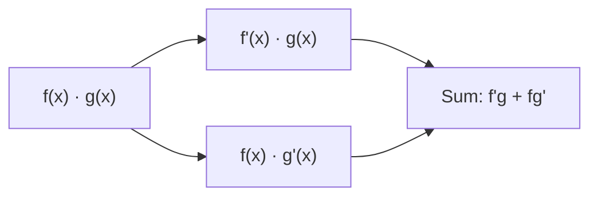

# 基本求导法则

> **所属路径**：`00_高中复习/01_数学基础/12_导数初步/02_基本求导法则`
> **预计学习时间**：40 分钟
> **难度等级**：⭐

---

## 前置知识

- [导数概念](../01_导数概念/01_导数概念.md)——需要理解导数的极限定义和几何意义
- [指数与对数](../../../03_指数与对数/)——指数函数和对数函数的求导会用到

> 如果以上内容还不熟悉，建议先完成对应课程再继续。

---

## 学习目标

完成本节后，你将能够：

1. 熟练运用幂函数、常数、指数、对数、三角函数的求导公式
2. 运用和差法则、常数倍法则快速组合求导
3. 正确应用乘法法则（积的求导法则）和除法法则（商的求导法则）
4. 理解这些法则在计算损失函数梯度中的基础作用

---

## 正文讲解

### 1. 为什么需要求导法则

在上一节中，我们用导数的极限定义计算了 $f(x) = x^2$ 和 $f(x) = x^3$ 的导数。每次都要从定义出发展开、化简、取极限——这个过程既繁琐又容易出错。

好消息是，数学家们已经为我们推导出了一套"快捷公式"。掌握了这些法则，我们可以不经过极限过程，直接写出大多数函数的导数。这就好比你学了乘法口诀之后，不需要每次都用加法来算乘法。

### 2. 基本函数的导数公式

以下是高中阶段最常用的基本导数公式。每个公式都可以用极限定义严格证明，这里我们先记住结论，再通过例子来理解和巩固。

| 原函数 $f(x)$ | 导函数 $f'(x)$ | 说明 |
| -------------- | --------------- | ---- |
| $c$ （常数） | $0$ | 常数不变化，变化率为零 |
| $x^n$ | $nx^{n-1}$ | **幂函数法则（Power Rule）**，适用于任意实数 $n$ |
| $e^x$ | $e^x$ | 自然指数函数"自己的导数就是自己" |
| $a^x$ （ $a > 0, a \neq 1$ ） | $a^x \ln a$ | 一般指数函数 |
| $\ln x$ | $\dfrac{1}{x}$ | 自然对数 |
| $\log_a x$ | $\dfrac{1}{x \ln a}$ | 一般对数 |
| $\sin x$ | $\cos x$ | 正弦 → 余弦 |
| $\cos x$ | $-\sin x$ | 余弦 → 负正弦 |

其中 **幂函数法则** 是使用频率最高的公式。比如 $f(x) = x^5$ 的导数就是 $f'(x) = 5x^4$ ——把指数"拿下来"做系数，原指数减 1。

> **直觉解读**：幂函数法则为什么成立？以 $x^2$ 为例，想象一个正方形的面积 $A = x^2$ 。当边长从 $x$ 增大一点点 $dx$ ，面积增加约 $2x \cdot dx$ （两条边各增加一条窄条），所以 $\dfrac{dA}{dx} = 2x$ 。

下面这张图将四种基本函数（蓝色实线）与它们的导函数（红色虚线）绘制在同一坐标系中，每张子图还在指定点画出了切线（绿色），帮助你直观感受"导数 = 切线斜率"：


> 📌 **图解说明**：左上为幂函数 $x^2$ 及其导数 $2x$ ；右上为正弦函数及其导数余弦函数；左下为自然指数 $e^x$ ，其导数与自身完全重合；右下为自然对数 $\ln x$ 及其导数 $1/x$ 。绿色线段是各点处的切线，其斜率恰好等于导函数在该点的取值。你可以运行 `code/plot_derivative_rules.py` 自行生成这张图。

自然指数函数 $e^x$ 的导数等于自身，这个性质使得 $e$ 在数学中具有特殊地位。在人工智能中，Sigmoid 函数 $\sigma(x) = \dfrac{1}{1+e^{-x}}$ 和 Softmax 函数都离不开 $e^x$ ，而它们求导时正是利用了 $(e^x)' = e^x$ 这个简洁的性质。

### 3. 线性运算法则

有了基本公式之后，我们需要处理函数的加减和常数倍。

**常数倍法则**：如果 $c$ 是常数，则：

$$
[c \cdot f(x)]' = c \cdot f'(x)
$$

**和差法则**：

$$
[f(x) \pm g(x)]' = f'(x) \pm g'(x)
$$

> **直觉解读**：导数是一种"线性运算"——常数可以提出来，加减法可以分开求导。这和极限的线性性质直接相关。

**例题**：求 $y = 3x^4 - 5x^2 + 7x - 2$ 的导数。

逐项求导即可：

$$
y' = 3 \cdot 4x^3 - 5 \cdot 2x + 7 \cdot 1 - 0 = 12x^3 - 10x + 7
$$

### 4. 乘法法则（积的求导法则）

当两个函数相乘时，导数 **不能** 简单地分别求导再相乘！正确的法则是 **乘法法则（Product Rule）**：

$$
[f(x) \cdot g(x)]' = f'(x) \cdot g(x) + f(x) \cdot g'(x)
$$

> **直觉解读**：想象一个矩形，长 $f$ 宽 $g$ 。长和宽同时变化时，面积的变化 $\approx$ 长的变化 $\times$ 宽 $+$ 长 $\times$ 宽的变化。这正是乘法法则的几何来源。



> 📌 **图解说明**：乘法法则将乘积的求导分解为两部分：先对第一个函数求导、保持第二个不变，再保持第一个不变、对第二个求导，最后相加。

**例题**：求 $y = x^2 \cdot e^x$ 的导数。

令 $f(x) = x^2$ ， $g(x) = e^x$ ，则 $f'(x) = 2x$ ， $g'(x) = e^x$ 。

$$
y' = 2x \cdot e^x + x^2 \cdot e^x = e^x(2x + x^2) = x e^x(2 + x)
$$

### 5. 除法法则（商的求导法则）

类似地，两个函数之商的导数由 **除法法则（Quotient Rule）** 给出：

$$
\left[\frac{f(x)}{g(x)}\right]' = \frac{f'(x) \cdot g(x) - f(x) \cdot g'(x)}{[g(x)]^2}
$$

一个便于记忆的口诀是："下乘上导减上乘下导，除以下的平方"。

**例题**：求 $y = \dfrac{x^2}{x + 1}$ 的导数。

$$
y' = \frac{2x \cdot (x+1) - x^2 \cdot 1}{(x+1)^2} = \frac{2x^2 + 2x - x^2}{(x+1)^2} = \frac{x^2 + 2x}{(x+1)^2} = \frac{x(x+2)}{(x+1)^2}
$$

### 6. 与人工智能的联系

在训练机器学习模型时，我们需要计算 **[损失函数（Loss Function）](../../../../../../01_基础能力/02_数学基础/04_最优化/)** 关于参数的导数。损失函数往往是多个基本函数通过加减乘除组合而成的，例如：

- **均方误差**（Mean Squared Error）涉及幂函数和求和
- **交叉熵损失**（Cross-Entropy Loss）涉及对数函数
- **Sigmoid 激活函数** 涉及指数函数和除法

掌握了本节的基本求导法则，你就拥有了计算这些函数梯度的基础能力。

---

## 动手实践

让我们用 Python 的 SymPy 库进行符号求导，验证手算结果。

```python
# 文件：code/symbolic_derivative.py
# 使用 SymPy 进行符号求导
# 环境要求：Python 3.10+, sympy

from sympy import symbols, diff, exp, ln, sin, cos, simplify

x = symbols('x')

# 基本函数求导
functions = {
    'x^5':       x**5,
    'e^x':       exp(x),
    'ln(x)':     ln(x),
    'sin(x)':    sin(x),
    '3x^4 - 5x^2 + 7x - 2': 3*x**4 - 5*x**2 + 7*x - 2,
}

print("=== Basic Derivatives ===")
for name, func in functions.items():
    d = diff(func, x)
    print(f"  d/dx [{name}] = {d}")

# 乘法法则验证
product = x**2 * exp(x)
print(f"\n=== Product Rule ===")
print(f"  d/dx [x^2 * e^x] = {simplify(diff(product, x))}")

# 除法法则验证
quotient = x**2 / (x + 1)
print(f"\n=== Quotient Rule ===")
print(f"  d/dx [x^2 / (x+1)] = {simplify(diff(quotient, x))}")
```

**运行说明**：
- 环境要求：Python 3.10+, sympy
- 安装命令：`pip install sympy`
- 运行命令：`python code/symbolic_derivative.py`

**预期输出**：
```
=== Basic Derivatives ===
  d/dx [x^5] = 5*x**4
  d/dx [e^x] = exp(x)
  d/dx [ln(x)] = 1/x
  d/dx [sin(x)] = cos(x)
  d/dx [3x^4 - 5x^2 + 7x - 2] = 12*x**3 - 10*x + 7

=== Product Rule ===
  d/dx [x^2 * e^x] = x*(x + 2)*exp(x)

=== Quotient Rule ===
  d/dx [x^2 / (x+1)] = x*(x + 2)/(x + 1)**2
```

所有结果与手算完全一致！SymPy 这样的符号计算工具在验证求导结果时非常实用。

---

## 典型误区

| 误区 | 正确理解 |
| ---- | -------- |
| $(fg)' = f'g'$ | 乘积求导不能分别求导再相乘，必须用乘法法则 $(fg)' = f'g + fg'$ |
| 对 $e^x$ 求导得 $xe^{x-1}$ | $e^x$ 不是幂函数，不能用幂函数法则； $(e^x)' = e^x$ |
| 常数的导数是 1 | 常数的导数是 0，变量 $x$ 的导数才是 1 |
| 忘记幂函数法则中指数减 1 | $(x^n)' = nx^{n-1}$ ，例如 $(x^3)' = 3x^2$ ，不是 $3x^3$ |

---

## 练习题

### 练习 1：基本求导（难度：⭐）

求以下函数的导数：
1. $f(x) = 4x^3 - 6x + 9$
2. $g(x) = 5e^x + 3\ln x$

<details>
<summary>💡 提示</summary>

逐项使用幂函数法则、指数函数和对数函数的求导公式。

</details>

<details>
<summary>✅ 参考答案</summary>

1. $f'(x) = 12x^2 - 6$

2. $g'(x) = 5e^x + \dfrac{3}{x}$

</details>

### 练习 2：乘法法则（难度：⭐⭐）

求 $y = x^3 \sin x$ 的导数。

<details>
<summary>💡 提示</summary>

令 $f(x) = x^3$ ， $g(x) = \sin x$ ，使用乘法法则 $(fg)' = f'g + fg'$ 。

</details>

<details>
<summary>✅ 参考答案</summary>

$$y' = 3x^2 \sin x + x^3 \cos x$$

</details>

### 练习 3：除法法则（难度：⭐⭐）

求 $y = \dfrac{e^x}{x^2 + 1}$ 的导数。

<details>
<summary>💡 提示</summary>

使用商的求导法则，分子 $f = e^x$ ，分母 $g = x^2 + 1$ 。

</details>

<details>
<summary>✅ 参考答案</summary>

$$y' = \dfrac{e^x(x^2 + 1) - e^x \cdot 2x}{(x^2+1)^2} = \dfrac{e^x(x^2 - 2x + 1)}{(x^2+1)^2} = \dfrac{e^x(x-1)^2}{(x^2+1)^2}$$

</details>

---

## 下一步学习

- 📖 下一个知识点：[复合函数求导](../03_复合函数求导/03_复合函数求导.md)
- 🔗 相关知识点：[导数概念](../01_导数概念/01_导数概念.md)
- 📚 拓展阅读：[微积分（大学基础）](../../../../../../01_基础能力/02_数学基础/02_微积分/)

---

## 参考资料

1. [Khan Academy — Derivative Rules](https://www.khanacademy.org/math/calculus-1/cs1-derivatives-definition-and-basic-rules) — 基本求导法则的分步讲解与练习（免费公开课程）
2. [3Blue1Brown — Derivative Formulas Through Geometry](https://www.youtube.com/watch?v=S0_qX4VJhMQ) — 用几何直觉理解求导法则（公开视频，CC BY 许可）
3. [Paul's Online Math Notes — Differentiation Formulas](https://tutorial.math.lamar.edu/Classes/CalcI/DiffFormulas.aspx) — 完整的求导公式汇总与例题（免费公开教程）
