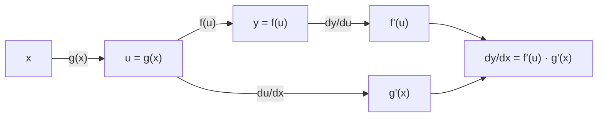
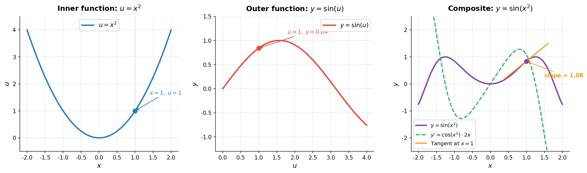

# 复合函数求导

> **所属路径**：`00_高中复习/01_数学基础/12_导数初步/03_复合函数求导`
> **预计学习时间**：45 分钟
> **难度等级**：⭐⭐

---

## 前置知识

- [导数概念](../01_导数概念/01_导数概念.md)——需要理解导数的定义和几何意义
- [基本求导法则](../02_基本求导法则/02_基本求导法则.md)——需要熟练掌握基本函数的求导公式
- [函数与图像](../../../02_函数与图像/)——需要理解复合函数的概念

> 如果以上内容还不熟悉，建议先完成对应课程再继续。

---

## 学习目标

完成本节后，你将能够：

1. 识别复合函数的"内层"和"外层"函数
2. 准确陈述并应用链式法则
3. 对多层嵌套的复合函数逐层求导
4. 理解链式法则与反向传播算法之间的直接对应关系

---

## 正文讲解

### 1. 什么是复合函数

在学习 **[函数与图像](../../../02_函数与图像/)** 时，我们知道一个函数可以作为另一个函数的输入。例如：

$$
y = (3x + 1)^5
$$

这个函数看起来像是幂函数 $u^5$ ，但底数不是简单的 $x$ ，而是 $u = 3x + 1$ 。我们说 $y$ 是 $u$ 和 $x$ 的 **复合函数（Composite Function）**：

- **内层函数**（内函数）： $u = g(x) = 3x + 1$
- **外层函数**（外函数）： $y = f(u) = u^5$

整体写作 $y = f(g(x)) = (3x + 1)^5$ 。

直接用幂函数法则对 $(3x+1)^5$ 求导行不行？不行——幂函数法则 $(x^n)' = nx^{n-1}$ 要求底数是 $x$ 本身，而这里底数是 $3x+1$ 。我们需要一个新工具：**链式法则（Chain Rule）**。

### 2. 链式法则

**链式法则（Chain Rule）** 是复合函数求导的核心定理：

$$
\frac{dy}{dx} = \frac{dy}{du} \cdot \frac{du}{dx}
$$

> **直觉解读**：如果 $y$ 随 $u$ 变化，而 $u$ 又随 $x$ 变化，那么 $y$ 随 $x$ 的变化率 $=$ $y$ 随 $u$ 的变化率 $\times$ $u$ 随 $x$ 的变化率。就像货币兑换：你知道人民币兑美元的汇率和美元兑欧元的汇率，两者相乘就得到人民币兑欧元的汇率。

用函数记号写成：

$$
[f(g(x))]' = f'(g(x)) \cdot g'(x)
$$

这个公式的含义是：**先对外层函数求导（把内层整体当作变量），再乘以内层函数的导数**。



> 📌 **图解说明**：链式法则的信息流——输入 $x$ 经过内层函数 $g$ 得到 $u$ ，再经过外层函数 $f$ 得到 $y$ 。求导时反方向传播：先求 $\dfrac{dy}{du}$ ，再乘以 $\dfrac{du}{dx}$ 。

### 3. 链式法则的应用步骤

让我们回到开头的例子 $y = (3x + 1)^5$ ，用链式法则三步求导：

**第一步：识别内外层**
- 外层 $f(u) = u^5$ ，内层 $g(x) = 3x + 1$

**第二步：分别求导**
- $f'(u) = 5u^4$ ，即 $\dfrac{dy}{du} = 5(3x+1)^4$
- $g'(x) = 3$ ，即 $\dfrac{du}{dx} = 3$

**第三步：相乘**

$$
\frac{dy}{dx} = 5(3x+1)^4 \cdot 3 = 15(3x+1)^4
$$

让我们再看几个例子来加深理解。

**例 1**：求 $y = e^{2x}$ 的导数。

- 外层 $f(u) = e^u$ ，内层 $g(x) = 2x$
- $f'(u) = e^u$ ， $g'(x) = 2$
- $y' = e^{2x} \cdot 2 = 2e^{2x}$

**例 2**：求 $y = \ln(x^2 + 1)$ 的导数。

- 外层 $f(u) = \ln u$ ，内层 $g(x) = x^2 + 1$
- $f'(u) = \dfrac{1}{u}$ ， $g'(x) = 2x$
- $y' = \dfrac{1}{x^2+1} \cdot 2x = \dfrac{2x}{x^2+1}$

**例 3**：求 $y = \sin(3x^2)$ 的导数。

- 外层 $f(u) = \sin u$ ，内层 $g(x) = 3x^2$
- $f'(u) = \cos u$ ， $g'(x) = 6x$
- $y' = \cos(3x^2) \cdot 6x = 6x\cos(3x^2)$

### 4. 多层复合的链式法则

如果函数嵌套了不止两层呢？链式法则可以自然地扩展。对于 $y = f(g(h(x)))$ ：

$$
\frac{dy}{dx} = f'(g(h(x))) \cdot g'(h(x)) \cdot h'(x)
$$

**例 4**：求 $y = e^{\sin(2x)}$ 的导数。

这里有三层嵌套：
- 最外层 $f(u) = e^u$ ，其中 $u = \sin(2x)$
- 中间层 $g(v) = \sin v$ ，其中 $v = 2x$
- 最内层 $h(x) = 2x$

$$
y' = e^{\sin(2x)} \cdot \cos(2x) \cdot 2 = 2\cos(2x) \cdot e^{\sin(2x)}
$$

下面这张图以 $y = \sin(x^2)$ 为例，将链式法则的三个环节可视化——分别绘制内函数 $u = x^2$ 、外函数 $y = \sin(u)$ 和复合函数 $y = \sin(x^2)$ 及其导数：



> 📌 **图解说明**：左图是内函数 $u = x^2$ （蓝色），中图是外函数 $y = \sin(u)$ （红色），右图是复合函数 $y = \sin(x^2)$ （紫色）及其导数 $y' = \cos(x^2) \cdot 2x$ （绿色虚线）。在 $x = 1$ 处标注了切线（橙色），其斜率正是链式法则计算出的导数值。你可以运行 `code/plot_chain_rule.py` 自行生成这张图。

### 5. 链式法则就是反向传播

这一节的内容在人工智能中有着至关重要的地位。

在神经网络中，输入 $x$ 经过多层函数变换：

$$
x \xrightarrow{f_1} h_1 \xrightarrow{f_2} h_2 \xrightarrow{f_3} \cdots \xrightarrow{f_n} L
$$

其中 $L$ 是最终的损失函数值。我们要计算 $\dfrac{dL}{dx}$ 来更新参数。根据链式法则：

$$
\frac{dL}{dx} = \frac{dL}{dh_{n-1}} \cdot \frac{dh_{n-1}}{dh_{n-2}} \cdots \frac{dh_1}{dx}
$$

这个从输出层向输入层逐层求导的过程，就是 **反向传播（Backpropagation）** 算法。可以说，链式法则就是反向传播的数学本质！

当你在后续学习深度学习时看到"梯度沿着计算图反向传播"这样的描述，请回忆这里的链式法则——它们是同一件事。

---

## 动手实践

让我们用 Python 验证链式法则，并对比手算结果与数值/符号求导的结果。

```python
# 文件：code/chain_rule.py
# 链式法则验证：符号求导 + 数值验证
# 环境要求：Python 3.10+, sympy, numpy

import numpy as np
from sympy import symbols, diff, exp, sin, ln, cos, simplify

x = symbols('x')

# --- 符号求导验证 ---
examples = {
    '(3x+1)^5':       (3*x + 1)**5,
    'e^(2x)':         exp(2*x),
    'ln(x^2+1)':      ln(x**2 + 1),
    'sin(3x^2)':      sin(3*x**2),
    'e^(sin(2x))':    exp(sin(2*x)),
}

print("=== Symbolic Chain Rule ===")
for name, func in examples.items():
    d = simplify(diff(func, x))
    print(f"  d/dx [{name}] = {d}")

# --- 数值验证 ---
print("\n=== Numerical Verification ===")
# 验证 d/dx[e^(sin(2x))] 在 x=1 处
import math

def f(val):
    return math.exp(math.sin(2 * val))

x0 = 1.0
h = 1e-8
numerical = (f(x0 + h) - f(x0 - h)) / (2 * h)
# 手算：2*cos(2x)*e^(sin(2x)) 在 x=1
analytical = 2 * math.cos(2 * x0) * math.exp(math.sin(2 * x0))

print(f"  f(x) = e^(sin(2x)) at x = {x0}")
print(f"  Numerical derivative:  {numerical:.10f}")
print(f"  Analytical derivative: {analytical:.10f}")
print(f"  Difference:            {abs(numerical - analytical):.2e}")
```

**运行说明**：
- 环境要求：Python 3.10+, sympy, numpy
- 安装命令：`pip install sympy numpy`
- 运行命令：`python code/chain_rule.py`

**预期输出**：
```
=== Symbolic Chain Rule ===
  d/dx [(3x+1)^5] = 15*(3*x + 1)**4
  d/dx [e^(2x)] = 2*exp(2*x)
  d/dx [ln(x^2+1)] = 2*x/(x**2 + 1)
  d/dx [sin(3x^2)] = 6*x*cos(3*x**2)
  d/dx [e^(sin(2x))] = 2*exp(sin(2*x))*cos(2*x)

=== Numerical Verification ===
  f(x) = e^(sin(2x)) at x = 1.0
  Numerical derivative:  -2.0753225058
  Analytical derivative: -2.0753225058
  Difference:            3.11e-09
```

数值求导与解析求导的结果高度吻合，误差仅在 $10^{-9}$ 量级，完美验证了链式法则的正确性。

---

## 典型误区

| 误区 | 正确理解 |
| ---- | -------- |
| 对 $(3x+1)^5$ 直接用幂函数法则得 $5(3x+1)^4$ | 漏乘了内层导数！正确结果是 $5(3x+1)^4 \times 3 = 15(3x+1)^4$ |
| 多层复合只乘一次内层导数 | 有几层嵌套就要乘几次，逐层求导 |
| 把 $e^{2x}$ 的导数写成 $e^{2x}$ | 内层 $2x$ 的导数是 2，结果应为 $2e^{2x}$ |
| 认为链式法则只在高中有用 | 链式法则是深度学习反向传播的核心数学原理 |

---

## 练习题

### 练习 1：基本链式法则（难度：⭐）

求 $y = (2x - 3)^4$ 的导数。

<details>
<summary>💡 提示</summary>

外层 $u^4$ ，内层 $u = 2x - 3$ ，别忘了乘内层导数。

</details>

<details>
<summary>✅ 参考答案</summary>

$$y' = 4(2x-3)^3 \cdot 2 = 8(2x-3)^3$$

</details>

### 练习 2：指数函数复合（难度：⭐⭐）

求 $y = e^{-x^2}$ 的导数。

<details>
<summary>💡 提示</summary>

外层是 $e^u$ ，内层是 $u = -x^2$ 。

</details>

<details>
<summary>✅ 参考答案</summary>

$$y' = e^{-x^2} \cdot (-2x) = -2xe^{-x^2}$$

这个函数的图像是高斯曲线（钟形曲线），在统计和机器学习中极为常见。

</details>

### 练习 3：三层复合（难度：⭐⭐⭐）

求 $y = \ln(\cos(3x))$ 的导数。

<details>
<summary>💡 提示</summary>

三层嵌套：最外层 $\ln u$ ，中间层 $\cos v$ ，最内层 $3x$ 。逐层求导再相乘。

</details>

<details>
<summary>✅ 参考答案</summary>

$$y' = \dfrac{1}{\cos(3x)} \cdot (-\sin(3x)) \cdot 3 = -3\tan(3x)$$

</details>

### 练习 4：编程验证（难度：⭐⭐）

用 Python 数值方法验证练习 3 的结果：在 $x = 0.2$ 处比较数值导数与解析导数 $-3\tan(3 \times 0.2)$ 。

<details>
<summary>💡 提示</summary>

使用中心差分 $\dfrac{f(x+h) - f(x-h)}{2h}$ ，其中 $h = 10^{-8}$ 。

</details>

<details>
<summary>✅ 参考答案</summary>

```python
import math

def f(x):
    return math.log(math.cos(3 * x))

x0, h = 0.2, 1e-8
numerical = (f(x0 + h) - f(x0 - h)) / (2 * h)
analytical = -3 * math.tan(3 * x0)
print(f"Numerical: {numerical:.10f}")
print(f"Analytical: {analytical:.10f}")
```

两个值应非常接近，误差在 $10^{-8}$ 量级。

</details>

---

## 下一步学习

- 📖 下一个知识点：[单调性与最值](../04_单调性与最值/04_单调性与最值.md)
- 🔗 相关知识点：[基本求导法则](../02_基本求导法则/02_基本求导法则.md)
- 📚 拓展阅读：[微积分（大学基础）](../../../../../../01_基础能力/02_数学基础/02_微积分/)

---

## 参考资料

1. [3Blue1Brown — What is Backpropagation Really Doing?](https://www.youtube.com/watch?v=Ilg3gGewQ5U) — 用可视化解释反向传播与链式法则的关系（公开视频，CC BY 许可）
2. [Khan Academy — Chain Rule](https://www.khanacademy.org/math/ap-calculus-ab/ab-differentiation-2-new/ab-3-1a/v/chain-rule-introduction) — 链式法则的分步教程与练习（免费公开课程）
3. [MIT OpenCourseWare — Chain Rule and Implicit Differentiation](https://ocw.mit.edu/courses/18-01sc-single-variable-calculus-fall-2010/) — MIT 微积分课程中的链式法则章节（CC BY-NC-SA 许可）
