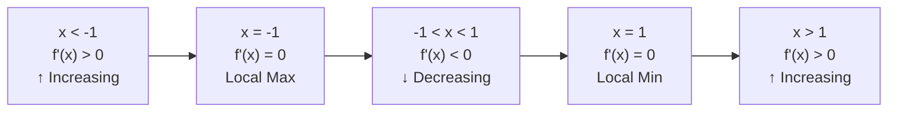

# 单调性与最值

> **所属路径**：`00_高中复习/01_数学基础/12_导数初步/04_单调性与最值`
> **预计学习时间**：45 分钟
> **难度等级**：⭐⭐

---

## 前置知识

- [导数概念](../01_导数概念/01_导数概念.md)——需要理解导数的几何意义（切线斜率）
- [基本求导法则](../02_基本求导法则/02_基本求导法则.md)——需要能快速求出常见函数的导数
- [复合函数求导](../03_复合函数求导/03_复合函数求导.md)——涉及复合函数的单调性判断
- [函数与图像](../../../02_函数与图像/)——需要理解函数单调性的图形含义

> 如果以上内容还不熟悉，建议先完成对应课程再继续。

---

## 学习目标

完成本节后，你将能够：

1. 用导数的正负判断函数在给定区间上的单调性
2. 找到函数的驻点和临界点
3. 用第一导数检验法判断极大值和极小值
4. 在闭区间上求函数的最大值和最小值
5. 理解"寻找最值"与人工智能中"优化损失函数"的联系

---

## 正文讲解

### 1. 导数与单调性的关系

回顾导数的几何意义：导数 $f'(x)$ 是曲线在点 $x$ 处切线的斜率。那么：

- 如果切线向右上方倾斜（斜率 > 0），函数在该点附近是**递增**的
- 如果切线向右下方倾斜（斜率 < 0），函数在该点附近是**递减**的
- 如果切线是水平的（斜率 = 0），函数在该点处"停了一下"——可能是极值点

这给出了用导数判断 **[单调性（Monotonicity）](../../../02_函数与图像/)** 的核心定理：

> **定理**：设 $f(x)$ 在区间 $(a, b)$ 上可导，则：
> - 若 $f'(x) > 0$ 对所有 $x \in (a, b)$ 成立，则 $f(x)$ 在 $(a, b)$ 上单调递增
> - 若 $f'(x) < 0$ 对所有 $x \in (a, b)$ 成立，则 $f(x)$ 在 $(a, b)$ 上单调递减

这个定理把"函数在哪里增、哪里减"的问题，转化成了"导数在哪里为正、哪里为负"的问题——而后者通常更容易判断。

### 2. 驻点与临界点

使 $f'(x) = 0$ 的点叫做 **驻点（Stationary Point）**。驻点是函数从递增变为递减（或反过来）的"转折候选点"。

但需要注意：导数不存在的点也可能是转折点。我们把驻点和导数不存在的点统称为 **临界点（Critical Point）**。

**例题**：求 $f(x) = x^3 - 3x$ 的驻点和单调区间。

**第一步**：求导。

$$
f'(x) = 3x^2 - 3 = 3(x^2 - 1) = 3(x+1)(x-1)
$$

**第二步**：令 $f'(x) = 0$ ，解得驻点 $x = -1$ 和 $x = 1$ 。

**第三步**：用驻点将数轴分段，判断每段上 $f'(x)$ 的符号。

| 区间 | $f'(x)$ 符号 | 单调性 |
| ---- | ------------- | ------ |
| $(-\infty, -1)$ | $+$ | 递增 ↑ |
| $(-1, 1)$ | $-$ | 递减 ↓ |
| $(1, +\infty)$ | $+$ | 递增 ↑ |



> 📌 **图解说明**：函数 $f(x) = x^3 - 3x$ 的单调性变化。在 $x = -1$ 处从递增变为递减（极大值），在 $x = 1$ 处从递减变为递增（极小值）。

下面这张图用颜色对照的方式更加直观地呈现了函数图像与导函数符号之间的对应关系：


> 📌 **图解说明**：左图为 $f(x) = x^3 - 3x$ 的图像，绿色段表示 $f'(x) > 0$ （递增），红色段表示 $f'(x) < 0$ （递减）。右图为导函数 $f'(x) = 3x^2 - 3$ ，绿色区域在零轴上方（正值，对应递增），红色区域在零轴下方（负值，对应递减）。两个零点 $x = -1$ 和 $x = 1$ 正是函数的极值点。你可以运行 `code/plot_monotonicity.py` 自行生成这张图。

### 3. 极值与第一导数检验法

从上面的例子可以看到，在驻点处，如果 $f'(x)$ 的符号发生了变化，那么该点就是一个 **极值点（Extremum）**：

> **第一导数检验法**：
> - 如果 $f'(x)$ 从正变负（↑ → ↓），则该点是 **极大值点（Local Maximum）**
> - 如果 $f'(x)$ 从负变正（↓ → ↑），则该点是 **极小值点（Local Minimum）**
> - 如果 $f'(x)$ 符号不变（如 $f(x) = x^3$ 在 $x = 0$ 处），则该点 **不是极值点**

对于上面的例子：
- $x = -1$ ：导数从正变负 → **极大值** $f(-1) = (-1)^3 - 3(-1) = 2$
- $x = 1$ ：导数从负变正 → **极小值** $f(1) = 1^3 - 3(1) = -2$

想一想：为什么 $f(x) = x^3$ 在驻点 $x = 0$ 处不是极值点？因为 $f'(x) = 3x^2 \geq 0$ ，导数在 $x = 0$ 两侧都不为负，符号没有改变。

### 4. 闭区间上的最值

在实际问题中，我们常常需要在一个有限区间 $[a, b]$ 上找到函数的最大值和最小值。方法如下：

> **闭区间最值定理**：若 $f(x)$ 在闭区间 $[a, b]$ 上连续，则最大值和最小值必定在以下位置取到：
> 1. 区间内部的临界点
> 2. 区间端点 $x = a$ 或 $x = b$

**操作步骤**：
1. 求 $f'(x)$ ，找出 $[a, b]$ 内的所有临界点
2. 计算所有临界点和两个端点处的函数值
3. 比较大小，最大的就是最大值，最小的就是最小值

**例题**：求 $f(x) = x^3 - 3x$ 在 $[-2, 2]$ 上的最大值和最小值。

已知临界点为 $x = -1$ 和 $x = 1$ ，它们都在 $[-2, 2]$ 内。计算各关键点的函数值：

| 点 | $f(x)$ |
| --- | ------ |
| $x = -2$ | $(-2)^3 - 3(-2) = -2$ |
| $x = -1$ | $(-1)^3 - 3(-1) = 2$ |
| $x = 1$ | $1^3 - 3(1) = -2$ |
| $x = 2$ | $2^3 - 3(2) = 2$ |

∴ 在 $[-2, 2]$ 上，最大值为 2（在 $x = -1$ 和 $x = 2$ 处取到），最小值为 $-2$ （在 $x = -2$ 和 $x = 1$ 处取到）。

### 5. 与人工智能的联系

在机器学习中，训练模型本质上就是一个"找最值"的问题——我们要找到使损失函数取最小值的参数。

- **损失函数的驻点**：对损失函数 $L(w)$ 求导，令 $\dfrac{dL}{dw} = 0$ 的点是候选最优点
- **导数的符号**：如果 $\dfrac{dL}{dw} > 0$ ，说明增大 $w$ 会使损失增大，应该减小 $w$ ；反之亦然
- **梯度下降的方向**：梯度下降每一步都沿着"导数为负"的方向移动，本质上就是在寻找损失函数的最小值

不过，现实中的损失函数通常有成千上万个参数（不只是一个 $w$ ），函数图像是高维空间中的"曲面"。这时我们用 **梯度（Gradient）** 代替导数，用 **梯度下降（Gradient Descent）** 算法迭代搜索最小值，而不是直接解方程 $\dfrac{dL}{dw} = 0$ 。但核心思想与本节学的"用导数找最值"完全一致。

---

## 动手实践

让我们用 Python 来绘制函数的图像，直观观察单调性与极值。

```python
# 文件：code/monotonicity.py
# 用导数判断单调性，绘制函数图像与极值点
# 环境要求：Python 3.10+, numpy, matplotlib

import numpy as np
import matplotlib.pyplot as plt

plt.rcParams['font.sans-serif'] = ['DejaVu Sans']
plt.rcParams['axes.unicode_minus'] = False

# 定义函数和导函数
def f(x):
    return x**3 - 3*x

def f_prime(x):
    return 3*x**2 - 3

x = np.linspace(-2.5, 2.5, 300)

fig, (ax1, ax2) = plt.subplots(2, 1, figsize=(8, 8), sharex=True)

# 上图：函数图像
ax1.plot(x, f(x), 'b-', linewidth=2, label=r'$f(x) = x^3 - 3x$')
ax1.plot(-1, f(-1), 'r^', markersize=12, label=f'Local max (-1, {f(-1)})')
ax1.plot(1, f(1), 'gv', markersize=12, label=f'Local min (1, {f(1)})')
ax1.axhline(y=0, color='gray', linewidth=0.5)
ax1.set_ylabel(r'$f(x)$', fontsize=14)
ax1.set_title(r'$f(x) = x^3 - 3x$ and its derivative', fontsize=14)
ax1.legend(fontsize=10)
ax1.grid(True, alpha=0.3)
ax1.spines['top'].set_visible(False)
ax1.spines['right'].set_visible(False)

# 下图：导函数图像
ax2.plot(x, f_prime(x), 'm-', linewidth=2, label=r"$f'(x) = 3x^2 - 3$")
ax2.axhline(y=0, color='gray', linewidth=0.5)
ax2.fill_between(x, f_prime(x), 0, where=(f_prime(x) > 0),
                 alpha=0.2, color='green', label=r"$f'(x) > 0$ (increasing)")
ax2.fill_between(x, f_prime(x), 0, where=(f_prime(x) < 0),
                 alpha=0.2, color='red', label=r"$f'(x) < 0$ (decreasing)")
ax2.plot([-1, 1], [0, 0], 'ko', markersize=8)
ax2.set_xlabel(r'$x$', fontsize=14)
ax2.set_ylabel(r"$f'(x)$", fontsize=14)
ax2.legend(fontsize=10)
ax2.grid(True, alpha=0.3)
ax2.spines['top'].set_visible(False)
ax2.spines['right'].set_visible(False)

plt.tight_layout()
plt.savefig('monotonicity_plot.png', dpi=150, bbox_inches='tight',
            facecolor='white')
plt.close()

# 打印分析结果
print("Critical points: x = -1, x = 1")
print(f"f(-1) = {f(-1)} (local maximum)")
print(f"f(1) = {f(1)} (local minimum)")
print(f"\nOn [-2, 2]:")
points = {'x=-2': f(-2), 'x=-1': f(-1), 'x=1': f(1), 'x=2': f(2)}
for pt, val in points.items():
    print(f"  f({pt}) = {val}")
print(f"\nGlobal max = {max(points.values())}")
print(f"Global min = {min(points.values())}")
```

**运行说明**：
- 环境要求：Python 3.10+, numpy, matplotlib
- 运行命令：`python code/monotonicity.py`

**预期输出**：
```
Critical points: x = -1, x = 1
f(-1) = 2 (local maximum)
f(1) = -2 (local minimum)

On [-2, 2]:
  f(x=-2) = -2
  f(x=-1) = 2
  f(x=1) = -2
  f(x=2) = 2

Global max = 2
Global min = -2
```

---

## 典型误区

| 误区 | 正确理解 |
| ---- | -------- |
| 驻点一定是极值点 | 驻点只是候选点，如 $f(x) = x^3$ 在 $x=0$ 处是驻点但不是极值点 |
| 极大值一定大于极小值 | 不一定！极大/极小是局部概念，极大值可以比极小值小 |
| 闭区间上的最值只在临界点取到 | 端点也可能是最值点，必须比较端点和临界点的函数值 |
| 导数为零就是最小值 | 导数为零可能是极大值、极小值或鞍点，需要进一步检验 |

---

## 练习题

### 练习 1：单调区间（难度：⭐）

求函数 $f(x) = x^2 - 4x + 3$ 的单调递增区间和单调递减区间。

<details>
<summary>💡 提示</summary>

求导得 $f'(x) = 2x - 4$ ，令其大于零或小于零。

</details>

<details>
<summary>✅ 参考答案</summary>

$f'(x) = 2x - 4$ 。令 $f'(x) = 0$ 得 $x = 2$ 。

- 当 $x < 2$ 时， $f'(x) < 0$ ，函数递减
- 当 $x > 2$ 时， $f'(x) > 0$ ，函数递增

递减区间 $(-\infty, 2)$ ，递增区间 $(2, +\infty)$ 。

</details>

### 练习 2：极值（难度：⭐⭐）

求函数 $f(x) = x^3 - 6x^2 + 9x + 1$ 的极大值和极小值。

<details>
<summary>💡 提示</summary>

求导、因式分解、列表判断 $f'(x)$ 的符号变化。

</details>

<details>
<summary>✅ 参考答案</summary>

$f'(x) = 3x^2 - 12x + 9 = 3(x-1)(x-3)$ 。驻点 $x = 1$ 和 $x = 3$ 。

- $x < 1$ ： $f'(x) > 0$ （递增）
- $1 < x < 3$ ： $f'(x) < 0$ （递减）
- $x > 3$ ： $f'(x) > 0$ （递增）

$x = 1$ 处为极大值 $f(1) = 5$ ， $x = 3$ 处为极小值 $f(3) = 1$ 。

</details>

### 练习 3：闭区间最值（难度：⭐⭐）

求 $f(x) = x^3 - 6x^2 + 9x + 1$ 在 $[0, 4]$ 上的最大值和最小值。

<details>
<summary>💡 提示</summary>

利用练习 2 的结果，再计算端点 $f(0)$ 和 $f(4)$ 的值进行比较。

</details>

<details>
<summary>✅ 参考答案</summary>

由练习 2 知临界点为 $x = 1$ 和 $x = 3$ ，都在 $[0, 4]$ 内。

| 点 | $f(x)$ |
| --- | ------ |
| $x = 0$ | $1$ |
| $x = 1$ | $5$ |
| $x = 3$ | $1$ |
| $x = 4$ | $5$ |

最大值为 5（在 $x = 1$ 和 $x = 4$ 处取到），最小值为 1（在 $x = 0$ 和 $x = 3$ 处取到）。

</details>

---

## 下一步学习

- 📖 下一个知识点：[导数应用](../05_导数应用/05_导数应用.md)
- 🔗 相关知识点：[导数概念](../01_导数概念/01_导数概念.md)、[函数与图像](../../../02_函数与图像/)
- 📚 拓展阅读：[微积分（大学基础）](../../../../../../01_基础能力/02_数学基础/02_微积分/)

---

## 参考资料

1. [Khan Academy — Applying Derivatives to Analyze Functions](https://www.khanacademy.org/math/calculus-1/cs1-analyzing-functions) — 用导数分析函数单调性与极值（免费公开课程）
2. [Paul's Online Math Notes — Shape of a Graph](https://tutorial.math.lamar.edu/Classes/CalcI/ShapeofGraphPtI.aspx) — 函数图形分析的完整指南（免费公开教程）
3. [MIT OpenCourseWare — Applications of Differentiation](https://ocw.mit.edu/courses/18-01sc-single-variable-calculus-fall-2010/) — MIT 微积分课程中的导数应用章节（CC BY-NC-SA 许可）
