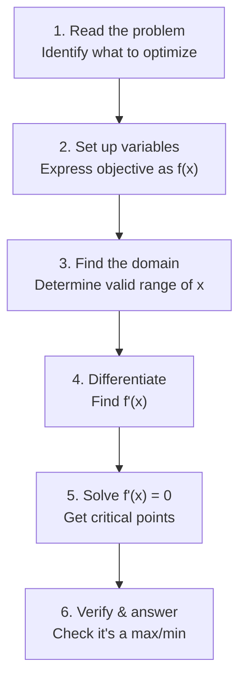

# 导数应用

> **所属路径**：`00_高中复习/01_数学基础/12_导数初步/05_导数应用`
> **预计学习时间**：50 分钟
> **难度等级**：⭐⭐

---

## 前置知识

- [导数概念](../01_导数概念/01_导数概念.md)——需要理解导数的定义和几何意义
- [基本求导法则](../02_基本求导法则/02_基本求导法则.md)——需要能对各种函数求导
- [复合函数求导](../03_复合函数求导/03_复合函数求导.md)——优化问题中常涉及复合函数
- [单调性与最值](../04_单调性与最值/04_单调性与最值.md)——本节的核心前置，需要掌握极值判断和闭区间最值

> 如果以上内容还不熟悉，建议先完成对应课程再继续。

---

## 学习目标

完成本节后，你将能够：

1. 用导数解决实际生活中的最优化问题（最大面积、最小成本等）
2. 求曲线在指定点处的切线方程
3. 利用导数对函数进行曲线分析（凹凸性初步）
4. 用导数进行线性近似（微分近似）
5. 理解梯度下降作为迭代优化方法的基本思想

---

## 正文讲解

### 1. 实际最优化问题

在前一节中，我们学会了用导数在闭区间上找函数的最值。现在，让我们把这个能力用在实际问题中。

**经典问题**：一位农民有 60 米的栅栏，想围出一个矩形菜地，一边靠墙不需要栅栏。问：矩形的长和宽各取多少时，菜地面积最大？

**建模过程**：设垂直于墙的边长（宽）为 $x$ 米，则平行于墙的边长（长）为 $60 - 2x$ 米。面积为：

$$
S(x) = x(60 - 2x) = 60x - 2x^2
$$

其中 $x$ 的取值范围是 $0 < x < 30$ （宽度为正，且长度 $60-2x > 0$ ）。

**求最值**：

$$
S'(x) = 60 - 4x
$$

令 $S'(x) = 0$ 得 $x = 15$ 。当 $x < 15$ 时 $S'(x) > 0$ （递增），当 $x > 15$ 时 $S'(x) < 0$ （递减），所以 $x = 15$ 是极大值点（也是最大值点）。

$$
S(15) = 15 \times (60 - 30) = 450 \text{ 平方米}
$$

∴ 宽 15 米、长 30 米时，面积最大为 450 平方米。

下面这张图展示了面积函数 $S(x)$ 在有效定义域 $(0, 30)$ 上的图像，以及最大值点的位置：


> 📌 **图解说明**：蓝色曲线为面积函数 $S(x) = x(60 - 2x)$ ，红色五角星标记最大值点 $(15, 450)$ 。水平虚线是该点处的切线（斜率为 0），验证了 $S'(15) = 0$ 。左侧 $S'(x) > 0$ 面积递增，右侧 $S'(x) < 0$ 面积递减。你可以运行 `code/plot_optimization.py` 自行生成这张图。

解最优化问题的一般步骤如下：



> 📌 **图解说明**：求解实际最优化问题的六步流程——从审题到验证，形成完整的解题框架。

### 2. 切线方程

导数的几何意义告诉我们 $f'(a)$ 是曲线 $y = f(x)$ 在点 $(a, f(a))$ 处切线的斜率。因此切线方程可以直接写出：

$$
y - f(a) = f'(a)(x - a)
$$

**例题**：求曲线 $y = e^x$ 在点 $(0, 1)$ 处的切线方程。

- $f(x) = e^x$ ， $f'(x) = e^x$
- 在 $x = 0$ 处： $f'(0) = e^0 = 1$
- 切线方程： $y - 1 = 1 \cdot (x - 0)$ ，即 $y = x + 1$

这条切线 $y = x + 1$ 在 $x = 0$ 附近是 $e^x$ 的一个很好的近似——这就引出了下面的"线性近似"。

### 3. 线性近似（微分近似）

当 $\Delta x$ 很小时，函数值的变化量可以用导数来近似：

$$
f(a + \Delta x) \approx f(a) + f'(a) \cdot \Delta x
$$

> **直觉解读**：在切点附近，曲线几乎和切线重合。所以我们可以用切线的值来近似曲线的值。

**例题**：不用计算器，估算 $\sqrt{4.02}$ 的值。

取 $f(x) = \sqrt{x}$ ， $a = 4$ ， $\Delta x = 0.02$ 。

$$
f'(x) = \frac{1}{2\sqrt{x}}, \quad f'(4) = \frac{1}{2 \times 2} = 0.25
$$

$$
\sqrt{4.02} \approx \sqrt{4} + 0.25 \times 0.02 = 2 + 0.005 = 2.005
$$

实际值为 $2.00499...$，近似效果非常好！

在人工智能中，线性近似的思想随处可见。例如 **泰勒展开（Taylor Expansion）** 就是将这个想法推广到更高阶——你会在大学微积分中深入学习它。

### 4. 凹凸性初步

除了用一阶导数判断单调性，我们还可以用 **二阶导数（Second Derivative）** $f''(x)$ 来判断曲线的弯曲方向：

- $f''(x) > 0$ ：曲线"开口向上"（凹的），切线在曲线下方
- $f''(x) < 0$ ：曲线"开口向下"（凸的），切线在曲线上方

这对于理解损失函数的"地形"很有帮助。在机器学习中：
- 如果损失函数在最优点附近是凹的（ $f'' > 0$ ），那么梯度下降能稳定收敛
- 如果存在 $f'' = 0$ 的"鞍点"，梯度下降可能会停滞

**例题**：分析 $f(x) = x^3 - 3x$ 的凹凸性。

$$
f'(x) = 3x^2 - 3, \quad f''(x) = 6x
$$

- 当 $x < 0$ 时 $f''(x) < 0$ ，曲线下凸
- 当 $x > 0$ 时 $f''(x) > 0$ ，曲线上凹
- $x = 0$ 是 **拐点（Inflection Point）**，凹凸性在此处改变

### 5. 梯度下降——从导数到人工智能

前面学的"令导数为零、解方程求最值"的方法，在很多实际问题中行不通——比如损失函数可能极其复杂，无法求出解析解。那怎么办？

**梯度下降（Gradient Descent）** 提供了一种迭代求解的思路：

1. 随机选一个起始点 $x_0$
2. 计算该点的导数 $f'(x_0)$
3. 沿导数的反方向移动一小步： $x_1 = x_0 - \alpha \cdot f'(x_0)$
4. 重复步骤 2–3，直到收敛

其中 $\alpha$ 称为 **学习率（Learning Rate）**，控制每一步移动的大小。

> **直觉解读**：想象你站在一座山上，眼睛蒙着，想走到最低点。你能做的就是摸一摸脚下地面的坡度（求导数），然后朝下坡方向走一小步。反复这样做，最终你会走到山谷底部。

这正是本节所学的"导数应用"在人工智能中的终极体现：**用导数指引方向，用迭代逼近最优**。

---

## 动手实践

让我们用 Python 实现一个简单的梯度下降算法，在一维函数上找最小值。

```python
# 文件：code/gradient_descent.py
# 一维梯度下降演示
# 环境要求：Python 3.10+, numpy, matplotlib

import numpy as np
import matplotlib.pyplot as plt

plt.rcParams['font.sans-serif'] = ['DejaVu Sans']
plt.rcParams['axes.unicode_minus'] = False

# 目标函数和导数
def f(x):
    return (x - 3)**2 + 1  # 最小值在 x=3, f(3)=1

def f_prime(x):
    return 2*(x - 3)

# 梯度下降
x = 0.0          # 初始点
lr = 0.1          # 学习率
history = [x]

for i in range(20):
    grad = f_prime(x)
    x = x - lr * grad
    history.append(x)

# 输出过程
print(f"{'Step':<6} {'x':<12} {'f(x)':<12} {'f_prime(x)':<12}")
print("-" * 42)
for i, xi in enumerate(history):
    print(f"{i:<6} {xi:<12.6f} {f(xi):<12.6f} {f_prime(xi):<12.6f}")

# 绘图
x_range = np.linspace(-1, 7, 200)
fig, ax = plt.subplots(figsize=(8, 5))
ax.plot(x_range, f(x_range), 'b-', linewidth=2, label=r'$f(x) = (x-3)^2 + 1$')
ax.plot(history, [f(xi) for xi in history], 'ro-', markersize=5,
        linewidth=1, label='Gradient descent path')
ax.plot(3, 1, 'g*', markersize=15, label='Minimum (3, 1)')
ax.set_xlabel(r'$x$', fontsize=14)
ax.set_ylabel(r'$f(x)$', fontsize=14)
ax.set_title('Gradient Descent on $f(x) = (x-3)^2 + 1$', fontsize=14)
ax.legend(fontsize=10)
ax.grid(True, alpha=0.3)
ax.spines['top'].set_visible(False)
ax.spines['right'].set_visible(False)
plt.tight_layout()
plt.savefig('gradient_descent.png', dpi=150, bbox_inches='tight',
            facecolor='white')
plt.close()
print(f"\nFinal x = {history[-1]:.6f}, f(x) = {f(history[-1]):.6f}")
print("Plot saved to gradient_descent.png")
```

**运行说明**：
- 环境要求：Python 3.10+, numpy, matplotlib
- 运行命令：`python code/gradient_descent.py`

**预期输出**（前几步）：
```
Step   x            f(x)         f_prime(x)  
------------------------------------------
0      0.000000     10.000000    -6.000000   
1      0.600000     6.760000     -4.800000   
2      1.080000     4.686400     -3.840000   
3      1.464000     3.363296     -3.072000   
...
20     2.998517     1.000002     -0.002966   

Final x = 2.998517, f(x) = 1.000002
```

可以看到，梯度下降从 $x = 0$ 出发，经过 20 步迭代后非常接近最小值点 $x = 3$ 。每一步都在利用导数指示的方向逐步逼近——这就是导数在人工智能中最直接的应用。

---

## 典型误区

| 误区 | 正确理解 |
| ---- | -------- |
| 最优化问题不需要验证端点 | 实际问题有取值范围限制，端点值也可能是最优解 |
| 切线方程只需要斜率 | 还需要切点坐标，用点斜式 $y - y_0 = k(x - x_0)$ 写出完整方程 |
| 线性近似在哪里都精确 | 线性近似只在切点附近精度高，远离切点误差会迅速增大 |
| 梯度下降一定能找到全局最小值 | 梯度下降可能陷入局部最小值或鞍点，这是深度学习研究的重要课题 |

---

## 练习题

### 练习 1：最优化问题（难度：⭐⭐）

一个快递公司要制作一种无盖长方体纸箱，底面为正方形，体积为 $32 \text{ cm}^3$ 。问底面边长和高各取多少时，用料（表面积）最少？

<details>
<summary>💡 提示</summary>

设底面边长为 $x$ ，则高 $h = \dfrac{32}{x^2}$ 。表面积 $S = x^2 + 4xh$ 。对 $S$ 关于 $x$ 求导。

</details>

<details>
<summary>✅ 参考答案</summary>

$$S(x) = x^2 + 4x \cdot \dfrac{32}{x^2} = x^2 + \dfrac{128}{x}$$

$$S'(x) = 2x - \dfrac{128}{x^2}$$

令 $S'(x) = 0$ ：$2x = \dfrac{128}{x^2}$ ，得 $x^3 = 64$ ，即 $x = 4$ cm。

高 $h = \dfrac{32}{16} = 2$ cm。最小表面积 $S(4) = 16 + 32 = 48$ cm²。

</details>

### 练习 2：切线方程（难度：⭐）

求曲线 $y = x^3$ 在点 $(1, 1)$ 处的切线方程。

<details>
<summary>💡 提示</summary>

$f'(x) = 3x^2$ ，代入 $x = 1$ 得斜率，再用点斜式。

</details>

<details>
<summary>✅ 参考答案</summary>

$f'(1) = 3$ 。切线方程：

$$y - 1 = 3(x - 1) \implies y = 3x - 2$$

</details>

### 练习 3：线性近似（难度：⭐⭐）

用线性近似估算 $\ln(1.05)$ 的值。（提示：取 $f(x) = \ln x$ ， $a = 1$ ）

<details>
<summary>💡 提示</summary>

$f'(x) = \dfrac{1}{x}$ ，$f'(1) = 1$ ，$\Delta x = 0.05$ 。

</details>

<details>
<summary>✅ 参考答案</summary>

$$\ln(1.05) \approx \ln(1) + 1 \times 0.05 = 0 + 0.05 = 0.05$$

实际值约为 0.04879，近似误差很小。

</details>

### 练习 4：编程实践（难度：⭐⭐）

修改动手实践中的梯度下降代码，将目标函数改为 $f(x) = x^4 - 4x^2 + 5$ ，观察从不同初始点出发是否会收敛到不同的极值点。

<details>
<summary>💡 提示</summary>

$f'(x) = 4x^3 - 8x$ 。试试从 $x_0 = 3$ 和 $x_0 = -3$ 出发。

</details>

<details>
<summary>✅ 参考答案</summary>

```python
def f(x):
    return x**4 - 4*x**2 + 5

def f_prime(x):
    return 4*x**3 - 8*x

for x0 in [3.0, -3.0, 0.1]:
    x = x0
    for _ in range(100):
        x = x - 0.01 * f_prime(x)
    print(f"Start: {x0:+.1f} -> Converge to x = {x:.4f}, f(x) = {f(x):.4f}")
```

从 $x_0 = 3$ 收敛到 $x \approx 1.414$（$\sqrt{2}$），从 $x_0 = -3$ 收敛到 $x \approx -1.414$（$-\sqrt{2}$），从 $x_0 = 0.1$ 可能收敛到任一极小值点。这说明梯度下降对初始点敏感。

</details>

---

## 下一步学习

- 📖 进阶课程：[微积分（大学基础）](../../../../../../01_基础能力/02_数学基础/02_微积分/)——学习积分、多元微积分、泰勒展开等
- 🔗 相关知识点：[单调性与最值](../04_单调性与最值/04_单调性与最值.md)、[函数与图像](../../../02_函数与图像/)
- 📚 AI 方向延伸：[最优化](../../../../../../01_基础能力/02_数学基础/04_最优化/)——梯度下降、凸优化等机器学习核心方法

---

## 参考资料

1. [Khan Academy — Applications of Derivatives](https://www.khanacademy.org/math/calculus-1/cs1-analyzing-functions) — 导数在最优化、曲线分析中的应用（免费公开课程）
2. [3Blue1Brown — Gradient Descent, How Neural Networks Learn](https://www.youtube.com/watch?v=IHZwWFHWa-w) — 梯度下降的可视化解释（公开视频，CC BY 许可）
3. [MIT OpenCourseWare — Optimization and Linear Approximation](https://ocw.mit.edu/courses/18-01sc-single-variable-calculus-fall-2010/) — MIT 微积分课程中的优化与线性近似章节（CC BY-NC-SA 许可）
