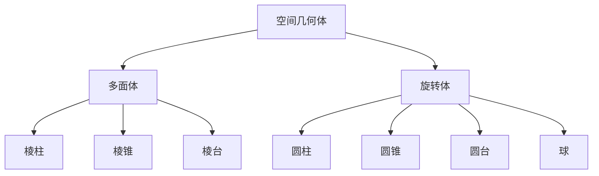
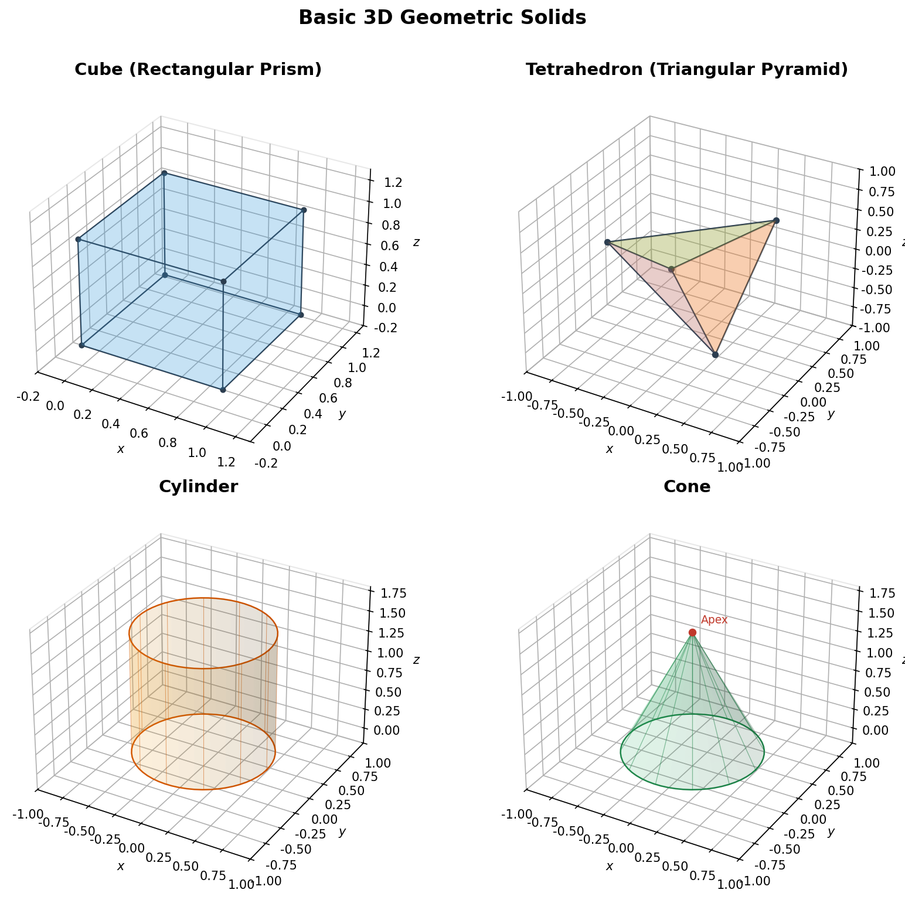

# 几何体与截面

> **所属路径**：`00_高中复习/01_数学基础/13_立体几何与空间想象/02_几何体与截面`
> **预计学习时间**：40 分钟
> **难度等级**：⭐

---

## 前置知识

- [空间点线面关系](../01_空间点线面关系/01_空间点线面关系.md)
- [直线方程](../../07_解析几何/01_直线方程/01_直线方程.md)

> 如果以上内容还不熟悉，建议先完成对应课程再继续。

---

## 学习目标

完成本节后，你将能够：

1. 识别和分类常见的空间几何体（柱体、锥体、球体）
2. 分析平面截几何体所形成的截面形状
3. 理解几何体在人工智能三维物体识别中的基础作用
4. 画出简单几何体的三视图和直观图

---

## 正文讲解

### 1. 空间几何体的分类

在上一节中，我们学习了空间中点、线、面的基本关系。现在，让我们把这些元素"组装"起来，认识各种空间几何体。

你身边的物体几乎都可以看作空间几何体的组合：水杯是圆柱体，帐篷像三棱锥，足球近似球体。在人工智能的三维视觉中，复杂物体常常被分解为这些基本几何体的组合来进行识别和建模——这就是 **基元分解（Primitive Decomposition）** 的思想。

空间几何体可以分为两大类：



> 📌 **图解说明**：空间几何体分为多面体（面全是平面多边形）和旋转体（由平面图形绕轴旋转生成）两大类。

下面这张图展示了四种最基本的空间几何体的三维渲染效果：



> 📌 **图解说明**：四种基本几何体——正方体（棱柱代表）、正四面体（棱锥代表）、圆柱和圆锥，用半透明面和线框渲染展示其空间结构。你可以运行 `code/plot_solids.py` 自行生成这张图。

### 2. 多面体：棱柱、棱锥与棱台

**棱柱（Prism）** 是由两个互相平行且全等的多边形（底面）和若干平行四边形（侧面）围成的几何体。根据底面形状，可分为三棱柱、四棱柱、五棱柱等。当侧棱垂直于底面时，称为 **直棱柱** ；侧面全是矩形的直棱柱称为 **正棱柱** 。

棱柱的关键性质：
- 两个底面平行且全等
- 侧棱互相平行且等长
- 平行于底面的截面与底面全等

**棱锥（Pyramid）** 是由一个多边形（底面）和若干三角形（侧面）围成的几何体，所有侧面共享一个顶点。正棱锥的底面是正多边形，且顶点在底面中心正上方。

**棱台（Frustum）** 是用平行于底面的平面截棱锥所得的部分，可以看作"削了顶的棱锥"。

### 3. 旋转体：圆柱、圆锥与球

想象一个矩形绕它的一条边旋转一周，扫过的空间就是 **圆柱（Cylinder）** 。类似地：

- 直角三角形绕一条直角边旋转 → **圆锥（Cone）**
- 半圆绕直径旋转 → **球（Sphere）**
- 直角梯形绕垂直于底的腰旋转 → **圆台**

旋转体的核心特征是**轴对称性**——绕旋转轴的任何角度旋转都不改变形状。这种对称性在人工智能中有着重要应用：很多三维神经网络会利用旋转不变性来提升模型的泛化能力。

### 4. 截面分析：切一刀能切出什么

**截面（Cross-Section）** 是用一个平面去截几何体所得到的交线围成的图形。截面分析是立体几何中最能锻炼空间想象力的部分。

让我们看看不同几何体能切出什么截面：

**正方体的截面**：

正方体截面的形状取决于截面与棱的交点位置，可以是三角形、四边形、五边形甚至正六边形。

一个令人惊奇的事实是：用一个平面截正方体，最多能截出**正六边形**——截面分别过正方体六条棱的中点。

**球的截面**：

无论怎么切，球的截面都是**圆**。过球心的截面是最大的圆，称为 **大圆（Great Circle）** ，其半径等于球的半径。

> 📌 在地理学中，地球上两点之间的最短路径就是大圆弧。在人工智能的球面嵌入中，大圆距离也是常用的相似度度量。

**圆柱的截面**：

| 截面方式 | 截面形状 |
| -------- | -------- |
| 平行于底面 | 圆（与底面全等） |
| 平行于轴 | 矩形 |
| 斜切 | 椭圆 |

### 5. 三视图与直观图

描述一个三维物体，通常需要三个正交方向的投影：

- **正视图**（正面投影）：从前方看到的轮廓
- **侧视图**（侧面投影）：从侧面看到的轮廓
- **俯视图**（顶面投影）：从上方看到的轮廓

三视图遵循"长对正、高平齐、宽相等"的对应规则。

在人工智能中，三视图的思想被广泛应用。例如 **多视图三维重建（Multi-View 3D Reconstruction）** 就是从多个角度的二维图像中恢复物体的三维形状。**体素（Voxel）** 表示法则是将三维空间划分成小立方体网格——就像三维的像素，每个小方块记录该位置是否被物体占据。

### 6. 从基本几何体到三维数据表示

在现代人工智能中，三维数据主要有以下表示方式，每一种都与本节的几何知识密切相关：

| 表示方式 | 描述 | 几何联系 |
| -------- | ---- | -------- |
| 点云 | 大量三维点的集合 | 几何体表面的采样点 |
| 网格 | 顶点和三角面片的集合 | 几何体表面的多面体逼近 |
| 体素 | 三维方块网格 | 类似三维像素 |
| 基元 | 基本几何体的组合 | 本节学的各种几何体 |

---

## 动手实践

让我们用 Python 可视化一些基本几何体及其截面，直观感受三维形状。

```python
# 文件：code/visualize_solids.py
# 可视化基本几何体
# 环境要求：Python 3.10+, matplotlib, numpy

import numpy as np
import matplotlib.pyplot as plt
from mpl_toolkits.mplot3d.art3d import Poly3DCollection

fig = plt.figure(figsize=(12, 4))
plt.rcParams['font.sans-serif'] = ['DejaVu Sans']
plt.rcParams['axes.unicode_minus'] = False

# 1. 正四面体
ax1 = fig.add_subplot(131, projection='3d')
vertices = np.array([[1,1,1], [1,-1,-1], [-1,1,-1], [-1,-1,1]])
faces = [[vertices[j] for j in f] for f in [[0,1,2],[0,1,3],[0,2,3],[1,2,3]]]
ax1.add_collection3d(Poly3DCollection(faces, alpha=0.3, edgecolor='blue', facecolor='cyan'))
ax1.set_title('Tetrahedron')
ax1.set_xlim([-2, 2]); ax1.set_ylim([-2, 2]); ax1.set_zlim([-2, 2])

# 2. 圆柱
ax2 = fig.add_subplot(132, projection='3d')
theta = np.linspace(0, 2*np.pi, 50)
z = np.linspace(0, 2, 50)
Theta, Z = np.meshgrid(theta, z)
X = np.cos(Theta)
Y = np.sin(Theta)
ax2.plot_surface(X, Y, Z, alpha=0.3, color='orange')
ax2.set_title('Cylinder')

# 3. 球
ax3 = fig.add_subplot(133, projection='3d')
phi = np.linspace(0, np.pi, 30)
theta = np.linspace(0, 2*np.pi, 30)
Phi, Theta = np.meshgrid(phi, theta)
X = np.sin(Phi) * np.cos(Theta)
Y = np.sin(Phi) * np.sin(Theta)
Z = np.cos(Phi)
ax3.plot_surface(X, Y, Z, alpha=0.3, color='green')
ax3.set_title('Sphere')

plt.tight_layout()
plt.savefig('assets/basic_solids.png', dpi=150, bbox_inches='tight', facecolor='white')
plt.show()
print("图像已保存到 assets/basic_solids.png")
```

**运行说明**：
- 环境要求：Python 3.10+, matplotlib, numpy
- 运行命令：`python code/visualize_solids.py`

**预期输出**：
```
图像已保存到 assets/basic_solids.png
```

运行后会看到正四面体、圆柱和球三个基本几何体的三维渲染图。通过修改代码中的参数（如圆柱的半径、球的分辨率），你可以进一步探索这些几何体的形态变化。

---

## 典型误区

| 误区 | 正确理解 |
| ---- | -------- |
| 正方体截面只能是三角形或四边形 | 截面可以是三角形到六边形的任何凸多边形 |
| 棱台是独立的一类几何体 | 棱台是用平面截棱锥得到的，是棱锥的一部分 |
| 球的任何截面都等于大圆 | 只有过球心的截面才是大圆，其他截面是较小的圆 |
| 三视图能唯一确定一个几何体 | 不同几何体可能有相同的三视图，需要三个视图结合才能尽可能确定形状 |

---

## 练习题

### 练习 1：截面形状判断（难度：⭐）

用一个平面截一个正三棱柱，截面可能是什么形状？列举所有可能的类型。

<details>
<summary>💡 提示</summary>

截面必须是凸多边形，边数取决于截面与多少个面相交。正三棱柱有 5 个面（2 个三角形底面 + 3 个矩形侧面）。

</details>

<details>
<summary>✅ 参考答案</summary>

截面可能是：三角形、四边形（包括平行四边形、梯形等）、五边形。

- 三角形：截面平行于底面，或只经过三个侧面各一条边
- 四边形：截面经过两个侧面和一个底面（或两个侧面与另一个侧面的不同部分）
- 五边形：截面经过三个侧面和两个底面各一条边

不可能出现六边形，因为正三棱柱最多只有 5 个面。

</details>

### 练习 2：旋转体生成（难度：⭐）

一个直角三角形的两条直角边长分别为 3 和 4。将该三角形绕长度为 4 的直角边所在直线旋转一周，求所得圆锥的底面半径、母线长和高。

<details>
<summary>💡 提示</summary>

旋转轴是长为 4 的直角边，另一条直角边扫过底面圆，斜边就是母线。

</details>

<details>
<summary>✅ 参考答案</summary>

- 底面半径 $r = 3$ （另一条直角边的长度）
- 高 $h = 4$ （旋转轴的长度）
- 母线长 $l = \sqrt{3^2 + 4^2} = 5$ （斜边的长度）

</details>

### 练习 3：正方体截面（难度：⭐⭐）

棱长为 $a$ 的正方体 $ABCD$-$A'B'C'D'$ 中，过顶点 $A$ 、 $C$ 和 $B'$ 作截面。求截面三角形的面积。

<details>
<summary>💡 提示</summary>

先求 $AC$ 、 $AB'$ 、 $CB'$ 的长度，然后用三角形面积公式。注意 $AC = \sqrt{2}a$ ， $AB' = \sqrt{2}a$ ， $CB' = \sqrt{2}a$ 。

</details>

<details>
<summary>✅ 参考答案</summary>

设正方体棱长为 $a$ 。

$AC = \sqrt{a^2 + a^2} = \sqrt{2}a$ （底面对角线）

$AB' = \sqrt{a^2 + a^2} = \sqrt{2}a$ （侧面对角线）

$CB' = \sqrt{a^2 + a^2} = \sqrt{2}a$ （侧面对角线）

∵ $AC = AB' = CB' = \sqrt{2}a$

∴ 截面 $\triangle ACB'$ 是等边三角形

$$S = \dfrac{\sqrt{3}}{4} \times (\sqrt{2}a)^2 = \dfrac{\sqrt{3}}{2}a^2$$

</details>

---

## 下一步学习

- 📖 下一个知识点：[空间向量直觉](../03_空间向量直觉/03_空间向量直觉.md)
- 🔗 相关知识点：[空间点线面关系](../01_空间点线面关系/01_空间点线面关系.md)
- 🔗 相关知识点：[表面积与体积](../04_表面积与体积/04_表面积与体积.md)

---

## 参考资料

1. [人教版高中数学必修第二册](https://bp.pep.com.cn/) — 空间几何体章节（人民教育出版社官方教材）
2. [GeoGebra 3D Calculator](https://www.geogebra.org/3d) — 免费三维几何可视化工具，可交互式切截面（开源工具）
3. [Wikipedia - Cross section (geometry)](https://en.wikipedia.org/wiki/Cross_section_(geometry)) — 截面几何的系统介绍（公共知识库）
