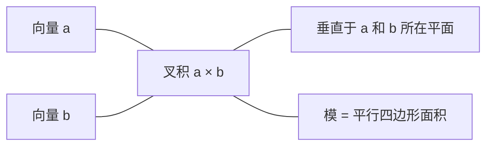
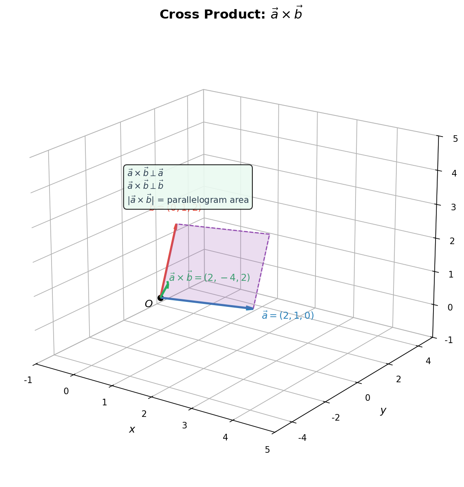

# 空间向量直觉

> **所属路径**：`00_高中复习/01_数学基础/13_立体几何与空间想象/03_空间向量直觉`
> **预计学习时间**：45 分钟
> **难度等级**：⭐⭐

---

## 前置知识

- [向量表示与运算](../../06_向量/01_向量表示与运算/01_向量表示与运算.md)
- [数量积](../../06_向量/02_数量积/02_数量积.md)
- [空间点线面关系](../01_空间点线面关系/01_空间点线面关系.md)

> 如果以上内容还不熟悉，建议先完成对应课程再继续。

---

## 学习目标

完成本节后，你将能够：

1. 用空间直角坐标系表示三维空间中的点和向量
2. 计算三维向量的点积和叉积，理解它们的几何含义
3. 用法向量判断平面间的位置关系和夹角
4. 建立从三维空间向量到高维特征空间的直觉桥梁

---

## 正文讲解

### 1. 从平面向量到空间向量

在 **[向量](../../06_向量/)** 的学习中，我们已经掌握了二维向量的加减法和数量积。现在，让我们把这些概念自然地推广到三维空间。

回想一下，二维向量 $\vec{a} = (a_1, a_2)$ 可以表示平面上的一个方向和大小。三维空间只需多加一个坐标轴：建立空间直角坐标系 $O$-$xyz$ ，三维向量就表示为：

$$
\vec{a} = (a_1, a_2, a_3) = a_1\vec{i} + a_2\vec{j} + a_3\vec{k}
$$

其中 $\vec{i}$ 、 $\vec{j}$ 、 $\vec{k}$ 分别是 $x$ 、 $y$ 、 $z$ 轴方向的单位向量。

这一步看似简单，却意义重大。人工智能中的 **嵌入向量（Embedding Vector）** 往往有数百甚至数千维——从三维出发建立的向量直觉，将成为你理解高维空间的基石。

### 2. 空间向量的基本运算

三维向量的加法、减法和数乘运算，与二维完全一致——逐坐标运算：

$$
\vec{a} + \vec{b} = (a_1 + b_1, \; a_2 + b_2, \; a_3 + b_3)
$$

$$
k\vec{a} = (ka_1, \; ka_2, \; ka_3)
$$

向量的 **模（Magnitude）** 推广为：

$$
|\vec{a}| = \sqrt{a_1^2 + a_2^2 + a_3^2}
$$

> **直觉解读**：这就是三维空间中的距离公式——从原点到点 $(a_1, a_2, a_3)$ 的距离。它是勾股定理在三维空间中的自然推广。

### 3. 点积：测量方向的一致性

三维空间中两个向量的 **点积（Dot Product）** 定义为：

$$
\vec{a} \cdot \vec{b} = a_1b_1 + a_2b_2 + a_3b_3 = |\vec{a}||\vec{b}|\cos\theta
$$

其中 $\theta$ 是两个向量之间的夹角。

点积的几何含义：
- $\vec{a} \cdot \vec{b} > 0$ ：两向量方向大致相同（夹角 $< 90°$ ）
- $\vec{a} \cdot \vec{b} = 0$ ：两向量**垂直**（夹角 $= 90°$ ）
- $\vec{a} \cdot \vec{b} < 0$ ：两向量方向大致相反（夹角 $> 90°$ ）

> 📌 在人工智能中，点积（以及由它衍生的 **余弦相似度（Cosine Similarity）** ）是最常用的相似度度量。搜索引擎、推荐系统都用它来衡量两个向量的"相似程度"。余弦相似度的公式就是 $\cos\theta = \dfrac{\vec{a} \cdot \vec{b}}{|\vec{a}||\vec{b}|}$ 。

### 4. 叉积：找到垂直方向

> ⚠️ **超纲提示**：叉积（向量积）不属于中国高中课程标准的必修或选修内容，而是大学线性代数和多变量微积分中的概念。我们之所以在这里介绍它，是因为叉积在人工智能和计算机图形学中应用极广（如计算法向量、判断面朝向），提前了解它的直觉含义对后续学习非常有帮助。如果你觉得这部分内容较难，可以先跳过，等学完大学线性代数后再回来。

三维空间中有一种二维没有的运算—— **叉积（Cross Product）** ，也叫向量积：

$$
\vec{a} \times \vec{b} = \begin{vmatrix} \vec{i} & \vec{j} & \vec{k} \\ a_1 & a_2 & a_3 \\ b_1 & b_2 & b_3 \end{vmatrix} = (a_2b_3 - a_3b_2, \; a_3b_1 - a_1b_3, \; a_1b_2 - a_2b_1)
$$

叉积的关键性质：
- $\vec{a} \times \vec{b}$ 的方向**垂直于** $\vec{a}$ 和 $\vec{b}$ 所在的平面
- $|\vec{a} \times \vec{b}| = |\vec{a}||\vec{b}|\sin\theta$ ，等于以 $\vec{a}$ 和 $\vec{b}$ 为边的平行四边形面积
- 方向由右手定则确定



> 📌 **图解说明**：叉积生成一个新的向量，它垂直于原来两个向量构成的平面，模长等于平行四边形的面积。

下面这张三维图展示了两个向量 $\vec{a}$ 、 $\vec{b}$ 及其叉积 $\vec{a} \times \vec{b}$ 的空间关系：



> 📌 **图解说明**：蓝色向量 $\vec{a} = (2,1,0)$ 和红色向量 $\vec{b} = (0,1,2)$ 从原点出发，绿色向量 $\vec{a} \times \vec{b} = (2,-4,2)$ 垂直于二者构成的紫色平行四边形。你可以运行 `code/plot_3d_vectors.py` 自行生成这张图。

叉积在计算机图形学中无处不在：计算三角形面片的法向量、判断点是否在三角形内部、计算光照方向——都离不开叉积。

### 5. 法向量：平面的"身份证"

> ⚠️ **超纲提示**：法向量属于中国高中数学选修内容（人教版选择性必修第一册"空间向量与立体几何"），部分同学可能未在高中阶段系统学习。这里我们给出其基本概念，帮助你为后续的线性代数和计算机图形学打好基础。

一个平面可以用一个垂直于它的向量来唯一描述（方向上），这个向量叫做 **法向量（Normal Vector）** 。

如果平面内有两个不共线的向量 $\vec{u}$ 和 $\vec{v}$ ，那么法向量就是：

$$
\vec{n} = \vec{u} \times \vec{v}
$$

有了法向量，空间中的许多问题变得简洁：

**两平面的夹角**：设两个平面的法向量分别为 $\vec{n_1}$ 和 $\vec{n_2}$ ，则两平面的夹角 $\theta$ 满足：

$$
\cos\theta = \frac{|\vec{n_1} \cdot \vec{n_2}|}{|\vec{n_1}||\vec{n_2}|}
$$

> **直觉解读**：两平面的夹角等于它们法向量的夹角（或补角中的较小值），取绝对值确保得到锐角。

**点到平面的距离**：点 $P$ 到平面 $\alpha$ （过点 $Q$ ，法向量 $\vec{n}$ ）的距离为：

$$
d = \frac{|\overrightarrow{QP} \cdot \vec{n}|}{|\vec{n}|}
$$

### 6. 用向量方法解立体几何题

空间向量的强大之处在于，它可以把几何问题转化为代数计算。解题的基本步骤：

1. **建系**：选择合适的原点和坐标轴，建立空间直角坐标系
2. **设坐标**：用坐标表示所有关键点
3. **求向量**：计算需要的方向向量和法向量
4. **用公式**：利用点积、叉积公式求角度和距离

> 📌 这个"建系→坐标化→代数运算"的思路，在更高维度中同样有效。机器学习中的特征空间本质上就是一个高维坐标系，每个样本就是高维空间中的一个点。

---

## 动手实践

让我们用 Python 实现空间向量的基本运算，包括点积、叉积和法向量计算。

```python
# 文件：code/space_vectors.py
# 空间向量的基本运算
# 环境要求：Python 3.10+, numpy

import numpy as np

# 定义两个三维向量
a = np.array([1, 2, 3])
b = np.array([4, 5, 6])

# 点积
dot_product = np.dot(a, b)
print(f"点积: a · b = {dot_product}")

# 叉积
cross_product = np.cross(a, b)
print(f"叉积: a × b = {cross_product}")

# 验证叉积垂直于 a 和 b
print(f"验证垂直性: (a×b)·a = {np.dot(cross_product, a)}, (a×b)·b = {np.dot(cross_product, b)}")

# 两向量夹角（度）
cos_theta = np.dot(a, b) / (np.linalg.norm(a) * np.linalg.norm(b))
angle = np.degrees(np.arccos(np.clip(cos_theta, -1, 1)))
print(f"夹角: {angle:.2f} 度")

# 余弦相似度
cosine_sim = cos_theta
print(f"余弦相似度: {cosine_sim:.4f}")

# 用叉积计算平面法向量
# 平面上三点 P, Q, R
P = np.array([1, 0, 0])
Q = np.array([0, 1, 0])
R = np.array([0, 0, 1])
# 平面内两向量
PQ = Q - P
PR = R - P
# 法向量
normal = np.cross(PQ, PR)
print(f"\n平面 PQR 的法向量: {normal}")

# 点到平面的距离
# 点 S 到过 P 且法向量为 normal 的平面的距离
S = np.array([0, 0, 0])
PS = S - P
distance = abs(np.dot(PS, normal)) / np.linalg.norm(normal)
print(f"原点到平面 PQR 的距离: {distance:.4f}")
```

**运行说明**：
- 环境要求：Python 3.10+, numpy
- 运行命令：`python code/space_vectors.py`

**预期输出**：
```
点积: a · b = 32
叉积: a × b = [-3  6 -3]
验证垂直性: (a×b)·a = 0, (a×b)·b = 0
夹角: 12.93 度
余弦相似度: 0.9746
平面 PQR 的法向量: [1 1 1]
原点到平面 PQR 的距离: 0.5774
```

注意观察验证垂直性的那一行：叉积结果与原来的两个向量点积都为 0，这就证明了叉积确实垂直于原来两个向量。平面 $PQR$ 过点 $(1,0,0)$ 、 $(0,1,0)$ 、 $(0,0,1)$ ，法向量为 $(1,1,1)$ ，原点到该平面的距离约为 $0.577 = \dfrac{1}{\sqrt{3}}$ 。

---

## 典型误区

| 误区 | 正确理解 |
| ---- | -------- |
| 叉积和点积一样满足交换律 | 叉积是反交换的： $\vec{a} \times \vec{b} = -\vec{b} \times \vec{a}$ |
| 叉积结果是一个数 | 叉积的结果是一个**向量**，点积的结果才是一个数 |
| 法向量是唯一的 | 法向量的方向有两个（正反），长度也可以任意缩放；唯一的是法线方向 |
| 向量方法只能在三维中使用 | 向量的加减法、点积、模可以推广到任意维度；叉积是三维（和七维）特有的 |

---

## 练习题

### 练习 1：基础运算（难度：⭐）

已知 $\vec{a} = (2, -1, 3)$ ， $\vec{b} = (1, 4, -2)$ ，求：
(a) $\vec{a} \cdot \vec{b}$
(b) $\vec{a} \times \vec{b}$
(c) $\vec{a}$ 与 $\vec{b}$ 的夹角

<details>
<summary>💡 提示</summary>

点积逐坐标相乘再求和；叉积用行列式展开或分量公式；夹角用 $\cos\theta = \dfrac{\vec{a} \cdot \vec{b}}{|\vec{a}||\vec{b}|}$ 。

</details>

<details>
<summary>✅ 参考答案</summary>

(a) $\vec{a} \cdot \vec{b} = 2 \times 1 + (-1) \times 4 + 3 \times (-2) = 2 - 4 - 6 = -8$

(b) $\vec{a} \times \vec{b} = ((-1)(-2) - 3 \times 4, \; 3 \times 1 - 2 \times (-2), \; 2 \times 4 - (-1) \times 1) = (-10, \; 7, \; 9)$

(c) $|\vec{a}| = \sqrt{4+1+9} = \sqrt{14}$ ， $|\vec{b}| = \sqrt{1+16+4} = \sqrt{21}$

$$\cos\theta = \dfrac{-8}{\sqrt{14}\sqrt{21}} = \dfrac{-8}{\sqrt{294}} \approx -0.4666$$$$\theta \approx 117.8°$$

</details>

### 练习 2：法向量与平面夹角（难度：⭐⭐）

平面 $\alpha$ 过点 $A(1, 0, 0)$ 、 $B(0, 2, 0)$ 、 $C(0, 0, 3)$ ；平面 $\beta$ 为 $xOy$ 平面。求两平面的夹角。

<details>
<summary>💡 提示</summary>

$\alpha$ 的法向量用 $\overrightarrow{AB} \times \overrightarrow{AC}$ 求得； $xOy$ 平面的法向量为 $(0, 0, 1)$ 。

</details>

<details>
<summary>✅ 参考答案</summary>

$\overrightarrow{AB} = (-1, 2, 0)$ ， $\overrightarrow{AC} = (-1, 0, 3)$

$$\vec{n_1} = \overrightarrow{AB} \times \overrightarrow{AC} = (2 \times 3 - 0 \times 0, \; 0 \times (-1) - (-1) \times 3, \; (-1) \times 0 - 2 \times (-1)) = (6, 3, 2)$$$\vec{n_2} = (0, 0, 1)$ （ $xOy$ 平面的法向量）$$\cos\theta = \dfrac{|(6)(0) + (3)(0) + (2)(1)|}{\sqrt{36+9+4} \times 1} = \dfrac{2}{7}$$$$\theta = \arccos\dfrac{2}{7} \approx 73.4°$$

</details>

### 练习 3：余弦相似度（难度：⭐⭐）

在自然语言处理中，两个词的嵌入向量分别为 $\vec{u} = (0.5, 0.8, -0.2, 0.1)$ 和 $\vec{v} = (0.4, 0.9, -0.1, 0.3)$ 。计算它们的余弦相似度，并解释结果的含义。

<details>
<summary>💡 提示</summary>

余弦相似度 $= \dfrac{\vec{u} \cdot \vec{v}}{|\vec{u}||\vec{v}|}$ ，虽然这里是四维向量，但计算方法与三维完全一致。

</details>

<details>
<summary>✅ 参考答案</summary>

$\vec{u} \cdot \vec{v} = 0.2 + 0.72 + 0.02 + 0.03 = 0.97$

$|\vec{u}| = \sqrt{0.25 + 0.64 + 0.04 + 0.01} = \sqrt{0.94} \approx 0.9695$

$|\vec{v}| = \sqrt{0.16 + 0.81 + 0.01 + 0.09} = \sqrt{1.07} \approx 1.0344$

$$\text{cosine similarity} = \dfrac{0.97}{0.9695 \times 1.0344} \approx 0.967$$

余弦相似度接近 1，说明这两个词在语义上非常相似。这正是三维向量点积概念推广到高维后的实际应用。

</details>

---

## 下一步学习

- 📖 下一个知识点：[表面积与体积](../04_表面积与体积/04_表面积与体积.md)
- 🔗 相关知识点：[数量积](../../06_向量/02_数量积/)
- 📚 拓展阅读：[线性代数](../../../01_基础能力/02_数学基础/01_线性代数/)

---

## 参考资料

1. [3Blue1Brown - Cross products](https://www.youtube.com/watch?v=eu6i7WJeinw) — 叉积的直觉可视化讲解（公开视频，CC BY 许可）
2. [Khan Academy - Vectors in 3D](https://www.khanacademy.org/math/multivariable-calculus/thinking-about-multivariable-function/x786f2022:vectors-and-matrices/a/vectors) — 三维向量的交互式教程（免费公开课程）
3. [Wikipedia - Cross product](https://en.wikipedia.org/wiki/Cross_product) — 叉积的数学定义与性质（公共知识库）
