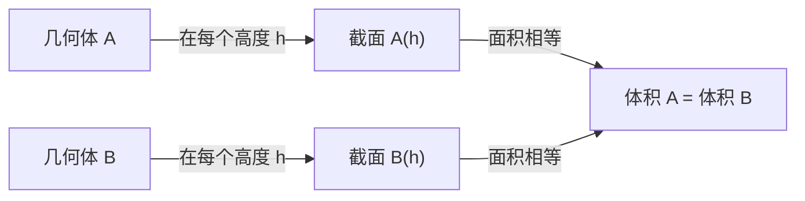

# 表面积与体积

> **所属路径**：`00_高中复习/01_数学基础/13_立体几何与空间想象/04_表面积与体积`
> **预计学习时间**：35 分钟
> **难度等级**：⭐

---

## 前置知识

- [几何体与截面](../02_几何体与截面/02_几何体与截面.md)
- [空间向量直觉](../03_空间向量直觉/03_空间向量直觉.md)

> 如果以上内容还不熟悉，建议先完成对应课程再继续。

---

## 学习目标

完成本节后，你将能够：

1. 计算棱柱、棱锥、圆柱、圆锥和球的表面积与体积
2. 理解并运用祖暅原理（Cavalieri 原理）
3. 将表面积和体积公式应用于组合几何体
4. 认识三维度量在人工智能体素表示和三维卷积中的意义

---

## 正文讲解

### 1. 为什么要计算表面积和体积

在前两节中，我们认识了各种空间几何体，学习了用向量描述空间关系。现在，我们来解决一个最实际的问题：这些几何体有多大？

"多大"有两个含义——包裹了多少表面（表面积），以及占据了多少空间（体积）。在人工智能中，三维物体的度量计算同样重要。 **体素（Voxel）** 表示法将三维空间分成小立方体网格，每个体素的体积决定了空间分辨率。 **三维卷积（3D Convolution）** 在医学影像（如 CT 扫描）分析中沿三个维度滑动计算，其中卷积核的大小直接对应空间中的"体积"。

### 2. 棱柱和圆柱的表面积与体积

**棱柱** 的表面积由两个底面和若干侧面组成：

$$
S_{\text{表}} = 2S_{\text{底}} + S_{\text{侧}}
$$

体积公式简单直观——底面积乘以高：

$$
V = S_{\text{底}} \times h
$$

> **直觉解读**：可以把棱柱想象成一层层底面图形堆叠起来。每一层的面积都相同，堆了 $h$ 层（连续地），所以体积就是底面积乘以高度。

**圆柱** 的公式与棱柱类似，只是底面变成了圆：

$$
S_{\text{侧}} = 2\pi r h, \quad S_{\text{表}} = 2\pi r h + 2\pi r^2
$$

$$
V = \pi r^2 h
$$

圆柱侧面展开后是一个矩形，宽为底面周长 $2\pi r$ ，高为 $h$ 。

### 3. 棱锥和圆锥的表面积与体积

**棱锥** 的体积是同底等高棱柱的三分之一：

$$
V = \frac{1}{3} S_{\text{底}} \times h
$$

> **直觉解读**：为什么是三分之一？可以把一个正方体切割成三个等体积的四棱锥来理解。每个四棱锥以正方体的一个面为底面，以对角的顶点为锥顶。

**圆锥** 的底面为圆，母线长为 $l$ （从顶点到底面圆周的距离）：

$$
S_{\text{侧}} = \pi r l, \quad S_{\text{表}} = \pi r l + \pi r^2
$$

$$
V = \frac{1}{3} \pi r^2 h
$$

圆锥侧面展开后是一个扇形，半径为母线长 $l$ ，弧长为底面周长 $2\pi r$ 。

### 4. 球的表面积与体积

球是最完美的对称体——从任何方向看都一样。半径为 $r$ 的球：

$$
S = 4\pi r^2
$$

$$
V = \frac{4}{3}\pi r^3
$$

> **直觉解读**：球的表面积恰好等于四个大圆的面积。球的体积公式可以这样记忆：如果把球切成无数薄片，每片的面积约为 $\pi r'^2$ （其中 $r'$ 是该高度处的截面半径），把所有薄片的体积加起来（积分），就得到 $\dfrac{4}{3}\pi r^3$ 。

### 5. 祖暅原理（Cavalieri 原理）

**祖暅原理（Cavalieri's Principle）** 是计算体积的一个强大工具：

> 如果两个几何体在同一高度处的截面面积总是相等，那么这两个几何体的体积相等。



> 📌 **图解说明**：祖暅原理的核心是"逐层比较"。只要每一层的截面积相同，不管形状如何变化，总体积就相同。

这个原理由中国南北朝数学家祖暅（也写作"祖暅之"）发现，比意大利数学家 Cavalieri 早约一千年。它与微积分中"积分"的思想一脉相承——把体积看作截面面积沿高度的累积。

**经典应用**：用祖暅原理推导球的体积。

将半球与一个"圆柱挖去圆锥"的组合体比较：在距底面高度 $h$ 处，半球的截面是半径为 $\sqrt{r^2 - h^2}$ 的圆，面积为 $\pi(r^2 - h^2)$ ；圆柱（半径 $r$ ，高 $r$ ）挖去圆锥（底面半径 $r$ ，高 $r$ ）后在高度 $h$ 处的截面面积也是 $\pi(r^2 - h^2)$ 。根据祖暅原理：

$$
V_{\text{半球}} = V_{\text{圆柱}} - V_{\text{圆锥}} = \pi r^2 \cdot r - \frac{1}{3}\pi r^2 \cdot r = \frac{2}{3}\pi r^3
$$

因此全球体积 $V = \dfrac{4}{3}\pi r^3$ 。

### 6. 公式汇总

| 几何体 | 表面积 | 体积 |
| ------ | ------ | ---- |
| 棱柱 | $2S_{\text{底}} + S_{\text{侧}}$ | $S_{\text{底}} h$ |
| 圆柱 | $2\pi r h + 2\pi r^2$ | $\pi r^2 h$ |
| 棱锥 | $S_{\text{底}} + S_{\text{侧}}$ | $\dfrac{1}{3} S_{\text{底}} h$ |
| 圆锥 | $\pi r l + \pi r^2$ | $\dfrac{1}{3} \pi r^2 h$ |
| 球 | $4\pi r^2$ | $\dfrac{4}{3}\pi r^3$ |

下面这张图以三维视角直观呈现了四种常见几何体的形状，并标注了各自的表面积与体积公式：


> 📌 **图解说明**：左上为圆柱（侧面展开为矩形），右上为圆锥（侧面展开为扇形），左下为球（最对称的几何体），右下为截锥/圆台（圆锥截去顶部）。每个几何体旁标注了半径 $r$ 、高 $h$ 等关键尺寸。你可以运行 `code/plot_surface_volume.py` 自行生成这张图。

---

## 动手实践

让我们用 Python 来计算和比较各种几何体的表面积与体积。

```python
# 文件：code/surface_volume.py
# 几何体的表面积与体积计算
# 环境要求：Python 3.10+

import math

def cylinder(r, h):
    """圆柱的表面积和体积"""
    surface = 2 * math.pi * r * h + 2 * math.pi * r**2
    volume = math.pi * r**2 * h
    return surface, volume

def cone(r, h):
    """圆锥的表面积和体积"""
    l = math.sqrt(r**2 + h**2)  # 母线长
    surface = math.pi * r * l + math.pi * r**2
    volume = (1/3) * math.pi * r**2 * h
    return surface, volume

def sphere(r):
    """球的表面积和体积"""
    surface = 4 * math.pi * r**2
    volume = (4/3) * math.pi * r**3
    return surface, volume

# 计算半径/底面半径为 1，高为 2 的各几何体
print("=== 几何体度量比较 (r=1, h=2) ===")
s, v = cylinder(1, 2)
print(f"圆柱: 表面积={s:.4f}, 体积={v:.4f}")

s, v = cone(1, 2)
print(f"圆锥: 表面积={s:.4f}, 体积={v:.4f}")

s, v = sphere(1)
print(f"球:   表面积={s:.4f}, 体积={v:.4f}")

# 验证：圆锥体积 = 同底等高圆柱的 1/3
_, v_cyl = cylinder(1, 2)
_, v_cone = cone(1, 2)
print(f"\n验证: 圆锥体积/圆柱体积 = {v_cone/v_cyl:.4f} (应为 0.3333)")

# 体素分辨率的影响
print("\n=== 体素化示例 ===")
for voxel_size in [1.0, 0.5, 0.1]:
    num_voxels = int((2 / voxel_size) ** 3)  # 2x2x2 空间
    print(f"体素大小={voxel_size}: 每个体素体积={voxel_size**3:.4f}, "
          f"2x2x2空间共 {num_voxels} 个体素")
```

**运行说明**：
- 环境要求：Python 3.10+
- 运行命令：`python code/surface_volume.py`

**预期输出**：
```
=== 几何体度量比较 (r=1, h=2) ===
圆柱: 表面积=18.8496, 体积=6.2832
圆锥: 表面积=10.1664, 体积=2.0944
球:   表面积=12.5664, 体积=4.1888

验证: 圆锥体积/圆柱体积 = 0.3333 (应为 0.3333)

=== 体素化示例 ===
体素大小=1.0: 每个体素体积=1.0000, 2x2x2空间共 8 个体素
体素大小=0.5: 每个体素体积=0.1250, 2x2x2空间共 64 个体素
体素大小=0.1: 每个体素体积=0.0010, 2x2x2空间共 8000 个体素
```

代码验证了圆锥体积确实是同底等高圆柱的三分之一。体素化示例展示了分辨率与体素数量的关系：当体素边长减半时，总数量变为 8 倍（ $2^3$ 倍），这也是三维卷积计算量远大于二维的原因。

---

## 典型误区

| 误区 | 正确理解 |
| ---- | -------- |
| 圆锥的侧面积用底面半径 $r$ 和高 $h$ 计算 | 侧面积 $= \pi r l$ ，用的是母线长 $l = \sqrt{r^2 + h^2}$ ，不是高 |
| 棱锥体积是棱柱的 $\dfrac{1}{2}$ | 棱锥体积是同底等高棱柱的 $\dfrac{1}{3}$ ，不是 $\dfrac{1}{2}$ |
| 表面积增大一倍，体积也增大一倍 | 如果线性尺寸扩大 $k$ 倍，表面积扩大 $k^2$ 倍，体积扩大 $k^3$ 倍 |
| 祖暅原理要求两个几何体形状相似 | 祖暅原理只要求对应高度的截面面积相等，形状可以完全不同 |

---

## 练习题

### 练习 1：基本计算（难度：⭐）

一个圆柱形水杯，底面半径 $r = 4$ cm，高 $h = 10$ cm。
(a) 求水杯的容积（单位：cm³）。
(b) 如果将水杯侧面展开，得到的矩形面积是多少？

<details>
<summary>💡 提示</summary>

容积就是圆柱体积，侧面展开是矩形，宽 = 底面周长，高 = 圆柱高。

</details>

<details>
<summary>✅ 参考答案</summary>

(a) $V = \pi r^2 h = \pi \times 16 \times 10 = 160\pi \approx 502.65$ cm³

(b) 侧面展开矩形面积 $= 2\pi r \times h = 2\pi \times 4 \times 10 = 80\pi \approx 251.33$ cm²

</details>

### 练习 2：组合几何体（难度：⭐⭐）

一个冰淇淋由一个半球和一个圆锥组成，半球半径 $r = 3$ cm，圆锥高 $h = 8$ cm（底面半径也为 3 cm）。求整个冰淇淋的体积。

<details>
<summary>💡 提示</summary>

分别计算半球和圆锥的体积，然后相加。

</details>

<details>
<summary>✅ 参考答案</summary>

半球体积：

$$V_{\text{半球}} = \dfrac{1}{2} \times \dfrac{4}{3}\pi r^3 = \dfrac{2}{3}\pi \times 27 = 18\pi$$

圆锥体积：

$$V_{\text{圆锥}} = \dfrac{1}{3}\pi r^2 h = \dfrac{1}{3}\pi \times 9 \times 8 = 24\pi$$

总体积：

$$V = 18\pi + 24\pi = 42\pi \approx 131.95 \text{ cm}^3$$

</details>

### 练习 3：缩放与维度（难度：⭐⭐）

一个球的半径增大为原来的 2 倍。
(a) 表面积变为原来的多少倍？
(b) 体积变为原来的多少倍？
(c) 如果将这个规律推广到 $n$ 维空间中的超球，"体积"（ $n$ 维体积）变为原来的多少倍？

> ⚠️ **超纲提示**：第 (c) 小题涉及"n 维超球"的概念，这属于高等数学/多元微积分的内容，远超高中课标范围。这里作为思维拓展，目的是让你体会"维度增长"带来的指数效应——这一直觉在后续学习人工智能中的"维度灾难"时非常重要。你可以只做 (a)(b) 两题，(c) 题选做即可。

<details>
<summary>💡 提示</summary>

$n$ 维超球的"体积"正比于 $r^n$ 。

</details>

<details>
<summary>✅ 参考答案</summary>

(a) 表面积 $S = 4\pi r^2$ ，半径变为 $2r$ 后 $S' = 4\pi(2r)^2 = 16\pi r^2 = 4S$ ，变为原来的 **4 倍** 。

(b) 体积 $V = \dfrac{4}{3}\pi r^3$ ，半径变为 $2r$ 后 $V' = \dfrac{4}{3}\pi(2r)^3 = \dfrac{32}{3}\pi r^3 = 8V$ ，变为原来的 **8 倍** 。

(c) $n$ 维超球的"体积"正比于 $r^n$ ，所以半径扩大 2 倍后，体积变为 $2^n$ 倍。这个规律就是"维度灾难"的根源——随着维度增大，空间增长得极其迅速。

</details>

---

## 下一步学习

- 📖 下一阶段：[线性代数](../../../01_基础能力/02_数学基础/01_线性代数/)
- 🔗 相关知识点：[几何体与截面](../02_几何体与截面/02_几何体与截面.md)
- 🔗 相关知识点：[积分与面积](../../../01_基础能力/02_数学基础/02_微积分/03_积分与面积/)

---

## 参考资料

1. [人教版高中数学必修第二册](https://bp.pep.com.cn/) — 空间几何体的表面积与体积章节（人民教育出版社官方教材）
2. [Khan Academy - Solid geometry](https://www.khanacademy.org/math/geometry/hs-geo-solids) — 立体几何的表面积和体积教程（免费公开课程）
3. [Wikipedia - Cavalieri's principle](https://en.wikipedia.org/wiki/Cavalieri%27s_principle) — 祖暅原理（Cavalieri 原理）的数学背景（公共知识库）
