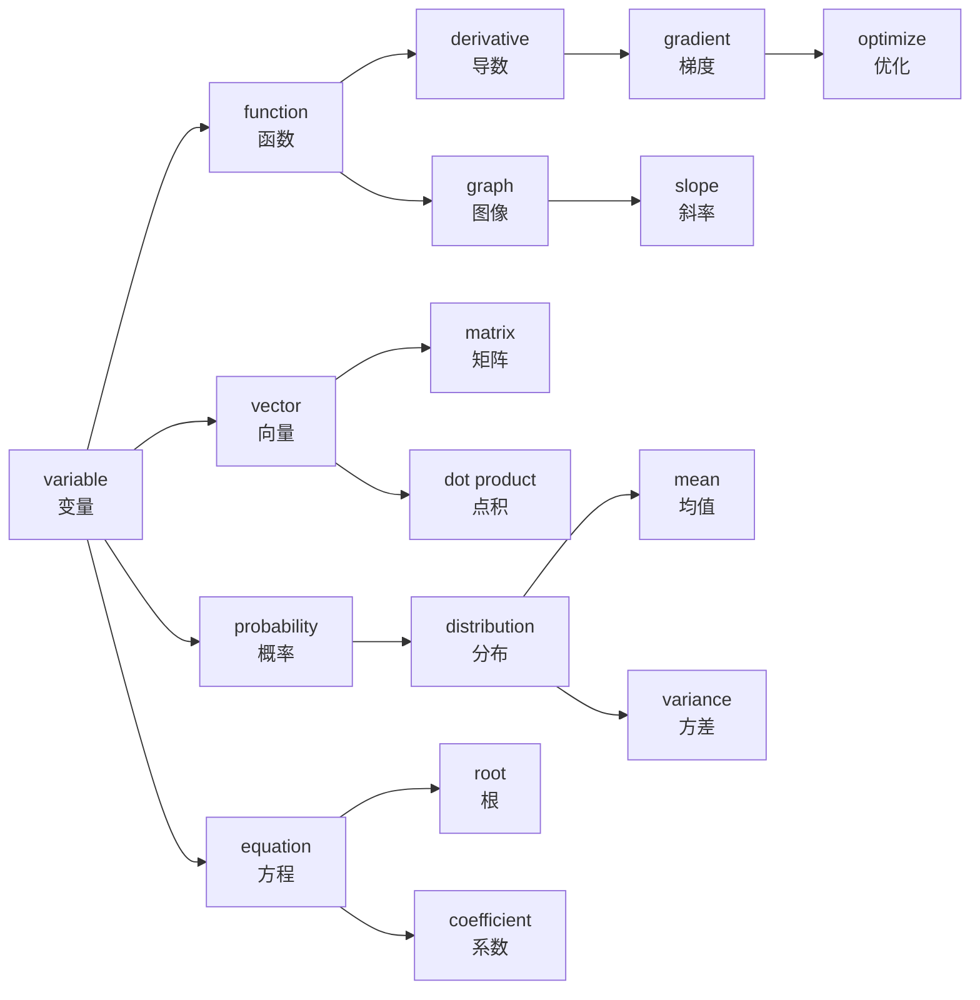

# 数学英文词汇

> **所属路径**：`00_高中复习/02_英语基础/01_技术词汇/01_数学英文词汇`
> **预计学习时间**：50 分钟
> **难度等级**：⭐

---

## 前置知识

- [代数与方程](../../../01_数学基础/01_代数与方程/)
- [函数与图像](../../../01_数学基础/02_函数与图像/)
- [向量](../../../01_数学基础/06_向量/)
- [概率基础](../../../01_数学基础/09_概率基础/)
- [导数初步](../../../01_数学基础/12_导数初步/)

> 如果以上数学概念的中文含义还不熟悉，建议先完成对应课程再继续。本节的目标不是重新学数学，而是学会用英文"叫出"这些你已经认识的概念。

---

## 学习目标

完成本节后，你将能够：

1. 识别并说出 50 个以上高中数学核心概念的英文名称及其常用搭配
2. 运用词根词缀规律推测陌生数学术语的含义
3. 阅读包含这些术语的英文数学段落并正确理解其意思
4. 使用间隔重复策略制定个人词汇复习计划

---

## 正文讲解

### 1. 为什么要学数学英文词汇？

想象一下，你打开一篇介绍机器学习的英文文章，第一句话就是：

> *"A linear function maps an input variable to an output through a coefficient and a constant."*

如果你不认识 variable（变量）、coefficient（系数）、constant（常数）这些词，这句话就像一堵墙挡在你面前。但如果你知道这些词的意思，你会发现这句话不过是在说："一个线性函数通过系数和常数，把输入变量映射到输出"——这不就是你在高中学过的 $y = ax + b$ 吗？

数学是人工智能的语言，而英语是这门语言的"国际通用字母表"。但仅仅认识孤立的单词还不够——你还需要掌握它们的**常用搭配**（语块）。比如，光知道 solve 是"求解"、equation 是"方程"不够，你需要把 "solve the equation"（求解方程）作为一个整体来记忆，这样在阅读中才能快速反应。

接下来，我们按照高中数学的知识模块，逐组学习核心词汇和它们的搭配语块。

### 2. 代数与方程类词汇

这一组词汇是你在 **[代数与方程](../../../01_数学基础/01_代数与方程/)** 中学过的概念的英文对照。它们是最基础的数学术语，几乎在每一篇技术文档中都会出现。

| 英文 | 音标 | 中文 | 常用语块 | 例句 |
| ---- | ---- | ---- | -------- | ---- |
| variable | /ˈveriəbl/ | 变量 | define a variable, random variable | Let $x$ be a variable. |
| constant | /ˈkɒnstənt/ | 常数 | a constant value, constant term | The constant $c$ equals 5. |
| coefficient | /ˌkoʊɪˈfɪʃənt/ | 系数 | the coefficient of $x$ | The coefficient of $x$ is 3. |
| equation | /ɪˈkweɪʒən/ | 方程 | solve the equation, linear equation | Solve the equation $2x + 1 = 0$ . |
| expression | /ɪkˈspreʃən/ | 表达式 | simplify the expression | Simplify the expression $3x + 2y$ . |
| inequality | /ˌɪnɪˈkwɒləti/ | 不等式 | satisfy the inequality | The inequality $x > 0$ holds. |
| absolute value | /ˈæbsəluːt ˈvæljuː/ | 绝对值 | the absolute value of | The absolute value of $-3$ is $3$ . |
| polynomial | /ˌpɒlɪˈnoʊmiəl/ | 多项式 | polynomial of degree $n$ | A polynomial of degree 2. |
| exponent | /ɪkˈspoʊnənt/ | 指数 | raise to the exponent | The exponent is 3 in $x^3$ . |
| logarithm | /ˈlɒɡərɪðəm/ | 对数 | take the logarithm of | Take the logarithm of both sides. |
| root | /ruːt/ | 根 | find the roots, square root | Find the roots of $x^2 - 1 = 0$ . |
| factor | /ˈfæktər/ | 因子；因式分解 | factor the expression | Factor the polynomial completely. |
| formula | /ˈfɔːrmjələ/ | 公式 | apply the formula, quadratic formula | Apply the quadratic formula. |

> 💡 **记忆技巧**：variable 来自 vary（变化），"会变化的量"就是变量；constant 来自 const（不变），"不变的量"就是常数。编程中你会频繁见到 `var` 和 `const` 这两个缩写，它们正是来源于此。

### 3. 函数与图像类词汇

学习 **[函数与图像](../../../01_数学基础/02_函数与图像/)** 时你已经掌握了这些概念的中文表述。在英文技术文档中，它们出现的频率极高。

| 英文 | 音标 | 中文 | 常用语块 | 例句 |
| ---- | ---- | ---- | -------- | ---- |
| function | /ˈfʌŋkʃən/ | 函数 | define a function, loss function | Define a function $f(x) = x^2$ . |
| domain | /doʊˈmeɪn/ | 定义域 | the domain of $f$ | The domain of $f$ is all real numbers. |
| range | /reɪndʒ/ | 值域 | the range of $f$ | The range of $f(x) = x^2$ is $[0, +\infty)$ . |
| graph | /ɡræf/ | 图像 | plot the graph of | Plot the graph of $y = \sin x$ . |
| slope | /sloʊp/ | 斜率 | the slope of the line | The slope of the line is 2. |
| intercept | /ˈɪntərsept/ | 截距 | y-intercept, x-intercept | The y-intercept is 3. |
| monotonic | /ˌmɒnəˈtɒnɪk/ | 单调的 | monotonic increasing/decreasing | $f(x) = e^x$ is monotonic increasing. |
| inverse | /ɪnˈvɜːrs/ | 反函数；逆 | inverse function, inverse matrix | The inverse function of $f$ . |
| parameter | /pəˈræmɪtər/ | 参数 | model parameter, pass a parameter | The parameter $a$ controls the shape. |
| mapping | /ˈmæpɪŋ/ | 映射 | a mapping from $X$ to $Y$ | A mapping from inputs to outputs. |

> 💡 **记忆技巧**：domain 在日常英语中有"领地、领域"的意思——函数的"领地"就是它接受哪些输入值；range 有"范围"的意思——函数输出的"范围"就是值域。

> 💡 **易混词辨析**：parameter vs. argument——parameter（参数）是定义函数时的占位符，argument（实参）是调用函数时传入的具体值。在数学中 parameter 通常指"控制函数形状的量"，如 $y = ax + b$ 中的 $a$ 和 $b$ 。

### 4. 向量与矩阵类词汇

**[向量](../../../01_数学基础/06_向量/)** 是从高中数学通往人工智能的关键桥梁。进入 AI 领域后，你每天都会和向量、矩阵打交道。

| 英文 | 音标 | 中文 | 常用语块 | 例句 |
| ---- | ---- | ---- | -------- | ---- |
| vector | /ˈvektər/ | 向量 | feature vector, unit vector | A vector $\mathbf{v} = (1, 2, 3)$ . |
| matrix | /ˈmeɪtrɪks/ | 矩阵 | weight matrix, identity matrix | A $3 \times 3$ matrix. |
| scalar | /ˈskeɪlər/ | 标量 | scalar multiplication | Multiply the vector by a scalar. |
| dimension | /dɪˈmenʃən/ | 维度 | high-dimensional, reduce dimension | A vector of dimension 3. |
| dot product | /dɒt ˈprɒdʌkt/ | 点积 | compute the dot product | Compute the dot product of two vectors. |
| norm | /nɔːrm/ | 范数；模 | L2 norm, normalize | The norm of vector $\mathbf{v}$ . |
| transpose | /trænˈspoʊz/ | 转置 | take the transpose | Take the transpose of the matrix. |
| linear | /ˈlɪniər/ | 线性的 | linear combination, linear algebra | A linear transformation. |
| orthogonal | /ɔːrˈθɒɡənəl/ | 正交的 | orthogonal vectors | Two orthogonal vectors. |

> 💡 **记忆技巧**：matrix 的复数形式是 matrices（不是 matrixs），这是拉丁语的复数规则。类似的还有 vertex → vertices（顶点）。scalar 来自 scale（尺度），标量只有"大小"没有方向，就像尺子上的刻度。

### 5. 概率与统计类词汇

**[概率基础](../../../01_数学基础/09_概率基础/)** 和 **[统计基础](../../../01_数学基础/10_统计基础/)** 中的概念在机器学习中无处不在，这组词汇的使用频率非常高。

| 英文 | 音标 | 中文 | 常用语块 | 例句 |
| ---- | ---- | ---- | -------- | ---- |
| probability | /ˌprɒbəˈbɪləti/ | 概率 | probability distribution, conditional probability | The probability of event $A$ is 0.5. |
| statistics | /stəˈtɪstɪks/ | 统计学 | descriptive statistics | Statistics is essential for data science. |
| mean | /miːn/ | 均值 | compute the mean, sample mean | The mean of the dataset is 42. |
| variance | /ˈveriəns/ | 方差 | high variance, variance of $X$ | Compute the variance of $X$ . |
| standard deviation | /ˈstændərd ˌdiːviˈeɪʃən/ | 标准差 | one standard deviation | The standard deviation is 3.2. |
| distribution | /ˌdɪstrɪˈbjuːʃən/ | 分布 | normal distribution, probability distribution | A normal distribution. |
| sample | /ˈsæmpl/ | 样本 | random sample, sample size | Draw a sample from the population. |
| random | /ˈrændəm/ | 随机的 | random variable, random sampling | Generate a random number. |
| correlation | /ˌkɒrəˈleɪʃən/ | 相关性 | correlation coefficient | The correlation between $X$ and $Y$ . |
| expectation | /ˌekspekˈteɪʃən/ | 期望 | expected value | The expectation of $X$ is 5. |
| independent | /ˌɪndɪˈpendənt/ | 独立的 | independent events, independent variable | Two independent events. |
| hypothesis | /haɪˈpɒθəsɪs/ | 假设 | null hypothesis, test the hypothesis | The null hypothesis is rejected. |

> 💡 **记忆技巧**：mean 在日常英语中是"意思是"，但在数学中特指"均值/平均数"。variance 来自 vary（变化），"数据变化的程度"就是方差。deviation 来自 deviate（偏离），"偏离均值的标准程度"就是标准差。

### 6. 微积分类词汇

**[导数初步](../../../01_数学基础/12_导数初步/)** 是你在高中接触的微积分入门。这些词汇在深度学习中极为核心——训练神经网络的核心操作就是求导数（derivative）和计算梯度（gradient）。

| 英文 | 音标 | 中文 | 常用语块 | 例句 |
| ---- | ---- | ---- | -------- | ---- |
| derivative | /dɪˈrɪvətɪv/ | 导数 | take the derivative, partial derivative | The derivative of $x^2$ is $2x$ . |
| gradient | /ˈɡreɪdiənt/ | 梯度 | gradient descent, compute the gradient | Compute the gradient of the loss function. |
| limit | /ˈlɪmɪt/ | 极限 | the limit of, approaches the limit | The limit of $f(x)$ as $x$ approaches 0. |
| integral | /ˈɪntɪɡrəl/ | 积分 | definite integral, evaluate the integral | Evaluate the integral of $f(x)$ . |
| continuous | /kənˈtɪnjuəs/ | 连续的 | continuous function | The function is continuous at $x = 0$ . |
| converge | /kənˈvɜːrdʒ/ | 收敛 | converge to, the series converges | The sequence converges to 0. |
| diverge | /daɪˈvɜːrdʒ/ | 发散 | the series diverges | The series diverges. |
| maximum / minimum | /ˈmæksɪməm/ /ˈmɪnɪməm/ | 最大值/最小值 | local maximum, global minimum | Find the maximum of $f(x)$ . |
| optimize | /ˈɒptɪmaɪz/ | 优化 | optimize the function | Optimize the loss function. |
| differentiate | /ˌdɪfəˈrenʃieɪt/ | 求导 | differentiate with respect to $x$ | Differentiate $f(x) = x^3$ . |

> 💡 **记忆技巧**：derivative 来自 derive（推导、派生），导数就是从原函数"派生"出来的新函数。gradient 来自 grade（等级、坡度），梯度就是"最陡的坡度方向"。converge（汇聚到一点）和 diverge（四散分开）是一对反义词，con- 表示"一起"，di- 表示"分开"。

### 7. 词根词缀解码

掌握词根词缀是批量扩展词汇量的秘密武器。当你遇到一个陌生数学术语时，如果能识别出它的词根或词缀，就能推测出大致含义。以下是数学英文中最常见的构词元素：

| 词根/词缀 | 含义 | 示例词汇 | 推理过程 |
| --------- | ---- | -------- | -------- |
| equ- | 相等 | equation（方程）, equivalent（等价的） | equ(相等) + -tion(过程) → 使相等的过程 |
| -tion / -sion | 动作/结果 | distribution（分布）, expression（表达式） | distribute(分发) + -tion → 分布 |
| poly- | 多 | polynomial（多项式） | poly(多) + nomial(项) → 多项式 |
| log- / -log | 比率/推理 | logarithm（对数） | log(比率) + arithm(数) → 对数 |
| in- / im- | 不；进入 | inequality（不等式）, independent（独立的） | in(不) + equal(等) + -ity → 不等式 |
| de- | 从…向下 | derivative（导数）, deviation（偏离） | de(从) + rive(源) + -ative → 派生物 |
| con- / com- | 一起 | converge（收敛）, continuous（连续的） | con(一起) + verge(转向) → 汇聚 |
| di- / dis- | 分开 | diverge（发散）, distribution（分布） | di(分开) + verge(转向) → 散开 |
| -al / -ial | 与…有关的 | polynomial（多项式的）, differential（微分的） | 名词 + -al → 形容词 |
| -ize / -ise | 使成为 | optimize（优化）, normalize（归一化） | optim(最优) + -ize → 使最优化 |
| max- / min- | 最大/最小 | maximum（最大值）, minimize（最小化） | 拉丁语最高级形式 |
| ortho- | 直角/正确 | orthogonal（正交的） | ortho(直角) + gon(角) + -al → 直角的 |

> 📌 **图解说明**：词根词缀就像汉字的偏旁部首。认识了"氵"就知道跟水有关；同样，看到 "in-" 开头就知道含有"不"的意思。

### 8. 核心语块与搭配

在技术英文中，词汇很少孤立出现。下面列出数学英文中最核心的语块，把它们作为整体来记忆，可以显著提升阅读速度。

**方程与求解类**：
- solve the equation（求解方程）
- substitute $x$ into the formula（把 $x$ 代入公式）
- simplify the expression（化简表达式）
- factor the polynomial（因式分解多项式）
- satisfy the inequality（满足不等式）

**函数与图像类**：
- define a function $f(x)$ （定义函数 $f(x)$ ）
- plot the graph of（画出…的图像）
- the domain/range of $f$ （ $f$ 的定义域/值域）
- monotonically increasing/decreasing（单调递增/递减）

**微积分类**：
- take the derivative of（对…求导）
- differentiate with respect to $x$ （对 $x$ 求导）
- compute the gradient（计算梯度）
- the limit as $x$ approaches 0（当 $x$ 趋近于 0 时的极限）
- converge to a value（收敛到某个值）

**概率统计类**：
- compute the mean/variance（计算均值/方差）
- a random sample of size $n$ （大小为 $n$ 的随机样本）
- follow a normal distribution（服从正态分布）
- the probability that $A$ occurs（事件 $A$ 发生的概率）

### 9. 真实语境阅读

下面是一段来自机器学习入门教材的真实英文材料。尝试阅读它，并用你学到的词汇理解每句话的含义：

> *"In linear regression, we define a **function** $f(x) = wx + b$ , where $w$ is the **coefficient** (also called the **weight**) and $b$ is a **constant** (also called the **bias**). Given a **dataset** of **samples**, we want to find the **optimal** values of $w$ and $b$ that **minimize** the **loss function**. We do this by computing the **gradient** of the loss with respect to each **parameter**, and then updating the parameters using **gradient descent**. The algorithm **converges** when the loss stops decreasing significantly."*

**逐句注释**：

| 原文片段 | 关键术语 | 中文理解 |
| -------- | -------- | -------- |
| define a function $f(x) = wx + b$ | function, define | 定义一个函数 |
| $w$ is the coefficient (also called the weight) | coefficient, weight | $w$ 是系数（也叫权重） |
| $b$ is a constant (also called the bias) | constant, bias | $b$ 是常数（也叫偏置） |
| find the optimal values | optimal | 找到最优值 |
| minimize the loss function | minimize, loss function | 最小化损失函数 |
| computing the gradient | gradient, compute | 计算梯度 |
| with respect to each parameter | parameter, with respect to | 对每个参数（求导） |
| gradient descent | gradient descent | 梯度下降 |
| the algorithm converges | converge | 算法收敛 |

> 💡 你发现了吗？这段短短的文字中，包含了我们学过的至少 10 个核心词汇。在真实 AI 文档中，这些词汇的出现密度就是如此之高。

### 10. 综合记忆地图

学完以上词汇后，让我们用一张关系图把它们串联起来：

> 📌 **图解说明**：这张图展示了数学英文词汇之间的关联——变量是一切的起点：变量组成函数，函数有导数和梯度，梯度用于优化；变量组成向量，向量构成矩阵；变量有概率分布，分布有均值和方差；变量组成方程，方程有根和系数。这些关系在 AI 学习中会反复出现。

---

## 记忆策略

### 间隔重复法

根据艾宾浩斯遗忘曲线，新学的词汇如果不复习，一天后只能记住约 30%。但如果按照特定节奏复习，记忆留存率可以大幅提升：

| 复习时间 | 首次学习后 | 建议方式 |
| -------- | ---------- | -------- |
| 第 1 次 | 当天晚上 | 快速浏览词汇表，标记不确定的词 |
| 第 2 次 | 第 2 天 | 用手遮住中文列，看英文说中文 |
| 第 3 次 | 第 4 天 | 完成本节练习题（不看答案） |
| 第 4 次 | 第 7 天 | 阅读一段英文数学材料，检验理解 |
| 第 5 次 | 第 14 天 | 制作术语卡片，随机抽测 |
| 第 6 次 | 第 30 天 | 综合回顾，与编程/AI 词汇交叉复习 |

### 多感官记忆法

- **视觉**：利用综合记忆地图建立词汇之间的空间关系
- **听觉**：在学习时轻声读出英文和中文（利用音标）
- **动觉**：手写核心词汇 3 遍，特别是拼写复杂的词（如 coefficient、derivative）
- **语境**：每学一个新词，造一个包含它的简单句子

---

## 动手实践

学习词汇最有效的方法就是"看到英文 → 脑中浮现含义"。下面这个小练习可以帮助你测试自己的掌握程度。

**快速联想练习**：看到左边的英文，在 3 秒内说出中文含义和一个常用语块。如果超过 3 秒还想不起来，就在旁边做个标记，稍后重点复习。

| 英文 | 你的中文回答 | 你的语块回答 | ✓ / ✗ |
| ---- | ------------ | ------------ | ------ |
| derivative | | | |
| coefficient | | | |
| probability | | | |
| vector | | | |
| matrix | | | |
| variance | | | |
| gradient | | | |
| logarithm | | | |
| converge | | | |
| optimize | | | |

> 💡 **建议**：把这个表格打印出来或抄在纸上，隔一天再测一次。参考"记忆策略"章节的间隔重复计划安排后续复习。

---

## 典型误区

| 误区 | 正确理解 |
| ---- | -------- |
| 把 function 只理解为"功能" | 在数学和编程中，function 主要指"函数"，虽然日常英语中确实有"功能"的意思 |
| 混淆 exponent 和 index | exponent 特指"指数"（幂运算中的上标），index 通常指"索引"（数组中的位置编号） |
| 认为 mean 只是"意思" | 在数学和统计中，mean 特指"均值/平均数" |
| 将 derivative 与 derivation 混用 | derivative 是导数（名词），derivation 是推导过程 |
| 把 matrix 的复数写成 matrixs | matrix 的复数是 matrices，这是拉丁语复数规则 |
| 混淆 parameter 和 argument | parameter 是定义时的参数（形参），argument 是调用时传入的值（实参） |
| 把 coefficient 和 constant 搞混 | coefficient 是变量前的系数（如 $3x$ 中的 3），constant 是不含变量的常数项 |

---

## 练习题

### 练习 1：英译中匹配（难度：⭐）

将下列英文术语与对应的中文含义连线：

| 编号 | 英文 | | 中文 |
| ---- | ---- | -- | ---- |
| A | variance | | ① 导数 |
| B | scalar | | ② 不等式 |
| C | derivative | | ③ 方差 |
| D | inequality | | ④ 标量 |
| E | intercept | | ⑤ 截距 |

💡 提示

回忆每个词的词根：variance 来自 vary（变化），scalar 来自 scale（尺度），derivative 来自 derive（派生），inequality 的前缀 in- 表示"不"，intercept 中的 inter- 表示"之间"。

✅ 参考答案

A — ③（variance = 方差）

B — ④（scalar = 标量）

C — ①（derivative = 导数）

D — ②（inequality = 不等式）

E — ⑤（intercept = 截距）

### 练习 2：语块填空（难度：⭐）

用合适的语块完成以下句子：

1. To find the value of $x$ , we need to ______ ______ ______.（为了找到 $x$ 的值，我们需要求解方程。）
2. The function $f(x) = x^2$ has a ______ of $[0, +\infty)$ .（函数 $f(x) = x^2$ 的值域为 $[0, +\infty)$ 。）
3. We compute the ______ of the loss ______ ______ ______ $w$ .（我们计算损失对 $w$ 的梯度。）
4. The data follows a ______ ______.（数据服从正态分布。）
5. The sequence ______ ______ 0 as $n$ approaches infinity.（当 $n$ 趋向无穷时，数列收敛到 0。）

💡 提示

1. solve + 冠词 + 方程
2. 值域的英文
3. 梯度 + 介词短语"关于"
4. 正态 + 分布
5. 收敛 + 介词 + 数值

✅ 参考答案

1. solve the equation
2. range
3. gradient ... with respect to
4. normal distribution
5. converges to

### 练习 3：阅读理解（难度：⭐⭐）

阅读以下英文段落，回答问题：

> *"Given a function $f(x) = 3x^2 + 2x + 1$ , we can compute its derivative $f'(x) = 6x + 2$ . The coefficient of $x^2$ in the original equation is 3, and the constant term is 1. This polynomial has no real roots because its discriminant is negative."*

问题：
1. 原函数中 $x^2$ 的 coefficient 是多少？
2. constant term（常数项）是多少？
3. 文中说这个 polynomial（多项式）没有实数根，原因是什么？

💡 提示

- coefficient = 系数
- constant term = 常数项
- polynomial = 多项式
- discriminant = 判别式（ $\Delta = b^2 - 4ac$ ）
- root = 根

✅ 参考答案

1. $x^2$ 的 coefficient（系数）是 3
2. constant term（常数项）是 1
3. 因为它的 discriminant（判别式）是负数，即 $\Delta = 2^2 - 4 \times 3 \times 1 = 4 - 12 = -8 < 0$ ，所以没有实数根

### 练习 4：词根推理（难度：⭐⭐）

利用你学过的词根词缀知识，推测以下陌生术语的含义：

1. **multivariate**：multi- 表示"多"，variate 来自 variable（变量），所以 multivariate 的意思是？
2. **nonlinear**：non- 表示"不/非"，linear 表示"线性的"，所以 nonlinear 的意思是？
3. **equidistant**：equi- 表示"相等"，distant 表示"远的"，所以 equidistant 的意思是？
4. **decompose**：de- 表示"分开"，compose 表示"组合"，所以 decompose 的意思是？

✅ 参考答案

1. multivariate = 多变量的（多元的）
2. nonlinear = 非线性的
3. equidistant = 等距的
4. decompose = 分解

---

## 下一步学习

- 📖 下一个知识点：[编程英文词汇](../02_编程英文词汇/02_编程英文词汇.md)
- 🔗 相关知识点：[代数与方程](../../../01_数学基础/01_代数与方程/)、[函数与图像](../../../01_数学基础/02_函数与图像/)
- 📚 拓展阅读：[阅读英文文档与技术资料](../../../../01_基础能力/01_开发环境与技术英语/08_阅读英文文档与技术资料/)

---

## 参考资料

1. [Mathematics Vocabulary - Wikipedia](https://en.wikipedia.org/wiki/Glossary_of_mathematical_symbols) — 数学符号与术语汇总（公共知识库）
2. [Khan Academy](https://www.khanacademy.org/math) — 免费在线数学课程，可对照学习英文数学术语（CC BY-NC-SA 许可）
3. [3Blue1Brown - Essence of Linear Algebra](https://www.youtube.com/playlist?list=PLZHQObOWTQDPD3MizzM2xVFitgF8hE_ab) — 线性代数直觉可视化系列（YouTube 公开课程）
4. [Paul's Online Math Notes](https://tutorial.math.lamar.edu/) — 免费在线数学笔记，涵盖代数到微积分（公开教育资源）
5. [CSAVL - Computer Science Academic Vocabulary List](https://www.eapfoundation.com/vocab/academic/other/csavl/) — 计算机科学学术词汇表，含 904 个核心词（公开学术资源）
